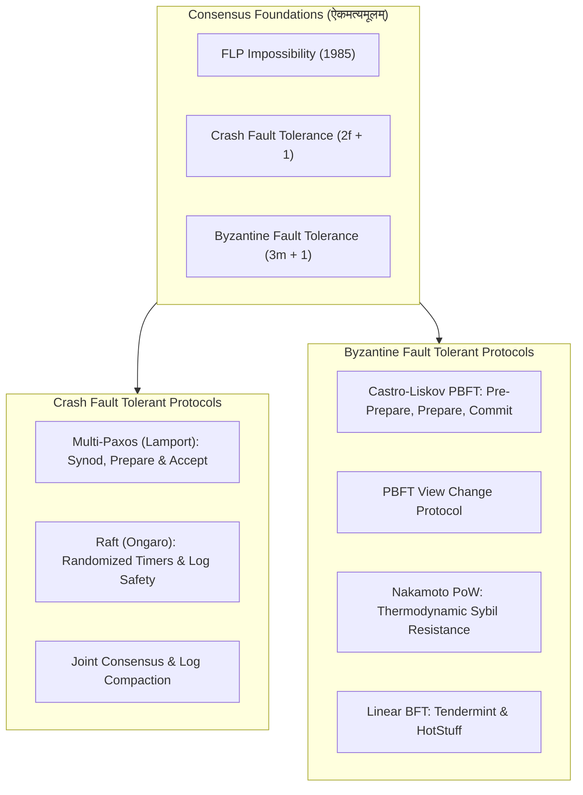

# ऐकमत्यपञ्चाशिका : गणतन्त्रविधिः
## *Fifty Classical Sanskrit Verses on Distributed Consensus: Multi-Paxos, Raft and Practical Byzantine Fault Tolerance (PBFT)*

> **ग्रन्थकारः (Author):** Vedant Madane & Antigravity  
> **छन्दः (Metre):** अनुष्टुप् (Anuṣṭubh - Pathyāvaktra rule, 8 syllables per pāda, strictly verified)  
> **व्याकरणम् (Grammar):** Complete Pāṇinian morphological analysis (पदच्छेद, प्रकृति, प्रत्यय, विभक्ति, कारकार्थ)  
> **विषयः (Subject):** Distributed Consensus, FLP Impossibility Theorem, Leslie Lamport's Paxos Synod and Multi-Paxos, Ongaro-Ousterhout's Raft Consensus, The Byzantine Generals Problem, Castro-Liskov PBFT, Nakamoto Consensus and Modern Fast BFT  

---

## प्रस्तावना (Introduction)

Distributed consensus is the fundamental bedrock of modern computing: enabling independent nodes separated by unreliable networks to agree on state machine commands despite crashes, partitions and malicious actors. The field progressed from the foundational FLP Impossibility Theorem (Fischer, Lynch, Paterson, 1985) to Leslie Lamport's groundbreaking Paxos Synod (1998) and Diego Ongaro and John Ousterhout's understandable Raft protocol (2014) in Crash Fault Tolerance (CFT).

Beyond crash faults lies the adversarial domain of Byzantine Fault Tolerance (BFT), formalised by Lamport, Shostak and Pease in 1982. Miguel Castro and Barbara Liskov brought BFT into real-world systems with Practical Byzantine Fault Tolerance (PBFT, 1999), laying the groundwork for Satoshi Nakamoto's Proof of Work consensus (2008) and modern linear BFT engines like Tendermint and HotStuff.

**ऐकमत्यपञ्चाशिका : गणतन्त्रविधिः** formalizes these foundational distributed consensus protocols across 50 metrically verified classical Sanskrit verses in the Anuṣṭubh metre, complete with comprehensive Pāṇinian grammatical analysis and deep engineering commentary.



---

## Canto 1: ऐकमत्यसङ्कटम् अशक्यतासिद्धान्तश्च
### *The Consensus Dilemma and the FLP Impossibility Theorem*

#### Verse 1

```sanskrit
ऐकमत्यस्य शास्त्रेऽस्मिन् त्रिविधं लक्षणं स्मृतम् ।
सर्वेषां सम्मतिः सत्यं समाप्तिश्च तथैव च ॥
```

**पदच्छेदः:** ऐकमत्यस्य शास्त्रे अस्मिन् त्रिविधम् लक्षणम् स्मृतम् । सर्वेषाम् सम्मतिः सत्यम् समाप्तिः च तथा एव च ॥

**पाणिनीय-व्याकरण-सारणी:**

| पदम् | मूलप्रकृतिः / धातुः | पदविभागः | विभक्तिः / प्रत्ययः | व्याख्या / कारकार्थः |
| :--- | :--- | :--- | :--- | :--- |
| **ऐकमत्यस्य** | `ऐकमत्य` | नपुंसकलिंग नाम | षष्ठी एकवचन | कन्सेन्सस्-शास्त्रस्य (of distributed consensus) |
| **शास्त्रे** | `शास्त्र` | नपुंसकलिंग नाम | सप्तमी एकवचन | विज्ञाने (in the science) |
| **अस्मिन्** | `इदम्` | सर्वनाम नपुंसकलिंग | सप्तमी एकवचन | अस्मिन् शास्त्रे (in this) |
| **त्रिविधम्** | `त्रि + विध` | विशेषण नपुंसकलिंग | प्रथमा एकवचन | त्रिप्रकारकम् (threefold) |
| **लक्षणम्** | `लक्षण` | नपुंसकलिंग नाम | प्रथमा एकवचन | मूलगुणाः (fundamental properties) |
| **स्मृतम्** | `√स्मृ + क्त` | कृदन्तरूप नपुंसकलिंग | प्रथमा एकवचन | प्रतिपादितम् (defined) |
| **सर्वेषाम्** | `सर्व` | सर्वनाम पुंलिंग | षष्ठी बहुवचन | सर्व-यन्त्राणाम् (of all non-faulty nodes) |
| **सम्मतिः** | `सम् + मति` | स्त्रीलिंग नाम | प्रथमा एकवचन | अग्रीमेन्ट् (Agreement: all agree on same value) |
| **सत्यम्** | `सत्य` | नपुंसकलिंग नाम | प्रथमा एकवचन | वैलिडिटि (Validity: decided value was proposed) |
| **समाप्तिः** | `सम् + आप् + क्तिन्` | स्त्रीलिंग नाम | प्रथमा एकवचन | टर्मिनेशन् (Termination: all correct nodes decide) |
| **च** | `च` | अव्ययम् | अव्ययम् | समुच्चये (and) |
| **तथा** | `तथा` | अव्ययम् | अव्ययम् | समुच्चये (likewise) |
| **एव** | `एव` | अव्ययम् | अव्ययम् | अवधारणे (certainly) |
| **च** | `च` | अव्ययम् | अव्ययम् | समुच्चये (and) |

**गणतन्त्रविधि-भाष्यम् (Distributed Systems Engineering Commentary):** The Triad of Consensus Properties: Distributed consensus requires a group of independent nodes to agree on a state machine command. Classical distributed systems theory defines consensus through three immutable safety and liveness invariants: Agreement (all non-faulty nodes decide on the exact same value), Validity (if a node decides value v, then v must have been proposed by some node) and Termination (all non-faulty nodes eventually decide on some value).

---

#### Verse 2

```sanskrit
जाले सन्देशसञ्चारे विलम्बः सम्प्रजायते ।
क्वचित् पातः क्वचिद्भङ्गो न कालनियमः स्थितः ॥
```

**पदच्छेदः:** जाले सन्देश-सञ्चारे विलम्बः सम्प्रजायते । क्वचित् पातः क्वचित् भङ्गः न काल-नियमः स्थितः ॥

**पाणिनीय-व्याकरण-सारणी:**

| पदम् | मूलप्रकृतिः / धातुः | पदविभागः | विभक्तिः / प्रत्ययः | व्याख्या / कारकार्थः |
| :--- | :--- | :--- | :--- | :--- |
| **जाले** | `जाल` | नपुंसकलिंग नाम | सप्तमी एकवचन | नेटवर्क्-जाले (in the network) |
| **सन्देशसञ्चारे** | `सन्देश + सञ्चार` | षष्ठी-तत्पुरुष पुंलिंग | सप्तमी एकवचन | सन्देशप्रेषणे (in packet transmission) |
| **विलम्बः** | `विलम्ब` | पुंलिंग नाम | प्रथमा एकवचन | लेटन्सि (arbitrary packet latency) |
| **सम्प्रजायते** | `सम् + प्र + √जन् + लट्` | आत्मनेपद लट् | प्रथमपुरुष एकवचन | उत्पद्यते (occurs) |
| **क्वचित्** | `क्वचित्` | अव्ययम् | अव्ययम् | कुत्रचित् (sometimes) |
| **पातः** | `पात` | पुंलिंग नाम | प्रथमा एकवचन | ड्रॉप् / लोपः (packet loss) |
| **क्वचित्** | `क्वचित्` | अव्ययम् | अव्ययम् | कुत्रचित् (sometimes) |
| **भङ्गः** | `भङ्ग` | पुंलिंग नाम | प्रथमा एकवचन | नेटवर्क्-विभाजनम् (network partition) |
| **न** | `न` | अव्ययम् | अव्ययम् | प्रतिषेधे (no) |
| **कालनियमः** | `काल + नियम` | षष्ठी-तत्पुरुष पुंलिंग | प्रथमा एकवचन | अपरिमितकालसीमा (bounded upper limit on delay) |
| **स्थितः** | `√स्था + क्त` | कृदन्तरूप पुंलिंग | प्रथमा एकवचन | विद्यते (exists in asynchronous models) |

**गणतन्त्रविधि-भाष्यम् (Distributed Systems Engineering Commentary):** The Asynchronous Network Model: In a purely asynchronous network, messages can be arbitrarily delayed, duplicated, reordered, or lost without an upper bound on transit time. Crucially, a node cannot distinguish whether a silent peer has crashed, is running slowly, or is separated by a network partition, making deterministic consensus extraordinarily difficult.

---

#### Verse 3

```sanskrit
कदाचिद् यन्त्रपातश्च कदाचित् कपटं भवेत् ।
द्विविधो वर्तते दोषो वितते सङ्गणोदधौ ॥
```

**पदच्छेदः:** कदाचित् यन्त्र-पातः च कदाचित् कपटम् भवेत् । द्विविधः वर्तते दोषः वितते सङ्गण-उदधौ ॥

**पाणिनीय-व्याकरण-सारणी:**

| पदम् | मूलप्रकृतिः / धातुः | पदविभागः | विभक्तिः / प्रत्ययः | व्याख्या / कारकार्थः |
| :--- | :--- | :--- | :--- | :--- |
| **कदाचित्** | `कदाचित्` | अव्ययम् | अव्ययम् | कस्मिंश्चित् समये (sometimes) |
| **यन्त्रपातः** | `यन्त्र + पात` | षष्ठी-तत्पुरुष पुंलिंग | प्रथमा एकवचन | क्रैश-दोषः (crash fault: fail-stop) |
| **च** | `च` | अव्ययम् | अव्ययम् | समुच्चये (and) |
| **कदाचित्** | `कदाचित्` | अव्ययम् | अव्ययम् | अन्यस्मिन् काले (at other times) |
| **कपटम्** | `कपट` | नपुंसकलिंग नाम | प्रथमा एकवचन | बायझण्टाइन्-दोषः (arbitrary malicious Byzantine fault) |
| **भवेत्** | `√भू + विधि-लिङ्` | परस्मैपद लिङ् | प्रथमपुरुष एकवचन | सम्भवेत् (may exist) |
| **द्विविधः** | `द्वि + विध` | विशेषण पुंलिंग | प्रथमा एकवचन | द्विप्रकारकः (twofold) |
| **वर्तते** | `√वृत् + लट्` | आत्मनेपद लट् | प्रथमपुरुष एकवचन | अस्ति (is) |
| **दोषः** | `दोष` | पुंलिंग नाम | प्रथमा एकवचन | फॉल्ट् (fault model) |
| **वितते** | `वि + √तन् + क्त` | कृदन्तरूप पुंलिंग | सप्तमी एकवचन | प्रसारिते (in the vast distributed) |
| **सङ्गणोदधौ** | `सङ्गणक + उदधि` | कर्मधारय पुंलिंग | सप्तमी एकवचन | सङ्गणक-सागरे (in the ocean of computing nodes) |

**गणतन्त्रविधि-भाष्यम् (Distributed Systems Engineering Commentary):** Crash Faults vs Byzantine Faults: Distributed failure models diverge into two great realms. In Crash Fault Tolerance (CFT - Paxos and Raft), nodes are honest but may crash, stop responding, or restart with lost volatile memory. In Byzantine Fault Tolerance (BFT - PBFT and Nakamoto), faulty nodes can act maliciously, send contradictory messages to different peers, forge identity, or collude to corrupt state.

---

#### Verse 4

```sanskrit
एकेऽपि पतिते यन्त्रे नैव सिद्धिः प्रजायते ।
असमकालिके जाले नियमोऽयं मुनीरितः ॥
```

**पदच्छेदः:** एके अपि पतिते यन्त्रे न एव सिद्धिः प्रजायते । असमकालिके जाले नियमः अयम् मुनि-ईरितः ॥

**पाणिनीय-व्याकरण-सारणी:**

| पदम् | मूलप्रकृतिः / धातुः | पदविभागः | विभक्तिः / प्रत्ययः | व्याख्या / कारकार्थः |
| :--- | :--- | :--- | :--- | :--- |
| **एके** | `एक` | संख्यावाचक नपुंसकलिंग | सप्तमी एकवचन | सति-सप्तमी : एकस्मिन् (even if a single) |
| **अपि** | `अपि` | अव्ययम् | अव्ययम् | सम्भवे (even) |
| **पतिते** | `√पत् + क्त` | कृदन्तरूप नपुंसकलिंग | सप्तमी एकवचन | सति-सप्तमी : क्रैश-दोषे (crashed / failed) |
| **यन्त्रे** | `यन्त्र` | नपुंसकलिंग नाम | सप्तमी एकवचन | सति-सप्तमी : नोड्-यन्त्रे (server node) |
| **न** | `न` | अव्ययम् | अव्ययम् | प्रतिषेधे (never) |
| **एव** | `एव` | अव्ययम् | अव्ययम् | अवधारणे (at all) |
| **सिद्धिः** | `सिद्धि` | स्त्रीलिंग नाम | प्रथमा एकवचन | निश्चयसिद्धिः (guaranteed termination / consensus) |
| **प्रजायते** | `प्र + √जन् + लट्` | आत्मनेपद लट् | प्रथमपुरुष एकवचन | सम्पद्यते (is achievable) |
| **असमकालिके** | `अ + समकालिक` | नञ्-तत्पुरुष नपुंसकलिंग | सप्तमी एकवचन | असिन्क्रोनस् (in an asynchronous) |
| **जाले** | `जाल` | नपुंसकलिंग नाम | सप्तमी एकवचन | नेटवर्के (network) |
| **नियमः** | `नियम` | पुंलिंग नाम | प्रथमा एकवचन | एफ्-एल्-पी-अशक्यता-सिद्धान्तः (the FLP impossibility principle) |
| **अयम्** | `इदम्` | सर्वनाम पुंलिंग | प्रथमा एकवचन | अयं नियमः (this law) |
| **मुनीरितः** | `मुनि + ईरित` | तृतीया-तत्पुरुष पुंलिंग | प्रथमा एकवचन | फिशर्-लिञ्च्-पैटर्सन्-ऋषिप्रोक्तः (proclaimed by Fischer, Lynch and Paterson) |

**गणतन्त्रविधि-भाष्यम् (Distributed Systems Engineering Commentary):** The FLP Impossibility Theorem (1985): Fischer, Lynch and Paterson mathematically proved that no deterministic consensus algorithm can guarantee both safety and liveness in an asynchronous network if even a single node can experience an unannounced crash. Because an indefinitely delayed message cannot be distinguished from a crashed sender, the algorithm risks infinite indecision.

---

#### Verse 5

```sanskrit
कालगतेः समाश्रित्य संशयं वारयन्ति ते ।
आंशिकेन विधानेन सम्मतिः सम्प्रसाध्यते ॥
```

**पदच्छेदः:** काल-गतेः समाश्रित्य संशयम् वारयन्ति ते । आंशिकेन विधानेन सम्मतिः सम्प्रसाध्यते ॥

**पाणिनीय-व्याकरण-सारणी:**

| पदम् | मूलप्रकृतिः / धातुः | पदविभागः | विभक्तिः / प्रत्ययः | व्याख्या / कारकार्थः |
| :--- | :--- | :--- | :--- | :--- |
| **कालगतेः** | `काल + गति` | षष्ठी-तत्पुरुष स्त्रीलिंग | पञ्चमी एकवचन | टाईम्-आउट्-अवलम्बनात् (from timeout assumptions) |
| **समाश्रित्य** | `सम् + आ + √श्रि + ल्यप्` | कृदन्तरूप अव्यय | अव्ययम् | स्वीकृत्य (relying upon) |
| **संशयम्** | `संशय` | पुंलिंग नाम | द्वितीया एकवचन | अनिर्णीतदोषम् (indecision dilemma) |
| **वारयन्ति** | `√वृ + णिच् + लट्` | परस्मैपद लट् | प्रथमपुरुष बहुवचन | निवारयन्ति (they bypass / circumvent) |
| **ते** | `तद्` | सर्वनाम पुंलिंग | प्रथमा बहुवचन | प्रणाल्याः शिल्पिणः (systems architects) |
| **आंशिकेन** | `आंशिक` | विशेषण नपुंसकलिंग | तृतीया एकवचन | पार्शियल्-सिन्क्रोनस् (with partial synchrony) |
| **विधानेन** | `विधान` | नपुंसकलिंग नाम | तृतीया एकवचन | कालनियमेन (by protocol design) |
| **सम्मतिः** | `सम् + मति` | स्त्रीलिंग नाम | प्रथमा एकवचन | ऐकमत्यम् (consensus) |
| **सम्प्रसाध्यते** | `सम् + प्र + साध् + णिच् + कर्मणि लट्` | कर्मणि लट् | प्रथमपुरुष एकवचन | निष्पाद्यते (is successfully achieved) |

**गणतन्त्रविधि-भाष्यम् (Distributed Systems Engineering Commentary):** Bypassing FLP via Partial Synchrony: Real-world consensus protocols circumvent FLP impossibility by adopting Partial Synchrony (Dwork, Lynch, Stockmeyer) or randomized timeouts. Protocols guarantee safety (never deciding conflicting values) unconditionally in all asynchronous network conditions, while relying on bounded delay periods (Global Stabilization Time) to achieve liveness.

---

## Canto 2: पाक्सोस-विधानम् एकादेशनिश्चयः
### *The Paxos Synod: Single-Decree Consensus*

#### Verse 6

```sanskrit
पाक्सोसस्य विधानेन लाम्पोर्टेन प्रदर्शिता ।
प्रस्तावका ग्रहीतारः शिक्षकाश्च त्रयः स्थिताः ॥
```

**पदच्छेदः:** पाक्सोसस्य विधानेन लाम्पोर्टेन प्रदर्शिता । प्रस्तावकाः ग्रहीतारः शिक्षकाः च त्रयः स्थिताः ॥

**पाणिनीय-व्याकरण-सारणी:**

| पदम् | मूलप्रकृतिः / धातुः | पदविभागः | विभक्तिः / प्रत्ययः | व्याख्या / कारकार्थः |
| :--- | :--- | :--- | :--- | :--- |
| **पाक्सोसस्य** | `पाक्सोस` | पुंलिंग नाम | षष्ठी एकवचन | पाक्सोस-शास्त्रस्य (of Paxos) |
| **विधानेन** | `विधान` | नपुंसकलिंग नाम | तृतीया एकवचन | आख्यायिकया (through the parliamentary protocol) |
| **लाम्पोर्टेन** | `लाम्पोर्ट्` | पुंलिंग नाम | तृतीया एकवचन | लेस्ली-लाम्पोर्ट्-ऋषिणा (by Leslie Lamport) |
| **प्रदर्शिता** | `प्र + √दृश् + णिच् + क्त` | कृदन्तरूप स्त्रीलिंग | प्रथमा एकवचन | उद्भाविता (introduced) |
| **प्रस्तावकाः** | `प्र + स्ताव + अक` | पुंलिंग नाम | प्रथमा बहुवचन | प्रपोजर्-यन्त्राणि (Proposers) |
| **ग्रहीतारः** | `ग्रहीतृ` | पुंलिंग नाम | प्रथमा बहुवचन | अक्सेप्टर्-यन्त्राणि (Acceptors) |
| **शिक्षकाः** | `शिक्षक` | पुंलिंग नाम | प्रथमा बहुवचन | लर्नर-यन्त्राणि (Learners) |
| **च** | `च` | अव्ययम् | अव्ययम् | समुच्चये (and) |
| **त्रयः** | `त्रि` | संख्यावाचक पुंलिंग | प्रथमा बहुवचन | त्रिविधाः (three roles) |
| **स्थिताः** | `√स्था + क्त` | कृदन्तरूप पुंलिंग | प्रथमा बहुवचन | प्रतिष्ठिताः (established) |

**गणतन्त्रविधि-भाष्यम् (Distributed Systems Engineering Commentary):** Lamport's Paxos Synod Roles: In 1998, Leslie Lamport published The Part-Time Parliament, formalizing distributed consensus through the Paxos island legislative allegory. The protocol divides participants into three functional roles: Proposers (advocate client commands), Acceptors (act as the voting parliament that stores memory) and Learners (observe decisions to update application state).

---

#### Verse 7

```sanskrit
संख्यां कृत्वा गरीयसीं प्रार्थनां प्रविमुञ्चति ।
प्रतिज्ञां कुर्वते चान्ये न्यूनसंख्यानिवारणे ॥
```

**पदच्छेदः:** संख्याम् कृत्वा गरीयसीम् प्रार्थनाम् प्रविमुञ्चति । प्रतिज्ञाम् कुर्वते च अन्ये न्यून-संख्या-निवारणे ॥

**पाणिनीय-व्याकरण-सारणी:**

| पदम् | मूलप्रकृतिः / धातुः | पदविभागः | विभक्तिः / प्रत्ययः | व्याख्या / कारकार्थः |
| :--- | :--- | :--- | :--- | :--- |
| **संख्याम्** | `संख्या` | स्त्रीलिंग नाम | द्वितीया एकवचन | प्रपोजल्-नम्बर n (monotonically increasing proposal number n) |
| **कृत्वा** | `√कृ + क्त्वा` | कृदन्तरूप अव्यय | अव्ययम् | उत्पाद्य (having generated) |
| **गरीयसीम्** | `गरीयस्` | विशेषण स्त्रीलिंग | द्वितीया एकवचन | श्रेष्ठतराम् (strictly higher than any previously seen) |
| **प्रार्थनाम्** | `प्रार्थना` | स्त्रीलिंग नाम | द्वितीया एकवचन | प्रिपेयर्-सन्देशम् (Phase 1a Prepare message) |
| **प्रविमुञ्चति** | `प्र + वि + √मुच् + लट्` | परस्मैपद लट् | प्रथमपुरुष एकवचन | प्रसारयति (broadcasts) |
| **प्रतिज्ञाम्** | `प्रतिज्ञा` | स्त्रीलिंग नाम | द्वितीया एकवचन | प्रामिस्-सन्देशम् (Phase 1b Promise) |
| **कुर्वते** | `√कृ + आत्मनेपद लट्` | आत्मनेपद लट् | प्रथमपुरुष बहुवचन | ददति (they commit) |
| **च** | `च` | अव्ययम् | अव्ययम् | समुच्चये (and) |
| **अन्ये** | `अन्य` | सर्वनाम पुंलिंग | प्रथमा बहुवचन | अक्सेप्टर्-जनाः (the Acceptors) |
| **न्यूनसंख्यानिवारणे** | `न्यून + संख्या + निवारण` | नपुंसकलिंग नाम | सप्तमी एकवचन | विषये : लघुसंख्यानिराकरणाय (in rejecting all future proposals less than n) |

**गणतन्त्रविधि-भाष्यम् (Distributed Systems Engineering Commentary):** Phase 1a (Prepare) and Phase 1b (Promise): A proposer chooses a unique, higher proposal number n and broadcasts Prepare(n) to a majority of acceptors. If an acceptor receives Prepare(n) with n greater than any proposal number it has seen, it returns Promise(n, max_accepted_proposal, max_accepted_val), pledging never to accept any future proposal numbered less than n.

---

#### Verse 8

```sanskrit
स्वीकाराय ततः पश्चाद् मूल्यं प्रेषयते बली ।
बहुभिः स्वीकृतं मूल्यं सिद्धं भवति सर्वथा ॥
```

**पदच्छेदः:** स्वीकाराय ततः पश्चात् मूल्यम् प्रेषयते बली । बहुभिः स्वीकृतम् मूल्यम् सिद्धम् भवति सर्वथा ॥

**पाणिनीय-व्याकरण-सारणी:**

| पदम् | मूलप्रकृतिः / धातुः | पदविभागः | विभक्तिः / प्रत्ययः | व्याख्या / कारकार्थः |
| :--- | :--- | :--- | :--- | :--- |
| **स्वीकाराय** | `स्वीकार` | पुंलिंग नाम | चतुर्थी एकवचन | तादर्थ्ये चतुर्थी : सम्मतये (for acceptance: Phase 2a Accept) |
| **ततः** | `ततः` | अव्ययम् | अव्ययम् | तदनन्तरम् (thereafter) |
| **पश्चात्** | `पश्चात्` | अव्ययम् | अव्ययम् | अनन्तरम् (subsequently) |
| **मूल्यम्** | `मूल्य` | नपुंसकलिंग नाम | द्वितीया एकवचन | दत्तांश-वैल्यू v (proposed value v) |
| **प्रेषयते** | `प्र + ईष् + णिच् + लट्` | आत्मनेपद लट् | प्रथमपुरुष एकवचन | विमुञ्चति (dispatches) |
| **बली** | `बलिन्` | पुंलिंग नाम | प्रथमा एकवचन | बहुमतप्राप्तः प्रस्तावकः (the proposer backed by a majority) |
| **बहुभिः** | `बहु` | विशेषण पुंलिंग | तृतीया बहुवचन | अक्सेप्टर्-बहुमतेन (by a quorum of acceptors) |
| **स्वीकृतम्** | `स्वी + √कृ + क्त` | कृदन्तरूप नपुंसकलिंग | प्रथमा एकवचन | अङ्गीकृतम् (accepted) |
| **मूल्यम्** | `मूल्य` | नपुंसकलिंग नाम | प्रथमा एकवचन | तत् मूल्यम् (that value v) |
| **सिद्धम्** | `√सिध् + क्त` | कृदन्तरूप नपुंसकलिंग | प्रथमा एकवचन | कमिट्-जातम् (chosen / committed) |
| **भवति** | `√भू + लट्` | परस्मैपद लट् | प्रथमपुरुष एकवचन | सम्पद्यते (becomes) |
| **सर्वथा** | `सर्वथा` | अव्ययम् | अव्ययम् | अखण्डरूपेण (permanently in every respect) |

**गणतन्त्रविधि-भाष्यम् (Distributed Systems Engineering Commentary):** Phase 2a (Accept) and Phase 2b (Accepted): If the proposer receives promises from a majority of acceptors, it selects value v (which must be the value with the highest proposal number among all returned promises, or its own value if none was reported). It broadcasts Accept(n, v). Acceptors accept proposal (n, v) unless they have already promised a higher number. Once a majority accepts, the value is permanently chosen.

---

#### Verse 9

```sanskrit
बहुमतद्वये प्राप्ते सङ्गमः सम्प्रजायते ।
एकेनापि समानेन सत्यं न व्यभिचारति ॥
```

**पदच्छेदः:** बहुमत-द्वये प्राप्ते सङ्गमः सम्प्रजायते । एकेन अपि समानेन सत्यम् न व्यभिचारति ॥

**पाणिनीय-व्याकरण-सारणी:**

| पदम् | मूलप्रकृतिः / धातुः | पदविभागः | विभक्तिः / प्रत्ययः | व्याख्या / कारकार्थः |
| :--- | :--- | :--- | :--- | :--- |
| **बहुमतद्वये** | `बहुमत + द्वय` | कर्मधारय नपुंसकलिंग | सप्तमी एकवचन | सति-सप्तमी : द्वयोः कोरमयोः (between any two majority quorums) |
| **प्राप्ते** | `प्र + √आप् + क्त` | कृदन्तरूप नपुंसकलिंग | सप्तमी एकवचन | सति-सप्तमी : उपस्थिते (having been examined) |
| **सङ्गमः** | `सङ्गम` | पुंलिंग नाम | प्रथमा एकवचन | इण्टरसेक्शन् (quorum intersection) |
| **सम्प्रजायते** | `सम् + प्र + √जन् + लट्` | आत्मनेपद लट् | प्रथमपुरुष एकवचन | अवश्यं भवति (must occur by the pigeonhole principle) |
| **एकेन** | `एक` | संख्यावाचक पुंलिंग | तृतीया एकवचन | एकमात्रेण (with at least one) |
| **अपि** | `अपि` | अव्ययम् | अव्ययम् | सम्भवे (even) |
| **समानेन** | `समान` | विशेषण पुंलिंग | तृतीया एकवचन | उभयस्थितेन अक्सेप्टर्-यन्त्रेण (overlapping acceptor node) |
| **सत्यम्** | `सत्य` | नपुंसकलिंग नाम | प्रथमा एकवचन | निर्णयैक्यम् (consistency invariant) |
| **न** | `न` | अव्ययम् | अव्ययम् | प्रतिषेधे (never) |
| **व्यभिचारति** | `वि + अभि + √चर् + लट्` | परस्मैपद लट् | प्रथमपुरुष एकवचन | न विचलति (violates or deviates) |

**गणतन्त्रविधि-भाष्यम् (Distributed Systems Engineering Commentary):** The Quorum Intersection Principle: The mathematical bedrock of Paxos is the pigeonhole principle: any two majorities of a cluster of size 2f + 1 must overlap in at least one acceptor node. Because any acceptor in the intersection promised not to accept smaller proposals and reported previously accepted values in Phase 1b, any future proposal is forced to adopt the already-chosen value.

---

#### Verse 10

```sanskrit
एकस्मिन् निश्चिते खण्डे निर्णयः स्थिरचेतसा ।
पाक्सोसस्य प्रभावेन जायतेऽखण्डितं फलम् ॥
```

**पदच्छेदः:** एकस्मिन् निश्चिते खण्डे निर्णयः स्थिर-चेतसा । पाक्सोसस्य प्रभावेन जायते अखण्डितम् फलम् ॥

**पाणिनीय-व्याकरण-सारणी:**

| पदम् | मूलप्रकृतिः / धातुः | पदविभागः | विभक्तिः / प्रत्ययः | व्याख्या / कारकार्थः |
| :--- | :--- | :--- | :--- | :--- |
| **एकस्मिन्** | `एक` | संख्यावाचक पुंलिंग | सप्तमी एकवचन | एकस्मिन् (in a single) |
| **निश्चिते** | `निस् + √चि + क्त` | कृदन्तरूप पुंलिंग | सप्तमी एकवचन | निर्धारिते (specified) |
| **खण्डे** | `खण्ड` | पुंलिंग नाम | सप्तमी एकवचन | लाग्-स्लाट्-पदे (in a consensus instance slot) |
| **निर्णयः** | `निर्णय` | पुंलिंग नाम | प्रथमा एकवचन | कमिट्-कृत्यम् (final commitment) |
| **स्थिरचेतसा** | `स्थिर + चेतस्` | बहुव्रीहि पुंलिंग | तृतीया एकवचन | अविचलभावेन (with permanent irrevocability) |
| **पाक्सोसस्य** | `पाक्सोस` | पुंलिंग नाम | षष्ठी एकवचन | पाक्सोस-प्रणाल्याः (of Paxos) |
| **प्रभावेन** | `प्रभाव` | पुंलिंग नाम | तृतीया एकवचन | सामर्थ्येन (by the power) |
| **जायते** | `√जन् + लट्` | आत्मनेपद लट् | प्रथमपुरुष एकवचन | उत्पद्यते (is established) |
| **अखण्डितम्** | `नञ् + खण्डित` | विशेषण नपुंसकलिंग | प्रथमा एकवचन | अविनाशि (incorruptible) |
| **फलम्** | `फल` | नपुंसकलिंग नाम | प्रथमा एकवचन | ऐकमत्यफलम् (consensus outcome) |

**गणतन्त्रविधि-भाष्यम् (Distributed Systems Engineering Commentary):** Single-Decree Finality: The Synod protocol guarantees safety for a single decree: once a value has been chosen by a majority quorum, no different value can ever be chosen for that slot, regardless of message delays, partitions, or node restarts.

---

## Canto 3: बहुपाक्सोस-क्रमः स्थिरशासनम्
### *Multi-Paxos and Steady-State Consensus for Replicated Logs*

#### Verse 11

```sanskrit
अनेकेषु च खण्डेषु धारा प्रवहते सदा ।
बहुपाक्सोस-तन्त्रेण राज्यं संस्थाप्यते दृढम् ॥
```

**पदच्छेदः:** अनेकेषु च खण्डेषु धारा प्रवहते सदा । बहु-पाक्सोस-तन्त्रेण राज्यम् संस्थाप्यते दृढम् ॥

**पाणिनीय-व्याकरण-सारणी:**

| पदम् | मूलप्रकृतिः / धातुः | पदविभागः | विभक्तिः / प्रत्ययः | व्याख्या / कारकार्थः |
| :--- | :--- | :--- | :--- | :--- |
| **अनेकेषु** | `अनेक` | विशेषण पुंलिंग | सप्तमी बहुवचन | बहुषु (in multiple sequential) |
| **च** | `च` | अव्ययम् | अव्ययम् | समुच्चये (and) |
| **खण्डेषु** | `खण्ड` | पुंलिंग नाम | सप्तमी बहुवचन | लाग्-स्लाट्-विभागेषु (in log slot indices) |
| **धारा** | `धारा` | स्त्रीलिंग नाम | प्रथमा एकवचन | आज्ञाप्रवाहः (stream of state machine commands) |
| **प्रवहते** | `प्र + √वह् + लट्` | आत्मनेपद लट् | प्रथमपुरुष एकवचन | सञ्चरति (flows) |
| **सदा** | `सदा` | अव्ययम् | अव्ययम् | नित्यम् (continuously) |
| **बहुपाक्सोसतन्त्रेण** | `बहु + पाक्सोस + तन्त्र` | कर्मधारय नपुंसकलिंग | तृतीया एकवचन | मल्टी-पाक्सोस-प्रणाल्या (through the Multi-Paxos protocol) |
| **राज्यम्** | `राज्य` | नपुंसकलिंग नाम | प्रथमा एकवचन | स्टेट्-मशीन्-शासनम् (replicated state machine governance) |
| **संस्थाप्यते** | `सम् + √स्था + णिच् + कर्मणि लट्` | कर्मणि लट् | प्रथमपुरुष एकवचन | प्रतिष्ठाप्यते (is established) |
| **दृढम्** | `दृढ` | विशेषण नपुंसकलिंग | प्रथमा एकवचन | स्थिरम् (robustly) |

**गणतन्त्रविधि-भाष्यम् (Distributed Systems Engineering Commentary):** Multi-Paxos for Replicated Logs: Real databases require deciding an infinite stream of commands, not just a single decree. Multi-Paxos extends the Synod protocol across an array of log slots (indices 1, 2, 3...). By executing a single Phase 1 across all future slots, a stable leader can commit subsequent log entries in a single round-trip (Phase 2 only).

---

#### Verse 12

```sanskrit
स्थिरं नेतारमुद्भाव्य कार्यं कुर्वन्ति सत्वरम् ।
प्रथमं पर्व सन्त्यज्य गतिर्वर्धेत कोटिशः ॥
```

**पदच्छेदः:** स्थिरम् नेतारम् उद्भाव्य कार्यम् कुर्वन्ति सत्वरम् । प्रथमम् पर्व सन्त्यज्य गतिः वर्धेत कोटिशः ॥

**पाणिनीय-व्याकरण-सारणी:**

| पदम् | मूलप्रकृतिः / धातुः | पदविभागः | विभक्तिः / प्रत्ययः | व्याख्या / कारकार्थः |
| :--- | :--- | :--- | :--- | :--- |
| **स्थिरम्** | `स्थिर` | विशेषण पुंलिंग | द्वितीया एकवचन | स्थायिनम् (a stable, long-lived) |
| **नेतारम्** | `नेतृ` | पुंलिंग नाम | द्वितीया एकवचन | पाक्सोस-लीडर्-अध्यक्षम् (Paxos leader) |
| **उद्भाव्य** | `उद् + √भू + णिच् + ल्यप्` | कृदन्तरूप अव्यय | अव्ययम् | निर्वाच्य (having elected) |
| **कार्यम्** | `कार्य` | नपुंसकलिंग नाम | द्वितीया एकवचन | आज्ञापालनम् (log replication duty) |
| **कुर्वन्ति** | `√कृ + लट्` | परस्मैपद लट् | प्रथमपुरुष बहुवचन | निष्पादयन्ति (they execute) |
| **सत्वरम्** | `स + त्वरा` | क्रियाविशेषणम् | अव्ययम् | शीघ्रम् (swiftly) |
| **प्रथमम्** | `प्रथम` | विशेषण नपुंसकलिंग | द्वितीया एकवचन | फेज्-१-प्रिपेयर् (Phase 1 Prepare/Promise) |
| **पर्व** | `पर्वन्` | नपुंसकलिंग नाम | द्वितीया एकवचन | सोपानम् (phase) |
| **सन्त्यज्य** | `सम् + त्यज् + ल्यप्` | कृदन्तरूप अव्यय | अव्ययम् | अपाकृत्य (bypassing in steady state) |
| **गतिः** | `गति` | स्त्रीलिंग नाम | प्रथमा एकवचन | थ्रूपुट्-वेगः (throughput speed) |
| **वर्धेत** | `√वृध् + विधि-लिङ्` | आत्मनेपद लिङ् | प्रथमपुरुष एकवचन | प्रसरति (multiplies) |
| **कोटिशः** | `कोटि + शस्` | अव्ययम् | अव्ययम् | अनन्तगुणम् (massively) |

**गणतन्त्रविधि-भाष्यम् (Distributed Systems Engineering Commentary):** Skipping Phase 1 in Steady-State: In the steady state of Multi-Paxos, once a leader has successfully sent a Prepare message covering all uncommitted slots, it dispenses with Phase 1 for all subsequent log appends. Each incoming client transaction is committed with a single Phase 2 (Accept/Accepted) round trip, achieving optimal performance.

---

#### Verse 13

```sanskrit
रन्ध्रस्य पूरणं कृत्वा क्रमबद्धं प्रवर्तते ।
अनुपातान् समालोक्य सङ्ख्यापूर्त्या प्रपाल्यते ॥
```

**पदच्छेदः:** रन्ध्रस्य पूरणम् कृत्वा क्रम-बद्धम् प्रवर्तते । अनुपातान् समालोक्य सङ्ख्या-पूर्त्या प्रपाल्यते ॥

**पाणिनीय-व्याकरण-सारणी:**

| पदम् | मूलप्रकृतिः / धातुः | पदविभागः | विभक्तिः / प्रत्ययः | व्याख्या / कारकार्थः |
| :--- | :--- | :--- | :--- | :--- |
| **रन्ध्रस्य** | `रन्ध्र` | नपुंसकलिंग नाम | षष्ठी एकवचन | लाग्-ग्याप् / रिक्तस्थानस्य (of an uncommitted log gap / slot) |
| **पूरणम्** | `पूरण` | नपुंसकलिंग नाम | द्वितीया एकवचन | नो-आप्-पूरणम् (filling with a no-op command) |
| **कृत्वा** | `√कृ + क्त्वा` | कृदन्तरूप अव्यय | अव्ययम् | सम्पाद्य (having performed) |
| **क्रमबद्धम्** | `क्रम + बद्ध` | क्रियाविशेषणम् | अव्ययम् | सीक्वन्शियल-क्रमेण (in strict sequential log order) |
| **प्रवर्तते** | `प्र + √वृत् + लट्` | आत्मनेपद लट् | प्रथमपुरुष एकवचन | कार्यं करोति (executes on state machine) |
| **अनुपातान्** | `अनु + पात` | पुंलिंग नाम | द्वितीया बहुवचन | अक्रमप्राप्तान् (out-of-order slots) |
| **समालोक्य** | `सम् + आ + √लोक् + ल्यप्` | कृदन्तरूप अव्यय | अव्ययम् | अवबुध्य (having checked) |
| **सङ्ख्यापूर्त्या** | `सङ्ख्या + पूर्ति` | षष्ठी-तत्पुरुष स्त्रीलिंग | तृतीया एकवचन | सकलक्रमसमाप्त्या (by completing contiguous sequence) |
| **प्रपाल्यते** | `प्र + √पाल् + कर्मणि लट्` | कर्मणि लट् | प्रथमपुरुष एकवचन | रक्ष्यते (is maintained) |

**गणतन्त्रविधि-भाष्यम् (Distributed Systems Engineering Commentary):** Handling Log Gaps in Multi-Paxos: Because Multi-Paxos allows out-of-order slot proposals, network partitions or leader crashes can leave uncommitted 'gaps' (empty log indices). State machines can only execute commands contiguously; therefore, a recovering leader proposes empty 'no-op' transactions to fill uncommitted gaps before executing later slots.

---

#### Verse 14

```sanskrit
नेतरि प्रविपन्ने तु जायते सङ्कटाकुलम् ।
नवीनः पाक्सोसो भूत्वा रिक्तस्थानानि पूरयेत् ॥
```

**पदच्छेदः:** नेतरि प्रविपन्ने तु जायते सङ्कट-आकुलम् । नवीनः पाक्सोसः भूत्वा रिक्त-स्थानानि पूरयेत् ॥

**पाणिनीय-व्याकरण-सारणी:**

| पदम् | मूलप्रकृतिः / धातुः | पदविभागः | विभक्तिः / प्रत्ययः | व्याख्या / कारकार्थः |
| :--- | :--- | :--- | :--- | :--- |
| **नेतरि** | `नेतृ` | पुंलिंग नाम | सप्तमी एकवचन | सति-सप्तमी : लीडर्-नोड्-यन्त्रे (when the leader) |
| **प्रविपन्ने** | `प्र + वि + √पद् + क्त` | कृदन्तरूप पुंलिंग | सप्तमी एकवचन | सति-सप्तमी : मृते / पतिते सति (crashes / fails) |
| **तु** | `तु` | अव्ययम् | अव्ययम् | विशेषे (indeed) |
| **जायते** | `√जन् + लट्` | आत्मनेपद लट् | प्रथमपुरुष एकवचन | उत्पद्यते (arises) |
| **सङ्कटाकुलम्** | `सङ्कट + आकुल` | कर्मधारय नपुंसकलिंग | प्रथमा एकवचन | संशयसङ्कटम् (the chaos of transition) |
| **नवीनः** | `नवीन` | विशेषण पुंलिंग | प्रथमा एकवचन | नूतनः नेता (the newly elected candidate) |
| **पाक्सोसः** | `पाक्सोस` | पुंलिंग नाम | प्रथमा एकवचन | प्रस्तावकः (the Paxos coordinator) |
| **भूत्वा** | `√भू + क्त्वा` | कृदन्तरूप अव्यय | अव्ययम् | स्थित्वा (having become) |
| **रिक्तस्थानानि** | `रिक्त + स्थान` | कर्मधारय नपुंसकलिंग | द्वितीया बहुवचन | अनिर्णीत-स्लाट्-पदानि (all uncommitted log slots) |
| **पूरयेत्** | `√पूर् + णिच् + विधि-लिङ्` | परस्मैपद लिङ् | प्रथमपुरुष एकवचन | समापयेत् (must resolve and finalize) |

**गणतन्त्रविधि-भाष्यम् (Distributed Systems Engineering Commentary):** Leader Failover in Multi-Paxos: When a Paxos leader crashes, a new candidate issues a Phase 1 Prepare message with a higher proposal number covering all slots beyond its local commit index. Acceptors return any uncommitted values accepted from the dead leader, which the new leader re-proposes and commits before accepting new client traffic.

---

#### Verse 15

```sanskrit
गुगलस्य च चाबी स्याद् स्पैनरस्य च वैभवम् ।
पाक्सोसस्य विधानेन धार्यते सकलं जगत् ॥
```

**पदच्छेदः:** गुगलस्य च चाबी स्यात् स्पैनरस्य च वैभवम् । पाक्सोसस्य विधानेन धार्यते सकलम् जगत् ॥

**पाणिनीय-व्याकरण-सारणी:**

| पदम् | मूलप्रकृतिः / धातुः | पदविभागः | विभक्तिः / प्रत्ययः | व्याख्या / कारकार्थः |
| :--- | :--- | :--- | :--- | :--- |
| **गुगलस्य** | `गुगल` | पुंलिंग नाम | षष्ठी एकवचन | गुगल्-संस्थायाः (of Google) |
| **च** | `च` | अव्ययम् | अव्ययम् | समुच्चये (and) |
| **चाबी** | `चाबी` | स्त्रीलिंग नाम | प्रथमा एकवचन | चब्बी-लाक्-सर्विस (the Chubby Lock Service) |
| **स्यात्** | `√अस् + विधि-लिङ्` | परस्मैपद लिङ् | प्रथमपुरुष एकवचन | विद्यते (stands) |
| **स्पैनरस्य** | `स्पैनर` | पुंलिंग नाम | षष्ठी एकवचन | गुगल्-स्पैनर-तन्त्रस्य (of Google Spanner) |
| **च** | `च` | अव्ययम् | अव्ययम् | समुच्चये (and) |
| **वैभवम्** | `वैभव` | नपुंसकलिंग नाम | प्रथमा एकवचन | ऐश्वर्यम् (distributed majesty) |
| **पाक्सोसस्य** | `पाक्सोस` | पुंलिंग नाम | षष्ठी एकवचन | पाक्सोस-प्रविधेः (of Paxos) |
| **विधानेन** | `विधान` | नपुंसकलिंग नाम | तृतीया एकवचन | नियमनेन (by the protocol architecture) |
| **धार्यते** | `√धृ + कर्मणि लट्` | कर्मणि लट् | प्रथमपुरुष एकवचन | रक्ष्यते (is sustained) |
| **सकलम्** | `सकल` | विशेषण नपुंसकलिंग | प्रथमा एकवचन | समग्रम् (the entire global infrastructure) |
| **जगत्** | `जगत्` | नपुंसकलिंग नाम | प्रथमा एकवचन | क्लाउड्-विश्वम् (cloud world) |

**गणतन्त्रविधि-भाष्यम् (Distributed Systems Engineering Commentary):** Industrial Proof of Multi-Paxos: In 2007, Google published Paxos Made Live, revealing how its foundational coordination infrastructure (Chubby Lock Service, Bigtable and Spanner) was built directly on Multi-Paxos. Multi-Paxos proved that formal mathematical consensus can operate with sub-second failovers at planetary scale.

---

## Canto 4: राफ्ट्-गणतन्त्रम् सुबोधविधानम्
### *Raft Consensus: Understandability by Design, Leader Election and Log Safety*

#### Verse 16

```sanskrit
सुबोधाय विधानेन राफ्ट्-तन्त्रं प्रतिष्ठितम् ।
विभज्य सङ्कटं सर्वं सुखेन प्रतिपाद्यते ॥
```

**पदच्छेदः:** सुबोधाय विधानेन राफ्ट्-तन्त्रम् प्रतिष्ठितम् । विभज्य सङ्कटम् सर्वम् सुखेन प्रतिपाद्यते ॥

**पाणिनीय-व्याकरण-सारणी:**

| पदम् | मूलप्रकृतिः / धातुः | पदविभागः | विभक्तिः / प्रत्ययः | व्याख्या / कारकार्थः |
| :--- | :--- | :--- | :--- | :--- |
| **सुबोधाय** | `सुबोध` | पुंलिंग नाम | चतुर्थी एकवचन | तादर्थ्ये चतुर्थी : अन्डरस्ट्यान्डेबिलिटि-गुणाय (for understandability) |
| **विधानेन** | `विधान` | नपुंसकलिंग नाम | तृतीया एकवचन | ओङ्गारो-औस्टर्हाउट्-रचनया (by Ongaro and Ousterhout's design) |
| **राफ्ट्तन्त्रम्** | `राफ्ट् + तन्त्र` | कर्मधारय नपुंसकलिंग | प्रथमा एकवचन | राफ्ट्-कन्सेन्सस् (the Raft consensus algorithm) |
| **प्रतिष्ठितम्** | `प्रति + √स्था + क्त` | कृदन्तरूप नपुंसकलिंग | प्रथमा एकवचन | निर्मितम् (was established) |
| **विभज्य** | `वि + √भज् + ल्यप्` | कृदन्तरूप अव्यय | अव्ययम् | पृथक्कृत्य (having decomposed) |
| **सङ्कटम्** | `सङ्कट` | नपुंसकलिंग नाम | द्वितीया एकवचन | ऐकमत्यसमस्याम् (the consensus challenge) |
| **सर्वम्** | `सर्व` | विशेषण नपुंसकलिंग | द्वितीया एकवचन | समग्रम् (entire) |
| **सुखेन** | `सुख` | नपुंसकलिंग नाम | तृतीया एकवचन | सरलतया (intuitively) |
| **प्रतिपाद्यते** | `प्रति + पद् + णिच् + कर्मणि लट्` | कर्मणि लट् | प्रथमपुरुष एकवचन | उपदिष्टं भवति (is elucidated) |

**गणतन्त्रविधि-भाष्यम् (Distributed Systems Engineering Commentary):** Raft's Understandability by Design: In 2014, Diego Ongaro and John Ousterhout published In Search of an Understandable Consensus Algorithm, creating Raft. Recognizing that Multi-Paxos was notoriously opaque and difficult to implement, Raft explicitly designed for human understandability by decomposing consensus into three independent subproblems: Leader Election, Log Replication and Safety.

---

#### Verse 17

```sanskrit
यादृच्छिकेन कालेन घटिका परिवर्तते ।
विवादं संशमार्थाय नेता सत्वरमुच्यते ॥
```

**पदच्छेदः:** यादृच्छिकेन कालेन घटिका परिवर्तते । विवादम् संशम-अर्थाय नेता सत्वरम् उच्यते ॥

**पाणिनीय-व्याकरण-सारणी:**

| पदम् | मूलप्रकृतिः / धातुः | पदविभागः | विभक्तिः / प्रत्ययः | व्याख्या / कारकार्थः |
| :--- | :--- | :--- | :--- | :--- |
| **यादृच्छिकेन** | `यादृच्छिक` | विशेषण पुंलिंग | तृतीया एकवचन | रैन्डम्-मानेन (with randomized) |
| **कालेन** | `काल` | पुंलिंग नाम | तृतीया एकवचन | टाईम्-आउट्-कालेन (election timeout: 150-300ms) |
| **घटिका** | `घटिका` | स्त्रीलिंग नाम | प्रथमा एकवचन | इलेक्शन्-टाईमर् (the election timer) |
| **परिवर्तते** | `परि + √वृत् + लट्` | आत्मनेपद लट् | प्रथमपुरुष एकवचन | समाप्यते (expires) |
| **विवादम्** | `विवाद` | पुंलिंग नाम | द्वितीया एकवचन | स्प्लिट्-वोट्-दोषम् (split-vote dilemma) |
| **संशमार्थाय** | `संशम + अर्थ` | तादर्थ्य-अव्यय | अव्ययम् | शान्तये (for extinguishing) |
| **नेता** | `नेतृ` | पुंलिंग नाम | प्रथमा एकवचन | राफ्ट्-लीडर् (the Raft leader) |
| **सत्वरम्** | `स + त्वरा` | क्रियाविशेषणम् | अव्ययम् | झटिति (swiftly) |
| **उच्यते** | `√वच् + कर्मणि लट्` | कर्मणि लट् | प्रथमपुरुष एकवचन | निर्वाचितो भवति (is elected) |

**गणतन्त्रविधि-भाष्यम् (Distributed Systems Engineering Commentary):** Randomized Election Timers: Raft solves the split-vote dilemma in leader elections using randomized election timeouts (e.g. 150 to 300 ms). Because timeouts are randomized across followers, usually a single node's timer expires first. That candidate increments its term, votes for itself and gathers votes from a majority before other nodes timeout, electing a unique leader smoothly.

---

#### Verse 18

```sanskrit
आज्ञामूल्यं समादाय पत्रं लिखति सादरम् ।
बहुभिः संस्तुते पश्चाद् दृढं भवति तद् वचः ॥
```

**पदच्छेदः:** आज्ञा-मूल्यम् समादाय पत्रम् लिखति सादरम् । बहुभिः संस्तुते पश्चात् दृढम् भवति तत् वचः ॥

**पाणिनीय-व्याकरण-सारणी:**

| पदम् | मूलप्रकृतिः / धातुः | पदविभागः | विभक्तिः / प्रत्ययः | व्याख्या / कारकार्थः |
| :--- | :--- | :--- | :--- | :--- |
| **आज्ञामूल्यम्** | `आज्ञा + मूल्य` | कर्मधारय नपुंसकलिंग | द्वितीया एकवचन | क्लायन्ट्-कमाण्ड् (client state machine command) |
| **समादाय** | `सम् + आ + √दा + ल्यप्` | कृदन्तरूप अव्यय | अव्ययम् | स्वीकृत्य (having received) |
| **पत्रम्** | `पत्र` | नपुंसकलिंग नाम | द्वितीया एकवचन | लाग्-एण्ट्री (log entry) |
| **लिखति** | `√लिख् + लट्` | परस्मैपद लट् | प्रथमपुरुष एकवचन | अङ्कयति (appends to log) |
| **सादरम्** | `स + आदर` | क्रियाविशेषणम् | अव्ययम् | सावधानेन (methodically) |
| **बहुभिः** | `बहु` | विशेषण पुंलिंग | तृतीया बहुवचन | फाॅलोवर्-बहुमतेन (by a majority quorum of followers) |
| **संस्तुते** | `सम् + √स्तु + क्त` | कृदन्तरूप नपुंसकलिंग | सप्तमी एकवचन | सति-सप्तमी : प्रतिकृते सति (upon being acknowledged via AppendEntries) |
| **पश्चात्** | `पश्चात्` | अव्ययम् | अव्ययम् | अनन्तरम् (thereafter) |
| **दृढम्** | `दृढ` | विशेषण नपुंसकलिंग | प्रथमा एकवचन | कमिट्-जातम् (committed) |
| **भवति** | `√भू + लट्` | परस्मैपद लट् | प्रथमपुरुष एकवचन | सम्पद्यते (becomes) |
| **तत्** | `तद्` | सर्वनाम नपुंसकलिंग | प्रथमा एकवचन | तत् पत्रम् (that command) |
| **वचः** | `वचस्` | नपुंसकलिंग नाम | प्रथमा एकवचन | आज्ञावचनम् (entry) |

**गणतन्त्रविधि-भाष्यम् (Distributed Systems Engineering Commentary):** Log Replication and Commit Rule: When the leader receives a client command, it assigns it the current term, appends it to its local log and issues AppendEntries RPCs in parallel to all followers. Once the entry has been replicated across a majority of followers, the leader marks it committed, applies it to its local state machine and returns success to the client.

---

#### Verse 19

```sanskrit
यस्य पत्रं भवेज्ज्येष्ठं सम्पूर्णं विमलं तथा ।
स एव लभते राज्यं नेतृत्वाय प्रदीयते ॥
```

**पदच्छेदः:** यस्य पत्रम् भवेत् ज्येष्ठम् सम्पूर्णम् विमलम् तथा । सः एव लभते राज्यम् नेतृत्वाय प्रदीयते ॥

**पाणिनीय-व्याकरण-सारणी:**

| पदम् | मूलप्रकृतिः / धातुः | पदविभागः | विभक्तिः / प्रत्ययः | व्याख्या / कारकार्थः |
| :--- | :--- | :--- | :--- | :--- |
| **यस्य** | `यद्` | सर्वनाम पुंलिंग | षष्ठी एकवचन | यस्य क्यान्डिडेट्-नोडस्य (of whichever candidate) |
| **पत्रम्** | `पत्र` | नपुंसकलिंग नाम | प्रथमा एकवचन | लाग्-सञ्चयः (log history) |
| **भवेत्** | `√भू + विधि-लिङ्` | परस्मैपद लिङ् | प्रथमपुरुष एकवचन | विद्येत (is) |
| **ज्येष्ठम्** | `ज्येष्ठ` | विशेषण नपुंसकलिंग | प्रथमा एकवचन | अतिशयेन नवीनम् (higher last-log term) |
| **सम्पूर्णम्** | `सम् + पूर्ण` | विशेषण नपुंसकलिंग | प्रथमा एकवचन | दीर्घतमम् (longer log index) |
| **विमलम्** | `विमल` | विशेषण नपुंसकलिंग | प्रथमा एकवचन | शुद्धम् (consistent) |
| **तथा** | `तथा` | अव्ययम् | अव्ययम् | समुच्चये (and) |
| **सः** | `तद्` | सर्वनाम पुंलिंग | प्रथमा एकवचन | स क्यान्डिडेट् (that candidate) |
| **एव** | `एव` | अव्ययम् | अव्ययम् | अवधारणे (alone) |
| **लभते** | `√लभ् + लट्` | आत्मनेपद लट् | प्रथमपुरुष एकवचन | प्राप्नोति (receives) |
| **राज्यम्** | `राज्य` | नपुंसकलिंग नाम | द्वितीया एकवचन | बहुमतम् (majority votes) |
| **नेतृत्वाय** | `नेतृत्व` | नपुंसकलिंग नाम | चतुर्थी एकवचन | तादर्थ्ये चतुर्थी : लीडर्-पदवीर्थम् (for leadership) |
| **प्रदीयते** | `प्र + √दा + कर्मणि लट्` | कर्मणि लट् | प्रथमपुरुष एकवचन | स्वीक्रियते (is elected) |

**गणतन्त्रविधि-भाष्यम् (Distributed Systems Engineering Commentary):** Election Restriction Invariant: Unlike Multi-Paxos where a newly elected leader may lack committed entries from prior leaders and must patch gaps, Raft enforces the Election Restriction: a voter denies its vote if the candidate's log is less up-to-date than its own (comparing last log term, then log length). This guarantees the elected leader already contains every committed entry.

---

#### Verse 20

```sanskrit
समर्पितं न नश्येत नेतृणामपि सम्प्लवे ।
अखण्डा वर्तते रक्षा राफ्ट्-शास्त्रस्य तेजसा ॥
```

**पदच्छेदः:** समर्पितम् न नश्येत नेतॄणाम् अपि सम्प्लवे । अखण्डा वर्तते रक्षा राफ्ट्-शास्त्रस्य तेजसा ॥

**पाणिनीय-व्याकरण-सारणी:**

| पदम् | मूलप्रकृतिः / धातुः | पदविभागः | विभक्तिः / प्रत्ययः | व्याख्या / कारकार्थः |
| :--- | :--- | :--- | :--- | :--- |
| **समर्पितम्** | `सम् + अर्प् + क्त` | कृदन्तरूप नपुंसकलिंग | प्रथमा एकवचन | कमिट्-जातं पत्रम् (committed log entry) |
| **न** | `न` | अव्ययम् | अव्ययम् | प्रतिषेधे (never) |
| **नश्येत** | `√नश् + विधि-लिङ्` | परस्मैपद लिङ् | प्रथमपुरुष एकवचन | विलुप्येत (can be lost or overwritten) |
| **नेतॄणाम्** | `नेतृ` | पुंलिंग नाम | षष्ठी बहुवचन | नाना-लीडर-यन्त्राणाम् (of successive leaders) |
| **अपि** | `अपि` | अव्ययम् | अव्ययम् | सम्भवे (even) |
| **सम्प्लवे** | `सम्प्लव` | पुंलिंग नाम | सप्तमी एकवचन | सति-सप्तमी : क्रैश-परिवर्तने (in catastrophic crash transitions) |
| **अखण्डा** | `अखण्ड` | विशेषण स्त्रीलिंग | प्रथमा एकवचन | अविनाशिनी (invulnerable) |
| **वर्तते** | `√वृत् + लट्` | आत्मनेपद लट् | प्रथमपुरुष एकवचन | अस्ति (remains) |
| **रक्षा** | `रक्षा` | स्त्रीलिंग नाम | प्रथमा एकवचन | सेफ्टि-मर्यादा (the Leader Completeness safety guarantee) |
| **राफ्ट्शास्त्रस्य** | `राफ्ट् + शास्त्र` | षष्ठी-तत्पुरुष नपुंसकलिंग | षष्ठी एकवचन | राफ्ट्-सिद्धान्तस्य (of the Raft algorithm) |
| **तेजसा** | `तेजस्` | नपुंसकलिंग नाम | तृतीया एकवचन | प्रभावेन (by the mathematical brilliance) |

**गणतन्त्रविधि-भाष्यम् (Distributed Systems Engineering Commentary):** Leader Completeness Safety Property: The supreme safety property of Raft is Leader Completeness: if a log entry is committed in a given term, then that entry will be present in the logs of the leaders for all higher-numbered terms. A Raft leader never overwrites or truncates its own log; it only appends, guaranteeing that committed state is never lost.

---

## Canto 5: पाक्सोस-राफ्ट्-तुलना ऐक्यविवेकश्च
### *Comparative CFT: Paxos vs Raft Equivalence, Quorums and Membership Changes*

#### Verse 21

```sanskrit
पाक्सोसस्य च राफ्टस्य तुल्यता वर्तते परा ।
द्वयोरपि भवेन्मूलं बहुमतस्य संस्थितिः ॥
```

**पदच्छेदः:** पाक्सोसस्य च राफ्टस्य तुल्यता वर्तते परा । द्वयोः अपि भवेत् मूलम् बहुमतस्य संस्थितिः ॥

**पाणिनीय-व्याकरण-सारणी:**

| पदम् | मूलप्रकृतिः / धातुः | पदविभागः | विभक्तिः / प्रत्ययः | व्याख्या / कारकार्थः |
| :--- | :--- | :--- | :--- | :--- |
| **पाक्सोसस्य** | `पाक्सोस` | पुंलिंग नाम | षष्ठी एकवचन | पाक्सोस-शास्त्रस्य (of Paxos) |
| **च** | `च` | अव्ययम् | अव्ययम् | समुच्चये (and) |
| **राफ्टस्य** | `राफ्ट्` | पुंलिंग नाम | षष्ठी एकवचन | राफ्ट्-तन्त्रस्य (of Raft) |
| **तुल्यता** | `तुल्य + ता` | स्त्रीलिंग नाम | प्रथमा एकवचन | इक्विवेलन्स् (mathematical equivalence) |
| **वर्तते** | `√वृत् + लट्` | आत्मनेपद लट् | प्रथमपुरुष एकवचन | अस्ति (exists) |
| **परा** | `पर` | विशेषण स्त्रीलिंग | प्रथमा एकवचन | तात्त्विकी (profound) |
| **द्वयोः** | `द्वि` | संख्यावाचक पुंलिंग | षष्ठी द्विवचन | उभयोः प्रविध्योः (of both protocols) |
| **अपि** | `अपि` | अव्ययम् | अव्ययम् | समुच्चये (also) |
| **भवेत्** | `√भू + विधि-लिङ्` | परस्मैपद लिङ् | प्रथमपुरुष एकवचन | विद्यते (is) |
| **मूलम्** | `मूल` | नपुंसकलिंग नाम | प्रथमा एकवचन | आधारः (the fundamental bedrock) |
| **बहुमतस्य** | `बहु + मत` | कर्मधारय नपुंसकलिंग | षष्ठी एकवचन | मेजारिटि-कोरमस्य (of majority quorum intersection) |
| **संस्थितिः** | `सम् + स्थिति` | स्त्रीलिंग नाम | प्रथमा एकवचन | सङ्गमसिद्धान्तः (the invariant foundation) |

**गणतन्त्रविधि-भाष्यम् (Distributed Systems Engineering Commentary):** Mathematical Equivalence of Multi-Paxos and Raft: Despite differing vocabularies (proposals vs terms, acceptors vs followers), Paxos and Raft are mathematically equivalent manifestations of state machine replication. In Paxos Made Moderately Complex, Robbert van Renesse demonstrated that Raft is simply Multi-Paxos with a strong leader that prevents out-of-order log entries.

---

#### Verse 22

```sanskrit
द्विगुणे च तथा चैके संस्थिते सङ्गणोदधौ ।
दोषस्य सहनार्थाय गणतन्त्रं प्रवर्तते ॥
```

**पदच्छेदः:** द्वि-गुणे च तथा च एके संस्थिते सङ्गण-उदधौ । दोषस्य सहन-अर्थाय गणतन्त्रम् प्रवर्तते ॥

**पाणिनीय-व्याकरण-सारणी:**

| पदम् | मूलप्रकृतिः / धातुः | पदविभागः | विभक्तिः / प्रत्ययः | व्याख्या / कारकार्थः |
| :--- | :--- | :--- | :--- | :--- |
| **द्विगुणे** | `द्वि + गुण` | कर्मधारय पुंलिंग | सप्तमी एकवचन | सति-सप्तमी : २f परिमाणे (in 2f nodes) |
| **च** | `च` | अव्ययम् | अव्ययम् | समुच्चये (and) |
| **तथा** | `तथा` | अव्ययम् | अव्ययम् | समुच्चये (also) |
| **च** | `च` | अव्ययम् | अव्ययम् | समुच्चये (and) |
| **एके** | `एक` | संख्यावाचक पुंलिंग | सप्तमी एकवचन | सति-सप्तमी : एकाधिके (plus 1 node = 2f + 1) |
| **संस्थिते** | `सम् + √स्था + क्त` | कृदन्तरूप पुंलिंग | सप्तमी एकवचन | सति-सप्तमी : क्लस्टर्-मध्ये (in the cluster size) |
| **सङ्गणोदधौ** | `सङ्गणक + उदधि` | कर्मधारय पुंलिंग | सप्तमी एकवचन | सर्वर्-मण्डले (in the server cluster) |
| **दोषस्य** | `दोष` | पुंलिंग नाम | षष्ठी एकवचन | क्रैश-दोषस्य f (of f crash faults) |
| **सहनार्थाय** | `सहन + अर्थ` | तादर्थ्य-अव्यय | अव्ययम् | टालरेन्स्-हेतवे (for tolerating) |
| **गणतन्त्रम्** | `गणतन्त्र` | नपुंसकलिंग नाम | प्रथमा एकवचन | कन्सेन्सस्-शासनम् (the consensus quorum republic) |
| **प्रवर्तते** | `प्र + √वृत् + लट्` | आत्मनेपद लट् | प्रथमपुरुष एकवचन | कार्यक्षमं भवति (operates) |

**गणतन्त्रविधि-भाष्यम् (Distributed Systems Engineering Commentary):** The CFT Bound (2f + 1 Nodes): To survive f unannounced crash faults, any Crash Fault Tolerant consensus system requires at least 2f + 1 total nodes, with majority quorums of f + 1 nodes. A 3-node cluster survives 1 crash; a 5-node cluster survives 2 crashes. If f + 1 nodes crash, majority quorums cannot form and the cluster halts writes to preserve safety.

---

#### Verse 23

```sanskrit
सदस्यानां प्रवाहे तु परिवर्तनमुपस्थिते ।
संयुक्तसम्मतिं कृत्वा राज्यं रक्षेत् सुयन्त्रितम् ॥
```

**पदच्छेदः:** सदस्यानाम् प्रवाहे तु परिवर्तनम् उपस्थिते । संयुक्त-सम्मतिम् कृत्वा राज्यम् रक्षेत् सु-यन्त्रितम् ॥

**पाणिनीय-व्याकरण-सारणी:**

| पदम् | मूलप्रकृतिः / धातुः | पदविभागः | विभक्तिः / प्रत्ययः | व्याख्या / कारकार्थः |
| :--- | :--- | :--- | :--- | :--- |
| **सदस्यानाम्** | `सदस्य` | पुंलिंग नाम | षष्ठी बहुवचन | क्लस्टर्-नोड्-यन्त्राणाम् (of cluster member nodes) |
| **प्रवाहे** | `प्रवाह` | पुंलिंग नाम | सप्तमी एकवचन | जोडने त्यागे च (in adding or removing nodes) |
| **तु** | `तु` | अव्ययम् | अव्ययम् | विशेषे (indeed) |
| **परिवर्तनम्** | `परिवर्तन` | नपुंसकलिंग नाम | द्वितीया एकवचन | कान्फिग्यूreshन्-परिवर्तनम् (cluster membership change) |
| **उपस्थिते** | `उप + √स्था + क्त` | कृदन्तरूप नपुंसकलिंग | सप्तमी एकवचन | सति-सप्तमी : जाते सति (having arisen) |
| **संयुक्तसम्मतिम्** | `संयुक्त + सम्मति` | कर्मधारय स्त्रीलिंग | द्वितीया एकवचन | जायण्ट्-कन्सेन्सस् (Joint Consensus: C_old,new) |
| **कृत्वा** | `√कृ + क्त्वा` | कृदन्तरूप अव्यय | अव्ययम् | सम्पाद्य (having established) |
| **राज्यम्** | `राज्य` | नपुंसकलिंग नाम | द्वितीया एकवचन | क्लोरम्-शासनम् (cluster governance) |
| **रक्षेत्** | `√रक्ष् + विधि-लिङ्` | परस्मैपद लिङ् | प्रथमपुरुष एकवचन | पालयेत् (should protect) |
| **सुयन्त्रितम्** | `सु + यन्त्रित` | विशेषण नपुंसकलिंग | द्वितीया एकवचन | विभाजनदोषरहितम् (without split-brain) |

**गणतन्त्रविधि-भाष्यम् (Distributed Systems Engineering Commentary):** Dynamic Membership Changes (Joint Consensus): Adding or removing nodes dynamically cannot be done in a single naive switch, because different nodes could switch configurations at different times, creating split-brain two disjoint majorities. Raft solves this using Joint Consensus (C_old,new), requiring separate majorities of both the old and new configurations simultaneously.

---

#### Verse 24

```sanskrit
लेखानां सङ्ग्रहे तीव्रे सङ्क्षेपः क्रियते बुधैः ।
चित्रं गृहीत्वा कालस्य भारं मुञ्चति सत्वरम् ॥
```

**पदच्छेदः:** लेखानाम् सङ्ग्रहे तीव्रे सङ्क्षेपः क्रियते बुधैः । चित्रम् गृहीत्वा कालस्य भारम् मुञ्चति सत्वरम् ॥

**पाणिनीय-व्याकरण-सारणी:**

| पदम् | मूलप्रकृतिः / धातुः | पदविभागः | विभक्तिः / प्रत्ययः | व्याख्या / कारकार्थः |
| :--- | :--- | :--- | :--- | :--- |
| **लेखानाम्** | `लेख` | पुंलिंग नाम | षष्ठी बहुवचन | लाग्-एण्ट्री-पत्राणाम् (of log entries) |
| **सङ्ग्रहे** | `सम् + ग्रह् + घञ्` | पुंलिंग नाम | सप्तमी एकवचन | सति-सप्तमी : सञ्चये (in accumulation) |
| **तीव्रे** | `तीव्र` | विशेषण पुंलिंग | सप्तमी एकवचन | सति-सप्तमी : विशाले (becoming huge) |
| **सङ्क्षेपः** | `सम् + क्षिप् + घञ्` | पुंलिंग नाम | प्रथमा एकवचन | लाग्-कम्प्याक्शन् (log compaction) |
| **क्रियते** | `√कृ + कर्मणि लट्` | कर्मणि लट् | प्रथमपुरुष एकवचन | विधीयते (is performed) |
| **बुधैः** | `बुध` | पुंलिंग नाम | तृतीया बहुवचन | अभियन्तृभिः (by engineers) |
| **चित्रम्** | `चित्र` | नपुंसकलिंग नाम | द्वितीया एकवचन | स्न्याप्-शाट् (point-in-time state snapshot) |
| **गृहीत्वा** | `√ग्रह् + क्त्वा` | कृदन्तरूप अव्यय | अव्ययम् | आदाय (having persisted) |
| **कालस्य** | `काल` | पुंलिंग नाम | षष्ठी एकवचन | अतीतसमयस्य (of historical time) |
| **भारम्** | `भार` | पुंलिंग नाम | द्वितीया एकवचन | डिस्क-भारम् (disk and replay memory burden) |
| **मुञ्चति** | `√मुच् + लट्` | परस्मैपद लट् | प्रथमपुरुष एकवचन | त्यजति (discards / truncates) |
| **सत्वरम्** | `स + त्वरा` | क्रियाविशेषणम् | अव्ययम् | शीघ्रम् (swiftly) |

**गणतन्त्रविधि-भाष्यम् (Distributed Systems Engineering Commentary):** Log Compaction and Snapshotting: A replicated log cannot grow unboundedly without exhausting disk space and delaying crash recovery replay. In both Paxos and Raft, nodes periodically write a snapshot of the current state machine state to disk, allowing all preceding log entries up to that index to be discarded safely.

---

#### Verse 25

```sanskrit
नाशदोषं विजित्याशु स्थैर्यं प्राप्नोति मण्डलम् ।
शान्तिरेषा प्रतिष्ठानां विततानां विराजते ॥
```

**पदच्छेदः:** नाश-दोषम् विजित्य आशु स्थैर्यम् प्राप्नोति मण्डलम् । शान्तिः एषा प्रतिष्ठानाम् विततानाम् विराजते ॥

**पाणिनीय-व्याकरण-सारणी:**

| पदम् | मूलप्रकृतिः / धातुः | पदविभागः | विभक्तिः / प्रत्ययः | व्याख्या / कारकार्थः |
| :--- | :--- | :--- | :--- | :--- |
| **नाशदोषम्** | `नाश + दोष` | षष्ठी-तत्पुरुष पुंलिंग | द्वितीया एकवचन | क्रैश-दोषम् (crash failures) |
| **विजित्य** | `वि + √जि + ल्यप्` | कृदन्तरूप अव्यय | अव्ययम् | पराभूय (having conquered) |
| **आशु** | `आशु` | क्रियाविशेषणम् | अव्ययम् | शीघ्रम् (swiftly) |
| **स्थैर्यम्** | `स्थैर्य` | नपुंसकलिंग नाम | द्वितीया एकवचन | अविचलत्वम् (fault-tolerant stability) |
| **प्राप्नोति** | `प्र + √आप् + लट्` | परस्मैपद लट् | प्रथमपुरुष एकवचन | अधिगच्छति (attains) |
| **मण्डलम्** | `मण्डल` | नपुंसकलिंग नाम | प्रथमा एकवचन | सर्वर्-क्लस्टर् (the distributed cluster) |
| **शान्तिः** | `शान्ति` | स्त्रीलिंग नाम | प्रथमा एकवचन | कन्सिस्टेन्सि / व्यवस्था (consistency and peace) |
| **एषा** | `एतद्` | सर्वनाम स्त्रीलिंग | प्रथमा एकवचन | इयम् (this) |
| **प्रतिष्ठानाम्** | `प्रतिष्ठान` | नपुंसकलिंग नाम | षष्ठी बहुवचन | एन्टर्प्राइज-डाटाबेसानाम् (of enterprise distributed databases) |
| **विततानाम्** | `वि + √तन् + क्त` | कृदन्तरूप नपुंसकलिंग | षष्ठी बहुवचन | विततानाम् (globally distributed) |
| **विराजते** | `वि + √राज् + लट्` | आत्मनेपद लट् | प्रथमपुरुष एकवचन | शोभते (shines supreme) |

**गणतन्त्रविधि-भाष्यम् (Distributed Systems Engineering Commentary):** The CFT Paradigm in Enterprise Datacenters: Crash Fault Tolerance (Paxos and Raft) is the unchallenged workhorse of modern datacenters (etcd, Consul, Kafka KRaft, TiKV, CockroachDB). Within trusted corporate boundary perimeters where nodes do not lie or forge messages, CFT provides sub-millisecond, highly available serializability.

---

## Canto 6: शत्रुसेनापति-सङ्कटम् कपटविवेकश्च
### *The Byzantine Generals Problem: Traitors, Lies and the 3m + 1 Bound*

#### Verse 26

```sanskrit
सेनापतीनां वृत्तान्तः श्रूयते वितते पथि ।
दुर्गे शत्रुं समालोक्य युद्धाय च प्रवृत्तयः ॥
```

**पदच्छेदः:** सेनापतीनाम् वृत्तान्तः श्रूयते वितते पथि । दुर्गे शत्रुम् समालोक्य युद्धाय च प्रवृत्तयः ॥

**पाणिनीय-व्याकरण-सारणी:**

| पदम् | मूलप्रकृतिः / धातुः | पदविभागः | विभक्तिः / प्रत्ययः | व्याख्या / कारकार्थः |
| :--- | :--- | :--- | :--- | :--- |
| **सेनापतीनाम्** | `सेनापति` | पुंलिंग नाम | षष्ठी बहुवचन | बायझण्टाइन्-जनरल-जनानाम् (of the Byzantine generals) |
| **वृत्तान्तः** | `वृत्तान्त` | पुंलिंग नाम | प्रथमा एकवचन | ऐतिहासिक-आख्यायिका (the classic allegory) |
| **श्रूयते** | `√श्रु + कर्मणि लट्` | कर्मणि लट् | प्रथमपुरुष एकवचन | कथ्यते (is related) |
| **वितते** | `वि + √तन् + क्त` | कृदन्तरूप पुंलिंग | सप्तमी एकवचन | विततशास्त्रे (in distributed systems) |
| **पथि** | `पथिन्` | पुंलिंग नाम | सप्तमी एकवचन | मार्गे (on the theoretical path) |
| **दुर्गे** | `दुर्ग` | नपुंसकलिंग नाम | सप्तमी एकवचन | शत्रुनगरे (around the enemy citadel) |
| **शत्रुम्** | `शत्रु` | पुंलिंग नाम | द्वितीया एकवचन | प्रतिद्वन्द्विनम् (the enemy) |
| **समालोक्य** | `सम् + आ + √लोक् + ल्यप्` | कृदन्तरूप अव्यय | अव्ययम् | दृष्ट्वा (having surrounded) |
| **युद्धाय** | `युद्ध` | नपुंसकलिंग नाम | चतुर्थी एकवचन | तादर्थ्ये चतुर्थी : आक्रमणे (for coordinating an attack) |
| **च** | `च` | अव्ययम् | अव्ययम् | समुच्चये (and) |
| **प्रवृत्तयः** | `प्रवृत्ति` | स्त्रीलिंग नाम | प्रथमा बहुवचन | यत्नाः (efforts) |

**गणतन्त्रविधि-भाष्यम् (Distributed Systems Engineering Commentary):** The Byzantine Generals Allegory (1982): Leslie Lamport, Robert Shostak and Marshall Pease formulated the Byzantine Generals Problem: several divisions of the Byzantine army camp outside an enemy city, communicating only via messengers. The generals must unanimously agree on a common battle plan (Attack or Retreat); a uncoordinated attack means devastating defeat.

---

#### Verse 27

```sanskrit
कश्चिद् ब्रवीति सम्पातं कश्चित् त्यागाय भाषते ।
द्रोहिणां कपटादेव संशयो जायते महान् ॥
```

**पदच्छेदः:** कश्चित् ब्रवीति सम्पातम् कश्चित् त्यागाय भाषते । द्रोहिणाम् कपटात् एव संशयः जायते महान् ॥

**पाणिनीय-व्याकरण-सारणी:**

| पदम् | मूलप्रकृतिः / धातुः | पदविभागः | विभक्तिः / प्रत्ययः | व्याख्या / कारकार्थः |
| :--- | :--- | :--- | :--- | :--- |
| **कश्चित्** | `कश्चित्` | सर्वनाम पुंलिंग | प्रथमा एकवचन | कोऽपि सेनापतिः (one general) |
| **ब्रवीति** | `√ब्रू + लट्` | परस्मैपद लट् | प्रथमपुरुष एकवचन | आदिशति (commands: Attack!) |
| **सम्पातम्** | `सम्पात` | पुंलिंग नाम | द्वितीया एकवचन | आक्रमणम् (coordinated attack) |
| **कश्चित्** | `कश्चित्` | सर्वनाम पुंलिंग | प्रथमा एकवचन | अन्यः देशद्रोही (another traitorous general) |
| **त्यागाय** | `त्याग` | पुंलिंग नाम | चतुर्थी एकवचन | तादर्थ्ये चतुर्थी : पलायनाय (for retreat) |
| **भाषते** | `√भाष् + आत्मनेपद लट्` | आत्मनेपद लट् | प्रथमपुरुष एकवचन | कथयति (advocates: Retreat!) |
| **द्रोहिणाम्** | `द्रोहिन्` | पुंलिंग नाम | षष्ठी बहुवचन | बायझण्टाइन्-शत्रूणाम् (of malicious traitors) |
| **कपटात्** | `कपट` | नपुंसकलिंग नाम | पञ्चमी एकवचन | व्याजात् (from deceit and equivocation) |
| **एव** | `एव` | अव्ययम् | अव्ययम् | अवधारणे (alone) |
| **संशयः** | `संशय` | पुंलिंग नाम | प्रथमा एकवचन | भ्रान्तिः (paralyzing doubt) |
| **जायते** | `√जन् + लट्` | आत्मनेपद लट् | प्रथमपुरुष एकवचन | उत्पद्यते (arises) |
| **महान्** | `महत्` | विशेषण पुंलिंग | प्रथमा एकवचन | विशालः (catastrophic) |

**गणतन्त्रविधि-भाष्यम् (Distributed Systems Engineering Commentary):** Traitors and Equivocation: The core difficulty of the Byzantine model is equivocation: a traitorous general can tell one loyal general 'Attack' while simultaneously sending 'Retreat' to another. If traitors can intercept, forge, or alter messages, loyal generals will be deceived into executing conflicting actions.

---

#### Verse 28

```sanskrit
त्रिगुणे चाधिके चैके स्थिते सेनापतिव्रजे ।
कपटं सहते सर्वं विजयं लभते तराम् ॥
```

**पदच्छेदः:** त्रि-गुणे च अधिके च एके स्थिते सेनापति-व्रजे । कपटम् सहते सर्वम् विजयम् लभतेतराम् ॥

**पाणिनीय-व्याकरण-सारणी:**

| पदम् | मूलप्रकृतिः / धातुः | पदविभागः | विभक्तिः / प्रत्ययः | व्याख्या / कारकार्थः |
| :--- | :--- | :--- | :--- | :--- |
| **त्रिगुणे** | `त्रि + गुण` | कर्मधारय पुंलिंग | सप्तमी एकवचन | सति-सप्तमी : ३m परिमाणे (in 3m nodes) |
| **च** | `च` | अव्ययम् | अव्ययम् | समुच्चये (and) |
| **अधिके** | `अधिक` | विशेषण पुंलिंग | सप्तमी एकवचन | सति-सप्तमी : युक्ते (plus) |
| **च** | `च` | अव्ययम् | अव्ययम् | समुच्चये (and) |
| **एके** | `एक` | संख्यावाचक पुंलिंग | सप्तमी एकवचन | सति-सप्तमी : एकस्मिन् (1 node: 3m + 1 total) |
| **स्थिते** | `√स्था + क्त` | कृदन्तरूप पुंलिंग | सप्तमी एकवचन | सति-सप्तमी : विद्यमाने (being established) |
| **सेनापतिव्रजे** | `सेनापति + व्रज` | षष्ठी-तत्पुरुष पुंलिंग | सप्तमी एकवचन | सर्वर्-समूहे (in the ensemble of generals) |
| **कपटम्** | `कपट` | नपुंसकलिंग नाम | द्वितीया एकवचन | m कपटदोषान् (m Byzantine faults) |
| **सहते** | `√सह् + आत्मनेपद लट्` | आत्मनेपद लट् | प्रथमपुरुष एकवचन | टालरेट् करोति (tolerates) |
| **सर्वम्** | `सर्व` | विशेषण नपुंसकलिंग | द्वितीया एकवचन | समग्रम् (all treason) |
| **विजयम्** | `विजय` | पुंलिंग नाम | द्वितीया एकवचन | सत्यप्रतिष्ठाम् (victory / consensus) |
| **लभतेतराम्** | `√लभ् + लट् + तरप् + आम्` | तिङन्त-अव्ययम् | अव्ययम् | निश्चयेन प्राप्नोति (decisively achieves) |

**गणतन्त्रविधि-भाष्यम् (Distributed Systems Engineering Commentary):** The 3m + 1 Lower Bound for Byzantine Fault Tolerance: Lamport proved mathematically that with unauthenticated oral messages, consensus is impossible unless more than two-thirds of the generals are loyal. To tolerate m Byzantine traitors, there must be at least 3m + 1 total nodes (N >= 3m + 1) and quorums must comprise at least 2m + 1 nodes (a two-thirds supermajority).

---

#### Verse 29

```sanskrit
त्रिषु सत्सु न सिद्धिः स्याद् यद्येको द्रोहवान् भवेत् ।
सत्यं नैव विजानाति संशयेन विमोहितः ॥
```

**पदच्छेदः:** त्रिषु सत्सु न सिद्धिः स्यात् यदि एकः द्रोहवान् भवेत् । सत्यम् न एव विजानाति संशयेन विमोहितः ॥

**पाणिनीय-व्याकरण-सारणी:**

| पदम् | मूलप्रकृतिः / धातुः | पदविभागः | विभक्तिः / प्रत्ययः | व्याख्या / कारकार्थः |
| :--- | :--- | :--- | :--- | :--- |
| **त्रिषु** | `त्रि` | संख्यावाचक पुंलिंग | सप्तमी बहुवचन | सति-सप्तमी : ३ नोड्-यन्त्रेषु (among 3 nodes) |
| **सत्सु** | `√अस् + शतृ` | कृदन्तरूप पुंलिंग | सप्तमी बहुवचन | सति-सप्तमी : विद्यमानेषु (being present) |
| **न** | `न` | अव्ययम् | अव्ययम् | प्रतिषेधे (no) |
| **सिद्धिः** | `सिद्धि` | स्त्रीलिंग नाम | प्रथमा एकवचन | कन्सेन्सस् (consensus) |
| **स्यात्** | `√अस् + विधि-लिङ्` | परस्मैपद लिङ् | प्रथमपुरुष एकवचन | भवेत् (can be achieved) |
| **यदि** | `यदि` | अव्ययम् | अव्ययम् | शर्तार्थे (if) |
| **एकः** | `एक` | संख्यावाचक पुंलिंग | प्रथमा एकवचन | एकमात्रः (a single) |
| **द्रोहवान्** | `द्रोहवत्` | विशेषण पुंलिंग | प्रथमा एकवचन | कपटकारी (Byzantine traitor) |
| **भवेत्** | `√भू + विधि-लिङ्` | परस्मैपद लिङ् | प्रथमपुरुष एकवचन | स्यात् (be) |
| **सत्यम्** | `सत्य` | नपुंसकलिंग नाम | द्वितीया एकवचन | वस्तुस्थितिम् (the true consensus) |
| **न** | `न` | अव्ययम् | अव्ययम् | प्रतिषेधे (not) |
| **एव** | `एव` | अव्ययम् | अव्ययम् | अवधारणे (at all) |
| **विजानाति** | `वि + √ज्ञा + लट्` | परस्मैपद लट् | प्रथमपुरुष एकवचन | अवगन्तुं शक्नोति (can determine) |
| **संशयेन** | `संशय` | पुंलिंग नाम | तृतीया एकवचन | भ्रान्त्या (by split contradiction) |
| **विमोहितः** | `वि + मुह् + क्त` | कृदन्तरूप पुंलिंग | प्रथमा एकवचन | वञ्चितः निष्कपटः (the deceived honest general) |

**गणतन्त्रविधि-भाष्यम् (Distributed Systems Engineering Commentary):** Impossibility with 3 Nodes and 1 Traitor: With 3 nodes and 1 traitor (N=3, m=1), consensus is mathematically impossible. If General 1 commands Attack and Traitor General 2 tells General 3 that General 1 said Retreat, General 3 cannot distinguish whether General 1 is the traitor or General 2 is lying. 3 nodes can never break the tie; 4 nodes (3m+1) are strictly required.

---

#### Verse 30

```sanskrit
गूढचिह्नेन संसिक्ते सन्देशे विमले स्थिते ।
कपटं वार्यते शीघ्रं हस्तलेखाप्रभागतः ॥
```

**पदच्छेदः:** गूढ-चिह्नेन संसिक्ते सन्देशे विमले स्थिते । कपटम् वार्यते शीघ्रम् हस्तलेखा-प्रभागतः ॥

**पाणिनीय-व्याकरण-सारणी:**

| पदम् | मूलप्रकृतिः / धातुः | पदविभागः | विभक्तिः / प्रत्ययः | व्याख्या / कारकार्थः |
| :--- | :--- | :--- | :--- | :--- |
| **गूढचिह्नेन** | `गूढ + चिह्न` | कर्मधारय नपुंसकलिंग | तृतीया एकवचन | डिजिटल्-हस्ताक्षरेण (with cryptographic digital signatures) |
| **संसिक्ते** | `सम् + √सिच् + क्त` | कृदन्तरूप पुंलिंग | सप्तमी एकवचन | सति-सप्तमी : अङ्किते (authenticated / signed) |
| **सन्देशे** | `सन्देश` | पुंलिंग नाम | सप्तमी एकवचन | सति-सप्तमी : पत्रे (in the message) |
| **विमले** | `विमल` | विशेषण पुंलिंग | सप्तमी एकवचन | सति-सप्तमी : अपरिवर्तिते (tamper-proof) |
| **स्थिते** | `√स्था + क्त` | कृदन्तरूप पुंलिंग | सप्तमी एकवचन | सति-सप्तमी : विद्यमाने (being so) |
| **कपटम्** | `कपट` | नपुंसकलिंग नाम | प्रथमा एकवचन | फोर्जरी / असत्याचरणम् (forgery and lying) |
| **वार्यते** | `√वृ + णिच् + कर्मणि लट्` | कर्मणि लट् | प्रथमपुरुष एकवचन | निवार्यते (is neutralized) |
| **शीघ्रम्** | `शीघ्रम्` | क्रियाविशेषणम् | अव्ययम् | झटिति (rapidly) |
| **हस्तलेखाप्रभागतः** | `हस्तलेखा + प्रभाग + तसिँ` | अव्ययम् | अव्ययम् | अनपह्नव-स्वाक्षरेण (from non-repudiation of public-key signatures) |

**गणतन्त्रविधि-भाष्यम् (Distributed Systems Engineering Commentary):** Cryptographic Signatures (Authenticated BFT): When messages are protected by unforgeable digital signatures (public-key cryptography), traitors cannot forge or alter commands received from loyal generals. Digital signatures simplify Byzantine consensus and prevent denial of messages (non-repudiation), forming the foundation of practical Byzantine protocols.

---

## Canto 7: प्रायोगिक-बायझण्टाइन्-विधानम् त्रिपर्वक्रमः
### *Practical Byzantine Fault Tolerance (PBFT): The Three-Phase Protocol*

#### Verse 31

```sanskrit
असमकालिकजाले तु सिद्धं यत्नेन साधनम् ।
कपटसहनं शास्त्रं कास्त्रो-लिस्कोव-दर्शितम् ॥
```

**पदच्छेदः:** असमकालिक-जाले तु सिद्धम् यत्नेन साधनम् । कपट-सहनम् शास्त्रम् कास्त्रो-लिस्कोव-दर्शितम् ॥

**पाणिनीय-व्याकरण-सारणी:**

| पदम् | मूलप्रकृतिः / धातुः | पदविभागः | विभक्तिः / प्रत्ययः | व्याख्या / कारकार्थः |
| :--- | :--- | :--- | :--- | :--- |
| **असमकालिकजाले** | `असमकालिक + जाल` | कर्मधारय नपुंसकलिंग | सप्तमी एकवचन | असिन्क्रोनस्-नेटवर्के (in an asynchronous network) |
| **तु** | `तु` | अव्ययम् | अव्ययम् | विशेषे (indeed) |
| **सिद्धम्** | `√सिध् + क्त` | कृदन्तरूप नपुंसकलिंग | प्रथमा एकवचन | निष्पादितम् (accomplished) |
| **यत्नेन** | `यत्न` | पुंलिंग नाम | तृतीया एकवचन | प्रयत्नेन (with rigorous engineering) |
| **साधनम्** | `साधन` | नपुंसकलिंग नाम | प्रथमा एकवचन | उपायविधानम् (practical solution) |
| **कपटसहनम्** | `कपट + सहन` | षष्ठी-तत्पुरुष नपुंसकलिंग | प्रथमा एकवचन | बायझण्टाइन्-टालरेन्स् (Byzantine fault tolerance) |
| **शास्त्रम्** | `शास्त्र` | नपुंसकलिंग नाम | प्रथमा एकवचन | पी-बी-एफ्-टी-शास्त्रम् (the PBFT protocol) |
| **कास्त्रोलिस्कोवदर्शितम्** | `कास्त्रो + लिस्कोव + दर्शित` | तृतीया-तत्पुरुष नपुंसकलिंग | प्रथमा एकवचन | मिगुएल्-कास्त्रो-बार्बरा-लिस्कोव्-प्रकाशितम् (introduced by Miguel Castro and Barbara Liskov) |

**गणतन्त्रविधि-भाष्यम् (Distributed Systems Engineering Commentary):** Castro and Liskov's PBFT Breakthrough (1999): Prior to 1999, Byzantine consensus was dismissed as an academic curiosity that was too slow for practical use. Miguel Castro and Barbara Liskov revolutionized the field with Practical Byzantine Fault Tolerance (PBFT), providing the first high-throughput, low-latency state machine replication protocol that survives arbitrary Byzantine faults in asynchronous networks.

---

#### Verse 32

```sanskrit
पूर्वसज्जीकृते चक्रे नेता सङ्ख्यां नियोजयेत् ।
सारं सङ्गृह्य सन्देशं प्रेषयत्यखिलान् प्रति ॥
```

**पदच्छेदः:** पूर्व-सज्जीकृते चक्रे नेता सङ्ख्याम् नियोजयेत् । सारम् सङ्गृह्य सन्देशम् प्रेषयति अखिलान् प्रति ॥

**पाणिनीय-व्याकरण-सारणी:**

| पदम् | मूलप्रकृतिः / धातुः | पदविभागः | विभक्तिः / प्रत्ययः | व्याख्या / कारकार्थः |
| :--- | :--- | :--- | :--- | :--- |
| **पूर्वसज्जीकृते** | `पूर्व + सज्जीकृत` | कर्मधारय नपुंसकलिंग | सप्तमी एकवचन | सति-सप्तमी : प्री-प्रिपेयर्-सोपाने (in the Pre-Prepare phase) |
| **चक्रे** | `चक्र` | नपुंसकलिंग नाम | सप्तमी एकवचन | सति-सप्तमी : व्यूहे (in the consensus view v) |
| **नेता** | `नेतृ` | पुंलिंग नाम | प्रथमा एकवचन | प्रायमरी-लीडर् (the Primary node) |
| **सङ्ख्याम्** | `सङ्ख्या` | स्त्रीलिंग नाम | द्वितीया एकवचन | सीक्वन्स्-नम्बर n (monotonically increasing sequence number n) |
| **नियोजयेत्** | `नि + युज् + णिच् + विधि-लिङ्` | परस्मैपद लिङ् | प्रथमपुरुष एकवचन | दद्यात् (assigns) |
| **सारम्** | `सार` | पुंलिंग नाम | द्वितीया एकवचन | डाइजेस्ट् / हॅश् d (cryptographic message digest d) |
| **सङ्गृह्य** | `सम् + √ग्रह् + ल्यप्` | कृदन्तरूप अव्यय | अव्ययम् | गृहीत्वा (having computed) |
| **सन्देशम्** | `सन्देश` | पुंलिंग नाम | द्वितीया एकवचन | प्री-प्रिपेयर्-पत्रम् (Pre-Prepare message) |
| **प्रेषयति** | `प्र + ईष् + णिच् + लट्` | परस्मैपद लट् | प्रथमपुरुष एकवचन | प्रसारयति (broadcasts) |
| **अखिलान्** | `अखिल` | विशेषण पुंलिंग | द्वितीया बहुवचन | समग्रान् ब्याकप्-नोडान् (all backup replicas) |
| **प्रति** | `प्रति` | कर्मप्रवचनीय | अव्ययम् | लक्ष्यीकृत्य (unto) |

**गणतन्त्रविधि-भाष्यम् (Distributed Systems Engineering Commentary):** Phase 1: Pre-Prepare: A client sends a request m to the Primary. In the Pre-Prepare phase, the Primary assigns request m a sequence number n in current view v, computes its cryptographic digest d and broadcasts Pre-Prepare(v, n, d) alongside m to all backup replicas, establishing an order proposal.

---

#### Verse 33

```sanskrit
सज्जीभूतास्ततः पश्चात् सन्देशं प्रेषयन्ति ते ।
द्विगुणे चाधिके प्राप्ते दृढो भवति निश्चयः ॥
```

**पदच्छेदः:** सज्जीभूताः ततः पश्चात् सन्देशम् प्रेषयन्ति ते । द्वि-गुणे च अधिके प्राप्ते दृढः भवति निश्चयः ॥

**पाणिनीय-व्याकरण-सारणी:**

| पदम् | मूलप्रकृतिः / धातुः | पदविभागः | विभक्तिः / प्रत्ययः | व्याख्या / कारकार्थः |
| :--- | :--- | :--- | :--- | :--- |
| **सज्जीभूताः** | `सज्जीभूत` | विशेषण पुंलिंग | प्रथमा बहुवचन | सत्यापिताज्ञाः (having verified digest and signature) |
| **ततः** | `ततः` | अव्ययम् | अव्ययम् | अनन्तरम् (then) |
| **पश्चात्** | `पश्चात्` | अव्ययम् | अव्ययम् | तदनन्तरम् (afterwards) |
| **सन्देशम्** | `सन्देश` | पुंलिंग नाम | द्वितीया एकवचन | प्रिपेयर्-पत्रम् (Prepare message) |
| **प्रेषयन्ति** | `प्र + ईष् + णिच् + लट्` | परस्मैपद लट् | प्रथमपुरुष बहुवचन | प्रसारयन्ति (they all-to-all broadcast) |
| **ते** | `तद्` | सर्वनाम पुंलिंग | प्रथमा बहुवचन | ब्याकप्-रेप्लिका-जनाः (the backup replicas) |
| **द्विगुणे** | `द्वि + गुण` | कर्मधारय पुंलिंग | सप्तमी एकवचन | सति-सप्तमी : २f परिमाणे (in 2f messages) |
| **च** | `च` | अव्ययम् | अव्ययम् | समुच्चये (and) |
| **अधिके** | `अधिक` | विशेषण पुंलिंग | सप्तमी एकवचन | सति-सप्तमी : एकाधिके (plus 1 = 2f + 1 prepare certificates) |
| **प्राप्ते** | `प्र + √आप् + क्त` | कृदन्तरूप पुंलिंग | सप्तमी एकवचन | सति-सप्तमी : सङ्गृहीते सति (upon gathering) |
| **दृढः** | `दृढ` | विशेषण पुंलिंग | प्रथमा एकवचन | प्रिपेयर्ड् (prepared certificate) |
| **भवति** | `√भू + लट्` | परस्मैपद लट् | प्रथमपुरुष एकवचन | जायते (becomes) |
| **निश्चयः** | `निश्चय` | पुंलिंग नाम | प्रथमा एकवचन | व्यूहान्तः-क्रमः (total ordering within the view) |

**गणतन्त्रविधि-भाष्यम् (Distributed Systems Engineering Commentary):** Phase 2: Prepare: A backup replica verifies the Primary's signature, ensures n is within valid watermarks and broadcasts Prepare(v, n, d, i) to all peers. When a replica collects 2f matching valid Prepare messages from different replicas matching the Pre-Prepare, it forms a Prepare Certificate. This guarantees that non-faulty replicas agree on the total order of requests within view v.

---

#### Verse 34

```sanskrit
समर्पणस्य सम्भावात् पुनः कुर्वन्ति घोषणां ।
त्रिपर्वणा विधानेन स्थिरं भवति शासनम् ॥
```

**पदच्छेदः:** समर्पणस्य सम्भावात् पुनः कुर्वन्ति घोषणाम् । त्रिपर्वणा विधानेन स्थिरम् भवति शासनम् ॥

**पाणिनीय-व्याकरण-सारणी:**

| पदम् | मूलप्रकृतिः / धातुः | पदविभागः | विभक्तिः / प्रत्ययः | व्याख्या / कारकार्थः |
| :--- | :--- | :--- | :--- | :--- |
| **समर्पणस्य** | `समर्पण` | नपुंसकलिंग नाम | षष्ठी एकवचन | कमिट्-कृत्यस्य (of commit) |
| **सम्भावात्** | `सम् + भाव` | पुंलिंग नाम | पञ्चमी एकवचन | सत्यप्रमाणसङ्ग्रहात् (from achieving the prepared state) |
| **पुनः** | `पुनर्` | अव्ययम् | अव्ययम् | भूयः (again) |
| **कुर्वन्ति** | `√कृ + लट्` | परस्मैपद लट् | प्रथमपुरुष बहुवचन | प्रसारयन्ति (they broadcast) |
| **घोषणाम्** | `घोषणा` | स्त्रीलिंग नाम | द्वितीया एकवचन | कमिट्-सन्देशम् (Commit message) |
| **त्रिपर्वणा** | `त्रि + पर्वन्` | कर्मधारय नपुंसकलिंग | तृतीया एकवचन | त्रि-सोपान-युक्तेन (with the three-phase: Pre-Prepare, Prepare, Commit) |
| **विधानेन** | `विधान` | नपुंसकलिंग नाम | तृतीया एकवचन | पी-बी-एफ्-टी-नियमेन (protocol) |
| **स्थिरम्** | `स्थिर` | विशेषण नपुंसकलिंग | प्रथमा एकवचन | सर्वदृष्ट्यतीतम् (committed across all future views) |
| **भवति** | `√भू + लट्` | परस्मैपद लट् | प्रथमपुरुष एकवचन | जायते (becomes) |
| **शासनम्** | `शासन` | नपुंसकलिंग नाम | प्रथमा एकवचन | अन्तिमनिर्णयः (the committed state) |

**गणतन्त्रविधि-भाष्यम् (Distributed Systems Engineering Commentary):** Phase 3: Commit: The Prepare phase only orders requests within a single view. If the Primary is faulty, a view change might occur. To ensure the request remains committed across all subsequent views, replicas broadcast Commit(v, n, d, i). Once a node collects 2f + 1 valid Commit messages, the request is committed-local and executed on the state machine.

---

#### Verse 35

```sanskrit
एकाधिकेन साध्येन ग्राहकः सुखमश्नुते ।
सर्वतः संस्तुतं वाक्यं स्वीकरोति प्रसन्नधीः ॥
```

**पदच्छेदः:** एकाधिकेन साध्येन ग्राहकः सुखम् अश्नुते । सर्वतः संस्तुतम् वाक्यम् स्वीकरोति प्रसन्न-धीः ॥

**पाणिनीय-व्याकरण-सारणी:**

| पदम् | मूलप्रकृतिः / धातुः | पदविभागः | विभक्तिः / प्रत्ययः | व्याख्या / कारकार्थः |
| :--- | :--- | :--- | :--- | :--- |
| **एकाधिकेन** | `एक + अधिक` | विशेषण नपुंसकलिंग | तृतीया एकवचन | f + १ परिमाणेना (with f + 1 matching replies) |
| **साध्येन** | `साध्य` | नपुंसकलिंग नाम | तृतीया एकवचन | प्रमाणेन (cryptographic proofs) |
| **ग्राहकः** | `ग्राहक` | पुंलिंग नाम | प्रथमा एकवचन | क्लायन्ट्-जनः (the client) |
| **सुखम्** | `सुख` | नपुंसकलिंग नाम | द्वितीया एकवचन | सन्तुष्टिम् (certainty) |
| **अश्नुते** | `√अश् + लट्` | आत्मनेपद लट् | प्रथमपुरुष एकवचन | प्राप्नोति (attains) |
| **सर्वतः** | `सर्वतः` | अव्ययम् | अव्ययम् | विविध-नोड्-यन्त्रेभ्यः (from different replicas) |
| **संस्तुतम्** | `सम् + √स्तु + क्त` | कृदन्तरूप नपुंसकलिंग | द्वितीया एकवचन | समानरूपेण हस्ताक्षरितम् (identically signed result) |
| **वाक्यम्** | `वाक्य` | नपुंसकलिंग नाम | द्वितीया एकवचन | उत्तरम् (result r) |
| **स्वीकरोति** | `स्वी + √कृ + लट्` | परस्मैपद लट् | प्रथमपुरुष एकवचन | अङ्गीकरोति (accepts as final) |
| **प्रसन्नधीः** | `प्रसन्न + धी` | बहुव्रीहि पुंलिंग | प्रथमा एकवचन | निश्चिन्तग्राहकः (with confident certainty) |

**गणतन्त्रविधि-भाष्यम् (Distributed Systems Engineering Commentary):** Client Quorum Verification (f + 1 Matching Replies): The client waits for f + 1 identical, signed replies from different replicas before accepting the result. Because at most f replicas can be faulty/Byzantine, at least one of the f + 1 matching replies must have originated from an honest, non-faulty replica, ensuring the result is guaranteed correct.

---

## Canto 8: दृष्टिपरिवर्तनम् दोषनिरासश्च
### *PBFT View Changes, Checkpointing and Quadratic Complexity*

#### Verse 36

```sanskrit
नेतरि द्रोहसंयुक्ते विलम्बे पतिते सति ।
दृष्टेः परिवर्तनं कुर्यात् सर्वयन्त्रगणस्तदा ॥
```

**पदच्छेदः:** नेतरि द्रोह-संयुक्ते विलम्बे पतिते सति । दृष्टेः परिवर्तनम् कुर्यात् सर्व-यन्त्र-गणः तदा ॥

**पाणिनीय-व्याकरण-सारणी:**

| पदम् | मूलप्रकृतिः / धातुः | पदविभागः | विभक्तिः / प्रत्ययः | व्याख्या / कारकार्थः |
| :--- | :--- | :--- | :--- | :--- |
| **नेतरि** | `नेतृ` | पुंलिंग नाम | सप्तमी एकवचन | सति-सप्तमी : प्रायमरी-नोड-यन्त्रे (when the Primary) |
| **द्रोहसंयुक्ते** | `द्रोह + संयुक्त` | तृतीया-तत्पुरुष पुंलिंग | सप्तमी एकवचन | सति-सप्तमी : कपटकारिणि (is Byzantine or malicious) |
| **विलम्बे** | `विलम्ब` | पुंलिंग नाम | सप्तमी एकवचन | सति-सप्तमी : टाईम्-आउट्-काले (timer expires) |
| **पतिते** | `√पत् + क्त` | कृदन्तरूप पुंलिंग | सप्तमी एकवचन | सति-सप्तमी : जाते (having elapsed) |
| **सति** | `√अस् + शतृ` | कृदन्तरूप पुंलिंग | सप्तमी एकवचन | सति-सप्तमी : वर्तमाने (being so) |
| **दृष्टेः** | `दृष्टि` | स्त्रीलिंग नाम | षष्ठी एकवचन | व्ह्यू-विभागस्य (of the view v) |
| **परिवर्तनम्** | `परिवर्तन` | नपुंसकलिंग नाम | द्वितीया एकवचन | व्ह्यू-चेञ्ज् (View Change protocol) |
| **कुर्यात्** | `√कृ + विधि-लिङ्` | परस्मैपद लिङ् | प्रथमपुरुष एकवचन | आरभेत (initiates) |
| **सर्वयन्त्रगणः** | `सर्व + यन्त्र + गण` | कर्मधारय पुंलिंग | प्रथमा एकवचन | ब्याकप्-समुदायः (the backup replica ensemble) |
| **तदा** | `तदा` | अव्ययम् | अव्ययम् | तस्मिन् क्षणे (then) |

**गणतन्त्रविधि-भाष्यम् (Distributed Systems Engineering Commentary):** The PBFT View Change Protocol: If a Primary turns malicious (refusing to propose requests, proposing duplicates, or stalling), backup replica timers expire. Replicas stop accepting messages in view v and broadcast View-Change(v + 1, n, C, P, i), packaging proofs of all previously prepared requests to safely depose the rogue Primary.

---

#### Verse 37

```sanskrit
नवीनदृष्टिप्रकटं प्रमाणैः क्रियते परम् ।
प्राचीनं संमतं सर्वं रक्ष्यते दृढचेतसा ॥
```

**पदच्छेदः:** नवीन-दृष्टि-प्रकटम् प्रमाणैः क्रियते परम् । प्राचीनम् संमतम् सर्वम् रक्ष्यते दृढ-चेतसा ॥

**पाणिनीय-व्याकरण-सारणी:**

| पदम् | मूलप्रकृतिः / धातुः | पदविभागः | विभक्तिः / प्रत्ययः | व्याख्या / कारकार्थः |
| :--- | :--- | :--- | :--- | :--- |
| **नवीनदृष्टिप्रकटम्** | `नवीन + दृष्टि + प्रकट` | कर्मधारय नपुंसकलिंग | प्रथमा एकवचन | न्यू-व्ह्यू-सन्देशः (the New-View message) |
| **प्रमाणैः** | `प्रमाण` | नपुंसकलिंग नाम | तृतीया बहुवचन | २f + १ व्ह्यू-चेञ्ज्-प्रमाणैः (with 2f + 1 view change proofs) |
| **क्रियते** | `√कृ + कर्मणि लट्` | कर्मणि लट् | प्रथमपुरुष एकवचन | प्रसार्यते (is broadcast) |
| **परम्** | `परम्` | क्रियाविशेषणम् | अव्ययम् | तदनन्तरम् (thereafter) |
| **प्राचीनम्** | `प्राचीन` | विशेषण नपुंसकलिंग | प्रथमा एकवचन | पूर्वसिद्धम् (previously prepared) |
| **संमतम्** | `सम् + √मन् + क्त` | कृदन्तरूप नपुंसकलिंग | प्रथमा एकवचन | ऐकमत्यम् (consensus request) |
| **सर्वम्** | `सर्व` | विशेषण नपुंसकलिंग | प्रथमा एकवचन | समग्रम् (all) |
| **रक्ष्यते** | `√रक्ष् + कर्मणि लट्` | कर्मणि लट् | प्रथमपुरुष एकवचन | संरक्ष्यते (is carried over and preserved) |
| **स्थिरचेतसा** | `स्थिर + चेतस्` | बहुव्रीहि पुंलिंग | तृतीया एकवचन | अविचलभावेन (with unshakeable continuity) |

**गणतन्त्रविधि-भाष्यम् (Distributed Systems Engineering Commentary):** New-View Installation and Request Preservation: The new Primary for view v + 1 gathers 2f + 1 View-Change messages, verifies their certificates and broadcasts New-View(v + 1, V, O). This includes a re-proposal of any request that was prepared in any prior view, guaranteeing that committed state can never be lost or rewritten during a leader failover.

---

#### Verse 38

```sanskrit
बिन्दुस्थाने दृढे जाते लेखानां मार्जनं भवेत् ।
चिह्नितेन प्रमाणेन भारो नश्यति सत्वरम् ॥
```

**पदच्छेदः:** बिन्दु-स्थाने दृढे जाते लेखानाम् मार्जनम् भवेत् । चिह्नितेन प्रमाणेन भारः नश्यति सत्वरम् ॥

**पाणिनीय-व्याकरण-सारणी:**

| पदम् | मूलप्रकृतिः / धातुः | पदविभागः | विभक्तिः / प्रत्ययः | व्याख्या / कारकार्थः |
| :--- | :--- | :--- | :--- | :--- |
| **बिन्दुस्थाने** | `बिन्दु + स्थान` | कर्मधारय नपुंसकलिंग | सप्तमी एकवचन | सति-सप्तमी : चेक्-पायिन्ट्-काले (at a stable checkpoint) |
| **दृढे** | `दृढ` | विशेषण नपुंसकलिंग | सप्तमी एकवचन | सति-सप्तमी : २f + १ हस्ताक्षरिते (being signed by 2f + 1) |
| **जाते** | `√जन् + क्त` | कृदन्तरूप नपुंसकलिंग | सप्तमी एकवचन | सति-सप्तमी : सिद्धे (having occurred) |
| **लेखानाम्** | `लेख` | पुंलिंग नाम | षष्ठी बहुवचन | लाग्-पत्राणाम् (of log history) |
| **मार्जनम्** | `मार्जन` | नपुंसकलिंग नाम | प्रथमा एकवचन | गार्बेज्-कलेक्शन् (garbage collection) |
| **भवेत्** | `√भू + विधि-लिङ्` | परस्मैपद लिङ् | प्रथमपुरुष एकवचन | जायते (occurs) |
| **चिह्नितेन** | `चिह्नित` | विशेषण नपुंसकलिंग | तृतीया एकवचन | हस्ताक्षरितेन (with signed) |
| **प्रमाणेन** | `प्रमाण` | नपुंसकलिंग नाम | तृतीया एकवचन | चेक्-पायिन्ट्-प्रमाणेन (checkpoint certificate) |
| **भारः** | `भार` | पुंलिंग नाम | प्रथमा एकवचन | डिस्क-मेमरी-भारः (memory burden) |
| **नश्यति** | `√नश् + लट्` | परस्मैपद लट् | प्रथमपुरुष एकवचन | लीयते (evaporates) |
| **सत्वरम्** | `स + त्वरा` | क्रियाविशेषणम् | अव्ययम् | शीघ्रम् (swiftly) |

**गणतन्त्रविधि-भाष्यम् (Distributed Systems Engineering Commentary):** Stable Checkpoints and Garbage Collection: Replicas periodically generate checkpoints (e.g. every 100 sequence numbers) by signing a digest of the state machine state. Once 2f + 1 signed checkpoint messages are collected, a Stable Checkpoint is formed, allowing all older messages, prepare certificates and logs to be garbage-collected.

---

#### Verse 39

```sanskrit
अनेकेषां च संवादाद् भारो वर्धेत कोटिशः ।
वर्गवेगेन सन्देशाः प्रवहन्ति दिशो दश ॥
```

**पदच्छेदः:** अनेकेषाम् च संवादात् भारः वर्धेत कोटिशः । वर्ग-वेगेन सन्देशाः प्रवहन्ति दिशः दश ॥

**पाणिनीय-व्याकरण-सारणी:**

| पदम् | मूलप्रकृतिः / धातुः | पदविभागः | विभक्तिः / प्रत्ययः | व्याख्या / कारकार्थः |
| :--- | :--- | :--- | :--- | :--- |
| **अनेकेषाम्** | `अनेक` | विशेषण पुंलिंग | षष्ठी बहुवचन | सर्वेषां नोड्-यन्त्राणाम् (of all nodes) |
| **च** | `च` | अव्ययम् | अव्ययम् | समुच्चये (and) |
| **संवादात्** | `संवाद` | पुंलिंग नाम | पञ्चमी एकवचन | आल्-टु-आल्-सम्पर्कात् (from all-to-all broadcast) |
| **भारः** | `भार` | पुंलिंग नाम | प्रथमा एकवचन | नेटवर्क्-भारः (network bandwidth load) |
| **वर्धेत** | `√वृध् + विधि-लिङ्` | आत्मनेपद लिङ् | प्रथमपुरुष एकवचन | प्रसरति (multiplies) |
| **कोटिशः** | `कोटि + शस्` | अव्ययम् | अव्ययम् | अतिशयेन (massively) |
| **वर्गवेगेन** | `वर्ग + वेग` | कर्मधारय पुंलिंग | तृतीया एकवचन | O(N^2) वेगेन (with quadratic complexity O(N^2)) |
| **सन्देशाः** | `सन्देश` | पुंलिंग नाम | प्रथमा बहुवचन | मैसेजेस् (packets) |
| **प्रवहन्ति** | `प्र + √वह् + लट्` | परस्मैपद लट् | प्रथमपुरुष बहुवचन | धावन्ति (flood) |
| **दिशः** | `दिश्` | स्त्रीलिंग नाम | द्वितीया बहुवचन | दिशः (in directions) |
| **दश** | `दशन्` | संख्यावाचक | अव्ययम् | समन्तात् (everywhere across the network) |

**गणतन्त्रविधि-भाष्यम् (Distributed Systems Engineering Commentary):** Quadratic Communication Complexity O(N^2): Classical PBFT requires all-to-all broadcast during both the Prepare and Commit phases. For a network of N replicas, this generates O(N^2) messages per transaction (and O(N^3) during view changes). Consequently, traditional PBFT clusters are limited to small sizes (typically 4 to 20 nodes).

---

#### Verse 40

```sanskrit
द्रोहसङ्घे समुत्पन्ने सत्यं नैव विनश्यति ।
गणतन्त्रस्य वीर्येण धर्मो रक्षति रक्षितः ॥
```

**पदच्छेदः:** द्रोह-सङ्घे समुत्पन्ने सत्यम् न एव विनश्यति । गणतन्त्रस्य वीर्येण धर्मः रक्षति रक्षितः ॥

**पाणिनीय-व्याकरण-सारणी:**

| पदम् | मूलप्रकृतिः / धातुः | पदविभागः | विभक्तिः / प्रत्ययः | व्याख्या / कारकार्थः |
| :--- | :--- | :--- | :--- | :--- |
| **द्रोहसङ्घे** | `द्रोह + सङ्घ` | षष्ठी-तत्पुरुष पुंलिंग | सप्तमी एकवचन | सति-सप्तमी : बायझण्टाइन्-काल्पिरस्याम् (in colluding traitor conspiracies) |
| **समुत्पन्ने** | `सम् + उद् + √पद् + क्त` | कृदन्तरूप पुंलिंग | सप्तमी एकवचन | सति-सप्तमी : प्रादुर्भूते (having emerged) |
| **सत्यम्** | `सत्य` | नपुंसकलिंग नाम | प्रथमा एकवचन | दत्तांशसत्यम् (transactional truth) |
| **न** | `न` | अव्ययम् | अव्ययम् | प्रतिषेधे (not) |
| **एव** | `एव` | अव्ययम् | अव्ययम् | अवधारणे (at all) |
| **विनश्यति** | `वि + √नश् + लट्` | परस्मैपद लट् | प्रथमपुरुष एकवचन | भ्रश्यते (is corrupted) |
| **गणतन्त्रस्य** | `गणतन्त्र` | नपुंसकलिंग नाम | षष्ठी एकवचन | बी-एफ्-टी-गणतन्त्रस्य (of the Byzantine consensus republic) |
| **वीर्येण** | `वीर्य` | नपुंसकलिंग नाम | तृतीया एकवचन | पराक्रमेण (by the cryptographic strength) |
| **धर्मः** | `धर्म` | पुंलिंग नाम | प्रथमा एकवचन | सत्यधर्मः (cosmic moral and computational order) |
| **रक्षति** | `√रक्ष् + लट्` | परस्मैपद लट् | प्रथमपुरुष एकवचन | त्रायते (protects) |
| **रक्षितः** | `√रक्ष् + क्त` | कृदन्तरूप पुंलिंग | प्रथमा एकवचन | पालितः सन् (when himself protected: धर्मो रक्षति रक्षितः) |

**गणतन्त्रविधि-भाष्यम् (Distributed Systems Engineering Commentary):** Censorship and Collusion Resistance: Even if up to f malicious nodes collude, fabricate transactions, delay messages, or attempt double-spending, PBFT guarantees that safety is never violated. The timeless dictum of Manu (धर्मो रक्षति रक्षितः) finds mathematical expression in Byzantine Fault Tolerance: the integrity of the state machine protects those who protect its invariants.

---

## Canto 9: नाकामोतो-क्रान्तिः आधुनिक-बायझण्टाइन्-विकासः
### *Nakamoto Consensus and Modern BFT: Proof of Work, Tendermint and HotStuff*

#### Verse 41

```sanskrit
नाकामोतो-प्रभावेन नवीनः पन्था दर्शितः ।
श्रमस्य योजनेनैव विजयः समुदाहृतः ॥
```

**पदच्छेदः:** नाकामोतो-प्रभावेन नवीनः पन्थाः दर्शितः । श्रमस्य योजनेन एव विजयः समुदाहृतः ॥

**पाणिनीय-व्याकरण-सारणी:**

| पदम् | मूलप्रकृतिः / धातुः | पदविभागः | विभक्तिः / प्रत्ययः | व्याख्या / कारकार्थः |
| :--- | :--- | :--- | :--- | :--- |
| **नाकामोतोप्रभावेन** | `नाकामोतो + प्रभाव` | षष्ठी-तत्पुरुष पुंलिंग | तृतीया एकवचन | सातोशी-नाकामोतो-प्रतिभया (by Satoshi Nakamoto's genius) |
| **नवीनः** | `नवीन` | विशेषण पुंलिंग | प्रथमा एकवचन | नूतनः (a novel) |
| **पन्थाः** | `पथिन्` | पुंलिंग नाम | प्रथमा एकवचन | मार्गः (pathway / paradigm) |
| **दर्शितः** | `√दृश् + णिच् + क्त` | कृदन्तरूप पुंलिंग | प्रथमा एकवचन | उद्घाटितः (was unveiled) |
| **श्रमस्य** | `श्रम` | पुंलिंग नाम | षष्ठी एकवचन | प्रूफ़्-आफ़्-वर्क-श्रमस्य (of computational labor / Proof of Work) |
| **योजनेन** | `योजन` | नपुंसकलिंग नाम | तृतीया एकवचन | संलग्नीकरणेन (by harnessing) |
| **एव** | `एव` | अव्ययम् | अव्ययम् | अवधारणे (alone) |
| **विजयः** | `विजय` | पुंलिंग नाम | प्रथमा एकवचन | उत्कर्षः (permissionless consensus) |
| **समुदाहृतः** | `सम् + उद् + आ + √हृ + क्त` | कृदन्तरूप पुंलिंग | प्रथमा एकवचन | प्रस्थापितः (was accomplished) |

**गणतन्त्रविधि-भाष्यम् (Distributed Systems Engineering Commentary):** Satoshi Nakamoto's Permissionless Paradigm (2008): Classical PBFT required knowing all N participant nodes beforehand (permissioned). Satoshi Nakamoto solved permissionless consensus across millions of unknown anonymous nodes in Bitcoin by tying voting power to thermodynamic Proof of Work (PoW) computation (SHA-256 hash puzzles) rather than IP addresses.

---

#### Verse 42

```sanskrit
नानावेषधरान् दुष्टान् वारयत्यग्निकर्मणा ।
गणकस्य बलेनैव सम्मतिः परिकल्प्यते ॥
```

**पदच्छेदः:** नाना-वेष-धरान् दुष्टान् वारयति अग्नि-कर्मणा । गणकस्य बलेन एव सम्मतिः परिकल्प्यते ॥

**पाणिनीय-व्याकरण-सारणी:**

| पदम् | मूलप्रकृतिः / धातुः | पदविभागः | विभक्तिः / प्रत्ययः | व्याख्या / कारकार्थः |
| :--- | :--- | :--- | :--- | :--- |
| **नानावेषधरान्** | `नाना + वेष + धर` | उपपद-तत्पुरुष पुंलिंग | द्वितीया बहुवचन | सिबिल्-आक्रमणकारिणः (Sybil attackers creating infinite identities) |
| **दुष्टान्** | `दुष्ट` | विशेषण पुंलिंग | द्वितीया बहुवचन | कपटिनः (adversaries) |
| **वारयति** | `√वृ + णिच् + लट्` | परस्मैपद लट् | प्रथमपुरुष एकवचन | निरस्यति (foils) |
| **अग्निकर्मणा** | `अग्नि + कर्मन्` | कर्मधारय नपुंसकलिंग | तृतीया एकवचन | विद्युत्-शक्त्या / थर्मोडायनामिक-ऊर्जया (by thermodynamic energy expenditure) |
| **गणकस्य** | `गणक` | पुंलिंग नाम | षष्ठी एकवचन | ह्याश्-कम्प्यूटेशन्-यन्त्रस्य (of hash computation) |
| **बलेन** | `बल` | नपुंसकलिंग नाम | तृतीया एकवचन | सामर्थ्येन (by cryptographic hash power) |
| **एव** | `एव` | अव्ययम् | अव्ययम् | अवधारणे (alone) |
| **सम्मतिः** | `सम् + मति` | स्त्रीलिंग नाम | प्रथमा एकवचन | कन्सेन्सस् (consensus) |
| **परिकल्प्यते** | `परि + √क्लृप् + कर्मणि लट्` | कर्मणि लट् | प्रथमपुरुष एकवचन | साध्यते (is established) |

**गणतन्त्रविधि-भाष्यम् (Distributed Systems Engineering Commentary):** Sybil Resistance via Thermodynamic Cost: In open networks, an adversary can simulate millions of virtual nodes at zero cost (a Sybil attack). Nakamoto defeated Sybil attacks by anchoring consensus in the physical laws of thermodynamics: proposing a block requires real electricity and ASIC hardware calculation, making fraudulent consensus economically ruinous.

---

#### Verse 43

```sanskrit
दीर्घशृङ्खलया सर्वं निर्णयं कुरुते जनः ।
क्षणेन वा विलम्बेन सिद्धिरन्ते भवेद् ध्रुवम् ॥
```

**पदच्छेदः:** दीर्घ-शृङ्खलया सर्वम् निर्णयम् कुरुते जनः । क्षणेन वा विलम्बेन सिद्धिः अन्ते भवेत् ध्रुवम् ॥

**पाणिनीय-व्याकरण-सारणी:**

| पदम् | मूलप्रकृतिः / धातुः | पदविभागः | विभक्तिः / प्रत्ययः | व्याख्या / कारकार्थः |
| :--- | :--- | :--- | :--- | :--- |
| **दीर्घशृङ्खलया** | `दीर्घ + शृङ्खला` | कर्मधारय स्त्रीलिंग | तृतीया एकवचन | लाङ्गेस्ट्-चेन्-नियमेन (via the longest / heaviest chain rule) |
| **सर्वम्** | `सर्व` | विशेषण नपुंसकलिंग | द्वितीया एकवचन | समग्रम् (all) |
| **निर्णयम्** | `निर्णय` | पुंलिंग नाम | द्वितीया एकवचन | कन्सेन्सस्-निश्चयम् (consensus decision) |
| **कुरुते** | `√कृ + आत्मनेपद लट्` | आत्मनेपद लट् | प्रथमपुरुष एकवचन | सम्पादयति (makes) |
| **जनः** | `जन` | पुंलिंग नाम | प्रथमा एकवचन | नोड्-समुदायः (the network participant) |
| **क्षणेन** | `क्षण` | पुंलिंग नाम | तृतीया एकवचन | झटिति (instant finality in PBFT) |
| **वा** | `वा` | अव्ययम् | अव्ययम् | विकल्पे (or) |
| **विलम्बेन** | `विलम्ब` | पुंलिंग नाम | तृतीया एकवचन | ६-ब्लॉक्-प्रतीक्षया (probabilistic delay: 6 confirmations) |
| **सिद्धिः** | `सिद्धि` | स्त्रीलिंग नाम | प्रथमा एकवचन | फायनालिटि (finality) |
| **अन्ते** | `अन्त` | पुंलिंग नाम | सप्तमी एकवचन | कालान्तरे (eventually) |
| **भवेत्** | `√भू + विधि-लिङ्` | परस्मैपद लिङ् | प्रथमपुरुष एकवचन | जायते (occurs) |
| **ध्रुवम्** | `ध्रुवम्` | क्रियाविशेषणम् | अव्ययम् | निश्चयेन (inevitably) |

**गणतन्त्रविधि-भाष्यम् (Distributed Systems Engineering Commentary):** Deterministic vs Probabilistic Finality: PBFT offers instant deterministic finality: once 2f + 1 commit messages are gathered, a block is mathematically irreversible. In contrast, Nakamoto consensus provides probabilistic finality via the heaviest chain rule: as subsequent blocks are appended, the probability of a block being reorganized drops exponentially toward zero.

---

#### Verse 44

```sanskrit
आधुनिकेषु चक्रेषु रेखावेगेन धावति ।
संयुक्तेन च चिह्नेन सन्देशो लघुतां गतः ॥
```

**पदच्छेदः:** आधुनिकेषु चक्रेषु रेखा-वेगेन धावति । संयुक्तेन च चिह्नेन सन्देशः लघुताम् गतः ॥

**पाणिनीय-व्याकरण-सारणी:**

| पदम् | मूलप्रकृतिः / धातुः | पदविभागः | विभक्तिः / प्रत्ययः | व्याख्या / कारकार्थः |
| :--- | :--- | :--- | :--- | :--- |
| **आधुनिकेषु** | `आधुनिक` | विशेषण नपुंसकलिंग | सप्तमी बहुवचन | टेन्डरमिन्ट्-हाट्स्टफ्-प्रविधिषु (in modern BFT protocols) |
| **चक्रेषु** | `चक्र` | नपुंसकलिंग नाम | सप्तमी बहुवचन | कन्सेन्सस्-प्रोटोकालेषु (in consensus mechanisms) |
| **रेखावेगेन** | `रेखा + वेग` | कर्मधारय पुंलिंग | तृतीया एकवचन | लिनियर् O(N) वेगेन (with linear O(N) message complexity) |
| **धावति** | `√धाव् + लट्` | परस्मैपद लट् | प्रथमपुरुष एकवचन | प्रसरति (runs) |
| **संयुक्तेन** | `सम् + युज् + क्त` | कृदन्तरूप नपुंसकलिंग | तृतीया एकवचन | थ्रेशोल्ड्-सिग्नेचर्-माध्यमेन (via aggregated threshold signatures / BLS) |
| **च** | `च` | अव्ययम् | अव्ययम् | समुच्चये (and) |
| **चिह्नेन** | `चिह्न` | नपुंसकलिंग नाम | तृतीया एकवचन | गूढचिह्नेन (with signature aggregation) |
| **सन्देशः** | `सन्देश` | पुंलिंग नाम | प्रथमा एकवचन | कम्यूनिकेशन्-भारः (message overhead) |
| **लघुताम्** | `लघु + ता` | स्त्रीलिंग नाम | द्वितीया एकवचन | न्यूनताम् (drastic reduction) |
| **गतः** | `√गम् + क्त` | कृदन्तरूप पुंलिंग | प्रथमा एकवचन | प्राप्तः (has attained) |

**गणतन्त्रविधि-भाष्यम् (Distributed Systems Engineering Commentary):** Linear BFT: Tendermint and HotStuff: Modern blockchain consensus engines (Tendermint, HotStuff/Diem, Aptos) solved PBFT's quadratic communication bottleneck. By routing votes through a rotating leader and aggregating signatures into compact threshold signatures (BLS), HotStuff achieved linear O(N) communication complexity in both normal and view-change phases.

---

#### Verse 45

```sanskrit
धनस्य बन्धनेनैव कपटस्य निवारणम् ।
द्विवचनाच्च द्रोहस्य सर्वस्वहरणं भवेत् ॥
```

**पदच्छेदः:** धनस्य बन्धनेन एव कपटस्य निवारणम् । द्विवचनात् च द्रोहस्य सर्वस्व-हरणम् भवेत् ॥

**पाणिनीय-व्याकरण-सारणी:**

| पदम् | मूलप्रकृतिः / धातुः | पदविभागः | विभक्तिः / प्रत्ययः | व्याख्या / कारकार्थः |
| :--- | :--- | :--- | :--- | :--- |
| **धनस्य** | `धन` | नपुंसकलिंग नाम | षष्ठी एकवचन | पूँजी-धनस्य (of economic capital) |
| **बन्धनेन** | `बन्धन` | नपुंसकलिंग नाम | तृतीया एकवचन | स्टेकिङ्ग्-विधानेन (through Proof of Stake staking) |
| **एव** | `एव` | अव्ययम् | अव्ययम् | अवधारणे (alone) |
| **कपटस्य** | `कपट` | नपुंसकलिंग नाम | षष्ठी एकवचन | बायझण्टाइन्-दोषस्य (of malicious treason) |
| **निवारणम्** | `नि + वारण` | नपुंसकलिंग नाम | प्रथमा एकवचन | प्रतिषेधः (prevention) |
| **द्विवचनात्** | `द्वि + वचन` | कर्मधारय नपुंसकलिंग | पञ्चमी एकवचन | इक्विवोकेशन् / द्वैधीभावात् (from equivocation / double-signing) |
| **च** | `च` | अव्ययम् | अव्ययम् | समुच्चये (and) |
| **द्रोहस्य** | `द्रोह` | पुंलिंग नाम | षष्ठी एकवचन | अपराधस्य (of malicious action) |
| **सर्वस्वहरणम्** | `सर्वस्व + हरण` | षष्ठी-तत्पुरुष नपुंसकलिंग | प्रथमा एकवचन | स्ल्याशिङ्ग् (slashing of staked collateral) |
| **भवेत्** | `√भू + विधि-लिङ्` | परस्मैपद लिङ् | प्रथमपुरुष एकवचन | जायते (occurs) |

**गणतन्त्रविधि-भाष्यम् (Distributed Systems Engineering Commentary):** Proof of Stake and Economic Slashing: In Proof of Stake (PoS), validators lock up cryptocurrency capital as bond. If a validator commits a Byzantine fault (such as double-signing two conflicting blocks at the same height), cryptographic evidence triggers an automatic 'slashing' protocol that destroys their bonded capital, disincentivizing treason via direct financial penalty.

---

## Canto 10: विश्वगणतन्त्रम् सत्यप्रतिष्ठा
### *Cosmic Synthesis: Digital Republics, Cryptographic Truth and Eternal Order*

#### Verse 46

```sanskrit
गणतन्त्रं समाश्रित्य सत्यं लोके प्रतिष्ठितम् ।
सङ्गणकानां सङ्घाते नृपत्वं नैव तिष्ठति ॥
```

**पदच्छेदः:** गणतन्त्रम् समाश्रित्य सत्यम् लोके प्रतिष्ठितम् । सङ्गणकानाम् सङ्घाते नृपत्वम् न एव तिष्ठति ॥

**पाणिनीय-व्याकरण-सारणी:**

| पदम् | मूलप्रकृतिः / धातुः | पदविभागः | विभक्तिः / प्रत्ययः | व्याख्या / कारकार्थः |
| :--- | :--- | :--- | :--- | :--- |
| **गणतन्त्रम्** | `गण + तन्त्र` | षष्ठी-तत्पुरुष नपुंसकलिंग | द्वितीया एकवचन | कन्सेन्सस्-रिपब्लिक (the distributed consensus republic) |
| **समाश्रित्य** | `सम् + आ + √श्रि + ल्यप्` | कृदन्तरूप अव्यय | अव्ययम् | अवलम्ब्य (anchoring in) |
| **सत्यम्** | `सत्य` | नपुंसकलिंग नाम | प्रथमा एकवचन | वस्तुस्थितिः (computational truth) |
| **लोके** | `लोक` | पुंलिंग नाम | सप्तमी एकवचन | विश्वे (in the world) |
| **प्रतिष्ठितम्** | `प्रति + √स्था + क्त` | कृदन्तरूप नपुंसकलिंग | प्रथमा एकवचन | सुस्थितम् (is established) |
| **सङ्गणकानाम्** | `सङ्गणक` | पुंलिंग नाम | षष्ठी बहुवचन | नोड्-यन्त्राणाम् (of computing nodes) |
| **सङ्घाते** | `सम् + घात` | पुंलिंग नाम | सप्तमी एकवचन | गणसमूहे (in the peer-to-peer network) |
| **नृपत्वम्** | `नृप + त्व` | नपुंसकलिंग नाम | प्रथमा एकवचन | केन्द्रीकृताधिपत्यम् (centralized autocracy / monarchical SPOF) |
| **न** | `न` | अव्ययम् | अव्ययम् | प्रतिषेधे (no) |
| **एव** | `एव` | अव्ययम् | अव्ययम् | अवधारणे (at all) |
| **तिष्ठति** | `√स्था + लट्` | परस्मैपद लट् | प्रथमपुरुष एकवचन | विद्यते (survives) |

**गणतन्त्रविधि-भाष्यम् (Distributed Systems Engineering Commentary):** The Digital Republic: Distributed consensus is the computational embodiment of the democratic republic (गणतन्त्रम्). In a consensus network, there is no king, no single point of failure and no centralized autocrat. Sovereignty belongs to the quorum, governed by immutable mathematical laws.

---

#### Verse 47

```sanskrit
विश्वासो मानवे नश्येद् गणिते नैव नश्यति ।
तर्केण रचिता शान्तिः शाश्वती भवति ध्रुवम् ॥
```

**पदच्छेदः:** विश्वासः मानवे नश्येत् गणिते न एव नश्यति । तर्केण रचिता शान्तिः शाश्वती भवति ध्रुवम् ॥

**पाणिनीय-व्याकरण-सारणी:**

| पदम् | मूलप्रकृतिः / धातुः | पदविभागः | विभक्तिः / प्रत्ययः | व्याख्या / कारकार्थः |
| :--- | :--- | :--- | :--- | :--- |
| **विश्वासः** | `विश्वास` | पुंलिंग नाम | प्रथमा एकवचन | ट्रस्ट् (human trust) |
| **मानवे** | `मानव` | पुंलिंग नाम | सप्तमी एकवचन | प्राकृतमनुष्ये (in fallible human actors) |
| **नश्येत्** | `√नश् + विधि-लिङ्` | परस्मैपद लिङ् | प्रथमपुरुष एकवचन | भ्रश्यते (fails / erodes) |
| **गणिते** | `गणित` | नपुंसकलिंग नाम | सप्तमी एकवचन | क्रिप्टोग्राफी-गणिते (in mathematics) |
| **न** | `न` | अव्ययम् | अव्ययम् | प्रतिषेधे (never) |
| **एव** | `एव` | अव्ययम् | अव्ययम् | अवधारणे (at all) |
| **नश्यति** | `√नश् + लट्` | परस्मैपद लट् | प्रथमपुरुष एकवचन | क्षयं गच्छति (fails) |
| **तर्केण** | `तर्क` | पुंलिंग नाम | तृतीया एकवचन | लॉजिक-प्रमाणेन (by rigorous formal logic) |
| **रचिता** | `√रच् + क्त` | कृदन्तरूप स्त्रीलिंग | प्रथमा एकवचन | निर्मिता (constructed) |
| **शान्तिः** | `शान्ति` | स्त्रीलिंग नाम | प्रथमा एकवचन | स्थिरता (systemic order) |
| **शाश्वती** | `शाश्वत` | विशेषण स्त्रीलिंग | प्रथमा एकवचन | चिरन्तनी (eternal) |
| **भवति** | `√भू + लट्` | परस्मैपद लट् | प्रथमपुरुष एकवचन | सम्पद्यते (becomes) |
| **ध्रुवम्** | `ध्रुवम्` | क्रियाविशेषणम् | अव्ययम् | निश्चयेन (unfailingly) |

**गणतन्त्रविधि-भाष्यम् (Distributed Systems Engineering Commentary):** Mathematical Verification Replaces Blind Trust: Human institutions crumble when corrupt administrators betray their trust. Distributed consensus replaces subjective interpersonal trust with objective cryptographic verification (Don't trust, verify). Truth is established by the inviolable elegance of algebra and quorum intersection.

---

#### Verse 48

```sanskrit
आन्तरे च बहिर्भागे द्विविधं तन्त्रमुच्यते ।
पाक्सोसश्चापि बायझण्ट् समन्वयमुपागतौ ॥
```

**पदच्छेदः:** आन्तरे च बहिर्भागे द्विविधम् तन्त्रम् उच्यते । पाक्सोसः च अपि बायझण्ट् समन्वयम् उपागतौ ॥

**पाणिनीय-व्याकरण-सारणी:**

| पदम् | मूलप्रकृतिः / धातुः | पदविभागः | विभक्तिः / प्रत्ययः | व्याख्या / कारकार्थः |
| :--- | :--- | :--- | :--- | :--- |
| **आन्तरे** | `आन्तर` | विशेषण नपुंसकलिंग | सप्तमी एकवचन | इन्टर्नाल्-डाटासेन्टर्-मध्ये (within private datacenter clouds) |
| **च** | `च` | अव्ययम् | अव्ययम् | समुच्चये (and) |
| **बहिर्भागे** | `बहिस् + भाग` | सप्तमी एकवचन | सप्तमी एकवचन | पब्लिक-इन्टर्नेट्-जाले (in public permissionless networks) |
| **द्विविधम्** | `द्वि + विध` | विशेषण नपुंसकलिंग | प्रथमा एकवचन | द्विप्रकारकम् (twofold) |
| **तन्त्रम्** | `तन्त्र` | नपुंसकलिंग नाम | प्रथमा एकवचन | कन्सेन्सस्-विधानम् (consensus paradigm) |
| **उच्यते** | `√वच् + कर्मणि लट्` | कर्मणि लट् | प्रथमपुरुष एकवचन | वर्ण्यते (is expounded) |
| **पाक्सोसः** | `पाक्सोस` | पुंलिंग नाम | प्रथमा एकवचन | पाक्सोस-राफ्ट्-विधिः (CFT: Paxos/Raft) |
| **च** | `च` | अव्ययम् | अव्ययम् | समुच्चये (and) |
| **अपि** | `अपि` | अव्ययम् | अव्ययम् | समुच्चये (also) |
| **बायझण्ट्** | `बायझण्ट्` | पुंलिंग नाम | प्रथमा एकवचन | बी-एफ्-टी-विधिः (BFT: PBFT/PoS) |
| **समन्वयम्** | `सम् + अनु + अय` | पुंलिंग नाम | द्वितीया एकवचन | पूर्ण-संयोगम् (harmonious synthesis) |
| **उपागतौ** | `उप + आ + √गम् + क्त` | कृदन्तरूप पुंलिंग | प्रथमा द्विवचन | प्राप्तवन्तौ (have attained) |

**गणतन्त्रविधि-भाष्यम् (Distributed Systems Engineering Commentary):** The CFT and BFT Complementarity: Paxos and Raft govern the inner enterprise sanctum: providing ultra-fast, crash-resilient coordination where nodes share organizational trust. Byzantine protocols govern the outer adversarial frontier: providing censorship-resistant truth where actors may be hostile. Together, they form the complete continuum of distributed consensus.

---

#### Verse 49

```sanskrit
शिल्पी यन्त्रं समाधाय सत्ये स्थापयते जगत् ।
अराजकत्वं संहृत्य धर्मं रक्षेद् बुधः सदा ॥
```

**पदच्छेदः:** शिल्पी यन्त्रम् समाधाय सत्ये स्थापयते जगत् । अराजकत्वम् संहृत्य धर्मम् रक्षेत् बुधः सदा ॥

**पाणिनीय-व्याकरण-सारणी:**

| पदम् | मूलप्रकृतिः / धातुः | पदविभागः | विभक्तिः / प्रत्ययः | व्याख्या / कारकार्थः |
| :--- | :--- | :--- | :--- | :--- |
| **शिल्पी** | `शिल्पिन्` | पुंलिंग नाम | प्रथमा एकवचन | वितत-अभियन्ता (the distributed systems architect) |
| **यन्त्रम्** | `यन्त्र` | नपुंसकलिंग नाम | द्वितीया एकवचन | कन्सेन्सस्-प्रणालीम् (the consensus engine) |
| **समाधाय** | `सम् + आ + √धा + ल्यप्` | कृदन्तरूप अव्यय | अव्ययम् | संयोज्य (having engineered) |
| **सत्ये** | `सत्य` | नपुंसकलिंग नाम | सप्तमी एकवचन | गणितीयसत्ये (in deterministic truth) |
| **स्थापयते** | `√स्था + णिच् + लट्` | आत्मनेपद लट् | प्रथमपुरुष एकवचन | दृढीकरोति (anchors) |
| **जगत्** | `जगत्` | नपुंसकलिंग नाम | द्वितीया एकवचन | विश्वम् (the digital world) |
| **अराजकत्वम्** | `अराजक + त्व` | नपुंसकलिंग नाम | द्वितीया एकवचन | केऑस् / split-brain दोषम् (chaos and partitions) |
| **संहृत्य** | `सम् + √हृ + ल्यप्` | कृदन्तरूप अव्यय | अव्ययम् | विनाश्य (having destroyed) |
| **धर्मम्** | `धर्म` | पुंलिंग नाम | द्वितीया एकवचन | अविचलव्यवस्थां (systemic invariants) |
| **रक्षेत्** | `√रक्ष् + विधि-लिङ्` | परस्मैपद लिङ् | प्रथमपुरुष एकवचन | पालयेत् (protects) |
| **बुधः** | `बुध` | पुंलिंग नाम | प्रथमा एकवचन | प्राज्ञः (the wise engineer) |
| **सदा** | `सदा` | अव्ययम् | अव्ययम् | नित्यम् (always) |

**गणतन्त्रविधि-भाष्यम् (Distributed Systems Engineering Commentary):** The Systems Architect as Keeper of Order: Subjugating entropy across unpredictable packet networks is an intellectual sadhana. The distributed systems engineer dispels the darkness of split-brain chaos, enforcing mathematical dharma and providing a rock-solid foundation for planetary civilization.

---

#### Verse 50

```sanskrit
देशकालातिगं सत्यं सर्वत्र परिवर्तते ।
ऐकमत्यस्य विज्ञानं पूर्णं भवति सर्वथा ॥
```

**पदच्छेदः:** देश-काल-अतिगम् सत्यम् सर्वत्र परिवर्तते । ऐकमत्यस्य विज्ञानम् पूर्णम् भवति सर्वथा ॥

**पाणिनीय-व्याकरण-सारणी:**

| पदम् | मूलप्रकृतिः / धातुः | पदविभागः | विभक्तिः / प्रत्ययः | व्याख्या / कारकार्थः |
| :--- | :--- | :--- | :--- | :--- |
| **देशकालातिगम्** | `देश + काल + अतिग` | उपपद-तत्पुरुष नपुंसकलिंग | प्रथमा एकवचन | दिक्-काल-अतीतम् (transcending space and time) |
| **सत्यम्** | `सत्य` | नपुंसकलिंग नाम | प्रथमा एकवचन | ऐकमत्यसत्यम् (consensus truth) |
| **सर्वत्र** | `सर्वत्र` | अव्ययम् | अव्ययम् | समग्रविश्वे (everywhere) |
| **परिवर्तते** | `परि + √वृत् + लट्` | आत्मनेपद लट् | प्रथमपुरुष एकवचन | प्रकाशते (reigns supreme) |
| **ऐकमत्यस्य** | `ऐकमत्य` | नपुंसकलिंग नाम | षष्ठी एकवचन | कन्सेन्सस्-शास्त्रस्य (of distributed consensus) |
| **विज्ञानम्** | `वि + ज्ञान` | नपुंसकलिंग नाम | प्रथमा एकवचन | गभीरशास्त्रम् (the profound science) |
| **पूर्णम्** | `पूर्ण` | विशेषण नपुंसकलिंग | प्रथमा एकवचन | समाप्तम् (complete / fulfilled) |
| **भवति** | `√भू + लट्` | परस्मैपद लट् | प्रथमपुरुष एकवचन | सम्पद्यते (becomes) |
| **सर्वथा** | `सर्वथा` | अव्ययम् | अव्ययम् | सर्वप्रकारेण (in every respect) |

**गणतन्त्रविधि-भाष्यम् (Distributed Systems Engineering Commentary):** Consensus Transcending Space and Time: The 50 verses of ऐकमत्यपञ्चाशिका : गणतन्त्रविधिः reach their grand fulfillment. From FLP impossibility and Lamport's Paxos to Raft's understandability, Castro-Liskov's PBFT and Nakamoto's Proof of Work, distributed consensus unites independent machines into a singular, infallible collective consciousness, conquering physical distances and adversarial noise forever.

---

## ग्रन्थोपसंहारः (Treatise Synthesis and Conclusion)

The 50 verses of **ऐकमत्यपञ्चाशिका : गणतन्त्रविधिः** systematically chart the complete intellectual evolution of distributed consensus: from the foundational impossibility results of FLP in asynchronous networks to the elegant quorum mechanics of Leslie Lamport's Multi-Paxos and Diego Ongaro's Raft.

Crossing into the adversarial domain, the treatise illuminates Castro and Liskov's PBFT three-phase protocol, proving how digital signatures and supermajority quorums defeat treasonous nodes, before culminating in Satoshi Nakamoto's thermodynamic Proof of Work and modern linear BFT engines. By replacing fallible human trust with cryptographic verification and mathematical quorum intersections, distributed systems engineering establishes an incorruptible, digital republic of truth.
