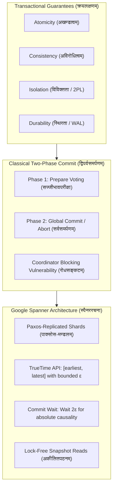

# विततक्रयपञ्चाशिका : द्विपर्वसमर्पणविधिः
## *Fifty Classical Sanskrit Verses on Distributed Transactions, Two-Phase Commit (2PC) and Google Spanner TrueTime*

> **ग्रन्थकारः (Author):** Vedant Madane & Antigravity  
> **छन्दः (Metre):** अनुष्टुप् (Anuṣṭubh - Pathyāvaktra rule, 8 syllables per pāda, strictly verified)  
> **व्याकरणम् (Grammar):** Complete Pāṇinian morphological analysis (पदच्छेद, प्रकृति, प्रत्यय, विभक्ति, कारकार्थ)  
> **विषयः (Subject):** Distributed Transactions (ACID), Two-Phase Commit (2PC), Paxos Replication, Hardware Clock Drift, Google Spanner TrueTime API and External Consistency  

---

## प्रस्तावना (Introduction)

The fundamental challenge of distributed data management is maintaining transactional atomicity, consistency, isolation and durability (ACID) across independent computing nodes separated by unpredictable networks. Classical distributed databases relied on Two-Phase Commit (2PC), which guarantees cross-shard atomicity but introduces catastrophic blocking when the coordinator fails. In 2012, Google published *Spanner: Google's Globally-Distributed Database*, pioneering the combination of Paxos consensus groups, multi-version concurrency control (MVCC) and TrueTime: an API supported by atomic clocks and GPS receivers with bounded uncertainty (epsilon).

**विततक्रयपञ्चाशिका : द्विपर्वसमर्पणविधिः** formalizes these foundational principles of distributed systems across 50 rigorously composed classical Sanskrit verses in the Anuṣṭubh metre. Every verse is accompanied by full Pāṇinian grammatical analysis and deep engineering commentary.



---

## Canto 1: विततक्रयप्रवेशः मौलिकलक्षणाञ्च
### *The ACID Foundations of Distributed Transactions*

#### Verse 1

```sanskrit
विततेषु व्यवस्थामु क्रयसिद्धिः सुदुर्लभा ।
अनेकेषु च केन्द्रेषु रक्षा कार्या प्रयत्नतः ॥
```

**पदच्छेदः:** विततेषु व्यवस्थामु क्रय-सिद्धिः सुदुर्लभा । अनेकेषु च केन्द्रेषु रक्षा कार्या प्रयत्नतः ॥

**पाणिनीय-व्याकरण-सारणी:**

| पदम् | मूलप्रकृतिः / धातुः | पदविभागः | विभक्तिः / प्रत्ययः | व्याख्या / कारकार्थः |
| :--- | :--- | :--- | :--- | :--- |
| **विततेषु** | `वि + √तन् + क्त` | कृदन्तरूप सप्तमी बहुवचन पुंलिंग | सप्तमी बहुवचन | डिस्ट्रिब्यूटेड-जालेषु (in distributed systems) |
| **व्यवस्थामु** | `व्यवस्था` | स्त्रीलिंग नाम | सप्तमी बहुवचन | तन्त्रेषु (across architectural clusters) |
| **क्रयसिद्धिः** | `क्रय + सिद्धि` | षष्ठी-तत्पुरुष स्त्रीलिंग | प्रथमा एकवचन | ट्रान्झॅक्शन्-सफलता (transactional ACID correctness) |
| **सुदुर्लभा** | `सु + दुर्लभ` | विशेषण स्त्रीलिंग | प्रथमा एकवचन | अतिकठिना (exceedingly difficult) |
| **अनेकेषु** | `अनेक` | विशेषण नपुंसकलिंग | सप्तमी बहुवचन | बहुषु (across multiple geographically dispersed) |
| **च** | `च` | अव्ययम् | अव्ययम् | समुच्चये (and) |
| **केन्द्रेषु** | `केन्द्र` | नपुंसकलिंग नाम | सप्तमी बहुवचन | डेटा-सेन्टर्-स्थानेषु (in datacenters and storage shards) |
| **रक्षा** | `रक्षा` | स्त्रीलिंग नाम | प्रथमा एकवचन | सुरक्षा (invariable safety) |
| **कार्या** | `√कृ + ण्यत्` | कृदन्तरूप स्त्रीलिंग | प्रथमा एकवचन | कर्तव्या (must be maintained) |
| **प्रत्नतः** | `प्रयत्न + तसिँ` | अव्ययम् | अव्ययम् | सावधानेन (diligently through rigorous engineering) |

**विततक्रय-भाष्यम् (Distributed Systems Engineering Commentary):** The Distributed Transaction Dilemma: In a centralized single-node database, atomic transactions are straightforward: local write-ahead logs and kernel memory locks guarantee ACID semantics. Across distributed shards, disparate datacenters and asynchronous wide-area networks subject to packet drops and node crashes, guaranteeing global correctness requires sophisticated multi-phase consensus protocols.

---

#### Verse 2

```sanskrit
सर्वं भवेत् समग्रं वा न वा किञ्चित् प्रजायते ।
अविभाज्यतया नूनं क्रियते कर्म सङ्गतम् ॥
```

**पदच्छेदः:** सर्वम् भवेत् समग्रम् वा न वा किञ्चित् प्रजायते । अविभाज्यतया नूनम् क्रियते कर्म सङ्गतम् ॥

**पाणिनीय-व्याकरण-सारणी:**

| पदम् | मूलप्रकृतिः / धातुः | पदविभागः | विभक्तिः / प्रत्ययः | व्याख्या / कारकार्थः |
| :--- | :--- | :--- | :--- | :--- |
| **सर्वम्** | `सर्व` | सर्वनाम नपुंसकलिंग | प्रथमा एकवचन | समस्त-म्यूटेशनम् (the entire set of operations) |
| **भवेत्** | `√भू + विधि-लिङ्` | परस्मैपद लिङ् | प्रथमपुरुष एकवचन | स्यात् (succeeds) |
| **समग्रम्** | `समग्र` | विशेषण नपुंसकलिंग | प्रथमा एकवचन | पूर्णरूपेण (completely) |
| **वा** | `वा` | अव्ययम् | अव्ययम् | विकल्पे (either) |
| **न** | `न` | अव्ययम् | अव्ययम् | प्रतिषेधे (or not) |
| **वा** | `वा` | अव्ययम् | अव्ययम् | विकल्पे (at all) |
| **किञ्चित्** | `किञ्चित्` | अव्ययम् | अव्ययम् | लेशमात्रमपि (nothing) |
| **प्रजायते** | `प्र + √जन् + लट्` | आत्मनेपद लट् | प्रथमपुरुष एकवचन | लिख्यते (persists on disk) |
| **अविभाज्यतया** | `अविभाज्य + तल्` | स्त्रीलिंग भाववाचक | तृतीया एकवचन | ॲटॉमिकिटी-गुणेन (by the property of Atomicity) |
| **ूनम्** | `नूनम्` | अव्ययम् | अव्ययम् | निश्चयेन (truly) |
| **क्रियते** | `√कृ + कर्मणि लट्` | कर्मणि लट् | प्रथमपुरुष एकवचन | निष्पाद्यते (is executed) |
| **कर्म** | `कर्मन्` | नपुंसकलिंग नाम | प्रथमा एकवचन | क्रयकार्यम् (transaction execution) |
| **सङ्गतम्** | `सम् + √गम् + क्त` | कृदन्तरूप नपुंसकलिंग | प्रथमा एकवचन | सुव्यवस्थितम् (soundly) |

**विततक्रय-भाष्यम् (Distributed Systems Engineering Commentary):** Atomicity (अविभाज्यत्वम्): The 'all-or-nothing' invariant. A financial transfer debiting Alice in Tokyo and crediting Bob in New York must either commit both mutations across physical datacenters simultaneously or cleanly abort both without leaving orphaned partial updates. Partial failure states must be made physically impossible.

---

#### Verse 3

```sanskrit
अविरोधि स्थिता मर्यादा विश्वसङ्गणके सदा ।
पूर्वावस्थां समाश्रित्य सत्यं रक्षेद् विचक्षणः ॥
```

**पदच्छेदः:** अविरोधि स्थिता मर्यादा विश्व-सङ्गणके सदा । पूर्व-अवस्थाम् समाश्रित्य सत्यम् रक्षेत् विचक्षणः ॥

**पाणिनीय-व्याकरण-सारणी:**

| पदम् | मूलप्रकृतिः / धातुः | पदविभागः | विभक्तिः / प्रत्ययः | व्याख्या / कारकार्थः |
| :--- | :--- | :--- | :--- | :--- |
| **अविरोधि** | `अ + विरोधिन्` | नञ्-तत्पुरुष नपुंसकलिंग | प्रथमा एकवचन | कन्सिस्टन्सी (Consistency) |
| **स्थिता** | `√स्था + क्त` | कृदन्तरूप स्त्रीलिंग | प्रथमा एकवचन | अक्षुण्णा (unbroken) |
| **मर्यादा** | `मर्यादा` | स्त्रीलिंग नाम | प्रथमा एकवचन | अखण्ड-नियमः (database invariant constraints) |
| **विश्वसङ्गणके** | `विश्व + सङ्गणक` | सप्तमी-तत्पुरुष पुंलिंग | सप्तमी एकवचन | विततजाले (across the global distributed cluster) |
| **सदा** | `सदा` | अव्ययम् | अव्ययम् | सर्वदा (always) |
| **पूर्वावस्थाम्** | `पूर्व + अवस्था` | कर्मधारय स्त्रीलिंग | द्वितीया एकवचन | वैधानिकस्थितिम् (valid state transitions) |
| **समाश्रित्य** | `सम् + आ + √श्रि + ल्यप्` | कृदन्तरूप अव्यय | अव्ययम् | पालयित्वा (preserving) |
| **सत्यम्** | `सत्य` | नपुंसकलिंग नाम | द्वितीया एकवचन | तथ्यम् (integrity) |
| **रक्षेत्** | `√रक्ष् + विधि-लिङ्` | परस्मैपद लिङ् | प्रथमपुरुष एकवचन | पालयेत् (should protect) |
| **विचक्षणः** | `विचक्षण` | विशेषण पुंलिंग | प्रथमा एकवचन | तन्त्रज्ञः (the systems engineer) |

**विततक्रय-भाष्यम् (Distributed Systems Engineering Commentary):** Consistency (अविरोधिता): Consistency ensures that every transaction transitions the database from one valid global state to another, satisfying all schema constraints, uniqueness rules, foreign keys and application balance invariants. In a distributed environment, ensuring consistency cannot depend on single-node assumptions.

---

#### Verse 4

```sanskrit
एकस्मिन् समये प्राप्ते क्रियाणां सङ्कुलेऽपि च ।
पृथक् पृथक् फलं पश्येद् विविक्तं शास्त्रसम्मतम् ॥
```

**पदच्छेदः:** एकस्मिन् समये प्राप्ते क्रियाणाम् सङ्कुले अपि च । पृथक् पृथक् फलम् पश्येत् विविक्तम् शास्त्र-सम्मतम् ॥

**पाणिनीय-व्याकरण-सारणी:**

| पदम् | मूलप्रकृतिः / धातुः | पदविभागः | विभक्तिः / प्रत्ययः | व्याख्या / कारकार्थः |
| :--- | :--- | :--- | :--- | :--- |
| **एकस्मिन्** | `एक` | संख्यावाचक पुंलिंग | सप्तमी एकवचन | तुल्यकाले (at the same) |
| **समये** | `समय` | पुंलिंग नाम | सप्तमी एकवचन | काले (concurrent moment) |
| **प्राप्ते** | `प्र + √आप् + क्त` | कृदन्तरूप पुंलिंग | सप्तमी एकवचन | सति-सप्तमी : उपस्थिते (having arrived) |
| **क्रियाणाम्** | `क्रिया` | स्त्रीलिंग नाम | षष्ठी बहुवचन | क्रयाणाम् (of concurrent transactions) |
| **सङ्कुले** | `सङ्कुल` | नपुंसकलिंग नाम | सप्तमी एकवचन | सङ्घर्षे (in lock and data race contention) |
| **अपि** | `अपि` | अव्ययम् | अव्ययम् | सम्भवे (even) |
| **च** | `च` | अव्ययम् | अव्ययम् | समुच्चये (and) |
| **पृथक्** | `पृथक्` | अव्ययम् | अव्ययम् | वीथी-क्रमेण (sequentially) |
| **पृथक्** | `पृथक्` | अव्ययम् | अव्ययम् | एकैकशः (one by one) |
| **फलम्** | `फल` | नपुंसकलिंग नाम | द्वितीया एकवचन | परिणामम् (the execution outcome) |
| **पश्येत्** | `√दृश् + विधि-लिङ्` | परस्मैपद लिङ् | प्रथमपुरुष एकवचन | अवलोकयेत् (should yield) |
| **विविक्तम्** | `वि + √विच् + क्त` | कृदन्तरूप नपुंसकलिंग | द्वितीया एकवचन | आयसोलेशन् / सीरियलैझेबिल् (Isolation / Strict Serializability) |
| **शास्त्रसम्मतम्** | `शास्त्र + सम्मत` | तृतीया-तत्पुरुष नपुंसकलिंग | द्वितीया एकवचन | सिद्धान्तसम्मतम् (in accordance with formal theory) |

**विततक्रय-भाष्यम् (Distributed Systems Engineering Commentary):** Isolation (विविक्तता / Serializability): When thousands of transactions execute concurrently across planetary shards, Isolation mandates that the net outcome is indistinguishable from running them one after another in a strict sequential order. Concurrency anomalies: dirty reads, non-repeatable reads, lost updates and phantom reads: must be entirely eliminated.

---

#### Verse 5

```sanskrit
चक्रे लिखिते चक्रे वा स्थायित्वं परिरक्ष्यते ।
विपत्तौ सङ्कटे प्राप्ते न नश्यति धनं क्वचित् ॥
```

**पदच्छेदः:** चक्रे लिखिते चक्रे वा स्थायित्वम् परिरक्ष्यते । विपत्तौ सङ्कटे प्राप्ते न नश्यति धनम् क्वचित् ॥

**पाणिनीय-व्याकरण-सारणी:**

| पदम् | मूलप्रकृतिः / धातुः | पदविभागः | विभक्तिः / प्रत्ययः | व्याख्या / कारकार्थः |
| :--- | :--- | :--- | :--- | :--- |
| **चक्रे** | `चक्र` | नपुंसकलिंग नाम | सप्तमी एकवचन | स्थायि-डिस्क-पीठे (on persistent magnetic/flash media) |
| **लिखिते** | `√लिख् + क्त` | कृदन्तरूप नपुंसकलिंग | सप्तमी एकवचन | सति-सप्तमी : अङ्किते सति (upon being persisted) |
| **चक्रे** | `चक्र` | नपुंसकलिंग नाम | सप्तमी एकवचन | सति-सप्तमी : चक्रिकायाम् (to disk) |
| **वा** | `वा` | अव्ययम् | अव्ययम् | अवधारणे (indeed) |
| **स्थायित्वम्** | `स्थायिन् + त्व` | नपुंसकलिंग भाववाचक | प्रथमा एकवचन | ड्युरेबिलिटी (Durability) |
| **परिरक्ष्यते** | `परि + √रक्ष् + कर्मणि लट्` | कर्मणि लट् | प्रथमपुरुष एकवचन | सुरक्षितं भवति (is safeguarded) |
| **विपत्तौ** | `विपत्ति` | स्त्रीलिंग नाम | सप्तमी एकवचन | सति-सप्तमी : क्रॅश्-समये (in datacenter power failure or crash) |
| **सङ्कटे** | `सङ्कट` | नपुंसकलिंग नाम | सप्तमी एकवचन | सति-सप्तमी : आपत्काले (in catastrophic crisis) |
| **प्राप्ते** | `प्र + √आप् + क्त` | कृदन्तरूप नपुंसकलिंग | सप्तमी एकवचन | सति-सप्तमी : सति (having arisen) |
| **न** | `न` | अव्ययम् | अव्ययम् | प्रतिषेधे (never) |
| **नश्यति** | `√नश् + लट्` | परस्मैपद लट् | प्रथमपुरुष एकवचन | विलयं याति (is lost) |
| **धनम्** | `धन` | नपुंसकलिंग नाम | प्रथमा एकवचन | दत्तवस्तु (committed data payload) |
| **क्वचित्** | `क्वचित्` | अव्ययम् | अव्ययम् | कदापि (under any circumstances) |

**विततक्रय-भाष्यम् (Distributed Systems Engineering Commentary):** Durability (स्थायित्वम्): Once a transaction receives a successful commit acknowledgment from the system, its mutations are immortal. Even if the primary coordinator explodes, datacenter power cuts severed, or physical disks unseat, the committed data survives on non-volatile replicated media and is fully restored upon reboot.

---

## Canto 2: द्विपर्वसमर्पणविधिः संयोजकविचारश्च
### *The Two-Phase Commit Protocol: Prepare and Commit*

#### Verse 6

```sanskrit
संयोजकः स्थितस्त्वेकः सहकारिजनस्तथा ।
द्विपर्वसमयेनैव क्रियते क्रयनिर्णयः ॥
```

**पदच्छेदः:** संयोजकः स्थितः तु एकः सहकारि-जनः तथा । द्विपर्व-समयेन एव क्रियते क्रय-निर्णयः ॥

**पाणिनीय-व्याकरण-सारणी:**

| पदम् | मूलप्रकृतिः / धातुः | पदविभागः | विभक्तिः / प्रत्ययः | व्याख्या / कारकार्थः |
| :--- | :--- | :--- | :--- | :--- |
| **संयोजकः** | `संयोजक` | पुंलिंग नाम | प्रथमा एकवचन | कोऑर्डिनेटर (the Transaction Coordinator) |
| **स्थितः** | `√स्था + क्त` | कृदन्तरूप पुंलिंग | प्रथमा एकवचन | प्रतिष्ठितः (stationed) |
| **तु** | `तु` | अव्ययम् | अव्ययम् | विशेषे (indeed) |
| **एकः** | `एक` | संख्यावाचक पुंलिंग | प्रथमा एकवचन | नेता (a single leader) |
| **सहकारिजनः** | `सहकारिन् + जन` | कर्मधारय पुंलिंग | प्रथमा एकवचन | पार्टिसिपन्ट्स-समूहः (the cohort of participant shards) |
| **तथा** | `तथा` | अव्ययम् | अव्ययम् | समुच्चये (likewise) |
| **द्विपर्वसमयेन** | `द्वि + पर्वन् + समय` | कर्मधारय पुंलिंग | तृतीया एकवचन | द्विपर्व-प्रक्रमेण / २-पी-सी (via the Two-Phase Commit protocol) |
| **एव** | `एव` | अव्ययम् | अव्ययम् | अवधारणे (exclusively) |
| **क्रियते** | `√कृ + कर्मणि लट्` | कर्मणि लट् | प्रथमपुरुष एकवचन | विधीयते (is resolved) |
| **क्रयनिर्णयः** | `क्रय + निर्णय` | षष्ठी-तत्पुरुष पुंलिंग | प्रथमा एकवचन | ट्रान्झॅक्शन्-अन्तिम-स्थितिः (the transaction outcome decision) |

**विततक्रय-भाष्यम् (Distributed Systems Engineering Commentary):** The Two-Phase Commit (2PC) Architecture: Introduced by Jim Gray in 1978, 2PC coordinates an atomic transaction across distributed participants. The architecture defines two roles: a single Coordinator (संयोजकः) that orchestrates the protocol and multiple Cohorts or Participants (सहकारिणः) hosting individual partitions or shards of data.

---

#### Verse 7

```sanskrit
आदौ प्रेषयते प्रश्नं सज्जीभवत सादरम् ।
अङ्गीकारे लिखन्त्येते न चेद् भङ्गाय वादिनः ॥
```

**पदच्छेदः:** आदौ प्रेषयते प्रश्नम् सज्जीभवत सादरम् । अङ्गीकारे लिखन्ति एते न चेत् भङ्गाय वादिनः ॥

**पाणिनीय-व्याकरण-सारणी:**

| पदम् | मूलप्रकृतिः / धातुः | पदविभागः | विभक्तिः / प्रत्ययः | व्याख्या / कारकार्थः |
| :--- | :--- | :--- | :--- | :--- |
| **आदौ** | `आदि` | पुंलिंग नाम | सप्तमी एकवचन | प्रथमपर्वणि (in Phase 1) |
| **प्रेषयते** | `प्र + √इष् + लट्` | आत्मनेपद लट् | प्रथमपुरुष एकवचन | प्रसारयति (broadcasts) |
| **प्रश्नम्** | `प्रश्न` | पुंलिंग नाम | द्वितीया एकवचन | प्रिपेअर-सन्देशम् (the PREPARE message) |
| **सज्जीभवत** | `सज्जी + √भू + लोट्` | परस्मैपद लोट् | मध्यमपुरुष बहुवचन | सन्नद्धा भवत (be prepared to commit!) |
| **सादरम्** | `स + आदरम्` | अव्ययीभाव | अव्ययम् | नियमेन (diligently) |
| **अङ्गीकारे** | `अङ्गीकार` | पुंलिंग नाम | सप्तमी एकवचन | सति-सप्तमी : सम्मते (upon agreeing to vote YES) |
| **लिखन्ति** | `√लिख् + लट्` | परस्मैपद लट् | प्रथमपुरुष बहुवचन | वाल्-मध्ये अङ्कयन्ति (they write to persistent WAL) |
| **एते** | `एतद्` | सर्वनाम पुंलिंग | प्रथमा बहुवचन | सहकारिणः (the cohorts) |
| **न** | `न` | अव्ययम् | अव्ययम् | प्रतिषेधे (not) |
| **चेत्** | `चेत्` | अव्ययम् | अव्ययम् | यदि (if) |
| **भङ्गाय** | `भङ्ग` | पुंलिंग नाम | चतुर्थी एकवचन | तादर्थ्ये चतुर्थी : ॲबॉर्ट्-करणाय (for aborting) |
| **वादिनः** | `वादिन्` | पुंलिंग नाम | प्रथमा बहुवचन | वोट्-कर्तारः (voting NO) |

**विततक्रय-भाष्यम् (Distributed Systems Engineering Commentary):** Phase 1: The Prepare Phase (सन्नहनपर्व): The coordinator broadcasts a PREPARE message to all cohorts. Each participant executes the local transaction mutations in memory, checks constraints and locks, writes a PREPARED record to its persistent write-ahead log (WAL) and votes YES. If any cohort suffers a lock conflict or local crash, it votes NO.

---

#### Verse 8

```sanskrit
सज्जोऽस्मीति वचो दत्त्वा न स्वातन्त्र्यं विधीयते ।
संयोजकस्य चादेशं प्रतीक्षन्ते समाहिताः ॥
```

**पदच्छेदः:** सज्जः अस्मि इति वचः दत्त्वा न स्वातन्त्र्यम् विधीयते । संयोजकस्य च आदेशम् प्रतीक्षन्ते समाहिताः ॥

**पाणिनीय-व्याकरण-सारणी:**

| पदम् | मूलप्रकृतिः / धातुः | पदविभागः | विभक्तिः / प्रत्ययः | व्याख्या / कारकार्थः |
| :--- | :--- | :--- | :--- | :--- |
| **सज्जः** | `सज्ज` | विशेषण पुंलिंग | प्रथमा एकवचन | सन्नद्धः (prepared) |
| **अस्मि** | `√अस् + लट्` | परस्मैपद लट् | उत्तमपुरुष एकवचन | अहं वर्तते (I am) |
| **इति** | `इति` | अव्ययम् | अव्ययम् | प्रकारार्थे (thus) |
| **वचः** | `वचस्` | नपुंसकलिंग नाम | द्वितीया एकवचन | वोट्-स्वीकारम् (the YES vote pledge) |
| **दत्त्वा** | `√दा + क्त्वा` | कृदन्तरूप अव्यय | अव्ययम् | समर्प्य (having transmitted) |
| **न** | `न` | अव्ययम् | अव्ययम् | प्रतिषेधे (no) |
| **स्वातन्त्र्यम्** | `स्वातन्त्र्य` | नपुंसकलिंग नाम | प्रथमा एकवचन | एकपक्षीयत्यागाधिकारः (unilateral authority to abort) |
| **विधीयते** | `वि + √धा + कर्मणि लट्` | कर्मणि लट् | प्रथमपुरुष एकवचन | अवशिष्यते (remains) |
| **संयोजकस्य** | `संयोजक` | पुंलिंग नाम | षष्ठी एकवचन | कोऑर्डिनेटरस्य (of the coordinator) |
| **च** | `च` | अव्ययम् | अव्ययम् | समुच्चये (and) |
| **आदेशम्** | `आदेश` | पुंलिंग नाम | द्वितीया एकवचन | अन्तिमनिर्णयम् (the final global verdict) |
| **प्रतीक्षन्ते** | `प्रति + ईक्ष् + लट्` | आत्मनेपद लट् | प्रथमपुरुष बहुवचन | मार्गयन्ते (they wait for) |
| **समाहिताः** | `सम् + आ + √धा + क्त` | कृदन्तरूप पुंलिंग | प्रथमा बहुवचन | कीलिताः (holding local locks) |

**विततक्रय-भाष्यम् (Distributed Systems Engineering Commentary):** The Prepared State Commitment: A participant surrenders its unilateral autonomy the exact instant it votes YES. It has promised that its prepared mutations are safely written to disk and can be committed guaranteed even after a sudden power loss. The cohort cannot unilaterally abort or release its row locks; it is bound to wait for the coordinator's final word.

---

#### Verse 9

```sanskrit
सर्वैस्तु सम्मते दत्ते समर्पणं विधीयते ।
एकेनापि विपर्यस्ते सर्वं त्यक्तुं प्रकल्पते ॥
```

**पदच्छेदः:** सर्वैः तु सम्मते दत्ते समर्पणम् विधीयते । एकेन अपि विपर्यस्ते सर्वम् त्यक्तुम् प्रकल्पते ॥

**पाणिनीय-व्याकरण-सारणी:**

| पदम् | मूलप्रकृतिः / धातुः | पदविभागः | विभक्तिः / प्रत्ययः | व्याख्या / कारकार्थः |
| :--- | :--- | :--- | :--- | :--- |
| **सर्वैः** | `सर्व` | सर्वनाम पुंलिंग | तृतीया बहुवचन | समस्तसहकारिभिः (by all participants) |
| **तु** | `तु` | अव्ययम् | अव्ययम् | विशेषे (indeed) |
| **सम्मते** | `सम् + √मन् + क्त` | कृदन्तरूप नपुंसकलिंग | सप्तमी एकवचन | सति-सप्तमी : अनुमतौ (in YES votes) |
| **दत्ते** | `√दा + क्त` | कृदन्तरूप नपुंसकलिंग | सप्तमी एकवचन | सति-सप्तमी : समर्पिते (having been submitted) |
| **समर्पणम्** | `समर्पण` | नपुंसकलिंग नाम | प्रथमा एकवचन | ग्लोबल-कमिट् (the global COMMIT) |
| **विधीयते** | `वि + √धा + कर्मणि लट्` | कर्मणि लट् | प्रथमपुरुष एकवचन | निर्माप्यते (is issued) |
| **एकेन** | `एक` | संख्यावाचक पुंलिंग | तृतीया एकवचन | एकलेन (by a single cohort) |
| **अपि** | `अपि` | अव्ययम् | अव्ययम् | सम्भवे (even) |
| **विपर्यस्ते** | `वि + परि + √अस् + क्त` | कृदन्तरूप नपुंसकलिंग | सप्तमी एकवचन | सति-सप्तमी : अस्वीकृते (upon voting NO or timing out) |
| **सर्वम्** | `सर्व` | सर्वनाम नपुंसकलिंग | प्रथमा एकवचन | समस्त-क्रयकार्यम् (the entire transaction) |
| **त्यक्तुम्** | `√त्यज् + तुमुन्` | कृदन्तरूप अव्यय | अव्ययम् | ॲबॉर्ट्-कर्तुम् (to abort and roll back) |
| **प्रकल्पते** | `प्र + √क्लृप् + लट्` | आत्मनेपद लट् | प्रथमपुरुष एकवचन | आदिश्यते (is ordained) |

**विततक्रय-भाष्यम् (Distributed Systems Engineering Commentary):** Phase 2: The Commit or Abort Phase (समर्पणपर्व): If and only if every single participant votes YES, the coordinator writes a COMMIT record to its log and broadcasts COMMIT to the entire cluster. If even a single participant votes NO or fails to respond within a timeout window, the coordinator writes an ABORT record and broadcasts ABORT to everyone.

---

#### Verse 10

```sanskrit
कृते समर्पणे पश्चाद् विज्ञापनं समर्प्यते ।
संयोजको विमुञ्चेत क्रयभारं सुखेन वै ॥
```

**पदच्छेदः:** कृते समर्पणे पश्चात् विज्ञापनम् समर्प्यते । संयोजकः विमुञ्चेत क्रय-भारम् सुखेन वै ॥

**पाणिनीय-व्याकरण-सारणी:**

| पदम् | मूलप्रकृतिः / धातुः | पदविभागः | विभक्तिः / प्रत्ययः | व्याख्या / कारकार्थः |
| :--- | :--- | :--- | :--- | :--- |
| **कृते** | `√कृ + क्त` | कृदन्तरूप नपुंसकलिंग | सप्तमी एकवचन | सति-सप्तमी : निष्पन्ने (having been executed) |
| **समर्पणे** | `समर्पण` | नपुंसकलिंग नाम | सप्तमी एकवचन | सति-सप्तमी : स्थानीय-कमिट्-कार्ये (in local commit and lock release) |
| **पश्चात्** | `पश्चात्` | अव्ययम् | अव्ययम् | तदनन्तरम् (afterwards) |
| **विज्ञापनम्** | `वि + ज्ञापन` | नपुंसकलिंग नाम | प्रथमा एकवचन | अकनॉलेजमेण्ट् (the ACK confirmation) |
| **समर्प्यते** | `सम् + √ऋ + णिच् + कर्मणि लट्` | कर्मणि लट् | प्रथमपुरुष एकवचन | प्रेष्यते (is sent back to coordinator) |
| **संयोजकः** | `संयोजक` | पुंलिंग नाम | प्रथमा एकवचन | कोऑर्डिनेटर (the coordinator) |
| **विमुञ्चेत** | `वि + √मुच् + विधि-लिङ्` | परस्मैपद लिङ् | प्रथमपुरुष एकवचन | त्यजेत् (cleans up / garbage collects) |
| **क्रयभारम्** | `क्रय + भार` | षष्ठी-तत्पुरुष पुंलिंग | द्वितीया एकवचन | ट्रान्झॅक्शन्-दत्तम् (transaction state from memory) |
| **सुखेन** | `सुख` | नपुंसकलिंग नाम | तृतीया एकवचन | निर्मलतया (cleanly) |
| **वै** | `वै` | अव्ययम् | अव्ययम् | निश्चये (indeed) |

**विततक्रय-भाष्यम् (Distributed Systems Engineering Commentary):** Acknowledgments and Garbage Collection: Upon receiving the global COMMIT, participants commit mutations locally, release all row locks and send an ACK back to the coordinator. Once all ACKs are collected, the coordinator writes an END record to its WAL, officially closing the transaction and reclaiming in-memory buffers.

---

## Canto 3: स्तम्भनदोषः संयोजकपतनभयञ्च
### *The Blocking Problem, Network Partitions and 3PC*

#### Verse 11

```sanskrit
संयोजके विपन्ने तु स्तम्भनं जायते महत् ।
बद्धास्तिष्ठन्ति सर्वेऽपि न निर्णयमुपाश्नुते ॥
```

**पदच्छेदः:** संयोजके विपन्ने तु स्तम्भनम् जायते महत् । बद्धाः तिष्ठन्ति सर्वे अपि न निर्णयम् उपाश्नुते ॥

**पाणिनीय-व्याकरण-सारणी:**

| पदम् | मूलप्रकृतिः / धातुः | पदविभागः | विभक्तिः / प्रत्ययः | व्याख्या / कारकार्थः |
| :--- | :--- | :--- | :--- | :--- |
| **संयोजके** | `संयोजक` | पुंलिंग नाम | सप्तमी एकवचन | सति-सप्तमी : कोऑर्डिनेटर-नोडे (in the coordinator node) |
| **विपन्ने** | `वि + √पद् + क्त` | कृदन्तरूप पुंलिंग | सप्तमी एकवचन | सति-सप्तमी : पतिते सति (upon crashing / failing) |
| **तु** | `तु` | अव्ययम् | अव्ययम् | विशेषे (indeed) |
| **स्तम्भनम्** | `स्तम्भन` | नपुंसकलिंग नाम | प्रथमा एकवचन | ब्लॉकिङ्ग्-दोषः (the fatal 2PC blocking problem) |
| **जायते** | `√जन् + लट्` | आत्मनेपद लट् | प्रथमपुरुष एकवचन | उद्भवति (arises) |
| **महत्** | `महत्` | विशेषण नपुंसकलिंग | प्रथमा एकवचन | गम्भीरम् (severe) |
| **बद्धाः** | `√बन्ध् + क्त` | कृदन्तरूप पुंलिंग | प्रथमा बहुवचन | कीलिताः (frozen holding locks in the PREPARED state) |
| **तिष्ठन्ति** | `√स्था + लट्` | परस्मैपद लट् | प्रथमपुरुष बहुवचन | वर्तन्ते (remain) |
| **सर्वे** | `सर्व` | सर्वनाम पुंलिंग | प्रथमा बहुवचन | सहकारिणः (all cohorts) |
| **अपि** | `अपि` | अव्ययम् | अव्ययम् | सम्भवे (even) |
| **न** | `न` | अव्ययम् | अव्ययम् | प्रतिषेधे (not) |
| **निर्णयम्** | `निर्णय` | पुंलिंग नाम | द्वितीया एकवचन | अन्तिम-समाप्तिम् (the resolution) |
| **उपाश्नुते** | `उप + √अश् + लट्` | आत्मनेपद लट् | प्रथमपुरुष बहुवचन | प्राप्नुवन्ति (attain) |

**विततक्रय-भाष्यम् (Distributed Systems Engineering Commentary):** The Fatal Flaw of 2PC: The Blocking Problem: If the coordinator crashes after participants have voted YES (PREPARED) but before the global COMMIT/ABORT decision is received, participants are completely blocked. Because they cannot unilaterally commit (someone else may have voted NO) and cannot unilaterally abort (the coordinator may have committed), they must freeze indefinitely, holding database locks.

---

#### Verse 12

```sanskrit
जालस्य छेदने जाते सन्देशो नैव गच्छति ।
अज्ञाते च विधानेऽस्मिन् कम्पन्ते सहकारिणः ॥
```

**पदच्छेदः:** जालस्य छेदने जाते सन्देशः न एव गच्छति । अज्ञाते च विधाने अस्मिन् कम्पन्ते सहकारिणः ॥

**पाणिनीय-व्याकरण-सारणी:**

| पदम् | मूलप्रकृतिः / धातुः | पदविभागः | विभक्तिः / प्रत्ययः | व्याख्या / कारकार्थः |
| :--- | :--- | :--- | :--- | :--- |
| **जालस्य** | `जाल` | नपुंसकलिंग नाम | षष्ठी एकवचन | नेट्वर्क-व्यवस्थायाः (of the network) |
| **छेदने** | `छेदन` | नपुंसकलिंग नाम | सप्तमी एकवचन | सति-सप्तमी : पार्टिशन्-दोषे (in a network partition split) |
| **जाते** | `√जन् + क्त` | कृदन्तरूप नपुंसकलिंग | सप्तमी एकवचन | सति-सप्तमी : सति (having occurred) |
| **सन्देशः** | `सन्देश` | पुंलिंग नाम | प्रथमा एकवचन | कमिट्-आदेशः (the commit message packet) |
| **न** | `न` | अव्ययम् | अव्ययम् | प्रतिषेधे (not) |
| **एव** | `एव` | अव्ययम् | अव्ययम् | अवधारणे (at all) |
| **गच्छति** | `√गम् + लट्` | परस्मैपद लट् | प्रथमपुरुष एकवचन | सञ्चरति (transmits) |
| **अज्ञाते** | `अ + ज्ञात` | नञ्-तत्पुरुष नपुंसकलिंग | सप्तमी एकवचन | सति-सप्तमी : अनिर्णीते (in the unknown global state) |
| **च** | `च` | अव्ययम् | अव्ययम् | समुच्चये (and) |
| **विधाने** | `विधान` | नपुंसकलिंग नाम | सप्तमी एकवचन | सति-सप्तमी : कार्ये (in the protocol state) |
| **अस्मिन्** | `इदम्` | सर्वनाम नपुंसकलिंग | सप्तमी एकवचन | अस्मिन् प्रसङ्गे (in this) |
| **कम्पन्ते** | `√कम्प् + लट्` | आत्मनेपद लट् | प्रथमपुरुष बहुवचन | सन्दिग्धमना भवन्ति (tremble in deadlock uncertainty) |
| **सहकारिणः** | `सहकारिन्` | पुंलिंग नाम | प्रथमा बहुवचन | पार्टिसिपन्ट्स (cohort nodes) |

**विततक्रय-भाष्यम् (Distributed Systems Engineering Commentary):** Network Partitions under 2PC: If a network partition splits the coordinator from a cohort after the prepare vote, the isolated cohort is stranded. If the cohort assumes ABORT, it violates atomicity if the coordinator actually committed; if it assumes COMMIT, it violates atomicity if another cohort aborted. The network partition locks the database into an irresolvable standstill.

---

#### Verse 13

```sanskrit
कीलितेषु च कोशेषु क्रयान्तराणि रुध्यते ।
समग्रस्य च तन्त्रस्य गतिभङ्गो विधीयते ॥
```

**पदच्छेदः:** कीलितेषु च कोशेषु क्रय-अन्तराणि रुध्यते । समग्रस्य च तन्त्रस्य गति-भङ्गः विधीयते ॥

**पाणिनीय-व्याकरण-सारणी:**

| पदम् | मूलप्रकृतिः / धातुः | पदविभागः | विभक्तिः / प्रत्ययः | व्याख्या / कारकार्थः |
| :--- | :--- | :--- | :--- | :--- |
| **कीलितेषु** | `कीलित` | विशेषण पुंलिंग | सप्तमी बहुवचन | तालाबद्धेषु (in locked data partitions) |
| **च** | `च` | अव्ययम् | अव्ययम् | समुच्चये (and) |
| **कोशेषु** | `कोष` | पुंलिंग नाम | सप्तमी बहुवचन | दत्तखण्डेषु (in rows and ranges) |
| **क्रयान्तराणि** | `क्रय + अन्तर` | कर्मधारय नपुंसकलिंग | प्रथमा बहुवचन | इतरट्रान्झॅक्शन्-कर्माणि (other incoming concurrent transactions) |
| **रुध्यते** | `√रुध् + कर्मणि लट्` | कर्मणि लट् | प्रथमपुरुष एकवचन | प्रतिबध्यन्ते (are blocked and queued) |
| **समग्रस्य** | `समग्र` | विशेषण नपुंसकलिंग | षष्ठी एकवचन | सर्वस्य (of the entire) |
| **च** | `च` | अव्ययम् | अव्ययम् | समुच्चये (and) |
| **तन्त्रस्य** | `तन्त्र` | नपुंसकलिंग नाम | षष्ठी एकवचन | डेटाबेस्-व्यवस्थायाः (of the database engine) |
| **गतिभङ्गः** | `गति + भङ्ग` | षष्ठी-तत्पुरुष पुंलिंग | प्रथमा एकवचन | थ्रूपुट्-पतनम् (total throughput collapse) |
| **विधीयते** | `वि + √धा + कर्मणि लट्` | कर्मणि लट् | प्रथमपुरुष एकवचन | जायते (ensues) |

**विततक्रय-भाष्यम् (Distributed Systems Engineering Commentary):** Cascading Lock Contention and Cluster Gridlock: A blocked transaction does not merely halt itself: it holds exclusive write locks and shared read locks on critical tables, accounts, or indexes. Subsequent incoming transactions attempting to access those keys queue behind the blocked transaction, triggering a catastrophic cascading cluster lockup that destroys global throughput.

---

#### Verse 14

```sanskrit
त्रिपर्वणा विधानेन रोधनाशाय यत्नतः ।
पूर्वसमर्पणं कृत्वा रक्षणं क्रियते क्वचित् ॥
```

**पदच्छेदः:** त्रिपर्वणा विधानेन रोध-नाशाय यत्नतः । पूर्व-समर्पणम् कृत्वा रक्षणम् क्रियते क्वचित् ॥

**पाणिनीय-व्याकरण-सारणी:**

| पदम् | मूलप्रकृतिः / धातुः | पदविभागः | विभक्तिः / प्रत्ययः | व्याख्या / कारकार्थः |
| :--- | :--- | :--- | :--- | :--- |
| **त्रिपर्वणा** | `त्रि + पर्वन्` | कर्मधारय नपुंसकलिंग | तृतीया एकवचन | थ्री-फेस्-कमिट्-विधिना / ३-पी-सी (via the Three-Phase Commit protocol) |
| **विधानेन** | `विधान` | नपुंसकलिंग नाम | तृतीया एकवचन | प्रक्रमेण (by the protocol) |
| **रोधनाशाय** | `रोध + नाश` | षष्ठी-तत्पुरुष पुंलिंग | चतुर्थी एकवचन | तादर्थ्ये चतुर्थी : ब्लॉकिङ्ग्-परिहाराय (to eliminate the blocking problem) |
| **प्रत्नतः** | `प्रयत्न + तसिँ` | अव्ययम् | अव्ययम् | उद्योगेन (by engineering design) |
| **पूर्वसमर्पणम्** | `पूर्व + समर्पण` | कर्मधारय नपुंसकलिंग | द्वितीया एकवचन | प्री-कमिट्-पर्व (the PRE-COMMIT intermediate phase) |
| **कृत्वा** | `√कृ + क्त्वा` | कृदन्तरूप अव्यय | अव्ययम् | प्रयुज्य (having introduced) |
| **रक्षणम्** | `रक्षण` | नपुंसकलिंग नाम | प्रथमा एकवचन | विनाशवारणम् (resilience) |
| **क्रियते** | `√कृ + कर्मणि लट्` | कर्मणि लट् | प्रथमपुरुष एकवचन | साध्यते (is attempted) |
| **क्वचित्** | `क्वचित्` | अव्ययम् | अव्ययम् | कदाचित् (partially under synchronous assumptions) |

**विततक्रय-भाष्यम् (Distributed Systems Engineering Commentary):** Three-Phase Commit (3PC / त्रिपर्वविधिः): Skeen (1981) proposed 3PC to avoid blocking by splitting the commit phase into PRE-COMMIT and COMMIT. If the coordinator crashes, cohorts transition state based on timeout assumptions. However, 3PC assumes synchronous networks with perfectly bounded message delays: an assumption that fails in real-world asynchronous WANs subject to network splits.

---

#### Verse 15

```sanskrit
असमकालिके जाले पतनस्यापि सम्भवे ।
निश्चयो नैव शक्येत शास्त्राणां नियमेन हि ॥
```

**पदच्छेदः:** असमकालिके जाले पतनस्य अपि सम्भवे । निश्चयः न एव शक्येत शास्त्राणाम् नियमेन हि ॥

**पाणिनीय-व्याकरण-सारणी:**

| पदम् | मूलप्रकृतिः / धातुः | पदविभागः | विभक्तिः / प्रत्ययः | व्याख्या / कारकार्थः |
| :--- | :--- | :--- | :--- | :--- |
| **असमकालिके** | `अ + समकालिक` | नञ्-तत्पुरुष नपुंसकलिंग | सप्तमी एकवचन | सति-सप्तमी : असिन्क्रोनस्-जाले (in an asynchronous network) |
| **जाले** | `जाल` | नपुंसकलिंग नाम | सप्तमी एकवचन | सति-सप्तमी : जाले (in the network) |
| **पतनस्य** | `पतन` | नपुंसकलिंग नाम | षष्ठी एकवचन | नोड्-क्रॅश-दोषस्य (of node crash failures) |
| **अपि** | `अपि` | अव्ययम् | अव्ययम् | सम्भवे (even) |
| **सम्भवे** | `सम्भव` | पुंलिंग नाम | सप्तमी एकवचन | सति-सप्तमी : विद्यमानतायाम् (in the possibility) |
| **निश्चयः** | `निश्चय` | पुंलिंग नाम | प्रथमा एकवचन | सर्वसम्मतिः (deterministic non-blocking consensus) |
| **न** | `न` | अव्ययम् | अव्ययम् | प्रतिषेधे (not) |
| **एव** | `एव` | अव्ययम् | अव्ययम् | अवधारणे (at all) |
| **शक्येत** | `√शक् + विधि-लिङ्` | कर्मणि लिङ् | प्रथमपुरुष एकवचन | साधयितुं शक्येत (is possible) |
| **शास्त्राणाम्** | `शास्त्र` | नपुंसकलिंग नाम | षष्ठी बहुवचन | एफ्-एल्-पी-प्रमेयस्य (of the FLP Impossibility Theorem) |
| **नियमेन** | `नियम` | पुंलिंग नाम | तृतीया एकवचन | सिद्धान्तेन (by the mathematical law) |
| **हि** | `हि` | अव्ययम् | अव्ययम् | प्रसिद्धौ (indeed) |

**विततक्रय-भाष्यम् (Distributed Systems Engineering Commentary):** The FLP Impossibility Theorem (Fischer, Lynch, Paterson 1985): The ultimate theoretical barrier. In a fully asynchronous distributed network, no deterministic consensus protocol can guarantee both Safety and Liveness in the presence of even a single unannounced crash failure. True non-blocking commit across arbitrary WAN networks requires partially synchronous consensus like Paxos or Raft.

---

## Canto 4: पाक्सोससंयोगः अविनाशीसंयोजकश्च
### *Paxos-Replicated Coordinators: Overcoming Single Points of Failure*

#### Verse 16

```sanskrit
ऐकमत्यविधानेन संयोजकः प्रतिष्ठितः ।
एकाकिपतनं त्यक्त्वा बहुधा परिरक्ष्यते ॥
```

**पदच्छेदः:** ऐकमत्य-विधानेन संयोजकः प्रतिष्ठितः । एकाकि-पतनम् त्यक्त्वा बहुधा परिरक्ष्यते ॥

**पाणिनीय-व्याकरण-सारणी:**

| पदम् | मूलप्रकृतिः / धातुः | पदविभागः | विभक्तिः / प्रत्ययः | व्याख्या / कारकार्थः |
| :--- | :--- | :--- | :--- | :--- |
| **ऐकमत्यविधानेन** | `ऐकमत्य + विधान` | षष्ठी-तत्पुरुष नपुंसकलिंग | तृतीया एकवचन | पाक्सोस-कन्सेन्सस्-विधिना (via Paxos consensus replication) |
| **संयोजकः** | `संयोजक` | पुंलिंग नाम | प्रथमा एकवचन | कोऑर्डिनेटर-पदवी (the transaction coordinator role) |
| **प्रतिष्ठितः** | `प्रति + √स्था + क्त` | कृदन्तरूप पुंलिंग | प्रथमा एकवचन | सुस्थापितः (instantiated) |
| **एकाकिपतनम्** | `एकाकिन् + पतन` | कर्मधारय नपुंसकलिंग | द्वितीया एकवचन | सिङ्गल्-पॉइण्ट्-ऑफ्-फेलिअर् (single-point-of-failure crash vulnerability) |
| **त्यक्त्वा** | `√त्यज् + क्त्वा` | कृदन्तरूप अव्यय | अव्ययम् | विहाय (having eliminated) |
| **बहुधा** | `बहु + धा` | अव्ययम् | अव्ययम् | बहुकेन्द्रेषु (across multiple quorum replicas) |
| **परिरक्ष्यते** | `परि + √रक्ष् + कर्मणि लट्` | कर्मणि लट् | प्रथमपुरुष एकवचन | सुरक्षितो भवति (is safeguarded) |

**विततक्रय-भाष्यम् (Distributed Systems Engineering Commentary):** Paxos-Replicated Coordinators: The architectural breakthrough that saved 2PC from practical obsolescence. Instead of running the coordinator on a single vulnerable server, modern systems (such as Google Spanner) run the coordinator as a replicated Paxos state machine. The transaction log is committed across a Paxos quorum spanning multiple continental zones.

---

#### Verse 17

```sanskrit
सहकारिगणाश्चापि प्रतिरूपसमन्विताः ।
खण्डशो रचिता लोका न कदाचित् प्रकम्पते ॥
```

**पदच्छेदः:** सहकारि-गणाः च अपि प्रतिरूप-समन्विताः । खण्डशः रचिताः लोकाः न कदाचित् प्रकम्पते ॥

**पाणिनीय-व्याकरण-सारणी:**

| पदम् | मूलप्रकृतिः / धातुः | पदविभागः | विभक्तिः / प्रत्ययः | व्याख्या / कारकार्थः |
| :--- | :--- | :--- | :--- | :--- |
| **सहकारिगणाः** | `सहकारिन् + गण` | षष्ठी-तत्पुरुष पुंलिंग | प्रथमा बहुवचन | पार्टिसिपन्ट-गणाः (participant cohorts) |
| **च** | `च` | अव्ययम् | अव्ययम् | समुच्चये (and) |
| **अपि** | `अपि` | अव्ययम् | अव्ययम् | सम्भवे (also) |
| **प्रतिरूपसमन्विताः** | `प्रतिरूप + समन्वित` | तृतीया-तत्पुरुष पुंलिंग | प्रथमा बहुवचन | पाक्सोस-रेप्लिकायुक्ताः (endowed with Paxos replication groups) |
| **खण्डशः** | `खण्ड + शस्` | अव्ययम् | अव्ययम् | शार्ड्-क्रमेण (partitioned into shards / tablets) |
| **रचिताः** | `√रच् + क्त` | कृदन्तरूप पुंलिंग | प्रथमा बहुवचन | निर्मिताः (structured) |
| **लोकाः** | `लोक` | पुंलिंग नाम | प्रथमा बहुवचन | दत्तक्षेत्राणि (data storage realms) |
| **न** | `न` | अव्ययम् | अव्ययम् | प्रतिषेधे (never) |
| **कदाचित्** | `कदाचित्` | अव्ययम् | अव्ययम् | कदापि (under any failure) |
| **प्रकम्पते** | `प्र + √कम्प् + लट्` | आत्मनेपद लट् | प्रथमपुरुष एकवचन | विचलितं भवति (wavers or collapses) |

**विततक्रय-भाष्यम् (Distributed Systems Engineering Commentary):** Every Participant is a Paxos Shard: In Spanner, every participant in a distributed transaction is not a single bare-metal server, but an independent Paxos replication group (typically 3 to 5 replicas across different geographic regions). When a participant votes PREPARED, that prepare log record is itself replicated across a Paxos quorum before the vote is cast.

---

#### Verse 18

```sanskrit
नेतरि प्रविपन्नेऽपि नूतनः प्रविधीयते ।
अविच्छिन्नप्रवाहेण क्रयकार्यं प्रवर्तते ॥
```

**पदच्छेदः:** नेतरि प्रविपन्ने अपि नूतनः प्रविधीयते । अविच्छिन्न-प्रवाहेण क्रय-कार्यम् प्रवर्तते ॥

**पाणिनीय-व्याकरण-सारणी:**

| पदम् | मूलप्रकृतिः / धातुः | पदविभागः | विभक्तिः / प्रत्ययः | व्याख्या / कारकार्थः |
| :--- | :--- | :--- | :--- | :--- |
| **नेतरि** | `नेतृ` | पुंलिंग नाम | सप्तमी एकवचन | सति-सप्तमी : पाक्सोस-लीडरे (in the Paxos leader node) |
| **प्रविपन्ने** | `प्र + वि + √पद् + क्त` | कृदन्तरूप पुंलिंग | सप्तमी एकवचन | सति-सप्तमी : पतिते सति (upon crashing) |
| **अपि** | `अपि` | अव्ययम् | अव्ययम् | सम्भवे (even) |
| **नूतनः** | `नूतन` | विशेषण पुंलिंग | प्रथमा एकवचन | उत्तराधिकारी नेता (a new Paxos successor leader) |
| **प्रविधीयते** | `प्र + वि + √धा + कर्मणि लट्` | कर्मणि लट् | प्रथमपुरुष एकवचन | निर्वाच्यते (is elected instantly via leader lease) |
| **अविच्छिन्नप्रवाहेण** | `अविच्छिन्न + प्रवाह` | कर्मधारय पुंलिंग | तृतीया एकवचन | अप्रतिबद्धवेगेन (with unbroken continuous execution) |
| **क्रयकार्यम्** | `क्रय + कार्य` | षष्ठी-तत्पुरुष नपुंसकलिंग | प्रथमा एकवचन | ट्रान्झॅक्शन्-प्रक्रमः (transaction processing) |
| **प्रवर्तते** | `प्र + √वृत् + लट्` | आत्मनेपद लट् | प्रथमपुरुष एकवचन | अग्रे सरति (proceeds without blocking) |

**विततक्रय-भाष्यम् (Distributed Systems Engineering Commentary):** Seamless Failover Without Blocking: If the primary coordinator machine physically dies during Phase 2, the remaining Paxos group replicas immediately detect the failure and elect a successor leader. Because the previous leader committed the transaction state to the replicated Paxos log, the new leader reads the state and completes the 2PC commit phase without blocking.

---

#### Verse 19

```sanskrit
बहुमतस्य सद्भावे निर्णयः सम्प्रजायते ।
अल्पानां पतनेनापि न हानिर्दृश्यते क्वचित् ॥
```

**पदच्छेदः:** बहुमतस्य सद्भावे निर्णयः सम्प्रजायते । अल्पानाम् पतनेन अपि न हानिः दृश्यते क्वचित् ॥

**पाणिनीय-व्याकरण-सारणी:**

| पदम् | मूलप्रकृतिः / धातुः | पदविभागः | विभक्तिः / प्रत्ययः | व्याख्या / कारकार्थः |
| :--- | :--- | :--- | :--- | :--- |
| **बहुमतस्य** | `बहुमत` | नपुंसकलिंग नाम | षष्ठी एकवचन | क्लोरम-बहुसंख्यायाः (of a Paxos majority quorum: f+1 out of 2f+1) |
| **सद्भावे** | `सद्भाव` | पुंलिंग नाम | सप्तमी एकवचन | सति-सप्तमी : उपस्थितौ (in the active presence) |
| **निर्णयः** | `निर्णय` | पुंलिंग नाम | प्रथमा एकवचन | कन्सेन्सस्-सिद्धिः (consensus progress) |
| **सम्प्रजायते** | `सम् + प्र + √जन् + लट्` | आत्मनेपद लट् | प्रथमपुरुष एकवचन | निष्पद्यते (is achieved) |
| **अल्पानाम्** | `अल्प` | विशेषण पुंलिंग | षष्ठी बहुवचन | अल्पसंख्यकानाम् (of minority nodes: up to f failures) |
| **पतनेन** | `पतन` | नपुंसकलिंग नाम | तृतीया एकवचन | क्रॅश्-विनाशेन (by crash failure) |
| **अपि** | `अपि` | अव्ययम् | अव्ययम् | सम्भवे (even) |
| **न** | `न` | अव्ययम् | अव्ययम् | प्रतिषेधे (no) |
| **हानिः** | `हानि` | स्त्रीलिंग नाम | प्रथमा एकवचन | अवरोधः (loss of availability) |
| **दृश्यते** | `√दृश् + कर्मणि लट्` | कर्मणि लट् | प्रथमपुरुष एकवचन | अनुभूयते (is observed) |
| **क्वचित्** | `क्वचित्` | अव्ययम् | अव्ययम् | कदापि (ever) |

**विततक्रय-भाष्यम् (Distributed Systems Engineering Commentary):** Quorum High Availability: By utilizing Paxos quorums (2f + 1 replicas to tolerate f crash failures), consensus does not require 100 percent node availability. If an entire datacenter in Frankfurt goes dark due to power grid failure, the remaining replicas in London and Dublin form a quorum and keep committing transactions uninterrupted.

---

#### Verse 20

```sanskrit
स्तम्भनस्य विनाशाय पाक्सोस-विधिना सह ।
द्विपर्वसङ्गतं कृत्वा सुरक्षा क्रियते दृढा ॥
```

**पदच्छेदः:** स्तम्भनस्य विनाशाय पाक्सोस-विधिना सह । द्विपर्व-सङ्गतम् कृत्वा सुरक्षा क्रियते दृढा ॥

**पाणिनीय-व्याकरण-सारणी:**

| पदम् | मूलप्रकृतिः / धातुः | पदविभागः | विभक्तिः / प्रत्ययः | व्याख्या / कारकार्थः |
| :--- | :--- | :--- | :--- | :--- |
| **स्तम्भनस्य** | `स्तम्भन` | नपुंसकलिंग नाम | षष्ठी एकवचन | २-पी-सी ब्लॉकिङ्ग्-दोषस्य (of the 2PC blocking vulnerability) |
| **विनाशाय** | `विनाश` | पुंलिंग नाम | चतुर्थी एकवचन | तादर्थ्ये चतुर्थी : उच्चाटनाय (for complete elimination) |
| **पाक्सोसविधिना** | `पाक्सोस + विधि` | तृतीया-तत्पुरुष पुंलिंग | तृतीया एकवचन | पाक्सोस-ऐकमत्येन (with the Paxos protocol) |
| **सह** | `सह` | अव्ययम् | अव्ययम् | साकम् (together with) |
| **द्विपर्वसङ्गतम्** | `द्विपर्वन् + सङ्गत` | कर्मधारय नपुंसकलिंग | द्वितीया एकवचन | २-पी-सी समन्वयम् (2PC layered over Paxos) |
| **कृत्वा** | `√कृ + क्त्वा` | कृदन्तरूप अव्यय | अव्ययम् | संयोज्य (having synthesized) |
| **सुरक्षा** | `सुरक्षा` | स्त्रीलिंग नाम | प्रथमा एकवचन | अविनाशिता (fault-tolerant safety) |
| **क्रियते** | `√कृ + कर्मणि लट्` | कर्मणि लट् | प्रथमपुरुष एकवचन | प्रतिष्ठाप्यते (is established) |
| **दृढा** | `दृढ` | विशेषण स्त्रीलिंग | प्रथमा एकवचन | अभेद्या (indestructible) |

**विततक्रय-भाष्यम् (Distributed Systems Engineering Commentary):** Layering 2PC over Paxos: The architectural masterstroke of planet-scale storage. 2PC provides multi-shard cross-partition atomicity; Paxos provides high-availability replication within each partition. By making the 2PC coordinator and all 2PC participants Paxos-replicated state machines, the blocking vulnerability of 2PC is rendered practically obsolete.

---

## Canto 5: बहुसंस्करणविवेकः क्रमबद्धताशास्त्रञ्च
### *Multi-Version Concurrency Control (MVCC) and Strict Serializability*

#### Verse 21

```sanskrit
बहुसंस्करणे सिद्धे पुरातनं न नश्यति ।
नूतनं लिख्यते चक्रे कालचिह्नसहितं तथा ॥
```

**पदच्छेदः:** बहु-संस्करणे सिद्धे पुरातनम् न नश्यति । नूतनम् लिख्यते चक्रे काल-चिह्न-सहितम् तथा ॥

**पाणिनीय-व्याकरण-सारणी:**

| पदम् | मूलप्रकृतिः / धातुः | पदविभागः | विभक्तिः / प्रत्ययः | व्याख्या / कारकार्थः |
| :--- | :--- | :--- | :--- | :--- |
| **बहुसंस्करणे** | `बहु + संस्करण` | कर्मधारय नपुंसकलिंग | सप्तमी एकवचन | सति-सप्तमी : एम-व्ही-सी-सी-विधाने (under MVCC) |
| **सिद्धे** | `√सिध् + क्त` | कृदन्तरूप नपुंसकलिंग | सप्तमी एकवचन | सति-सप्तमी : प्रतिष्ठिते सति (being established) |
| **पुरातनम्** | `पुरातन` | विशेषण नपुंसकलिंग | प्रथमा एकवचन | ऐतिहासिकदत्तम् (historical data record) |
| **न** | `न` | अव्ययम् | अव्ययम् | प्रतिषेधे (not) |
| **नश्यति** | `√नश् + लट्` | परस्मैपद लट् | प्रथमपुरुष एकवचन | विनाश्यते (is overwritten or destroyed) |
| **नूतनम्** | `नूतन` | विशेषण नपुंसकलिंग | प्रथमा एकवचन | अद्यतनसंस्करणम् (the new version) |
| **लिख्यते** | `√लिख् + कर्मणि लट्` | कर्मणि लट् | प्रथमपुरुष एकवचन | अङ्क्यते (is appended to disk) |
| **चक्रे** | `चक्र` | नपुंसकलिंग नाम | सप्तमी एकवचन | डिस्क-पीठे (to persistent media) |
| **कालचिह्नसहितम्** | `काल + चिह्न + सहित` | तृतीया-तत्पुरुष नपुंसकलिंग | प्रथमा एकवचन | टाइमस्टॅम्प-अङ्कितम् (tagged with a commit timestamp) |
| **तथा** | `तथा` | अव्ययम् | अव्ययम् | एवम् (likewise) |

**विततक्रय-भाष्यम् (Distributed Systems Engineering Commentary):** The Multi-Version Concurrency Control (MVCC) Paradigm: In an MVCC database engine, updates do not mutate existing data in-place. Instead, every write creates a new, immutable timestamped version of the record. The storage engine maintains a chronological timeline of versions for every key, enabling queries to travel backward in time to inspect state at any historical moment.

---

#### Verse 22

```sanskrit
पठन्तो नैव रुन्धन्ति लिखतां मार्गमुत्तमम् ।
लिखन्तो न निवार्यन्ते पठतां सुखसाधनम् ॥
```

**पदच्छेदः:** पठन्तः न एव रुन्धन्ति लिखताम् मार्गम् उत्तमम् । लिखन्तः न निवार्यन्ते पठताम् सुख-साधनम् ॥

**पाणिनीय-व्याकरण-सारणी:**

| पदम् | मूलप्रकृतिः / धातुः | पदविभागः | विभक्तिः / प्रत्ययः | व्याख्या / कारकार्थः |
| :--- | :--- | :--- | :--- | :--- |
| **पठन्तः** | `√पठ् + शतृ` | कृदन्तरूप पुंलिंग | प्रथमा बहुवचन | रीडर्स् (concurrent reader transactions) |
| **न** | `न` | अव्ययम् | अव्ययम् | प्रतिषेधे (not) |
| **एव** | `एव` | अव्ययम् | अव्ययम् | अवधारणे (at all) |
| **रुन्धन्ति** | `√रुध् + लट्` | परस्मैपद लट् | प्रथमपुरुष बहुवचन | प्रतिबध्नन्ति (block or lock) |
| **लिखताम्** | `√लिख् + शतृ` | कृदन्तरूप पुंलिंग | षष्ठी बहुवचन | राइटर्स् (concurrent writer transactions) |
| **मार्गम्** | `मार्ग` | पुंलिंग नाम | द्वितीया एकवचन | लेखनपन्थानम् (the write path) |
| **उत्तम्** | `उत्तम` | विशेषण पुंलिंग | द्वितीया एकवचन | अप्रतिबद्धम् (uninhibited) |
| **लिखन्तः** | `√लिख् + शतृ` | कृदन्तरूप पुंलिंग | प्रथमा बहुवचन | लेखकाः (writers) |
| **न** | `न` | अव्ययम् | अव्ययम् | प्रतिषेधे (not) |
| **निवार्यन्ते** | `नि + √वृ + णिच् + कर्मणि लट्` | कर्मणि लट् | प्रथमपुरुष बहुवचन | प्रतिबध्यन्ते (blocked) |
| **पठताम्** | `√पठ् + शतृ` | कृदन्तरूप पुंलिंग | षष्ठी बहुवचन | वाचकानाम् (of readers) |
| **सुखसाधनम्** | `सुख + साधन` | षष्ठी-तत्पुरुष नपुंसकलिंग | द्वितीया एकवचन | अप्रतिरोधिकपठनम् (lock-free non-blocking read operation) |

**विततक्रय-भाष्यम् (Distributed Systems Engineering Commentary):** Readers Never Block Writers, Writers Never Block Readers: Because historical versions are immutable, a read transaction simply reads the latest version of data whose timestamp is less than or equal to the query snapshot timestamp. Readers acquire zero locks and never block incoming writes; writes append new versions without blocking ongoing reads.

---

#### Verse 23

```sanskrit
चित्रावस्थां समाश्रित्य क्रियते कर्म निर्मलम् ।
भूतकाले स्थितं सर्वं यथावद् दृश्यते मुहुः ॥
```

**पदच्छेदः:** चित्र-अवस्थाम् समाश्रित्य क्रियते कर्म निर्मलम् । भूत-काले स्थितम् सर्वम् यथावत् दृश्यते मुहुः ॥

**पाणिनीय-व्याकरण-सारणी:**

| पदम् | मूलप्रकृतिः / धातुः | पदविभागः | विभक्तिः / प्रत्ययः | व्याख्या / कारकार्थः |
| :--- | :--- | :--- | :--- | :--- |
| **चित्रावस्थाम्** | `चित्र + अवस्था` | कर्मधारय स्त्रीलिंग | द्वितीया एकवचन | स्नॅपशॉट्-आयसोलेशन् (Snapshot Isolation) |
| **समाश्रित्य** | `सम् + आ + √श्रि + ल्यप्` | कृदन्तरूप अव्यय | अव्ययम् | उपादाय (relying upon) |
| **क्रियते** | `√कृ + कर्मणि लट्` | कर्मणि लट् | प्रथमपुरुष एकवचन | विधीयते (is executed) |
| **कर्म** | `कर्मन्` | नपुंसकलिंग नाम | प्रथमा एकवचन | क्वेरी-कार्यम् (query execution) |
| **निर्मलम्** | `निस् + मल` | बहुव्रीहि नपुंसकलिंग | प्रथमा एकवचन | दोषरहितम् (consistent and clean) |
| **भूतकाले** | `भूत + काल` | कर्मधारय पुंलिंग | सप्तमी एकवचन | अतीते समये (at a specified historical timestamp t) |
| **स्थितम्** | `√स्था + क्त` | कृदन्तरूप नपुंसकलिंग | प्रथमा एकवचन | विद्यमानम् (existing) |
| **सर्वम्** | `सर्व` | सर्वनाम नपुंसकलिंग | प्रथमा एकवचन | समग्रदत्तम् (all state) |
| **यथावत्** | `यथावत्` | अव्ययम् | अव्ययम् | अविकृतम् (exactly as it was) |
| **दृश्यते** | `√दृश् + कर्मणि लट्` | कर्मणि लट् | प्रथमपुरुष एकवचन | अवलोक्यते (is viewed) |
| **मुहुः** | `मुहुर्` | अव्ययम् | अव्ययम् | निरन्तरम् (reproducibly) |

**विततक्रय-भाष्यम् (Distributed Systems Engineering Commentary):** Snapshot Isolation (चित्रावस्थाविविक्तिः): A transaction executing under Snapshot Isolation views the entire database as frozen at the exact instant the transaction began. Long-running analytical queries, audit scans and backup jobs can inspect multi-terabyte datasets consistently over hours without locking a single row or causing production transaction aborts.

---

#### Verse 24

```sanskrit
पृथक् पृथग् विधानेन क्वचिद् भ्रमः प्रजायते ।
अरेखीयविकारेण मर्यादा क्षीयते क्वचित् ॥
```

**पदच्छेदः:** पृथक् पृथक् विधानेन क्वचित् भ्रमः प्रजायते । अरेखीय-विकारेण मर्यादा क्षीयते क्वचित् ॥

**पाणिनीय-व्याकरण-सारणी:**

| पदम् | मूलप्रकृतिः / धातुः | पदविभागः | विभक्तिः / प्रत्ययः | व्याख्या / कारकार्थः |
| :--- | :--- | :--- | :--- | :--- |
| **पृथक्** | `पृथक्` | अव्ययम् | अव्ययम् | विभिन्नखण्डेषु (on disjoint partitions) |
| **पृथक्** | `पृथक्` | अव्ययम् | अव्ययम् | स्वतन्त्रतया (concurrently) |
| **विधानेन** | `विधान` | नपुंसकलिंग नाम | तृतीया एकवचन | स्नॅपशॉट्-व्यवहारेण (by Snapshot Isolation) |
| **क्वचित्** | `क्वचित्` | अव्ययम् | अव्ययम् | कदाचित् (occasionally) |
| **भ्रमः** | `भ्रम` | पुंलिंग नाम | प्रथमा एकवचन | राइट्-स्क्यू-दोषः (the Write Skew anomaly) |
| **प्रजायते** | `प्र + √जन् + लट्` | आत्मनेपद लट् | प्रथमपुरुष एकवचन | उद्भवति (manifests) |
| **अरेखीयविकारेण** | `अरेखीय + विकार` | कर्मधारय पुंलिंग | तृतीया एकवचन | सीरियलैझेबिल्-अभावेन (due to non-serializable interleaving) |
| **मर्यादा** | `मर्यादा` | स्त्रीलिंग नाम | प्रथमा एकवचन | ग्लोबल-कन्सिस्टन्सी (global consistency invariant) |
| **क्षीयते** | `√क्षि + कर्मणि लट्` | कर्मणि लट् | प्रथमपुरुष एकवचन | भज्यते (is broken) |
| **क्वचित्** | `क्वचित्` | अव्ययम् | अव्ययम् | तस्मिन् काले (under concurrent edge cases) |

**विततक्रय-भाष्यम् (Distributed Systems Engineering Commentary):** The Write-Skew Anomaly of Snapshot Isolation: Snapshot Isolation is not strict serializability. If two concurrent doctors on call both check whether at least one doctor remains on call, find that two are currently on call and both concurrently check out, both transactions commit successfully under Snapshot Isolation, leaving zero doctors on call. Preventing Write Skew requires Strict Serializability.

---

#### Verse 25

```sanskrit
अविच्छिन्नक्रमत्वं हि सर्वश्रेष्ठा स्थितिर्मता ।
प्रत्यक्षक्रमभावेन सत्यं रक्षेद् विचक्षणः ॥
```

**पदच्छेदः:** अविच्छिन्न-क्रमत्वम् हि सर्व-श्रेष्ठा स्थितिः मता । प्रत्यक्ष-क्रम-भावेन सत्यम् रक्षेत् विचक्षणः ॥

**पाणिनीय-व्याकरण-सारणी:**

| पदम् | मूलप्रकृतिः / धातुः | पदविभागः | विभक्तिः / प्रत्ययः | व्याख्या / कारकार्थः |
| :--- | :--- | :--- | :--- | :--- |
| **अविच्छिन्नक्रमत्वम्** | `अविच्छिन्न + क्रम + त्व` | नपुंसकलिंग भाववाचक | प्रथमा एकवचन | स्ट्रिक्ट्-सीरियलैझेबिलिटी / लिनिअरैझेबिलिटी (Strict Serializability / External Consistency) |
| **हि** | `हि` | अव्ययम् | अव्ययम् | निश्चये (verily) |
| **सर्वश्रेष्ठा** | `सर्व + श्रेष्ठा` | कर्मधारय स्त्रीलिंग | प्रथमा एकवचन | परमोत्कृष्टा (the gold standard) |
| **स्थितिः** | `स्थिति` | स्त्रीलिंग नाम | प्रथमा एकवचन | कन्सिस्टन्सी-कोटिः (consistency level) |
| **मता** | `√मन् + क्त` | कृदन्तरूप स्त्रीलिंग | प्रथमा एकवचन | स्वीकृता (is acknowledged) |
| **प्रत्यक्षक्रमभावेन** | `प्रत्यक्ष + क्रम + भाव` | तृतीया-तत्पुरुष पुंलिंग | तृतीया एकवचन | वास्तविक-भौतिककालक्रमेण (by matching real physical wall-clock causality) |
| **सत्यम्** | `सत्य` | नपुंसकलिंग नाम | द्वितीया एकवचन | डेटाबेस्-सत्यम् (global database correctness) |
| **रक्षेत्** | `√रक्ष् + विधि-लिङ्` | परस्मैपद लिङ् | प्रथमपुरुष एकवचन | पालयेत् (should preserve) |
| **विचक्षणः** | `विचक्षण` | विशेषण पुंलिंग | प्रथमा एकवचन | तन्त्रज्ञः (the distributed systems architect) |

**विततक्रय-भाष्यम् (Distributed Systems Engineering Commentary):** Strict Serializability (External Consistency): The holy grail of distributed databases. Strict Serializability mandates that transactions are not only serializable (there exists some valid sequential order), but that this order strictly respects physical real-world wall-clock time: if transaction T2 begins after transaction T1 commits in the physical world, T2 must observe the effects of T1.

---

## Canto 6: सत्यकालदर्शनम् पारमाण्विकघटिका च
### *Google Spanner's TrueTime Architecture: GPS and Atomic Clocks*

#### Verse 26

```sanskrit
घटिकानां प्रवाहे तु स्खलनं दृश्यते मुहुः ।
क्वचिन्मन्दा क्वचित् तीव्रा समयो भ्रंशतां गतः ॥
```

**पदच्छेदः:** घटिकानाम् प्रवाहे तु स्खलनम् दृश्यते मुहुः । क्वचित् मन्दा क्वचित् तीव्रा समयः भ्रंशताम् गतः ॥

**पाणिनीय-व्याकरण-सारणी:**

| पदम् | मूलप्रकृतिः / धातुः | पदविभागः | विभक्तिः / प्रत्ययः | व्याख्या / कारकार्थः |
| :--- | :--- | :--- | :--- | :--- |
| **घटिकानाम्** | `घटिका` | स्त्रीलिंग नाम | षष्ठी बहुवचन | सङ्गणक-क्लॉक्सम्प्रदाये (of hardware quartz clocks on server motherboards) |
| **प्रवाहे** | `प्रवाह` | पुंलिंग नाम | सप्तमी एकवचन | गतौ (in the flow of time) |
| **तु** | `तु` | अव्ययम् | अव्ययम् | विशेषे (indeed) |
| **स्खलनम्** | `स्खलन` | नपुंसकलिंग नाम | प्रथमा एकवचन | क्लॉक्-ड्रिफ्ट् (clock drift error) |
| **दृश्यते** | `√दृश् + कर्मणि लट्` | कर्मणि लट् | प्रथमपुरुष एकवचन | जायते (is observed) |
| **मुहुः** | `मुहुर्` | अव्ययम् | अव्ययम् | पुनः पुनः (persistently) |
| **क्वचित्** | `क्वचित्` | अव्ययम् | अव्ययम् | एकस्मिन् सर्वरे (on one machine) |
| **मन्दा** | `मन्द` | विशेषण स्त्रीलिंग | प्रथमा एकवचन | शनैर्गता (running slow) |
| **क्वचित्** | `क्वचित्` | अव्ययम् | अव्ययम् | अपरस्मिन् सर्वरे (on another machine) |
| **तीव्रा** | `तीव्र` | विशेषण स्त्रीलिंग | प्रथमा एकवचन | शीघ्रगता (running fast) |
| **समयः** | `समय` | पुंलिंग नाम | प्रथमा एकवचन | भौतिककालः (local time) |
| **भ्रंशताम्** | `भ्रंश + तल्` | स्त्रीलिंग भाववाचक | द्वितीया एकवचन | विपर्यासम् (severe unsynchronized divergence) |
| **गतः** | `√गम् + क्त` | कृदन्तरूप पुंलिंग | प्रथमा एकवचन | प्राप्तः (has attained) |

**विततक्रय-भाष्यम् (Distributed Systems Engineering Commentary):** The Physical Clock Drift Dilemma: Standard computer clocks rely on quartz crystal oscillators that drift unpredictably due to temperature fluctuations and voltage changes (typically 200 microseconds per second: 17 seconds per day). Network Time Protocol (NTP) over the public internet exhibits uncertainty spikes of hundreds of milliseconds, making raw server timestamps useless for ordering global transactions.

---

#### Verse 27

```sanskrit
अन्तरेण विधानेन सत्यकालो विभाव्यते ।
सीमाद्वयं प्रपश्यन्ति निश्चितं नैकबिन्दुकम् ॥
```

**पदच्छेदः:** अन्तरेण विधानेन सत्य-कालः विभाव्यते । सीमा-द्वयम् प्रपश्यन्ति निश्चितम् न एक-बिन्दुकम् ॥

**पाणिनीय-व्याकरण-सारणी:**

| पदम् | मूलप्रकृतिः / धातुः | पदविभागः | विभक्तिः / प्रत्ययः | व्याख्या / कारकार्थः |
| :--- | :--- | :--- | :--- | :--- |
| **अन्तरेण** | `अन्तर` | नपुंसकलिंग नाम | तृतीया एकवचन | अन्तरालेन / इन्टर्व्हल्-रूपेण (as a bounded uncertainty interval [earliest, latest]) |
| **विधानेन** | `विधान` | नपुंसकलिंग नाम | तृतीया एकवचन | ए-पी-आई-नियमेन (by API design) |
| **सत्यकालः** | `सत्य + काल` | कर्मधारय पुंलिंग | प्रथमा एकवचन | ट्रू-टाईम् (Google Spanners TrueTime API) |
| **विभाव्यते** | `वि + √भू + णिच् + कर्मणि लट्` | कर्मणि लट् | प्रथमपुरुष एकवचन | उद्घाट्यते (is represented) |
| **सीमाद्वयम्** | `सीमा + द्वय` | द्विगु नपुंसकलिंग | द्वितीया एकवचन | टी-अर्लिएस्ट् टी-लेटेस्ट् च (the dual bounds [t.earliest, t.latest]) |
| **प्रपश्यन्ति** | `प्र + √दृश् + लट्` | परस्मैपद लट् | प्रथमपुरुष बहुवचन | स्वीकुर्वन्ति (engineers expose) |
| **निश्चितम्** | `निस् + √चि + क्त` | कृदन्तरूप नपुंसकलिंग | प्रथमा एकवचन | सत्यप्रमाणम् (guaranteed uncertainty bound epsilon) |
| **न** | `न` | अव्ययम् | अव्ययम् | प्रतिषेधे (not) |
| **एकबिन्दुकम्** | `एक + बिन्दु + कन्` | कर्मधारय नपुंसकलिंग | द्वितीया एकवचन | एकल-संख्याम् (a misleading scalar point timestamp) |

**विततक्रय-भाष्यम् (Distributed Systems Engineering Commentary):** The TrueTime API (सत्यकालदर्शनम्): Rather than lying to applications by returning a single scalar timestamp (e.g. 10:00:00.123), Google Spanner's TrueTime API explicitly acknowledges physical relativistic uncertainty by returning a time interval: TT.now() = [t.earliest, t.latest], where latest - earliest = 2 * epsilon. The absolute physical time t* is mathematically guaranteed to reside within this interval.

---

#### Verse 28

```sanskrit
गगने संस्थितात् यन्त्राद् भूमौ चाणुकघट्यतः ।
द्विविधेन प्रमाणेन कालरक्षा विधीयते ॥
```

**पदच्छेदः:** गगने संस्थितात् यन्त्रात् भूमौ च आणुक-घट्यतः । द्विविधेन प्रमाणेन काल-रक्षा विधीयते ॥

**पाणिनीय-व्याकरण-सारणी:**

| पदम् | मूलप्रकृतिः / धातुः | पदविभागः | विभक्तिः / प्रत्ययः | व्याख्या / कारकार्थः |
| :--- | :--- | :--- | :--- | :--- |
| **गगने** | `गगन` | नपुंसकलिंग नाम | सप्तमी एकवचन | अन्तरिक्षे (in orbit / satellites) |
| **संस्थितात्** | `सम् + √स्था + क्त` | कृदन्तरूप पञ्चमी एकवचन नपुंसकलिंग | पञ्चमी एकवचन | जी-पी-एस-उपग्रहात् (from GPS satellites) |
| **यन्त्रात्** | `यन्त्र` | नपुंसकलिंग नाम | पञ्चमी एकवचन | उपग्रहमण्डलात् (from satellite receivers) |
| **भूमौ** | `भूमि` | स्त्रीलिंग नाम | सप्तमी एकवचन | डेटा-सेन्टर्-मध्ये (on the ground inside datacenters) |
| **च** | `च` | अव्ययम् | अव्ययम् | समुच्चये (and) |
| **आणुकघट्यतः** | `आणुक + घटी + तसिँ` | अव्ययम् | अव्ययम् | रुबिडियम्-अणुघटिकातः (from Rubidium atomic clocks) |
| **द्विविधेन** | `द्विविध` | विशेषण नपुंसकलिंग | तृतीया एकवचन | उभयप्रमाणेन (by complementary dual hardware references) |
| **प्रमाणेन** | `प्रमाण` | नपुंसकलिंग नाम | तृतीया एकवचन | साधनेन (by reference signals) |
| **कालरक्षा** | `काल + रक्षा` | षष्ठी-तत्पुरुष स्त्रीलिंग | प्रथमा एकवचन | समयशुद्धिः (time synchronization) |
| **विधीयते** | `वि + √धा + कर्मणि लट्` | कर्मणि लट् | प्रथमपुरुष एकवचन | निष्पाद्यते (is maintained) |

**विततक्रय-भाष्यम् (Distributed Systems Engineering Commentary):** Hardware Time Synchronization: To keep clock uncertainty epsilon small (typically 1 to 7 milliseconds globally), Google installs dedicated time masters in every Spanner datacenter. Crucially, these time masters use two completely independent failure-mode sources: GPS satellite receivers (subject to antenna failure or satellite signal jamming) and ground-based Rubidium atomic clocks (which have no antennas and drift independently at tiny known rates).

---

#### Verse 29

```sanskrit
स्खलने वर्धिते तीव्रे सम्बन्धे विहते सति ।
यन्त्रं त्यजति स्वात्मानं मर्यादापालनाय च ॥
```

**पदच्छेदः:** स्खलने वर्धिते तीव्रे सम्बन्धे विहते सति । यन्त्रम् त्यजति स्व-आत्मानम् मर्यादा-पालनाय च ॥

**पाणिनीय-व्याकरण-सारणी:**

| पदम् | मूलप्रकृतिः / धातुः | पदविभागः | विभक्तिः / प्रत्ययः | व्याख्या / कारकार्थः |
| :--- | :--- | :--- | :--- | :--- |
| **स्खलने** | `स्खलन` | नपुंसकलिंग नाम | सप्तमी एकवचन | सति-सप्तमी : क्लॉक्-ड्रिफ्ट्-दोषे (in clock drift uncertainty) |
| **वर्धिते** | `√वृध् + णिच् + क्त` | कृदन्तरूप नपुंसकलिंग | सप्तमी एकवचन | सति-सप्तमी : अतिक्रान्ते (when growing large) |
| **तीव्रे** | `तीव्र` | विशेषण नपुंसकलिंग | सप्तमी एकवचन | सति-सप्तमी : सीमामतिक्रम्य (exceeding bounded epsilon threshold) |
| **सम्बन्धे** | `सम्बन्ध` | पुंलिंग नाम | सप्तमी एकवचन | सति-सप्तमी : टाईम्-मास्टर्-सम्पर्के (in network connection to time masters) |
| **विहते** | `वि + √हन् + क्त` | कृदन्तरूप पुंलिंग | सप्तमी एकवचन | सति-सप्तमी : छिन्ने (severed / lost) |
| **सति** | `√अस् + शतृ` | कृदन्तरूप पुंलिंग | सप्तमी एकवचन | सति-सप्तमी : विद्यमाने (being so) |
| **यन्त्रम्** | `यन्त्र` | नपुंसकलिंग नाम | प्रथमा एकवचन | स्पैनर-सर्वर्-यन्त्रम् (the server node) |
| **त्यजति** | `√त्यज् + लट्` | परस्मैपद लट् | प्रथमपुरुष एकवचन | आत्महत्यां करोति (evicts itself from the cluster) |
| **स्वात्मानम्** | `स्व + आत्मन्` | षष्ठी-तत्पुरुष पुंलिंग | द्वितीया एकवचन | स्वशरीरम् (itself) |
| **मर्यादापालनाय** | `मर्यादा + पालन` | षष्ठी-तत्पुरुष नपुंसकलिंग | चतुर्थी एकवचन | तादर्थ्ये चतुर्थी : सत्यरक्षणार्थम् (to preserve correctness invariants) |
| **च** | `च` | अव्ययम् | अव्ययम् | समुच्चये (and) |

**विततक्रय-भाष्यम् (Distributed Systems Engineering Commentary):** Fail-Safe Drift Eviction: If a server node loses connectivity to all time masters, its local clock drift accumulates at the worst-case physical oscillator rate of 200 microseconds per second. If epsilon grows beyond an acceptable safety bound (or if the hardware clock goes crazy), the node voluntarily terminates its server process and evicts itself from the cluster rather than risking silent data corruption.

---

#### Verse 30

```sanskrit
सूक्ष्मकाले स्थिते भेदे सहस्रांशे क्षणेऽपि च ।
मर्यादा सुदृढा बद्धा स्पैनर-तन्त्रमध्यगा ॥
```

**पदच्छेदः:** सूक्ष्म-काले स्थिते भेदे सहस्रांशे क्षणे अपि च । मर्यादा सुदृढा बद्धा स्पैनर-तन्त्र-मध्यगा ॥

**पाणिनीय-व्याकरण-सारणी:**

| पदम् | मूलप्रकृतिः / धातुः | पदविभागः | विभक्तिः / प्रत्ययः | व्याख्या / कारकार्थः |
| :--- | :--- | :--- | :--- | :--- |
| **सूक्ष्मकाले** | `सूक्ष्म + काल` | कर्मधारय पुंलिंग | सप्तमी एकवचन | मिलीसेकण्ड्-काले (in microscopic millisecond time) |
| **स्थिते** | `√स्था + क्त` | कृदन्तरूप पुंलिंग | सप्तमी एकवचन | सति-सप्तमी : परिमिते (being bounded) |
| **भेदे** | `भेद` | पुंलिंग नाम | सप्तमी एकवचन | सति-सप्तमी : ॲप्सिलान्-अन्तरे (in uncertainty epsilon) |
| **सहस्रांशे** | `सहस्र + अंश` | कर्मधारय पुंलिंग | सप्तमी एकवचन | सति-सप्तमी : १-७ मिलीसेकण्ड्-मध्ये (within a few thousandths of a second) |
| **क्षणे** | `क्षण` | पुंलिंग नाम | सप्तमी एकवचन | सति-सप्तमी : काले (in time) |
| **अपि** | `अपि` | अव्ययम् | अव्ययम् | सम्भवे (even) |
| **च** | `च` | अव्ययम् | अव्ययम् | समुच्चये (and) |
| **मर्यादा** | `मर्यादा` | स्त्रीलिंग नाम | प्रथमा एकवचन | गणितीयमर्यादा (the TrueTime bounded uncertainty invariant) |
| **सुदृढा** | `सु + दृढ` | विशेषण स्त्रीलिंग | प्रथमा एकवचन | अखण्डा (unshakeable) |
| **बद्धा** | `√बन्ध् + क्त` | कृदन्तरूप स्त्रीलिंग | प्रथमा एकवचन | प्रतिष्ठापिता (forged) |
| **स्पैनरतन्त्रमध्यगा** | `स्पैनर + तन्त्र + मध्य + ग + ङीप्` | उपपद-तत्पुरुष स्त्रीलिंग | प्रथमा एकवचन | स्पैनर-अन्तःकरणे (deep within the Spanner architecture) |

**विततक्रय-भाष्यम् (Distributed Systems Engineering Commentary):** Microsecond Planetary Uncertainty Bounds: By keeping TrueTime uncertainty epsilon tightly bounded between 1 to 7 milliseconds across planet Earth, Google Spanner turned physical hardware clocks into a legitimate mathematical primitive for transaction serializability.

---

## Canto 7: समर्पणप्रतीक्षा बाह्यसांतत्यविवेकश्च
### *Commit Wait and External Consistency: TrueTime Serialization Invariant*

#### Verse 31

```sanskrit
समर्पणे कृते चापि प्रतीक्षा क्रियते क्षणाम् ।
सत्यकालस्य सीमाया अतिक्रान्तौ विमुच्यते ॥
```

**पदच्छेदः:** समर्पणे कृते च अपि प्रतीक्षा क्रियते क्षणाम् । सत्य-कालस्य सीमायाः अतिक्रान्तौ विमुच्यते ॥

**पाणिनीय-व्याकरण-सारणी:**

| पदम् | मूलप्रकृतिः / धातुः | पदविभागः | विभक्तिः / प्रत्ययः | व्याख्या / कारकार्थः |
| :--- | :--- | :--- | :--- | :--- |
| **समर्पणे** | `समर्पण` | नपुंसकलिंग नाम | सप्तमी एकवचन | सति-सप्तमी : कमिट्-कृत्यकाले (upon commit request) |
| **कृते** | `√कृ + क्त` | कृदन्तरूप नपुंसकलिंग | सप्तमी एकवचन | सति-सप्तमी : अनुष्ठिते (having been executed) |
| **च** | `च` | अव्ययम् | अव्ययम् | समुच्चये (and) |
| **अपि** | `अपि` | अव्ययम् | अव्ययम् | सम्भवे (even) |
| **प्रतीक्षा** | `प्रतीक्षा` | स्त्रीलिंग नाम | प्रथमा एकवचन | कमिट्-वेट्-कालविलम्बः (commit wait delay) |
| **क्रियते** | `√कृ + कर्मणि लट्` | कर्मणि लट् | प्रथमपुरुष एकवचन | विधीयते (is performed) |
| **क्षणाम्** | `क्षण` | पुंलिंग नाम | द्वितीया एकवचन | कालाध्वनोरत्यन्तसंयोगे द्वितीया : क्षणकालम् (for a brief duration) |
| **सत्यकालस्य** | `सत्य + काल` | षष्ठी-तत्पुरुष पुंलिंग | षष्ठी एकवचन | ट्रू-टाईम्-प्रणाल्याः (of TrueTime) |
| **सीमायाः** | `सीमा` | स्त्रीलिंग नाम | षष्ठी एकवचन | मर्यादायाः / २ ॲप्सिलान्-परिमाणस्य (of the 2*epsilon uncertainty interval) |
| **अतिक्रान्तौ** | `अति + √क्रम् + क्तिन्` | स्त्रीलिंग नाम | सप्तमी एकवचन | सति-सप्तमी : उत्लङ्घने (upon passing beyond absolute uncertainty) |
| **विमुच्यते** | `वि + √मुच् + कर्मणि लट्` | कर्मणि लट् | प्रथमपुरुष एकवचन | प्रसार्यते (is released / committed to world) |

**विततक्रय-भाष्यम् (Distributed Systems Engineering Commentary):** Commit Wait Invariant: To guarantee linearizability and external consistency across the globe without communication between disjoint transactions, Spanner enforces the commit wait rule. The transaction coordinator picks a commit timestamp s that is at least TT.now().latest. The coordinator then guarantees that clients cannot see any effects of the transaction until TT.now().earliest > s. This wait period is typically 2 * epsilon (2 to 7 ms), ensuring that any transaction starting in absolute physical time after this commit will obtain a strictly higher timestamp.

---

#### Verse 32

```sanskrit
कालचिह्नमतिक्रान्ते वर्तमाने स्थिते सति ।
तदा पश्चात् प्रमुच्यन्ते कीलिता बन्धनानि च ॥
```

**पदच्छेदः:** काल-चिह्नम् अतिक्रान्ते वर्तमाने स्थिते सति । तदा पश्चात् प्रमुच्यन्ते कीलिता बन्धनानि च ॥

**पाणिनीय-व्याकरण-सारणी:**

| पदम् | मूलप्रकृतिः / धातुः | पदविभागः | विभक्तिः / प्रत्ययः | व्याख्या / कारकार्थः |
| :--- | :--- | :--- | :--- | :--- |
| **कालचिह्नम्** | `काल + चिह्न` | कर्मधारय नपुंसकलिंग | द्वितीया एकवचन | कमिट्-टाईम्-स्टैम्प् (the commit timestamp s) |
| **अतिक्रान्ते** | `अति + √क्रम् + क्त` | कृदन्तरूप पुंलिंग | सप्तमी एकवचन | सति-सप्तमी : लङ्घिते (having passed) |
| **वर्तमाने** | `वृत् + शानच्` | कृदन्तरूप पुंलिंग | सप्तमी एकवचन | सति-सप्तमी : वर्तमानकाले (in the present physical epoch) |
| **स्थिते** | `√स्था + क्त` | कृदन्तरूप पुंलिंग | सप्तमी एकवचन | सति-सप्तमी : वर्तमाने (standing) |
| **सति** | `√अस् + शतृ` | कृदन्तरूप पुंलिंग | सप्तमी एकवचन | सति-सप्तमी : विद्यमाने (being so) |
| **तदा** | `तदा` | अव्ययम् | अव्ययम् | तस्मिन् काले (at that moment) |
| **पश्चात्** | `पश्चात्` | अव्ययम् | अव्ययम् | उत्तरकाले (afterwards) |
| **प्रमुच्यन्ते** | `प्र + √मुच् + कर्मणि लट्` | कर्मणि लट् | प्रथमपुरुष बहुवचन | मोच्यन्ते (are released) |
| **कीलिता** | `कीलित` | विशेषण नपुंसकलिंग | प्रथमा बहुवचन | लाक्-कृतानि (locked) |
| **बन्धनानि** | `बन्धन` | नपुंसकलिंग नाम | प्रथमा बहुवचन | रीड्-राईट्-कीलकानि (the 2PL read/write locks) |
| **च** | `च` | अव्ययम् | अव्ययम् | समुच्चये (and) |

**विततक्रय-भाष्यम् (Distributed Systems Engineering Commentary):** Releasing Two-Phase Locks: Two-phase locking (2PL) locks cannot be safely released until commit wait finishes. Because clients must not observe partial or uncommitted state, Spanner holds all shared read and exclusive write locks across all Paxos leader participants until the TrueTime lower bound has strictly surpassed s. Once TT.now().earliest > s, locks are released, guaranteeing strict serializability.

---

#### Verse 33

```sanskrit
पूर्वस्मात् परतश्चेत् स्यात् प्रत्यक्षजगतो विधिः ।
कालचिह्नं तथा तस्य वर्धते नात्र संशयः ॥
```

**पदच्छेदः:** पूर्वस्मात् परतः चेत् स्यात् प्रत्यक्ष-जगतः विधिः । काल-चिह्नम् तथा तस्य वर्धते न अत्र संशयः ॥

**पाणिनीय-व्याकरण-सारणी:**

| पदम् | मूलप्रकृतिः / धातुः | पदविभागः | विभक्तिः / प्रत्ययः | व्याख्या / कारकार्थः |
| :--- | :--- | :--- | :--- | :--- |
| **पूर्वस्मात्** | `पूर्व` | विशेषण पुंलिंग | पञ्चमी एकवचन | पूर्वक्रयात् (than the prior transaction T1) |
| **परतः** | `परतः` | अव्ययम् | अव्ययम् | पश्चात् (subsequently in absolute physical wall-clock time) |
| **चेत्** | `चेत्` | अव्ययम् | अव्ययम् | शर्तार्थे (if) |
| **स्यात्** | `√अस् + विधि-लिङ्` | परस्मैपद लिङ् | प्रथमपुरुष एकवचन | भवेत् (should be) |
| **प्रत्यक्षजगतः** | `प्रत्यक्ष + जगत्` | कर्मधारय नपुंसकलिंग | षष्ठी एकवचन | वास्तविकभौतिकविश्वस्य (of the objective physical universe) |
| **विधिः** | `विधि` | पुंलिंग नाम | प्रथमा एकवचन | व्यापारक्रमः (event execution order) |
| **कालचिह्नम्** | `काल + चिह्न` | कर्मधारय नपुंसकलिंग | प्रथमा एकवचन | टाईम्-स्टैम्प् (the transaction timestamp s2) |
| **तथा** | `तथा` | अव्ययम् | अव्ययम् | तथैव (similarly) |
| **तस्य** | `तद्` | सर्वनाम पुंलिंग | षष्ठी एकवचन | उत्तरक्रयस्य (of transaction T2) |
| **वर्धते** | `√वृध् + लट्` | आत्मनेपद लट् | प्रथमपुरुष एकवचन | अधिकं भवति (is strictly greater: s1 < s2) |
| **न** | `न` | अव्ययम् | अव्ययम् | प्रतिषेधे (no) |
| **अत्र** | `अत्र` | अव्ययम् | अव्ययम् | अस्मिन् विषये (in this regard) |
| **संशयः** | `संशय` | पुंलिंग नाम | प्रथमा एकवचन | सन्देहः (doubt) |

**विततक्रय-भाष्यम् (Distributed Systems Engineering Commentary):** External Consistency Invariant: The crowning achievement of Spanner is external consistency (linearizability): if a transaction T2 begins after transaction T1 commits in the real, physical world, the commit timestamp of T2 must be strictly greater than that of T1 (s2 > s1). This matches human causal intuition across global multi-datacenter operations.

---

#### Verse 34

```sanskrit
पठनार्थं प्रवृत्तानां बन्धनं नैव कल्प्यते ।
अतीतेन प्रमाणेन गृह्णन्ति विमलं धनम् ॥
```

**पदच्छेदः:** पठन-अर्थम् प्रवृत्तानाम् बन्धनम् न एव कल्प्यते । अतीतेन प्रमाणेन गृह्णन्ति विमलम् धनम् ॥

**पाणिनीय-व्याकरण-सारणी:**

| पदम् | मूलप्रकृतिः / धातुः | पदविभागः | विभक्तिः / प्रत्ययः | व्याख्या / कारकार्थः |
| :--- | :--- | :--- | :--- | :--- |
| **पठनार्थम्** | `पठन + अर्थ` | तादर्थ्य-अव्यय | अव्ययम् | रीड्-ओन्ली-कार्यार्थम् (for read-only queries) |
| **प्रवृत्तानाम्** | `प्र + √वृत् + क्त` | कृदन्तरूप पुंलिंग | षष्ठी बहुवचन | याचकानाम् (of reading transactions) |
| **बन्धनम्** | `बन्धन` | नपुंसकलिंग नाम | प्रथमा एकवचन | कीलना / लाक् (locks) |
| **न** | `न` | अव्ययम् | अव्ययम् | प्रतिषेधे (not) |
| **एव** | `एव` | अव्ययम् | अव्ययम् | अवधारणे (at all) |
| **कल्प्यते** | `√क्लृप् + कर्मणि लट्` | कर्मणि लट् | प्रथमपुरुष एकवचन | विधीयते (is assigned) |
| **अतीतेन** | `अतीत` | विशेषण नपुंसकलिंग | तृतीया एकवचन | भूतकालेन (with past historical timestamp) |
| **प्रमाणेन** | `प्रमाण` | नपुंसकलिंग नाम | तृतीया एकवचन | टाईम्-स्टैम्प्-मानेन (by snapshot read timestamp) |
| **गृह्णन्ति** | `√ग्रह् + लट्` | परस्मैपद लट् | प्रथमपुरुष बहुवचन | पठन्ति (they fetch / read) |
| **विमलम्** | `विमल` | विशेषण नपुंसकलिंग | द्वितीया एकवचन | शुद्धम् (pristine / consistent) |
| **धनम्** | `धन` | नपुंसकलिंग नाम | द्वितीया एकवचन | दत्तांशम् (data payload) |

**विततक्रय-भाष्यम् (Distributed Systems Engineering Commentary):** Lock-Free Snapshot Reads: The enormous dividend of TrueTime and Multi-Version Concurrency Control (MVCC) is that read-only transactions require zero locks. A client reading at timestamp t_read reads the most recent committed version older than t_read without blocking incoming writes or acquiring distributed locks. Massive global reporting and map-reduce queries run entirely lock-free without degrading transactional throughput.

---

#### Verse 35

```sanskrit
सर्वस्मिन् जगति व्याप्ता क्रमबद्धता प्रसाध्यते ।
स्पैनरस्य प्रभावेन साध्यते महदद्भुतम् ॥
```

**पदच्छेदः:** सर्वस्मिन् जगति व्याप्ता क्रम-बद्धता प्रसाध्यते । स्पैनरस्य प्रभावेन साध्यते महत् अद्भुतम् ॥

**पाणिनीय-व्याकरण-सारणी:**

| पदम् | मूलप्रकृतिः / धातुः | पदविभागः | विभक्तिः / प्रत्ययः | व्याख्या / कारकार्थः |
| :--- | :--- | :--- | :--- | :--- |
| **सर्वस्मिन्** | `सर्व` | सर्वनाम नपुंसकलिंग | सप्तमी एकवचन | समग्रे (in the entire) |
| **जगति** | `जगत्` | नपुंसकलिंग नाम | सप्तमी एकवचन | भूमण्डले (world / global deployment) |
| **व्याप्ता** | `वि + आ + √अप् + क्त` | कृदन्तरूप स्त्रीलिंग | प्रथमा एकवचन | प्रसारिता (pervasive) |
| **क्रमबद्धता** | `क्रम + बद्ध + ता` | स्त्रीलिंग नाम | प्रथमा एकवचन | ग्लोबल्-सीरियलाइजेबिलिटि (global serializability) |
| **प्रसाध्यते** | `प्र + साध् + णिच् + कर्मणि लट्` | कर्मणि लट् | प्रथमपुरुष एकवचन | सम्पाद्यते (is established) |
| **स्पैनरस्य** | `स्पैनर` | पुंलिंग नाम | षष्ठी एकवचन | गुगल्-स्पैनर-तन्त्रस्य (of Google Spanner) |
| **प्रभावेन** | `प्रभाव` | पुंलिंग नाम | तृतीया एकवचन | सामर्थ्येन (by the power) |
| **साध्यते** | `√साध् + कर्मणि लट्` | कर्मणि लट् | प्रथमपुरुष एकवचन | निष्पाद्यते (is accomplished) |
| **महत्** | `महत्` | विशेषण नपुंसकलिंग | प्रथमा एकवचन | विशालम् (a monumental) |
| **अद्भुतम्** | `अद्भुत` | नपुंसकलिंग नाम | प्रथमा एकवचन | आश्चर्यम् (engineering miracle) |

**विततक्रय-भाष्यम् (Distributed Systems Engineering Commentary):** Planetary Linearizability: Prior to Spanner, the distributed systems community assumed that globally distributed databases must choose between slow synchronization or weak consistency (such as eventual consistency). Spanner proved that with relativistic bounded uncertainty in TrueTime, global strict serializability can be achieved across continents with sub-10ms commit latencies.

---

## Canto 8: स्पैनरक्रयक्रमः पाक्सोसाभिसन्धिः
### *The Spanner Transaction Pipeline: Paxos-Led Two-Phase Commit*

#### Verse 36

```sanskrit
पठनं लेखनं वापि नेत्रा क्रियते सादरम् ।
कीलितेषु च खण्डेषु पाक्सोसेन प्रपाल्यते ॥
```

**पदच्छेदः:** पठनम् लेखनम् वा अपि नेत्रा क्रियते सादरम् । कीलितेषु च खण्डेषु पाक्सोसेन प्रपाल्यते ॥

**पाणिनीय-व्याकरण-सारणी:**

| पदम् | मूलप्रकृतिः / धातुः | पदविभागः | विभक्तिः / प्रत्ययः | व्याख्या / कारकार्थः |
| :--- | :--- | :--- | :--- | :--- |
| **पठनम्** | `पठन` | नपुंसकलिंग नाम | प्रथमा एकवचन | रीड्-कृत्यम् (read operation) |
| **लेखनम्** | `लेखन` | नपुंसकलिंग नाम | प्रथमा एकवचन | राईट्-कृत्यम् (write operation) |
| **वा** | `वा` | अव्ययम् | अव्ययम् | विकल्पे (or) |
| **अपि** | `अपि` | अव्ययम् | अव्ययम् | समुच्चये (even) |
| **नेत्रा** | `नेतृ` | पुंलिंग नाम | तृतीया एकवचन | पाक्सोस-लीडर्-अध्यक्षेण (by the Paxos leader) |
| **क्रियते** | `√कृ + कर्मणि लट्` | कर्मणि लट् | प्रथमपुरुष एकवचन | अनुष्ठीयते (is managed) |
| **सादरम्** | `स + आदर` | क्रियाविशेषणम् | अव्ययम् | यत्नपूर्वकम् (attentively) |
| **कीलितेषु** | `कीलित` | विशेषण पुंलिंग | सप्तमी बहुवचन | संरक्षितेषु (in locked data ranges) |
| **च** | `च` | अव्ययम् | अव्ययम् | समुच्चये (and) |
| **खण्डेषु** | `खण्ड` | पुंलिंग नाम | सप्तमी बहुवचन | दत्तांश-विभागेषु (in tablet shards) |
| **पाक्सोसेन** | `पाक्सोस` | पुंलिंग नाम | तृतीया एकवचन | पाक्सोस-प्रणाल्या (by the Paxos consensus protocol) |
| **प्रपाल्यते** | `प्र + √पाल् + कर्मणि लट्` | कर्मणि लट् | प्रथमपुरुष एकवचन | रक्ष्यते (is maintained) |

**विततक्रय-भाष्यम् (Distributed Systems Engineering Commentary):** Paxos-Replicated Shards: Every database shard in Spanner is backed by a replicated Paxos group. Within each group, a Paxos leader is elected with a time-bounded lease. Read and write locks (2PL) are acquired directly at the Paxos leader of each shard, combining consensus with distributed transaction locking.

---

#### Verse 37

```sanskrit
सज्जीभावस्य लेखानां प्रतिरूपं विधीयते ।
पाक्सोस-मण्डले सर्वं लिख्यते स्थिरचेतसा ॥
```

**पदच्छेदः:** सज्जीभावस्य लेखानाम् प्रति-रूपम् विधीयते । पाक्सोस-मण्डले सर्वम् लिख्यते स्थिर-चेतसा ॥

**पाणिनीय-व्याकरण-सारणी:**

| पदम् | मूलप्रकृतिः / धातुः | पदविभागः | विभक्तिः / प्रत्ययः | व्याख्या / कारकार्थः |
| :--- | :--- | :--- | :--- | :--- |
| **सज्जीभावस्य** | `सज्जीभाव` | पुंलिंग नाम | षष्ठी एकवचन | प्रिपेयर्-अवस्थायाः (of the Prepare phase in 2PC) |
| **लेखानाम्** | `लेख` | पुंलिंग नाम | षष्ठी बहुवचन | म्यूटेशन्-लॉग्-लेखानाम् (of transaction mutation logs) |
| **प्रतिरूपम्** | `प्रतिरूप` | नपुंसकलिंग नाम | प्रथमा एकवचन | रेप्लिकेशन् / प्रतिकृतिः (replication) |
| **विधीयते** | `वि + √धा + कर्मणि लट्` | कर्मणि लट् | प्रथमपुरुष एकवचन | सम्पाद्यते (is performed) |
| **पाक्सोसमण्डले** | `पाक्सोस + मण्डल` | षष्ठी-तत्पुरुष नपुंसकलिंग | सप्तमी एकवचन | पाक्सोस-समूहे (in the Paxos replica group) |
| **सर्वम्** | `सर्व` | विशेषण नपुंसकलिंग | प्रथमा एकवचन | समग्रं वृत्तम् (the complete record) |
| **लिख्यते** | `√लिख् + कर्मणि लट्` | कर्मणि लट् | प्रथमपुरुष एकवचन | अङ्क्यते (is written to disk) |
| **स्थिरचेतसा** | `स्थिर + चेतस्` | बहुव्रीहि पुंलिंग | तृतीया एकवचन | अव्यभिचारेण (with unshakeable durability) |

**विततक्रय-भाष्यम् (Distributed Systems Engineering Commentary):** Paxos Replication of 2PC States: Traditional Two-Phase Commit is fragile because a coordinator failure blocks the entire system. Spanner makes 2PC fault-tolerant by embedding it inside Paxos: both the coordinator and the participants are themselves replicated Paxos groups. When a participant prepares, it writes its prepare log to its local Paxos group across a quorum of machines.

---

#### Verse 38

```sanskrit
संयोजको गणे स्थित्वा कालचिह्नं नियोजयेत् ।
सीमातोऽभ्यधिकं कृत्वा सत्यकालेन सङ्गतम् ॥
```

**पदच्छेदः:** संयोजकः गणे स्थित्वा काल-चिह्नम् नियोजयेत् । सीमातः अभ्यधिकम् कृत्वा सत्य-कालेन सङ्गतम् ॥

**पाणिनीय-व्याकरण-सारणी:**

| पदम् | मूलप्रकृतिः / धातुः | पदविभागः | विभक्तिः / प्रत्ययः | व्याख्या / कारकार्थः |
| :--- | :--- | :--- | :--- | :--- |
| **संयोजकः** | `सम् + योज + अक` | पुंलिंग नाम | प्रथमा एकवचन | २पिसी-कोआर्डिनेटर् (the 2PC transaction coordinator leader) |
| **गणे** | `गण` | पुंलिंग नाम | सप्तमी एकवचन | पाक्सोस-मण्डले (within the coordinator Paxos group) |
| **स्थित्वा** | `√स्था + क्त्वा` | कृदन्तरूप अव्यय | अव्ययम् | विद्यमानः (being established) |
| **कालचिह्नम्** | `काल + चिह्न` | कर्मधारय नपुंसकलिंग | द्वितीया एकवचन | कमिट्-टाईम्-स्टैम्प् s (the commit timestamp s) |
| **नियोजयेत्** | `नि + युज् + णिच् + विधि-लिङ्` | परस्मैपद लिङ् | प्रथमपुरुष एकवचन | धारयेत् (should assign) |
| **सीमातः** | `सीमा + तसिँ` | पञ्चमी-अर्थे अव्यय | अव्ययम् | पञ्चमी-अर्थे : ट्रू-टाईम्-उच्चसीमातः (greater than TT.now().latest) |
| **अभ्यधिकम्** | `अभि + अधिक` | विशेषण नपुंसकलिंग | द्वितीया एकवचन | श्रेष्ठतरम् (strictly greater) |
| **कृत्वा** | `√कृ + क्त्वा` | कृदन्तरूप अव्यय | अव्ययम् | सम्पाद्य (having set) |
| **सत्यकालेन** | `सत्य + काल` | कर्मधारय पुंलिंग | तृतीया एकवचन | ट्रू-टाईम्-मानेन (with TrueTime) |
| **सङ्गतम्** | `सम् + √गम् + क्त` | कृदन्तरूप नपुंसकलिंग | द्वितीया एकवचन | सुसङ्गतम् (harmonious / synchronized) |

**विततक्रय-भाष्यम् (Distributed Systems Engineering Commentary):** Coordinator Timestamp Selection: The coordinator leader picks a commit timestamp s that satisfies two conditions: it must be greater than or equal to the prepare timestamps of all participants and it must be greater than or equal to TT.now().latest observed at the coordinator. This guarantees causality across the transaction's lifetime.

---

#### Verse 39

```sanskrit
लेखनं च प्रतीक्षां च युगपत् कुरुते बुधः ।
कालक्षेपं निवार्याशु गतिर्वर्धेत कोटिशः ॥
```

**पदच्छेदः:** लेखनम् च प्रतीक्षाम् च युगपत् कुरुते बुधः । काल-क्षेपम् निवार्य आशु गतिः वर्धेत कोटिशः ॥

**पाणिनीय-व्याकरण-सारणी:**

| पदम् | मूलप्रकृतिः / धातुः | पदविभागः | विभक्तिः / प्रत्ययः | व्याख्या / कारकार्थः |
| :--- | :--- | :--- | :--- | :--- |
| **लेखनम्** | `लेखन` | नपुंसकलिंग नाम | द्वितीया एकवचन | पाक्सोस-कमिट्-लेखनम् (the Paxos commit write) |
| **च** | `च` | अव्ययम् | अव्ययम् | समुच्चये (and) |
| **प्रतीक्षाम्** | `प्रतीक्षा` | स्त्रीलिंग नाम | द्वितीया एकवचन | कमिट्-वेट्-प्रतीक्षाम् (commit wait period) |
| **च** | `च` | अव्ययम् | अव्ययम् | समुच्चये (and) |
| **युगपत्** | `युगपत्` | अव्ययम् | अव्ययम् | एकस्मिन् काले (simultaneously / concurrently in parallel) |
| **कुरुते** | `√कृ + आत्मनेपद लट्` | आत्मनेपद लट् | प्रथमपुरुष एकवचन | सम्पादयति (executes) |
| **बुधः** | `बुध` | पुंलिंग नाम | प्रथमा एकवचन | स्पैनर-शिल्पी (the intelligent Spanner architect) |
| **कालक्षेपम्** | `काल + क्षेप` | षष्ठी-तत्पुरुष पुंलिंग | द्वितीया एकवचन | विलम्बम् (latency overhead) |
| **निवार्य** | `नि + √वृ + णिच् + ल्यप्` | कृदन्तरूप अव्यय | अव्ययम् | अपाकृत्य (having eliminated / masked) |
| **आशु** | `आशु` | क्रियाविशेषणम् | अव्ययम् | शीघ्रम् (rapidly) |
| **गतिः** | `गति` | स्त्रीलिंग नाम | प्रथमा एकवचन | कार्यवेगः / थ्रूपुट् (transaction throughput) |
| **वर्धेत** | `√वृध् + विधि-लिङ्` | आत्मनेपद लिङ् | प्रथमपुरुष एकवचन | प्रवर्धते (multiplies) |
| **कोटिशः** | `कोटि + शस्` | अव्ययम् | अव्ययम् | सहस्रगुणम् (tenfold / massively) |

**विततक्रय-भाष्यम् (Distributed Systems Engineering Commentary):** Pipelining Commit Wait with Paxos Consensus: A brilliant design optimization in Spanner is running commit wait in parallel with Paxos commit consensus. The commit wait requires waiting 2 * epsilon (around 4 to 8 ms), but replicating the commit record across a planetary Paxos quorum already takes 10 to 30 ms of round-trip network time. By overlapping the commit wait with the Paxos write round-trip, the latency penalty of commit wait is effectively masked to zero.

---

#### Verse 40

```sanskrit
द्विपर्वणश्च पाक्सोस-सङ्गमः परमाद्भुतः ।
सर्वतन्त्रेषु विख्यातो विजयं लभतेतराम् ॥
```

**पदच्छेदः:** द्विपर्वणः च पाक्सोस-सङ्गमः परम-अद्भुतः । सर्व-तन्त्रेषु विख्यातः विजयम् लभतेतराम् ॥

**पाणिनीय-व्याकरण-सारणी:**

| पदम् | मूलप्रकृतिः / धातुः | पदविभागः | विभक्तिः / प्रत्ययः | व्याख्या / कारकार्थः |
| :--- | :--- | :--- | :--- | :--- |
| **द्विपर्वणः** | `द्विपर्वन्` | नपुंसकलिंग नाम | षष्ठी एकवचन | द्विपर्वसमर्पणविधेः (of Two-Phase Commit) |
| **च** | `च` | अव्ययम् | अव्ययम् | समुच्चये (and) |
| **पाक्सोससङ्गमः** | `पाक्सोस + सङ्गम` | षष्ठी-तत्पुरुष पुंलिंग | प्रथमा एकवचन | पाक्सोसेन सह मेलनम् (the marriage with Paxos) |
| **परमाद्भुतः** | `परम + अद्भुत` | कर्मधारय पुंलिंग | प्रथमा एकवचन | परमविस्मयकारी (supremely marvelous) |
| **सर्वतन्त्रेषु** | `सर्व + तन्त्र` | कर्मधारय नपुंसकलिंग | सप्तमी बहुवचन | सर्व-दत्तांश-प्रणालीषु (in all database systems) |
| **विख्यातः** | `वि + √ख्या + क्त` | कृदन्तरूप पुंलिंग | प्रथमा एकवचन | प्रसिद्धः (renowned) |
| **विजयम्** | `विजय` | पुंलिंग नाम | द्वितीया एकवचन | उत्कर्षम् (triumphant victory) |
| **लभतेतराम्** | `√लभ् + लट् + तरप् + आम्` | तिङन्त-अव्ययम् | अव्ययम् | अतिशयेन प्राप्नोति (attains supreme dominance) |

**विततक्रय-भाष्यम् (Distributed Systems Engineering Commentary):** The Paxos-2PC Synthesis: Two-Phase Commit provides atomic atomicity across heterogeneous shards; Paxos provides high availability and fault tolerance within each shard. By composing 2PC on top of Paxos consensus groups, Spanner eliminated the single-point-of-failure vulnerability of classical 2PC, creating the gold standard for modern distributed database engines.

---

## Canto 9: प्रतिरोधवारणं मन्दप्रतियोगत्यागश्च
### *Deadlock Prevention, Wound-Wait and Tail-Latency Mitigation*

#### Verse 41

```sanskrit
रोधजालं समालोक्य कालचिह्नेन वार्यते ।
ज्येष्ठस्य रक्षणं कृत्वा कनिष्ठं प्रविनाशयेत् ॥
```

**पदच्छेदः:** रोध-जालम् समालोक्य काल-चिह्नेन वार्यते । ज्येष्ठस्य रक्षणम् कृत्वा कनिष्ठम् प्रविनाशयेत् ॥

**पाणिनीय-व्याकरण-सारणी:**

| पदम् | मूलप्रकृतिः / धातुः | पदविभागः | विभक्तिः / प्रत्ययः | व्याख्या / कारकार्थः |
| :--- | :--- | :--- | :--- | :--- |
| **रोधजालम्** | `रोध + जाल` | षष्ठी-तत्पुरुष नपुंसकलिंग | द्वितीया एकवचन | डेड्लाक्-चक्रम् (deadlock cycles in lock wait-for graph) |
| **समालोक्य** | `सम् + आ + √लोक् + ल्यप्` | कृदन्तरूप अव्यय | अव्ययम् | अवबुध्य (having anticipated) |
| **कालचिह्नेन** | `काल + चिह्न` | कर्मधारय नपुंसकलिंग | तृतीया एकवचन | टाईम्-स्टैम्पेन (via transaction start timestamps) |
| **वार्यते** | `√वृ + णिच् + कर्मणि लट्` | कर्मणि लट् | प्रथमपुरुष एकवचन | निवार्यते (is prevented) |
| **ज्येष्ठस्य** | `ज्येष्ठ` | विशेषण पुंलिंग | षष्ठी एकवचन | प्राचीनस्य क्रयस्य (of the older transaction) |
| **रक्षणम्** | `रक्षण` | नपुंसकलिंग नाम | द्वितीया एकवचन | संरक्षणम् (preservation) |
| **कृत्वा** | `√कृ + क्त्वा` | कृदन्तरूप अव्यय | अव्ययम् | विधाया (having performed) |
| **कनिष्ठम्** | `कनिष्ठ` | विशेषण पुंलिंग | द्वितीया एकवचन | नवीनतरं क्रयम् (the younger transaction) |
| **प्रविनाशयेत्** | `प्र + वि + √नश् + णिच् + विधि-लिङ्` | परस्मैपद लिङ् | प्रथमपुरुष एकवचन | गर्भपाताय चोदयेत् / ॲबार्ट् कुर्यात् (should abort / wound) |

**विततक्रय-भाष्यम् (Distributed Systems Engineering Commentary):** Wound-Wait Deadlock Prevention: Because Spanner employs two-phase locking for read-write transactions, circular lock dependencies (deadlocks) can emerge across nodes. Spanner prevents distributed deadlocks using the wound-wait scheme based on start timestamps: when an older transaction requests a lock held by a younger one, it 'wounds' (aborts) the younger transaction. Younger transactions wait for older ones, preventing deadlocks without requiring distributed cycle detection.

---

#### Verse 42

```sanskrit
अकीलितेषु मार्गेषु क्रियते कर्म सत्वरम् ।
अन्ते जाते विरोधित्वे पुनः क्रयः प्रवर्तते ॥
```

**पदच्छेदः:** अकीलितेषु मार्गेषु क्रियते कर्म सत्वरम् । अन्ते जाते विरोधित्वे पुनः क्रयः प्रवर्तते ॥

**पाणिनीय-व्याकरण-सारणी:**

| पदम् | मूलप्रकृतिः / धातुः | पदविभागः | विभक्तिः / प्रत्ययः | व्याख्या / कारकार्थः |
| :--- | :--- | :--- | :--- | :--- |
| **अकीलितेषु** | `नञ् + कीलित` | विशेषण पुंलिंग | सप्तमी बहुवचन | अप्रतिबन्धितेषु (in optimistic lock-free paths) |
| **मार्गेषु** | `मार्ग` | पुंलिंग नाम | सप्तमी बहुवचन | ओपिटिमिस्टिक्-पद्धतौ (in optimistic execution channels) |
| **क्रियते** | `√कृ + कर्मणि लट्` | कर्मणि लट् | प्रथमपुरुष एकवचन | अनुष्ठीयते (is executed) |
| **कर्म** | `कर्मन्` | नपुंसकलिंग नाम | प्रथमा एकवचन | कार्यम् (transaction execution) |
| **सत्वरम्** | `स + त्वरा` | क्रियाविशेषणम् | अव्ययम् | द्रुतम् (swiftly) |
| **अन्ते** | `अन्त` | पुंलिंग नाम | सप्तमी एकवचन | कमिट्-काले (at commit validation time) |
| **जाते** | `√जन् + क्त` | कृदन्तरूप नपुंसकलिंग | सप्तमी एकवचन | सति-सप्तमी : समुत्पन्ने (having occurred) |
| **विरोधित्वे** | `विरोधिन् + त्व` | नपुंसकलिंग नाम | सप्तमी एकवचन | सति-सप्तमी : कान्फ्लिक्ट्-दोषे (in conflict with concurrent writes) |
| **पुनः** | `पुनर्` | अव्ययम् | अव्ययम् | भूयः (again) |
| **क्रयः** | `क्रय` | पुंलिंग नाम | प्रथमा एकवचन | ट्रान्झॅक्शन् (the aborted transaction) |
| **प्रवर्तते** | `प्र + √वृत् + लट्` | आत्मनेपद लट् | प्रथमपुरुष एकवचन | आरभ्यते (retries with exponential backoff) |

**विततक्रय-भाष्यम् (Distributed Systems Engineering Commentary):** Optimistic Concurrency Control and Retries: For low-contention workloads or client-side batching, transactions can execute optimistically without holding long-lived distributed locks. At commit time, validation checks verify whether read timestamps have been invalidated by concurrent writes. If a conflict is detected, the transaction aborts and cleanly retries, preventing system thrashing.

---

#### Verse 43

```sanskrit
मन्दानां प्रतियोगानां त्यागाय च विशेषतः ।
अनेकेषु च केन्द्रेषु सन्देशः प्रविधीयते ॥
```

**पदच्छेदः:** मन्दानाम् प्रतियोगानाम् त्यागाय च विशेषतः । अनेकेषु च केन्द्रेषु सन्देशः प्रविधीयते ॥

**पाणिनीय-व्याकरण-सारणी:**

| पदम् | मूलप्रकृतिः / धातुः | पदविभागः | विभक्तिः / प्रत्ययः | व्याख्या / कारकार्थः |
| :--- | :--- | :--- | :--- | :--- |
| **मन्दानाम्** | `मन्द` | विशेषण पुंलिंग | षष्ठी बहुवचन | विलम्बितानाम् (of sluggish / lagging) |
| **प्रतियोगानाम्** | `प्रति + योग` | पुंलिंग नाम | षष्ठी बहुवचन | टेल-लेटन्सि-उत्पादकानाम् (of tail-latency requests / replicas) |
| **त्यागाय** | `त्याग` | पुंलिंग नाम | चतुर्थी एकवचन | तादर्थ्ये चतुर्थी : निवारणार्थम् (for avoiding / trimming) |
| **च** | `च` | अव्ययम् | अव्ययम् | समुच्चये (and) |
| **विशेषतः** | `विशेषतः` | अव्ययम् | अव्ययम् | विशेषरूपेण (especially) |
| **अनेकेषु** | `अनेक` | विशेषण नपुंसकलिंग | सप्तमी बहुवचन | बहुषु (in multiple) |
| **च** | `च` | अव्ययम् | अव्ययम् | समुच्चये (and) |
| **केन्द्रेषु** | `केन्द्र` | नपुंसकलिंग नाम | सप्तमी बहुवचन | दत्तांश-केन्द्रेषु / डाटासेन्टर्स् (in datacenters) |
| **सन्देशः** | `सन्देश` | पुंलिंग नाम | प्रथमा एकवचन | हेड्ज्ड्-रिक्वेस्ट् (hedged read request) |
| **प्रविधीयते** | `प्र + वि + √धा + कर्मणि लट्` | कर्मणि लट् | प्रथमपुरुष एकवचन | प्रेष्यते (is dispatched) |

**विततक्रय-भाष्यम् (Distributed Systems Engineering Commentary):** Hedged Reads and Tail-Latency Elimination: In a planetary cluster of tens of thousands of servers, 99.9th percentile tail latency dominates end-to-end responsiveness due to packet drops, garbage collection pauses and background compaction. Spanner issues hedged reads to alternate Paxos replicas if a primary replica does not respond within a tiny timeout window, crushing the long latency tail.

---

#### Verse 44

```sanskrit
स्थानिकेषु च चक्रेषु पठन्ति विबुधा जनाः ।
दूरजालं विना गत्वा शीघ्रं लभ्येत दर्शनम् ॥
```

**पदच्छेदः:** स्थानिकेषु च चक्रेषु पठन्ति विबुधाः जनाः । दूर-जालम् विना गत्वा शीघ्रम् लभ्येत दर्शनम् ॥

**पाणिनीय-व्याकरण-सारणी:**

| पदम् | मूलप्रकृतिः / धातुः | पदविभागः | विभक्तिः / प्रत्ययः | व्याख्या / कारकार्थः |
| :--- | :--- | :--- | :--- | :--- |
| **स्थानिकेषु** | `स्थानिक` | विशेषण नपुंसकलिंग | सप्तमी बहुवचन | समीपवर्तिषु (in local nearby) |
| **च** | `च` | अव्ययम् | अव्ययम् | समुच्चये (and) |
| **चक्रेषु** | `चक्र` | नपुंसकलिंग नाम | सप्तमी बहुवचन | पाक्सोस-प्रतिकृतिषु (in Paxos replicas / zones) |
| **पठन्ति** | `√पठ् + लट्` | परस्मैपद लट् | प्रथमपुरुष बहुवचन | अवलोकयन्ति (they read) |
| **विबुधाः** | `विबुध` | विशेषण पुंलिंग | प्रथमा बहुवचन | प्राज्ञाः (the wise) |
| **जनाः** | `जन` | पुंलिंग नाम | प्रथमा बहुवचन | उपभोक्तारः (clients) |
| **दूरजालम्** | `दूर + जाल` | कर्मधारय नपुंसकलिंग | द्वितीया एकवचन | वान्-नेटवर्क् (wide area network WAN) |
| **विना** | `विना` | अव्ययम् | अव्ययम् | वर्जयित्वा (without crossing) |
| **गत्वा** | `√गम् + क्त्वा` | कृदन्तरूप अव्यय | अव्ययम् | अतिक्रम्य (having traversed) |
| **शीघ्रम्** | `शीघ्रम्` | क्रियाविशेषणम् | अव्ययम् | झटिति (instantaneously) |
| **लभ्येत** | `√लभ् + विधि-लिङ्` | कर्मणि लिङ् | प्रथमपुरुष एकवचन | प्राप्यते (is obtained) |
| **दर्शनम्** | `दर्शन` | नपुंसकलिंग नाम | प्रथमा एकवचन | दत्तांश-साक्षात्कारः (data observation) |

**विततक्रय-भाष्यम् (Distributed Systems Engineering Commentary):** Local Non-Blocking Snapshot Reads: Because any Paxos replica whose t_safe >= t_read can serve snapshot reads directly, a client in Singapore can read historical or consistent snapshots from the local Singapore replica without making a WAN round-trip to the Paxos leader in North America. This provides sub-millisecond local reads with global consistency.

---

#### Verse 45

```sanskrit
विच्छेदेऽपि च सञ्जाते बहुमतं प्रपाल्यते ।
अल्पपक्षे स्थितं सर्वं तूष्णीं तिष्ठति शान्तिवत् ॥
```

**पदच्छेदः:** विच्छेदे अपि च सञ्जाते बहु-मतम् प्रपाल्यते । अल्प-पक्षे स्थितम् सर्वम् तूष्णीम् तिष्ठति शान्ति-वत् ॥

**पाणिनीय-व्याकरण-सारणी:**

| पदम् | मूलप्रकृतिः / धातुः | पदविभागः | विभक्तिः / प्रत्ययः | व्याख्या / कारकार्थः |
| :--- | :--- | :--- | :--- | :--- |
| **विच्छेदे** | `विच्छेद` | पुंलिंग नाम | सप्तमी एकवचन | सति-सप्तमी : नेटवर्क्-विभाजने (in network partition) |
| **अपि** | `अपि` | अव्ययम् | अव्ययम् | सम्भवे (even) |
| **च** | `च` | अव्ययम् | अव्ययम् | समुच्चये (and) |
| **सञ्जाते** | `सम् + √जन् + क्त` | कृदन्तरूप पुंलिंग | सप्तमी एकवचन | सति-सप्तमी : उपस्थिते (having occurred) |
| **बहुमतम्** | `बहु + मत` | कर्मधारय नपुंसकलिंग | प्रथमा एकवचन | क्लोरम् (the majority quorum) |
| **प्रपाल्यते** | `प्र + √पाल् + कर्मणि लट्` | कर्मणि लट् | प्रथमपुरुष एकवचन | रक्ष्यते (is maintained) |
| **अल्पपक्षे** | `अल्प + पक्ष` | कर्मधारय पुंलिंग | सप्तमी एकवचन | माय्नॉरिटि-विभागे (in the minority partition) |
| **स्थितम्** | `√स्था + क्त` | कृदन्तरूप नपुंसकलिंग | प्रथमा एकवचन | विद्यमानम् (situated) |
| **सर्वम्** | `सर्व` | विशेषण नपुंसकलिंग | प्रथमा एकवचन | समग्रं यन्त्रम् (every replica node) |
| **तूष्णीम्** | `तूष्णीम्` | अव्ययम् | अव्ययम् | मौनम् (silent) |
| **तिष्ठति** | `√स्था + लट्` | परस्मैपद लट् | प्रथमपुरुष एकवचन | अवरुद्धं भवति (stands quietly / denies writes) |
| **शान्तिवत्** | `शान्ति + वतिँ` | क्रियाविशेषणम् | अव्ययम् | शान्ततया (peacefully without split-brain) |

**विततक्रय-भाष्यम् (Distributed Systems Engineering Commentary):** Partition Resilience and CAP Theorem Reality: When a network partition divides the globe, Spanner strictly chooses Consistency over Availability for partitions lacking a Paxos majority (CP system). The majority quorum continues processing transactions seamlessly, while nodes trapped in the minority partition gracefully refuse writes and pause rather than risking split-brain corruption.

---

## Canto 10: विश्वव्यापी महासमन्वयः पूर्णता च
### *Cosmic Synthesis: Hardware Physics, Formal Logic and Global Order*

#### Verse 46

```sanskrit
भौतिकस्य च शास्त्रस्य तर्कस्य च समन्वयः ।
पारमाण्विकवेगेन सिद्धं विततशासनम् ॥
```

**पदच्छेदः:** भौतिकस्य च शास्त्रस्य तर्कस्य च समन्वयः । पारमाण्विक-वेगेन सिद्धम् वितत-शासनम् ॥

**पाणिनीय-व्याकरण-सारणी:**

| पदम् | मूलप्रकृतिः / धातुः | पदविभागः | विभक्तिः / प्रत्ययः | व्याख्या / कारकार्थः |
| :--- | :--- | :--- | :--- | :--- |
| **भौतिकस्य** | `भौतिक` | विशेषण नपुंसकलिंग | षष्ठी एकवचन | पदार्थविज्ञानस्य (of relativistic hardware physics) |
| **च** | `च` | अव्ययम् | अव्ययम् | समुच्चये (and) |
| **शास्त्रस्य** | `शास्त्र` | नपुंसकलिंग नाम | षष्ठी एकवचन | विज्ञानस्य (of science) |
| **तर्कस्य** | `तर्क` | पुंलिंग नाम | षष्ठी एकवचन | विततगणिततर्कस्य (of distributed consensus logic) |
| **च** | `च` | अव्ययम् | अव्ययम् | समुच्चये (and) |
| **समन्वयः** | `सम् + अनु + अय` | पुंलिंग नाम | प्रथमा एकवचन | सङ्गमः (the harmonious synthesis) |
| **पारमाण्विकवेगेन** | `पारमाण्विक + वेग` | कर्मधारय पुंलिंग | तृतीया एकवचन | आटामिक्-घटिका-प्रकाशवेगेन (by atomic clock precision and speed of light) |
| **सिद्धम्** | `√सिध् + क्त` | कृदन्तरूप नपुंसकलिंग | प्रथमा एकवचन | निष्पन्नम् (is accomplished) |
| **विततशासनम्** | `वितत + शासन` | कर्मधारय नपुंसकलिंग | प्रथमा एकवचन | विश्वव्यापिसङ्गणकशान्तिः (planetary distributed governance) |

**विततक्रय-भाष्यम् (Distributed Systems Engineering Commentary):** The Synthesis of Physics and Logic: Google Spanner transcends purely abstract software protocols by anchoring distributed consensus directly in physical reality: combining the speed of light, GPS satellite constellations and quantum atomic transitions with Pāṇinian-grade rigorous state machine replication.

---

#### Verse 47

```sanskrit
द्विपर्व चापि पाक्सोसः सत्यकालस्तथैव च ।
त्रिभिरेतैः सुसंसिद्धं विश्वव्यापी महद् धनम् ॥
```

**पदच्छेदः:** द्विपर्व च अपि पाक्सोसः सत्य-कालः तथा एव च । त्रिभिः एतैः सुसंसिद्धम् विश्व-व्यापी महत् धनम् ॥

**पाणिनीय-व्याकरण-सारणी:**

| पदम् | मूलप्रकृतिः / धातुः | पदविभागः | विभक्तिः / प्रत्ययः | व्याख्या / कारकार्थः |
| :--- | :--- | :--- | :--- | :--- |
| **द्विपर्व** | `द्विपर्वन्` | नपुंसकलिंग नाम | प्रथमा एकवचन | २पिसी-विधिः (Two-Phase Commit) |
| **च** | `च` | अव्ययम् | अव्ययम् | समुच्चये (and) |
| **अपि** | `अपि` | अव्ययम् | अव्ययम् | समुच्चये (also) |
| **पाक्सोसः** | `पाक्सोस` | पुंलिंग नाम | प्रथमा एकवचन | पाक्सोस-सम्मतिविधिः (Paxos consensus) |
| **सत्यकालः** | `सत्य + काल` | कर्मधारय पुंलिंग | प्रथमा एकवचन | ट्रू-टाईम्-प्रविधिः (TrueTime) |
| **तथा** | `तथा` | अव्ययम् | अव्ययम् | तथैव (likewise) |
| **एव** | `एव` | अव्ययम् | अव्ययम् | अवधारणे (certainly) |
| **च** | `च` | अव्ययम् | अव्ययम् | समुच्चये (and) |
| **त्रिभिः** | `त्रि` | संख्यावाचक तृतीया बहुवचन | तृतीया बहुवचन | त्रिभिः स्तम्भैः (by these three pillars) |
| **एतैः** | `एतद्` | सर्वनाम तृतीया बहुवचन | तृतीया बहुवचन | करणभूतैः (by these) |
| **सुसंसिद्धम्** | `सु + सम् + √सिध् + क्त` | कृदन्तरूप नपुंसकलिंग | प्रथमा एकवचन | प्रतिष्ठापितम् (firmly established) |
| **विश्वव्यापी** | `विश्व + व्यापिन्` | उपपद-तत्पुरुष नपुंसकलिंग | प्रथमा एकवचन | सर्वदेशीयम् (globally pervasive) |
| **महत्** | `महत्` | विशेषण नपुंसकलिंग | प्रथमा एकवचन | श्रेष्ठम् (monumental) |
| **धनम्** | `धन` | नपुंसकलिंग नाम | प्रथमा एकवचन | दत्तांश-ऐश्वर्यम् (data wealth) |

**विततक्रय-भाष्यम् (Distributed Systems Engineering Commentary):** The Three Pillars of Modern Storage: The holy trinity of modern distributed infrastructure is Two-Phase Commit for cross-shard atomicity, Paxos for high-availability consensus within shards and TrueTime for lock-free snapshot isolation and external consistency. Together, they create an infallible foundation for planetary storage.

---

#### Verse 48

```sanskrit
सहस्रसङ्गणकानां नियमनं करोति यः ।
स एव विश्वशिल्पी स्याद् ब्रह्मरूप इवापरः ॥
```

**पदच्छेदः:** सहस्र-सङ्गणकानाम् नियमनम् करोति यः । सः एव विश्व-शिल्पी स्यात् ब्रह्म-रूपः इव अपरः ॥

**पाणिनीय-व्याकरण-सारणी:**

| पदम् | मूलप्रकृतिः / धातुः | पदविभागः | विभक्तिः / प्रत्ययः | व्याख्या / कारकार्थः |
| :--- | :--- | :--- | :--- | :--- |
| **सहस्रसङ्गणकानाम्** | `सहस्र + सङ्गणक` | षष्ठी-तत्पुरुष पुंलिंग | षष्ठी बहुवचन | लक्षशः सर्वर्-यन्त्राणाम् (of thousands of distributed servers) |
| **नियमनम्** | `नियमन` | नपुंसकलिंग नाम | द्वितीया एकवचन | सम्यक् शासनम् (orchestration / regulation) |
| **करोति** | `√कृ + लट्` | परस्मैपद लट् | प्रथमपुरुष एकवचन | विधत्ते (executes) |
| **यः** | `यद्` | सर्वनाम पुंलिंग | प्रथमा एकवचन | यः अभियन्ता (whosoever engineer) |
| **सः** | `तद्` | सर्वनाम पुंलिंग | प्रथमा एकवचन | स पुरुषः (that person) |
| **एव** | `एव` | अव्ययम् | अव्ययम् | अवधारणे (alone) |
| **विश्वशिल्पी** | `विश्व + शिल्पिन्` | उपपद-तत्पुरुष पुंलिंग | प्रथमा एकवचन | महानिर्माता (cosmic architect) |
| **स्यात्** | `√अस् + विधि-लिङ्` | परस्मैपद लिङ् | प्रथमपुरुष एकवचन | भवेत् (becomes) |
| **ब्रह्मरूपः** | `ब्रह्मन् + रूप` | बहुव्रीहि पुंलिंग | प्रथमा एकवचन | विश्वनिर्मातृसदृशः (like unto Brahma the Creator) |
| **इव** | `इव` | अव्ययम् | अव्ययम् | उपमार्थे (as if) |
| **अपरः** | `अपर` | विशेषण पुंलिंग | प्रथमा एकवचन | द्वितीयः (a second incarnation) |

**विततक्रय-भाष्यम् (Distributed Systems Engineering Commentary):** The Systems Architect as Cosmic Builder: The distributed systems engineer who orchestrates tens of thousands of independent computing nodes across planetary oceans, bending relativistic clock drift into crystalline mathematical harmony, partakes in the primordial creative power of the universe.

---

#### Verse 49

```sanskrit
अराजकतां विजित्याशु क्रमो यत्र प्रतिष्ठितः ।
सङ्गणकस्य योगोऽयं मोक्षाय परिकल्पते ॥
```

**पदच्छेदः:** अराजकताम् विजित्य आशु क्रमः यत्र प्रतिष्ठितः । सङ्गणकस्य योगः अयम् मोक्षाय परिकल्पते ॥

**पाणिनीय-व्याकरण-सारणी:**

| पदम् | मूलप्रकृतिः / धातुः | पदविभागः | विभक्तिः / प्रत्ययः | व्याख्या / कारकार्थः |
| :--- | :--- | :--- | :--- | :--- |
| **अराजकताम्** | `अराजक + ता` | स्त्रीलिंग नाम | द्वितीया एकवचन | केऑस् / सङ्कुलदोषम् (chaos and entropy) |
| **विजित्य** | `वि + √जि + ल्यप्` | कृदन्तरूप अव्यय | अव्ययम् | पराभूय (having conquered) |
| **आशु** | `आशु` | क्रियाविशेषणम् | अव्ययम् | शीघ्रम् (swiftly) |
| **क्रमः** | `क्रम` | पुंलिंग नाम | प्रथमा एकवचन | क्रमबद्धता / आर्डर् (cosmic serializable order) |
| **यत्र** | `यत्र` | अव्ययम् | अव्ययम् | यस्मिन् तन्त्रे (wherein) |
| **प्रतिष्ठितः** | `प्रति + √स्था + क्त` | कृदन्तरूप पुंलिंग | प्रथमा एकवचन | सुदृढीकृतः (is established) |
| **सङ्गणकस्य** | `सङ्गणक` | पुंलिंग नाम | षष्ठी एकवचन | सङ्गणकशास्त्रस्य (of computer science) |
| **योगः** | `योग` | पुंलिंग नाम | प्रथमा एकवचन | साधना / ऐक्यम् (this profound yoga / disciplined discipline) |
| **अयम्** | `इदम्` | सर्वनाम पुंलिंग | प्रथमा एकवचन | अयं योगः (this yoga) |
| **मोक्षाय** | `मोक्ष` | पुंलिंग नाम | चतुर्थी एकवचन | तादर्थ्ये चतुर्थी : संशयनिवृत्तये (for freedom from uncertainty) |
| **परिकल्पते** | `परि + √क्लृप् + लट्` | आत्मनेपद लट् | प्रथमपुरुष एकवचन | समर्थो भवति (leads unto liberation) |

**विततक्रय-भाष्यम् (Distributed Systems Engineering Commentary):** Order Over Entropy: The core mission of distributed systems engineering is the subjugation of entropy and cosmic disorder. Transforming asynchronous unreliable hardware into deterministic, serializable truth is an intellectual yoga that liberates applications from partial failures and network chaos.

---

#### Verse 50

```sanskrit
देशकालातिगो धीरः सत्ये स्थापयते मतिम् ।
विततक्रयविज्ञानं पूर्णं भवति सर्वथा ॥
```

**पदच्छेदः:** देश-काल-अतिगः धीरः सत्ये स्थापयते मतिम् । वितत-क्रय-विज्ञानम् पूर्णम् भवति सर्वथा ॥

**पाणिनीय-व्याकरण-सारणी:**

| पदम् | मूलप्रकृतिः / धातुः | पदविभागः | विभक्तिः / प्रत्ययः | व्याख्या / कारकार्थः |
| :--- | :--- | :--- | :--- | :--- |
| **देशकालातिगः** | `देश + काल + अतिग` | उपपद-तत्पुरुष पुंलिंग | प्रथमा एकवचन | दिक्-काल-अतीतः (transcending space and time) |
| **धीरः** | `धीर` | पुंलिंग नाम | प्रथमा एकवचन | प्रज्ञावान् अभियन्ता (the wise systems engineer) |
| **सत्ये** | `सत्य` | नपुंसकलिंग नाम | सप्तमी एकवचन | सत्यकाले / तात्त्विके (in absolute truth / TrueTime) |
| **स्थापयते** | `√स्था + णिच् + लट्` | आत्मनेपद लट् | प्रथमपुरुष एकवचन | स्थिरीकरोति (anchors) |
| **मतिम्** | `मति` | स्त्रीलिंग नाम | द्वितीया एकवचन | बुद्धिम् (his intellect) |
| **विततक्रयविज्ञानम्** | `वितत + क्रय + विज्ञान` | कर्मधारय नपुंसकलिंग | प्रथमा एकवचन | वितत-ट्रान्झॅक्शन्-शास्त्रम् (the science of distributed transactions) |
| **पूर्णम्** | `पूर्ण` | विशेषण नपुंसकलिंग | प्रथमा एकवचन | समाप्तम् (complete / fulfilled) |
| **भवति** | `√भू + लट्` | परस्मैपद लट् | प्रथमपुरुष एकवचन | सम्पद्यते (becomes) |
| **सर्वथा** | `सर्वथा` | अव्ययम् | अव्ययम् | सर्वप्रकारेण (in every respect) |

**विततक्रय-भाष्यम् (Distributed Systems Engineering Commentary):** Transcending Space and Time: The 50 verses of विततक्रयपञ्चाशिका : द्विपर्वसमर्पणविधिः reach their culmination. By anchoring distributed systems in the physical reality of TrueTime and the mathematical rigor of Paxos-replicated Two-Phase Commit, distributed computing achieves its ultimate fulfillment: enabling humanity to build planetary applications that run with absolute consistency, transcending the physical limits of space and time.

---

## ग्रन्थोपसंहारः (Treatise Synthesis and Conclusion)

The 50 verses of **विततक्रयपञ्चाशिका : द्विपर्वसमर्पणविधिः** systematically chart the evolution of distributed data consistency: from the atomic guarantees of local database transactions to the blocking dilemmas of classical Two-Phase Commit and finally to the monumental synthesis of Paxos-replicated state machines and TrueTime in Google Spanner.

By anchoring distributed consensus directly in physical reality through atomic clocks and GPS receivers with bounded relativistic uncertainty, modern computer science achieved what was previously thought impossible: global external consistency and linearizable multi-shard transactions with lock-free snapshot reads.
