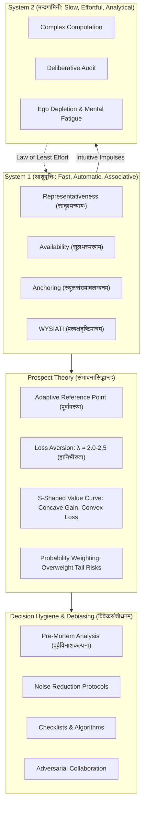

# संभावनापञ्चाशिका : निर्णयविज्ञानम्
## *Sambhāvanā-Pañcāśikā: Nirṇaya-Vijñānam*
### A 50-Verse Classical Sanskrit Technical Treatise on Prospect Theory, Cognitive Biases and Behavioral Decision Science
#### Based on the Foundations of Daniel Kahneman and Amos Tversky

---

## उपोद्घातः (Architectural Introduction)

Human cognition is not a flawless logical engine executing neoclassical optimization calculus. As established by Daniel Kahneman and Amos Tversky, human decision-making is mediated by evolved heuristics, associative shortcuts and profound cognitive asymmetries. The mind operates under a dual architecture: an automatic, fast System 1 (आशुवृत्तिः) and an effortful, slow System 2 (मन्दगामिनी). When System 2 uncritically accepts intuitive approximations, human choice falls prey to systematic distortions: the representativeness heuristic, availability cascades, anchoring gravity and base-rate neglect.

Furthermore, Kahneman and Tversky demolished expected utility theory by formalizing **Prospect Theory**: demonstrating that psychological value is evaluated from an adaptive reference point rather than absolute wealth states, that losses loom twice as large as equivalent gains (loss aversion: हानिभीरुता), that humans are risk-averse for gains but desperately risk-seeking for losses and that decision weights non-linearly overreact to low-probability tail risks while underreacting to moderate likelihoods.

This treatise, **संभावनापञ्चाशिका : निर्णयविज्ञानम्** (*Sambhāvanā-Pañcāśikā: Nirṇaya-Vijñānam*), formalizes the complete architecture of behavioral economics across 50 metrically pure Anuṣṭubh verses (अनुष्टुप् छन्दः, पथ्यावक्त्र नियम). Each verse is paired with complete Pāṇinian morphological analysis and deep domain-specific decision commentary.



---

## Canto 1: द्विचित्तव्यवस्थाविवेकः
### *The Dual-Process Architecture: System 1 Fast & Intuitive vs System 2 Slow & Deliberative*

#### Verse 1

```sanskrit
द्विविधं वर्तते चित्तं मानवानां स्वभावतः ।
आशुवृत्तिः परा चैका द्वितीया मन्दगामिनी ॥
```

**पदच्छेदः:** द्विविधम् वर्तते चित्तम् मानवानाम् स्वभावतः । आशु-वृत्तिः परा च एका द्वितीया मन्द-गामिनी ॥

**पाणिनीय-व्याकरण-सारणी:**

| पदम् | मूलप्रकृतिः / धातुः | पदविभागः | विभक्तिः / प्रत्ययः | व्याख्या / कारकार्थः |
| :--- | :--- | :--- | :--- | :--- |
| **द्विविधम्** | `द्विविध` | विशेषण | प्रथमा एकवचन नपुंसकलिंग | चित्तम् इत्यस्य विशेषणम् (twofold / dual-mode) |
| **वर्तते** | `√वृत् + लट्` | आत्मनेपद लट् | प्रथमपुरुष एकवचन | विद्यते (operates / exists) |
| **चित्तम्** | `चित्त` | नपुंसकलिंग नाम | प्रथमा एकवचन | मनोव्यवस्था (cognitive mental architecture) |
| **मानवानाम्** | `मानव` | पुंलिंग नाम | षष्ठी बहुवचन | नराणाम् (of human beings) |
| **स्वभावतः** | `स्वभाव + तसिँ` | अव्ययम् | अव्ययम् | नैसर्गिकेण (by inherent nature) |
| **आशुवृत्तिः** | `आशु + वृत्ति` | कर्मधारय स्त्रीलिंग | प्रथमा एकवचन | शीघ्रगामिनी व्यवस्था / सिस्टम-१ (the fast associative System 1) |
| **परा** | `पर` | सर्वनाम स्त्रीलिंग | प्रथमा एकवचन | प्रथमा (the first mode) |
| **च** | `च` | अव्ययम् | अव्ययम् | समुच्चये (and) |
| **एका** | `एक` | संख्यावाचक स्त्रीलिंग | प्रथमा एकवचन | प्रथमा (one) |
| **द्वितीया** | `द्वितीय` | पूरणप्रत्ययान्त स्त्रीलिंग | प्रथमा एकवचन | मन्दव्यवस्था / सिस्टम-२ (the deliberative System 2) |
| **मन्दगामिनी** | `मन्द + गामिन् + ङीप्` | उपपद-तत्पुरुष स्त्रीलिंग | प्रथमा एकवचन | शनैर्विमर्शकारिणी (slow, deliberative and effortful) |

**निर्णयविज्ञान-भाष्यम् (Decision Science Commentary):** The Dual-Process Architecture: Daniel Kahneman and Amos Tversky conceptualize human cognition as governed by two distinct operating modes. System 1 (आशुवृत्तिः) operates automatically, effortlessly and rapidly with little or no conscious volition. System 2 (मन्दगामिनी) allocates executive cognitive attention to effortful mental operations, complex computations, formal logic and conscious choice.

---

#### Verse 2

```sanskrit
विना यत्नं विना चिन्तां सहजा संप्रवर्तते ।
आद्यवृत्तिः सदा जाग्रत् संवेगसहिता द्रुता ॥
```

**पदच्छेदः:** विना यत्नम् विना चिन्ताम् सहजा संप्रवर्तते । आद्य-वृत्तिः सदा जाग्रत् संवेग-सहिता द्रुता ॥

**पाणिनीय-व्याकरण-सारणी:**

| पदम् | मूलप्रकृतिः / धातुः | पदविभागः | विभक्तिः / प्रत्ययः | व्याख्या / कारकार्थः |
| :--- | :--- | :--- | :--- | :--- |
| **विना** | `विना` | अव्ययम् | अव्ययम् | वर्जने (without) |
| **यत्नम्** | `यत्न` | पुंलिंग नाम | द्वितीया एकवचन | श्रमम् (effort / metabolic expenditure) |
| **विना** | `विना` | अव्ययम् | अव्ययम् | वर्जने (without) |
| **चिन्ताम्** | `चिन्ता` | स्त्रीलिंग नाम | द्वितीया एकवचन | सचेतनविमर्शम् (deliberative contemplation) |
| **सहजा** | `सहज` | विशेषण स्त्रीलिंग | प्रथमा एकवचन | नैसर्गिकी (innate / automatic) |
| **संप्रवर्तते** | `सम् + प्र + √वृत् + लट्` | आत्मनेपद लट् | प्रथमपुरुष एकवचन | प्रचलति (activates spontaneously) |
| **आद्यवृत्तिः** | `आद्य + वृत्ति` | कर्मधारय स्त्रीलिंग | प्रथमा एकवचन | सिस्टम-१ (System 1) |
| **सदा** | `सदा` | अव्ययम् | अव्ययम् | सर्वदा (always) |
| **जाग्रत्** | `√जागृ + शतृ` | कृदन्तरूप स्त्रीलिंग | प्रथमा एकवचन | जागरूकस्वभावा (ever-vigilant in the background) |
| **संवेगसहिता** | `संवेग + सहित` | तृतीया-तत्पुरुष स्त्रीलिंग | प्रथमा एकवचन | भावात्मिका (emotion-laden and associative) |
| **द्रुता** | `द्रुत` | विशेषण स्त्रीलिंग | प्रथमा एकवचन | शीघ्रगामिनी (blazingly fast) |

**निर्णयविज्ञान-भाष्यम् (Decision Science Commentary):** System 1 Characteristics: System 1 functions continuously below conscious awareness. It recognizes facial expressions of hostility in 50 milliseconds, detects the source of sudden loud sounds, completes familiar idioms and drives associative semantic activations. It operates without deliberate volition, drawing upon evolutionary heuristics and associative memory networks.

---

#### Verse 3

```sanskrit
द्वितीया चिन्तने लग्ना सावधानविवेकतः ।
आयाससाध्या मन्दा सा श्रमेण परिखिद्यते ॥
```

**पदच्छेदः:** द्वितीया चिन्तने लग्ना सावधान-विवेकतः । आयास-साध्या मन्दा सा श्रमेण परिखिद्यते ॥

**पाणिनीय-व्याकरण-सारणी:**

| पदम् | मूलप्रकृतिः / धातुः | पदविभागः | विभक्तिः / प्रत्ययः | व्याख्या / कारकार्थः |
| :--- | :--- | :--- | :--- | :--- |
| **द्वितीया** | `द्वितीय` | स्त्रीलिंग नाम | प्रथमा एकवचन | सिस्टम-२ (System 2) |
| **चिन्तने** | `चिन्तन` | नपुंसकलिंग नाम | सप्तमी एकवचन | विमर्शे (in complex analytical contemplation) |
| **लग्ना** | `√लग् + क्त` | कृदन्तरूप स्त्रीलिंग | प्रथमा एकवचन | संलग्ना (engaged) |
| **सावधानविवेकतः** | `सावधान + विवेक + तसिँ` | अव्ययम् | अव्ययम् | सचेतनावधानेन (through focused executive scrutiny) |
| **आयाससाध्या** | `आयास + साध्य` | तृतीया-तत्पुरुष स्त्रीलिंग | प्रथमा एकवचन | प्रयत्नगम्या (demanding strenuous cognitive effort) |
| **मन्दा** | `मन्द` | विशेषण स्त्रीलिंग | प्रथमा एकवचन | शनैर्गता (slow and deliberate) |
| **सा** | `तद्` | सर्वनाम स्त्रीलिंग | प्रथमा एकवचन | सा व्यवस्था (that faculty) |
| **श्रमेण** | `श्रम` | पुंलिंग नाम | तृतीया एकवचन | ऊर्जाक्षयेण (by metabolic and mental exertion) |
| **परिखिद्यते** | `परि + √खिद् + लट्` | आत्मनेपद लट् | प्रथमपुरुष एकवचन | क्लान्तिं प्राप्नोति (suffers ego depletion and mental fatigue) |

**निर्णयविज्ञान-भाष्यम् (Decision Science Commentary):** System 2 Characteristics and Cognitive Depletion: System 2 requires scarce working memory and executive focus. It multiplies multi-digit numbers (e.g. 17 x 24), validates syllogisms and checks statistical distributions. Because it consumes significant glucose and sustained neural focus, prolonged System 2 engagement causes ego depletion, rendering subsequent impulse control and rigorous reasoning vulnerable to fatigue.

---

#### Verse 4

```sanskrit
श्रमभीरुर्मनांसि स्याद् द्वितीया संप्रमुह्यति ।
आद्यवृत्तेश्च विश्वासात् भ्रमजालं प्रपद्यते ॥
```

**पदच्छेदः:** श्रम-भीरुः मनांसि स्यात् द्वितीया संप्रमुह्यति । आद्य-वृत्तेः च विश्वासात् भ्रम-जालम् प्रपद्यते ॥

**पाणिनीय-व्याकरण-सारणी:**

| पदम् | मूलप्रकृतिः / धातुः | पदविभागः | विभक्तिः / प्रत्ययः | व्याख्या / कारकार्थः |
| :--- | :--- | :--- | :--- | :--- |
| **श्रमभीरुः** | `श्रम + भीरु` | तृतीया-तत्पुरुष पुंलिंग | प्रथमा एकवचन | परिश्रमभीरुका (effort-averse by cognitive law) |
| **मनांसि** | `मनस्` | नपुंसकलिंग नाम | द्वितीया बहुवचन | चेतसि (in human minds) |
| **स्यात्** | `√अस् + विधि-लिङ्` | परस्मैपद लिङ् | प्रथमपुरुष एकवचन | भवेत् (may be) |
| **द्वितीया** | `द्वितीय` | स्त्रीलिंग नाम | प्रथमा एकवचन | सिस्टम-२ (System 2) |
| **संप्रमुह्यति** | `सम् + प्र + √मुह् + लट्` | परस्मैपद लट् | प्रथमपुरुष एकवचन | मोहिता भवति (becomes complacent and uncritical) |
| **आद्यवृत्तेः** | `आद्य + वृत्ति` | कर्मधारय स्त्रीलिंग | षष्ठी एकवचन | सिस्टम-१ इत्यस्याः (of System 1) |
| **च** | `च` | अव्ययम् | अव्ययम् | समुच्चये (and) |
| **विश्वासात्** | `विश्वास` | पुंलिंग नाम | पञ्चमी एकवचन | अन्धानुसरणात् (from blind unverified acceptance) |
| **भ्रमजालम्** | `भ्रम + जाल` | षष्ठी-तत्पुरुष नपुंसकलिंग | द्वितीया एकवचन | विभ्रान्तिजालम् (the web of cognitive illusions) |
| **प्रपद्यते** | `प्र + √पद् + लट्` | आत्मनेपद लट् | प्रथमपुरुष एकवचन | प्राप्नोति (succumbs to) |

**निर्णयविज्ञान-भाष्यम् (Decision Science Commentary):** The Law of Least Effort and Complacency: System 2 is fundamentally lazy. To preserve cognitive energy, it routinely ratifies the impressions, intuitive feelings and causal shortcuts offered by System 1 without rigorous verification. When System 2 operates as an uncritical rubber stamp, human decision-makers fall into pervasive systematic cognitive biases.

---

#### Verse 5

```sanskrit
यदालोक्यं तदेवेति मन्यते मूढचेतनः ।
अदृष्टं नैव जानाति भ्रान्तो भ्रमितमानसः ॥
```

**पदच्छेदः:** यत् आलोक्यम् तत् एव इति मन्यते मूढ-चेतनः । अदृष्टम् न एव जानाति भ्रान्तः भ्रमित-मानसः ॥

**पाणिनीय-व्याकरण-सारणी:**

| पदम् | मूलप्रकृतिः / धातुः | पदविभागः | विभक्तिः / प्रत्ययः | व्याख्या / कारकार्थः |
| :--- | :--- | :--- | :--- | :--- |
| **यत्** | `यद्` | सर्वनाम नपुंसकलिंग | प्रथमा एकवचन | उपलब्धम् (whatever is immediately visible) |
| **आलोक्यम्** | `आ + √लोक् + ण्यत्` | कृदन्तरूप नपुंसकलिंग | प्रथमा एकवचन | प्रत्यक्षदृश्यम् (readily observable) |
| **तत्** | `तद्` | सर्वनाम नपुंसकलिंग | प्रथमा एकवचन | तदेव सर्वम् (that alone is the totality) |
| **एव** | `एव` | अव्ययम् | अव्ययम् | अवधारणे (exclusively) |
| **इति** | `इति` | अव्ययम् | अव्ययम् | प्रकारार्थे (thus) |
| **मन्यते** | `√मन् + लट्` | आत्मनेपद लट् | प्रथमपुरुष एकवचन | कल्पयति (believes) |
| **मूढचेतनः** | `मूढ + चेतन` | बहुव्रीहि पुंलिंग | प्रथमा एकवचन | अविद्वान् जनः (the unreflective decision-maker) |
| **अदृष्टम्** | `अ + दृष्ट` | नञ्-तत्पुरुष नपुंसकलिंग | द्वितीया एकवचन | अनुपलब्ध-दत्तम् (unseen missing evidence) |
| **न** | `न` | अव्ययम् | अव्ययम् | निषेधे (not) |
| **एव** | `एव` | अव्ययम् | अव्ययम् | निश्चये (indeed) |
| **जानाति** | `√ज्ञा + लट्` | परस्मैपद लट् | प्रथमपुरुष एकवचन | अवगच्छति (perceives or accounts for) |
| **भ्रान्तः** | `√भ्रम् + क्त` | कृदन्तरूप पुंलिंग | प्रथमा एकवचन | वञ्चितः (deluded) |
| **भ्रमितमानसः** | `भ्रमित + मनस्` | बहुव्रीहि पुंलिंग | प्रथमा एकवचन | विमूढचित्तः (with an entrained mind) |

**निर्णयविज्ञान-भाष्यम् (Decision Science Commentary):** WYSIATI (What You See Is All There Is): System 1 excels at constructing coherent associative narratives from whatever sparse fragments of data are immediately at hand. It exhibits absolute insensitivity to the quality or quantity of information omitted. Decision-makers leap to sweeping conclusions based solely on readily visible observations, completely blind to missing baseline distributions.

---

## Canto 2: संभावनान्यायः संक्षेपोपायविवेकश्च
### *The Heuristics of Judgment: Representativeness, Availability and Anchoring*

#### Verse 6

```sanskrit
कठिनस्य हि प्रश्नस्य स्थापने सुलभोत्तरम् ।
उपायेनाशु गृह्णाति चित्तं लाघवकाङ्क्षया ॥
```

**पदच्छेदः:** कठिनस्य हि प्रश्नस्य स्थापने सुलभ-उत्तरम् । उपायेन आशु गृह्णाति चित्तम् लाघव-काङ्क्षया ॥

**पाणिनीय-व्याकरण-सारणी:**

| पदम् | मूलप्रकृतिः / धातुः | पदविभागः | विभक्तिः / प्रत्ययः | व्याख्या / कारकार्थः |
| :--- | :--- | :--- | :--- | :--- |
| **कठिनस्य** | `कठिन` | विशेषण | षष्ठी एकवचन पुंलिंग | प्रश्नस्य विशेषणम् (of an intractable target question) |
| **हि** | `हि` | अव्ययम् | अव्ययम् | प्रसिद्धौ (indeed) |
| **प्रश्नस्य** | `प्रश्न` | पुंलिंग नाम | षष्ठी एकवचन | विचारणीयस्य (of the query) |
| **स्थापने** | `स्थापन` | नपुंसकलिंग नाम | सप्तमी एकवचन | स्थाने (in place of) |
| **सुलभोत्तरम्** | `सुलभ + उत्तर` | कर्मधारय नपुंसकलिंग | द्वितीया एकवचन | सरलप्रतिवचनम् (an easy heuristic surrogate answer) |
| **उपायेन** | `उपाय` | पुंलिंग नाम | तृतीया एकवचन | संक्षेपेण (through heuristic substitution) |
| **आशु** | `आशु` | अव्ययम् | अव्ययम् | शीघ्रम् (rapidly) |
| **गृह्णाति** | `√ग्रह् + लट्` | परस्मैपद लट् | प्रथमपुरुष एकवचन | स्वीकरोति (adopts) |
| **चित्तम्** | `चित्त` | नपुंसकलिंग नाम | प्रथमा एकवचन | मनः (the mind) |
| **लाघवकाङ्क्षया** | `लाघव + काङ्क्षा` | षष्ठी-तत्पुरुष स्त्रीलिंग | तृतीया एकवचन | श्रमपरिहारार्थम् (out of desire for cognitive ease) |

**निर्णयविज्ञान-भाष्यम् (Decision Science Commentary):** Attribute Substitution (Heuristic Replacement): When confronted with an intractable, complex target question (e.g. 'What is the probability that this startup will succeed over 10 years?'), System 1 transparently substitutes an easier heuristic question (e.g. 'How much do I like the founders charismatic presentation?'). The decision-maker answers the surrogate question with high subjective confidence.

---

#### Verse 7

```sanskrit
सादृश्यं दृश्यते यत्र तत्र सत्यं प्रमन्यते ।
मूलसंख्याविहीनं तद् रूपमात्रेण वञ्च्यते ॥
```

**पदच्छेदः:** सादृश्यम् दृश्यते यत्र तत्र सत्यम् प्रमन्यते । मूल-संख्या-विहीनम् तत् रूप-मात्रेण वञ्च्यते ॥

**पाणिनीय-व्याकरण-सारणी:**

| पदम् | मूलप्रकृतिः / धातुः | पदविभागः | विभक्तिः / प्रत्ययः | व्याख्या / कारकार्थः |
| :--- | :--- | :--- | :--- | :--- |
| **सादृश्यम्** | `सादृश्य` | नपुंसकलिंग नाम | प्रथमा एकवचन | प्रतिरूपता (representativeness / resemblance) |
| **दृश्यते** | `√दृश् + कर्मणि लट्` | कर्मणि लट् | प्रथमपुरुष एकवचन | अवलोक्यते (is seen) |
| **यत्र** | `यत्र` | अव्ययम् | अव्ययम् | यस्मिन् स्थाने (wherever) |
| **तत्र** | `तत्र` | अव्ययम् | अव्ययम् | तस्मिन् स्थाने (there) |
| **सत्यम्** | `सत्य` | नपुंसकलिंग नाम | द्वितीया एकवचन | तथ्यम् (truth / high probability) |
| **प्रमन्यते** | `प्र + √मन् + लट्` | आत्मनेपद लट् | प्रथमपुरुष एकवचन | दृढं कल्पयति (presumes) |
| **मूलसंख्याविहीनम्** | `मूल + संख्या + विहीन` | तृतीया-तत्पुरुष नपुंसकलिंग | द्वितीया एकवचन | आधारसंख्यारहितम् (neglecting statistical base rates) |
| **तत्** | `तद्` | सर्वनाम नपुंसकलिंग | प्रथमा एकवचन | निर्णयचित्तम् (that judgment) |
| **रूपमात्रेण** | `रूप + मात्र` | तृतीया-तत्पुरुष नपुंसकलिंग | तृतीया एकवचन | बाह्यसादृश्येन (merely by superficial stereotype) |
| **वञ्च्यते** | `√वञ्च् + कर्मणि लट्` | कर्मणि लट् | प्रथमपुरुष एकवचन | प्रतार्यते (is systematically deceived) |

**निर्णयविज्ञान-भाष्यम् (Decision Science Commentary):** The Representativeness Heuristic: When people judge probability by how closely an individual case resembles a mental archetype (e.g. the famous Linda Problem or Tom W. study), they commit the conjunction fallacy and base-rate neglect. A detailed narrative resemblance overpowers formal Kolmogorov probability axioms, causing severe miscalculations in clinical diagnosis, hiring and investing.

---

#### Verse 8

```sanskrit
सुलभस्मरणं यत्र तत्र सम्भाव्यते भयम् ।
स्मृतिसुलभमार्गेण भीतिर्जायेत दारुणा ॥
```

**पदच्छेदः:** सुलभ-स्मरणम् यत्र तत्र सम्भाव्यते भयम् । स्मृति-सुलभ-मार्गेण भीतिः जायेत दारुणा ॥

**पाणिनीय-व्याकरण-सारणी:**

| पदम् | मूलप्रकृतिः / धातुः | पदविभागः | विभक्तिः / प्रत्ययः | व्याख्या / कारकार्थः |
| :--- | :--- | :--- | :--- | :--- |
| **सुलभस्मरणम्** | `सुलभ + स्मरण` | कर्मधारय नपुंसकलिंग | प्रथमा एकवचन | आशुस्मृतिगम्यम् (cognitive ease of episodic retrieval) |
| **यत्र** | `यत्र` | अव्ययम् | अव्ययम् | यस्मिन् (wherever) |
| **तत्र** | `तत्र` | अव्ययम् | अव्ययम् | तस्मिन् (there) |
| **सम्भाव्यते** | `सम् + √भू + णिच् + कर्मणि लट्` | कर्मणि लट् | प्रथमपुरुष एकवचन | अनुमीयते (is judged highly probable) |
| **भयम्** | `भय` | नपुंसकलिंग नाम | प्रथमा एकवचन | सङ्कटम् (catastrophic risk) |
| **स्मृतिसुलभमार्गेण** | `स्मृति + सुलभ + मार्ग` | तृतीया-तत्पुरुष पुंलिंग | तृतीया एकवचन | उपलब्धता-न्यायेन (via the availability heuristic) |
| **भीतिः** | `भीति` | स्त्रीलिंग नाम | प्रथमा एकवचन | त्रासः (terror or panic) |
| **जायेत** | `√जन् + विधि-लिङ्` | आत्मनेपद लिङ् | प्रथमपुरुष एकवचन | उत्पद्यते (is generated) |
| **दारुणा** | `दारुण` | विशेषण स्त्रीलिंग | प्रथमा एकवचन | भीकरा (severe / disproportionate) |

**निर्णयविज्ञान-भाष्यम् (Decision Science Commentary):** The Availability Heuristic: Frequency and probability are evaluated by the ease with which concrete instances come to mind. Vivid, sensational and media-amplified events (such as plane crashes, nuclear accidents, or terrorist attacks) are effortlessly recalled from memory. Consequently, people dramatically overestimate the statistical probability of vivid tail hazards while neglecting quiet everyday killers.

---

#### Verse 9

```sanskrit
दृष्टे पूर्वमदृष्टे वा संलग्ने स्थूलसंख्ये ।
तदाधारेण निर्णयः क्रियते मोहितैर्जनैः ॥
```

**पदच्छेदः:** दृष्टे पूर्वम् अदृष्टे वा संलग्ने स्थूल-संख्ये । तत्-आधारेण निर्णयः क्रियते मोहितैः जनैः ॥

**पाणिनीय-व्याकरण-सारणी:**

| पदम् | मूलप्रकृतिः / धातुः | पदविभागः | विभक्तिः / प्रत्ययः | व्याख्या / कारकार्थः |
| :--- | :--- | :--- | :--- | :--- |
| **दृष्टे** | `√दृश् + क्त` | कृदन्तरूप सप्तमी एकवचन | सति-सप्तमी | अवलोकिते सति (upon being encountered) |
| **पूर्वम्** | `पूर्वम्` | अव्ययम् | अव्ययम् | प्राक् (beforehand) |
| **अदृष्टे** | `अ + दृष्ट` | नञ्-तत्पुरुष सप्तमी एकवचन | सति-सप्तमी | अनपेक्षिते वा (or even if irrelevant) |
| **वा** | `वा` | अव्ययम् | अव्ययम् | विकल्पे (or) |
| **संलग्ने** | `सम् + √लग् + क्त` | कृदन्तरूप सप्तमी एकवचन | सति-सप्तमी | उपस्थिते सति (when primed) |
| **स्थूलसंख्ये** | `स्थूल + संख्या` | कर्मधारय सप्तमी एकवचन स्त्रीलिंग | सति-सप्तमी | अङ्के (in an arbitrary numerical figure) |
| **तदाधारेण** | `तद् + आधार` | षष्ठी-तत्पुरुष पुंलिंग | तृतीया एकवचन | कीलकावलम्बनेन (on the basis of that numerical anchor) |
| **निर्णयः** | `निर्णय` | पुंलिंग नाम | प्रथमा एकवचन | संख्यानुमानम् (quantitative estimation) |
| **क्रियते** | `√कृ + कर्मणि लट्` | कर्मणि लट् | प्रथमपुरुष एकवचन | विधीयते (is executed) |
| **मोहितैः** | `√मुह् + णिच् + क्त` | कृदन्तरूप पुंलिंग | तृतीया बहुवचन | अज्ञानावृतैः (by biased decision-makers) |
| **जनैः** | `जन` | पुंलिंग नाम | तृतीया बहुवचन | मानवैः (by people) |

**निर्णयविज्ञान-भाष्यम् (Decision Science Commentary):** The Anchoring and Adjustment Heuristic: When people consider a specific numerical figure prior to estimating an unknown quantity, that anchor exerts a gravitational pull on subsequent estimates. Whether setting real estate listing prices, corporate valuations, or criminal sentencing guidelines, human adjustment from arbitrary anchors is consistently insufficient.

---

#### Verse 10

```sanskrit
गणितस्य प्रभावेन नैव पश्यन्ति सम्भवम् ।
कथाया रञ्जिते भावे मूढता संप्रवर्तते ॥
```

**पदच्छेदः:** गणितस्य प्रभावेन न एव पश्यन्ति सम्भवम् । कथायाः रञ्जिते भावे मूढता संप्रवर्तते ॥

**पाणिनीय-व्याकरण-सारणी:**

| पदम् | मूलप्रकृतिः / धातुः | पदविभागः | विभक्तिः / प्रत्ययः | व्याख्या / कारकार्थः |
| :--- | :--- | :--- | :--- | :--- |
| **गणितस्य** | `गणित` | नपुंसकलिंग नाम | षष्ठी एकवचन | सांख्यिकीशास्त्रस्य (of statistical mathematics) |
| **प्रभावेन** | `प्रभाव` | पुंलिंग नाम | तृतीया एकवचन | नियमेन (by the power of objective calculus) |
| **न** | `न` | अव्ययम् | अव्ययम् | प्रतिषेधे (not) |
| **एव** | `एव` | अव्ययम् | अव्ययम् | अवधारणे (indeed) |
| **पश्यन्ति** | `√दृश् + लट्` | परस्मैपद लट् | प्रथमपुरुष बहुवचन | अवलोकयन्ति (they do not observe) |
| **सम्भवम्** | `सम्भव` | पुंलिंग नाम | द्वितीया एकवचन | संभावनाम् (Bayesian probability / likelihood) |
| **कथायाः** | `कथा` | स्त्रीलिंग नाम | षष्ठी एकवचन | आख्यानस्य (of a compelling narrative) |
| **रञ्जिते** | `√रञ्ज् + क्त` | कृदन्तरूप सप्तमी एकवचन | सति-सप्तमी | आकर्षके सति (upon being emotionally colored) |
| **भावे** | `भाव` | पुंलिंग नाम | सप्तमी एकवचन | चित्तवृत्तौ (in emotional sentiment) |
| **मूढता** | `मूढ + तल्` | स्त्रीलिंग भाववाचक | प्रथमा एकवचन | अविवेकः (base-rate neglect and irrationality) |
| **संप्रवर्तते** | `सम् + प्र + √वृत् + लट्` | आत्मनेपद लट् | प्रथमपुरुष एकवचन | प्रसरति (proliferates) |

**निर्णयविज्ञान-भाष्यम् (Decision Science Commentary):** Base-Rate Neglect and Narrative Fallacy: When given both statistical base rates (objective priors) and a vivid idiosyncratic narrative, humans almost completely disregard the mathematical base rate. System 1 favors narrative coherence, causality and emotional resonance over Bayes Rule, leading to massive mispricing in finance, medicine and legal trials.

---

## Canto 3: संभावनासिद्धान्तः हानिभीरुता च
### *Prospect Theory: The S-Shaped Value Function and Loss Aversion*

#### Verse 11

```sanskrit
लम्भतो हि सुखं नूनं मूलस्थानेन गण्यते ।
स्थितेराधारभेदेन विचित्रा वर्तते मतिः ॥
```

**पदच्छेदः:** लम्भतः हि सुखम् नूनम् मूल-स्थानेन गण्यते । स्थितेः आधार-भेदेन विचित्रा वर्तते मतिः ॥

**पाणिनीय-व्याकरण-सारणी:**

| पदम् | मूलप्रकृतिः / धातुः | पदविभागः | विभक्तिः / प्रत्ययः | व्याख्या / कारकार्थः |
| :--- | :--- | :--- | :--- | :--- |
| **लम्भतः** | `लम्भ + तसिँ` | अव्ययम् | अव्ययम् | प्राप्तितः (from wealth gain) |
| **हि** | `हि` | अव्ययम् | अव्ययम् | निश्चये (indeed) |
| **सुखम्** | `सुख` | नपुंसकलिंग नाम | प्रथमा एकवचन | उपयोगिता / तृप्तिः (subjective psychological utility) |
| **ूनम्** | `नूनम्` | अव्ययम् | अव्ययम् | ध्रुवम् (verily) |
| **मूलस्थानेन** | `मूल + स्थान` | षष्ठी-तत्पुरुष नपुंसकलिंग | तृतीया एकवचन | प्रारम्भिकबिन्दुना (relative to an adaptive reference point) |
| **गण्यते** | `√गण् + कर्मणि लट्` | कर्मणि लट् | प्रथमपुरुष एकवचन | माप्यते (is evaluated) |
| **स्थितेः** | `स्थिति` | स्त्रीलिंग नाम | षष्ठी एकवचन | पूर्वावस्थायाः (of prior status quo asset level) |
| **आधारभेदेन** | `आधार + भेद` | षष्ठी-तत्पुरुष पुंलिंग | तृतीया एकवचन | सन्दर्भभेदेन (by changes in reference states) |
| **विचित्रा** | `विचित्र` | विशेषण स्त्रीलिंग | प्रथमा एकवचन | अरेखीयस्वभावा (non-linear and asymmetrical) |
| **वर्तते** | `√वृत् + लट्` | आत्मनेपद लट् | प्रथमपुरुष एकवचन | विद्यते (exists) |
| **मतिः** | `मति` | स्त्रीलिंग नाम | प्रथमा एकवचन | मानवबुद्धिः (human evaluation) |

**निर्णयविज्ञान-भाष्यम् (Decision Science Commentary):** Flaw of Expected Utility Theory: Classical economics (Bernoulli) assumed that utility is a function of absolute terminal wealth states. Kahneman and Tversky demonstrated that the human perceptual apparatus responds to changes relative to an internal reference point (the status quo) rather than absolute levels. The same objective wealth state produces joy or misery depending on whether it represents a gain or a loss from baseline.

---

#### Verse 12

```sanskrit
लाभाद् द्विगुणदुःखेन हानिरुद्वेगकारिणी ।
प्राप्तितोषं विनाशेन समन्तादतिशेते सा ॥
```

**पदच्छेदः:** लाभात् द्विगुण-दुःखेन हानिः उद्वेग-कारिणी । प्राप्ति-तोषम् विनाशेन समन्तात् अतिशेते सा ॥

**पाणिनीय-व्याकरण-सारणी:**

| पदम् | मूलप्रकृतिः / धातुः | पदविभागः | विभक्तिः / प्रत्ययः | व्याख्या / कारकार्थः |
| :--- | :--- | :--- | :--- | :--- |
| **लाभात्** | `लाभ` | पुंलिंग नाम | पञ्चमी एकवचन | प्राप्तेस्तुलनायाम् (compared to an equivalent gain) |
| **द्विगुणदुःखेन** | `द्विगुण + दुःख` | कर्मधारय नपुंसकलिंग | तृतीया एकवचन | द्विगुणितक्लेशेन (with approximately twice the emotional distress) |
| **हानिः** | `हानि` | स्त्रीलिंग नाम | प्रथमा एकवचन | विनाशः (a financial or status loss) |
| **उद्वेगकारिणी** | `उद्वेग + कारिन् + ङीप्` | उपपद-तत्पुरुष स्त्रीलिंग | प्रथमा एकवचन | चित्तोद्वेगजनिका (psychologically traumatic) |
| **प्राप्तितोषम्** | `प्राप्ति + तोष` | षष्ठी-तत्पुरुष पुंलिंग | द्वितीया एकवचन | लाभजनिततृप्तिम् (the satisfaction of gaining) |
| **विनाशेन** | `विनाश` | पुंलिंग नाम | तृतीया एकवचन | क्षयेण (by destructive loss) |
| **समन्तात्** | `समन्तात्` | अव्ययम् | अव्ययम् | सर्वतः (completely) |
| **अतिशेते** | `अति + √शी + लट्` | आत्मनेपद लट् | प्रथमपुरुष एकवचन | अतिक्रामति (losses loom larger than gains) |
| **सा** | `तद्` | सर्वनाम स्त्रीलिंग | प्रथमा एकवचन | हानिभीरुता (loss aversion) |

**निर्णयविज्ञान-भाष्यम् (Decision Science Commentary):** Loss Aversion (हानिभीरुता): Losses loom significantly larger than equivalent gains. Empirical psychophysics reveals a loss aversion coefficient lambda of approximately 2.0 to 2.5: losing 100 dollars inflicts twice the psychological pain that gaining 100 dollars produces in pleasure. This profound evolutionary asymmetry drives conservative status quo bias and risk-averse contracting.

---

#### Verse 13

```sanskrit
धने लब्धे सुखं हीनं ह्रासमाप्नोति सर्वथा ।
हानौ जाता विपर्यस्ता साहसं जायते ध्रुवम् ॥
```

**पदच्छेदः:** धने लब्धे सुखम् हीनम् ह्रासम् आप्नोति सर्वथा । हानौ जाता विपर्यस्ता साहसम् जायते ध्रुवम् ॥

**पाणिनीय-व्याकरण-सारणी:**

| पदम् | मूलप्रकृतिः / धातुः | पदविभागः | विभक्तिः / प्रत्ययः | व्याख्या / कारकार्थः |
| :--- | :--- | :--- | :--- | :--- |
| **धने** | `धन` | नपुंसकलिंग नाम | सप्तमी एकवचन | सति-सप्तमी : वित्तलाभे सति (upon gaining financial assets) |
| **लब्धे** | `√लभ् + क्त` | कृदन्तरूप सप्तमी एकवचन | सति-सप्तमी | प्राप्ते सति (when acquired) |
| **सुखम्** | `सुख` | नपुंसकलिंग नाम | प्रथमा एकवचन | तृप्तिः (incremental subjective value) |
| **हीनम्** | `हीन` | विशेषण | प्रथमा एकवचन नपुंसकलिंग | मन्दम् (diminished) |
| **ह्रासम्** | `ह्रास` | पुंलिंग नाम | द्वितीया एकवचन | अवरोहम् (concavity / diminishing sensitivity) |
| **आप्नोति** | `√आप् + लट्` | परस्मैपद लट् | प्रथमपुरुष एकवचन | गच्छति (undergoes) |
| **सर्वथा** | `सर्वथा` | अव्ययम् | अव्ययम् | निश्चयेन (entirely) |
| **हानौ** | `हानि` | स्त्रीलिंग नाम | सप्तमी एकवचन | सति-सप्तमी : नुकसाने सति (in the domain of losses) |
| **जाता** | `√जन् + क्त` | कृदन्तरूप स्त्रीलिंग | प्रथमा एकवचन | उत्पन्ना (manifested) |
| **विपर्यस्ता** | `वि + परि + √अस् + क्त` | कृदन्तरूप स्त्रीलिंग | प्रथमा एकवचन | उत्तलस्वरूपा (convex curvature) |
| **साहसम्** | `साहस` | नपुंसकलिंग नाम | प्रथमा एकवचन | जोखिमप्रियता (desperate risk-seeking behavior) |
| **जायते** | `√जन् + लट्` | आत्मनेपद लट् | प्रथमपुरुष एकवचन | उद्भवति (arises) |
| **ध्रुवम्** | `ध्रुवम्` | अव्ययम् | अव्ययम् | निश्चितम् (certainly) |

**निर्णयविज्ञान-भाष्यम् (Decision Science Commentary):** The S-Shaped Value Function and Diminishing Marginal Sensitivity: The subjective value function is concave for gains (producing risk-averse behavior for profitable gambles) and convex for losses (producing aggressive risk-seeking behavior to avoid sure losses). Gaining 200 dollars versus 100 dollars adds less incremental joy than gaining the first 100 dollars; losing 200 dollars versus 100 dollars induces reckless desperation to break even.

---

#### Verse 14

```sanskrit
पूर्वावस्थां समाश्रित्य लाभहान्योर्विचारणा ।
वर्तमानं त्यजन् मूढः पूर्वावस्थां न मुञ्चति ॥
```

**पदच्छेदः:** पूर्व-अवस्थाम् समाश्रित्य लाभ-हान्योः विचारणा । वर्तमानम् त्यजन् मूढः पूर्व-अवस्थाम् न मुञ्चति ॥

**पाणिनीय-व्याकरण-सारणी:**

| पदम् | मूलप्रकृतिः / धातुः | पदविभागः | विभक्तिः / प्रत्ययः | व्याख्या / कारकार्थः |
| :--- | :--- | :--- | :--- | :--- |
| **पूर्वावस्थाम्** | `पूर्व + अवस्था` | कर्मधारय स्त्रीलिंग | द्वितीया एकवचन | स्थितिम् (the initial status quo reference point) |
| **समाश्रित्य** | `सम् + आ + √श्रि + ल्यप्` | कृदन्तरूप अव्यय | अव्ययम् | आवलम्ब्य (anchoring upon) |
| **लाभहान्योः** | `लाभ + हानि` | द्वन्द्व षष्ठी द्विवचन | षष्ठी द्विवचन | प्राप्तिविनाशयोः (of gains and losses) |
| **विचारणा** | `विचारणा` | स्त्रीलिंग नाम | प्रथमा एकवचन | गणना (cognitive evaluation) |
| **वर्तमानम्** | `√वृत् + मानच्` | कृदन्तरूप नपुंसकलिंग | द्वितीया एकवचन | सद्यःस्थितिम (the objective present reality) |
| **त्यजन्** | `√त्यज् + शतृ` | कृदन्तरूप पुंलिंग | प्रथमा एकवचन | उपेक्षमाणः (ignoring) |
| **मूढः** | `मूढ` | विशेषण पुंलिंग | प्रथमा एकवचन | भ्रान्तजनः (the irrational agent) |
| **पूर्वावस्थाम्** | `पूर्व + अवस्था` | कर्मधारय स्त्रीलिंग | द्वितीया एकवचन | गतस्थानम् (the historical acquisition price) |
| **न** | `न` | अव्ययम् | अव्ययम् | प्रतिषेधे (not) |
| **मुञ्चति** | `√मुच् + लट्` | परस्मैपद लट् | प्रथमपुरुष एकवचन | त्यजति (does not relinquish) |

**निर्णयविज्ञान-भाष्यम् (Decision Science Commentary):** Reference Point Stickiness and the Status Quo Bias: Agents anchor their mental ledger on historical benchmarks: such as the purchase price of a falling stock or the original acquisition cost of real estate: rather than adjusting their reference point to current market realities. Refusing to reset the reference point freezes rational portfolio rebalancing.

---

#### Verse 15

```sanskrit
लाभं शीघ्रमवाप्नोति हानिं धारयते चिरम् ।
अङ्गीकर्तुं न शक्नोति पराजयमचेतनः ॥
```

**पदच्छेदः:** लाभम् शीघ्रम् अवाप्नोति हानिम् धारयते चिरम् । अङ्गीकर्तुम् न शक्नोति पराजयम् अचेतनः ॥

**पाणिनीय-व्याकरण-सारणी:**

| पदम् | मूलप्रकृतिः / धातुः | पदविभागः | विभक्तिः / प्रत्ययः | व्याख्या / कारकार्थः |
| :--- | :--- | :--- | :--- | :--- |
| **लाभम्** | `लाभ` | पुंलिंग नाम | द्वितीया एकवचन | वृद्धिम् (realized profit) |
| **शीघ्रम्** | `शीघ्रम्` | अव्ययम् | अव्ययम् | द्रुतम् (prematurely) |
| **अवाप्नोति** | `अव + √आप् + लट्` | परस्मैपद लट् | प्रथमपुरुष एकवचन | स्वीकरोति (realizes / sells winners) |
| **हानिम्** | `हानि` | स्त्रीलिंग नाम | द्वितीया एकवचन | नुकसानम् (underwater paper losses) |
| **धारयते** | `√धृ + णिच् + लट्` | आत्मनेपद लट् | प्रथमपुरुष एकवचन | रक्षति (holds stubbornly) |
| **चिरम्** | `चिरम्` | अव्ययम् | अव्ययम् | दीर्घकालम् (indefinitely) |
| **अङ्गीकर्तुम्** | `अङ्गी + √कृ + तुमुन्` | कृदन्तरूप अव्यय | अव्ययम् | स्वीकर्तुम् (to crystallize / accept) |
| **न** | `न` | अव्ययम् | अव्ययम् | प्रतिषेधे (cannot) |
| **शक्नोति** | `√शक् + लट्` | परस्मैपद लट् | प्रथमपुरुष एकवचन | समर्थो भवति (is able) |
| **पराजयम्** | `पराजय` | पुंलिंग नाम | द्वितीया एकवचन | नुकसानस्वीकारम् (financial loss and bruised ego) |
| **अचेतनः** | `अ + चेतन` | नञ्-तत्पुरुष पुंलिंग | प्रथमा एकवचन | अविद्वान् संज्ञानहीनः (the behavioral investor) |

**निर्णयविज्ञान-भाष्यम् (Decision Science Commentary):** The Disposition Effect: A direct consequence of the S-shaped value function in financial markets. Investors exhibit a stubborn propensity to sell winning investments too early (locking in certain gains on the concave side) while riding losing investments far too long (gambling on convex loss recovery to avoid the psychological pain of admitting defeat).

---

## Canto 4: संभावनावक्रता चरमघटनाभ्रमश्च
### *Probability Weighting Function and Extreme Event Overweighting*

#### Verse 16

```sanskrit
संभावना न गणिते साक्षाद्रूपेण वर्तते ।
चित्ते तु भारभेदेन विकृता संप्रतीयते ॥
```

**पदच्छेदः:** संभावना न गणिते साक्षात्-रूपेण वर्तते । चित्ते तु भार-भेदेन विकृता संप्रतीयते ॥

**पाणिनीय-व्याकरण-सारणी:**

| पदम् | मूलप्रकृतिः / धातुः | पदविभागः | विभक्तिः / प्रत्ययः | व्याख्या / कारकार्थः |
| :--- | :--- | :--- | :--- | :--- |
| **संभावना** | `संभावना` | स्त्रीलिंग नाम | प्रथमा एकवचन | वस्तुगतसम्भाव्यता / p (objective probability) |
| **न** | `न` | अव्ययम् | अव्ययम् | प्रतिषेधे (not) |
| **गणिते** | `गणित` | नपुंसकलिंग नाम | सप्तमी एकवचन | सांख्यिकीरीत्या (mathematically) |
| **साक्षाद्रूपेण** | `साक्षात् + रूप` | कर्मधारय नपुंसकलिंग | तृतीया एकवचन | अविकृतरूपेण (linearly as itself) |
| **वर्तते** | `√वृत् + लट्` | आत्मनेपद लट् | प्रथमपुरुष एकवचन | भवति (operates) |
| **चित्ते** | `चित्त` | नपुंसकलिंग नाम | सप्तमी एकवचन | मानवे मनसि (in psychological perception) |
| **तु** | `तु` | अव्ययम् | अव्ययम् | विशेषे (however) |
| **भारभेदेन** | `भार + भेद` | षष्ठी-तत्पुरुष पुंलिंग | तृतीया एकवचन | निर्णयभारकार्यक्रमेण / pi(p) (by the non-linear decision weighting function) |
| **विकृता** | `वि + √कृ + क्त` | कृदन्तरूप स्त्रीलिंग | प्रथमा एकवचन | अरेखीयस्वरूपा (distorted) |
| **संप्रतीयते** | `सम् + प्र + √इ + कर्मणि लट्` | कर्मणि लट् | प्रथमपुरुष एकवचन | अनुभूयते (is experienced) |

**निर्णयविज्ञान-भाष्यम् (Decision Science Commentary):** The Non-Linear Probability Weighting Function pi(p): Expected Utility Theory assumes decision weights equal objective probabilities: a 1 percent shift from 34 percent to 35 percent carries identical weight to a shift from 99 percent to 100 percent. Kahneman and Tversky proved that the human mind maps probabilities through an inverted S-curve: severely overweighting extreme tail probabilities and underweighting moderate and high probabilities.

---

#### Verse 17

```sanskrit
अत्यल्पा सम्भवेद् यत्र घटना तत्र लालसा ।
भयं वा दृश्यते तीव्रं संभ्रमो वर्तते महान् ॥
```

**पदच्छेदः:** अत्यल्पा सम्भवेत् यत्र घटना तत्र लालसा । भयम् वा दृश्यते तीव्रम् संभ्रमः वर्तते महान् ॥

**पाणिनीय-व्याकरण-सारणी:**

| पदम् | मूलप्रकृतिः / धातुः | पदविभागः | विभक्तिः / प्रत्ययः | व्याख्या / कारकार्थः |
| :--- | :--- | :--- | :--- | :--- |
| **अत्यल्पा** | `अति + अल्प` | कर्मधारय स्त्रीलिंग | प्रथमा एकवचन | सूक्ष्मतमा / 0.0001 (microscopic tail probability) |
| **सम्भवेत्** | `सम् + √भू + विधि-लिङ्` | परस्मैपद लिङ् | प्रथमपुरुष एकवचन | भवेत् (might occur) |
| **यत्र** | `यत्र` | अव्ययम् | अव्ययम् | यस्मिन् विषये (wherever) |
| **घटना** | `घटना` | स्त्रीलिंग नाम | प्रथमा एकवचन | आपत् वा लाभो वा (outcome / extreme event) |
| **तत्र** | `तत्र` | अव्ययम् | अव्ययम् | तस्मिन् (there) |
| **लालसा** | `लालसा` | स्त्रीलिंग नाम | प्रथमा एकवचन | तीव्रा तृष्णा (fervent lottery hope) |
| **भयम्** | `भय` | नपुंसकलिंग नाम | प्रथमा एकवचन | आतङ्कः (insurance paranoia) |
| **वा** | `वा` | अव्ययम् | अव्ययम् | विकल्पे (or) |
| **दृश्यते** | `√दृश् + कर्मणि लट्` | कर्मणि लट् | प्रथमपुरुष एकवचन | अनुभूयते (is observed) |
| **तीव्रम्** | `तीव्र` | विशेषण नपुंसकलिंग | प्रथमा एकवचन | प्रचण्डम् (intense) |
| **संभ्रमः** | `संभ्रम` | पुंलिंग नाम | प्रथमा एकवचन | भ्रान्तिः (epistemic distortion) |
| **वर्तते** | `√वृत् + लट्` | आत्मनेपद लट् | प्रथमपुरुष एकवचन | भवति (is) |
| **महान्** | `महत्` | विशेषण पुंलिंग | प्रथमा एकवचन | विपुलः (massive) |

**निर्णयविज्ञान-भाष्यम् (Decision Science Commentary):** Overweighting of Rare Tail Events: Highly unlikely events (such as one-in-a-million lottery jackpots or catastrophic aviation crashes) receive disproportionate decision weight pi(p) >> p. This cognitive asymmetry explains why poor consumers spend billions on statistically hopeless lottery tickets and why people pay exorbitant premiums for flight insurance following sensational terror attacks.

---

#### Verse 18

```sanskrit
निश्चिते तु परं तोषः संशये संप्रकम्पते ।
पूर्णतायाः प्रभावेन बहुमूल्यं प्रदीयते ॥
```

**पदच्छेदः:** निश्चिते तु परम् तोषः संशये संप्रकम्पते । पूर्णतायाः प्रभावेन बहु-मूल्यम् प्रदीयते ॥

**पाणिनीय-व्याकरण-सारणी:**

| पदम् | मूलप्रकृतिः / धातुः | पदविभागः | विभक्तिः / प्रत्ययः | व्याख्या / कारकार्थः |
| :--- | :--- | :--- | :--- | :--- |
| **निश्चिते** | `निस् + √चि + क्त` | कृदन्तरूप सप्तमी एकवचन | सति-सप्तमी | शतप्रतिशतप्राप्तौ (in absolute 100 percent certainty) |
| **तु** | `तु` | अव्ययम् | अव्ययम् | अवधारणे (indeed) |
| **परम्** | `परम` | विशेषण पुंलिंग | प्रथमा एकवचन | उत्तमः (supreme) |
| **तोषः** | `तोष` | पुंलिंग नाम | प्रथमा एकवचन | सन्तुष्टिः (psychological satisfaction) |
| **संशये** | `संशय` | पुंलिंग नाम | सप्तमी एकवचन | सति-सप्तमी : लेशमात्रेऽपि संशये (in mere 1 percent residual doubt) |
| **संप्रकम्पते** | `सम् + प्र + √कम्प् + लट्` | आत्मनेपद लट् | प्रथमपुरुष एकवचन | भयभीतो भवति (trembles with anxiety) |
| **पूर्णतायाः** | `पूर्णता` | स्त्रीलिंग भाववाचक | षष्ठी एकवचन | निश्चयभावस्य (of zero-risk completeness) |
| **प्रभावेन** | `प्रभाव` | पुंलिंग नाम | तृतीया एकवचन | आकर्षणेन (by the allure of the certainty effect) |
| **बहुमूल्यम्** | `बहु + मूल्य` | कर्मधारय नपुंसकलिंग | प्रथमा एकवचन | अत्यधिकं मूल्यम् (an irrational certainty premium) |
| **प्रदीयते** | `प्र + √दा + कर्मणि लट्` | कर्मणि लट् | प्रथमपुरुष एकवचन | समर्प्यते (is willingly paid) |

**निर्णयविज्ञान-भाष्यम् (Decision Science Commentary):** The Certainty Effect (निश्चयप्रभावः): The jump from 99 percent to 100 percent certainty carries a disproportionately massive psychological premium compared to a jump from 50 percent to 51 percent. People will pay extravagant sums to eliminate the last 1 percent of risk completely (e.g. paying double for a guarantee of zero toxic chemical risk rather than reducing it from 2 percent to 1 percent).

---

#### Verse 19

```sanskrit
शून्यादेकप्रवेशे तु स्वप्नजालं प्ररोहति ।
अशक्यं सम्भवेद् यत्र तत्र लोभो विजृम्भते ॥
```

**पदच्छेदः:** शून्यात् एक-प्रवेशे तु स्वप्न-जालम् प्ररोहति । अशक्यम् सम्भवेत् यत्र तत्र लोभः विजृम्भते ॥

**पाणिनीय-व्याकरण-सारणी:**

| पदम् | मूलप्रकृतिः / धातुः | पदविभागः | विभक्तिः / प्रत्ययः | व्याख्या / कारकार्थः |
| :--- | :--- | :--- | :--- | :--- |
| **शून्यात्** | `शून्य` | नपुंसकलिंग नाम | पञ्चमी एकवचन | असम्भवस्थितात् (from zero probability) |
| **एकप्रवेशे** | `एक + प्रवेश` | कर्मधारय सप्तमी एकवचन | सति-सप्तमी | प्रथमसम्भावनायाम् (upon entering 1 percent possibility) |
| **तु** | `तु` | अव्ययम् | अव्ययम् | विशेषे (however) |
| **स्वप्नजालम्** | `स्वप्न + जाल` | षष्ठी-तत्पुरुष नपुंसकलिंग | प्रथमा एकवचन | काल्पनिकसंसारः (a cascade of fantastical hopes) |
| **प्ररोहति** | `प्र + √रुह् + लट्` | परस्मैपद लट् | प्रथमपुरुष एकवचन | उत्पद्यते (sprouts into being) |
| **अशक्यम्** | `अ + शक्य` | नञ्-तत्पुरुष नपुंसकलिंग | प्रथमा एकवचन | अतिदुर्लभम् (near-impossible) |
| **सम्भवेत्** | `सम् + √भू + विधि-लिङ्` | परस्मैपद लिङ् | प्रथमपुरुष एकवचन | स्यात् (could occur) |
| **यत्र** | `यत्र` | अव्ययम् | अव्ययम् | यस्मिन् स्थाने (wherever) |
| **तत्र** | `तत्र` | अव्ययम् | अव्ययम् | तस्मिन् (there) |
| **लोभः** | `लोभ` | पुंलिंग नाम | प्रथमा एकवचन | दुराशा (greedy longing) |
| **विजृम्भते** | `वि + √जृम्भू + लट्` | आत्मनेपद लट् | प्रथमपुरुष एकवचन | प्रसरति (explodes) |

**निर्णयविज्ञान-भाष्यम् (Decision Science Commentary):** The Possibility Effect (सम्भावनाप्रभावः): Moving from a 0 percent probability (an impossibility) to a 1 percent probability creates a qualitative phase change in human consciousness. Once an outcome becomes even microscopically possible, System 1 constructs vivid imaginary scenarios of winning millions or suffering disaster, triggering intense emotional arousal.

---

#### Verse 20

```sanskrit
लाभहान्योरवस्थासु चतुर्धा जायते मतिः ।
क्वचिद्भीतिः क्वचित्तर्षः संभावनानुसारतः ॥
```

**पदच्छेदः:** लाभ-हान्योः अवस्थासु चतुर्धा जायते मतिः । क्वचित् भीतिः क्वचित् तर्षः संभावना-अनुसारतः ॥

**पाणिनीय-व्याकरण-सारणी:**

| पदम् | मूलप्रकृतिः / धातुः | पदविभागः | विभक्तिः / प्रत्ययः | व्याख्या / कारकार्थः |
| :--- | :--- | :--- | :--- | :--- |
| **लाभहान्योः** | `लाभ + हानि` | द्वन्द्व षष्ठी द्विवचन | षष्ठी द्विवचन | द्वयोः क्षेत्रयोः (in the domains of gains and losses) |
| **अवस्थासु** | `अवस्था` | स्त्रीलिंग नाम | सप्तमी बहुवचन | परिस्थितिषु (across high vs low probability conditions) |
| **चतुर्धा** | `चतुर् + धा` | अव्ययम् | अव्ययम् | चतुर्प्रकारेण (fourfold) |
| **जायते** | `√जन् + लट्` | आत्मनेपद लट् | प्रथमपुरुष एकवचन | प्रवर्तते (manifests) |
| **मतिः** | `मति` | स्त्रीलिंग नाम | प्रथमा एकवचन | जोखिमप्रवृत्तिः (risk orientation) |
| **क्वचित्** | `क्वचित्` | अव्ययम् | अव्ययम् | एकत्र (in one quadrant) |
| **भीतिः** | `भीति` | स्त्रीलिंग नाम | प्रथमा एकवचन | जोखिमभीरुता (risk-aversion) |
| **क्वचित्** | `क्वचित्` | अव्ययम् | अव्ययम् | अपरत्र (in another quadrant) |
| **तर्षः** | `तर्ष` | पुंलिंग नाम | प्रथमा एकवचन | जोखिमलोभः (risk-seeking gamble) |
| **संभावनानुसारतः** | `संभावना + अनुसार + तसिँ` | अव्ययम् | अव्ययम् | सम्भाव्यताया नियमेन (governed by the Fourfold Pattern) |

**निर्णयविज्ञान-भाष्यम् (Decision Science Commentary):** The Fourfold Pattern of Risk Attitudes (चतुर्धालक्षणम्): Combining the S-shaped value function and probability weighting produces a robust fourfold matrix: (1) High-probability gain: Risk-Averse (settle for sure lesser gain); (2) High-probability loss: Risk-Seeking (desperate gamble to avoid sure loss); (3) Low-probability gain: Risk-Seeking (lottery ticket); (4) Low-probability loss: Risk-Averse (buy costly insurance).

---

## Canto 5: बन्धनाभ्यासविवेकः संज्ञानरूपभेदश्च
### *Framing Effects, Mental Accounting and Choice Architecture*

#### Verse 21

```sanskrit
वाक्यस्य योजनाभेदाद् बुद्धिर्विपरिवर्तते ।
समानेऽप्यर्थतत्त्वे तु भेदः सर्वत्र दृश्यते ॥
```

**पदच्छेदः:** वाक्यस्य योजना-भेदात् बुद्धिः विपरिवर्तते । समाने अपि अर्थ-तत्त्वे तु भेदः सर्वत्र दृश्यते ॥

**पाणिनीय-व्याकरण-सारणी:**

| पदम् | मूलप्रकृतिः / धातुः | पदविभागः | विभक्तिः / प्रत्ययः | व्याख्या / कारकार्थः |
| :--- | :--- | :--- | :--- | :--- |
| **वाक्यस्य** | `वाक्य` | नपुंसकलिंग नाम | षष्ठी एकवचन | वचनस्य (of the proposition) |
| **योजनाभेदात्** | `योजना + भेद` | षष्ठी-तत्पुरुष पुंलिंग | पञ्चमी एकवचन | वाक्यरचनाभेदात् (from variations in linguistic framing) |
| **बुद्धिः** | `बुद्धि` | स्त्रीलिंग नाम | प्रथमा एकवचन | मानवमतिः (human decision judgment) |
| **विपरिवर्तते** | `वि + परि + √वृत् + लट्` | आत्मनेपद लट् | प्रथमपुरुष एकवचन | विपरीता भवति (inverts completely) |
| **समाने** | `समान` | विशेषण नपुंसकलिंग | सप्तमी एकवचन | सति-सप्तमी : तुल्ये सति (even when mathematically identical) |
| **अपि** | `अपि` | अव्ययम् | अव्ययम् | सम्भवे (even) |
| **अर्थतत्त्वे** | `अर्थ + तत्त्व` | षष्ठी-तत्पुरुष नपुंसकलिंग | सप्तमी एकवचन | सति-सप्तमी : वास्तविकफले (in underlying economic reality) |
| **तु** | `तु` | अव्ययम् | अव्ययम् | अवधारणे (however) |
| **भेदः** | `भेद` | पुंलिंग नाम | प्रथमा एकवचन | प्रतिक्रियावैषम्यम् (divergence of choice) |
| **सर्वत्र** | `सर्वत्र` | अव्ययम् | अव्ययम् | सर्वलोके (universally) |
| **दृश्यते** | `√दृश् + कर्मणि लट्` | कर्मणि लट् | प्रथमपुरुष एकवचन | अनुभूयते (is observed) |

**निर्णयविज्ञान-भाष्यम् (Decision Science Commentary):** Framing Effects (बन्धनाभ्यासः): Human choices violate the classical economic axiom of description invariance. If the identical mathematical scenario is described in terms of survival versus mortality, or employment versus unemployment, decision-makers systematically reverse their choices. Human rationality is captive to how reality is linguistically presented.

---

#### Verse 22

```sanskrit
जीवनोक्तौ भवेद् भीतिर्मरणोक्तौ तु साहसम् ।
समाने संख्ययोगेऽपि विकल्पो जायते पृथक् ॥
```

**पदच्छेदः:** जीवन-उक्तौ भवेत् भीतिः मरण-उक्तौ तु साहसम् । समाने संख्य-योगे अपि विकल्पः जायते पृथक् ॥

**पाणिनीय-व्याकरण-सारणी:**

| पदम् | मूलप्रकृतिः / धातुः | पदविभागः | विभक्तिः / प्रत्ययः | व्याख्या / कारकार्थः |
| :--- | :--- | :--- | :--- | :--- |
| **जीवनोक्तौ** | `जीवन + उक्ति` | सप्तमी-तत्पुरुष स्त्रीलिंग | सप्तमी एकवचन | रक्षणकथने सति (when framed as lives saved) |
| **भवेत्** | `√भू + विधि-लिङ्` | परस्मैपद लिङ् | प्रथमपुरुष एकवचन | जायते (there arises) |
| **भीतिः** | `भीति` | स्त्रीलिंग नाम | प्रथमा एकवचन | जोखिमभीरुता (risk-aversion) |
| **मरणोक्तौ** | `मरण + उक्ति` | सप्तमी-तत्पुरुष स्त्रीलिंग | सप्तमी एकवचन | मृतककथने सति (when framed as lives lost) |
| **तु** | `तु` | अव्ययम् | अव्ययम् | विरोधाभासे (in sharp contrast) |
| **साहसम्** | `साहस` | नपुंसकलिंग नाम | प्रथमा एकवचन | जोखिमप्रियता (desperate risk-seeking) |
| **समाने** | `समान` | विशेषण पुंलिंग | सप्तमी एकवचन | सति-सप्तमी : अभेदिनि (identical) |
| **संख्ययोगे** | `संख्या + योग` | षष्ठी-तत्पुरुष पुंलिंग | सप्तमी एकवचन | सति-सप्तमी : सांख्यिकीयपरिणामे (in numerical expected value) |
| **अपि** | `अपि` | अव्ययम् | अव्ययम् | यद्यपि (even) |
| **विकल्पः** | `विकल्प` | पुंलिंग नाम | प्रथमा एकवचन | वरणीयनिर्णयः (the selected policy) |
| **जायते** | `√जन् + लट्` | आत्मनेपद लट् | प्रथमपुरुष एकवचन | भवति (becomes) |
| **पृथक्** | `पृथक्` | अव्ययम् | अव्ययम् | विरुद्धः (diametrically opposed) |

**निर्णयविज्ञान-भाष्यम् (Decision Science Commentary):** The Asian Disease Problem: In Kahneman and Tverskys iconic experiment, when subjects are told a program will save 200 out of 600 people, the majority choose the certain outcome (risk-averse). When told that 400 out of 600 people will die under that exact same program, the majority gamble on an all-or-nothing treatment (risk-seeking). The life-saving frame evokes the concave gain region; the death-toll frame plunges subjects into the convex loss region.

---

#### Verse 23

```sanskrit
चित्तस्य कोष्ठभेदेन धनं पृथक् प्रमन्यते ।
अभेद्यं विभजन् मूढः संकोचं संप्रपद्यते ॥
```

**पदच्छेदः:** चित्तस्य कोष्ठ-भेदेन धनम् पृथक् प्रमन्यते । अभेद्यम् विभजन् मूढः संकोचम् संप्रपद्यते ॥

**पाणिनीय-व्याकरण-सारणी:**

| पदम् | मूलप्रकृतिः / धातुः | पदविभागः | विभक्तिः / प्रत्ययः | व्याख्या / कारकार्थः |
| :--- | :--- | :--- | :--- | :--- |
| **चित्तस्य** | `चित्त` | नपुंसकलिंग नाम | षष्ठी एकवचन | मनसः (of the mind) |
| **कोष्ठभेदेन** | `कोष्ठ + भेद` | षष्ठी-तत्पुरुष पुंलिंग | तृतीया एकवचन | मानसिकखातेन (by mental accounting compartments) |
| **धनम्** | `धन` | नपुंसकलिंग नाम | द्वितीया एकवचन | वित्तम् (money / capital) |
| **पृथक्** | `पृथक्` | अव्ययम् | अव्ययम् | विभिन्नरूपेण (as non-fungible) |
| **प्रमन्यते** | `प्र + √मन् + लट्` | आत्मनेपद लट् | प्रथमपुरुष एकवचन | गणयति (categorizes) |
| **अभेद्यम्** | `अ + भेद्य` | नञ्-तत्पुरुष नपुंसकलिंग | द्वितीया एकवचन | परस्परविनिमेयम् (strictly fungible) |
| **विभजन्** | `वि + √भज् + शतृ` | कृदन्तरूप पुंलिंग | प्रथमा एकवचन | विभाजयन् (partitioning into mental silos) |
| **मूढः** | `मूढ` | विशेषण पुंलिंग | प्रथमा एकवचन | अज्ञानी (the irrational consumer) |
| **संकोचम्** | `संकोच` | पुंलिंग नाम | द्वितीया एकवचन | हानिकरव्यवहारम् (sub-optimal financial constraint) |
| **संप्रपद्यते** | `सम् + प्र + √पद् + लट्` | आत्मनेपद लट् | प्रथमपुरुष एकवचन | लभते (experiences) |

**निर्णयविज्ञान-भाष्यम् (Decision Science Commentary):** Mental Accounting (Richard Thaler & Kahneman): Money is fundamentally fungible: one dollar is completely interchangeable with any other. Yet human cognition partitions capital into arbitrary mental envelopes: grocery money, vacation splurge budget, house equity, or casino house money. This cognitive compartmentalization causes irrational financial behavior, such as borrowing on high-interest credit cards while maintaining low-yield savings.

---

#### Verse 24

```sanskrit
व्यये वृथेऽपि संजाते पुनर्व्ययमुदीरयेत् ।
त्यक्तुं न सहते नष्टं भ्रमजालं प्रवर्धते ॥
```

**पदच्छेदः:** व्यये वृथा अपि संजाते पुनः व्ययम् उदीरयेत् । त्यक्तुम् न सहते नष्टम् भ्रम-जालम् प्रवर्धते ॥

**पाणिनीय-व्याकरण-सारणी:**

| पदम् | मूलप्रकृतिः / धातुः | पदविभागः | विभक्तिः / प्रत्ययः | व्याख्या / कारकार्थः |
| :--- | :--- | :--- | :--- | :--- |
| **व्यये** | `व्यय` | पुंलिंग नाम | सप्तमी एकवचन | सति-सप्तमी : धननाशे सति (upon unrecoverable expenditure) |
| **वृथा** | `वृथा` | अव्ययम् | अव्ययम् | निष्फले (irrecoverably lost / sunk) |
| **अपि** | `अपि` | अव्ययम् | अव्ययम् | सम्भवे (even) |
| **संजाते** | `सम् + √जन् + क्त` | कृदन्तरूप सप्तमी एकवचन | सति-सप्तमी | घटिते सति (having occurred) |
| **पुनः** | `पुनर्` | अव्ययम् | अव्ययम् | भूयोऽपि (further) |
| **व्ययम्** | `व्यय` | पुंलिंग नाम | द्वितीया एकवचन | धननियोगम् (subsequent capital infusion) |
| **उदीरयेत्** | `उद् + √ईर् + विधि-लिङ्` | परस्मैपद लिङ् | प्रथमपुरुष एकवचन | प्रक्षिपेत् (throws good money after bad) |
| **त्यक्तुम्** | `√त्यज् + तुमुन्` | कृदन्तरूप अव्यय | अव्ययम् | विसर्जयितुम् (to write off) |
| **न** | `न` | अव्ययम् | अव्ययम् | प्रतिषेधे (cannot) |
| **सहते** | `√सह् + लट्` | आत्मनेपद लट् | प्रथमपुरुष एकवचन | क्षाम्यति (tolerates) |
| **नष्टम्** | `√नश् + क्त` | कृदन्तरूप नपुंसकलिंग | द्वितीया एकवचन | सङ्कष्टम् (the sunk loss) |
| **भ्रमजालम्** | `भ्रम + जाल` | षष्ठी-तत्पुरुष नपुंसकलिंग | प्रथमा एकवचन | मोहमण्डलम (the sunk-cost trap) |
| **प्रवर्धते** | `प्र + √वृध् + लट्` | आत्मनेपद लट् | प्रथमपुरुष एकवचन | विस्तारं याति (compounds) |

**निर्णयविज्ञान-भाष्यम् (Decision Science Commentary):** The Sunk Cost Fallacy: Past investments that cannot be recovered (sunk costs) should have zero bearing on forward-looking rational decisions; only incremental marginal costs and benefits matter. However, closing an underwater mental account forces the realization of an agonizing psychological loss. Consequently, humans double down on doomed projects, pouring billions into failing enterprises to delay psychological closure.

---

#### Verse 25

```sanskrit
पूर्वनिर्धारिते मार्गे लोकयात्रा प्रधावति ।
अकृते योजने कल्पे स्थितिमेवावलम्बते ॥
```

**पदच्छेदः:** पूर्व-निर्धारिते मार्गे लोक-यात्रा प्रधावति । अकृते योजने कल्पे स्थितिम् एव अवलम्बते ॥

**पाणिनीय-व्याकरण-सारणी:**

| पदम् | मूलप्रकृतिः / धातुः | पदविभागः | विभक्तिः / प्रत्ययः | व्याख्या / कारकार्थः |
| :--- | :--- | :--- | :--- | :--- |
| **पूर्वनिर्धारिते** | `पूर्व + निर् + √धृ + क्त` | कृदन्तरूप पुंलिंग | सप्तमी एकवचन | मार्गे विशेषणम् (in the pre-selected default path) |
| **मार्गे** | `मार्ग` | पुंलिंग नाम | सप्तमी एकवचन | पन्थानौ (in the choice architecture) |
| **लोकयात्रा** | `लोक + यात्रा` | षष्ठी-तत्पुरुष स्त्रीलिंग | प्रथमा एकवचन | मानवव्यवहारः (the mass of human behavior) |
| **प्रधावति** | `प्र + √धाव् + लट्` | परस्मैपद लट् | प्रथमपुरुष एकवचन | गच्छति (passively flows) |
| **अकृते** | `अ + कृत` | नञ्-तत्पुरुष सप्तमी एकवचन | सति-सप्तमी | अनिर्मिते सति (in the absence of conscious action) |
| **योजने** | `योजन` | नपुंसकलिंग नाम | सप्तमी एकवचन | सति-सप्तमी : प्रयत्ने सति (upon deliberate effort) |
| **कल्पे** | `कल्प` | पुंलिंग नाम | सप्तमी एकवचन | सति-सप्तमी : विकल्पे सति (when an active alternative exists) |
| **स्थितिम्** | `स्थिति` | स्त्रीलिंग नाम | द्वितीया एकवचन | पूर्वावस्थां वा पूर्वनिर्णयम् (the default status quo) |
| **एव** | `एव` | अव्ययम् | अव्ययम् | अवधारणे (merely) |
| **अवलम्बते** | `अव + √लम्ब् + लट्` | आत्मनेपद लट् | प्रथमपुरुष एकवचन | आश्रयति (adheres to / defaults) |

**निर्णयविज्ञान-भाष्यम् (Decision Science Commentary):** Default Nudges and Choice Architecture: Because System 2 is lazy and changing defaults requires overcoming friction and status quo bias, default options exert colossal leverage over society. When organ donation or pension enrollment requires an active opt-in, participation lingers below 20 percent; when changed to an automatic opt-out default, participation soars past 90 percent with identical options.

---

## Canto 6: स्वायत्तताभ्रमः अतिविश्वासश्च
### *Overconfidence, Planning Fallacy and Hindsight Bias*

#### Verse 26

```sanskrit
स्वज्ञानस्य प्रभावे तु विश्वासो जायतेऽधिकः ।
अज्ञानं नैव पश्यन्ति पण्डिता अपि मोहिताः ॥
```

**पदच्छेदः:** स्व-ज्ञानस्य प्रभावे तु विश्वासः जायते अधिकः । अज्ञानम् न एव पश्यन्ति पण्डिताः अपि मोहिताः ॥

**पाणिनीय-व्याकरण-सारणी:**

| पदम् | मूलप्रकृतिः / धातुः | पदविभागः | विभक्तिः / प्रत्ययः | व्याख्या / कारकार्थः |
| :--- | :--- | :--- | :--- | :--- |
| **स्वज्ञानस्य** | `स्व + ज्ञान` | षष्ठी-तत्पुरुष नपुंसकलिंग | षष्ठी एकवचन | स्वकीयबोधस्य (of ones own limited knowledge) |
| **प्रभावे** | `प्रभाव` | पुंलिंग नाम | सप्तमी एकवचन | विषये (with respect to) |
| **तु** | `तु` | अव्ययम् | अव्ययम् | अवधारणे (indeed) |
| **विश्वासः** | `विश्वास` | पुंलिंग नाम | प्रथमा एकवचन | आत्मविश्वासः (subjective confidence) |
| **जायते** | `√जन् + लट्` | आत्मनेपद लट् | प्रथमपुरुष एकवचन | भवति (arises) |
| **अधिकः** | `अधिक` | विशेषण पुंलिंग | प्रथमा एकवचन | अतिमात्रः (unwarranted and excessive) |
| **अज्ञानम्** | `अ + ज्ञान` | नञ्-तत्पुरुष नपुंसकलिंग | द्वितीया एकवचन | स्वकीयमविद्याम् (their own vast blind spots) |
| **न** | `न` | अव्ययम् | अव्ययम् | प्रतिषेधे (not) |
| **एव** | `एव` | अव्ययम् | अव्ययम् | निश्चये (indeed) |
| **पश्यन्ति** | `√दृश् + लट्` | परस्मैपद लट् | प्रथमपुरुष बहुवचन | अवलोकयन्ति (they do not see) |
| **पण्डिताः** | `पण्डित` | पुंलिंग नाम | प्रथमा बहुवचन | विशेषज्ञाः (domain experts) |
| **अपि** | `अपि` | अव्ययम् | अव्ययम् | समुच्चये (even) |
| **मोहिताः** | `√मुह् + णिच् + क्त` | कृदन्तरूप पुंलिंग | प्रथमा बहुवचन | विभ्रान्ताः (deluded by overconfidence) |

**निर्णयविज्ञान-भाष्यम् (Decision Science Commentary):** The Overconfidence Bias and the Illusion of Validity: Subjective confidence is determined by the internal coherence of the story System 1 constructs, not by the validity of the data. Domain experts (economists, political pundits, fund managers) routinely profess 95 percent certainty on forecast intervals that fail over 40 percent of the time. The less people know, the more confident they feel.

---

#### Verse 27

```sanskrit
कार्यारम्भे तु सर्वेषां समयः कल्प्यते लघुः ।
व्ययश्च कल्प्यते स्वल्पो विपरीतेन खिद्यते ॥
```

**पदच्छेदः:** कार्य-आरम्भे तु सर्वेषाम् समयः कल्प्यते लघुः । व्ययः च कल्प्यते स्वल्पः विपरीतेन खिद्यते ॥

**पाणिनीय-व्याकरण-सारणी:**

| पदम् | मूलप्रकृतिः / धातुः | पदविभागः | विभक्तिः / प्रत्ययः | व्याख्या / कारकार्थः |
| :--- | :--- | :--- | :--- | :--- |
| **कार्यारम्भे** | `कार्य + आरम्भ` | षष्ठी-तत्पुरुष पुंलिंग | सप्तमी एकवचन | सति-सप्तमी : परियोजनाविकल्पे (at the outset of projects) |
| **तु** | `तु` | अव्ययम् | अव्ययम् | विशेषे (however) |
| **सर्वेषाम्** | `सर्व` | सर्वनाम पुंलिंग | षष्ठी बहुवचन | नराणाम् (of planners) |
| **समयः** | `समय` | पुंलिंग नाम | प्रथमा एकवचन | कालमर्यादा (completion schedule) |
| **कल्प्यते** | `√क्लृप् + णिच् + कर्मणि लट्` | कर्मणि लट् | प्रथमपुरुष एकवचन | अनुमीयते (is optimistically estimated) |
| **लघुः** | `लघु` | विशेषण पुंलिंग | प्रथमा एकवचन | संक्षिप्तः (severely shortened) |
| **व्ययः** | `व्यय` | पुंलिंग नाम | प्रथमा एकवचन | बजेट-व्ययः (budget expenditure) |
| **च** | `च` | अव्ययम् | अव्ययम् | समुच्चये (and) |
| **कल्प्यते** | `√क्लृप् + णिच् + कर्मणि लट्` | कर्मणि लट् | प्रथमपुरुष एकवचन | गण्यते (is estimated) |
| **स्वल्पः** | `सु + अल्प` | कर्मधारय पुंलिंग | प्रथमा एकवचन | न्यूनतमः (unrealistically tiny) |
| **विपरीतेन** | `विपरीत` | नपुंसकलिंग नाम | तृतीया एकवचन | वास्तविकविपर्ययेण (by massive cost and schedule overruns) |
| **खिद्यते** | `√खिद् + कर्मणि लट्` | कर्मणि लट् | प्रथमपुरुष एकवचन | पीड्यते (is ultimately devastated) |

**निर्णयविज्ञान-भाष्यम् (Decision Science Commentary):** The Planning Fallacy (योजनाभ्रमः): When embarking on new endeavors: construction megaprojects, software releases, or writing treatises: planners consistently construct a best-case narrative. They focus exclusively on their internal vision, ignoring historical statistical baselines of similar endeavors. Budgets triple and schedules multiply as unforeseen roadblocks inevitably emerge.

---

#### Verse 28

```sanskrit
दैवेन प्रापिते लाभे कौशलेन कृतं विदुः ।
दैवं त्यक्त्वा विमूढात्मानः स्वकीयं मानयन्त्यलम् ॥
```

**पदच्छेदः:** दैवेन प्रापिते लाभे कौशलेन कृतम् विदुः । दैवम् त्यक्त्वा विमूढ-आत्मानः स्वकीयम् मानयन्ति अलम् ॥

**पाणिनीय-व्याकरण-सारणी:**

| पदम् | मूलप्रकृतिः / धातुः | पदविभागः | विभक्तिः / प्रत्ययः | व्याख्या / कारकार्थः |
| :--- | :--- | :--- | :--- | :--- |
| **दैवेन** | `दैव` | नपुंसकलिंग नाम | तृतीया एकवचन | यादृच्छिकभाग्येन (by pure stochastic luck / randomness) |
| **प्रापिते** | `प्र + √आप् + णिच् + क्त` | कृदन्तरूप सप्तमी एकवचन | सति-सप्तमी | लब्धे सति (upon being received) |
| **लाभे** | `लाभ` | पुंलिंग नाम | सप्तमी एकवचन | सति-सप्तमी : सम्पत्तौ (in financial profit) |
| **कौशलेन** | `कौशल` | नपुंसकलिंग नाम | तृतीया एकवचन | स्वसामर्थ्येन (through personal genius / skill) |
| **कृतम्** | `√कृ + क्त` | कृदन्तरूप नपुंसकलिंग | द्वितीया एकवचन | साधितम् (achieved) |
| **विदुः** | `√विद् + लिट्` | परस्मैपद लिट् | प्रथमपुरुष बहुवचन | मन्यन्ते (they believe) |
| **दैवम्** | `दैव` | नपुंसकलिंग नाम | द्वितीया एकवचन | यादृच्छिकताम् (random fortune) |
| **त्यक्त्वा** | `√त्यज् + क्त्वा` | कृदन्तरूप अव्यय | अव्ययम् | उपेक्ष्य (ignoring) |
| **विमूढात्मानः** | `विमूढ + आत्मन्` | बहुव्रीहि पुंलिंग | प्रथमा बहुवचन | अहंकारमोहिताः (self-deluded actors) |
| **स्वकीयम्** | `स्वकीय` | विशेषण नपुंसकलिंग | द्वितीया एकवचन | आत्मनः कृतित्वम् (their own merit) |
| **मानयन्ति** | `√मान् + णिच् + लट्` | परस्मैपद लट् | प्रथमपुरुष बहुवचन | प्रशंसन्ति (they celebrate) |
| **अलम्** | `अलम्` | अव्ययम् | अव्ययम् | अत्यर्थम् (excessively) |

**निर्णयविज्ञान-भाष्यम् (Decision Science Commentary):** The Illusion of Skill and Asymmetric Attribution: Humans attribute favorable outcomes to their own skill, intelligence and foresight, while attributing unfavorable outcomes to external bad luck. In the stock market, fund managers who beat the index over a two-year run celebrate their alpha, despite rigorous statistical evidence showing performance distribution indistinguishable from rolling dice.

---

#### Verse 29

```sanskrit
वृत्ते कार्ये विदुः सर्वं पूर्वमेवेति वादिनः ।
स्मृतिं संपरिवर्त्याशु भूतकालं वदन्त्यलम् ॥
```

**पदच्छेदः:** वृत्ते कार्ये विदुः सर्वम् पूर्वम् एव इति वादिनः । स्मृतिम् संपरिवर्त्य आशु भूत-कालम् वदन्ति अलम् ॥

**पाणिनीय-व्याकरण-सारणी:**

| पदम् | मूलप्रकृतिः / धातुः | पदविभागः | विभक्तिः / प्रत्ययः | व्याख्या / कारकार्थः |
| :--- | :--- | :--- | :--- | :--- |
| **वृत्ते** | `√वृत् + क्त` | कृदन्तरूप सप्तमी एकवचन | सति-सप्तमी | निष्पन्ने सति (once completed) |
| **कार्ये** | `कार्य` | नपुंसकलिंग नाम | सप्तमी एकवचन | सति-सप्तमी : घटनायाम् (in any historical event) |
| **विदुः** | `√विद् + लिट्` | परस्मैपद लिट् | प्रथमपुरुष बहुवचन | आहुः (they claim) |
| **सर्वम्** | `सर्व` | सर्वनाम नपुंसकलिंग | द्वितीया एकवचन | समग्रम् (everything) |
| **पूर्वम्** | `पूर्वम्` | अव्ययम् | अव्ययम् | प्राक् (beforehand) |
| **एव** | `एव` | अव्ययम् | अव्ययम् | अवधारणे (already) |
| **इति** | `इति` | अव्ययम् | अव्ययम् | इत्थम् (thus) |
| **वादिनः** | `वादिन्` | पुंलिंग नाम | प्रथमा बहुवचन | आख्यानकर्तारः (claimants) |
| **स्मृतिम्** | `स्मृति` | स्त्रीलिंग नाम | द्वितीया एकवचन | मानसिकसंस्मरणम् (prior belief memory) |
| **संपरिवर्त्य** | `सम् + परि + √वृत् + णिच् + ल्यप्` | कृदन्तरूप अव्यय | अव्ययम् | रूपांतरितं कृत्वा (having rewritten) |
| **आशु** | `आशु` | अव्ययम् | अव्ययम् | शीघ्रम् (swiftly) |
| **भूतकालम्** | `भूत + काल` | कर्मधारय पुंलिंग | द्वितीया एकवचन | अतीतचरितम् (past history) |
| **वदन्ति** | `√वद् + लट्` | परस्मैपद लट् | प्रथमपुरुष बहुवचन | वर्णयन्ति (they narrate) |
| **अलम्** | `अलम्` | अव्ययम् | अव्ययम् | अत्यर्थम् (confidently) |

**निर्णयविज्ञान-भाष्यम् (Decision Science Commentary):** Hindsight Bias ('I-Knew-It-All-Along'): Once an outcome occurs, System 1 automatically overwrites its memory of what it previously believed. Observers reconstruct history so that the outcome appears inevitable and predictable. Hindsight bias unjustly punishes decision-makers for reasonable risks that turned out poorly and rewards reckless gamblers who merely got lucky.

---

#### Verse 30

```sanskrit
स्वाभ्यन्तरमुपाश्रित्य बहिर्दृष्टिं विहाय च ।
इतिहासस्य संख्यां ते त्यक्त्वा नूनं प्रमुह्यति ॥
```

**पदच्छेदः:** स्व-अभ्यन्तरम् उपाश्रित्य बहिः-दृष्टिम् विहाय च । इतिहासस्य संख्याम् ते त्यक्त्वा नूनम् प्रमुह्यति ॥

**पाणिनीय-व्याकरण-सारणी:**

| पदम् | मूलप्रकृतिः / धातुः | पदविभागः | विभक्तिः / प्रत्ययः | व्याख्या / कारकार्थः |
| :--- | :--- | :--- | :--- | :--- |
| **स्वाभ्यन्तरम्** | `स्व + अभ्यन्तर` | षष्ठी-तत्पुरुष नपुंसकलिंग | द्वितीया एकवचन | स्वकीयसंकल्पम् (the inside view) |
| **उपाश्रित्य** | `उप + आ + √श्रि + ल्यप्` | कृदन्तरूप अव्यय | अव्ययम् | स्वीकृत्य (relying solely upon) |
| **बहिर्दृष्टिम्** | `बहिस् + दृष्टि` | उपपद-तत्पुरुष स्त्रीलिंग | द्वितीया एकवचन | बाह्यसांख्यिकीदृष्टिम् (the objective outside view) |
| **विहाय** | `वि + √हा + ल्यप्` | कृदन्तरूप अव्यय | अव्ययम् | त्यक्त्वा (neglecting) |
| **च** | `च` | अव्ययम् | अव्ययम् | समुच्चये (and) |
| **इतिहासस्य** | `इतिहास` | पुंलिंग नाम | षष्ठी एकवचन | पूर्ववृत्तान्तस्य (of reference class history) |
| **संख्याम्** | `संख्या` | स्त्रीलिंग नाम | द्वितीया एकवचन | वितरणमानम् (statistical distribution) |
| **ते** | `तद्` | सर्वनाम पुंलिंग | प्रथमा बहुवचन | योजनाकर्तारः (planners) |
| **त्यक्त्वा** | `√त्यज् + क्त्वा` | कृदन्तरूप अव्यय | अव्ययम् | अविगणय्य (having cast aside) |
| **ूनम्** | `नूनम्` | अव्ययम् | अव्ययम् | ध्रुवम् (inevitably) |
| **प्रमुह्यति** | `प्र + √मुह् + लट्` | परस्मैपद लट् | प्रथमपुरुष एकवचन | भ्रान्तौ पतति (fall into delusion) |

**निर्णयविज्ञान-भाष्यम् (Decision Science Commentary):** The Inside View versus The Outside View: When forecasting the future of an endeavor, humans naturally adopt the Inside View: scrutinizing the specific obstacles, unique talents and immediate details of their plan. The Outside View (Reference Class Forecasting), by contrast, ignores the specific project entirely and looks at the statistical distribution of hundreds of similar past projects. Kahneman urges adopting the Outside View to cure the planning fallacy.

---

## Canto 7: अनुभूतिद्वन्द्वः स्मृतिसुखविचारश्च
### *Experienced Well-Being vs Remembered Well-Being: The Two Selves*

#### Verse 31

```sanskrit
अनुभूतेः क्षणे कश्चित् स्मृतौ चान्यो विराजते ।
क्षणभोक्ता विलीयेत स्मर्ता शासनमाचरेत् ॥
```

**पदच्छेदः:** अनुभूतेः क्षणे कश्चित् स्मृतौ च अन्यः विराजते । क्षण-भोक्ता विलीयेत स्मर्ता शासनम् आचरेत् ॥

**पाणिनीय-व्याकरण-सारणी:**

| पदम् | मूलप्रकृतिः / धातुः | पदविभागः | विभक्तिः / प्रत्ययः | व्याख्या / कारकार्थः |
| :--- | :--- | :--- | :--- | :--- |
| **अनुभूतेः** | `अनुभूति` | स्त्रीलिंग नाम | षष्ठी एकवचन | प्रत्यक्षानुभवस्य (of living experience) |
| **क्षणे** | `क्षण` | पुंलिंग नाम | सप्तमी एकवचन | वर्तमाने समये (in the real-time moment) |
| **कश्चित्** | `किञ्चित्` | सर्वनाम पुंलिंग | प्रथमा एकवचन | अनुभवकर्ता (the Experiencing Self) |
| **स्मृतौ** | `स्मृति` | स्त्रीलिंग नाम | सप्तमी एकवचन | संस्मरणे (in retrospective memory) |
| **च** | `च` | अव्ययम् | अव्ययम् | समुच्चये (and) |
| **अन्यः** | `अन्य` | सर्वनाम पुंलिंग | प्रथमा एकवचन | स्मर्ता (the Remembering Self) |
| **विराजते** | `वि + √राज् + लट्` | आत्मनेपद लट् | प्रथमपुरुष एकवचन | तिष्ठति (reigns) |
| **क्षणभोक्ता** | `क्षण + भोक्तृ` | उपपद-तत्पुरुष पुंलिंग | प्रथमा एकवचन | वर्तमानशरीरम् (the experiencing subject) |
| **विलीयेत** | `वि + √ली + विधि-लिङ्` | आत्मनेपद लिङ् | प्रथमपुरुष एकवचन | नश्यति (evaporates instantly) |
| **स्मर्ता** | `स्मर्तृ` | पुंलिंग नाम | प्रथमा एकवचन | कथाकारः (the remembering ego) |
| **शासनम्** | `शासन` | नपुंसकलिंग नाम | द्वितीया एकवचन | प्रभुत्वम् (sovereign command over future choices) |
| **आचरेत्** | `आ + √चर् + विधि-लिङ्` | परस्मैपद लिङ् | प्रथमपुरुष एकवचन | करोति (exercises) |

**निर्णयविज्ञान-भाष्यम् (Decision Science Commentary):** The Two Selves: Kahneman distinguishes between the Experiencing Self (who lives in the immediate present, experiencing thousands of momentary sensations per day) and the Remembering Self (who keeps score, constructs stories and makes decisions). The Experiencing Self has no voice; the Remembering Self is a storytelling ego that dictates all future human choices based on its selective narrative memories.

---

#### Verse 32

```sanskrit
अन्ते जातेन तीव्रेण मध्यस्थेन च तेजसा ।
स्मृतिः संरच्यते चित्ते न कालेन कदाचन ॥
```

**पदच्छेदः:** अन्ते जातेन तीव्रेण मध्यस्थेन च तेजसा । स्मृतिः संरच्यते चित्ते न कालेन कदाचन ॥

**पाणिनीय-व्याकरण-सारणी:**

| पदम् | मूलप्रकृतिः / धातुः | पदविभागः | विभक्तिः / प्रत्ययः | व्याख्या / कारकार्थः |
| :--- | :--- | :--- | :--- | :--- |
| **अन्ते** | `अन्त` | पुंलिंग नाम | सप्तमी एकवचन | समाप्तौ (at the conclusion / end) |
| **जातेन** | `√जन् + क्त` | कृदन्तरूप नपुंसकलिंग | तृतीया एकवचन | तीव्रेण विशेषणम् (occurred) |
| **तीव्रेण** | `तीव्र` | विशेषण नपुंसकलिंग | तृतीया एकवचन | चरमबिन्दुना (by the peak intensity) |
| **मध्यस्थेन** | `मध्यस्थ` | विशेषण नपुंसकलिंग | तृतीया एकवचन | चरमवेगेन (by the climax) |
| **च** | `च` | अव्ययम् | अव्ययम् | समुच्चये (and) |
| **तेजसा** | `तेजस्` | नपुंसकलिंग नाम | तृतीया एकवचन | तीव्रानुभूत्या (by emotional valence) |
| **स्मृतिः** | `स्मृति` | स्त्रीलिंग नाम | प्रथमा एकवचन | संस्मरणम् (retrospective evaluation) |
| **संरच्यते** | `सम् + √रच् + कर्मणि लट्` | कर्मणि लट् | प्रथमपुरुष एकवचन | निर्माप्यते (is constructed) |
| **चित्ते** | `चित्त` | नपुंसकलिंग नाम | सप्तमी एकवचन | मानसे (in memory) |
| **न** | `न` | अव्ययम् | अव्ययम् | प्रतिषेधे (not) |
| **कालेन** | `काल` | पुंलिंग नाम | तृतीया एकवचन | समयदैर्घ्येण (by duration integral) |
| **कदाचन** | `कदाचन` | अव्ययम् | अव्ययम् | कदापि (ever) |

**निर्णयविज्ञान-भाष्यम् (Decision Science Commentary):** The Peak-End Rule: The Remembering Self does not compute a mathematical integral of pleasure or pain over time. Instead, its retrospective evaluation of any episode: a vacation, a painful illness, a symphony, or a relationship: is simply the average of two distinct points: the peak emotional intensity (best or worst) and the final ending moment.

---

#### Verse 33

```sanskrit
कालस्य गणना नास्ति वेदनायां सुखेऽपि वा ।
स्मर्तुश्चित्ते स्थितं रूपं चरमं शमनेन च ॥
```

**पदच्छेदः:** कालस्य गणना न अस्ति वेदनायाम् सुखे अपि वा । स्मर्तुः चित्ते स्थितम् रूपम् चरमम् शमनेन च ॥

**पाणिनीय-व्याकरण-सारणी:**

| पदम् | मूलप्रकृतिः / धातुः | पदविभागः | विभक्तिः / प्रत्ययः | व्याख्या / कारकार्थः |
| :--- | :--- | :--- | :--- | :--- |
| **कालस्य** | `काल` | पुंलिंग नाम | षष्ठी एकवचन | समयदैर्घ्यस्य (of elapsed duration) |
| **गणना** | `गणना` | स्त्रीलिंग नाम | प्रथमा एकवचन | समाकलनम् (mathematical accounting) |
| **न** | `न` | अव्ययम् | अव्ययम् | प्रतिषेधे (not) |
| **अस्ति** | `√अस् + लट्` | परस्मैपद लट् | प्रथमपुरुष एकवचन | विद्यते (exists) |
| **वेदनायाम्** | `वेदना` | स्त्रीलिंग नाम | सप्तमी एकवचन | कष्टे (in pain) |
| **सुखे** | `सुख` | नपुंसकलिंग नाम | सप्तमी एकवचन | आनन्दे (in pleasure) |
| **अपि** | `अपि` | अव्ययम् | अव्ययम् | सम्भवे (even) |
| **वा** | `वा` | अव्ययम् | अव्ययम् | विकल्पे (or) |
| **स्मर्तुः** | `स्मर्तृ` | पुंलिंग नाम | षष्ठी एकवचन | स्मृतिकर्तुः (of the remembering self) |
| **चित्ते** | `चित्त` | नपुंसकलिंग नाम | सप्तमी एकवचन | मनसि (in consciousness) |
| **स्थितम्** | `√स्था + क्त` | कृदन्तरूप नपुंसकलिंग | प्रथमा एकवचन | अङ्कितम् (recorded) |
| **रूपम्** | `रूप` | नपुंसकलिंग नाम | प्रथमा एकवचन | प्रतिरूपम् (the narrative snapshot) |
| **चरमम्** | `चरम` | विशेषण नपुंसकलिंग | प्रथमा एकवचन | उत्कृष्टम् (peak) |
| **शमनेन** | `शमन` | नपुंसकलिंग नाम | तृतीया एकवचन | शान्त्यन्तेन (with the concluding dissipation) |
| **च** | `च` | अव्ययम् | अव्ययम् | समुच्चये (and) |

**निर्णयविज्ञान-भाष्यम् (Decision Science Commentary):** Duration Neglect (कालउपेक्षा): The duration of an experience has virtually zero impact on the Remembering Selfs judgment of total pain or pleasure. A painful medical procedure lasting 30 minutes is remembered as no worse than one lasting 5 minutes, provided the peak and the end are of identical intensity. Duration is completely neglected in human retrospective accounting.

---

#### Verse 34

```sanskrit
कष्टे दीर्घेऽपि संजाते शान्तेनान्तेन तुष्यति ।
अल्पेऽपि तीव्रमन्ते चेत् तत्र दुःखं स्मरेद् भृशम् ॥
```

**पदच्छेदः:** कष्टे दीर्घे अपि संजाते शान्तेन अन्तेन तुष्यति । अल्पे अपि तीव्रम् अन्ते चेत् तत्र दुःखम् स्मरेत् भृशम् ॥

**पाणिनीय-व्याकरण-सारणी:**

| पदम् | मूलप्रकृतिः / धातुः | पदविभागः | विभक्तिः / प्रत्ययः | व्याख्या / कारकार्थः |
| :--- | :--- | :--- | :--- | :--- |
| **कष्टे** | `कष्ट` | नपुंसकलिंग नाम | सप्तमी एकवचन | सति-सप्तमी : वेदनायाम् (in physical discomfort) |
| **दीर्घे** | `दीर्घ` | विशेषण नपुंसकलिंग | सप्तमी एकवचन | सति-सप्तमी : दीर्घकालीने (even if prolonged) |
| **अपि** | `अपि` | अव्ययम् | अव्ययम् | सम्भवे (even) |
| **संजाते** | `सम् + √जन् + क्त` | कृदन्तरूप सप्तमी एकवचन | सति-सप्तमी | घटिते सति (having occurred) |
| **शान्तेन** | `शान्त` | विशेषण पुंलिंग | तृतीया एकवचन | मृदुना (with a mild / tapered) |
| **अन्तेन** | `अन्त` | पुंलिंग नाम | तृतीया एकवचन | समापनेन (with a peaceful finale) |
| **तुष्यति** | `√तुष् + लट्` | परस्मैपद लट् | प्रथमपुरुष एकवचन | सन्तुष्टो भवति (is relatively content) |
| **अल्पे** | `अल्प` | विशेषण नपुंसकलिंग | सप्तमी एकवचन | सति-सप्तमी : लघुकालीने सति (even in a brief episode) |
| **अपि** | `अपि` | अव्ययम् | अव्ययम् | सम्भवे (even) |
| **तीव्रम्** | `तीव्र` | विशेषण नपुंसकलिंग | प्रथमा एकवचन | प्रचण्डकष्टम् (intense agony) |
| **अन्ते** | `अन्त` | पुंलिंग नाम | सप्तमी एकवचन | समाप्तौ (at the end) |
| **चेत्** | `चेत्` | अव्ययम् | अव्ययम् | यदी (if) |
| **तत्र** | `तत्र` | अव्ययम् | अव्ययम् | तस्मिन् विषये (there) |
| **दुःखम्** | `दुःख` | नपुंसकलिंग नाम | द्वितीया एकवचन | क्लेशम् (agony) |
| **स्मरेत्** | `√स्मृ + विधि-लिङ्` | परस्मैपद लिङ् | प्रथमपुरुष एकवचन | संस्मरेत् (will vividly recall) |
| **भृशम्** | `भृशम्` | अव्ययम् | अव्ययम् | अत्यर्थम् (deeply) |

**निर्णयविज्ञान-भाष्यम् (Decision Science Commentary):** The Colonoscopy and Cold-Pressor Experiments: In Kahnemans clinical trials, patients whose colonoscopies were extended by several minutes of mild discomfort (giving a peaceful ending) remembered the overall procedure as far less painful than patients whose procedures were shorter but ended abruptly at peak agony. The longer procedure delivered more objective bodily pain, yet was remembered as vastly superior.

---

#### Verse 35

```sanskrit
स्मृतेराज्ञां पुरस्कृत्य जीवनं क्रियते सदा ।
क्षणानुभवसम्पत्तिः स्मृत्यर्थं विलयं गता ॥
```

**पदच्छेदः:** स्मृतेः आज्ञाम् पुरस्कृत्य जीवनम् क्रियते सदा । क्षण-अनुभव-सम्पत्तिः स्मृत्यर्थम् विलयम् गता ॥

**पाणिनीय-व्याकरण-सारणी:**

| पदम् | मूलप्रकृतिः / धातुः | पदविभागः | विभक्तिः / प्रत्ययः | व्याख्या / कारकार्थः |
| :--- | :--- | :--- | :--- | :--- |
| **स्मृतेः** | `स्मृति` | स्त्रीलिंग नाम | षष्ठी एकवचन | स्मरणचित्तस्य (of the Remembering Self) |
| **आज्ञाम्** | `आज्ञा` | स्त्रीलिंग नाम | द्वितीया एकवचन | आदेशम् (the dictates / sovereign commands) |
| **पुरस्कृत्य** | `पुरस् + √कृ + ल्यप्` | कृदन्तरूप अव्यय | अव्ययम् | अग्रतः कृत्वा (honoring first) |
| **जीवनम्** | `जीवन` | नपुंसकलिंग नाम | प्रथमा एकवचन | कर्मप्रवृत्तिः (human life navigation) |
| **क्रियते** | `√कृ + कर्मणि लट्` | कर्मणि लट् | प्रथमपुरुष एकवचन | विधीयते (is conducted) |
| **सदा** | `सदा` | अव्ययम् | अव्ययम् | सर्वदा (always) |
| **क्षणानुभवसम्पत्तिः** | `क्षण + अनुभव + सम्पत्ति` | षष्ठी-तत्पुरुष स्त्रीलिंग | प्रथमा एकवचन | वर्तमानसुखराशिः (the continuous treasure of experiential moments) |
| **स्मृत्यर्थम्** | `स्मृति + अर्थम्` | अव्ययम् | अव्ययम् | स्मृत्युत्पादनार्थम् (merely for producing memories and photos) |
| **विलयम्** | `विलय` | पुंलिंग नाम | द्वितीया एकवचन | नाशम् (dissolution) |
| **गता** | `√गम् + क्त` | कृदन्तरूप स्त्रीलिंग | प्रथमा एकवचन | प्राप्ता (has gone to) |

**निर्णयविज्ञान-भाष्यम् (Decision Science Commentary):** The Tyranny of the Remembering Self: People frequently choose vacations, marriages, career moves and bucket-list achievements not to optimize the moment-to-moment happiness of the Experiencing Self, but to generate prestigious trophies and stories for the Remembering Self. The genuine somatic vitality of living is sacrificed to satisfy a vanity narrative ledger.

---

## Canto 8: सामञ्जस्यभ्रमः संवेगप्राबल्यञ्च
### *The Halo Effect, Affect Heuristic and Outcome Bias*

#### Verse 36

```sanskrit
एकेनापि गुणेनेष्टः सर्वैरेव गुणैर्युतः ।
दोषेणैकेन दुष्टश्च प्रतिभाति भ्रमं गते ॥
```

**पदच्छेदः:** एकेन अपि गुणेन इष्टः सर्वैः एव गुणैः युतः । दोषेण एकेन दुष्टः च प्रतिभाति भ्रमम् गते ॥

**पाणिनीय-व्याकरण-सारणी:**

| पदम् | मूलप्रकृतिः / धातुः | पदविभागः | विभक्तिः / प्रत्ययः | व्याख्या / कारकार्थः |
| :--- | :--- | :--- | :--- | :--- |
| **एकेन** | `एक` | संख्यावाचक पुंलिंग | तृतीया एकवचन | केवलेन (by a single) |
| **अपि** | `अपि` | अव्ययम् | अव्ययम् | सम्भवे (even) |
| **गुणेन** | `गुण` | पुंलिंग नाम | तृतीया एकवचन | सद्गुणेन (positive attribute) |
| **इष्टः** | `√इष् + क्त` | कृदन्तरूप पुंलिंग | प्रथमा एकवचन | प्रियः (liked / pleasing) |
| **सर्वैः** | `सर्व` | सर्वनाम पुंलिंग | तृतीया बहुवचन | समस्तैः (with all) |
| **एव** | `एव` | अव्ययम् | अव्ययम् | अवधारणे (indeed) |
| **गुणैः** | `गुण` | पुंलिंग नाम | तृतीया बहुवचन | सद्गुणैः (virtues) |
| **युतः** | `√युज् + क्त` | कृदन्तरूप पुंलिंग | प्रथमा एकवचन | सम्पन्नः (endowed) |
| **दोषेण** | `दोष` | पुंलिंग नाम | तृतीया एकवचन | अवगुणेन (by a single flaw) |
| **एकेन** | `एक` | संख्यावाचक पुंलिंग | तृतीया एकवचन | केवलेन (single) |
| **दुष्टः** | `√दुष् + क्त` | कृदन्तरूप पुंलिंग | प्रथमा एकवचन | पापी वा अयोग्यः (wholly rotten) |
| **च** | `च` | अव्ययम् | अव्ययम् | समुच्चये (and) |
| **प्रतिभाति** | `प्रति + √भा + लट्` | परस्मैपद लट् | प्रथमपुरुष एकवचन | दृश्यते (appears) |
| **भ्रमम्** | `भ्रम` | पुंलिंग नाम | द्वितीया एकवचन | विभ्रान्तिम् (halo illusion) |
| **गते** | `√गम् + क्त` | कृदन्तरूप सप्तमी एकवचन | सति-सप्तमी | मनसि भ्रान्ते सति (in an entrained observer) |

**निर्णयविज्ञान-भाष्यम् (Decision Science Commentary):** The Halo Effect (प्रभामण्डलप्रभावः): The tendency to like or dislike everything about a person: including attributes you have not observed: based on a single salient trait. If someone is physically attractive or charismatic, System 1 automatically attributes intelligence, integrity and competence to them. It enforces exaggerated emotional consistency across independent traits.

---

#### Verse 37

```sanskrit
हृदये जायते पूर्वं रागद्वेषसमन्वितम् ।
तदाधारेण बुद्धिश्च युक्तीः कल्पयते मुहुः ॥
```

**पदच्छेदः:** हृदये जायते पूर्वम् राग-द्वेष-समन्वितम् । तत्-आधारेण बुद्धिः च युक्तीः कल्पयते मुहुः ॥

**पाणिनीय-व्याकरण-सारणी:**

| पदम् | मूलप्रकृतिः / धातुः | पदविभागः | विभक्तिः / प्रत्ययः | व्याख्या / कारकार्थः |
| :--- | :--- | :--- | :--- | :--- |
| **हृदये** | `हृदय` | नपुंसकलिंग नाम | सप्तमी एकवचन | चित्ते (in the gut / visceral subconscious) |
| **जायते** | `√जन् + लट्` | आत्मनेपद लट् | प्रथमपुरुष एकवचन | उद्भवति (arises) |
| **पूर्वम्** | `पूर्वम्` | अव्ययम् | अव्ययम् | प्राक् (first) |
| **रागद्वेषसमन्वितम्** | `राग + द्वेष + समन्वित` | कर्मधारय नपुंसकलिंग | प्रथमा एकवचन | संवेगात्मकम् (emotional affect of like or dislike) |
| **तदाधारेण** | `तद् + आधार` | षष्ठी-तत्पुरुष पुंलिंग | तृतीया एकवचन | तदनुसारेण (on that emotional foundation) |
| **बुद्धिः** | `बुद्धि` | स्त्रीलिंग नाम | प्रथमा एकवचन | सिस्टम-२ (System 2 reasoning) |
| **च** | `च` | अव्ययम् | अव्ययम् | समुच्चये (and) |
| **युक्तीः** | `युक्ति` | स्त्रीलिंग नाम | द्वितीया बहुवचन | तर्कजालानि (post-hoc rationalizations) |
| **कल्पयते** | `√क्लृप् + णिच् + लट्` | आत्मनेपद लट् | प्रथमपुरुष एकवचन | रचयति (fabricates) |
| **मुहुः** | `मुहुर्` | अव्ययम् | अव्ययम् | पुनः पुनः (repeatedly) |

**निर्णयविज्ञान-भाष्यम् (Decision Science Commentary):** The Affect Heuristic (Paul Slovic & Kahneman): People make judgments and decisions by consulting their immediate visceral feelings: 'Do I like this or dislike it?'. Once an emotional valence is established, System 2 acts as a defense attorney, fabricating post-hoc logical justifications and minimizing perceived risks for technologies or politicians they emotionally favor.

---

#### Verse 38

```sanskrit
फलेन निर्णयो ज्ञेयो न मार्गेण कदाचन ।
साधुमार्गं त्यजन्त्यन्धाः फले जाते विपर्यये ॥
```

**पदच्छेदः:** फलेन निर्णयः ज्ञेयः न मार्गेण कदाचन । साधु-मार्गम् त्यजन्ति अन्धाः फले जाते विपर्यये ॥

**पाणिनीय-व्याकरण-सारणी:**

| पदम् | मूलप्रकृतिः / धातुः | पदविभागः | विभक्तिः / प्रत्ययः | व्याख्या / कारकार्थः |
| :--- | :--- | :--- | :--- | :--- |
| **फलेन** | `फल` | नपुंसकलिंग नाम | तृतीया एकवचन | परिणामेन (solely by the eventual stochastic outcome) |
| **निर्णयः** | `निर्णय` | पुंलिंग नाम | प्रथमा एकवचन | प्रक्रियागुणः (the quality of the decision process) |
| **ज्ञेयः** | `√ज्ञा + यत्` | कृदन्तरूप पुंलिंग | प्रथमा एकवचन | मूल्याङ्कनीयः (evaluated) |
| **न** | `न` | अव्ययम् | अव्ययम् | प्रतिषेधे (not) |
| **मार्गेण** | `मार्ग` | पुंलिंग नाम | तृतीया एकवचन | प्रक्रियया (by sound probabilistic methodology) |
| **कदाचन** | `कदाचन` | अव्ययम् | अव्ययम् | कदापि (ever) |
| **साधुमार्गम्** | `साधु + मार्ग` | कर्मधारय पुंलिंग | द्वितीया एकवचन | उत्कृष्टप्रक्रियाम् (a sound probabilistic decision process) |
| **त्यजन्ति** | `√त्यज् + लट्` | परस्मैपद लट् | प्रथमपुरुष बहुवचन | निन्दन्ति (they abandon and condemn) |
| **अन्धाः** | `अन्ध` | विशेषण पुंलिंग | प्रथमा बहुवचन | अविवेकशीलाः (myopic evaluators) |
| **फले** | `फल` | नपुंसकलिंग नाम | सप्तमी एकवचन | सति-सप्तमी : परिणामे (in the outcome) |
| **जाते** | `√जन् + क्त` | कृदन्तरूप सप्तमी एकवचन | सति-सप्तमी | सम्पन्ने (having turned out) |
| **विपर्यये** | `विपर्यय` | पुंलिंग नाम | सप्तमी एकवचन | सति-सप्तमी : दुर्भागे सति (unfavorable due to bad variance) |

**निर्णयविज्ञान-भाष्यम् (Decision Science Commentary):** Outcome Bias (परिणामपक्षपातः): Human evaluators judge the quality of a past decision almost entirely by its outcome, rather than evaluating whether the decision made optimal use of information available at the time. A brilliantly calculated surgical or business risk that suffers an unlucky low-probability failure is condemned as reckless incompetence, corrupting organizational learning.

---

#### Verse 39

```sanskrit
उत्कर्षे वाऽपकर्षे वा मध्यमे पुनरागतिः ।
दण्डं प्रशंसनं वापि कारणं मन्यते जनः ॥
```

**पदच्छेदः:** उत्कर्षे वा अपकर्षे वा मध्यमे पुनः आगतिः । दण्डम् प्रशंसनम् वा अपि कारणम् मन्यते जनः ॥

**पाणिनीय-व्याकरण-सारणी:**

| पदम् | मूलप्रकृतिः / धातुः | पदविभागः | विभक्तिः / प्रत्ययः | व्याख्या / कारकार्थः |
| :--- | :--- | :--- | :--- | :--- |
| **उत्कर्षे** | `उत्कर्ष` | पुंलिंग नाम | सप्तमी एकवचन | सति-सप्तमी : चरमोत्कृष्टतायाम् (at extreme positive variance) |
| **वा** | `वा` | अव्ययम् | अव्ययम् | विकल्पे (or) |
| **अपकर्षे** | `अपकर्ष` | पुंलिंग नाम | सप्तमी एकवचन | सति-सप्तमी : चरमाधमतायाम् (at extreme negative performance) |
| **वा** | `वा` | अव्ययम् | अव्ययम् | विकल्पे (or) |
| **मध्यमे** | `मध्यम` | नपुंसकलिंग नाम | सप्तमी एकवचन | माध्यस्थाने (toward the mean) |
| **पुनः** | `पुनर्` | अव्ययम् | अव्ययम् | भूयः (again) |
| **आगतिः** | `आ + गति` | स्त्रीलिंग नाम | प्रथमा एकवचन | प्रत्यावर्तनम् (regression to the mean) |
| **दण्डम्** | `दण्ड` | पुंलिंग नाम | द्वितीया एकवचन | ताडनम् (punishment) |
| **प्रशंसनम्** | `प्रशंसन` | नपुंसकलिंग नाम | द्वितीया एकवचन | स्तुतिम् (praise) |
| **वा** | `वा` | अव्ययम् | अव्ययम् | विकल्पे (or) |
| **अपि** | `अपि` | अव्ययम् | अव्ययम् | सम्भवे (even) |
| **कारणम्** | `कारण` | नपुंसकलिंग नाम | द्वितीया एकवचन | हेतुम् (the causal driver) |
| **मन्यते** | `√मन् + लट्` | आत्मनेपद लट् | प्रथमपुरुष एकवचन | कल्पयति (believes) |
| **जनः** | `जन` | पुंलिंग नाम | प्रथमा एकवचन | लोकः (the observer) |

**निर्णयविज्ञान-भाष्यम् (Decision Science Commentary):** Regression to the Mean (मध्यप्रत्यावर्तनम्): Extreme statistical performances are naturally followed by performances closer to the baseline average due to pure statistical regression. Flight instructors who praised brilliant landings noticed subsequent landings were worse, while berating horrific landings was followed by improvement. The instructors falsely concluded that punishment works and praise spoils, entirely blind to regression to the mean.

---

#### Verse 40

```sanskrit
सूत्रेण सरलैर्वाक्यैर्निर्णयो यः प्रसाध्यते ।
पण्डितानां विमर्शेभ्यः स एव फलवत्तरः ॥
```

**पदच्छेदः:** सूत्रेण सरलैः वाक्यैः निर्णयः यः प्रसाध्यते । पण्डितानाम् विमर्शेभ्यः सः एव फलवत्-तरः ॥

**पाणिनीय-व्याकरण-सारणी:**

| पदम् | मूलप्रकृतिः / धातुः | पदविभागः | विभक्तिः / प्रत्ययः | व्याख्या / कारकार्थः |
| :--- | :--- | :--- | :--- | :--- |
| **सूत्रेण** | `सूत्र` | नपुंसकलिंग नाम | तृतीया एकवचन | रेखीय-अल्गोरिदम-विधिना (by a simple linear formula or algorithm) |
| **सरलैः** | `सरल` | विशेषण नपुंसकलिंग | तृतीया बहुवचन | ऋजुभिः (by straightforward) |
| **वाक्यैः** | `वाक्य` | नपुंसकलिंग नाम | तृतीया बहुवचन | नियमैः (rules) |
| **निर्णयः** | `निर्णय` | पुंलिंग नाम | प्रथमा एकवचन | भाविफलनिर्णयः (predictive judgment) |
| **यः** | `यद्` | सर्वनाम पुंलिंग | प्रथमा एकवचन | यः कश्चित् (whatever) |
| **प्रसाध्यते** | `प्र + √साध् + कर्मणि लट्` | कर्मणि लट् | प्रथमपुरुष एकवचन | निष्पाद्यते (is computed) |
| **पण्डितानाम्** | `पण्डित` | पुंलिंग नाम | षष्ठी बहुवचन | मानवविशेषज्ञानाम् (of human domain experts) |
| **विमर्शेभ्यः** | `विमर्श` | पुंलिंग नाम | पञ्चमी बहुवचन | क्लीनिकल्-अनुमानेभ्यः (than holistic clinical intuitions) |
| **सः** | `तद्` | सर्वनाम पुंलिंग | प्रथमा एकवचन | स विधिः (that simple algorithm) |
| **एव** | `एव` | अव्ययम् | अव्ययम् | अवधारणे (indeed) |
| **फलवत्तरः** | `फलवत् + तरप्` | विशेषण पुंलिंग | प्रथमा एकवचन | अतिशयेन श्रेष्ठः (measurably superior in predictive accuracy) |

**निर्णयविज्ञान-भाष्यम् (Decision Science Commentary):** Algorithms versus Human Clinical Judgment (Paul Meehl & Kahneman): In virtually every domain with statistical noise: predicting loan defaults, medical outcomes, marital stability, or job tenure: simple equally-weighted linear formulas consistently outperform the holistic intuitions of elite human experts. Humans suffer from inconsistency, mood swings and cognitive fatigue; algorithms execute consistently.

---

## Canto 9: संज्ञानविरामः विवेकसंशोधनञ्च
### *Cognitive Debiasing, Noise Reduction and Systematic Auditing*

#### Verse 41

```sanskrit
पूर्वं नाशं प्रकल्प्याशु कारणं परिमृग्यते ।
अवसादे कृते पूर्वं रक्षामार्गः प्रजायते ॥
```

**पदच्छेदः:** पूर्वम् नाशम् प्रकल्प्य आशु कारणम् परिमृग्यते । अवसादे कृते पूर्वम् रक्षा-मार्गः प्रजायते ॥

**पाणिनीय-व्याकरण-सारणी:**

| पदम् | मूलप्रकृतिः / धातुः | पदविभागः | विभक्तिः / प्रत्ययः | व्याख्या / कारकार्थः |
| :--- | :--- | :--- | :--- | :--- |
| **पूर्वम्** | `पूर्वम्` | अव्ययम् | अव्ययम् | प्रागेव (prior to project kickoff) |
| **नाशम्** | `नाश` | पुंलिंग नाम | द्वितीया एकवचन | पूर्णविफलत्वम् (total catastrophic failure) |
| **प्रकल्प्य** | `प्र + √क्लृप् + ल्यप्` | कृदन्तरूप अव्यय | अव्ययम् | सङ्कल्प्य (assuming / prospective hindsight) |
| **आशु** | `आशु` | अव्ययम् | अव्ययम् | शीघ्रम् (swiftly) |
| **कारणम्** | `कारण` | नपुंसकलिंग नाम | प्रथमा एकवचन | हेतुसमूहः (plausible root causes) |
| **परिमृग्यते** | `परि + √मृग् + कर्मणि लट्` | कर्मणि लट् | प्रथमपुरुष एकवचन | अन्विष्यते (is investigated) |
| **अवसादे** | `अवसाद` | पुंलिंग नाम | सप्तमी एकवचन | सति-सप्तमी : परियोजनाविनाशे (in imagined ruin) |
| **कृते** | `√कृ + क्त` | कृदन्तरूप सप्तमी एकवचन | सति-सप्तमी | स्वीकृते सति (having been premortem simulated) |
| **पूर्वम्** | `पूर्वम्` | अव्ययम् | अव्ययम् | प्राक् (beforehand) |
| **रक्षामार्गः** | `रक्षा + मार्ग` | षष्ठी-तत्पुरुष पुंलिंग | प्रथमा एकवचन | सुरक्षाकवचम् (resilience defenses) |
| **प्रजायते** | `प्र + √जन् + लट्` | आत्मनेपद लट् | प्रथमपुरुष एकवचन | उद्भवति (is forged) |

**निर्णयविज्ञान-भाष्यम् (Decision Science Commentary):** The Pre-Mortem Technique (Gary Klein & Kahneman): Prior to launching an irreversible initiative, gather the core team and state: 'Imagine we are five years in the future and this project has suffered complete, catastrophic humiliation. Take 10 minutes and write the comprehensive history of how and why it failed.' This legitimizes dissent, punctures groupthink overconfidence and unearths dormant vulnerabilities.

---

#### Verse 42

```sanskrit
पक्षपातो दिशं हन्ति विक्षेपो वर्ततेऽपरः ।
एकेनैव प्रकारेण निर्णयो भिन्नतां गतः ॥
```

**पदच्छेदः:** पक्षपातः दिशम् हन्ति विक्षेपः वर्तते अपरः । एकेन एव प्रकारेण निर्णयः भिन्नताम् गतः ॥

**पाणिनीय-व्याकरण-सारणी:**

| पदम् | मूलप्रकृतिः / धातुः | पदविभागः | विभक्तिः / प्रत्ययः | व्याख्या / कारकार्थः |
| :--- | :--- | :--- | :--- | :--- |
| **पक्षपातः** | `पक्षपात` | पुंलिंग नाम | प्रथमा एकवचन | संज्ञानदोषः / बायस् (systematic directional bias) |
| **दिशम्** | `दिश्` | स्त्रीलिंग नाम | द्वितीया एकवचन | सत्यमार्गम् (truth vector) |
| **हन्ति** | `√हन् + लट्` | परस्मैपद लट् | प्रथमपुरुष एकवचन | नाशयति (derails) |
| **विक्षेपः** | `विक्षेप` | पुंलिंग नाम | प्रथमा एकवचन | यादृच्छिकविचलनम् / नॉय्स् (unwanted scatter / noise) |
| **वर्तते** | `√वृत् + लट्` | आत्मनेपद लट् | प्रथमपुरुष एकवचन | विद्यते (exists) |
| **अपरः** | `अपर` | सर्वनाम पुंलिंग | प्रथमा एकवचन | द्वितीयो दोषः (a second pervasive error) |
| **एकेन** | `एक` | संख्यावाचक पुंलिंग | तृतीया एकवचन | अभेदिनि (under identical) |
| **एव** | `एव` | अव्ययम् | अव्ययम् | अवधारणे (merely) |
| **प्रकारेण** | `प्रकार` | पुंलिंग नाम | तृतीया एकवचन | तथ्यविवरणेन (case facts) |
| **निर्णयः** | `निर्णय` | पुंलिंग नाम | प्रथमा एकवचन | दण्डनिर्णयः वा वीमानिर्णयः (the professional judgment) |
| **भिन्नताम्** | `भिन्न + तल्` | स्त्रीलिंग भाववाचक | द्वितीया एकवचन | तीव्रवैषम्यम् (wide unwarranted dispersion) |
| **गतः** | `√गम् + क्त` | कृदन्तरूप पुंलिंग | प्रथमा एकवचन | प्राप्तः (exhibits) |

**निर्णयविज्ञान-भाष्यम् (Decision Science Commentary):** Noise versus Bias (Kahneman, Sibony & Sunstein): Where there is judgment, there is noise: far more than organizations realize. Bias is systematic, directional error (like a scale consistently weighing five pounds heavy). Noise is random, unwanted variance across identical cases: two judges giving vastly different prison sentences for identical crimes, or underwriters pricing identical policies differently depending on the time of day.

---

#### Verse 43

```sanskrit
नियमानां विधानेन चित्तदोषो निषिध्यते ।
सूच्यां दृष्ट्वा तु सर्वाणि स्थाप्यते स्थिरनिश्चयः ॥
```

**पदच्छेदः:** नियमानाम् विधानेन चित्त-दोषः निषिध्यते । सूच्याम् दृष्ट्वा तु सर्वाणि स्थाप्यते स्थिर-निश्चयः ॥

**पाणिनीय-व्याकरण-सारणी:**

| पदम् | मूलप्रकृतिः / धातुः | पदविभागः | विभक्तिः / प्रत्ययः | व्याख्या / कारकार्थः |
| :--- | :--- | :--- | :--- | :--- |
| **नियमानाम्** | `नियम` | पुंलिंग नाम | षष्ठी बहुवचन | संरचनात्मकपद्धतीनाम् (of structured protocols) |
| **विधानेन** | `विधान` | नपुंसकलिंग नाम | तृतीया एकवचन | प्रयोगेण (by rigorous implementation) |
| **चित्तदोषः** | `चित्त + दोष` | षष्ठी-तत्पुरुष पुंलिंग | प्रथमा एकवचन | संज्ञानदोषः (cognitive bias and noise) |
| **निषिध्यते** | `नि + √सिध् + कर्मणि लट्` | कर्मणि लट् | प्रथमपुरुष एकवचन | वार्यते (is neutralized) |
| **सूच्याम्** | `सूची` | स्त्रीलिंग नाम | सप्तमी एकवचन | चेकलिस्ट-मध्ये (in an objective checklist) |
| **दृष्ट्वा** | `√दृश् + क्त्वा` | कृदन्तरूप अव्यय | अव्ययम् | समीक्ष्य (having systematically verified) |
| **तु** | `तु` | अव्ययम् | अव्ययम् | अवधारणे (indeed) |
| **सर्वाणि** | `सर्व` | सर्वनाम नपुंसकलिंग | द्वितीया बहुवचन | अङ्गानि (all critical variables) |
| **स्थाप्यते** | `स्था + णिच् + कर्मणि लट्` | कर्मणि लट् | प्रथमपुरुष एकवचन | प्रतिष्ठाप्यते (is established) |
| **स्थिरनिश्चयः** | `स्थिर + निश्चय` | कर्मधारय पुंलिंग | प्रथमा एकवचन | दृढः शुचिनिर्णयः (uncompromised disciplined decision) |

**निर्णयविज्ञान-भाष्यम् (Decision Science Commentary):** Checklists and Decision Hygiene: To suppress both bias and noise, organizations must adopt Decision Hygiene. By breaking complex holistic decisions into independent, scored attributes, delaying intuition until all factual dimensions are systematically evaluated and verifying checklists, human judgment is safeguarded against impulsive System 1 contamination.

---

#### Verse 44

```sanskrit
विपक्षेण समागम्य तत्त्वशोधनमुच्यते ।
स्वदोषदर्शनादेव ज्ञानं शुद्धं प्रजायते ॥
```

**पदच्छेदः:** विपक्षेण समागम्य तत्त्व-शोधनम् उच्यते । स्व-दोष-दर्शनात् एव ज्ञानम् शुद्धम् प्रजायते ॥

**पाणिनीय-व्याकरण-सारणी:**

| पदम् | मूलप्रकृतिः / धातुः | पदविभागः | विभक्तिः / प्रत्ययः | व्याख्या / कारकार्थः |
| :--- | :--- | :--- | :--- | :--- |
| **विपक्षेण** | `विपक्ष` | पुंलिंग नाम | तृतीया एकवचन | विरोधिपक्षेण सह (with intellectual adversaries) |
| **समागम्य** | `सम् + आ + √गम् + ल्यप्` | कृदन्तरूप अव्यय | अव्ययम् | मिलित्वा (collaborating / red teaming) |
| **तत्त्वशोधनम्** | `तत्त्व + शोधन` | षष्ठी-तत्पुरुष नपुंसकलिंग | प्रथमा एकवचन | सत्यपरीक्षणम् (adversarial empirical truth-seeking) |
| **उच्यते** | `√वच् + कर्मणि लट्` | कर्मणि लट् | प्रथमपुरुष एकवचन | प्रशस्यते (is advocated) |
| **स्वदोषदर्शनात्** | `स्व + दोष + दर्शन` | षष्ठी-तत्पुरुष नपुंसकलिंग | पञ्चमी एकवचन | आत्मनः प्रमादज्ञानात् (from unearthing ones own cognitive flaws) |
| **एव** | `एव` | अव्ययम् | अव्ययम् | अवधारणे (alone) |
| **ज्ञानम्** | `ज्ञान` | नपुंसकलिंग नाम | प्रथमा एकवचन | यथार्थविद्या (rigorous knowledge) |
| **शुद्धम्** | `शुद्ध` | विशेषण नपुंसकलिंग | प्रथमा एकवचन | निर्मलम् (purified) |
| **प्रजायते** | `प्र + √जन् + लट्` | आत्मनेपद लट् | प्रथमपुरुष एकवचन | उद्भवति (manifests) |

**निर्णयविज्ञान-भाष्यम् (Decision Science Commentary):** Adversarial Collaboration: Kahneman pioneered adversarial collaboration: inviting scholars who held opposing theories to co-design empirical experiments with shared, pre-committed hypotheses. By replacing ego-driven polemics with collaborative truth-seeking, researchers dismantle tribal confirmation bias and advance genuine epistemic discovery.

---

#### Verse 45

```sanskrit
आशुवृत्तिं नियम्यैवं मन्दवृत्तिं समाश्रयेत् ।
गम्भीरे विषये प्राप्ते विचारो मोक्षदायकः ॥
```

**पदच्छेदः:** आशु-वृत्तिम् नियम्य एवम् मन्द-वृत्तिम् समाश्रयेत् । गम्भीरे विषये प्राप्ते विचारः मोक्ष-दायकः ॥

**पाणिनीय-व्याकरण-सारणी:**

| पदम् | मूलप्रकृतिः / धातुः | पदविभागः | विभक्तिः / प्रत्ययः | व्याख्या / कारकार्थः |
| :--- | :--- | :--- | :--- | :--- |
| **आशुवृत्तिम्** | `आशु + वृत्ति` | कर्मधारय स्त्रीलिंग | द्वितीया एकवचन | सिस्टम-१ (System 1 instinct) |
| **नियम्य** | `नि + √यम् + ल्यप्` | कृदन्तरूप अव्यय | अव्ययम् | संयम्य (having paused and curbed) |
| **एवम्** | `एवम्` | अव्ययम् | अव्ययम् | इत्थम् (thus) |
| **मन्दवृत्तिम्** | `मन्द + वृत्ति` | कर्मधारय स्त्रीलिंग | द्वितीया एकवचन | सिस्टम-२ विमर्शम् (System 2 deliberative thought) |
| **समाश्रयेत्** | `सम् + आ + √श्रि + विधि-लिङ्` | परस्मैपद लिङ् | प्रथमपुरुष एकवचन | प्रयुञ्जीत (should activate) |
| **गम्भीरे** | `गम्भीर` | विशेषण पुंलिंग | सप्तमी एकवचन | सति-सप्तमी : महत्त्वपूर्णे (in high-stakes) |
| **विषये** | `विषय` | पुंलिंग नाम | सप्तमी एकवचन | सति-सप्तमी : प्रसङ्गे सति (upon consequential situations) |
| **प्राप्ते** | `प्र + √आप् + क्त` | कृदन्तरूप सप्तमी एकवचन | सति-सप्तमी | उपस्थिते सति (having arisen) |
| **विचारः** | `विचार` | पुंलिंग नाम | प्रथमा एकवचन | सचेतनविमर्शः (deliberative contemplation) |
| **मोक्षदायकः** | `मोक्ष + दायक` | उपपद-तत्पुरुष पुंलिंग | प्रथमा एकवचन | भ्रान्तिमुक्तिप्रदः (liberating from ruinous cognitive errors) |

**निर्णयविज्ञान-भाष्यम् (Decision Science Commentary):** Cultivating Cognitive Slowness: The ultimate practical injunction of behavioral decision science is strategic deceleration. While System 1 is indispensable for everyday survival and rapid motor tasks, high-stakes decisions: mergers, medical protocols, wars and capital allocations: demand slowing down, curbing reflexive intuition and awakening System 2 scrutiny.

---

## Canto 10: निर्णयशिखा मुक्तिविवेकश्च
### *The Pinnacle of Decision Science: Wisdom, Epistemic Humility and Freedom*

#### Verse 46

```sanskrit
चित्तस्यैवं परिज्ञानाद् भ्रमजालं विनश्यति ।
कौतुकेन प्रपश्यन्तो विद्वांसो वीतकिल्बिषाः ॥
```

**पदच्छेदः:** चित्तस्य एवम् परिज्ञानात् भ्रम-जालम् विनश्यति । कौतुकेन प्रपश्यन्तः विद्वांसः वीत-किल्बिषाः ॥

**पाणिनीय-व्याकरण-सारणी:**

| पदम् | मूलप्रकृतिः / धातुः | पदविभागः | विभक्तिः / प्रत्ययः | व्याख्या / कारकार्थः |
| :--- | :--- | :--- | :--- | :--- |
| **चित्तस्य** | `चित्त` | नपुंसकलिंग नाम | षष्ठी एकवचन | मानवमनसः (of the human mind) |
| **एवम्** | `एवम्` | अव्ययम् | अव्ययम् | इत्थम् (in this manner) |
| **परिज्ञानात्** | `परि + ज्ञान` | नपुंसकलिंग नाम | पञ्चमी एकवचन | तत्त्वबोधात् (from deep scientific comprehension) |
| **भ्रमजालम्** | `भ्रम + जाल` | षष्ठी-तत्पुरुष नपुंसकलिंग | प्रथमा एकवचन | मायाजालम् (the web of cognitive delusions) |
| **विनश्यति** | `वि + √नश् + लट्` | परस्मैपद लट् | प्रथमपुरुष एकवचन | विलयं याति (dissolves) |
| **कौतुकेन** | `कौतुक` | नपुंसकलिंग नाम | तृतीया एकवचन | जिज्ञासाभावेन (with intellectual wonder and curiosity) |
| **प्रपश्यन्तः** | `प्र + √दृश् + शतृ` | कृदन्तरूप पुंलिंग | प्रथमा बहुवचन | अवलोकयन्तः (observing) |
| **विद्वांसः** | `विद्वस्` | पुंलिंग नाम | प्रथमा बहुवचन | संज्ञानशास्त्रज्ञाः (wise decision scientists) |
| **वीतकिल्बिषाः** | `वीत + किल्बिष` | बहुव्रीहि पुंलिंग | प्रथमा बहुवचन | दोषमुक्ताः (freed from epistemic corruption) |

**निर्णयविज्ञान-भाष्यम् (Decision Science Commentary):** Demystifying the Machinery of Mind: Through understanding the architecture of heuristics and biases, the illusion of human infallibility collapses. Rather than feeling humiliation at our cognitive flaws, we observe them with scientific curiosity. Epistemic clarity begins by studying the natural design of human psychology without moralizing or self-deception.

---

#### Verse 47

```sanskrit
उत्पद्यन्ते तरङ्गाश्चेत् साक्षीभूतो विलोकयेत् ।
आशुवृत्तौ समुत्थायां न बद्धो धीरचेतनः ॥
```

**पदच्छेदः:** उत्पद्यन्ते तरङ्गाः चेत् साक्षी-भूतः विलोकयेत् । आशु-वृत्तौ समुत्थायाम् न बद्धः धीर-चेतनः ॥

**पाणिनीय-व्याकरण-सारणी:**

| पदम् | मूलप्रकृतिः / धातुः | पदविभागः | विभक्तिः / प्रत्ययः | व्याख्या / कारकार्थः |
| :--- | :--- | :--- | :--- | :--- |
| **उत्पद्यन्ते** | `उद् + √पद् + लट्` | आत्मनेपद लट् | प्रथमपुरुष बहुवचन | जायन्ते (arise) |
| **तरङ्गाः** | `तरङ्ग` | पुंलिंग नाम | प्रथमा बहुवचन | चित्तवृत्तयः (mental waves of impulsive reaction) |
| **चेत्** | `चेत्` | अव्ययम् | अव्ययम् | यदि (if) |
| **साक्षीभूतः** | `साक्षिन् + भूत` | कर्मधारय पुंलिंग | प्रथमा एकवचन | उदासीनवत् (as a detached witness) |
| **विलोकयेत्** | `वि + √लोक् + विधि-लिङ्` | परस्मैपद लिङ् | प्रथमपुरुष एकवचन | समीक्षेत (should observe) |
| **आशुवृत्तौ** | `आशु + वृत्ति` | कर्मधारय स्त्रीलिंग | सप्तमी एकवचन | सति-सप्तमी : सिस्टम-१ विकारे (in System 1 emotional arousal) |
| **समुत्थायाम्** | `सम् + उद् + √स्था + क्त` | कृदन्तरूप सप्तमी एकवचन स्त्रीलिंग | सति-सप्तमी | जागृतायाम् (when triggered) |
| **न** | `न` | अव्ययम् | अव्ययम् | प्रतिषेधे (not) |
| **बद्धः** | `√बन्ध् + क्त` | कृदन्तरूप पुंलिंग | प्रथमा एकवचन | मोहितः (entangled or enslaved) |
| **धीरचेतनः** | `धीर + चेतन` | बहुव्रीहि पुंलिंग | प्रथमा एकवचन | प्रज्ञावान् साधकः (the disciplined practitioner) |

**निर्णयविज्ञान-भाष्यम् (Decision Science Commentary):** The Witness Self (साक्षीभावः) Meets System 1: System 1 impulses cannot be erased: you cannot choose to stop optical illusions, sudden emotional spikes, or associative memories. However, the practitioner cultivates Sakshi-Bhava (the witness attitude): observing System 1 reactions as passing neurobiological weather without unconsciously identifying with them or acting upon them.

---

#### Verse 48

```sanskrit
अनिश्चयं समाश्रित्य नतशीर्षो भवेद् बुधः ।
भाग्यस्य खेलनं दृष्ट्वा दर्पं मुञ्चति बुद्धिमान् ॥
```

**पदच्छेदः:** अनिश्चयम् समाश्रित्य नत-शीर्षः भवेत् बुधः । भाग्यस्य खेलनम् दृष्ट्वा दर्पम् मुञ्चति बुद्धिमान् ॥

**पाणिनीय-व्याकरण-सारणी:**

| पदम् | मूलप्रकृतिः / धातुः | पदविभागः | विभक्तिः / प्रत्ययः | व्याख्या / कारकार्थः |
| :--- | :--- | :--- | :--- | :--- |
| **अनिश्चयम्** | `अ + निश्चय` | नञ्-तत्पुरुष पुंलिंग | द्वितीया एकवचन | सम्भाव्यताया अनिश्चयताम् (radical uncertainty and randomness) |
| **समाश्रित्य** | `सम् + आ + √श्रि + ल्यप्` | कृदन्तरूप अव्यय | अव्ययम् | स्वीकृत्य (embracing) |
| **नतशीर्षः** | `नत + शीर्ष` | बहुव्रीहि पुंलिंग | प्रथमा एकवचन | विनम्रमनाः (intellectually humble) |
| **भवेत्** | `√भू + विधि-लिङ्` | परस्मैपद लिङ् | प्रथमपुरुष एकवचन | स्यात् (should be) |
| **बुधः** | `बुध` | पुंलिंग नाम | प्रथमा एकवचन | विद्वान् (the wise thinker) |
| **भाग्यस्य** | `भाग्य` | नपुंसकलिंग नाम | षष्ठी एकवचन | स्टोकास्टिक-नियतस्य (of stochastic luck) |
| **खेलनम्** | `खेलन` | नपुंसकलिंग नाम | द्वितीया एकवचन | क्रीडाम् (the unpredictable play) |
| **दृष्ट्वा** | `√दृश् + क्त्वा` | कृदन्तरूप अव्यय | अव्ययम् | अवलोक्य (having recognized) |
| **दर्पम्** | `दर्प` | पुंलिंग नाम | द्वितीया एकवचन | अतिविश्वासगर्वम् (the arrogance of certainty) |
| **मुञ्चति** | `√मुच् + लट्` | परस्मैपद लट् | प्रथमपुरुष एकवचन | परित्यजति (relinquishes) |
| **बुद्धिमान्** | `बुद्धिमत्` | विशेषण पुंलिंग | प्रथमा एकवचन | प्रज्ञावान् (the enlightened mind) |

**निर्णयविज्ञान-भाष्यम् (Decision Science Commentary):** Radical Epistemic Humility: The true culmination of behavioral science is reverence for uncertainty. Recognizing how much of our success is driven by luck and how fragile our predictive powers are destroys hubris. The wise thinker acts probabilistically, stays humble in triumph and remains serene in unforeseen adversity.

---

#### Verse 49

```sanskrit
गणितं चानुभूतिं च संयोज्य कुरुते क्रियाम् ।
अहिंसां च विमर्शं च लोककल्याणमावहेत् ॥
```

**पदच्छेदः:** गणितम् च अनुभूतिम् च संयोज्य कुरुते क्रियाम् । अहिंसाम् च विमर्शम् च लोक-कल्याणम् आवहेत् ॥

**पाणिनीय-व्याकरण-सारणी:**

| पदम् | मूलप्रकृतिः / धातुः | पदविभागः | विभक्तिः / प्रत्ययः | व्याख्या / कारकार्थः |
| :--- | :--- | :--- | :--- | :--- |
| **गणितम्** | `गणित` | नपुंसकलिंग नाम | द्वितीया एकवचन | सांख्यिकीयगणनम् (formal statistical calculus) |
| **च** | `च` | अव्ययम् | अव्ययम् | समुच्चये (and) |
| **अनुभूतिम्** | `अनुभूति` | स्त्रीलिंग नाम | द्वितीया एकवचन | मानवीयसंवेदनाम् (human empathy and somatic wisdom) |
| **च** | `च` | अव्ययम् | अव्ययम् | समुच्चये (and) |
| **संयोज्य** | `सम् + युज् + णिच् + ल्यप्` | कृदन्तरूप अव्यय | अव्ययम् | एकीकृत्य (integrating harmoniously) |
| **कुरुते** | `√कृ + लट्` | आत्मनेपद लट् | प्रथमपुरुष एकवचन | आचरति (executes) |
| **क्रियाम्** | `क्रिया` | स्त्रीलिंग नाम | द्वितीया एकवचन | कर्म (action / decisions) |
| **अहिंसाम्** | `अ + हिंसा` | नञ्-तत्पुरुष स्त्रीलिंग | द्वितीया एकवचन | सहानुभूतिम् (compassion) |
| **च** | `च` | अव्ययम् | अव्ययम् | समुच्चये (and) |
| **विमर्शम्** | `विमर्श` | पुंलिंग नाम | द्वितीया एकवचन | विवेकम् (critical inquiry) |
| **च** | `च` | अव्ययम् | अव्ययम् | समुच्चये (and) |
| **लोककल्याणम्** | `लोक + कल्याण` | षष्ठी-तत्पुरुष नपुंसकलिंग | द्वितीया एकवचन | विश्वहितम् (the universal welfare of beings) |
| **आवहेत्** | `आ + √वह् + विधि-लिङ्` | परस्मैपद लिङ् | प्रथमपुरुष एकवचन | साधयेत् (brings forth) |

**निर्णयविज्ञान-भाष्यम् (Decision Science Commentary):** Integrating Math and Humanity: Behavioral economics does not urge us to become cold, emotionless automata. Rather, it teaches us to harmonize mathematical rigor with profound human empathy. By using statistical tools to prevent self-deception and applying ethical discernment to protect the vulnerable, decision science serves the welfare of the world.

---

#### Verse 50

```sanskrit
अज्ञानेन विमुक्तो यः सत्यं पश्यति निर्मलम् ।
चित्तदोषैः पराभूतो नैव मोहमुपाश्नुते ॥
```

**पदच्छेदः:** अज्ञानेन विमुक्तः यः सत्यम् पश्यति निर्मलम् । चित्त-दोषैः पराभूतः न एव मोहम् उपाश्नुते ॥

**पाणिनीय-व्याकरण-सारणी:**

| पदम् | मूलप्रकृतिः / धातुः | पदविभागः | विभक्तिः / प्रत्ययः | व्याख्या / कारकार्थः |
| :--- | :--- | :--- | :--- | :--- |
| **अज्ञानेन** | `अ + ज्ञान` | नञ्-तत्पुरुष नपुंसकलिंग | तृतीया एकवचन | संज्ञानभ्रान्त्या (from cognitive distortion) |
| **विमुक्तः** | `वि + √मुच् + क्त` | कृदन्तरूप पुंलिंग | प्रथमा एकवचन | स्वतन्त्रः (liberated) |
| **यः** | `यद्` | सर्वनाम पुंलिंग | प्रथमा एकवचन | यः पुरुषः (whoever) |
| **सत्यम्** | `सत्य` | नपुंसकलिंग नाम | द्वितीया एकवचन | परमार्थम् (reality as it actually is) |
| **पश्यति** | `√दृश् + लट्` | परस्मैपद लट् | प्रथमपुरुष एकवचन | अवगच्छति (perceives) |
| **निर्मलम्** | `निस् + मल` | बहुव्रीहि नपुंसकलिंग | द्वितीया एकवचन | अनावृतम् (pristine and unclouded) |
| **चित्तदोषैः** | `चित्त + दोष` | षष्ठी-तत्पुरुष पुंलिंग | तृतीया बहुवचन | संज्ञानपक्षपातैः (by cognitive biases and illusions) |
| **पराभूतः** | `परा + √भू + क्त` | कृदन्तरूप पुंलिंग | प्रथमा एकवचन | न बद्धः (unconquered) |
| **न** | `न` | अव्ययम् | अव्ययम् | प्रतिषेधे (never) |
| **एव** | `एव` | अव्ययम् | अव्ययम् | अवधारणे (indeed) |
| **मोहम्** | `मोह` | पुंलिंग नाम | द्वितीया एकवचन | अविवेकम् (delusion) |
| **उपाश्नुते** | `उप + √अश् + लट्` | आत्मनेपद लट् | प्रथमपुरुष एकवचन | प्राप्नोति (succumbs to) |

**निर्णयविज्ञान-भाष्यम् (Decision Science Commentary):** Epistemic Liberation: He who systematically understands the mind's illusions transcends them. Unshackled from overconfidence, immune to narrative fallacies and at peace with stochastic reality, the disciplined thinker sees truth in its pristine clarity. This is the supreme promise of decision science: true freedom through unyielding self-knowledge.

---

## ग्रन्थोपसंहारः (Treatise Synthesis and Conclusion)

The 50 verses of **संभावनापञ्चाशिका : निर्णयविज्ञानम्** encapsulate the revolution inaugurated by Daniel Kahneman and Amos Tversky. By demonstrating that human rationality is bounded, that human choice is dictated by reference-dependent psychophysics and that expert intuition is frequently outmatched by simple algorithms, Prospect Theory provides both an intellectual diagnosis of human error and an actionable manual for institutional resilience.

By integrating Pāṇinian morphological precision with contemporary cognitive science, this treatise offers a lasting tribute to intellectual humility: reminding every strategist, investor and engineer that true wisdom consists not in the vain illusion of infallibility, but in the rigorous, compassionate auditing of ones own cognitive blind spots.
