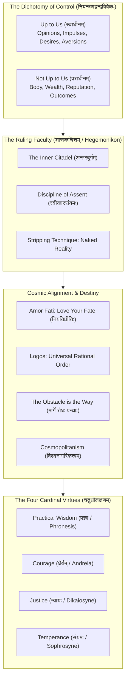

# वैराग्यपञ्चाशिका : आत्मजयशास्त्रम्
## *Vairāgya-Pañcāśikā: Ātmajaya-Śāstram*
### A 50-Verse Classical Sanskrit Technical Treatise on Stoic Philosophy, the Dichotomy of Control and Sovereignty Over Self
#### Based on the Foundations of Epictetus, Marcus Aurelius and Seneca

---

## उपोद्घातः (Architectural Introduction)

Human life is tossed upon the turbulent waters of circumstance, grief and mortality. Yet, as proclaimed by Epictetus, Marcus Aurelius and Seneca, distress stems not from external events, but from the flawed narrative judgments we impose upon them. Classical Stoicism provides an unassailable fortress of cognitive sovereignty: bisecting reality into the **Dichotomy of Control** (नियन्त्रणद्वन्द्वविवेकः: what is in our power versus what is not), establishing the impregnable **Inner Citadel** (अन्तरदुर्गम्), embracing cosmic destiny through **Amor Fati** (नियतिस्वीकारः) and inoculating the mind against terror through **Premeditatio Malorum** (पूर्वविपत्चिन्तनम्) and **Memento Mori** (मृत्युस्मृतिः).

Stoicism is not cold, unfeeling suppression; it is radical liberation: cultivating the Four Cardinal Virtues of Practical Wisdom (प्रज्ञा), Courage (धैर्यम्), Justice (न्यायः) and Temperance (संयमः) while actively serving the human community with boundless goodwill. Merging seamlessly with the ancient Vedāntic ideal of the *Sthitaprajña* (स्थितप्रज्ञः) and *Vairāgya* (वैराग्यम्), Stoicism reveals that true sovereignty is not the conquest of nations, but the conquest of oneself.

This treatise, **वैराग्यपञ्चाशिका : आत्मजयशास्त्रम्** (*Vairāgya-Pañcāśikā: Ātmajaya-Śāstram*), formalizes the complete architecture of Stoic wisdom across 50 metrically pure Anuṣṭubh verses (अनुष्टुप् छन्दः, पथ्यावक्त्र नियम). Each verse is paired with complete Pāṇinian morphological analysis and deep domain-specific philosophical commentary.



---

## Canto 1: नियन्त्रणद्वन्द्वविवेकः
### *The Dichotomy of Control: What is Up to Us vs What is Not*

#### Verse 1

```sanskrit
द्विविधं वर्तते लोके स्वाधीनं यच्च नेतरत् ।
बुद्धिः संकल्प इच्छा च स्वाधीने तिष्ठति ध्रुवम् ॥
```

**पदच्छेदः:** द्विविधम् वर्तते लोके स्वाधीनम् यत् च न इतरत् । बुद्धिः संकल्पः इच्छा च स्वाधीने तिष्ठति ध्रुवम् ॥

**पाणिनीय-व्याकरण-सारणी:**

| पदम् | मूलप्रकृतिः / धातुः | पदविभागः | विभक्तिः / प्रत्ययः | व्याख्या / कारकार्थः |
| :--- | :--- | :--- | :--- | :--- |
| **द्विविधम्** | `द्विविध` | विशेषण | प्रथमा एकवचन नपुंसकलिंग | सर्वतत्त्वम् (twofold / the Dichotomy of Control) |
| **वर्तते** | `√वृत् + लट्` | आत्मनेपद लट् | प्रथमपुरुष एकवचन | विद्यते (exists) |
| **लोके** | `लोक` | पुंलिंग नाम | सप्तमी एकवचन | जगती (in the world of human experience) |
| **स्वाधीनम्** | `स्व + अधीन` | सप्तमी-तत्पुरुष नपुंसकलिंग | प्रथमा एकवचन | आत्मवशम् (up to us / within our power) |
| **यत्** | `यद्` | सर्वनाम नपुंसकलिंग | प्रथमा एकवचन | यत्तत्त्वम् (that which) |
| **च** | `च` | अव्ययम् | अव्ययम् | समुच्चये (and) |
| **न** | `न` | अव्ययम् | अव्ययम् | प्रतिषेधे (not) |
| **इतरत्** | `इतर` | सर्वनाम नपुंसकलिंग | प्रथमा एकवचन | अन्यत् / पराधीनम् (not up to us / external) |
| **बुद्धिः** | `बुद्धि` | स्त्रीलिंग नाम | प्रथमा एकवचन | विचारशक्तिः (faculty of judgment and assent) |
| **संकल्पः** | `संकल्प` | पुंलिंग नाम | प्रथमा एकवचन | प्रवृत्तिः (impulse to act) |
| **इच्छा** | `इच्छा` | स्त्रीलिंग नाम | प्रथमा एकवचन | अभिलाषः (desire and aversion) |
| **च** | `च` | अव्ययम् | अव्ययम् | समुच्चये (and) |
| **स्वाधीने** | `स्वाधीन` | सप्तमी-तत्पुरुष सप्तमी एकवचन नपुंसकलिंग | सप्तमी एकवचन | आत्मनियन्त्रणे (within the domain of personal agency) |
| **तिष्ठति** | `√स्था + लट्` | परस्मैपद लट् | प्रथमपुरुष एकवचन | वर्तेत (resides) |
| **ध्रुवम्** | `ध्रुवम्` | अव्ययम् | अव्ययम् | निश्चितम् (unquestionably) |

**आत्मजयशास्त्र-भाष्यम् (Stoic Philosophical Commentary):** The Dichotomy of Control (नियन्त्रणद्वन्द्वविवेकः): Epictetus opens the Enchiridion with the foundational axiom of Stoic philosophy: some things are in our control (eph hemin) and others are not (ouk eph hemin). What is up to us includes our opinions, judgments, impulses to act, desires and aversions: in short, our own mental faculties. What is not up to us includes our physical body, external property, reputation and worldly outcomes.

---

#### Verse 2

```sanskrit
शरीरं सम्पदो कीर्तिर्बाह्याश्च विषयास्तथा ।
पराधीनाः स्थिता ह्येते नैव स्वायत्तता भवेत् ॥
```

**पदच्छेदः:** शरीरम् सम्पदः कीर्तिः बाह्याः च विषयाः तथा । पराधीनाः स्थिताः हि एते न एव स्व-आयत्तता भवेत् ॥

**पाणिनीय-व्याकरण-सारणी:**

| पदम् | मूलप्रकृतिः / धातुः | पदविभागः | विभक्तिः / प्रत्ययः | व्याख्या / कारकार्थः |
| :--- | :--- | :--- | :--- | :--- |
| **शरीरम्** | `शरीर` | नपुंसकलिंग नाम | प्रथमा एकवचन | भौतिकदेहः (the physical body) |
| **सम्पदः** | `सम्पद्` | स्त्रीलिंग नाम | प्रथमा बहुवचन | वित्तानि (wealth and possessions) |
| **कीर्तिः** | `कीर्ति` | स्त्रीलिंग नाम | प्रथमा एकवचन | यशः (public reputation and social standing) |
| **बाह्याः** | `बाह्य` | विशेषण पुंलिंग | प्रथमा बहुवचन | विषयाः इत्यस्य विशेषणम् (external) |
| **च** | `च` | अव्ययम् | अव्ययम् | समुच्चये (and) |
| **विषयाः** | `विषय` | पुंलिंग नाम | प्रथमा बहुवचन | संसारपदार्थाः (worldly circumstances) |
| **तथा** | `तथा` | अव्ययम् | अव्ययम् | तद्वत् (likewise) |
| **पराधीनाः** | `पर + अधीन` | सप्तमी-तत्पुरुष पुंलिंग | प्रथमा बहुवचन | बाह्यनियन्त्रिताः (not in our power) |
| **स्थिताः** | `√स्था + क्त` | कृदन्तरूप पुंलिंग | प्रथमा बहुवचन | विद्यमानाः (established) |
| **हि** | `हि` | अव्ययम् | अव्ययम् | प्रसिद्धौ (indeed) |
| **एते** | `एतद्` | सर्वनाम पुंलिंग | प्रथमा बहुवचन | एते पदार्थाः (these external things) |
| **न** | `न` | अव्ययम् | अव्ययम् | प्रतिषेधे (not) |
| **एव** | `एव` | अव्ययम् | अव्ययम् | अवधारणे (at all) |
| **स्वायत्तता** | `स्व + आयत्त + तल्` | स्त्रीलिंग भाववाचक | प्रथमा एकवचन | स्वाधीनता (our absolute control) |
| **भवेत्** | `√भू + विधि-लिङ्` | परस्मैपद लिङ् | प्रथमपुरुष एकवचन | स्यात् (can be) |

**आत्मजयशास्त्र-भाष्यम् (Stoic Philosophical Commentary):** The Vulnerability of Externals: The physical body can be struck down by disease or imprisoned by tyrants; wealth can be wiped out by market panic or confiscated by thieves; public reputation is subject to the whims and malice of foolish crowds. Because these belong to externals (ta exo), expecting them to be unassailable or under our absolute sovereignty is a guarantee of perpetual anxiety and helplessness.

---

#### Verse 3

```sanskrit
पराधीनं यदा चेतः प्रार्थयत्यात्मना सदा ।
तदा दुःखेन बध्यन्ते शोकेन विकलत्वतः ॥
```

**पदच्छेदः:** पराधीनम् यदा चेतः प्रार्थयति आत्मना सदा । तदा दुःखेन बध्यन्ते शोकेन विकलत्वतः ॥

**पाणिनीय-व्याकरण-सारणी:**

| पदम् | मूलप्रकृतिः / धातुः | पदविभागः | विभक्तिः / प्रत्ययः | व्याख्या / कारकार्थः |
| :--- | :--- | :--- | :--- | :--- |
| **पराधीनम्** | `पर + अधीन` | सप्तमी-तत्पुरुष नपुंसकलिंग | द्वितीया एकवचन | बाह्यविषयम् (things outside our power) |
| **यदा** | `यदा` | अव्ययम् | अव्ययम् | यस्मिन् काले (whenever) |
| **चेतः** | `चेतस्` | नपुंसकलिंग नाम | प्रथमा एकवचन | मानवमनः (the human mind) |
| **प्रार्थयति** | `प्र + √अर्थ् + लट्` | परस्मैपद लट् | प्रथमपुरुष एकवचन | कामयते (craves or clings to) |
| **आत्मना** | `आत्मन्` | पुंलिंग नाम | तृतीया एकवचन | स्वयम् (itself) |
| **सदा** | `सदा` | अव्ययम् | अव्ययम् | सर्वदा (always) |
| **तदा** | `तदा` | अव्ययम् | अव्ययम् | तस्मिन् समये (then) |
| **दुःखेन** | `दुःख` | नपुंसकलिंग नाम | तृतीया एकवचन | क्लेशेन (by agony and distress) |
| **बध्यन्ते** | `√बन्ध् + कर्मणि लट्` | कर्मणि लट् | प्रथमपुरुष बहुवचन | निगलिता भवन्ति (they are enslaved and shackled) |
| **शोकेन** | `शोक` | पुंलिंग नाम | तृतीया एकवचन | विलापेन (by grief and lamentation) |
| **विकलत्वतः** | `विकल + त्व + तसिँ` | अव्ययम् | अव्ययम् | पराधीनताहेतुना (owing to emotional fragmentation) |

**आत्मजयशास्त्र-भाष्यम् (Stoic Philosophical Commentary):** The Root of Human Suffering: Epictetus notes that all grief, weeping, lamentation and envy originate from a single cognitive error: desiring things that are not in our power, or striving to avoid things that are inevitable. When a person demands that external reality conform to their petty egoic cravings, they render themselves the miserable slave of every person and event that controls those externals.

---

#### Verse 4

```sanskrit
संकल्पे निर्मले जाते न बन्धनमवाप्यते ।
न राजा नैव कारागारश्चित्तं भङ्क्तुं प्रगल्भते ॥
```

**पदच्छेदः:** संकल्पे निर्मले जाते न बन्धनम् अवाप्यते । न राजा न एव कारागारः चित्तम् भङ्क्तुम् प्रगल्भते ॥

**पाणिनीय-व्याकरण-सारणी:**

| पदम् | मूलप्रकृतिः / धातुः | पदविभागः | विभक्तिः / प्रत्ययः | व्याख्या / कारकार्थः |
| :--- | :--- | :--- | :--- | :--- |
| **संकल्पे** | `संकल्प` | पुंलिंग नाम | सप्तमी एकवचन | सति-सप्तमी : प्रोहाइरेसिस्-गुणे (in the moral faculty of choice / Prohairesis) |
| **निर्मले** | `निस् + मल` | बहुव्रीहि पुंलिंग | सप्तमी एकवचन | सति-सप्तमी : शुद्धे सति (when kept untainted and virtuous) |
| **जाते** | `√जन् + क्त` | कृदन्तरूप पुंलिंग | सप्तमी एकवचन | सति-सप्तमी : सति (having become) |
| **न** | `न` | अव्ययम् | अव्ययम् | प्रतिषेधे (not) |
| **बन्धनम्** | `बन्धन` | नपुंसकलिंग नाम | प्रथमा एकवचन | दासत्वम् (true servitude or bondage) |
| **अवाप्यते** | `अव + √आप् + कर्मणि लट्` | कर्मणि लट् | प्रथमपुरुष एकवचन | प्राप्यते (is experienced) |
| **न** | `न` | अव्ययम् | अव्ययम् | प्रतिषेधे (neither) |
| **राजा** | `राजन्` | पुंलिंग नाम | प्रथमा एकवचन | सम्राट् / जुलुस् (a despotic tyrant) |
| **न** | `न` | अव्ययम् | अव्ययम् | प्रतिषेधे (nor) |
| **एव** | `एव` | अव्ययम् | अव्ययम् | अवधारणे (indeed) |
| **कारागारः** | `कारागार` | पुंलिंग नाम | प्रथमा एकवचन | बन्धनगृहम् (stone dungeons and chains) |
| **चित्तम्** | `चित्त` | नपुंसकलिंग नाम | द्वितीया एकवचन | स्वतन्त्रप्रज्ञाम् (the sovereign soul) |
| **भङ्क्तुम्** | `√भञ्ज् + तुमुन्` | कृदन्तरूप अव्यय | अव्ययम् | विनाशयितुम् (to conquer or break) |
| **प्रगल्भते** | `प्र + √गल्भ् + लट्` | आत्मनेपद लट् | प्रथमपुरुष एकवचन | समर्थो भवति (is capable) |

**आत्मजयशास्त्र-भाष्यम् (Stoic Philosophical Commentary):** The Inviolability of Prohairesis (प्रज्ञाधिष्ठानम्): Prohairesis: the faculty of moral choice and judgment: is inherently uncoercible. A tyrant can chain your foot, throw your flesh into a dungeon, or execute your body; but he cannot compel your assent, force you to desire what is base, or rob you of your moral integrity without your own consent. The disciplined soul is unconditionally free.

---

#### Verse 5

```sanskrit
दृष्टे तु विषये प्राप्ते विचारः क्रियतामिह ।
स्वाधीनं वा परं वेति छित्त्वा संशयमप्यलम् ॥
```

**पदच्छेदः:** दृष्टे तु विषये प्राप्ते विचारः क्रियताम् इह । स्वाधीनम् वा परम् वा इति छित्त्वा संशयम् अपि अलम् ॥

**पाणिनीय-व्याकरण-सारणी:**

| पदम् | मूलप्रकृतिः / धातुः | पदविभागः | विभक्तिः / प्रत्ययः | व्याख्या / कारकार्थः |
| :--- | :--- | :--- | :--- | :--- |
| **दृष्टे** | `√दृश् + क्त` | कृदन्तरूप पुंलिंग | सप्तमी एकवचन | सति-सप्तमी : उपस्थिते (when encountered) |
| **तु** | `तु` | अव्ययम् | अव्ययम् | अवधारणे (indeed) |
| **विषये** | `विषय` | पुंलिंग नाम | सप्तमी एकवचन | सति-सप्तमी : उत्तेजकप्रसङ्गे (in any disturbing impression or event) |
| **प्राप्ते** | `प्र + √आप् + क्त` | कृदन्तरूप पुंलिंग | सप्तमी एकवचन | सति-सप्तमी : सम्प्राप्ते सति (having arrived) |
| **विचारः** | `विचार` | पुंलिंग नाम | प्रथमा एकवचन | समीक्षणम् (critical rational audit) |
| **क्रियताम्** | `√कृ + कर्मणि लोट्` | कर्मणि लोट् | प्रथमपुरुष एकवचन | विधीयताम् (let it be executed) |
| **इह** | `इह` | अव्ययम् | अव्ययम् | अस्मिन् संसारे (here in practical life) |
| **स्वाधीनम्** | `स्व + अधीन` | सप्तमी-तत्पुरुष नपुंसकलिंग | प्रथमा एकवचन | मन्नियन्त्रणे (is this in my control) |
| **वा** | `वा` | अव्ययम् | अव्ययम् | विकल्पे (or) |
| **परम्** | `पर` | विशेषण नपुंसकलिंग | प्रथमा एकवचन | पराधीनम् (outside my control) |
| **वा** | `वा` | अव्ययम् | अव्ययम् | विकल्पे (or) |
| **इति** | `इति` | अव्ययम् | अव्ययम् | प्रकारार्थे (thus) |
| **छित्त्वा** | `√छिद् + क्त्वा` | कृदन्तरूप अव्यय | अव्ययम् | विदार्य (having severed) |
| **संशयम्** | `संशय` | पुंलिंग नाम | द्वितीया एकवचन | भ्रान्तिम् (doubt) |
| **अपि** | `अपि` | अव्ययम् | अव्ययम् | सम्भवे (even) |
| **अलम्** | `अलम्` | अव्ययम् | अव्ययम् | निश्चयेन (decisively) |

**आत्मजयशास्त्र-भाष्यम् (Stoic Philosophical Commentary):** The Daily Epictetan Litmus Test: Train yourself to confront every harsh appearance, disturbing headline, personal insult, or frightening diagnosis with the immediate query: 'Is this concerned with that which is within my power, or that which is not?'. If it concerns that which is outside your power, be ready to state without hesitation: 'It is nothing to me.'

---

## Canto 2: अन्तरदुर्गविवेकः चित्तविशुद्धिश्च
### *The Inner Citadel and the Discipline of Assent*

#### Verse 6

```sanskrit
अन्तःस्थितं परं दुर्गं न केनापि प्रविश्यते ।
शासकं वर्तते चित्तं यत्र शान्तिः प्रजायते ॥
```

**पदच्छेदः:** अन्तः-स्थितम् परम् दुर्गम् न केन अपि प्रविश्यते । शासकम् वर्तते चित्तम् यत्र शान्तिः प्रजायते ॥

**पाणिनीय-व्याकरण-सारणी:**

| पदम् | मूलप्रकृतिः / धातुः | पदविभागः | विभक्तिः / प्रत्ययः | व्याख्या / कारकार्थः |
| :--- | :--- | :--- | :--- | :--- |
| **अन्तःस्थितम्** | `अन्तर् + स्थित` | उपपद-तत्पुरुष नपुंसकलिंग | प्रथमा एकवचन | हृदयगुहायाम् (within the depths of consciousness) |
| **परम्** | `परम` | विशेषण नपुंसकलिंग | प्रथमा एकवचन | उत्कृष्टम् (supreme) |
| **दुर्गम्** | `दुर्ग` | नपुंसकलिंग नाम | प्रथमा एकवचन | अन्तरदुर्गम् / द इनर् सिटॅडेल् (the Inner Citadel) |
| **न** | `न` | अव्ययम् | अव्ययम् | प्रतिषेधे (not) |
| **केन** | `किम्` | सर्वनाम पुंलिंग | तृतीया एकवचन | केनचित् (by anyone) |
| **अपि** | `अपि` | अव्ययम् | अव्ययम् | सम्भवे (even) |
| **प्रविश्यते** | `प्र + √विश् + कर्मणि लट्` | कर्मणि लट् | प्रथमपुरुष एकवचन | भेत्तुं शक्यते (can be breached or invaded) |
| **शासकम्** | `शासक` | विशेषण नपुंसकलिंग | प्रथमा एकवचन | हेजेमोनिकॉन् (the ruling faculty / Hegemonikon) |
| **वर्तते** | `√वृत् + लट्` | आत्मनेपद लट् | प्रथमपुरुष एकवचन | विद्यते (reigns) |
| **चित्तम्** | `चित्त` | नपुंसकलिंग नाम | प्रथमा एकवचन | प्रज्ञा (the rational governing mind) |
| **यत्र** | `यत्र` | अव्ययम् | अव्ययम् | यस्मिन् दुर्गे (where) |
| **शान्तिः** | `शान्ति` | स्त्रीलिंग नाम | प्रथमा एकवचन | अक्षोभ्यता (unassailable peace) |
| **प्रजायते** | `प्र + √जन् + लट्` | आत्मनेपद लट् | प्रथमपुरुष एकवचन | विभाति (blossoms) |

**आत्मजयशास्त्र-भाष्यम् (Stoic Philosophical Commentary):** The Inner Citadel (अन्तरदुर्गम्): Marcus Aurelius repeatedly reminds himself in the Meditations: 'The mind that is free from violent passions is a citadel, for man has no fortress more secure to which he can fly for refuge.' No external storm, slander, political turmoil, or physical injury can breach the Inner Citadel unless the ruling faculty itself opens the gates and capitulates.

---

#### Verse 7

```sanskrit
न बाह्यघटना दुःखं जनयत्येव देहिनः ।
मनसा रचितस्तर्कः केवलं क्लेशकारकः ॥
```

**पदच्छेदः:** न बाह्य-घटना दुःखम् जनयति एव देहिनः । मनसा रचितः तर्कः केवलम् क्लेश-कारकः ॥

**पाणिनीय-व्याकरण-सारणी:**

| पदम् | मूलप्रकृतिः / धातुः | पदविभागः | विभक्तिः / प्रत्ययः | व्याख्या / कारकार्थः |
| :--- | :--- | :--- | :--- | :--- |
| **न** | `न` | अव्ययम् | अव्ययम् | प्रतिषेधे (not) |
| **बाह्यघटना** | `बाह्य + घटना` | कर्मधारय स्त्रीलिंग | प्रथमा एकवचन | प्राकृतिकी स्थितिः (the objective external occurrence) |
| **दुःखम्** | `दुःख` | नपुंसकलिंग नाम | द्वितीया एकवचन | मनस्तापम् (suffering and grief) |
| **जनयति** | `√जन् + णिच् + लट्` | परस्मैपद लट् | प्रथमपुरुष एकवचन | उत्पादयति (causes) |
| **एव** | `एव` | अव्ययम् | अव्ययम् | अवधारणे (indeed) |
| **देहिनः** | `देहिन्` | पुंलिंग नाम | षष्ठी एकवचन | मानवस्य (for an embodied human) |
| **मनसा** | `मनस्` | नपुंसकलिंग नाम | तृतीया एकवचन | चित्तेन (by the mind) |
| **रचितः** | `√रच् + क्त` | कृदन्तरूप पुंलिंग | प्रथमा एकवचन | निर्मितः (constructed) |
| **तर्कः** | `तर्क` | पुंलिंग नाम | प्रथमा एकवचन | निर्णयः / डॉग्मा (subjective value judgment / opinion) |
| **केवलम्** | `केवलम्` | अव्ययम् | अव्ययम् | मात्रम् (alone) |
| **क्लेशकारकः** | `क्लेश + कारक` | उपपद-तत्पुरुष पुंलिंग | प्रथमा एकवचन | पीडाजनकः (the true producer of suffering) |

**आत्मजयशास्त्र-भाष्यम् (Stoic Philosophical Commentary):** Events Do Not Upset Us, Opinions Do: As Epictetus declares in Enchiridion 5: 'What upsets people is not things themselves, but their judgments about the things.' Death, poverty and betrayal are not inherently evil or agonizing in their objective physical reality; it is our narrative judgment that death is terrible that causes agony. Strip away the subjective narrative judgment and the suffering evaporates.

---

#### Verse 8

```sanskrit
दृष्टे रूपे समुत्पन्ने न स्वीकुर्यात् तथा झटित् ।
प्रतीक्षस्व क्षणं चित्त विचारय विचेष्टितम् ॥
```

**पदच्छेदः:** दृष्टे रूपे समुत्पन्ने न स्वीकुर्यात् तथा झटित् । प्रतीक्षस्व क्षणम् चित्त विचारय विचेष्टितम् ॥

**पाणिनीय-व्याकरण-सारणी:**

| पदम् | मूलप्रकृतिः / धातुः | पदविभागः | विभक्तिः / प्रत्ययः | व्याख्या / कारकार्थः |
| :--- | :--- | :--- | :--- | :--- |
| **दृष्टे** | `√दृश् + क्त` | कृदन्तरूप नपुंसकलिंग | सप्तमी एकवचन | सति-सप्तमी : उपस्थिते (when perceived) |
| **रूपे** | `रूप` | नपुंसकलिंग नाम | सप्तमी एकवचन | सति-सप्तमी : फॅन्टासिया-चित्रे (in an incoming sensory impression / Phantasia) |
| **समुत्पन्ने** | `सम् + उद् + √पद् + क्त` | कृदन्तरूप नपुंसकलिंग | सप्तमी एकवचन | सति-सप्तमी : जाते सति (having arisen) |
| **न** | `न` | अव्ययम् | अव्ययम् | प्रतिषेधे (not) |
| **स्वीकुर्यात्** | `स्वी + √कृ + विधि-लिङ्` | परस्मैपद लिङ् | प्रथमपुरुष एकवचन | अनुमन्येत (should one grant immediate assent) |
| **तथा** | `तथा` | अव्ययम् | अव्ययम् | तद्वत् (so) |
| **झटित्** | `झटित्` | अव्ययम् | अव्ययम् | शीघ्रम् (impulsively) |
| **प्रतीक्षस्व** | `प्रति + ईक्ष् + लोट्` | आत्मनेपद लोट् | मध्यमपुरुष एकवचन | विलम्बस्व (pause and wait) |
| **क्षणम्** | `क्षण` | पुंलिंग नाम | द्वितीया एकवचन | अल्पकालम् (for a moment) |
| **चित्त** | `चित्त` | नपुंसकलिंग नाम | सम्बोधन एकवचन | हे मनः (O mind!) |
| **विचारय** | `वि + √चर् + णिच् + लोट्` | परस्मैपद लोट् | मध्यमपुरुष एकवचन | परीक्षस्व (critically investigate) |
| **विचेष्टितम्** | `वि + चेष्टित` | नपुंसकलिंग नाम | द्वितीया एकवचन | वास्तविकस्वरूपम् (the real nature of the impression) |

**आत्मजयशास्त्र-भाष्यम् (Stoic Philosophical Commentary):** The Discipline of Assent (स्वीकारसंयमः): An impression (phantasia) strikes the mind automatically and involuntarily: a sudden wave of panic, lust, anger, or despair. The Stoic does not immediately grant assent (synkatathesis) to this raw impression. He commands: 'Wait for me a little, impression; let me see who you are and what you represent; let me test you.' Pausing breaks reactive conditioning.

---

#### Verse 9

```sanskrit
कौशेयं क्रिमिजालं हि मद्यं द्राक्षाफलोद्भवम् ।
इत्येवं दर्शनाद् बुद्धिः सत्यं पश्यति निर्मलम् ॥
```

**पदच्छेदः:** कौशेयम् क्रिमि-जालम् हि मद्यम् द्राक्षा-फल-उद्भवम् । इति एवम् दर्शनात् बुद्धिः सत्यम् पश्यति निर्मलम् ॥

**पाणिनीय-व्याकरण-सारणी:**

| पदम् | मूलप्रकृतिः / धातुः | पदविभागः | विभक्तिः / प्रत्ययः | व्याख्या / कारकार्थः |
| :--- | :--- | :--- | :--- | :--- |
| **कौशेयम्** | `कौशेय` | नपुंसकलिंग नाम | प्रथमा एकवचन | राजवस्त्रम् (luxurious purple imperial silk) |
| **क्रिमिजालम्** | `क्रिमि + जाल` | षष्ठी-तत्पुरुष नपुंसकलिंग | प्रथमा एकवचन | कीटस्य स्रावः (merely the web of a silkworm dyed in shellfish blood) |
| **हि** | `हि` | अव्ययम् | अव्ययम् | प्रसिद्धौ (verily) |
| **मद्यम्** | `मद्य` | नपुंसकलिंग नाम | प्रथमा एकवचन | उत्कृष्टसुरा (fine vintage wine) |
| **द्राक्षाफलोद्भवम्** | `द्राक्षा + फल + उद्भव` | उपपद-तत्पुरुष नपुंसकलिंग | प्रथमा एकवचन | किण्वितरसः (fermented grape juice) |
| **इति** | `इति` | अव्ययम् | अव्ययम् | प्रकारार्थे (thus) |
| **एवम्** | `एवम्` | अव्ययम् | अव्ययम् | इत्थम् (in this manner) |
| **दर्शनात्** | `दर्शन` | नपुंसकलिंग नाम | पञ्चमी एकवचन | विमुण्डीकरणज्ञानात् (from stripping away artificial ornamentation) |
| **बुद्धिः** | `बुद्धि` | स्त्रीलिंग नाम | प्रथमा एकवचन | प्रज्ञा (the intellect) |
| **सत्यम्** | `सत्य` | नपुंसकलिंग नाम | द्वितीया एकवचन | यथार्थवस्तु (naked reality) |
| **पश्यति** | `√दृश् + लट्` | परस्मैपद लट् | प्रथमपुरुष एकवचन | अवलोकयति (perceives) |
| **निर्मलम्** | `निस् + मल` | बहुव्रीहि नपुंसकलिंग | द्वितीया एकवचन | अनावृतम् (pristine and unhypnotized) |

**आत्मजयशास्त्र-भाष्यम् (Stoic Philosophical Commentary):** The Stoic Stripping Technique (Marcus Aurelius): Marcus Aurelius strips worldly luxuries of their inflated social prestige: the emperor's purple robe is sheep's wool dyed in the blood of a shellfish; Falernian wine is fermented grape juice; roasted meat is a dead corpse of a pig or bird; sexual intimacy is friction and the discharge of mucus. By penetrating to the raw physical reality, you strip vanity of its hypnotic hold.

---

#### Verse 10

```sanskrit
संसारस्य तरङ्गेषु नावसीदति बुद्धिमान् ।
निश्चलं वर्तते चित्तं निर्वाते दीपवत् स्थितम् ॥
```

**पदच्छेदः:** संसारस्य तरङ्गेषु न अवसीदति बुद्धिमान् । निश्चलम् वर्तते चित्तम् निर्वाते दीपवत् स्थितम् ॥

**पाणिनीय-व्याकरण-सारणी:**

| पदम् | मूलप्रकृतिः / धातुः | पदविभागः | विभक्तिः / प्रत्ययः | व्याख्या / कारकार्थः |
| :--- | :--- | :--- | :--- | :--- |
| **संसारस्य** | `संसार` | पुंलिंग नाम | षष्ठी एकवचन | भवचक्रस्य (of worldly turbulence) |
| **तरङ्गेषु** | `तरङ्ग` | पुंलिंग नाम | सप्तमी बहुवचन | ऊर्मिषु (in chaotic waves) |
| **न** | `न` | अव्ययम् | अव्ययम् | प्रतिषेधे (not) |
| **अवसीदति** | `अव + √सद् + लट्` | परस्मैपद लट् | प्रथमपुरुष एकवचन | खिद्यते (sinks or despairs) |
| **बुद्धिमान्** | `बुद्धिमत्` | विशेषण पुंलिंग | प्रथमा एकवचन | प्रज्ञावान् साधकः (the Stoic philosopher) |
| **निश्चलम्** | `निस् + चल` | बहुव्रीहि नपुंसकलिंग | प्रथमा एकवचन | स्थिरम् (unflickering and undisturbed) |
| **वर्तते** | `√वृत् + लट्` | आत्मनेपद लट् | प्रथमपुरुष एकवचन | विद्यते (remains) |
| **चित्तम्** | `चित्त` | नपुंसकलिंग नाम | प्रथमा एकवचन | मनः (the ruling soul) |
| **निर्वाते** | `निस् + वात` | बहुव्रीहि सप्तमी एकवचन पुंलिंग | सप्तमी एकवचन | वायुरहिते स्थाने (in a windless sanctuary) |
| **दीपवत्** | `दीप + वतिँ` | अव्ययम् | अव्ययम् | प्रदीपवत् (like a flame) |
| **स्थितम्** | `√स्था + क्त` | कृदन्तरूप नपुंसकलिंग | प्रथमा एकवचन | प्रतिष्ठितम् (poised in Ataraxia) |

**आत्मजयशास्त्र-भाष्यम् (Stoic Philosophical Commentary):** Ataraxia (अक्षोभ्यता): The state of serene equanimity and tranquil imperturbability. Like a candle flame in a windless place (यथा दीपो निवातस्थो नेङ्गते सोपमा स्मृता), the mind that has retreated into its Inner Citadel is unaffected by the chaos of worldly politics, stock market crashes and domestic strife. It abides in sovereign calm.

---

## Canto 3: नियतिस्वीकारः विश्वव्यवस्थाविचारश्च
### *Amor Fati and Harmonious Alignment with Logos*

#### Verse 11

```sanskrit
विश्वमेकं महद् गात्रं नियमेन प्रपाल्यते ।
ईश्वरेण कृतं सर्वं युक्तियुक्तं विराजते ॥
```

**पदच्छेदः:** विश्वम् एकम् महत् गात्रम् नियमेन प्रपाल्यते । ईश्वरेण कृतम् सर्वम् युक्ति-युक्तम् विराजते ॥

**पाणिनीय-व्याकरण-सारणी:**

| पदम् | मूलप्रकृतिः / धातुः | पदविभागः | विभक्तिः / प्रत्ययः | व्याख्या / कारकार्थः |
| :--- | :--- | :--- | :--- | :--- |
| **विश्वम्** | `विश्व` | नपुंसकलिंग नाम | प्रथमा एकवचन | जगत् (the cosmos / universe) |
| **एकम्** | `एक` | संख्यावाचक नपुंसकलिंग | प्रथमा एकवचन | अभिन्नम् (a unified integrated whole) |
| **महत्** | `महत्` | विशेषण नपुंसकलिंग | प्रथमा एकवचन | विशालम् (vast) |
| **गात्रम्** | `गात्र` | नपुंसकलिंग नाम | प्रथमा एकवचन | शरीरम् (single living organism) |
| **नियमेन** | `नियम` | पुंलिंग नाम | तृतीया एकवचन | लोगोस्-शासनेन (by cosmic rational Logos) |
| **प्रपाल्यते** | `प्र + √पाल् + कर्मणि लट्` | कर्मणि लट् | प्रथमपुरुष एकवचन | सञ्चाल्यते (is governed) |
| **ईश्वरेण** | `ईश्वर` | पुंलिंग नाम | तृतीया एकवचन | विश्वप्रकृत्या (by cosmic Nature / God) |
| **कृतम्** | `√कृ + क्त` | कृदन्तरूप नपुंसकलिंग | प्रथमा एकवचन | विधानम् (ordained) |
| **सर्वम्** | `सर्व` | सर्वनाम नपुंसकलिंग | प्रथमा एकवचन | समग्रम् (everything) |
| **युक्तियुक्तम्** | `युक्ति + युक्त` | तृतीया-तत्पुरुष नपुंसकलिंग | प्रथमा एकवचन | तर्कसंगतम् (rational and providential) |
| **विराजते** | `वि + √राज् + लट्` | आत्मनेपद लट् | प्रथमपुरुष एकवचन | शोभते (manifests) |

**आत्मजयशास्त्र-भाष्यम् (Stoic Philosophical Commentary):** The Rational Cosmic Order (Logos / विश्वव्यवस्था): Stoic physics regards the universe as a single rational, living organism infused with divine creative reason (Logos). Every event: whether gentle spring rain or an earthquake: is an interconnected part of a grand providential order. To complain against cosmic events is as absurd as a finger complaining against the body for walking in the mud.

---

#### Verse 12

```sanskrit
प्राप्तं यद् विधिना नूनं तस्मिन् प्रीतिं समाचरेत् ।
न केवलं सहेद् दुःखं कामयेत् तत् सुहृत्तया ॥
```

**पदच्छेदः:** प्राप्तम् यत् विधिना नूनम् तस्मिन् प्रीतिम् समाचरेत् । न केवलम् सहेत् दुःखम् कामयेत् तत् सुहृत्तया ॥

**पाणिनीय-व्याकरण-सारणी:**

| पदम् | मूलप्रकृतिः / धातुः | पदविभागः | विभक्तिः / प्रत्ययः | व्याख्या / कारकार्थः |
| :--- | :--- | :--- | :--- | :--- |
| **प्राप्तम्** | `प्र + √आप् + क्त` | कृदन्तरूप नपुंसकलिंग | प्रथमा एकवचन | उपस्थितम् (whatever is delivered) |
| **यत्** | `यद्` | सर्वनाम नपुंसकलिंग | प्रथमा एकवचन | यत् फलम् (whatever circumstance) |
| **विधिना** | `विधि` | पुंलिंग नाम | तृतीया एकवचन | दैवेन (by providential destiny / fate) |
| **ूनम्** | `नूनम्` | अव्ययम् | अव्ययम् | निश्चयेन (verily) |
| **तस्मिन्** | `तद्` | सर्वनाम नपुंसकलिंग | सप्तमी एकवचन | तस्मिन् प्रारब्धे (in that outcome) |
| **प्रीतिम्** | `प्रीति` | स्त्रीलिंग नाम | द्वितीया एकवचन | अमोर्-फाती / परमस्नेहम् (active love / Amor Fati) |
| **समाचरेत्** | `सम् + आ + √चर् + विधि-लिङ्` | परस्मैपद लिङ् | प्रथमपुरुष एकवचन | कुर्यात् (should cultivate) |
| **न** | `न` | अव्ययम् | अव्ययम् | प्रतिषेधे (not) |
| **केवलम्** | `केवलम्` | अव्ययम् | अव्ययम् | मात्रम् (merely) |
| **सहेत्** | `√सह् + विधि-लिङ्` | परस्मैपद लिङ् | प्रथमपुरुष एकवचन | मर्षयेत् (should endure passively) |
| **दुःखम्** | `दुःख` | नपुंसकलिंग नाम | द्वितीया एकवचन | कष्टम् (adversity) |
| **कामयेत्** | `√कम् + णिच् + विधि-लिङ्` | परस्मैपद लिङ् | प्रथमपुरुष एकवचन | इच्छेत् (should actively embrace and desire) |
| **तत्** | `तद्` | सर्वनाम नपुंसकलिंग | द्वितीया एकवचन | तत् प्रारब्धम् (that fate) |
| **सुहृत्तया** | `सुहृद् + तल्` | स्त्रीलिंग भाववाचक | तृतीया एकवचन | मैत्रीभावेन (with profound friendship) |

**आत्मजयशास्त्र-भाष्यम् (Stoic Philosophical Commentary):** Amor Fati (नियतिप्रीतिः): Epictetus urges: 'Do not seek for things to happen the way you want them to; rather, wish that what happens happens the way it happens: then you will be happy.' Marcus Aurelius echoes this as Amor Fati: not merely tolerating one's fate with grim resignation, but actively loving whatever destiny delivers, recognizing that reality is woven for our moral refinement.

---

#### Verse 13

```sanskrit
रथे बद्धो यथा श्वानो धावेद् रथमथाग्रतः ।
स्वेच्छया धावने सौख्यं कर्षणे क्लेश एव च ॥
```

**पदच्छेदः:** रथे बद्धः यथा श्वानः धावेत् रथम् अथ अग्रतः । स्व-इच्छया धावने सौख्यम् कर्षणे क्लेशः एव च ॥

**पाणिनीय-व्याकरण-सारणी:**

| पदम् | मूलप्रकृतिः / धातुः | पदविभागः | विभक्तिः / प्रत्ययः | व्याख्या / कारकार्थः |
| :--- | :--- | :--- | :--- | :--- |
| **रथे** | `रथ` | पुंलिंग नाम | सप्तमी एकवचन | कालचक्रे (to the moving chariot of destiny) |
| **बद्धः** | `√बन्ध् + क्त` | कृदन्तरूप पुंलिंग | प्रथमा एकवचन | संयोजितः (tied) |
| **यथा** | `यथा` | अव्ययम् | अव्ययम् | दृष्टान्ते (just as) |
| **श्वानः** | `श्वन्` | पुंलिंग नाम | प्रथमा एकवचन | कुकुरः (a dog) |
| **धावेत्** | `√धाव् + विधि-लिङ्` | परस्मैपद लिङ् | प्रथमपुरुष एकवचन | अनुगच्छेत् (runs alongside) |
| **रथम्** | `रथ` | पुंलिंग नाम | द्वितीया एकवचन | स्यन्दनम् (the chariot) |
| **अथ** | `अथ` | अव्ययम् | अव्ययम् | तदनन्तरम् (then) |
| **अग्रतः** | `अग्र + तसिँ` | अव्ययम् | अव्ययम् | अग्रे (forward) |
| **स्वेच्छया** | `स्व + इच्छा` | षष्ठी-तत्पुरुष स्त्रीलिंग | तृतीया एकवचन | हर्षेण (willingly) |
| **धावने** | `धावन` | नपुंसकलिंग नाम | सप्तमी एकवचन | सति-सप्तमी : अनुसरणे (in running with it) |
| **सौख्यम्** | `सौख्य` | नपुंसकलिंग नाम | प्रथमा एकवचन | आनन्दः (freedom and joy) |
| **कर्षणे** | `कर्षण` | नपुंसकलिंग नाम | सप्तमी एकवचन | सति-सप्तमी : विद्रोहे (in resisting and being dragged) |
| **क्लेशः** | `क्लेश` | पुंलिंग नाम | प्रथमा एकवचन | महापीडा (brutal suffering) |
| **एव** | `एव` | अव्ययम् | अव्ययम् | अवधारणे (alone) |
| **च** | `च` | अव्ययम् | अव्ययम् | समुच्चये (and) |

**आत्मजयशास्त्र-भाष्यम् (Stoic Philosophical Commentary):** The Parable of the Dog Tied to a Cart (Cleanthes & Chrysippus): A dog is tied to a moving chariot. If he chooses to run alongside it, he runs smoothly, enjoying the journey and exercising his freedom. If he digs in his heels and stubbornly resists, the chariot drags him along anyway, bruised and bleeding. The chariot moves regardless; wisdom lies in running willingly with cosmic destiny.

---

#### Verse 14

```sanskrit
मार्गे यद् वर्तते रोधः स एव पथि साधनम् ।
इन्धनेन यथा वह्निर्ज्वालां विस्तारयत्यलम् ॥
```

**पदच्छेदः:** मार्गे यत् वर्तते रोधः सः एव पथि साधनम् । इन्धनेन यथा वह्निः ज्वालाम् विस्तारयति अलम् ॥

**पाणिनीय-व्याकरण-सारणी:**

| पदम् | मूलप्रकृतिः / धातुः | पदविभागः | विभक्तिः / प्रत्ययः | व्याख्या / कारकार्थः |
| :--- | :--- | :--- | :--- | :--- |
| **मार्गे** | `मार्ग` | पुंलिंग नाम | सप्तमी एकवचन | प्रगतौ (in the path of virtue) |
| **यत्** | `यद्` | सर्वनाम नपुंसकलिंग | प्रथमा एकवचन | यत् किञ्चित् (whatever) |
| **वर्तते** | `√वृत् + लट्` | आत्मनेपद लट् | प्रथमपुरुष एकवचन | विद्यते (exists) |
| **रोधः** | `रोध` | पुंलिंग नाम | प्रथमा एकवचन | विघ्नः (an obstacle or adversity) |
| **सः** | `तद्` | सर्वनाम पुंलिंग | प्रथमा एकवचन | स एव विघ्नः (that very obstacle) |
| **एव** | `एव` | अव्ययम् | अव्ययम् | अवधारणे (itself) |
| **पथि** | `पथिन्` | पुंलिंग नाम | सप्तमी एकवचन | मार्गे (on the road) |
| **साधनम्** | `साधन` | नपुंसकलिंग नाम | प्रथमा एकवचन | विकासोपायः (the catalyst and vehicle) |
| **इन्धनेन** | `इन्धन` | नपुंसकलिंग नाम | तृतीया एकवचन | काष्ठेन (by fuel and debris) |
| **यथा** | `यथा` | अव्ययम् | अव्ययम् | दृष्टान्ते (just as) |
| **वह्निः** | `वह्नि` | पुंलिंग नाम | प्रथमा एकवचन | अग्निः (a blazing fire) |
| **ज्वालाम्** | `ज्वाला` | स्त्रीलिंग नाम | द्वितीया एकवचन | शिखाम् (its radiant flame) |
| **विस्तारयति** | `वि + √स्तॄ + णिच् + लट्` | परस्मैपद लट् | प्रथमपुरुष एकवचन | वर्धयति (magnifies) |
| **अलम्** | `अलम्` | अव्ययम् | अव्ययम् | अत्यर्थम् (abundantly) |

**आत्मजयशास्त्र-भाष्यम् (Stoic Philosophical Commentary):** The Obstacle is the Way (मार्गे रोध एव पन्थाः): Marcus Aurelius delivers his immortal dictum: 'The mind adapts and converts to its own purposes the obstacle to our acting. The impediment to action advances action. What stands in the way becomes the way.' A blazing bonfire consumes and turns into fuel whatever is thrown on it; a weak flame is extinguished by a blanket. Be the fire.

---

#### Verse 15

```sanskrit
नाहमेकपुरवासी विश्ववासीति चिन्तयेत् ।
सर्वेषां प्राणिनां बन्धुर्मम गात्रं जगत्त्रयम् ॥
```

**पदच्छेदः:** न अहम् एक-पुर-वासी विश्व-वासी इति चिन्तयेत् । सर्वेषाम् प्राणिनाम् बन्धुः मम गात्रम् जगत्-त्रयम् ॥

**पाणिनीय-व्याकरण-सारणी:**

| पदम् | मूलप्रकृतिः / धातुः | पदविभागः | विभक्तिः / प्रत्ययः | व्याख्या / कारकार्थः |
| :--- | :--- | :--- | :--- | :--- |
| **न** | `न` | अव्ययम् | अव्ययम् | प्रतिषेधे (not) |
| **अहम्** | `अस्मद्` | सर्वनाम | प्रथमा एकवचन | अहम् (I) |
| **एकपुरवासी** | `एक + पुर + वासिन्` | उपपद-तत्पुरुष पुंलिंग | प्रथमा एकवचन | एकरोमनिवासी (merely a citizen of Athens or Rome) |
| **विश्ववासी** | `विश्व + वासिन्` | उपपद-तत्पुरुष पुंलिंग | प्रथमा एकवचन | कॉस्मॉपॉलिटन् (a citizen of the universe / Cosmopolitan) |
| **इति** | `इति` | अव्ययम् | अव्ययम् | प्रकारार्थे (thus) |
| **चिन्तयेत्** | `√चिन्त् + विधि-लिङ्` | परस्मैपद लिङ् | प्रथमपुरुष एकवचन | विभावयेत् (should contemplate) |
| **सर्वेषाम्** | `सर्व` | सर्वनाम पुंलिंग | षष्ठी बहुवचन | समस्तानाम् (of all) |
| **प्राणिनाम्** | `प्राणिन्` | पुंलिंग नाम | षष्ठी बहुवचन | जीवानाम् (sentient beings) |
| **बन्धुः** | `बन्धु` | पुंलिंग नाम | प्रथमा एकवचन | भ्राता (brother and kinsman) |
| **मम** | `अस्मद्` | सर्वनाम | षष्ठी एकवचन | मदीयं (my) |
| **गात्रम्** | `गात्र` | नपुंसकलिंग नाम | प्रथमा एकवचन | शरीरम् (extended body) |
| **जगत्त्रयम्** | `जगत् + त्रय` | द्विगु नपुंसकलिंग | प्रथमा एकवचन | समग्रविश्वम् (the tripartite cosmos) |

**आत्मजयशास्त्र-भाष्यम् (Stoic Philosophical Commentary):** Cosmopolitanism (विश्वनागरिकत्वम्): When asked where he was from, Socrates replied: 'I am a citizen of the world (cosmopolites).' Marcus Aurelius reflects: 'My city and my country, so far as I am Antoninus, is Rome, but so far as I am a human being, it is the world.' Tribal provincialism dissolves before the realization of universal kinship under the Logos.

---

## Canto 4: पूर्वविनाशचिन्तनम् अभयसाधना च
### *Premeditatio Malorum and Overcoming the Fear of Death*

#### Verse 16

```sanskrit
विनाशं विपदं दैन्यं प्रातरेव विचिन्तयेत् ।
आकस्मिकभयं त्यक्त्वा सङ्कटे धीरतां व्रजेत् ॥
```

**पदच्छेदः:** विनाशम् विपदम् दैन्यम् प्रातः एव विचिन्तयेत् । आकस्मिक-भयम् त्यक्त्वा सङ्कटे धीरताम् व्रजेत् ॥

**पाणिनीय-व्याकरण-सारणी:**

| पदम् | मूलप्रकृतिः / धातुः | पदविभागः | विभक्तिः / प्रत्ययः | व्याख्या / कारकार्थः |
| :--- | :--- | :--- | :--- | :--- |
| **विनाशम्** | `विनाश` | पुंलिंग नाम | द्वितीया एकवचन | नाशम् (ruin and mortality) |
| **विपदम्** | `विपद्` | स्त्रीलिंग नाम | द्वितीया एकवचन | आपदम् (disaster, illness and slander) |
| **दैन्यम्** | `दैन्य` | नपुंसकलिंग नाम | द्वितीया एकवचन | दरिद्रताम् (poverty and exile) |
| **प्रातः** | `प्रातर्` | अव्ययम् | अव्ययम् | उषसि (at dawn every morning) |
| **एव** | `एव` | अव्ययम् | अव्ययम् | अवधारणे (indeed) |
| **विचिन्तयेत्** | `वि + √चिन्त् + विधि-लिङ्` | परस्मैपद लिङ् | प्रथमपुरुष एकवचन | प्रेमेडिटाशियो-मलोरम् कुर्यात् (should mentally rehearse / Premeditatio Malorum) |
| **आकस्मिकभयम्** | `आकस्मिक + भय` | कर्मधारय नपुंसकलिंग | द्वितीया एकवचन | आकस्मिकत्रासम् (the shock of sudden calamity) |
| **त्यक्त्वा** | `√त्यज् + क्त्वा` | कृदन्तरूप अव्यय | अव्ययम् | विहाय (having eliminated) |
| **सङ्कटे** | `सङ्कट` | नपुंसकलिंग नाम | सप्तमी एकवचन | विपत्तौ (in crisis) |
| **धीरताम्** | `धीर + तल्` | स्त्रीलिंग भाववाचक | द्वितीया एकवचन | धैर्यम् (steadfast poise) |
| **व्रजेत्** | `√व्रज् + विधि-लिङ्` | परस्मैपद लिङ् | प्रथमपुरुष एकवचन | गच्छेत् (should embody) |

**आत्मजयशास्त्र-भाष्यम् (Stoic Philosophical Commentary):** Premeditatio Malorum (पूर्वविपत्चिन्तनम्): Seneca's supreme psychological vaccine against anxiety. Every morning, mentally visualize catastrophic illness, financial bankruptcy, exile, the death of loved ones and betrayal by close associates. Calamity strikes with shattering force only when unexpected; what has been thoroughly anticipated and rehearsed arrives without sting.

---

#### Verse 17

```sanskrit
मृत्युं पश्य सदा नेत्राद् गर्वजालं विनश्यति ।
क्षणभङ्गुरतां ज्ञात्वा सत्क्रियायां रतो भवेत् ॥
```

**पदच्छेदः:** मृत्युम् पश्य सदा नेत्रात् गर्व-जालम् विनश्यति । क्षण-भङ्गुरताम् ज्ञात्वा सत्-क्रियायाम् रतः भवेत् ॥

**पाणिनीय-व्याकरण-सारणी:**

| पदम् | मूलप्रकृतिः / धातुः | पदविभागः | विभक्तिः / प्रत्ययः | व्याख्या / कारकार्थः |
| :--- | :--- | :--- | :--- | :--- |
| **मृत्युम्** | `मृत्यु` | पुंलिंग नाम | द्वितीया एकवचन | मेमेन्टो-मोरी (death / Memento Mori) |
| **पश्य** | `√दृश् + लोट्` | परस्मैपद लोट् | मध्यमपुरुष एकवचन | अवलोकय (keep before your eyes) |
| **सदा** | `सदा` | अव्ययम् | अव्ययम् | सर्वदा (always) |
| **नेत्रात्** | `नेत्र` | नपुंसकलिंग नाम | पञ्चमी एकवचन | दृष्टितः (before the mind's eye) |
| **गर्वजालम्** | `गर्व + जाल` | षष्ठी-तत्पुरुष नपुंसकलिंग | प्रथमा एकवचन | अहंकारजालम् (the web of petty pride and arrogance) |
| **विनश्यति** | `वि + √नश् + लट्` | परस्मैपद लट् | प्रथमपुरुष एकवचन | भ्रंशं गच्छति (dissolves) |
| **क्षणभङ्गुरताम्** | `क्षण + भङ्गुर + तल्` | स्त्रीलिंग भाववाचक | द्वितीया एकवचन | अनित्यताम् (ephemeral impermanence) |
| **ज्ञात्वा** | `√ज्ञा + क्त्वा` | कृदन्तरूप अव्यय | अव्ययम् | अवबुध्य (having recognized) |
| **सत्क्रियायाम्** | `सत् + क्रिया` | कर्मधारय स्त्रीलिंग | सप्तमी एकवचन | पुण्यकर्मणि (in virtuous ethical action) |
| **रतः** | `√रम् + क्त` | कृदन्तरूप पुंलिंग | प्रथमा एकवचन | संलग्नः (dedicated) |
| **भवेत्** | `√भू + विधि-लिङ्` | परस्मैपद लिङ् | प्रथमपुरुष एकवचन | स्यात् (should become) |

**आत्मजयशास्त्र-भाष्यम् (Stoic Philosophical Commentary):** Memento Mori (मृत्युस्मृतिः): Marcus Aurelius reminds himself: 'You could leave life right now. Let that determine what you do, say and think.' Keeping mortality constantly in view destroys trivial grievances, puts an end to vanity, eliminates procrastination and infuses the present hour with sacred urgency.

---

#### Verse 18

```sanskrit
पक्वं फलं यथा वृक्षात् पतति प्रकृतेर्बलात् ।
तथैव पतनं देहे न भयं तत्र कल्पयेत् ॥
```

**पदच्छेदः:** पक्वम् फलम् यथा वृक्षात् पतति प्रकृतेः बलात् । तथा एव पतनम् देहे न भयम् तत्र कल्पयेत् ॥

**पाणिनीय-व्याकरण-सारणी:**

| पदम् | मूलप्रकृतिः / धातुः | पदविभागः | विभक्तिः / प्रत्ययः | व्याख्या / कारकार्थः |
| :--- | :--- | :--- | :--- | :--- |
| **पक्वम्** | `√पच् + क्त` | कृदन्तरूप नपुंसकलिंग | प्रथमा एकवचन | परिपक्वम् (ripe) |
| **फलम्** | `फल` | नपुंसकलिंग नाम | प्रथमा एकवचन | शाखाफलम् (fruit) |
| **यथा** | `यथा` | अव्ययम् | अव्ययम् | यद्वत् (just as) |
| **वृक्षात्** | `वृक्ष` | पुंलिंग नाम | पञ्चमी एकवचन | पादपात् (from the branch) |
| **पतति** | `√पत् + लट्` | परस्मैपद लट् | प्रथमपुरुष एकवचन | भूमौ पतति (drops) |
| **प्रकृतेः** | `प्रकृति` | स्त्रीलिंग नाम | षष्ठी एकवचन | नैसर्गिक-सृष्टेः (of Nature) |
| **बलात्** | `बल` | नपुंसकलिंग नाम | पञ्चमी एकवचन | हेतुना (by natural law) |
| **तथा** | `तथा` | अव्ययम् | अव्ययम् | तद्वत् (likewise) |
| **एव** | `एव` | अव्ययम् | अव्ययम् | अवधारणे (indeed) |
| **पतनम्** | `पतन` | नपुंसकलिंग नाम | प्रथमा एकवचन | प्राणत्यागः (the biological falling away of mortal flesh) |
| **देहे** | `देह` | पुंलिंग नाम | सप्तमी एकवचन | शरीरे (in the body) |
| **न** | `न` | अव्ययम् | अव्ययम् | प्रतिषेधे (not) |
| **भयम्** | `भय` | नपुंसकलिंग नाम | द्वितीया एकवचन | त्रासम् (fear) |
| **तत्र** | `तत्र` | अव्ययम् | अव्ययम् | तस्मिन् विषये (in that natural transition) |
| **कल्पयेत्** | `√क्लृप् + णिच् + विधि-लिङ्` | परस्मैपद लिङ् | प्रथमपुरुष एकवचन | भावयेत् (should one imagine) |

**आत्मजयशास्त्र-भाष्यम् (Stoic Philosophical Commentary):** Death as a Natural Biological Transition: Epictetus and Marcus Aurelius emphasize that death is merely the disassembly of constitutive natural elements, no more terrifying than the ripening of an olive in autumn blessing the tree that bore it and thanking the earth that nourished it. Why tremble before a process as natural as the passing of summer into autumn?

---

#### Verse 19

```sanskrit
यदा न रोचते वासो विवृतं वर्तते गृहम् ।
द्वारं पश्यन् सदा धीरो भयं नैव प्रपद्यते ॥
```

**पदच्छेदः:** यदा न रोचते वासः विवृतम् वर्तते गृहम् । द्वारम् पश्यन् सदा धीरः भयम् न एव प्रपद्यते ॥

**पाणिनीय-व्याकरण-सारणी:**

| पदम् | मूलप्रकृतिः / धातुः | पदविभागः | विभक्तिः / प्रत्ययः | व्याख्या / कारकार्थः |
| :--- | :--- | :--- | :--- | :--- |
| **यदा** | `यदा` | अव्ययम् | अव्ययम् | यस्मिन् काले (when) |
| **न** | `न` | अव्ययम् | अव्ययम् | प्रतिषेधे (not) |
| **रोचते** | `√रुच् + लट्` | आत्मनेपद लट् | प्रथमपुरुष एकवचन | प्रियं भवति (pleases) |
| **वासः** | `वास` | पुंलिंग नाम | प्रथमा एकवचन | जीवनगृहवासः (dwelling in life) |
| **विवृतम्** | `वि + √वृ + क्त` | कृदन्तरूप नपुंसकलिंग | प्रथमा एकवचन | उद्घाटितम् (open) |
| **वर्तते** | `√वृत् + लट्` | आत्मनेपद लट् | प्रथमपुरुष एकवचन | अस्ति (stands) |
| **गृहम्** | `गृह` | नपुंसकलिंग नाम | प्रथमा एकवचन | संसारभवनम् (the house) |
| **द्वारम्** | `द्वार` | नपुंसकलिंग नाम | द्वितीया एकवचन | मुक्तद्वारम् (the open door / exit of death) |
| **पश्यन्** | `√दृश् + शतृ` | कृदन्तरूप पुंलिंग | प्रथमा एकवचन | अवलोकयन् (observing) |
| **सदा** | `सदा` | अव्ययम् | अव्ययम् | सर्वदा (always) |
| **धीरः** | `धीर` | विशेषण पुंलिंग | प्रथमा एकवचन | ज्ञानी (the wise Stoic) |
| **भयम्** | `भय` | नपुंसकलिंग नाम | द्वितीया एकवचन | त्रासम् (fear) |
| **न** | `न` | अव्ययम् | अव्ययम् | प्रतिषेधे (never) |
| **एव** | `एव` | अव्ययम् | अव्ययम् | अवधारणे (indeed) |
| **प्रपद्यते** | `प्र + √पद् + लट्` | आत्मनेपद लट् | प्रथमपुरुष एकवचन | गच्छति (succumbs to) |

**आत्मजयशास्त्र-भाष्यम् (Stoic Philosophical Commentary):** The Doctrine of the Open Door (मुक्तद्वारन्यायः): Epictetus taught: 'Has the house become smoky? If it is moderately smoky, I stay; if very smoky, I walk out through the open door.' Knowing that one always possesses the ultimate sovereignty to exit life with dignity removes all possibility of being blackmailed, enslaved, or terrified by tyrants. The door is always open; therefore, while you choose to remain, remain cheerfully.

---

#### Verse 20

```sanskrit
वर्तमानं क्षणं केवलं वर्तते मानवे करे ।
अतीतं न पुनर्याति भावि नैव प्रतीयते ॥
```

**पदच्छेदः:** वर्तमानम् क्षणम् केवलम् वर्तते मानवे करे । अतीतम् न पुनः याति भावि न एव प्रतीयते ॥

**पाणिनीय-व्याकरण-सारणी:**

| पदम् | मूलप्रकृतिः / धातुः | पदविभागः | विभक्तिः / प्रत्ययः | व्याख्या / कारकार्थः |
| :--- | :--- | :--- | :--- | :--- |
| **वर्तमानम्** | `√वृत् + मानच्` | कृदन्तरूप नपुंसकलिंग | प्रथमा एकवचन | सद्यस्कम् (the present moment) |
| **क्षणम्** | `क्षण` | नपुंसकलिंग नाम | प्रथमा एकवचन | वर्तमानकालः (moment) |
| **केवलम्** | `केवलम्` | अव्ययम् | अव्ययम् | मात्रम् (alone) |
| **वर्तते** | `√वृत् + लट्` | आत्मनेपद लट् | प्रथमपुरुष एकवचन | विद्यते (exists) |
| **मानवे** | `मानव` | विशेषण पुंलिंग | सप्तमी एकवचन | मानुषे (in human) |
| **करे** | `कर` | पुंलिंग नाम | सप्तमी एकवचन | हस्ते (in our grasp) |
| **अतीतम्** | `अति + √इ + क्त` | कृदन्तरूप नपुंसकलिंग | प्रथमा एकवचन | भूतकालम् (the past) |
| **न** | `न` | अव्ययम् | अव्ययम् | प्रतिषेधे (not) |
| **पुनः** | `पुनर्` | अव्ययम् | अव्ययम् | भूयः (again) |
| **याति** | `√या + लट्` | परस्मैपद लट् | प्रथमपुरुष एकवचन | आगच्छति (returns) |
| **भावि** | `भाविन्` | विशेषण नपुंसकलिंग | प्रथमा एकवचन | भविष्यत् (the future) |
| **न** | `न` | अव्ययम् | अव्ययम् | प्रतिषेधे (neither) |
| **एव** | `एव` | अव्ययम् | अव्ययम् | अवधारणे (indeed) |
| **प्रतीयते** | `प्रती + √इ + कर्मणि लट्` | कर्मणि लट् | प्रथमपुरुष एकवचन | निश्चितं ज्ञायते (is guaranteed or known) |

**आत्मजयशास्त्र-भाष्यम् (Stoic Philosophical Commentary):** Living Exclusively in the Sovereign Present: A person loses only the life they are currently living and they live only in the present moment. The past is unalterable: weeping over it is futile. The future is uncertain: dreading it is irrational. All that any human ever possesses is this brief, sovereign sliver of now. Sanctify the present moment with virtuous action.

---

## Canto 5: कर्तव्ययोगः परोपकारविवेकश्च
### *The Discipline of Action and Social Duty*

#### Verse 21

```sanskrit
प्रातश्चिन्त्यं नृशंसोऽयं कृतघ्नो वञ्चकस्तथा ।
अज्ञानेन हि ते मूढा न तेभ्यः क्रुध्यते बुधः ॥
```

**पदच्छेदः:** प्रातः चिन्त्यम् नृशंसः अयम् कृतघ्नः वञ्चकः तथा । अज्ञानेन हि ते मूढाः न तेभ्यः क्रुध्यते बुधः ॥

**पाणिनीय-व्याकरण-सारणी:**

| पदम् | मूलप्रकृतिः / धातुः | पदविभागः | विभक्तिः / प्रत्ययः | व्याख्या / कारकार्थः |
| :--- | :--- | :--- | :--- | :--- |
| **प्रातः** | `प्रातर्` | अव्ययम् | अव्ययम् | उषसि (at daybreak) |
| **चिन्त्यम्** | `√चिन्त् + यत्` | कृदन्तरूप नपुंसकलिंग | प्रथमा एकवचन | विभावनीयम् (should be contemplated) |
| **नृशंसः** | `नृशंस` | विशेषण पुंलिंग | प्रथमा एकवचन | क्रूरः (meddlesome and cruel) |
| **अयम्** | `इदम्` | सर्वनाम पुंलिंग | प्रथमा एकवचन | अयं जनः (this encounter) |
| **कृतघ्नः** | `कृत + घ्न` | उपपद-तत्पुरुष पुंलिंग | प्रथमा एकवचन | उपकारविस्मर्ता (ungrateful) |
| **वञ्चकः** | `वञ्चक` | पुंलिंग नाम | प्रथमा एकवचन | धूर्तः (dishonest and treacherous) |
| **तथा** | `तथा` | अव्ययम् | अव्ययम् | अपि च (likewise) |
| **अज्ञानेन** | `अ + ज्ञान` | नञ्-तत्पुरुष नपुंसकलिंग | तृतीया एकवचन | अविद्यया (through ignorance of good and evil) |
| **हि** | `हि` | अव्ययम् | अव्ययम् | निश्चये (indeed) |
| **ते** | `तद्` | सर्वनाम पुंलिंग | प्रथमा बहुवचन | ते जनाः (they) |
| **मूढाः** | `मूढ` | विशेषण पुंलिंग | प्रथमा बहुवचन | अविवेकशीलाः (blinded fools) |
| **न** | `न` | अव्ययम् | अव्ययम् | प्रतिषेधे (not) |
| **तेभ्यः** | `तद्` | सर्वनाम पुंलिंग | चतुर्थी बहुवचन | अमङ्गलेभ्यः जनेभ्यः (toward them) |
| **क्रुध्यते** | `√क्रुध् + लट्` | आत्मनेपद लट् | प्रथमपुरुष एकवचन | क्रोधं करोति (becomes enraged) |
| **बुधः** | `बुध` | पुंलिंग नाम | प्रथमा एकवचन | ज्ञानी (the wise sage) |

**आत्मजयशास्त्र-भाष्यम् (Stoic Philosophical Commentary):** Marcus Aurelius's Morning Injunction: 'When you wake up in the morning, tell yourself: The people I deal with today will be meddling, ungrateful, arrogant, dishonest, jealous and surly. They are like this because they cannot distinguish good from evil. But I have seen the beauty of good and the ugliness of evil and have recognized that the wrongdoer has a nature related to my own... None of them can hurt me.'

---

#### Verse 22

```sanskrit
परस्परस्य साह्याय रचिता मानवा भुवि ।
दन्तानां पङ्क्तिवद् धीरा हस्तपादसमास्तथा ॥
```

**पदच्छेदः:** परस्परस्य साह्याय रचिताः मानवाः भुवि । दन्तानाम् पङ्क्तिवत् धीराः हस्त-पाद-समाः तथा ॥

**पाणिनीय-व्याकरण-सारणी:**

| पदम् | मूलप्रकृतिः / धातुः | पदविभागः | विभक्तिः / प्रत्ययः | व्याख्या / कारकार्थः |
| :--- | :--- | :--- | :--- | :--- |
| **परस्परस्य** | `परस्पर` | सर्वनाम पुंलिंग | षष्ठी एकवचन | अन्योऽन्यस्य (for one another) |
| **साह्याय** | `साह्य` | नपुंसकलिंग नाम | चतुर्थी एकवचन | तादर्थ्ये चतुर्थी : उपकाराय (for mutual cooperation) |
| **रचिताः** | `√रच् + क्त` | कृदन्तरूप पुंलिंग | प्रथमा बहुवचन | सृष्टाः (created by cosmic Nature) |
| **मानवाः** | `मानव` | पुंलिंग नाम | प्रथमा बहुवचन | मनुष्याः (human beings) |
| **भुवि** | `भू` | स्त्रीलिंग नाम | सप्तमी एकवचन | पृथिव्याम् (on earth) |
| **दन्तानाम्** | `दन्त` | पुंलिंग नाम | षष्ठी बहुवचन | दशनानाम् (of the teeth) |
| **पङ्क्तिवत्** | `पङ्क्ति + वतिँ` | अव्ययम् | अव्ययम् | उपरि-अधः-पङ्क्तिवत् (like rows of upper and lower teeth) |
| **धीराः** | `धीर` | विशेषण पुंलिंग | प्रथमा बहुवचन | ज्ञानिनः (the wise) |
| **हस्तपादसमाः** | `हस्त + पाद + सम` | द्वन्द्वगर्भो बहुव्रीहि पुंलिंग | प्रथमा बहुवचन | हस्तपादवत् सङ्गताः (like hands and feet of a single organism) |
| **तथा** | `तथा` | अव्ययम् | अव्ययम् | एवम् (likewise) |

**आत्मजयशास्त्र-भाष्यम् (Stoic Philosophical Commentary):** Organic Human Interdependence: We were made to work together like feet, like hands, like the rows of the upper and lower teeth. To obstruct each other, to be angry with one another, or to turn our back on society is contrary to nature. Stoicism is not solitary escapism; it is rigorous public service grounded in the organic brotherhood of all humanity.

---

#### Verse 23

```sanskrit
सङ्कल्पं कुरुते धीरो दैवयोगं विचिन्त्य च ।
यदि दैवमनुकूलं सिद्ध्येत् कार्यमसंशयम् ॥
```

**पदच्छेदः:** सङ्कल्पम् कुरुते धीरः दैव-योगम् विचिन्त्य च । यदि दैवम् अनुकूलम् सिद्ध्येत् कार्यम् असंशयम् ॥

**पाणिनीय-व्याकरण-सारणी:**

| पदम् | मूलप्रकृतिः / धातुः | पदविभागः | विभक्तिः / प्रत्ययः | व्याख्या / कारकार्थः |
| :--- | :--- | :--- | :--- | :--- |
| **सङ्कल्पम्** | `सङ्कल्प` | पुंलिंग नाम | द्वितीया एकवचन | प्रयत्नम् (intention / commitment to action) |
| **कुरुते** | `√कृ + लट्` | आत्मनेपद लट् | प्रथमपुरुष एकवचन | आचरति (undertakes) |
| **धीरः** | `धीर` | विशेषण पुंलिंग | प्रथमा एकवचन | विद्वान् (the wise actor) |
| **दैवयोगम्** | `दैव + योग` | षष्ठी-तत्पुरुष पुंलिंग | द्वितीया एकवचन | प्रारब्धनियतिम् (the intervention of cosmic fate) |
| **विचिन्त्य** | `वि + √चिन्त् + ल्यप्` | कृदन्तरूप अव्यय | अव्ययम् | ध्यात्वा (having factored in) |
| **च** | `च` | अव्ययम् | अव्ययम् | समुच्चये (and) |
| **यदि** | `यदि` | अव्ययम् | अव्ययम् | सम्भावने (if) |
| **दैवम्** | `दैव` | नपुंसकलिंग नाम | प्रथमा एकवचन | विधिः (Fate / Logos) |
| **अनुकूलम्** | `अनुकूल` | विशेषण नपुंसकलिंग | प्रथमा एकवचन | सहायकम् (permits) |
| **सिद्ध्येत्** | `√सिध् + विधि-लिङ्` | परस्मैपद लिङ् | प्रथमपुरुष एकवचन | निष्पद्येत (will succeed) |
| **कार्यम्** | `कार्य` | नपुंसकलिंग नाम | प्रथमा एकवचन | उद्यमः (the endeavor) |
| **असंशयम्** | `अ + संशय` | नञ्-तत्पुरुष अव्यय | अव्ययम् | निश्चितम् (without doubt) |

**आत्मजयशास्त्र-भाष्यम् (Stoic Philosophical Commentary):** Action with a Reserve Clause (सङ्कल्पप्रतिबन्धः / Hypexairesis): When setting sail, building an institution, or embarking on an enterprise, the Stoic acts with a reserve clause: 'I will do this, fate permitting' (D.V. / Deo Volente). By separating intention from external outcome, the sage remains fully committed to excellence in effort, while remaining completely immune to disappointment if external variables derail the result.

---

#### Verse 24

```sanskrit
कीर्तिमिच्छन्ति ये मूढा मृतानां यशसा सह ।
धूलिकणसमा कीर्तिर्नष्टा भवति कालतः ॥
```

**पदच्छेदः:** कीर्तिम् इच्छन्ति ये मूढाः मृतानाम् यशसा सह । धूलि-कण-समा कीर्तिः नष्टा भवति कालतः ॥

**पाणिनीय-व्याकरण-सारणी:**

| पदम् | मूलप्रकृतिः / धातुः | पदविभागः | विभक्तिः / प्रत्ययः | व्याख्या / कारकार्थः |
| :--- | :--- | :--- | :--- | :--- |
| **कीर्तिम्** | `कीर्ति` | स्त्रीलिंग नाम | द्वितीया एकवचन | मरणोत्तरयशः (posthumous fame) |
| **इच्छन्ति** | `√इष् + लट्` | परस्मैपद लट् | प्रथमपुरुष बहुवचन | कामयन्ते (crave) |
| **ये** | `यद्` | सर्वनाम पुंलिंग | प्रथमा बहुवचन | ये जनाः (those who) |
| **मूढाः** | `मूढ` | विशेषण पुंलिंग | प्रथमा बहुवचन | अज्ञाः (fools) |
| **मृतानाम्** | `√मृ + क्त` | कृदन्तरूप पुंलिंग | षष्ठी बहुवचन | भाविमर्त्यानाम् (of soon-to-be-dead spectators) |
| **यशसा** | `यशस्` | नपुंसकलिंग नाम | तृतीया एकवचन | प्रशंसाभावेन (with social acclaim) |
| **सह** | `सह` | अव्ययम् | अव्ययम् | साकम् (along with) |
| **धूलिकणसमा** | `धूलि + कण + समा` | षष्ठी-तत्पुरुष स्त्रीलिंग | प्रथमा एकवचन | रेणुकल्पिका (like a microscopic speck of dust) |
| **कीर्तिः** | `कीर्ति` | स्त्रीलिंग नाम | प्रथमा एकवचन | ख्यातिः (glory) |
| **नष्टा** | `√नश् + क्त` | कृदन्तरूप स्त्रीलिंग | प्रथमा एकवचन | विलुप्ता (dissolved) |
| **भवति** | `√भू + लट्` | परस्मैपद लट् | प्रथमपुरुष एकवचन | जायते (becomes) |
| **कालतः** | `काल + तसिँ` | अव्ययम् | अव्ययम् | समयप्रभावेन (by the relentless march of time) |

**आत्मजयशास्त्र-भाष्यम् (Stoic Philosophical Commentary):** The Folly of Posthumous Fame: Marcus Aurelius reflects: 'People who covet posthumous fame forget that the people who remember them will very soon be dead too and then their children after them, until the whole memory is extinguished.' The praise of mortal ghosts is fleeting smoke. Virtue needs no applause; it is complete in itself.

---

#### Verse 25

```sanskrit
द्राक्षाफलं यथा वृक्षाद् दीयते न च भाष्यते ।
तथैव सत्कृतं कृत्वा तूष्णीं तिष्ठति पण्डितः ॥
```

**पदच्छेदः:** द्राक्षा-फलम् यथा वृक्षात् दीयते न च भाष्यते । तथा एव सत्-कृतम् कृत्वा तूष्णीम् तिष्ठति पण्डितः ॥

**पाणिनीय-व्याकरण-सारणी:**

| पदम् | मूलप्रकृतिः / धातुः | पदविभागः | विभक्तिः / प्रत्ययः | व्याख्या / कारकार्थः |
| :--- | :--- | :--- | :--- | :--- |
| **द्राक्षाफलम्** | `द्राक्षा + फल` | षष्ठी-तत्पुरुष नपुंसकलिंग | प्रथमा एकवचन | गुच्छकम् (a cluster of grapes) |
| **यथा** | `यथा` | अव्ययम् | अव्ययम् | यद्वत् (just as) |
| **वृक्षात्** | `वृक्ष` | पुंलिंग नाम | पञ्चमी एकवचन | लतायाः (from the vine) |
| **दीयते** | `√दा + कर्मणि लट्` | कर्मणि लट् | प्रथमपुरुष एकवचन | समर्प्यते (is given) |
| **न** | `न` | अव्ययम् | अव्ययम् | प्रतिषेधे (not) |
| **च** | `च` | अव्ययम् | अव्ययम् | समुच्चये (and) |
| **भाष्यते** | `√भाष् + कर्मणि लट्` | कर्मणि लट् | प्रथमपुरुष एकवचन | घूष्यते (trumpeted or proclaimed) |
| **तथा** | `तथा` | अव्ययम् | अव्ययम् | तद्वत् (likewise) |
| **एव** | `एव` | अव्ययम् | अव्ययम् | अवधारणे (indeed) |
| **सत्कृतम्** | `सत् + कृत` | कर्मधारय नपुंसकलिंग | द्वितीया एकवचन | परोपकारम् (a noble act of service) |
| **कृत्वा** | `√कृ + क्त्वा` | कृदन्तरूप अव्यय | अव्ययम् | सम्पाद्य (having performed) |
| **तूष्णीम्** | `तूष्णीम्` | अव्ययम् | अव्ययम् | मौनम् (silently) |
| **तिष्ठति** | `√स्था + लट्` | परस्मैपद लट् | प्रथमपुरुष एकवचन | शेते (abides) |
| **पण्डितः** | `पण्डित` | पुंलिंग नाम | प्रथमा एकवचन | सद्ज्ञानी (the true philosopher) |

**आत्मजयशास्त्र-भाष्यम् (Stoic Philosophical Commentary):** Silent Virtue: A horse does not boast when it has run its race, nor a dog when it has tracked its game, nor a grapevine when it has produced its grapes. Having produced its fruit, the grapevine simply turns to produce more grapes for the next season. The virtuous human performs good deeds naturally and moves on in silence, seeking neither applause nor repayment.

---

## Canto 6: संवेगशमनम् आत्मनिग्रहश्च
### *The Taming of Passions: Anger, Grief and Envy*

#### Verse 26

```sanskrit
क्रोधेन हन्यते प्रज्ञा मत्तवद् भ्रमते नरः ।
अपराधाद् भवेद् भूयान् विनाशः क्रोधसम्भृतः ॥
```

**पदच्छेदः:** क्रोधेन हन्यते प्रज्ञा मत्तवत् भ्रमते नरः । अपराधात् भवेत् भूयान् विनाशः क्रोध-सम्भृतः ॥

**पाणिनीय-व्याकरण-सारणी:**

| पदम् | मूलप्रकृतिः / धातुः | पदविभागः | विभक्तिः / प्रत्ययः | व्याख्या / कारकार्थः |
| :--- | :--- | :--- | :--- | :--- |
| **क्रोधेन** | `क्रोध` | पुंलिंग नाम | तृतीया एकवचन | रोषेण (by rage and anger) |
| **हन्यते** | `√हन् + कर्मणि लट्` | कर्मणि लट् | प्रथमपुरुष एकवचन | विनाश्यते (is murdered) |
| **प्रज्ञा** | `प्रज्ञा` | स्त्रीलिंग नाम | प्रथमा एकवचन | विवेकबुद्धिः (rational intellect) |
| **मत्तवत्** | `मत्त + वतिँ` | अव्ययम् | अव्ययम् | उन्मत्त इव (like a temporary madman) |
| **भ्रमते** | `√भ्रम् + लट्` | आत्मनेपद लट् | प्रथमपुरुष एकवचन | विमुह्यति (wanders blinded) |
| **नरः** | `नर` | पुंलिंग नाम | प्रथमा एकवचन | मनुष्यः (man) |
| **अपराधात्** | `अपराध` | पुंलिंग नाम | पञ्चमी एकवचन | मूलदोषात् (than the initial perceived slight or injury) |
| **भवेत्** | `√भू + विधि-लिङ्` | परस्मैपद लिङ् | प्रथमपुरुष एकवचन | जायते (is) |
| **भूयान्** | `भूयस्` | विशेषण पुंलिंग | प्रथमा एकवचन | अतिविपुलः (vastly greater) |
| **विनाशः** | `विनाश` | पुंलिंग नाम | प्रथमा एकवचन | हानिः (destruction) |
| **क्रोधसम्भृतः** | `क्रोध + सम्भृत` | तृतीया-तत्पुरुष पुंलिंग | प्रथमा एकवचन | रोषजनितः (wrought by angry reaction) |

**आत्मजयशास्त्र-भाष्यम् (Stoic Philosophical Commentary):** Anger as Temporary Madness (Seneca's De Ira): Seneca famously diagnosed anger not as a natural emotion to be vented, but as temporary insanity: an all-consuming passion that burns its own house down. The harm caused by our angry reactions to insults or betrayals is consistently far more destructive than the original offense itself.

---

#### Verse 27

```sanskrit
क्रोधे समुत्थिते नूनं विलम्बः परमौषधम् ।
क्षणं तिष्ठति यो धीरः स जयत्येव सर्वदा ॥
```

**पदच्छेदः:** क्रोधे समुत्थिते नूनम् विलम्बः परम-औषधम् । क्षणम् तिष्ठति यः धीरः सः जयति एव सर्वदा ॥

**पाणिनीय-व्याकरण-सारणी:**

| पदम् | मूलप्रकृतिः / धातुः | पदविभागः | विभक्तिः / प्रत्ययः | व्याख्या / कारकार्थः |
| :--- | :--- | :--- | :--- | :--- |
| **क्रोधे** | `क्रोध` | पुंलिंग नाम | सप्तमी एकवचन | सति-सप्तमी : रोषे (when anger flares) |
| **समुत्थिते** | `सम् + उद् + √स्था + क्त` | कृदन्तरूप पुंलिंग | सप्तमी एकवचन | सति-सप्तमी : जागृते सति (having erupted) |
| **ूनम्** | `नूनम्` | अव्ययम् | अव्ययम् | निश्चये (truly) |
| **विलम्बः** | `विलम्ब` | पुंलिंग नाम | प्रथमा एकवचन | कालक्षेपणम् (strategic delay / pausing) |
| **परमौषधम्** | `परम + औषध` | कर्मधारय नपुंसकलिंग | प्रथमा एकवचन | सर्वश्रेष्ठचिकित्सा (the sovereign cure) |
| **क्षणम्** | `क्षण` | पुंलिंग नाम | द्वितीया एकवचन | मुहूर्तमात्रम् (for a single moment) |
| **तिष्ठति** | `√स्था + लट्` | परस्मैपद लट् | प्रथमपुरुष एकवचन | धैर्यमवलम्बते (waits without reacting) |
| **यः** | `यद्` | सर्वनाम पुंलिंग | प्रथमा एकवचन | यः साधकः (whoever) |
| **धीरः** | `धीर` | विशेषण पुंलिंग | प्रथमा एकवचन | प्रज्ञावान् (steadfast sage) |
| **सः** | `तद्` | सर्वनाम पुंलिंग | प्रथमा एकवचन | स पुरुषः (that person) |
| **जयति** | `√जि + लट्` | परस्मैपद लट् | प्रथमपुरुष एकवचन | विजयी भवति (triumphs) |
| **एव** | `एव` | अव्ययम् | अव्ययम् | अवधारणे (invariably) |
| **सर्वदा** | `सर्वदा` | अव्ययम् | अव्ययम् | सदा (always) |

**आत्मजयशास्त्र-भाष्यम् (Stoic Philosophical Commentary):** Delay is the Sovereign Cure for Wrath: 'The greatest remedy for anger is delay,' wrote Seneca. In the heat of visceral physiological arousal, the ruling faculty is hijacked. If you pause, breathe and refuse to speak or type an impulsive response until the visceral adrenaline dissipates, reason regains the throne and the illusion of urgency evaporates.

---

#### Verse 28

```sanskrit
रोदनेन न वै शान्तिर्मृतो नैव निवर्तते ।
दुःखं त्यक्त्वा विधानेन स्मृतिं शुद्धां समाचरेत् ॥
```

**पदच्छेदः:** रोदनेन न वै शान्तिः मृतः न एव निवर्तते । दुःखम् त्यक्त्वा विधानेन स्मृतिम् शुद्धाम् समाचरेत् ॥

**पाणिनीय-व्याकरण-सारणी:**

| पदम् | मूलप्रकृतिः / धातुः | पदविभागः | विभक्तिः / प्रत्ययः | व्याख्या / कारकार्थः |
| :--- | :--- | :--- | :--- | :--- |
| **रोदनेन** | `रोदन` | नपुंसकलिंग नाम | तृतीया एकवचन | अतिविलापेन (by excessive hysterical weeping) |
| **न** | `न` | अव्ययम् | अव्ययम् | प्रतिषेधे (not) |
| **वै** | `वै` | अव्ययम् | अव्ययम् | निश्चये (indeed) |
| **शान्तिः** | `शान्ति` | स्त्रीलिंग नाम | प्रथमा एकवचन | चित्तविश्रामः (peace) |
| **मृतः** | `√मृ + क्त` | कृदन्तरूप पुंलिंग | प्रथमा एकवचन | गतप्राणः (the deceased) |
| **न** | `न` | अव्ययम् | अव्ययम् | प्रतिषेधे (not) |
| **एव** | `एव` | अव्ययम् | अव्ययम् | अवधारणे (at all) |
| **निवर्तते** | `नि + √वृत् + लट्` | आत्मनेपद लट् | प्रथमपुरुष एकवचन | पुनरागच्छति (returns) |
| **दुःखम्** | `दुःख` | नपुंसकलिंग नाम | द्वितीया एकवचन | अतिशोकम् (prolonged theatrical grief) |
| **त्यक्त्वा** | `√त्यज् + क्त्वा` | कृदन्तरूप अव्यय | अव्ययम् | विहाय (having relinquished) |
| **विधानेन** | `विधान` | नपुंसकलिंग नाम | तृतीया एकवचन | विवेकनियमेन (by philosophical understanding) |
| **स्मृतिम्** | `स्मृति` | स्त्रीलिंग नाम | द्वितीया एकवचन | संस्मरणम् (the memory of the departed) |
| **शुद्धाम्** | `शुद्ध` | विशेषण स्त्रीलिंग | द्वितीया एकवचन | कृतज्ञतायुक्ताम् (purified with love and gratitude) |
| **समाचरेत्** | `सम् + आ + √चर् + विधि-लिङ्` | परस्मैपद लिङ् | प्रथमपुरुष एकवचन | पालयेत् (should honor) |

**आत्मजयशास्त्र-भाष्यम् (Stoic Philosophical Commentary):** Stoic Grief and Consolation: The Stoic does not repress natural somatic tears when a loved one dies: tears are a natural physiological reflex. But the Stoic refuses to compound that natural grief into months of theatrical despair and victimhood. The departed has returned what was borrowed from nature. Honor their life with gratitude, not with prolonged self-torment.

---

#### Verse 29

```sanskrit
पाषाणे ताडिते दण्डेन पाषाणो न कुप्यति ।
अपमानं तथा मत्वा शान्तस्तिष्ठति पण्डितः ॥
```

**पदच्छेदः:** पाषाणे ताडिते दण्डेन पाषाणः न कुप्यति । अपमानम् तथा मत्वा शान्तः तिष्ठति पण्डितः ॥

**पाणिनीय-व्याकरण-सारणी:**

| पदम् | मूलप्रकृतिः / धातुः | पदविभागः | विभक्तिः / प्रत्ययः | व्याख्या / कारकार्थः |
| :--- | :--- | :--- | :--- | :--- |
| **पाषाणे** | `पाषाण` | पुंलिंग नाम | सप्तमी एकवचन | सति-सप्तमी : शिलायाम् (when a stone) |
| **ताडिते** | `√तड् + णिच् + क्त` | कृदन्तरूप पुंलिंग | सप्तमी एकवचन | सति-सप्तमी : प्रहृते सति (is struck) |
| **दण्डेन** | `दण्ड` | पुंलिंग नाम | तृतीया एकवचन | यष्ट्या (with a stick) |
| **पाषाणः** | `पाषाण` | पुंलिंग नाम | प्रथमा एकवचन | प्रस्तरः (the stone) |
| **न** | `न` | अव्ययम् | अव्ययम् | प्रतिषेधे (not) |
| **कुप्यति** | `√कुप् + लट्` | परस्मैपद लट् | प्रथमपुरुष एकवचन | क्रोधं याति (does not become angry) |
| **अपमानम्** | `अपमान` | पुंलिंग नाम | द्वितीया एकवचन | निन्दाम् (verbal insult or slander) |
| **तथा** | `तथा` | अव्ययम् | अव्ययम् | तद्वत् (similarly) |
| **मत्वा** | `√मन् + क्त्वा` | कृदन्तरूप अव्यय | अव्ययम् | ज्ञात्वा (regarding) |
| **शान्तः** | `√शम् + क्त` | कृदन्तरूप पुंलिंग | प्रथमा एकवचन | अविकम्पितः (tranquil) |
| **तिष्ठति** | `√स्था + लट्` | परस्मैपद लट् | प्रथमपुरुष एकवचन | विराजते (remains) |
| **पण्डितः** | `पण्डित` | पुंलिंग नाम | प्रथमा एकवचन | स्थितप्रज्ञः (the wise philosopher) |

**आत्मजयशास्त्र-भाष्यम् (Stoic Philosophical Commentary):** Immunity to Insults: Epictetus asks: 'If someone strikes a stone with a staff, what does the stone gain? Nothing. It remains a stone.' Why should you behave any differently than a stone when struck by verbal insults? An insult cannot touch your Inner Citadel unless you accept it and agree to be hurt. The insult stains only the mouth of the speaker.

---

#### Verse 30

```sanskrit
अन्येषां सुखसम्पत्तौ न द्वेषं कुरुते बुधः ।
अल्पापेक्षा यदा चित्ते तदैश्वर्यं विराजते ॥
```

**पदच्छेदः:** अन्येषाम् सुख-सम्पत्तौ न द्वेषम् कुरुते बुधः । अल्प-अपेक्षा यदा चित्ते तदा ऐश्वर्यम् विराजते ॥

**पाणिनीय-व्याकरण-सारणी:**

| पदम् | मूलप्रकृतिः / धातुः | पदविभागः | विभक्तिः / प्रत्ययः | व्याख्या / कारकार्थः |
| :--- | :--- | :--- | :--- | :--- |
| **अन्येषाम्** | `अन्य` | सर्वनाम पुंलिंग | षष्ठी बहुवचन | परेषाम् (of others) |
| **सुखसम्पत्तौ** | `सुख + सम्पत्ति` | द्वन्द्व सप्तमी एकवचन स्त्रीलिंग | सप्तमी एकवचन | वैभवे च मोदे (in worldly prosperity and success) |
| **न** | `न` | अव्ययम् | अव्ययम् | प्रतिषेधे (not) |
| **द्वेषम्** | `द्वेष` | पुंलिंग नाम | द्वितीया एकवचन | ईर्ष्याम् (malice or envy) |
| **कुरुते** | `√कृ + लट्` | आत्मनेपद लट् | प्रथमपुरुष एकवचन | धारयति (harbors) |
| **बुधः** | `बुध` | पुंलिंग नाम | प्रथमा एकवचन | प्राज्ञः (the wise sage) |
| **अल्पापेक्षा** | `अल्प + अपेक्षा` | कर्मधारय स्त्रीलिंग | प्रथमा एकवचन | सन्तुष्टिः (minimalist desires) |
| **यदा** | `यदा` | अव्ययम् | अव्ययम् | यस्मिन् काले (when) |
| **चित्ते** | `चित्त` | नपुंसकलिंग नाम | सप्तमी एकवचन | मनसि (in consciousness) |
| **तदा** | `तदा` | अव्ययम् | अव्ययम् | तस्मिन् काले (then) |
| **ऐश्वर्यम्** | `ऐश्वर्य` | नपुंसकलिंग नाम | प्रथमा एकवचन | परमधनम् (true supreme wealth) |
| **विराजते** | `वि + √राज् + लट्` | आत्मनेपद लट् | प्रथमपुरुष एकवचन | शोभते (manifests) |

**आत्मजयशास्त्र-भाष्यम् (Stoic Philosophical Commentary):** Freedom from Envy: Envy is an admission of self-perceived inferiority and lack. Wealth does not consist in having great possessions, but in having few wants. He who is content with what is sufficient (autarkeia) possesses infinite wealth, because he can never be impoverished. Let others celebrate their inheritances and crowns; your kingdom is your self-mastery.

---

## Canto 7: अभ्यासयोगः शमसाधना च
### *Stoic Spiritual Exercises and Daily Self-Examination*

#### Verse 31

```sanskrit
निशायां शयने प्राप्ते दिने कृतं विलोकयेत् ।
को दोषः संशमितोऽद्य का च सिद्धिः प्रसाधिता ॥
```

**पदच्छेदः:** निशायाम् शयने प्राप्ते दिने कृतम् विलोकयेत् । कः दोषः संशमितः अद्य का च सिद्धिः प्रसाधिता ॥

**पाणिनीय-व्याकरण-सारणी:**

| पदम् | मूलप्रकृतिः / धातुः | पदविभागः | विभक्तिः / प्रत्ययः | व्याख्या / कारकार्थः |
| :--- | :--- | :--- | :--- | :--- |
| **निशायाम्** | `निशा` | स्त्रीलिंग नाम | सप्तमी एकवचन | रात्रौ (at night) |
| **शयने** | `शयन` | नपुंसकलिंग नाम | सप्तमी एकवचन | सति-सप्तमी : स्वापे (before going to sleep) |
| **प्राप्ते** | `प्र + √आप् + क्त` | कृदन्तरूप नपुंसकलिंग | सप्तमी एकवचन | सति-सप्तमी : उपस्थिते सति (upon arrival) |
| **दिने** | `दिन` | नपुंसकलिंग नाम | सप्तमी एकवचन | दिवसे (during the course of the day) |
| **कृतम्** | `√कृ + क्त` | कृदन्तरूप नपुंसकलिंग | द्वितीया एकवचन | आचरितम् (conduct and choices) |
| **विलोकयेत्** | `वि + √लोक् + विधि-लिङ्` | परस्मैपद लिङ् | प्रथमपुरुष एकवचन | परीक्षेत (should examine) |
| **कः** | `किम्` | सर्वनाम पुंलिंग | प्रथमा एकवचन | कः प्रमादः (what flaw) |
| **दोषः** | `दोष` | पुंलिंग नाम | प्रथमा एकवचन | विकारः (bad habit or cognitive bias) |
| **संशमितः** | `सम् + √शम् + णिच् + क्त` | कृदन्तरूप पुंलिंग | प्रथमा एकवचन | निवर्तितः (was curbed or corrected) |
| **अद्य** | `अद्य` | अव्ययम् | अव्ययम् | अस्मिन् दिने (today) |
| **का** | `किम्` | सर्वनाम स्त्रीलिंग | प्रथमा एकवचन | का सद्गुणसिद्धिः (what virtue) |
| **च** | `च` | अव्ययम् | अव्ययम् | समुच्चये (and) |
| **सिद्धिः** | `सिद्धि` | स्त्रीलिंग नाम | प्रथमा एकवचन | आचारशुद्धिः (moral progress) |
| **प्रसाधिता** | `प्र + √साध् + णिच् + क्त` | कृदन्तरूप स्त्रीलिंग | प्रथमा एकवचन | अर्जिता (was cultivated) |

**आत्मजयशास्त्र-भाष्यम् (Stoic Philosophical Commentary):** The Evening Examination of Conscience (Seneca & Pythagoras): Every evening before sleep, the Stoic interrogates his soul: 'What bad habit did you curb today? What temptation did you resist? In what respect are you a better person than you were this morning?' By holding an unsparing, private judicial trial over oneself daily, character is continuously refined.

---

#### Verse 32

```sanskrit
क्वचिन्मन्दं च भोजनं जीर्णं वस्त्रं च धारयेत् ।
दैन्यं भुक्त्वा विजानीयाद् भयं नास्तीति निश्चलम् ॥
```

**पदच्छेदः:** क्वचित् मन्दम् च भोजनम् जीर्णम् वस्त्रम् च धारयेत् । दैन्यम् भुक्त्वा विजानीयात् भयम् न अस्ति इति निश्चलम् ॥

**पाणिनीय-व्याकरण-सारणी:**

| पदम् | मूलप्रकृतिः / धातुः | पदविभागः | विभक्तिः / प्रत्ययः | व्याख्या / कारकार्थः |
| :--- | :--- | :--- | :--- | :--- |
| **क्वचित्** | `क्वचित्` | अव्ययम् | अव्ययम् | कदाचित् (periodically) |
| **मन्दम्** | `मन्द` | विशेषण नपुंसकलिंग | द्वितीया एकवचन | रूक्षम् (coarse and meager) |
| **च** | `च` | अव्ययम् | अव्ययम् | समुच्चये (and) |
| **भोजनम्** | `भोजन` | नपुंसकलिंग नाम | द्वितीया एकवचन | आहारम् (food / hard bread and water) |
| **जीर्णम्** | `√जॄ + क्त` | कृदन्तरूप नपुंसकलिंग | द्वितीया एकवचन | कर्कशम् (rough, worn-out) |
| **वस्त्रम्** | `वस्त्र` | नपुंसकलिंग नाम | द्वितीया एकवचन | परिधानम् (clothing) |
| **च** | `च` | अव्ययम् | अव्ययम् | समुच्चये (and) |
| **धारयेत्** | `√धृ + णिच् + विधि-लिङ्` | परस्मैपद लिङ् | प्रथमपुरुष एकवचन | परिदधीत (should wear) |
| **दैन्यम्** | `दैन्य` | नपुंसकलिंग नाम | द्वितीया एकवचन | दरिद्रताम् (poverty) |
| **भुक्त्वा** | `√भुज् + क्त्वा` | कृदन्तरूप अव्यय | अव्ययम् | अनुभूय (having experienced) |
| **विजानीयात्** | `वि + √ज्ञा + विधि-लिङ्` | परस्मैपद लिङ् | प्रथमपुरुष एकवचन | अवगच्छेत् (should realize) |
| **भयम्** | `भय` | नपुंसकलिंग नाम | प्रथमा एकवचन | त्रासः (dread) |
| **न** | `न` | अव्ययम् | अव्ययम् | प्रतिषेधे (not) |
| **अस्ति** | `√अस् + लट्` | परस्मैपद लट् | प्रथमपुरुष एकवचन | विद्यते (exists) |
| **इति** | `इति` | अव्ययम् | अव्ययम् | प्रकारार्थे (thus) |
| **निश्चलम्** | `निस् + चल` | क्रियाविशेषणम् | अव्ययम् | निश्चयेन (firmly) |

**आत्मजयशास्त्र-भाष्यम् (Stoic Philosophical Commentary):** Voluntary Discomfort (Seneca's Practice of Poverty): Seneca advises Lucilius: set aside a few days each month where you eat only the cheapest food, wear rough, tattered garments and sleep on the floor. Ask yourself: 'Is this the condition that I was so terrified of?'. By voluntarily tasting poverty, you break the phantom terror of financial ruin.

---

#### Verse 33

```sanskrit
आकाशगामी भूत्वा तु जगत् पश्येत् समग्रतः ।
कीटवन्मानवान् दृष्ट्वा गर्वजालं विशीर्यते ॥
```

**पदच्छेदः:** आकाश-गामी भूत्वा तु जगत् पश्येत् समग्रतः । कीटवत् मानवान् दृष्ट्वा गर्व-जालम् विशीर्यते ॥

**पाणिनीय-व्याकरण-सारणी:**

| पदम् | मूलप्रकृतिः / धातुः | पदविभागः | विभक्तिः / प्रत्ययः | व्याख्या / कारकार्थः |
| :--- | :--- | :--- | :--- | :--- |
| **आकाशगामी** | `आकाश + गामिन्` | उपपद-तत्पुरुष पुंलिंग | प्रथमा एकवचन | अन्तरिक्षचारी (ascending into the cosmos) |
| **भूत्वा** | `√भू + क्त्वा` | कृदन्तरूप अव्यय | अव्ययम् | स्थित्वा (having become) |
| **तु** | `तु` | अव्ययम् | अव्ययम् | विशेषे (indeed) |
| **जगत्** | `जगत्` | नपुंसकलिंग नाम | द्वितीया एकवचन | संसारम् (the earth) |
| **पश्येत्** | `√दृश् + विधि-लिङ्` | परस्मैपद लिङ् | प्रथमपुरुष एकवचन | अवलोकयेत् (should look down upon) |
| **समग्रतः** | `समग्र + तसिँ` | अव्ययम् | अव्ययम् | सार्वभौमिकदृष्ट्या (from the View from Above) |
| **कीटवत्** | `कीट + वतिँ` | अव्ययम् | अव्ययम् | पिपीलिकावत् (like tiny ants on a clod of dirt) |
| **मानवान्** | `मानव` | पुंलिंग नाम | द्वितीया बहुवचन | नृपादीन् (emperors and armies) |
| **दृष्ट्वा** | `√दृश् + क्त्वा` | कृदन्तरूप अव्यय | अव्ययम् | समीक्ष्य (having seen) |
| **गर्वजालम्** | `गर्व + जाल` | षष्ठी-तत्पुरुष नपुंसकलिंग | प्रथमा एकवचन | अहंकारविभ्रमः (the delusion of self-importance) |
| **विशीर्यते** | `वि + √शॄ + कर्मणि लट्` | कर्मणि लट् | प्रथमपुरुष एकवचन | विनश्यति (evaporates) |

**आत्मजयशास्त्र-भाष्यम् (Stoic Philosophical Commentary):** The View from Above (विश्वदृष्टिः): Marcus Aurelius ascends mentally to the stars to view human squabbles from cosmic perspective: vast armies killing each other over tiny borders appear as two ants fighting over a crumb of bread; the roar of Roman politics shrinks to silence against the immense abyss of deep space and geological time. Egoic agitation dissolves.

---

#### Verse 34

```sanskrit
वृथावादं परित्यज्य मौनं सेवेत बुद्धिमान् ।
आचारेण दर्शयेत् तत्त्वं न वाग्जालेन केवलम् ॥
```

**पदच्छेदः:** वृथा-वादम् परित्यज्य मौनम् सेवेत बुद्धिमान् । आचारेण दर्शयेत् तत्त्वम् न वाक्-जालेन केवलम् ॥

**पाणिनीय-व्याकरण-सारणी:**

| पदम् | मूलप्रकृतिः / धातुः | पदविभागः | विभक्तिः / प्रत्ययः | व्याख्या / कारकार्थः |
| :--- | :--- | :--- | :--- | :--- |
| **वृथावादम्** | `वृथा + वाद` | कर्मधारय पुंलिंग | द्वितीया एकवचन | व्यर्थविवादम् (idle gossip and pointless debate) |
| **परित्यज्य** | `परि + √त्यज् + ल्यप्` | कृदन्तरूप अव्यय | अव्ययम् | विहाय (having abandoned) |
| **मौनम्** | `मौन` | नपुंसकलिंग नाम | द्वितीया एकवचन | मितभाषणम् (silence and restrained speech) |
| **सेवेत** | `√सेव् + विधि-लिङ्` | आत्मनेपद लिङ् | प्रथमपुरुष एकवचन | आचरेत् (should practice) |
| **बुद्धिमान्** | `बुद्धिमत्` | विशेषण पुंलिंग | प्रथमा एकवचन | साधकः (the wise philosopher) |
| **आचारेण** | `आचार` | पुंलिंग नाम | तृतीया एकवचन | चरित्रेण (by lived ethical action) |
| **दर्शयेत्** | `√दृश् + णिच् + विधि-लिङ्` | परस्मैपद लिङ् | प्रथमपुरुष एकवचन | प्रकटयेत् (should demonstrate) |
| **तत्त्वम्** | `तत्त्व` | नपुंसकलिंग नाम | द्वितीया एकवचन | दर्शनम् (philosophical truth) |
| **न** | `न` | अव्ययम् | अव्ययम् | प्रतिषेधे (not) |
| **वाग्जालेन** | `वाच् + जाल` | षष्ठी-तत्पुरुष नपुंसकलिंग | तृतीया एकवचन | शब्दपाण्डित्येन (by verbal gymnastics) |
| **केवलम्** | `केवलम्` | अव्ययम् | अव्ययम् | मात्रेण (alone) |

**आत्मजयशास्त्र-भाष्यम् (Stoic Philosophical Commentary):** Waste No More Time Arguing What a Good Man Should Be: Be One. Epictetus commands: 'Never call yourself a philosopher and do not talk a great deal among the unlearned about theorems, but act according to the theorems. At a banquet, do not talk about how one ought to eat, but eat as you ought.' True philosophy is not spoken; it is embodied.

---

#### Verse 35

```sanskrit
एकान्ते यद् भवेद् रूपं तत् स्यात् सर्वत्र संसदि ।
कपटं नैव सेवेत सरलः सत्यवान् शुचिः ॥
```

**पदच्छेदः:** एकान्ते यत् भवेत् रूपम् तत् स्यात् सर्वत्र संसदि । कपटम् न एव सेवेत सरलः सत्यवान् शुचिः ॥

**पाणिनीय-व्याकरण-सारणी:**

| पदम् | मूलप्रकृतिः / धातुः | पदविभागः | विभक्तिः / प्रत्ययः | व्याख्या / कारकार्थः |
| :--- | :--- | :--- | :--- | :--- |
| **एकान्ते** | `एकान्त` | पुंलिंग नाम | सप्तमी एकवचन | रहसि (in private solitude) |
| **यत्** | `यद्` | सर्वनाम नपुंसकलिंग | प्रथमा एकवचन | यत् स्वरूपम् (whatever character) |
| **भवेत्** | `√भू + विधि-लिङ्` | परस्मैपद लिङ् | प्रथमपुरुष एकवचन | स्यात् (is) |
| **रूपम्** | `रूप` | नपुंसकलिंग नाम | प्रथमा एकवचन | चरित्रम् (true nature) |
| **तत्** | `तद्` | सर्वनाम नपुंसकलिंग | प्रथमा एकवचन | तदेव (that same character) |
| **स्यात्** | `√अस् + विधि-लिङ्` | परस्मैपद लिङ् | प्रथमपुरुष एकवचन | भवेत् (should be) |
| **सर्वत्र** | `सर्वत्र` | अव्ययम् | अव्ययम् | सर्वलोके (everywhere) |
| **संसदि** | `संसद्` | स्त्रीलिंग नाम | सप्तमी एकवचन | सभायाम् (in the public assembly) |
| **कपटम्** | `कपट` | नपुंसकलिंग नाम | द्वितीया एकवचन | दम्भम् (hypocrisy or posturing) |
| **न** | `न` | अव्ययम् | अव्ययम् | प्रतिषेधे (never) |
| **एव** | `एव` | अव्ययम् | अव्ययम् | अवधारणे (at all) |
| **सेवेत** | `√सेव् + विधि-लिङ्` | आत्मनेपद लिङ् | प्रथमपुरुष एकवचन | आचरेत् (should indulge in) |
| **सरलः** | `सरल` | विशेषण पुंलिंग | प्रथमा एकवचन | ऋजुस्वभावः (straightforward) |
| **सत्यवान्** | `सत्यवत्` | विशेषण पुंलिंग | प्रथमा एकवचन | सत्यवादी (truthful) |
| **शुचिः** | `शुचि` | विशेषण पुंलिंग | प्रथमा एकवचन | पवित्रचरित्रः (pure) |

**आत्मजयशास्त्र-भाष्यम् (Stoic Philosophical Commentary):** Radical Integrity (कपटत्यागः): The Stoic has no secret private self that differs from his public self. He does not wear masks for political or social expediency. If a man's heart were suddenly made transparent to all onlookers, the Stoic would have nothing to hide, blush for, or conceal. Integrity is absolute unity of thought, speech and deed.

---

## Canto 8: प्रकृतिसङ्गतजीवनम् आचारशुद्धिश्च
### *Living in Accordance with Nature: The Four Cardinal Virtues*

#### Verse 36

```sanskrit
प्रकृत्या सह सङ्गत्य जीवनं क्रियते सदा ।
न्याययुक्तं भवेद् वृत्तं विवेकश्च प्रजायते ॥
```

**पदच्छेदः:** प्रकृत्या सह सङ्गत्य जीवनम् क्रियते सदा । न्याय-युक्तम् भवेत् वृत्तम् विवेकः च प्रजायते ॥

**पाणिनीय-व्याकरण-सारणी:**

| पदम् | मूलप्रकृतिः / धातुः | पदविभागः | विभक्तिः / प्रत्ययः | व्याख्या / कारकार्थः |
| :--- | :--- | :--- | :--- | :--- |
| **प्रकृत्या** | `प्रकृति` | स्त्रीलिंग नाम | तृतीया एकवचन | विश्वनियमेन (with universal and human rational nature) |
| **सह** | `सह` | अव्ययम् | अव्ययम् | साकम् (in harmony with) |
| **सङ्गत्य** | `सम् + √गम् + ल्यप्` | कृदन्तरूप अव्यय | अव्ययम् | संयुज्य (aligning) |
| **जीवनम्** | `जीवन` | नपुंसकलिंग नाम | प्रथमा एकवचन | लोकयात्रा (living) |
| **क्रियते** | `√कृ + कर्मणि लट्` | कर्मणि लट् | प्रथमपुरुष एकवचन | विधीयते (is conducted) |
| **सदा** | `सदा` | अव्ययम् | अव्ययम् | सर्वदा (always) |
| **न्याययुक्तम्** | `न्याय + युक्त` | तृतीया-तत्पुरुष नपुंसकलिंग | प्रथमा एकवचन | धर्मसङ्गतम् (just and virtuous) |
| **भवेत्** | `√भू + विधि-लिङ्` | परस्मैपद लिङ् | प्रथमपुरुष एकवचन | स्यात् (becomes) |
| **वृत्तम्** | `वृत्त` | नपुंसकलिंग नाम | प्रथमा एकवचन | आचरणम् (conduct) |
| **विवेकः** | `विवेक` | पुंलिंग नाम | प्रथमा एकवचन | शुद्धप्रज्ञा (discernment) |
| **च** | `च` | अव्ययम् | अव्ययम् | समुच्चये (and) |
| **प्रजायते** | `प्र + √जन् + लट्` | आत्मनेपद लट् | प्रथमपुरुष एकवचन | उद्भवति (flourishes) |

**आत्मजयशास्त्र-भाष्यम् (Stoic Philosophical Commentary):** Living According to Nature (प्रकृतिसाधर्म्यम् / Homologoumenos te physei zen): The supreme Stoic good (telos). To live according to nature does not mean abandoning civilization to live like wild animals; it means cultivating what is unique to human nature: reason and sociability. Living according to reason naturally generates the Four Cardinal Virtues.

---

#### Verse 37

```sanskrit
सत्यासत्यविवेकज्ञा प्रज्ञा भवति पावनी ।
उपेक्षां च विजानीयाद् यत्र नास्ति वशं नृणाम् ॥
```

**पदच्छेदः:** सत्य-असत्य-विवेक-ज्ञा प्रज्ञा भवति पावनी । उपेक्षाम् च विजानीयात् यत्र न अस्ति वशम् नृणाम् ॥

**पाणिनीय-व्याकरण-सारणी:**

| पदम् | मूलप्रकृतिः / धातुः | पदविभागः | विभक्तिः / प्रत्ययः | व्याख्या / कारकार्थः |
| :--- | :--- | :--- | :--- | :--- |
| **सत्यासत्यविवेकज्ञा** | `सत्य + असत्य + विवेक + ज्ञा` | उपपद-तत्पुरुष स्त्रीलिंग | प्रथमा एकवचन | हिताहितबोधिक (discerning good, bad and indifferent / Phronesis) |
| **प्रज्ञा** | `प्रज्ञा` | स्त्रीलिंग नाम | प्रथमा एकवचन | विद्या (Practical Wisdom) |
| **भवति** | `√भू + लट्` | परस्मैपद लट् | प्रथमपुरुष एकवचन | जायते (is) |
| **पावनी** | `पावन + ङीप्` | विशेषण स्त्रीलिंग | प्रथमा एकवचन | पुण्यकारिणी (purifying) |
| **उपेक्षाम्** | `उपेक्षा` | स्त्रीलिंग नाम | द्वितीया एकवचन | उदासीनताम् / अडियाफोरा (indifference / Adiaphora) |
| **च** | `च` | अव्ययम् | अव्ययम् | समुच्चये (and) |
| **विजानीयात्** | `वि + √ज्ञा + विधि-लिङ्` | परस्मैपद लिङ् | प्रथमपुरुष एकवचन | अवगच्छेत् (should understand) |
| **यत्र** | `यत्र` | अव्ययम् | अव्ययम् | येषु विषयेषु (wherein) |
| **न** | `न` | अव्ययम् | अव्ययम् | प्रतिषेधे (not) |
| **अस्ति** | `√अस् + लट्` | परस्मैपद लट् | प्रथमपुरुष एकवचन | विद्यते (exists) |
| **वशम्** | `वश` | नपुंसकलिंग नाम | प्रथमा एकवचन | स्वायत्तता (control) |
| **नृणाम्** | `नृ` | पुंलिंग नाम | षष्ठी बहुवचन | मानवानाम् (of human beings) |

**आत्मजयशास्त्र-भाष्यम् (Stoic Philosophical Commentary):** Practical Wisdom (प्रज्ञा / Phronesis): The first cardinal virtue: the exact knowledge of what is good (virtue), what is evil (vice) and what is indifferent (adiaphora: health, wealth, status, physical death). Practical wisdom prevents the soul from being seduced by worldly trinkets or terrified by inevitable biological transitions.

---

#### Verse 38

```sanskrit
भये प्राप्तेऽपि न त्रासो धर्ममार्गाद् न विच्युतिः ।
सङ्कटे दीपवद् भाति धैर्यं धीरस्य भूषणम् ॥
```

**पदच्छेदः:** भये प्राप्ते अपि न त्रासः धर्म-मार्गात् न विच्युतिः । सङ्कटे दीपवत् भाति धैर्यम् धीरस्य भूषणम् ॥

**पाणिनीय-व्याकरण-सारणी:**

| पदम् | मूलप्रकृतिः / धातुः | पदविभागः | विभक्तिः / प्रत्ययः | व्याख्या / कारकार्थः |
| :--- | :--- | :--- | :--- | :--- |
| **भये** | `भय` | नपुंसकलिंग नाम | सप्तमी एकवचन | सति-सप्तमी : भीषणसङ्कटे (in terrifying circumstance) |
| **प्राप्ते** | `प्र + √आप् + क्त` | कृदन्तरूप नपुंसकलिंग | सप्तमी एकवचन | सति-सप्तमी : उपस्थिते (having arrived) |
| **अपि** | `अपि` | अव्ययम् | अव्ययम् | सम्भवे (even) |
| **न** | `न` | अव्ययम् | अव्ययम् | प्रतिषेधे (no) |
| **त्रासः** | `त्रास` | पुंलिंग नाम | प्रथमा एकवचन | कम्पः (cowardice or panic) |
| **धर्ममार्गात्** | `धर्म + मार्ग` | षष्ठी-तत्पुरुष पुंलिंग | पञ्चमी एकवचन | न्यायपथात् (from the path of virtue) |
| **न** | `न` | अव्ययम् | अव्ययम् | प्रतिषेधे (no) |
| **विच्युतिः** | `वि + च्युति` | स्त्रीलिंग नाम | प्रथमा एकवचन | पतनम् (deviation) |
| **सङ्कटे** | `सङ्कट` | नपुंसकलिंग नाम | सप्तमी एकवचन | आपत्काले (in acute peril) |
| **दीपवत्** | `दीप + वतिँ` | अव्ययम् | अव्ययम् | प्रदीप इव (like a radiant lamp) |
| **भाति** | `√भा + लट्` | परस्मैपद लट् | प्रथमपुरुष एकवचन | प्रकाशते (shines) |
| **धैर्यम्** | `धैर्य` | नपुंसकलिंग नाम | प्रथमा एकवचन | आण्ड्रेइया (Courage / Andreia) |
| **धीरस्य** | `धीर` | पुंलिंग नाम | षष्ठी एकवचन | साधकस्य (of the sage) |
| **भूषणम्** | `भूषण` | नपुंसकलिंग नाम | प्रथमा एकवचन | अलङ्कारः (ornament) |

**आत्मजयशास्त्र-भाष्यम् (Stoic Philosophical Commentary):** Courage (धैर्यम् / Andreia): The second cardinal virtue: the steadfast endurance of hardship, pain and danger without flinching, whining, or compromising moral integrity. Courage is knowing what is truly to be feared (moral degradation) and what is not to be feared (physical pain, poverty and bodily death).

---

#### Verse 39

```sanskrit
सर्वेषां हितमिच्छन् वै समदृष्ट्या प्रपालयेत् ।
पीडनं नैव कुर्वीत न्यायवान् भुवि पूज्यते ॥
```

**पदच्छेदः:** सर्वेषाम् हितम् इच्छन् वै सम-दृष्ट्या प्रपालयेत् । पीडनम् न एव कुर्वीत न्यायवान् भुवि पूज्यते ॥

**पाणिनीय-व्याकरण-सारणी:**

| पदम् | मूलप्रकृतिः / धातुः | पदविभागः | विभक्तिः / प्रत्ययः | व्याख्या / कारकार्थः |
| :--- | :--- | :--- | :--- | :--- |
| **सर्वेषाम्** | `सर्व` | सर्वनाम पुंलिंग | षष्ठी बहुवचन | प्राणिनाम् (of all beings) |
| **हितम्** | `हित` | नपुंसकलिंग नाम | द्वितीया एकवचन | कल्याणम् (welfare) |
| **इच्छन्** | `√इष् + शतृ` | कृदन्तरूप पुंलिंग | प्रथमा एकवचन | कामयमानः (desiring) |
| **वै** | `वै` | अव्ययम् | अव्ययम् | निश्चये (indeed) |
| **समदृष्ट्या** | `सम + दृष्टि` | बहुव्रीहि स्त्रीलिंग | तृतीया एकवचन | पक्षपातरहितभावेन (with impartiality) |
| **प्रपालयेत्** | `प्र + √पाल् + विधि-लिङ्` | परस्मैपद लिङ् | प्रथमपुरुष एकवचन | रक्षेत् (should govern / protect) |
| **पीडनम्** | `पीडन` | नपुंसकलिंग नाम | द्वितीया एकवचन | दमनम् (harm or oppression) |
| **न** | `न` | अव्ययम् | अव्ययम् | प्रतिषेधे (never) |
| **एव** | `एव` | अव्ययम् | अव्ययम् | अवधारणे (indeed) |
| **कुर्वीत** | `√कृ + विधि-लिङ्` | आत्मनेपद लिङ् | प्रथमपुरुष एकवचन | आचरेत् (should commit) |
| **न्यायवान्** | `न्यायवत्` | विशेषण पुंलिंग | प्रथमा एकवचन | डिकायोसुने-युक्तः (the Just / Dikaiosyne) |
| **भुवि** | `भू` | स्त्रीलिंग नाम | सप्तमी एकवचन | लोके (on earth) |
| **पूज्यते** | `√पूज् + कर्मणि लट्` | कर्मणि लट् | प्रथमपुरुष एकवचन | वन्द्यते (is honored) |

**आत्मजयशास्त्र-भाष्यम् (Stoic Philosophical Commentary):** Justice (न्यायः / Dikaiosyne): The third cardinal virtue: treating every person with equity, fairness, kindness and devotion to the common welfare. Marcus Aurelius regarded justice as the supreme virtue: 'If it is not right, do not do it; if it is not true, do not say it.' A human life that serves only selfish aggrandizement is a cancer on the body politic.

---

#### Verse 40

```sanskrit
इन्द्रियाणां निग्रहेण मनः शान्तिं प्रपद्यते ।
संयमेन युतो विद्वान् न कामैरभिभूयते ॥
```

**पदच्छेदः:** इन्द्रियाणाम् निग्रहेण मनः शान्तिम् प्रपद्यते । संयमेन युतः विद्वान् न कामैः अभिभूयते ॥

**पाणिनीय-व्याकरण-सारणी:**

| पदम् | मूलप्रकृतिः / धातुः | पदविभागः | विभक्तिः / प्रत्ययः | व्याख्या / कारकार्थः |
| :--- | :--- | :--- | :--- | :--- |
| **इन्द्रियाणाम्** | `इन्द्रिय` | नपुंसकलिंग नाम | षष्ठी बहुवचन | करणानाम् (of the senses) |
| **निग्रहेण** | `निग्रह` | पुंलिंग नाम | तृतीया एकवचन | संयमनेन (by mastery and restraint) |
| **मनः** | `मनस्` | नपुंसकलिंग नाम | प्रथमा एकवचन | चित्तम् (the mind) |
| **शान्तिम्** | `शान्ति` | स्त्रीलिंग नाम | द्वितीया एकवचन | प्रशान्तिम् (peace) |
| **प्रपद्यते** | `प्र + √पद् + लट्` | आत्मनेपद लट् | प्रथमपुरुष एकवचन | प्राप्नोति (attains) |
| **संयमेन** | `संयम` | पुंलिंग नाम | तृतीया एकवचन | सोफ्रोसुने-गुणेन (by Temperance / Sophrosyne) |
| **युतः** | `√युज् + क्त` | कृदन्तरूप पुंलिंग | प्रथमा एकवचन | सम्पन्नः (endowed) |
| **विद्वान्** | `विद्वस्` | पुंलिंग नाम | प्रथमा एकवचन | साधकः (the wise philosopher) |
| **न** | `न` | अव्ययम् | अव्ययम् | प्रतिषेधे (not) |
| **कामैः** | `काम` | पुंलिंग नाम | तृतीया बहुवचन | विषयभोगैः (by appetites and lusts) |
| **अभिभूयते** | `अभि + √भू + कर्मणि लट्` | कर्मणि लट् | प्रथमपुरुष एकवचन | दासीक्रियते (is enslaved or conquered) |

**आत्मजयशास्त्र-भाष्यम् (Stoic Philosophical Commentary):** Temperance (संयमः / Sophrosyne): The fourth cardinal virtue: self-restraint, moderation and discipline over physical desires, comfort and sensory appetites. The temperate soul eats to live, rather than living to eat; drinks for hydration, not intoxication; and remains the absolute master of his bodily passions, never their servant.

---

## Canto 9: दासत्वमुक्तिः आत्मस्वामित्वञ्च
### *From Slavery to Sovereignty: The Epictetan Journey*

#### Verse 41

```sanskrit
पादभङ्गोऽपि नो बन्धो दासोऽपि न पराजितः ।
चित्तस्वातन्त्र्यसम्पन्नो जयत्येव महामुनिः ॥
```

**पदच्छेदः:** पाद-भङ्गः अपि नो बन्धः दासः अपि न पराजितः । चित्त-स्वातन्त्र्य-सम्पन्नः जयति एव महा-मुनिः ॥

**पाणिनीय-व्याकरण-सारणी:**

| पदम् | मूलप्रकृतिः / धातुः | पदविभागः | विभक्तिः / प्रत्ययः | व्याख्या / कारकार्थः |
| :--- | :--- | :--- | :--- | :--- |
| **पादभङ्गः** | `पाद + भङ्ग` | षष्ठी-तत्पुरुष पुंलिंग | प्रथमा एकवचन | खञ्जत्वम् (physical lameness / a crippled leg) |
| **अपि** | `अपि` | अव्ययम् | अव्ययम् | सम्भवे (even) |
| **नो** | `नो` | अव्ययम् | अव्ययम् | न एव (not at all) |
| **बन्धः** | `बन्ध` | पुंलिंग नाम | प्रथमा एकवचन | आत्मानुबन्धः (a shackle on the soul) |
| **दासः** | `दास` | पुंलिंग नाम | प्रथमा एकवचन | बन्दिजनः (a physical slave of Epaphroditus) |
| **अपि** | `अपि` | अव्ययम् | अव्ययम् | सम्भवे (even) |
| **न** | `न` | अव्ययम् | अव्ययम् | प्रतिषेधे (never) |
| **पराजितः** | `परा + √जि + क्त` | कृदन्तरूप पुंलिंग | प्रथमा एकवचन | पराभूतः (conquered) |
| **चित्तस्वातन्त्र्यसम्पन्नः** | `चित्त + स्वातन्त्र्य + सम्पन्न` | तृतीया-तत्पुरुष पुंलिंग | प्रथमा एकवचन | आन्तरिकस्वतन्त्रः (endowed with supreme inner freedom) |
| **जयति** | `√जि + लट्` | परस्मैपद लट् | प्रथमपुरुष एकवचन | विजयी भवति (triumphs) |
| **एव** | `एव` | अव्ययम् | अव्ययम् | अवधारणे (indeed) |
| **महामुनिः** | `महत् + मुनि` | कर्मधारय पुंलिंग | प्रथमा एकवचन | एपिक्टेटस्-मुनिः (the great sage Epictetus) |

**आत्मजयशास्त्र-भाष्यम् (Stoic Philosophical Commentary):** The Crippled Slave Who Taught Emperors (Epictetus): Born a slave in Hierapolis, physically tortured until his leg was broken and crippled, Epictetus rose to become Rome's most revered moral philosopher. When his master twisted his leg in an iron shackle, Epictetus calmly said: 'You will break it.' When it snapped, he merely added: 'Did I not tell you you would break it?'. Epictetus demonstrated that physical disability is an impediment to the leg, not to the will.

---

#### Verse 42

```sanskrit
सम्राडपि भवेद् दासस्तृष्णापाशैर्निपीडितः ।
अकिञ्चनोऽपि राजेन्द्रो यस्य चित्तं वशीकृतम् ॥
```

**पदच्छेदः:** सम्राट् अपि भवेत् दासः तृष्णा-पाशैः निपीडितः । अकिञ्चनः अपि राज-इन्द्रः यस्य चित्तम् वशीकृतम् ॥

**पाणिनीय-व्याकरण-सारणी:**

| पदम् | मूलप्रकृतिः / धातुः | पदविभागः | विभक्तिः / प्रत्ययः | व्याख्या / कारकार्थः |
| :--- | :--- | :--- | :--- | :--- |
| **सम्राट्** | `सम्राज्` | पुंलिंग नाम | प्रथमा एकवचन | नीरो-सम्राट् (a Roman emperor / Caesar) |
| **अपि** | `अपि` | अव्ययम् | अव्ययम् | सम्भवे (even) |
| **भवेत्** | `√भू + विधि-लिङ्` | परस्मैपद लिङ् | प्रथमपुरुष एकवचन | भवति (is) |
| **दासः** | `दास` | पुंलिंग नाम | प्रथमा एकवचन | अधमदासः (a miserable slave) |
| **तृष्णापाशैः** | `तृष्णा + पाश` | षष्ठी-तत्पुरुष पुंलिंग | तृतीया बहुवचन | लोभबन्धनैः (by shackles of craving, lust and paranoia) |
| **निपीडितः** | `नि + √पीड् + क्त` | कृदन्तरूप पुंलिंग | प्रथमा एकवचन | पीडितः (tormented) |
| **अकिञ्चनः** | `अ + किञ्चन` | बहुव्रीहि पुंलिंग | प्रथमा एकवचन | निर्धनः (a penniless beggar) |
| **अपि** | `अपि` | अव्ययम् | अव्ययम् | सम्भवे (even) |
| **राजेन्द्रः** | `राजन् + इन्द्र` | षष्ठी-तत्पुरुष पुंलिंग | प्रथमा एकवचन | सार्वभौमनृपः (a true sovereign emperor) |
| **यस्य** | `यद्` | सर्वनाम पुंलिंग | षष्ठी एकवचन | यस्य जनस्य (whose) |
| **चित्तम्** | `चित्त` | नपुंसकलिंग नाम | प्रथमा एकवचन | मनः (ruling soul) |
| **वशीकृतम्** | `वशी + √कृ + क्त` | कृदन्तरूप नपुंसकलिंग | प्रथमा एकवचन | आत्मवशं गतम् (has been conquered and disciplined) |

**आत्मजयशास्त्र-भाष्यम् (Stoic Philosophical Commentary):** Who is the True Slave?: Epictetus points out that an emperor like Nero: trembling with fear of betrayal, desperate for theatrical applause, enslaved by bodily lusts: is a wretched, quivering slave. A penniless philosopher wrapped in a single tattered blanket, who fears nothing, desires nothing external and rules his own mind, is the only genuine sovereign emperor on Earth.

---

#### Verse 43

```sanskrit
नाटके रङ्गभूमौ च पात्राणि विविधानि हि ।
यद् दत्तं सूत्रधारेण तत् कुर्याद् उत्तमां क्रियाम् ॥
```

**पदच्छेदः:** नाटके रङ्ग-भूमौ च पात्राणि विविधानि हि । यत् दत्तम् सूत्रधारेण तत् कुर्यात् उत्तमाम् क्रियाम् ॥

**पाणिनीय-व्याकरण-सारणी:**

| पदम् | मूलप्रकृतिः / धातुः | पदविभागः | विभक्तिः / प्रत्ययः | व्याख्या / कारकार्थः |
| :--- | :--- | :--- | :--- | :--- |
| **नाटके** | `नाटक` | नपुंसकलिंग नाम | सप्तमी एकवचन | संसाररङ्गे (in the cosmic drama of life) |
| **रङ्गभूमौ** | `रङ्ग + भूमि` | षष्ठी-तत्पुरुष स्त्रीलिंग | सप्तमी एकवचन | रङ्गस्थले (on the stage) |
| **च** | `च` | अव्ययम् | अव्ययम् | समुच्चये (and) |
| **पात्राणि** | `पात्र` | नपुंसकलिंग नाम | प्रथमा बहुवचन | भूमिकाः (dramatic roles) |
| **विविधानि** | `विविध` | विशेषण नपुंसकलिंग | प्रथमा बहुवचन | नानाप्रकाराणि (diverse: king, beggar, slave, cripple) |
| **हि** | `हि` | अव्ययम् | अव्ययम् | प्रसिद्धौ (indeed) |
| **यत्** | `यद्` | सर्वनाम नपुंसकलिंग | प्रथमा एकवचन | यत् पात्रम् (whatever role) |
| **दत्तम्** | `√दा + क्त` | कृदन्तरूप नपुंसकलिंग | प्रथमा एकवचन | प्रदत्तम् (is assigned) |
| **सूत्रधारेण** | `सूत्रधार` | पुंलिंग नाम | तृतीया एकवचन | परमेश्वरेण (by the Playwright / Logos) |
| **तत्** | `तद्` | सर्वनाम नपुंसकलिंग | द्वितीया एकवचन | तत् पात्रम् (that role) |
| **कुर्यात्** | `√कृ + विधि-लिङ्` | परस्मैपद लिङ् | प्रथमपुरुष एकवचन | अभिनयेत् (one should perform) |
| **उत्तमाम्** | `उत्तम` | विशेषण स्त्रीलिंग | द्वितीया एकवचन | श्रेष्ठां (with consummate artistic excellence) |
| **क्रियाम्** | `क्रिया` | स्त्रीलिंग नाम | द्वितीया एकवचन | अभिनयक्रियाम् (performance) |

**आत्मजयशास्त्र-भाष्यम् (Stoic Philosophical Commentary):** The Cosmic Theater (नाटकन्यायः): Epictetus instructs: 'Remember that you are an actor in a play, the character of which is determined by the Playwright: if short, then a short one; if long, then a long one. If He wishes you to act the part of a beggar, see that you act it skillfully; and so if you act the part of a cripple, an official, or a king. Your duty is to act well the part that is given you; to select the part belongs to Another.'

---

#### Verse 44

```sanskrit
भोजने चागते पात्रं गृह्णीयाद् युक्तितः सदा ।
गतं चेत् नैव शोचेत शान्तचित्तो न संशयेत् ॥
```

**पदच्छेदः:** भोजने च आगते पात्रम् गृह्णीयात् युक्तितः सदा । गतम् चेत् न एव शोचेत शान्त-चित्तः न संशयेत् ॥

**पाणिनीय-व्याकरण-सारणी:**

| पदम् | मूलप्रकृतिः / धातुः | पदविभागः | विभक्तिः / प्रत्ययः | व्याख्या / कारकार्थः |
| :--- | :--- | :--- | :--- | :--- |
| **भोजने** | `भोजन` | नपुंसकलिंग नाम | सप्तमी एकवचन | सति-सप्तमी : उत्सवे (at the cosmic banquet of life) |
| **च** | `च` | अव्ययम् | अव्ययम् | समुच्चये (and) |
| **आगते** | `आ + √गम् + क्त` | कृदन्तरूप नपुंसकलिंग | सप्तमी एकवचन | सति-सप्तमी : प्राप्ते (when a dish arrives) |
| **पात्रम्** | `पात्र` | नपुंसकलिंग नाम | द्वितीया एकवचन | व्यञ्जनपात्रम् (the platter of wealth, love, or honor) |
| **गृह्णीयात्** | `√ग्रह् + विधि-लिङ्` | परस्मैपद लिङ् | प्रथमपुरुष एकवचन | स्वीकुर्यात् (take a polite portion) |
| **युक्तितः** | `युक्ति + तसिँ` | अव्ययम् | अव्ययम् | मर्यादया (modestly and politely) |
| **सदा** | `सदा` | अव्ययम् | अव्ययम् | सर्वदा (always) |
| **गतम्** | `√गम् + क्त` | कृदन्तरूप नपुंसकलिंग | प्रथमा एकवचन | अतिक्रान्तम् (passed by / removed) |
| **चेत्** | `चेत्` | अव्ययम् | अव्ययम् | यदि (if) |
| **न** | `न` | अव्ययम् | अव्ययम् | प्रतिषेधे (not) |
| **एव** | `एव` | अव्ययम् | अव्ययम् | अवधारणे (at all) |
| **शोचेत** | `√शुच् + विधि-लिङ्` | आत्मनेपद लिङ् | प्रथमपुरुष एकवचन | विलापं कुर्यात् (should one mourn) |
| **शान्तचित्तः** | `शान्त + चित्त` | बहुव्रीहि पुंलिंग | प्रथमा एकवचन | प्रसन्नमनाः (tranquil in soul) |
| **न** | `न` | अव्ययम् | अव्ययम् | प्रतिषेधे (neither) |
| **संशयेत्** | `सम् + √शी + विधि-लिङ्` | परस्मैपद लिङ् | प्रथमपुरुष एकवचन | आकुलतां यायात् (waver in doubt) |

**आत्मजयशास्त्र-भाष्यम् (Stoic Philosophical Commentary):** The Cosmic Banquet of Life: Conduct yourself in life as at a banquet. When a dish is carried around and comes to you, reach out your hand and take a modest portion politely. Does it pass by you? Do not stop it. Has it not yet arrived? Do not stretch your desire toward it, but wait until it reaches you. Treat children, spouse, wealth and status in this way and you will be a worthy guest of the gods.

---

#### Verse 45

```sanskrit
न कुलेन न राज्येन न रूपेण महत् पदम् ।
सद्गुणेन विशुद्धेन मानवो देव उच्यते ॥
```

**पदच्छेदः:** न कुलेन न राज्येन न रूपेण महत् पदम् । सद्गुणेन विशुद्धेन मानवः देवः उच्यते ॥

**पाणिनीय-व्याकरण-सारणी:**

| पदम् | मूलप्रकृतिः / धातुः | पदविभागः | विभक्तिः / प्रत्ययः | व्याख्या / कारकार्थः |
| :--- | :--- | :--- | :--- | :--- |
| **न** | `न` | अव्ययम् | अव्ययम् | प्रतिषेधे (not) |
| **कुलेन** | `कुल` | नपुंसकलिंग नाम | तृतीया एकवचन | उच्चवंशेन (by aristocratic lineage) |
| **न** | `न` | अव्ययम् | अव्ययम् | प्रतिषेधे (nor) |
| **राज्येन** | `राज्य` | नपुंसकलिंग नाम | तृतीया एकवचन | सिंहासनेन (by political power) |
| **न** | `न` | अव्ययम् | अव्ययम् | प्रतिषेधे (nor) |
| **रूपेण** | `रूप` | नपुंसकलिंग नाम | तृतीया एकवचन | सौन्दर्येण (by physical beauty) |
| **महत्** | `महत्` | विशेषण नपुंसकलिंग | प्रथमा एकवचन | सर्वोच्चम् (supreme) |
| **पदम्** | `पद` | नपुंसकलिंग नाम | प्रथमा एकवचन | स्थानम् (human nobility) |
| **सद्गुणेन** | `सद्गुण` | पुंलिंग नाम | तृतीया एकवचन | आचारश्रेष्ठतया (by moral virtue) |
| **विशुद्धेन** | `वि + √शुध् + क्त` | कृदन्तरूप पुंलिंग | तृतीया एकवचन | निर्मलेन (purified) |
| **मानवः** | `मानव` | पुंलिंग नाम | प्रथमा एकवचन | मनुष्यः (a mortal human) |
| **देवः** | `देव` | पुंलिंग नाम | प्रथमा एकवचन | दिव्यपुरुषः (divine / godlike) |
| **उच्यते** | `√वच् + कर्मणि लट्` | कर्मणि लट् | प्रथमपुरुष एकवचन | प्रशस्यते (is proclaimed) |

**आत्मजयशास्त्र-भाष्यम् (Stoic Philosophical Commentary):** True Nobility is Moral Virtue: Epictetus and Marcus Aurelius dissolve worldly hierarchies. Aristocracy of blood, golden thrones and physical beauty are trivial accidental properties of externals. True nobility belongs exclusively to the unblemished, virtuous conscience. The human being who embodies wisdom, courage, justice and temperance walks among men as an immortal divinity.

---

## Canto 10: कैवल्यशिखा मुक्तिविवेकश्च
### *The Pinnacle of Stoic Freedom: Serenity, Wisdom and Liberation*

#### Verse 46

```sanskrit
स्थितप्रज्ञो न कम्पेत सुखेषु च भयेषु च ।
आत्मन्येव परं तोषं लभते निष्कलङ्कधीः ॥
```

**पदच्छेदः:** स्थित-प्रज्ञः न कम्पेत सुखेषु च भयेषु च । आत्मनि एव परम् तोषम् लभते निष्कलङ्क-धीः ॥

**पाणिनीय-व्याकरण-सारणी:**

| पदम् | मूलप्रकृतिः / धातुः | पदविभागः | विभक्तिः / प्रत्ययः | व्याख्या / कारकार्थः |
| :--- | :--- | :--- | :--- | :--- |
| **स्थितप्रज्ञः** | `स्थित + प्रज्ञा` | बहुव्रीहि पुंलिंग | प्रथमा एकवचन | स्तोइक्-ऋषिः (the Stoic Sage / Sthitaprajna) |
| **न** | `न` | अव्ययम् | अव्ययम् | प्रतिषेधे (never) |
| **कम्पेत** | `√कम्प् + विधि-लिङ्` | आत्मनेपद लिङ् | प्रथमपुरुष एकवचन | विचलितो भवेत् (wavers or trembles) |
| **सुखेषु** | `सुख` | नपुंसकलिंग नाम | सप्तमी बहुवचन | प्रलोभनेषु (in sensory pleasures) |
| **च** | `च` | अव्ययम् | अव्ययम् | समुच्चये (and) |
| **भयेषु** | `भय` | नपुंसकलिंग नाम | सप्तमी बहुवचन | आपत्सु (in worldly perils) |
| **च** | `च` | अव्ययम् | अव्ययम् | समुच्चये (and) |
| **आत्मनि** | `आत्मन्` | पुंलिंग नाम | सप्तमी एकवचन | स्वस्वरूपे (within his own soul) |
| **एव** | `एव` | अव्ययम् | अव्ययम् | अवधारणे (alone) |
| **परम्** | `परम` | विशेषण पुंलिंग | द्वितीया एकवचन | उत्कृष्टम् (supreme) |
| **तोषम्** | `तोष` | पुंलिंग नाम | द्वितीया एकवचन | सन्तुष्टिम् (blessed contentment) |
| **लभते** | `√लभ् + लट्` | आत्मनेपद लट् | प्रथमपुरुष एकवचन | प्राप्नोति (attains) |
| **निष्कलङ्कधीः** | `निस् + कलङ्क + धी` | बहुव्रीहि पुंलिंग | प्रथमा एकवचन | विशुद्धप्रज्ञः (of unclouded pristine intellect) |

**आत्मजयशास्त्र-भाष्यम् (Stoic Philosophical Commentary):** The Stoic Sage (स्थितप्रज्ञः): The Stoic Sage is identical to the Sthitaprajña of the Bhagavad Gītā (यः सर्वत्रानभिस्नेहस्तत्तत्प्राप्य शुभाशुभम् । नाभिनन्दति न द्वेष्टि तस्य प्रज्ञा प्रतिष्ठिता). Unshaken by transient pleasures, unfazed by terrifying adversities, anchored within the unassailable fortress of his own soul, he finds supreme contentment in virtue alone.

---

#### Verse 47

```sanskrit
शत्रौ मित्रे समो भूत्वा क्षमां कुर्याद् दयापरः ।
अज्ञानात् कुर्वते पापं मन्यते करुणार्द्रधीः ॥
```

**पदच्छेदः:** शत्रौ मित्रे समः भूत्वा क्षमाम् कुर्यात् दया-परः । अज्ञानात् कुर्वते पापम् मन्यते करुणा-आर्द्र-धीः ॥

**पाणिनीय-व्याकरण-सारणी:**

| पदम् | मूलप्रकृतिः / धातुः | पदविभागः | विभक्तिः / प्रत्ययः | व्याख्या / कारकार्थः |
| :--- | :--- | :--- | :--- | :--- |
| **शत्रौ** | `शत्रु` | पुंलिंग नाम | सप्तमी एकवचन | अहितकारिणि (toward an enemy) |
| **मित्रे** | `मित्र` | नपुंसकलिंग नाम | सप्तमी एकवचन | सुहृदि (toward a friend) |
| **समः** | `सम` | विशेषण पुंलिंग | प्रथमा एकवचन | तुल्यदृष्टिः (equanimous) |
| **भूत्वा** | `√भू + क्त्वा` | कृदन्तरूप अव्यय | अव्ययम् | स्थित्वा (having become) |
| **क्षमाम्** | `क्षमा` | स्त्रीलिंग नाम | द्वितीया एकवचन | तितिक्षाम् (forgiveness) |
| **कुर्यात्** | `√कृ + विधि-लिङ्` | परस्मैपद लिङ् | प्रथमपुरुष एकवचन | आचरेत् (should extend) |
| **दयापरः** | `दया + पर` | उपपद-तत्पुरुष पुंलिंग | प्रथमा एकवचन | कारुणिकः (overflowing with compassion) |
| **अज्ञानात्** | `अ + ज्ञान` | नञ्-तत्पुरुष नपुंसकलिंग | पञ्चमी एकवचन | अविद्यया (out of spiritual blindness / Socrates' principle) |
| **कुर्वते** | `√कृ + आत्मनेपद लट्` | आत्मनेपद लट् | प्रथमपुरुष बहुवचन | आचरन्ति (they commit) |
| **पापम्** | `पाप` | नपुंसकलिंग नाम | द्वितीया एकवचन | अपराधम् (wrongdoing) |
| **मन्यते** | `√मन् + लट्` | आत्मनेपद लट् | प्रथमपुरुष एकवचन | जानाति (understands) |
| **करुणार्द्रधीः** | `करुणा + आर्द्र + धी` | बहुव्रीहि पुंलिंग | प्रथमा एकवचन | दयार्द्रचित्तः (the compassionate sage) |

**आत्मजयशास्त्र-भाष्यम् (Stoic Philosophical Commentary):** Radical Forgiveness and Compassion: Socrates taught: 'No one does wrong willingly.' When someone slanders, cheats, or harms you, they do so because they mistakenly believe it is good for them; their spiritual vision is diseased. Marcus Aurelius asks: would you be enraged at a blind man for bumping into you? Pity the wrongdoer's moral blindness rather than retaliating with hatred.

---

#### Verse 48

```sanskrit
नाट्यं समाप्तमित्येवं कृत्वा तोषं समाचरेत् ।
धन्यवादेन देहं तं त्यजेत् सस्मितवक्त्रवान् ॥
```

**पदच्छेदः:** नाट्यम् समाप्तम् इति एवम् कृत्वा तोषम् समाचरेत् । धन्यवादेन देहम् तम् त्यजेत् सस्मित-वक्त्रवान् ॥

**पाणिनीय-व्याकरण-सारणी:**

| पदम् | मूलप्रकृतिः / धातुः | पदविभागः | विभक्तिः / प्रत्ययः | व्याख्या / कारकार्थः |
| :--- | :--- | :--- | :--- | :--- |
| **नाट्यम्** | `नाट्य` | नपुंसकलिंग नाम | प्रथमा एकवचन | जीवननाटकम् (the theatrical play of life) |
| **समाप्तम्** | `सम् + आ + √अप् + क्त` | कृदन्तरूप नपुंसकलिंग | प्रथमा एकवचन | परिपूर्णम् (is finished) |
| **इति** | `इति` | अव्ययम् | अव्ययम् | प्रकारार्थे (thus) |
| **एवम्** | `एवम्` | अव्ययम् | अव्ययम् | इत्थम् (so) |
| **कृत्वा** | `√कृ + क्त्वा` | कृदन्तरूप अव्यय | अव्ययम् | अवबुध्य (having accepted) |
| **तोषम्** | `तोष` | पुंलिंग नाम | द्वितीया एकवचन | शान्तिम् (contentment) |
| **समाचरेत्** | `सम् + आ + √चर् + विधि-लिङ्` | परस्मैपद लिङ् | प्रथमपुरुष एकवचन | धारयेत् (should hold) |
| **धन्यवादेन** | `धन्यवाद` | पुंलिंग नाम | तृतीया एकवचन | कृतज्ञताभावेन (with profound gratitude to the universe) |
| **देहम्** | `देह` | पुंलिंग नाम | द्वितीया एकवचन | भौतिकशरीरम् (this mortal body) |
| **तम्** | `तद्` | सर्वनाम पुंलिंग | द्वितीया एकवचन | तं देहम् (that body) |
| **त्यजेत्** | `√त्यज् + विधि-लिङ्` | परस्मैपद लिङ् | प्रथमपुरुष एकवचन | मुञ्चेत् (should relinquish) |
| **सस्मितवक्त्रवान्** | `सस्मित + वक्त्रवत्` | बहुव्रीहि पुंलिंग | प्रथमा एकवचन | प्रसन्नवदनः (with a gentle smile on his lips) |

**आत्मजयशास्त्र-भाष्यम् (Stoic Philosophical Commentary):** The Final Curtain (Marcus Aurelius's Finale): Marcus Aurelius concludes his Meditations: 'Mortal man, you have lived as a citizen in this great city; what difference does it make whether for five years or three? For that which is according to the laws is equal to all. Where then is the hardship, if neither tyrant nor unjust judge sends you away, but nature who brought you into it? Depart then satisfied, for he also who releases you is satisfied.'

---

#### Verse 49

```sanskrit
वैराग्येण युतो ज्ञानी संसारेऽपि न लिप्यते ।
जलपद्मपलाशवन्मुक्तस्तिष्ठति सर्वदा ॥
```

**पदच्छेदः:** वैराग्येण युतः ज्ञानी संसारे अपि न लिप्यते । जल-पद्म-पलाशवत् मुक्तः तिष्ठति सर्वदा ॥

**पाणिनीय-व्याकरण-सारणी:**

| पदम् | मूलप्रकृतिः / धातुः | पदविभागः | विभक्तिः / प्रत्ययः | व्याख्या / कारकार्थः |
| :--- | :--- | :--- | :--- | :--- |
| **वैराग्येण** | `वैराग्य` | नपुंसकलिंग नाम | तृतीया एकवचन | अनासक्तिभावेन (with supreme Stoic detachment / Vairāgya) |
| **युतः** | `√युज् + क्त` | कृदन्तरूप पुंलिंग | प्रथमा एकवचन | सम्पन्नः (endowed) |
| **ज्ञानी** | `ज्ञानिन्` | पुंलिंग नाम | प्रथमा एकवचन | तत्त्ववित् (the enlightened sage) |
| **संसारे** | `संसार` | पुंलिंग नाम | सप्तमी एकवचन | भवचक्रे (in the midst of worldly duties) |
| **अपि** | `अपि` | अव्ययम् | अव्ययम् | सम्भवे (even) |
| **न** | `न` | अव्ययम् | अव्ययम् | प्रतिषेधे (not) |
| **लिप्यते** | `√लिप् + कर्मणि लट्` | कर्मणि लट् | प्रथमपुरुष एकवचन | सक्तो भवति (is tainted or bound) |
| **जलपद्मपलाशवत्** | `जल + पद्म + पलाश + वतिँ` | अव्ययम् | अव्ययम् | पद्मपत्रमिवाम्भसा (like a lotus petal in water) |
| **मुक्तः** | `√मुच् + क्त` | कृदन्तरूप पुंलिंग | प्रथमा एकवचन | स्वतन्त्रः (liberated) |
| **तिष्ठति** | `√स्था + लट्` | परस्मैपद लट् | प्रथमपुरुष एकवचन | विराजते (abides) |
| **सर्वदा** | `सर्वदा` | अव्ययम् | अव्ययम् | सदा (forever) |

**आत्मजयशास्त्र-भाष्यम् (Stoic Philosophical Commentary):** The Lotus in the Water (Stoicism Meets Vedānta): Just as a lotus leaf resting upon water is not wet by the water (ब्रह्मण्याधाय कर्माणि सङ्गं त्यक्त्वा करोति यः । लिप्यते न स पापेन पद्मपत्रमिवाम्भसा), so the Stoic sage moves through thrones, battlefields, prisons and marketplaces without a drop of worldly attachment staining his untainted soul.

---

#### Verse 50

```sanskrit
अक्षोभ्यं पदमापन्नः पूर्णकामः प्रशान्तधीः ।
आत्मजयेन लब्धेन स एव जगतां पतिः ॥
```

**पदच्छेदः:** अक्षोभ्यम् पदम् आपन्नः पूर्ण-कामः प्रशान्त-धीः । आत्म-जयेन लब्धेन सः एव जगताम् पतिः ॥

**पाणिनीय-व्याकरण-सारणी:**

| पदम् | मूलप्रकृतिः / धातुः | पदविभागः | विभक्तिः / प्रत्ययः | व्याख्या / कारकार्थः |
| :--- | :--- | :--- | :--- | :--- |
| **अक्षोभ्यम्** | `अ + क्षोभ्य` | नञ्-तत्पुरुष नपुंसकलिंग | द्वितीया एकवचन | निर्विकल्पकम् (unshakeable / imperturbable) |
| **पदम्** | `पद` | नपुंसकलिंग नाम | द्वितीया एकवचन | स्थानम् (supreme spiritual state) |
| **आपन्नः** | `आ + √पद् + क्त` | कृदन्तरूप पुंलिंग | प्रथमा एकवचन | अधिगतवान् (having attained) |
| **पूर्णकामः** | `पूर्ण + काम` | बहुव्रीहि पुंलिंग | प्रथमा एकवचन | तृप्तः (whose desires are completely fulfilled in virtue) |
| **प्रशान्तधीः** | `प्र + शान्त + धी` | बहुव्रीहि पुंलिंग | प्रथमा एकवचन | प्रशान्तचित्तः (of serene tranquil intellect) |
| **आत्मजयेन** | `आत्मन् + जय` | षष्ठी-तत्पुरुष पुंलिंग | तृतीया एकवचन | स्वराज्यविजयेन (through conquest of the self) |
| **लब्धेन** | `√लभ् + क्त` | कृदन्तरूप पुंलिंग | तृतीया एकवचन | अर्जितेन (attained) |
| **सः** | `तद्` | सर्वनाम पुंलिंग | प्रथमा एकवचन | स मुनिः (that sovereign sage) |
| **एव** | `एव` | अव्ययम् | अव्ययम् | अवधारणे (alone) |
| **जगताम्** | `जगत्` | नपुंसकलिंग नाम | षष्ठी बहुवचन | विश्वस्य (of all worlds) |
| **पतिः** | `पति` | पुंलिंग नाम | प्रथमा एकवचन | स्वामी (true master and lord) |

**आत्मजयशास्त्र-भाष्यम् (Stoic Philosophical Commentary):** The Supreme Sovereign of Self-Conquest: Conquerors capture foreign cities and submerge nations in blood, yet remain wretched slaves to their own anger, vanity and fear. The Stoic conquers himself: the only conquest that is indestructible and eternal. Crowned with equanimity, anchored in virtue, at peace with Logos and eternity, he is the true master of the worlds.

---

## ग्रन्थोपसंहारः (Treatise Synthesis and Conclusion)

The 50 verses of **वैराग्यपञ्चाशिका : आत्मजयशास्त्रम्** construct an indestructible manual for living with sovereign dignity, courage and peace in an unpredictable universe. By anchoring the soul in what is within our control, recognizing events as indifferent, transforming obstacles into fuel and meeting life with Amor Fati, the practitioner achieves absolute inner invulnerability.

By uniting Pāṇinian morphological precision with the timeless insights of Epictetus, Marcus Aurelius and Seneca, this treatise offers a perennial beacon of light: reminding every seeker that true victory is not dominion over others, but the unshakeable mastery of one's own mind.
