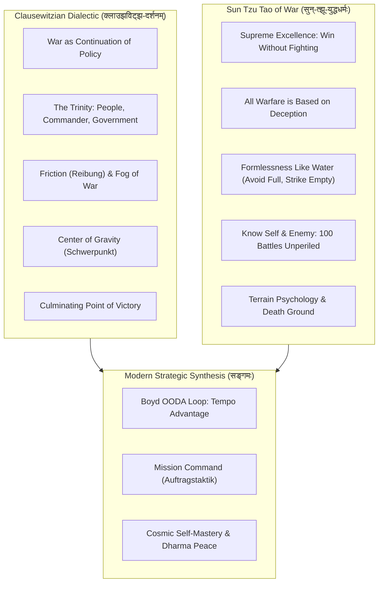

# रणनीतिपञ्चाशिका : युद्धशास्त्रम्
## *Fifty Classical Sanskrit Verses on Strategic Philosophy: Sun Tzu's Art of War and Carl von Clausewitz's On War*

> **ग्रन्थकारः (Author):** Vedant Madane & Antigravity  
> **छन्दः (Metre):** अनुष्टुप् (Anuṣṭubh - Pathyāvaktra rule, 8 syllables per pāda, strictly verified)  
> **व्याकरणम् (Grammar):** Complete Pāṇinian morphological analysis (पदच्छेद, प्रकृति, प्रत्यय, विभक्ति, कारकार्थ)  
> **विषयः (Subject):** Sun Tzu's *The Art of War* (孫子兵法), Carl von Clausewitz's *On War* (Vom Kriege), War as Policy, The Primordial Trinity, Friction and the Fog of War, The Center of Gravity, Winning Without Fighting, Deception and Formlessness, Tactical Terrain, OODA Loops, Mission Command and Sovereign Peace  

---

## प्रस्तावना (Introduction)

Strategy is the supreme intellectual art of deploying limited resources to achieve political, organizational and life objectives against intelligent, reactive adversaries. Across world history, strategic philosophy reached its twin Himalayan summits in two divergent traditions: the Eastern holistic subtlety of Sun Tzu (c. 5th century BCE) and the Western dialectical realism of Prussian military theorist Carl von Clausewitz (1780-1831).

Clausewitz revealed that war is not an isolated act, but the continuation of politics by other means, governed by a paradoxical trinity of passion, chance and reason and dragged down by universal friction and the fog of uncertainty. Sun Tzu established that supreme excellence consists in breaking the enemy's resistance without fighting, treating warfare as the art of deception, formlessness like water and the ruthless exploitation of asymmetric advantage.

**रणनीतिपञ्चाशिका : युद्धशास्त्रम्** unifies these two monumental strategic traditions across 50 metrically verified classical Sanskrit verses in the Anuṣṭubh metre, complete with comprehensive Pāṇinian grammatical analysis and deep strategic commentary.



---

## Canto 1: युद्धं नीतेरनुवर्तनम्
### *War as an Instrument of Policy: The Primordial Trinity and Nature of Conflict*

#### Verse 1

```sanskrit
नीतेः प्रसरणार्थाय युद्धं प्रवर्तते सदा ।
स्वतन्त्रं न भवेत् कर्म नीतेरङ्गं तदुच्यते ॥
```

**पदच्छेदः:** नीतेः प्रसरण-अर्थाय युद्धम् प्रवर्तते सदा । स्वतन्त्रम् न भवेत् कर्म नीतेः अङ्गम् तत् उच्यते ॥

**पाणिनीय-व्याकरण-सारणी:**

| पदम् | मूलप्रकृतिः / धातुः | पदविभागः | विभक्तिः / प्रत्ययः | व्याख्या / कारकार्थः |
| :--- | :--- | :--- | :--- | :--- |
| **नीतेः** | `नीति` | स्त्रीलिंग नाम | षष्ठी एकवचन | राजनीतेः (of state policy and politics) |
| **प्रसरणार्थाय** | `प्रसरण + अर्थ` | तादर्थ्य-अव्यय | चतुर्थी एकवचन | विस्ताराय / सातत्याय (for continuation by other means) |
| **युद्धम्** | `युद्ध` | नपुंसकलिंग नाम | प्रथमा एकवचन | सङ्ग्रामः (warfare) |
| **प्रवर्तते** | `प्र + √वृत् + लट्` | आत्मनेपद लट् | प्रथमपुरुष एकवचन | आरभ्यते (commences / operates) |
| **सदा** | `सदा` | अव्ययम् | अव्ययम् | नित्यम् (always) |
| **स्वतन्त्रम्** | `स्व + तन्त्र` | विशेषण नपुंसकलिंग | प्रथमा एकवचन | पृथग्भूतम् (an isolated or autonomous phenomenon) |
| **न** | `न` | अव्ययम् | अव्ययम् | प्रतिषेधे (never) |
| **भवेत्** | `√भू + विधि-लिङ्` | परस्मैपद लिङ् | प्रथमपुरुष एकवचन | विद्येत (can be) |
| **कर्म** | `कर्मन्` | नपुंसकलिंग नाम | प्रथमा एकवचन | कार्यम् (an act) |
| **नीतेः** | `नीति` | स्त्रीलिंग नाम | षष्ठी एकवचन | शासकनीतेः (of political policy) |
| **अङ्गम्** | `अङ्ग` | नपुंसकलिंग नाम | प्रथमा एकवचन | उपकरणम् (an organic instrument) |
| **तत्** | `तद्` | सर्वनाम नपुंसकलिंग | प्रथमा एकवचन | तत् युद्धम् (that war) |
| **उच्यते** | `√वच् + कर्मणि लट्` | कर्मणि लट् | प्रथमपुरुष एकवचन | कथ्यते (is defined) |

**युद्धशास्त्र-भाष्यम् (Strategic Philosophy Commentary):** War as the Continuation of Politics: Carl von Clausewitz's foundational axiom in On War (Vom Kriege) is that war is not a merely isolated act of wanton violence, but the continuation of political intercourse with the addition of other means (der Krieg ist eine bloße Fortsetzung der Politik mit anderen Mitteln). Political purpose is the master brain; military force is merely the physical instrument.

---

#### Verse 2

```sanskrit
उत्साहश्चैव दैवञ्च बुद्धिस्तत्त्वत्रयं स्मृतम् ।
प्रजा सैन्यं तथा राजा त्रिभिर्युद्धं प्रचाल्यते ॥
```

**पदच्छेदः:** उत्साहः च एव दैवम् च बुद्धिः तत्त्व-त्रयम् स्मृतम् । प्रजा सैन्यम् तथा राजा त्रिभिः युद्धम् प्रचाल्यते ॥

**पाणिनीय-व्याकरण-सारणी:**

| पदम् | मूलप्रकृतिः / धातुः | पदविभागः | विभक्तिः / प्रत्ययः | व्याख्या / कारकार्थः |
| :--- | :--- | :--- | :--- | :--- |
| **उत्साहः** | `उत्साह` | पुंलिंग नाम | प्रथमा एकवचन | प्रजायाः भावना / हिंसावेगः (primordial passion and enmity) |
| **च** | `च` | अव्ययम् | अव्ययम् | समुच्चये (and) |
| **एव** | `एव` | अव्ययम् | अव्ययम् | अवधारणे (certainly) |
| **दैवम्** | `दैव` | नपुंसकलिंग नाम | प्रथमा एकवचन | संयोगः / सम्भाव्यता (chance and probability) |
| **च** | `च` | अव्ययम् | अव्ययम् | समुच्चये (and) |
| **बुद्धिः** | `बुद्धि` | स्त्रीलिंग नाम | प्रथमा एकवचन | राजनीतिकविवेकः (subordinating reason / policy) |
| **तत्त्वत्रयम्** | `तत्त्व + त्रय` | कर्मधारय नपुंसकलिंग | प्रथमा एकवचन | क्लाउझविट्झ-त्रिमूर्तिः (the Clausewitzian Trinity) |
| **स्मृतम्** | `√स्मृ + क्त` | कृदन्तरूप नपुंसकलिंग | प्रथमा एकवचन | प्रतिपादितम् (formalized) |
| **प्रजा** | `प्रजा` | स्त्रीलिंग नाम | प्रथमा एकवचन | जनसामान्यम् (the people) |
| **सैन्यम्** | `सैन्य` | नपुंसकलिंग नाम | प्रथमा एकवचन | सेनापतिः सैन्यं च (the commander and the army) |
| **तथा** | `तथा` | अव्ययम् | अव्ययम् | समुच्चये (and) |
| **राजा** | `राजन्` | पुंलिंग नाम | प्रथमा एकवचन | सर्वकारः / शासनम् (the government) |
| **त्रिभिः** | `त्रि` | संख्यावाचक पुंलिंग | तृतीया बहुवचन | एतैः त्रिभिः अङ्गैः (by these three forces) |
| **युद्धम्** | `युद्ध` | नपुंसकलिंग नाम | प्रथमा एकवचन | समरः (warfare) |
| **प्रचाल्यते** | `प्र + चल् + णिच् + कर्मणि लट्` | कर्मणि लट् | प्रथमपुरुष एकवचन | नियम्यते (is governed) |

**युद्धशास्त्र-भाष्यम् (Strategic Philosophy Commentary):** The Clausewitzian Trinity (Wunderliche Dreifaltigkeit): Clausewitz models war as a paradoxical trinity of three dynamic forces: 1) Primordial violence, hatred and enmity (associated with the People), 2) Chance, uncertainty and military talent (associated with the Commander and Army) and 3) Rational political subordination to policy (associated with the Government). Strategy requires balancing all three.

---

#### Verse 3

```sanskrit
कल्पनायां भवेत्तीव्रं पूर्णहिंसात्मकं रणम् ।
लोके तु नियमैर्बद्धं संकोचेन प्रवर्तते ॥
```

**पदच्छेदः:** कल्पनायाम् भवेत् तीव्रम् पूर्ण-हिंसात्मकम् रणम् । लोके तु नियमैः बद्धम् संकोचेन प्रवर्तते ॥

**पाणिनीय-व्याकरण-सारणी:**

| पदम् | मूलप्रकृतिः / धातुः | पदविभागः | विभक्तिः / प्रत्ययः | व्याख्या / कारकार्थः |
| :--- | :--- | :--- | :--- | :--- |
| **कल्पनायाम्** | `कल्पना` | स्त्रीलिंग नाम | सप्तमी एकवचन | विशुद्ध-तर्क-सिद्धान्ते (in pure philosophical abstraction) |
| **भवेत्** | `√भू + विधि-लिङ्` | परस्मैपद लिङ् | प्रथमपुरुष एकवचन | स्यात् (would be) |
| **तीव्रम्** | `तीव्र` | विशेषण नपुंसकलिंग | प्रथमा एकवचन | अतिशयोक्तिपूर्णम् (extreme) |
| **पूर्णहिंसात्मकम्** | `पूर्ण + हिंसात्मक` | कर्मधारय नपुंसकलिंग | प्रथमा एकवचन | अॅब्सोल्यूट्-वार / शुद्धहिंसा (Absolute War / pure violence) |
| **रणम्** | `रण` | नपुंसकलिंग नाम | प्रथमा एकवचन | समरकर्म (warfare) |
| **लोके** | `लोक` | पुंलिंग नाम | सप्तमी एकवचन | वास्तविकजगता (in the real physical world) |
| **तु** | `तु` | अव्ययम् | अव्ययम् | विशेषे (however) |
| **नियमैः** | `नियम` | पुंलिंग नाम | तृतीया बहुवचन | सीमितसाधनैः (by physical friction and political limits) |
| **बद्धम्** | `√बन्ध् + क्त` | कृदन्तरूप नपुंसकलिंग | प्रथमा एकवचन | नियन्त्रितम् (constrained) |
| **संकोचेन** | `संकोच` | पुंलिंग नाम | तृतीया एकवचन | मर्यादया (with friction and moderation) |
| **प्रवर्तते** | `प्र + √वृत् + लट्` | आत्मनेपद लट् | प्रथमपुरुष एकवचन | घटते (unfolds as Real War) |

**युद्धशास्त्र-भाष्यम् (Strategic Philosophy Commentary):** Absolute War vs Real War: In pure philosophical theory, war logically tends toward absolute, reciprocal extremes of unlimited violence (Absolute War). But in reality, war never occurs in a vacuum: friction, imperfect intelligence, limited resources, human inertia and political calculations constrain it into Real War (Wirkliche Kriege).

---

#### Verse 4

```sanskrit
बलस्य योजनेनैव शत्रुं वशीकरोति यः ।
स्वाज्ञायाः पालनायाशु युद्धमेतन्मुनीरितम् ॥
```

**पदच्छेदः:** बलस्य योजनेन एव शत्रुम् वशीकरोति यः । स्व-आज्ञायाः पालनाय आशु युद्धम् एतत् मुनि-ईरितम् ॥

**पाणिनीय-व्याकरण-सारणी:**

| पदम् | मूलप्रकृतिः / धातुः | पदविभागः | विभक्तिः / प्रत्ययः | व्याख्या / कारकार्थः |
| :--- | :--- | :--- | :--- | :--- |
| **बलस्य** | `बल` | नपुंसकलिंग नाम | षष्ठी एकवचन | भौतिकशक्तेः (of physical force) |
| **योजनेन** | `योजन` | नपुंसकलिंग नाम | तृतीया एकवचन | प्रयोगेण (through the application) |
| **एव** | `एव` | अव्ययम् | अव्ययम् | अवधारणे (alone) |
| **शत्रुम्** | `शत्रु` | पुंलिंग नाम | द्वितीया एकवचन | प्रतिद्वन्द्विनम् (the enemy) |
| **वशीकरोति** | `वशी + √कृ + लट्` | परस्मैपद लट् | प्रथमपुरुष एकवचन | अधीनं विधत्ते (compels / subdues) |
| **यः** | `यद्` | सर्वनाम पुंलिंग | प्रथमा एकवचन | यः राष्ट्रनायकः (whoever) |
| **स्वाज्ञायाः** | `स्व + आज्ञा` | षष्ठी-तत्पुरुष स्त्रीलिंग | षष्ठी एकवचन | स्वसंकल्पस्य (of one's own will) |
| **पालनाय** | `पालन` | नपुंसकलिंग नाम | चतुर्थी एकवचन | तादर्थ्ये चतुर्थी : अनुष्ठानाय (to compel our will upon the enemy) |
| **आशु** | `आशु` | क्रियाविशेषणम् | अव्ययम् | शीघ्रम् (swiftly) |
| **युद्धम्** | `युद्ध` | नपुंसकलिंग नाम | प्रथमा एकवचन | सङ्ग्रामः (war) |
| **एतत्** | `एतद्` | सर्वनाम नपुंसकलिंग | प्रथमा एकवचन | इदम् (this) |
| **मुनीरितम्** | `मुनि + ईरित` | तृतीया-तत्पुरुष नपुंसकलिंग | प्रथमा एकवचन | क्लाउझविट्झ-वचनम् (proclaimed by Clausewitz) |

**युद्धशास्त्र-भाष्यम् (Strategic Philosophy Commentary):** War as an Act of Compulsion: 'War is thus an act of force to compel our enemy to do our will.' Physical force is the means; the compulsory submission of the enemy's will to our political objective is the ultimate end. Disarming the enemy is the direct aim of combat only insofar as it forces political capitulation.

---

#### Verse 5

```sanskrit
लक्ष्यं भवति यन्मुख्यं साध्येनैव विशिष्यते ।
विनाशमात्रमुद्देश्यो न कदापि प्रशस्यते ॥
```

**पदच्छेदः:** लक्ष्यम् भवति यत् मुख्यम् साध्येन एव विशिष्यते । विनाश-मात्रम् उद्देश्यः न कदापि प्रशस्यते ॥

**पाणिनीय-व्याकरण-सारणी:**

| पदम् | मूलप्रकृतिः / धातुः | पदविभागः | विभक्तिः / प्रत्ययः | व्याख्या / कारकार्थः |
| :--- | :--- | :--- | :--- | :--- |
| **लक्ष्यम्** | `लक्ष्य` | नपुंसकलिंग नाम | प्रथमा एकवचन | राजनीतिकोद्देश्यम् (the political objective) |
| **भवति** | `√भू + लट्` | परस्मैपद लट् | प्रथमपुरुष एकवचन | विद्यते (is) |
| **यत्** | `यद्` | सर्वनाम नपुंसकलिंग | प्रथमा एकवचन | यत् साध्यम् (which) |
| **मुख्यम्** | `मुख्य` | विशेषण नपुंसकलिंग | प्रथमा एकवचन | प्रधानम् (paramount) |
| **साध्येन** | `साध्य` | नपुंसकलिंग नाम | तृतीया एकवचन | अन्तिमफलेन (by the political outcome) |
| **एव** | `एव` | अव्ययम् | अव्ययम् | अवधारणे (alone) |
| **विशिष्यते** | `वि + √शिष् + कर्मणि लट्` | कर्मणि लट् | प्रथमपुरुष एकवचन | परिभाष्यते (is governed) |
| **विनाशमात्रम्** | `विनाश + मात्र` | नपुंसकलिंग नाम | प्रथमा एकवचन | केवलं हननम् (mere slaughter / kinetic annihilation) |
| **उद्देश्यः** | `उद्देश्य` | पुंलिंग नाम | प्रथमा एकवचन | लक्ष्यम् (as an end in itself) |
| **न** | `न` | अव्ययम् | अव्ययम् | प्रतिषेधे (never) |
| **कदापि** | `कदा + अपि` | अव्ययम् | अव्ययम् | कस्मिंश्चिदपि काले (ever) |
| **प्रशस्यते** | `प्र + √शंस् + कर्मणि लट्` | कर्मणि लट् | प्रथमपुरुष एकवचन | श्लाघ्यते (is praised) |

**युद्धशास्त्र-भाष्यम् (Strategic Philosophy Commentary):** Supremacy of the Political Object: The political object determines both the military objective and the amount of effort required. Destruction for the sake of destruction is mindless barbarism. If military action ceases to serve political interests, or if the costs of war surpass the value of the political object, continuing to fight is catastrophic folly.

---

## Canto 2: रणकुहेलिका घर्षणं च
### *The Fog of War, Friction, Moral Forces and Military Genius*

#### Verse 6

```sanskrit
कुहेलिकामयं सर्वं दृश्यते समराङ्गणे ।
त्रिभागं संशये मग्नं सत्यं गुप्तेन वर्तते ॥
```

**पदच्छेदः:** कुहेलिका-मयम् सर्वम् दृश्यते समर-अङ्गणे । त्रि-भागम् संशये मग्नम् सत्यम् गुप्तेन वर्तते ॥

**पाणिनीय-व्याकरण-सारणी:**

| पदम् | मूलप्रकृतिः / धातुः | पदविभागः | विभक्तिः / प्रत्ययः | व्याख्या / कारकार्थः |
| :--- | :--- | :--- | :--- | :--- |
| **कुहेलिकामयम्** | `कुहेलिका + मयट्` | विशेषण नपुंसकलिंग | प्रथमा एकवचन | धूम्रजालच्छन्नम् (enveloped in the Fog of War: Nebel des Krieges) |
| **सर्वम्** | `सर्व` | विशेषण नपुंसकलिंग | प्रथमा एकवचन | समग्रं वृत्तम् (all battlefield reality) |
| **दृश्यते** | `√दृश् + कर्मणि लट्` | कर्मणि लट् | प्रथमपुरुष एकवचन | अवलोक्यते (appears) |
| **समराङ्गणे** | `समर + अङ्गण` | षष्ठी-तत्पुरुष नपुंसकलिंग | सप्तमी एकवचन | युद्धभूमौ (on the battlefield) |
| **त्रिभागम्** | `त्रि + भाग` | कर्मधारय नपुंसकलिंग | प्रथमा एकवचन | पादत्रयम् / ७५% (three quarters of all information) |
| **संशये** | `संशय` | पुंलिंग नाम | सप्तमी एकवचन | अज्ञाने (in uncertainty and doubt) |
| **मग्नम्** | `√मस्ज् + क्त` | कृदन्तरूप नपुंसकलिंग | प्रथमा एकवचन | निमग्नम् (submerged) |
| **सत्यम्** | `सत्य` | नपुंसकलिंग नाम | प्रथमा एकवचन | यथार्थतथ्यम् (objective truth) |
| **गुप्तेन** | `गुप्त` | विशेषण नपुंसकलिंग | तृतीया एकवचन | अप्रत्यक्षतया (hidden) |
| **वर्तते** | `√वृत् + लट्` | आत्मनेपद लट् | प्रथमपुरुष एकवचन | तिष्ठति (remains) |

**युद्धशास्त्र-भाष्यम् (Strategic Philosophy Commentary):** The Fog of War (Nebel des Krieges): 'Three-fourths of the things on which action in war is based lie hidden in the fog of a greater or lesser uncertainty.' Conflicting reports, incomplete intelligence and enemy deception create an opaque fog where the commander must act with incomplete information, relying on intuition and trained judgment.

---

#### Verse 7

```sanskrit
घर्षणेन विधानेन कार्यं मन्दं प्रजायते ।
सहस्राणां लघुदोषाद् भारो वर्धेत कोटिशः ॥
```

**पदच्छेदः:** घर्षणेन विधानेन कार्यम् मन्दम् प्रजायते । सहस्राणाम् लघु-दोषात् भारः वर्धेत कोटिशः ॥

**पाणिनीय-व्याकरण-सारणी:**

| पदम् | मूलप्रकृतिः / धातुः | पदविभागः | विभक्तिः / प्रत्ययः | व्याख्या / कारकार्थः |
| :--- | :--- | :--- | :--- | :--- |
| **घर्षणेन** | `घर्षण` | नपुंसकलिंग नाम | तृतीया एकवचन | रायबुङ्ग्-प्रभावेन (by universal friction: Reibung) |
| **विधानेन** | `विधान` | नपुंसकलिंग नाम | तृतीया एकवचन | स्वाभाविकनियमेन (by the systemic law) |
| **कार्यम्** | `कार्य` | नपुंसकलिंग नाम | प्रथमा एकवचन | सैन्यकर्म (operation) |
| **मन्दम्** | `मन्द` | विशेषण नपुंसकलिंग | प्रथमा एकवचन | अतिविलम्बितम् (drastically retarded) |
| **प्रजायते** | `प्र + √जन् + लट्` | आत्मनेपद लट् | प्रथमपुरुष एकवचन | भवति (becomes) |
| **सहस्राणाम्** | `सहस्र` | संख्यावाचक नपुंसकलिंग | षष्ठी बहुवचन | अनेकेषाम् (of thousands of) |
| **लघुदोषात्** | `लघु + दोष` | कर्मधारय पुंलिंग | पञ्चमी एकवचन | सूक्ष्म-विपत्तिभ्यः (small unpredictable accidents) |
| **भारः** | `भार` | पुंलिंग नाम | प्रथमा एकवचन | क्लेशभारः (resistance / drag) |
| **वर्धेत** | `√वृध् + विधि-लिङ्` | आत्मनेपद लिङ् | प्रथमपुरुष एकवचन | प्रवर्धते (multiplies) |
| **कोटिशः** | `कोटि + शस्` | अव्ययम् | अव्ययम् | सहस्रगुणम् (infinitely) |

**युद्धशास्त्र-भाष्यम् (Strategic Philosophy Commentary):** Friction (Reibung): Clausewitz introduced Friction as the concept that distinguishes real war from war on paper: 'Everything in war is simple, but the simplest thing is difficult.' Weather, mud, broken wagons, sickness, lost orders and tired soldiers accumulate into an immense collective resistance that drags down military execution.

---

#### Verse 8

```sanskrit
विद्युद्दृष्टिं समालोक्य निश्चयं कुरुते बली ।
अन्धकारेऽपि मार्गेषु नेता गच्छत्यशङ्कितः ॥
```

**पदच्छेदः:** विद्युत्-दृष्टिम् समालोक्य निश्चयम् कुरुते बली । अन्धकारे अपि मार्गेषु नेता गच्छति अशङ्कितः ॥

**पाणिनीय-व्याकरण-सारणी:**

| पदम् | मूलप्रकृतिः / धातुः | पदविभागः | विभक्तिः / प्रत्ययः | व्याख्या / कारकार्थः |
| :--- | :--- | :--- | :--- | :--- |
| **विद्युद्दृष्टिम्** | `विद्युत् + दृष्टि` | कर्मधारय स्त्रीलिंग | द्वितीया एकवचन | कू-दैल / अंतःप्रज्ञाम् (Coup d'œil: rapid intuitive insight) |
| **समालोक्य** | `सम् + आ + √लोक् + ल्यप्` | कृदन्तरूप अव्यय | अव्ययम् | अनुभूय (having manifested) |
| **निश्चयम्** | `निश्चय` | पुंलिंग नाम | द्वितीया एकवचन | दृढसङ्कल्पम् / एन्त्शलोसेन्हाय्ट् (Determination: Entschlossenheit) |
| **कुरुते** | `√कृ + आत्मनेपद लट्` | आत्मनेपद लट् | प्रथमपुरुष एकवचन | धारयति (forms) |
| **बली** | `बलिन्` | पुंलिंग नाम | प्रथमा एकवचन | महासेनापतिः (the commander of military genius) |
| **अन्धकारे** | `अन्धकार` | पुंलिंग नाम | सप्तमी एकवचन | कुहेलिका-मध्ये (amid the battlefield fog) |
| **अपि** | `अपि` | अव्ययम् | अव्ययम् | सम्भवे (even) |
| **मार्गेषु** | `मार्ग` | पुंलिंग नाम | सप्तमी बहुवचन | युद्धपथेषु (on the chaotic paths) |
| **नेता** | `नेतृ` | पुंलिंग नाम | प्रथमा एकवचन | प्रशासकः (the leader) |
| **गच्छति** | `√गम् + लट्` | परस्मैपद लट् | प्रथमपुरुष एकवचन | अग्रसरति (advances) |
| **अशङ्कितः** | `नञ् + शङ्कित` | विशेषण पुंलिंग | प्रथमा एकवचन | भयरहितः (undeterred) |

**युद्धशास्त्र-भाष्यम् (Strategic Philosophy Commentary):** Military Genius (Coup d'œil and Entschlossenheit): Overcoming friction and fog requires the Military Genius. Clausewitz identifies two indispensable faculties: Coup d'œil (the inward eye that instantly flashes upon truth amid darkness) and Entschlossenheit (unwavering determination to execute decisions without yielding to fear, doubt, or second-guessing).

---

#### Verse 9

```sanskrit
शस्त्रस्य बलता यावन् मनोबलं ततोऽधिकम् ।
त्रिगुणेन प्रभावेन जयं प्राप्नोति धैर्यवान् ॥
```

**पदच्छेदः:** शस्त्रस्य बलता यावत् मनः-बलम् ततः अधिकम् । त्रि-गुणेन प्रभावेन जयम् प्राप्नोति धैर्यवान् ॥

**पाणिनीय-व्याकरण-सारणी:**

| पदम् | मूलप्रकृतिः / धातुः | पदविभागः | विभक्तिः / प्रत्ययः | व्याख्या / कारकार्थः |
| :--- | :--- | :--- | :--- | :--- |
| **शस्त्रस्य** | `शस्त्र` | नपुंसकलिंग नाम | षष्ठी एकवचन | भौतिकशस्त्राणाम् (of physical weaponry) |
| **बलता** | `बल + ता` | स्त्रीलिंग नाम | प्रथमा एकवचन | सामर्थ्यम् (power) |
| **यावत्** | `यावत्` | अव्ययम् | अव्ययम् | परिमाणे (as much as) |
| **मनोबलम्** | `मनस् + बल` | षष्ठी-तत्पुरुष नपुंसकलिंग | प्रथमा एकवचन | नैतिकबलम् / मोराल् (moral forces and fighting spirit) |
| **ततः** | `ततः` | अव्ययम् | अव्ययम् | तस्मात् (than that) |
| **अधिकम्** | `अधिक` | विशेषण नपुंसकलिंग | प्रथमा एकवचन | श्रेष्ठतरम् (far greater) |
| **त्रिगुणेन** | `त्रि + गुण` | विशेषण पुंलिंग | तृतीया एकवचन | ३ : १ अनुपातेन (in a 3 to 1 ratio: Napoleon's maxim) |
| **प्रभावेन** | `प्रभाव` | पुंलिंग नाम | तृतीया एकवचन | सामर्थ्येन (by moral potency) |
| **जयम्** | `जय` | पुंलिंग नाम | द्वितीया एकवचन | विजयम् (triumph) |
| **प्राप्नोति** | `प्र + √आप् + लट्` | परस्मैपद लट् | प्रथमपुरुष एकवचन | अधिगच्छति (attains) |
| **धैर्यवान्** | `धैर्यवत्` | विशेषण पुंलिंग | प्रथमा एकवचन | मनोबलसमन्वितः (the resolute commander) |

**युद्धशास्त्र-भाष्यम् (Strategic Philosophy Commentary):** The Primacy of Moral Forces: 'Moral factors are among the most important in war. They constitute the spirit that permeates the whole being of war.' Physical numbers and weapons are the wooden hilt; moral forces (courage, discipline, faith, patriotism) are the sharpened blade. Napoleon later echoed Clausewitz: 'In war, the moral is to the physical as three is to one.'

---

#### Verse 10

```sanskrit
भयेन च श्रमेणापि युक्तं भवति सङ्कुलम् ।
यः सहते दृढं कष्टं स एव विजयी भवेत् ॥
```

**पदच्छेदः:** भयेन च श्रमेण अपि युक्तम् भवति सङ्कुलम् । यः सहते दृढम् कष्टम् सः एव विजयी भवेत् ॥

**पाणिनीय-व्याकरण-सारणी:**

| पदम् | मूलप्रकृतिः / धातुः | पदविभागः | विभक्तिः / प्रत्ययः | व्याख्या / कारकार्थः |
| :--- | :--- | :--- | :--- | :--- |
| **भयेन** | `भय` | नपुंसकलिंग नाम | तृतीया एकवचन | मृत्युभयेन (with terror and mortal peril) |
| **च** | `च` | अव्ययम् | अव्ययम् | समुच्चये (and) |
| **श्रमेण** | `श्रम` | पुंलिंग नाम | तृतीया एकवचन | शारीरिकपरिश्रमेण (exhaustion and physical exertion) |
| **अपि** | `अपि` | अव्ययम् | अव्ययम् | समुच्चये (also) |
| **युक्तम्** | `√युज् + क्त` | कृदन्तरूप नपुंसकलिंग | प्रथमा एकवचन | समन्वितम् (permeated) |
| **भवति** | `√भू + लट्` | परस्मैपद लट् | प्रथमपुरुष एकवचन | जायते (is) |
| **सङ्कुलम्** | `सङ्कुल` | नपुंसकलिंग नाम | प्रथमा एकवचन | समरवातावरणम् (the combat medium) |
| **यः** | `यद्` | सर्वनाम पुंलिंग | प्रथमा एकवचन | यः सैनिकः (whichever warrior) |
| **सहते** | `√सह् + आत्मनेपद लट्` | आत्मनेपद लट् | प्रथमपुरुष एकवचन | तितिक्षते (endures) |
| **दृढम्** | `दृढ` | क्रियाविशेषणम् | अव्ययम् | अविचलतया (unshakeably) |
| **कष्टम्** | `कष्ट` | नपुंसकलिंग नाम | द्वितीया एकवचन | घर्षणक्लेशम् (the misery of war) |
| **सः** | `तद्` | सर्वनाम पुंलिंग | प्रथमा एकवचन | स पुरुषः (that person) |
| **एव** | `एव` | अव्ययम् | अव्ययम् | अवधारणे (alone) |
| **विजयी** | `विजयिन्` | विशेषण पुंलिंग | प्रथमा एकवचन | विजयप्राप्तः (victorious) |
| **भवेत्** | `√भू + विधि-लिङ्` | परस्मैपद लिङ् | प्रथमपुरुष एकवचन | जायते (becomes) |

**युद्धशास्त्र-भाष्यम् (Strategic Philosophy Commentary):** Danger, Exertion and Suffering: War is waged in an atmosphere of physical exertion, danger and suffering. To operate effectively within this terrifying medium, troops and officers require seasoned resilience: fortitude that does not crack under the slaughter and exhaustion of real combat.

---

## Canto 3: गुरुत्वकेन्द्रं पराकाष्ठा च
### *Center of Gravity, Mass Concentration and the Culminating Point of Victory*

#### Verse 11

```sanskrit
गुरुत्वस्य भवेत् केन्द्रं यस्मिन् सर्वं प्रतिष्ठितम् ।
तस्यैव भङ्गमात्रेण शत्रुसैन्यं विनश्यति ॥
```

**पदच्छेदः:** गुरुत्वस्य भवेत् केन्द्रम् यस्मिन् सर्वम् प्रतिष्ठितम् । तस्य एव भङ्ग-मात्रेण शत्रु-सैन्यम् विनश्यति ॥

**पाणिनीय-व्याकरण-सारणी:**

| पदम् | मूलप्रकृतिः / धातुः | पदविभागः | विभक्तिः / प्रत्ययः | व्याख्या / कारकार्थः |
| :--- | :--- | :--- | :--- | :--- |
| **गुरुत्वस्य** | `गुरुत्व` | नपुंसकलिंग नाम | षष्ठी एकवचन | शक्तेः (of power and weight) |
| **केन्द्रम्** | `केन्द्र` | नपुंसकलिंग नाम | प्रथमा एकवचन | श्वेयरपुङ्क्ट् / गुरुत्वकेन्द्रम् (Center of Gravity: Schwerpunkt) |
| **भवेत्** | `√भू + विधि-लिङ्` | परस्मैपद लिङ् | प्रथमपुरुष एकवचन | अस्ति (exists) |
| **यस्मिन्** | `यद्` | सर्वनाम नपुंसकलिंग | सप्तमी एकवचन | यस्मिन् बिन्दौ (upon which hub) |
| **सर्वम्** | `सर्व` | विशेषण नपुंसकलिंग | प्रथमा एकवचन | समग्रं सैन्यसामर्थ्यम् (all enemy movement and power) |
| **प्रतिष्ठितम्** | `प्रति + √स्था + क्त` | कृदन्तरूप नपुंसकलिंग | प्रथमा एकवचन | आश्रितम् (is founded) |
| **तस्य** | `तद्` | सर्वनाम नपुंसकलिंग | षष्ठी एकवचन | तस्य केन्द्रस्य (of that center) |
| **एव** | `एव` | अव्ययम् | अव्ययम् | अवधारणे (alone) |
| **भङ्गमात्रेण** | `भङ्ग + मात्र` | तृतीया एकवचन नपुंसकलिंग | तृतीया एकवचन | विनाशनेनैव (merely by shattering) |
| **शत्रुसैन्यम्** | `शत्रु + सैन्य` | षष्ठी-तत्पुरुष नपुंसकलिंग | प्रथमा एकवचन | प्रतिपक्षसैन्यम् (the enemy forces) |
| **विनश्यति** | `वि + √नश् + लट्` | परस्मैपद लट् | प्रथमपुरुष एकवचन | ध्वंसं गच्छति (collapses) |

**युद्धशास्त्र-भाष्यम् (Strategic Philosophy Commentary):** The Center of Gravity (Schwerpunkt): Clausewitz defines the Center of Gravity as 'the hub of all power and movement, on which everything depends.' It may be the enemy's main army, their capital city, their principal ally, or the public will of the population. Strategy consists of identifying this single hub and directing all blows against it.

---

#### Verse 12

```sanskrit
एकस्मिन् निश्चिते देशे बलं सर्वं नियोजयेत् ।
विकीर्णं न भवेत् सैन्यं साध्ये संलक्ष्यते मतिः ॥
```

**पदच्छेदः:** एकस्मिन् निश्चिते देशे बलम् सर्वम् नियोजयेत् । विकीर्णम् न भवेत् सैन्यम् साध्ये संलक्ष्यते मतिः ॥

**पाणिनीय-व्याकरण-सारणी:**

| पदम् | मूलप्रकृतिः / धातुः | पदविभागः | विभक्तिः / प्रत्ययः | व्याख्या / कारकार्थः |
| :--- | :--- | :--- | :--- | :--- |
| **एकस्मिन्** | `एक` | संख्यावाचक पुंलिंग | सप्तमी एकवचन | एकस्मिन् (at a single) |
| **निश्चिते** | `निस् + √चि + क्त` | कृदन्तरूप पुंलिंग | सप्तमी एकवचन | निर्धारिते (decisive) |
| **देशे** | `देश` | पुंलिंग नाम | सप्तमी एकवचन | निर्णायकस्थाने (point in space and time) |
| **बलम्** | `बल` | नपुंसकलिंग नाम | द्वितीया एकवचन | सैन्यबलम् (military force) |
| **सर्वम्** | `सर्व` | विशेषण नपुंसकलिंग | द्वितीया एकवचन | समग्रम् (all available) |
| **नियोजयेत्** | `नि + √युज् + णिच् + विधि-लिङ्` | परस्मैपद लिङ् | प्रथमपुरुष एकवचन | एकीकुर्यात् (must concentrate) |
| **विकीर्णम्** | `वि + √कॄ + क्त` | कृदन्तरूप नपुंसकलिंग | प्रथमा एकवचन | विभाजितम् / प्रसृतम् (dispersed across secondary theaters) |
| **न** | `न` | अव्ययम् | अव्ययम् | प्रतिषेधे (never) |
| **भवेत्** | `√भू + विधि-लिङ्` | परस्मैपद लिङ् | प्रथमपुरुष एकवचन | स्यात् (should be) |
| **सैन्यम्** | `सैन्य` | नपुंसकलिंग नाम | प्रथमा एकवचन | सेना (army) |
| **साध्ये** | `साध्य` | नपुंसकलिंग नाम | सप्तमी एकवचन | मुख्यकेन्द्रे (on the decisive objective) |
| **संलक्ष्यते** | `सम् + √लक्ष् + कर्मणि लट्` | कर्मणि लट् | प्रथमपुरुष एकवचन | केन्द्रीक्रियते (is locked) |
| **मतिः** | `मति` | स्त्रीलिंग नाम | प्रथमा एकवचन | रणबुद्धिः (strategic intellect) |

**युद्धशास्त्र-भाष्यम् (Strategic Philosophy Commentary):** Concentration of Force in Space and Time: 'The best strategy is always to be very strong: first generally and subsequently at the decisive point.' Dispersing forces across secondary objectives invites defeat in detail. The commander must display ruthless economy of force elsewhere to achieve overwhelming, crushing superiority at the decisive point.

---

#### Verse 13

```sanskrit
जयस्य वर्तते सीमा पराकाष्ठा समीरिता ।
सीमामतिक्रमन् मूढो विनाशे पर्यवस्यति ॥
```

**पदच्छेदः:** जयस्य वर्तते सीमा पराकाष्ठा समीरिता । सीमाम् अतिक्रमन् मूढः विनाशे पर्यवस्यति ॥

**पाणिनीय-व्याकरण-सारणी:**

| पदम् | मूलप्रकृतिः / धातुः | पदविभागः | विभक्तिः / प्रत्ययः | व्याख्या / कारकार्थः |
| :--- | :--- | :--- | :--- | :--- |
| **जयस्य** | `जय` | पुंलिंग नाम | षष्ठी एकवचन | विजयस्य (of offensive victory) |
| **वर्तते** | `√वृत् + लट्` | आत्मनेपद लट् | प्रथमपुरुष एकवचन | विद्यते (exists) |
| **सीमा** | `सीमा` | स्त्रीलिंग नाम | प्रथमा एकवचन | मर्यादा (natural limit) |
| **पराकाष्ठा** | `पराकाष्ठा` | स्त्रीलिंग नाम | प्रथमा एकवचन | कुल्मिनेषन्-पायिन्ट् (the Culminating Point of Victory) |
| **समीरिता** | `सम् + ईर् + णिच् + क्त` | कृदन्तरूप स्त्रीलिंग | प्रथमा एकवचन | उद्भाविता (designated) |
| **सीमायाम्** | `सीमा` | स्त्रीलिंग नाम | द्वितीया एकवचन | ताम् मर्यादाम् (that boundary) |
| **अतिक्रमन्** | `अति + √क्रम् + शतृ` | कृदन्तरूप पुंलिंग | प्रथमा एकवचन | उल्लङ्घयन् (advancing beyond / over-extending) |
| **मूढः** | `मूढ` | विशेषण पुंलिंग | प्रथमा एकवचन | अविवेकी नेता (the reckless general) |
| **विनाशे** | `विनाश` | पुंलिंग नाम | सप्तमी एकवचन | सर्वनाशे (in catastrophic defeat) |
| **पर्यवस्यति** | `परि + अव + √सो + लट्` | परस्मैपद लट् | प्रथमपुरुष एकवचन | पतति (ends up) |

**युद्धशास्त्र-भाष्यम् (Strategic Philosophy Commentary):** The Culminating Point of Victory (der Kulminationspunkt des Sieges): Every offensive weakens as it advances: supply lines stretch, garrisons deplete troops, disease spreads and the defender falls back onto home territory. The Culminating Point is that precise moment beyond which the attacker's remaining strength is no longer superior to the defender's. Pushing past this point turns victory into catastrophic ruin (Napoleon in Moscow, 1812).

---

#### Verse 14

```sanskrit
संरक्षणं भवेद् धन्द्यं सुदृढं दुर्गमाश्रितम् ।
शत्रोः क्षयं प्रतीक्षेत पश्चात् प्रहरते बली ॥
```

**पदच्छेदः:** संरक्षणम् भवेत् धन्द्यम् सुदृढम् दुर्गम् आश्रितम् । शत्रोः क्षयम् प्रतीक्षेत पश्चात् प्रहरते बली ॥

**पाणिनीय-व्याकरण-सारणी:**

| पदम् | मूलप्रकृतिः / धातुः | पदविभागः | विभक्तिः / प्रत्ययः | व्याख्या / कारकार्थः |
| :--- | :--- | :--- | :--- | :--- |
| **संरक्षणम्** | `सम् + रक्षण` | नपुंसकलिंग नाम | प्रथमा एकवचन | डिफेन्स् / रक्षात्मकं युद्धम् (the defensive form of warfare) |
| **भवेत्** | `√भू + विधि-लिङ्` | परस्मैपद लिङ् | प्रथमपुरुष एकवचन | विद्यते (is) |
| **धन्द्यम्** | `धन्द्य` | विशेषण नपुंसकलिंग | प्रथमा एकवचन | श्रेष्ठतरम् / बलिष्ठम् (the stronger form of war) |
| **सुदृढम्** | `सु + दृढ` | विशेषण नपुंसकलिंग | द्वितीया एकवचन | अभेद्यम् (unshakeable) |
| **दुर्गम्** | `दुर्ग` | नपुंसकलिंग नाम | द्वितीया एकवचन | स्थानम् (fortified terrain) |
| **आश्रितम्** | `आ + √श्रि + क्त` | कृदन्तरूप नपुंसकलिंग | प्रथमा एकवचन | अवलम्बितम् (anchored upon) |
| **शत्रोः** | `शत्रु` | पुंलिंग नाम | षष्ठी एकवचन | आक्रमणकारिणः (of the attacker) |
| **क्षयम्** | `क्षय` | पुंलिंग नाम | द्वितीया एकवचन | बलह्रासम् (exhaustion and attrition) |
| **प्रतीक्षेत** | `प्रति + √ईक्ष् + विधि-लिङ्` | आत्मनेपद लिङ् | प्रथमपुरुष एकवचन | अवलोकयेत् (should await) |
| **पश्चात्** | `पश्चात्` | अव्ययम् | अव्ययम् | अनन्तरम् (thereafter) |
| **प्रहरते** | `प्र + √हृ + आत्मनेपद लट्` | आत्मनेपद लट् | प्रथमपुरुष एकवचन | काउन्टर-अट्याक् करोति (launches the counter-stroke) |
| **बली** | `बलिन्` | पुंलिंग नाम | प्रथमा एकवचन | शक्तिमान् (the master commander) |

**युद्धशास्त्र-भाष्यम् (Strategic Philosophy Commentary):** Defense is the Stronger Form of War: Clausewitz overturned common assumptions by demonstrating that Defense is intrinsically the stronger form of warfare with a negative aim, while Offense is the weaker form with a positive aim. A defense anchored in terrain waits for the attacker to exhaust himself against friction, before launching a devastating counter-stroke (the flashing sword of vengeance).

---

#### Verse 15

```sanskrit
निर्णायके रणे धीरः सर्वं पणे नियोजयेत् ।
लघुयुद्धं परित्यज्य महति लभते जयम् ॥
```

**पदच्छेदः:** निर्णायके रणे धीरः सर्वम् पणे नियोजयेत् । लघु-युद्धम् परित्यज्य महति लभते जयम् ॥

**पाणिनीय-व्याकरण-सारणी:**

| पदम् | मूलप्रकृतिः / धातुः | पदविभागः | विभक्तिः / प्रत्ययः | व्याख्या / कारकार्थः |
| :--- | :--- | :--- | :--- | :--- |
| **निर्णायके** | `निर्णायक` | विशेषण पुंलिंग | सप्तमी एकवचन | मुख्यसङ्ग्रामे (in the decisive major battle: die Schlacht) |
| **रणे** | `रण` | पुंलिंग नाम | सप्तमी एकवचन | युद्धे (in engagement) |
| **धीरः** | `धीर` | पुंलिंग नाम | प्रथमा एकवचन | प्रज्ञावान् सेनानीः (the wise general) |
| **सर्वम्** | `सर्व` | विशेषण नपुंसकलिंग | द्वितीया एकवचन | समग्रं बलम् (all resource and resolve) |
| **पणे** | `पण` | पुंलिंग नाम | सप्तमी एकवचन | द्यूते / दावे (at stake) |
| **नियोजयेत्** | `नि + √युज् + णिच् + विधि-लिङ्` | परस्मैपद लिङ् | प्रथमपुरुष एकवचन | समर्पयेत् (commits) |
| **लघुयुद्धम्** | `लघु + युद्ध` | कर्मधारय नपुंसकलिंग | द्वितीया एकवचन | गौणसङ्ग्रामान् (indecisive minor skirmishes) |
| **परित्यज्य** | `परि + त्यज् + ल्यप्` | कृदन्तरूप अव्यय | अव्ययम् | विहाय (having avoided) |
| **महति** | `महत्` | विशेषण पुंलिंग | सप्तमी एकवचन | निर्णायके समरे (in the great clash of arms) |
| **लभते** | `√लभ् + लट्` | आत्मनेपद लट् | प्रथमपुरुष एकवचन | प्राप्नोति (achieves) |
| **जयम्** | `जय` | पुंलिंग नाम | द्वितीया एकवचन | अन्तिमविजयम् (decisive victory) |

**युद्धशास्त्र-भाष्यम् (Strategic Philosophy Commentary):** The Decisive Battle (die Schlacht): Minor skirmishes and cosmetic maneuvers do not settle wars; wars are settled by major combat engagements (die Schlacht). The commander who refuses to commit forces to a decisive battle out of squeamishness ends up suffering far greater, protracted bloodletting.

---

## Canto 4: युद्धधर्मः अपराजितविधिः
### *Sun Tzu's Tao of Warfare: The Five Factors and Supreme Excellence*

#### Verse 16

```sanskrit
राष्ट्रस्य वर्तते युद्धं जीवनस्य मरणस्य च ।
नाशाय वा समृद्ध्या वा विचार्यं यत्नतो बुधैः ॥
```

**पदच्छेदः:** राष्ट्रस्य वर्तते युद्धम् जीवनस्य मरणस्य च । नाशाय वा समृद्ध्या वा विचार्यम् यत्नतः बुधैः ॥

**पाणिनीय-व्याकरण-सारणी:**

| पदम् | मूलप्रकृतिः / धातुः | पदविभागः | विभक्तिः / प्रत्ययः | व्याख्या / कारकार्थः |
| :--- | :--- | :--- | :--- | :--- |
| **राष्ट्रस्य** | `राष्ट्र` | नपुंसकलिंग नाम | षष्ठी एकवचन | देशस्य (of the state) |
| **वर्तते** | `√वृत् + लट्` | आत्मनेपद लट् | प्रथमपुरुष एकवचन | अस्ति (is) |
| **युद्धम्** | `युद्ध` | नपुंसकलिंग नाम | प्रथमा एकवचन | समरकर्म (warfare) |
| **जीवनस्य** | `जीवन` | नपुंसकलिंग नाम | षष्ठी एकवचन | अस्तित्वस्य (of life) |
| **मरणस्य** | `मरण` | नपुंसकलिंग नाम | षष्ठी एकवचन | विनाशस्य (of death) |
| **च** | `च` | अव्ययम् | अव्ययम् | समुच्चये (and) |
| **नाशाय** | `नाश` | पुंलिंग नाम | चतुर्थी एकवचन | तादर्थ्ये चतुर्थी : संहाराय (unto ruin) |
| **वा** | `वा` | अव्ययम् | अव्ययम् | विकल्पे (or) |
| **समृद्ध्या** | `समृद्धि` | स्त्रीलिंग नाम | तृतीया एकवचन | संरक्षणाय (unto survival and safety) |
| **वा** | `वा` | अव्ययम् | अव्ययम् | विकल्पे (or) |
| **विचार्यम्** | `वि + √चर् + ण्यत्` | कृदन्तरूप नपुंसकलिंग | प्रथमा एकवचन | अनुसन्धेयम् (must be deliberated) |
| **यत्नतः** | `यत्न + तसिँ` | अव्ययम् | अव्ययम् | सावधानेन (with utmost gravity) |
| **बुधैः** | `बुध` | पुंलिंग नाम | तृतीया बहुवचन | प्रशासकैः (by statesmen and generals) |

**युद्धशास्त्र-भाष्यम् (Strategic Philosophy Commentary):** War as a Matter of Vital Importance: Sun Tzu opens The Art of War (Sunzi Bingfa) with solemn gravity: 'The art of war is of vital importance to the State. It is a matter of life and death, a road either to safety or to ruin. Hence it is a subject of inquiry which can on no account be neglected.' War must never be undertaken rashly or out of personal pique.

---

#### Verse 17

```sanskrit
धर्मश्चैव तथा कालः क्षेत्रं सेनापतिर्विधिः ।
पञ्चैतानि समालोक्य विजयं कुरुते सुधीः ॥
```

**पदच्छेदः:** धर्मः च एव तथा कालः क्षेत्रम् सेनापतिः विधिः । पञ्च एतानि समालोक्य विजयम् कुरुते सुधीः ॥

**पाणिनीय-व्याकरण-सारणी:**

| पदम् | मूलप्रकृतिः / धातुः | पदविभागः | विभक्तिः / प्रत्ययः | व्याख्या / कारकार्थः |
| :--- | :--- | :--- | :--- | :--- |
| **धर्मः** | `धर्म` | पुंलिंग नाम | प्रथमा एकवचन | ताओ / नैतिकनियमः (The Moral Law: Tao) |
| **च** | `च` | अव्ययम् | अव्ययम् | समुच्चये (and) |
| **एव** | `एव` | अव्ययम् | अव्ययम् | अवधारणे (certainly) |
| **तथा** | `तथा` | अव्ययम् | अव्ययम् | समुच्चये (and) |
| **कालः** | `काल` | पुंलिंग नाम | प्रथमा एकवचन | स्वर्गः / ऋतुकालः (Heaven: seasons and weather) |
| **क्षेत्रम्** | `क्षेत्र` | नपुंसकलिंग नाम | प्रथमा एकवचन | भूमिः / भूप्रदेशः (Earth: terrain and distances) |
| **सेनापतिः** | `सेनापति` | पुंलिंग नाम | प्रथमा एकवचन | सेनानीगुणाः (The Commander: wisdom, trust, courage) |
| **विधिः** | `विधि` | पुंलिंग नाम | प्रथमा एकवचन | पद्धतिः / अनुशासनम् (Method and Discipline) |
| **पञ्च** | `पञ्चन्` | संख्यावाचक नपुंसकलिंग | द्वितीया बहुवचन | पञ्चमूलतत्त्वानि (five fundamental factors) |
| **एतानि** | `एतद्` | सर्वनाम नपुंसकलिंग | द्वितीया बहुवचन | एतानि (these) |
| **समालोक्य** | `सम् + आ + √लोक् + ल्यप्` | कृदन्तरूप अव्यय | अव्ययम् | तुलयित्वा (having evaluated) |
| **विजयम्** | `विजय` | पुंलिंग नाम | द्वितीया एकवचन | जयम् (victory) |
| **कुरुते** | `√कृ + आत्मनेपद लट्` | आत्मनेपद लट् | प्रथमपुरुष एकवचन | साधयति (secures) |
| **सुधीः** | `सुधी` | पुंलिंग नाम | प्रथमा एकवचन | प्राज्ञः सेनानीः (the master strategist) |

**युद्धशास्त्र-भाष्यम् (Strategic Philosophy Commentary):** The Five Constant Factors: Sun Tzu lays down five constant factors that determine military success: 1) The Moral Law (Tao: alignment between ruler and people), 2) Heaven (night/day, cold/heat, seasons), 3) Earth (distances, danger/security, narrow passes), 4) The Commander (wisdom, sincerity, benevolence, courage, strictness) and 5) Method and Discipline (organization, chain of command, logistics).

---

#### Verse 18

```sanskrit
अयुद्धेनैव यो जेता शत्रुसैन्यं प्रमर्दयेत् ।
स एव परमो ज्ञेयः शिल्पीनामुत्तमोत्तमः ॥
```

**पदच्छेदः:** अयुद्धेन एव यः जेता शत्रु-सैन्यम् प्रमर्दयेत् । सः एव परमः ज्ञेयः शिल्पीनाम् उत्तम-उत्तमः ॥

**पाणिनीय-व्याकरण-सारणी:**

| पदम् | मूलप्रकृतिः / धातुः | पदविभागः | विभक्तिः / प्रत्ययः | व्याख्या / कारकार्थः |
| :--- | :--- | :--- | :--- | :--- |
| **अयुद्धेन** | `नञ् + युद्ध` | नपुंसकलिंग नाम | तृतीया एकवचन | युद्धं विनैव (without fighting: 不戰而屈人之兵) |
| **एव** | `एव` | अव्ययम् | अव्ययम् | अवधारणे (alone) |
| **यः** | `यद्` | सर्वनाम पुंलिंग | प्रथमा एकवचन | यः सेनापतिः (whichever commander) |
| **जेता** | `जेतृ` | पुंलिंग नाम | प्रथमा एकवचन | विजयी (victor) |
| **शत्रुसैन्यम्** | `शत्रु + सैन्य` | षष्ठी-तत्पुरुष नपुंसकलिंग | द्वितीया एकवचन | रिपुबलम् (the enemy army) |
| **प्रमर्दयेत्** | `प्र + मृद् + णिच् + विधि-लिङ्` | परस्मैपद लिङ् | प्रथमपुरुष एकवचन | वशीकुर्यात् (subdues / shatters) |
| **सः** | `तद्` | सर्वनाम पुंलिंग | प्रथमा एकवचन | स महाभागः (that general) |
| **एव** | `एव` | अव्ययम् | अव्ययम् | अवधारणे (alone) |
| **परमः** | `परम` | विशेषण पुंलिंग | प्रथमा एकवचन | सर्वोत्कृष्टः (the acme of skill) |
| **ज्ञेयः** | `√ज्ञा + यत्` | कृदन्तरूप पुंलिंग | प्रथमा एकवचन | अवगन्तव्यः (must be recognized) |
| **शिल्पीनाम्** | `शिल्पिन्` | पुंलिंग नाम | षष्ठी बहुवचन | रणशिल्पिनाम् (among all strategists) |
| **उत्तमोत्तमः** | `उत्तम + उत्तम` | कर्मधारय पुंलिंग | प्रथमा एकवचन | सर्वश्रेष्ठः (supreme among the supreme) |

**युद्धशास्त्र-भाष्यम् (Strategic Philosophy Commentary):** The Acme of Skill: Winning Without Fighting: 'Hence to fight and conquer in all your battles is not supreme excellence; supreme excellence consists in breaking the enemy's resistance without fighting' (不戰而屈人之兵，善之善者也). Kinetic warfare causes horrific destruction; the supreme strategist out-thinks, maneuvers and psychologically paralyzes the adversary so they surrender intact.

---

#### Verse 19

```sanskrit
नीतेर्विखण्डनं पूर्वं मित्राणां भेदनं तथा ।
सैन्यस्य ताडनं पश्चाद् दुर्गभङ्गस्ततोऽधमः ॥
```

**पदच्छेदः:** नीतेः विखण्डनम् पूर्वम् मित्राणाम् भेदनम् तथा । सैन्यस्य ताडनम् पश्चात् दुर्ग-भङ्गः ततः अधमः ॥

**पाणिनीय-व्याकरण-सारणी:**

| पदम् | मूलप्रकृतिः / धातुः | पदविभागः | विभक्तिः / प्रत्ययः | व्याख्या / कारकार्थः |
| :--- | :--- | :--- | :--- | :--- |
| **नीतेः** | `नीति` | स्त्रीलिंग नाम | षष्ठी एकवचन | शत्रुयोजनायाः (of the enemy's strategic plans) |
| **विखण्डनम्** | `वि + खण्ड् + ल्युट्` | नपुंसकलिंग नाम | प्रथमा एकवचन | विनाशः (thwarting / attacking strategy) |
| **पूर्वम्** | `पूर्वम्` | क्रियाविशेषणम् | अव्ययम् | सर्वप्रथमम् (first of all) |
| **मित्राणाम्** | `मित्र` | नपुंसकलिंग नाम | षष्ठी बहुवचन | शत्रोः सन्धिमित्राणाम् (of the enemy's alliances) |
| **भेदनम्** | `भेदन` | नपुंसकलिंग नाम | प्रथमा एकवचन | विच्छेदः (disrupting alliances) |
| **तथा** | `तथा` | अव्ययम् | अव्ययम् | समुच्चये (then) |
| **सैन्यस्य** | `सैन्य` | नपुंसकलिंग नाम | षष्ठी एकवचन | शत्रुबलस्य (of the enemy army in the field) |
| **ताडनम्** | `ताडन` | नपुंसकलिंग नाम | प्रथमा एकवचन | आक्रमणम् (attacking the army) |
| **पश्चात्** | `पश्चात्` | अव्ययम् | अव्ययम् | अनन्तरम् (thereafter) |
| **दुर्गभङ्गः** | `दुर्ग + भङ्ग` | षष्ठी-तत्पुरुष पुंलिंग | प्रथमा एकवचन | दुर्गावरोधः (besieging walled cities) |
| **ततः** | `ततः` | अव्ययम् | अव्ययम् | सर्वेभ्यः (of all) |
| **अधमः** | `अधम` | विशेषण पुंलिंग | प्रथमा एकवचन | निकृष्टतमः (the absolute worst policy) |

**युद्धशास्त्र-भाष्यम् (Strategic Philosophy Commentary):** Sun Tzu's Strategic Hierarchy: 'Thus the highest form of generalship is to balk the enemy's plans; the next best is to prevent the junction of the enemy's forces; the next in order is to attack the enemy's army in the field; and the worst policy of all is to besiege walled cities.' Besieging fortifications drains wealth, blood and months of time with minimal strategic dividend.

---

#### Verse 20

```sanskrit
अखण्डं रक्षितं राज्यं श्रेष्ठं भवति सर्वदा ।
विनाशनेन राष्ट्रस्य न विजयः प्रशस्यते ॥
```

**पदच्छेदः:** अखण्डम् रक्षितम् राज्यम् श्रेष्ठम् भवति सर्वदा । विनाशनेन राष्ट्रस्य न विजयः प्रशस्यते ॥

**पाणिनीय-व्याकरण-सारणी:**

| पदम् | मूलप्रकृतिः / धातुः | पदविभागः | विभक्तिः / प्रत्ययः | व्याख्या / कारकार्थः |
| :--- | :--- | :--- | :--- | :--- |
| **अखण्डम्** | `नञ् + खण्ड` | विशेषण नपुंसकलिंग | प्रथमा एकवचन | समग्रम् (intact and whole) |
| **रक्षितम्** | `√रक्ष् + क्त` | कृदन्तरूप नपुंसकलिंग | प्रथमा एकवचन | संरक्षितम् (captured / preserved) |
| **राज्यम्** | `राज्य` | नपुंसकलिंग नाम | प्रथमा एकवचन | शत्रुराष्ट्रम् (the enemy country) |
| **श्रेष्ठम्** | `श्रेष्ठ` | विशेषण नपुंसकलिंग | प्रथमा एकवचन | उत्तमम् (far superior) |
| **भवति** | `√भू + लट्` | परस्मैपद लट् | प्रथमपुरुष एकवचन | विद्यते (is) |
| **सर्वदा** | `सर्वदा` | अव्ययम् | अव्ययम् | सदा (always) |
| **विनाशनेन** | `विनाशन` | नपुंसकलिंग नाम | तृतीया एकवचन | ध्वंसनेन (by laying waste to) |
| **राष्ट्रस्य** | `राष्ट्र` | नपुंसकलिंग नाम | षष्ठी एकवचन | देशस्य (a nation) |
| **न** | `न` | अव्ययम् | अव्ययम् | प्रतिषेधे (not) |
| **विजयः** | `विजय` | पुंलिंग नाम | प्रथमा एकवचन | जयः (pyrrhic victory) |
| **प्रशस्यते** | `प्र + √शंस् + कर्मणि लट्` | कर्मणि लट् | प्रथमपुरुष एकवचन | श्लाघ्यते (is praised) |

**युद्धशास्त्र-भाष्यम् (Strategic Philosophy Commentary):** Preserve the Enemy State Intact: 'In the practical art of war, the best thing of all is to take the enemy's country whole and intact; to shatter and destroy it is not so good.' Capturing an army, regiment, or city intact yields economic, political and human capital; razing it to ash creates bitter hatred, economic devastation and endless insurgency.

---

## Canto 5: मायाविधिः जलतुल्यप्रवाहः
### *Deception, Formlessness and Water-Like Adaptability*

#### Verse 21

```sanskrit
कपटस्य समाश्रित्य युद्धधर्मः प्रवर्तते ।
सत्यं निगूह्य चात्मानं दर्शयेदन्यथा सदा ॥
```

**पदच्छेदः:** कपटस्य समाश्रित्य युद्ध-धर्मः प्रवर्तते । सत्यम् निगूह्य च आत्मानम् दर्शयेत् अन्यथा सदा ॥

**पाणिनीय-व्याकरण-सारणी:**

| पदम् | मूलप्रकृतिः / धातुः | पदविभागः | विभक्तिः / प्रत्ययः | व्याख्या / कारकार्थः |
| :--- | :--- | :--- | :--- | :--- |
| **कपटस्य** | `कपट` | नपुंसकलिंग नाम | षष्ठी एकवचन | मायाप्रविधेः (of deception: 兵者詭道也) |
| **समाश्रित्य** | `सम् + आ + √श्रि + ल्यप्` | कृदन्तरूप अव्यय | अव्ययम् | अवलम्ब्य (relying upon) |
| **युद्धधर्मः** | `युद्ध + धर्म` | षष्ठी-तत्पुरुष पुंलिंग | प्रथमा एकवचन | समरकला (the art of war) |
| **प्रवर्तते** | `प्र + √वृत् + लट्` | आत्मनेपद लट् | प्रथमपुरुष एकवचन | चलति (operates) |
| **सत्यम्** | `सत्य` | नपुंसकलिंग नाम | द्वितीया एकवचन | वास्तविकताम् (real disposition) |
| **निगूह्य** | `नि + √गुह् + ल्यप्` | कृदन्तरूप अव्यय | अव्ययम् | गोपयित्वा (having concealed) |
| **च** | `च` | अव्ययम् | अव्ययम् | समुच्चये (and) |
| **आत्मानम्** | `आत्मन्` | पुंलिंग नाम | द्वितीया एकवचन | स्वबलम् (oneself / own troops) |
| **दर्शयेत्** | `√दृश् + णिच् + विधि-लिङ्` | परस्मैपद लिङ् | प्रथमपुरुष एकवचन | प्रकटयेत् (should project) |
| **अन्यथा** | `अन्यथा` | अव्ययम् | अव्ययम् | विपरीततया (falsely) |
| **सदा** | `सदा` | अव्ययम् | अव्ययम् | नित्यम् (always) |

**युद्धशास्त्र-भाष्यम् (Strategic Philosophy Commentary):** All Warfare is Based on Deception: 'All warfare is based on deception' (兵者，詭道也). War is a clash of perceptions. The master strategist masks true intentions, misdirects enemy surveillance and presents an illusion that lures the adversary into catastrophic strategic errors.

---

#### Verse 22

```sanskrit
सामर्थ्येऽप्यक्षमं ब्रूयाद् दूरं पश्यति सन्निधौ ।
समीपेऽपि भवेद् दूरे शत्रोर्भ्रमो विधीयते ॥
```

**पदच्छेदः:** सामर्थ्ये अपि अक्षमम् ब्रूयात् दूरम् पश्यति सन्निधौ । समीपे अपि भवेत् दूरे शत्रोः भ्रमः विधीयते ॥

**पाणिनीय-व्याकरण-सारणी:**

| पदम् | मूलप्रकृतिः / धातुः | पदविभागः | विभक्तिः / प्रत्ययः | व्याख्या / कारकार्थः |
| :--- | :--- | :--- | :--- | :--- |
| **सामर्थ्ये** | `सामर्थ्य` | नपुंसकलिंग नाम | सप्तमी एकवचन | सति-सप्तमी : बलयुक्ते सति (when capable of striking) |
| **अपि** | `अपि` | अव्ययम् | अव्ययम् | सम्भवे (even) |
| **अक्षमम्** | `अ + क्षम` | विशेषण पुंलिंग | द्वितीया एकवचन | दुर्बलम् (incapable) |
| **ब्रूयात्** | `√ब्रू + विधि-लिङ्` | परस्मैपद लिङ् | प्रथमपुरुष एकवचन | दर्शयेत् (feign) |
| **दूरम्** | `दूरम्` | क्रियाविशेषणम् | अव्ययम् | विदूरस्थम् (far away) |
| **पश्यति** | `√दृश् + लट्` | परस्मैपद लट् | प्रथमपुरुष एकवचन | मन्यते (thinks) |
| **सन्निधौ** | `सन्निधि` | पुंलिंग नाम | सप्तमी एकवचन | समीपे स्थिते सति (when we are near) |
| **समीपे** | `समीप` | नपुंसकलिंग नाम | सप्तमी एकवचन | निकटे (near) |
| **अपि** | `अपि` | अव्ययम् | अव्ययम् | सम्भवे (even) |
| **भवेत्** | `√भू + विधि-लिङ्` | परस्मैपद लिङ् | प्रथमपुरुष एकवचन | स्यात् (be) |
| **दूरे** | `दूर` | नपुंसकलिंग नाम | सप्तमी एकवचन | दूरे स्थिते सति (when far away) |
| **शत्रोः** | `शत्रु` | पुंलिंग नाम | षष्ठी एकवचन | रिपोः (of the enemy) |
| **भ्रमः** | `भ्रम` | पुंलिंग नाम | प्रथमा एकवचन | माया (optical illusion) |
| **विधीयते** | `वि + √धा + कर्मणि लट्` | कर्मणि लट् | प्रथमपुरुष एकवचन | उत्पाद्यते (is induced) |

**युद्धशास्त्र-भाष्यम् (Strategic Philosophy Commentary):** The Dialectic of Feigned Weakness: 'Hence, when able to attack, we must seem unable; when using our forces, we must seem inactive; when we are near, we must make the enemy believe we are far away; when far away, we must make him believe we are near.' Inverting the enemy's spatial and operational map grants total surprise.

---

#### Verse 23

```sanskrit
लोभेन मोदयेच्छत्रुं व्याकुले प्रहरेद् भृशम् ।
सङ्कटे पतितं दृष्ट्वा विनाशे तं नियोजयेत् ॥
```

**पदच्छेदः:** लोभेन मोदयेत् शत्रुम् व्याकुले प्रहरेत् भृशम् । सङ्कटे पतितम् दृष्ट्वा विनाशे तम् नियोजयेत् ॥

**पाणिनीय-व्याकरण-सारणी:**

| पदम् | मूलप्रकृतिः / धातुः | पदविभागः | विभक्तिः / प्रत्ययः | व्याख्या / कारकार्थः |
| :--- | :--- | :--- | :--- | :--- |
| **लोभेन** | `लोभ` | पुंलिंग नाम | तृतीया एकवचन | प्रलोभनेन (with enticing bait / profit) |
| **मोदयेत्** | `मुद् + णिच् + विधि-लिङ्` | परस्मैपद लिङ् | प्रथमपुरुष एकवचन | प्रलोभयेत् (hold out baits to entice the enemy) |
| **शत्रुम्** | `शत्रु` | पुंलिंग नाम | द्वितीया एकवचन | प्रतिद्वन्द्विनम् (the enemy) |
| **व्याकुले** | `व्याकुल` | विशेषण पुंलिंग | सप्तमी एकवचन | सति-सप्तमी : अव्यवस्थिते सति (in disorder) |
| **प्रहरेत्** | `प्र + √हृ + विधि-लिङ्` | परस्मैपद लिङ् | प्रथमपुरुष एकवचन | ताडयेत् (strike) |
| **भृशम्** | `भृशम्` | क्रियाविशेषणम् | अव्ययम् | दृढम् (crushingly) |
| **सङ्कटे** | `सङ्कट` | नपुंसकलिंग नाम | सप्तमी एकवचन | विपत्तौ (in distress) |
| **पतितम्** | `√पत् + क्त` | कृदन्तरूप पुंलिंग | द्वितीया एकवचन | निमग्नम् (trapped) |
| **दृष्ट्वा** | `√दृश् + क्त्वा` | कृदन्तरूप अव्यय | अव्ययम् | अवलोक्य (having observed) |
| **विनाशे** | `विनाश` | पुंलिंग नाम | सप्तमी एकवचन | संहारकर्मणि (in total defeat) |
| **तम्** | `तद्` | सर्वनाम पुंलिंग | द्वितीया एकवचन | तं शत्रुम् (that adversary) |
| **नियोजयेत्** | `नि + युज् + णिच् + विधि-लिङ्` | परस्मैपद लिङ् | प्रथमपुरुष एकवचन | प्रापयेत् (should drive) |

**युद्धशास्त्र-भाष्यम् (Strategic Philosophy Commentary):** Baiting and Striking in Chaos: 'Hold out baits to entice the enemy. Feign disorder and crush him. If he is secure at all points, be prepared for him. If he is in superior strength, evade him.' The strategist creates cognitive traps, offering artificial gains to pull the enemy out of fortified positions into ambush.

---

#### Verse 24

```sanskrit
जलवद् वर्तते युद्धं यत्र निम्नं प्रधावति ।
शत्रो रूपं समालोक्य रूपं त्यजति बुद्धिमान् ॥
```

**पदच्छेदः:** जल-वत् वर्तते युद्धम् यत्र निम्नम् प्रधावति । शत्रोः रूपम् समालोक्य रूपम् त्यजति बुद्धिमान् ॥

**पाणिनीय-व्याकरण-सारणी:**

| पदम् | मूलप्रकृतिः / धातुः | पदविभागः | विभक्तिः / प्रत्ययः | व्याख्या / कारकार्थः |
| :--- | :--- | :--- | :--- | :--- |
| **जलवत्** | `जल + वतिँ` | क्रियाविशेषणम् | अव्ययम् | तोयवत् (like water) |
| **वर्तते** | `√वृत् + लट्` | आत्मनेपद लट् | प्रथमपुरुष एकवचन | भवति (is) |
| **युद्धम्** | `युद्ध` | नपुंसकलिंग नाम | प्रथमा एकवचन | सैन्यव्यूहः (military tactics) |
| **यत्र** | `यत्र` | अव्ययम् | अव्ययम् | यथा (just as) |
| **निम्नम्** | `निम्न` | नपुंसकलिंग नाम | द्वितीया एकवचन | अधःप्रदेशम् (downward hollows) |
| **प्रधावति** | `प्र + √धाव् + लट्` | परस्मैपद लट् | प्रथमपुरुष एकवचन | प्रवहति (flows) |
| **शत्रोः** | `शत्रु` | पुंलिंग नाम | षष्ठी एकवचन | रिपोः (of the enemy) |
| **रूपम्** | `रूप` | नपुंसकलिंग नाम | द्वितीया एकवचन | संस्थानम् (disposition / shape) |
| **समालोक्य** | `सम् + आ + √लोक् + ल्यप्` | कृदन्तरूप अव्यय | अव्ययम् | दृष्ट्वा (having perceived) |
| **रूपम्** | `रूप` | नपुंसकलिंग नाम | द्वितीया एकवचन | निश्चितं व्यूहरूपम् (rigid form) |
| **त्यजति** | `√त्यज् + लट्` | परस्मैपद लट् | प्रथमपुरुष एकवचन | मुञ्चति (relinquishes) |
| **बुद्धिमान्** | `बुद्धिमत्` | विशेषण पुंलिंग | प्रथमा एकवचन | प्रज्ञावान् सेनानीः (the wise general) |

**युद्धशास्त्र-भाष्यम् (Strategic Philosophy Commentary):** Formlessness Like Water: 'Military tactics are like unto water; for water in its natural course runs away from high places and hastens downwards. So in war, the way is to avoid what is strong and to strike at what is weak.' Water has no constant shape; a master general has no fixed form, adapting his dispositions fluidly to the enemy's shape.

---

#### Verse 25

```sanskrit
सम्पूर्णं वर्जयेद् यत्नाद् रिक्ते प्रहरते सदा ।
दुर्बलं देशमासाद्य जयं गृह्णाति पण्डितः ॥
```

**पदच्छेदः:** सम्पूर्णम् वर्जयेत् यत्नात् रिक्ते प्रहरते सदा । दुर्बलम् देशम् आसाद्य जयम् गृह्णाति पण्डितः ॥

**पाणिनीय-व्याकरण-सारणी:**

| पदम् | मूलप्रकृतिः / धातुः | पदविभागः | विभक्तिः / प्रत्ययः | व्याख्या / कारकार्थः |
| :--- | :--- | :--- | :--- | :--- |
| **सम्पूर्णम्** | `सम् + पूर्ण` | विशेषण नपुंसकलिंग | द्वितीया एकवचन | शत्रोः दृढबलम् / पूर्णम् (the enemy's fullness / strength) |
| **वर्जयेत्** | `√वृज् + विधि-लिङ्` | परस्मैपद लिङ् | प्रथमपुरुष एकवचन | त्याजेत् (should avoid) |
| **यत्नात्** | `यत्न` | पुंलिंग नाम | पञ्चमी एकवचन | सावधानेन (carefully) |
| **रिक्ते** | `रिक्त` | विशेषण नपुंसकलिंग | सप्तमी एकवचन | शून्यस्थाने (into the void / empty weakness) |
| **प्रहरते** | `प्र + √हृ + आत्मनेपद लट्` | आत्मनेपद लट् | प्रथमपुरुष एकवचन | आक्रामति (strikes) |
| **सदा** | `सदा` | अव्ययम् | अव्ययम् | नित्यम् (always) |
| **दुर्बलम्** | `दुर्बल` | विशेषण पुंलिंग | द्वितीया एकवचन | असंरक्षितम् (unfortified) |
| **देशम्** | `देश` | पुंलिंग नाम | द्वितीया एकवचन | स्थानम् (spot) |
| **आसाद्य** | `आ + √सद् + णिच् + ल्यप्` | कृदन्तरूप अव्यय | अव्ययम् | अभिगम्य (having targeted) |
| **जयम्** | `जय` | पुंलिंग नाम | द्वितीया एकवचन | विजयम् (victory) |
| **गृह्णाति** | `√ग्रह् + लट्` | परस्मैपद लट् | प्रथमपुरुष एकवचन | प्राप्नोति (seizes) |
| **पण्डितः** | `पण्डित` | पुंलिंग नाम | प्रथमा एकवचन | विद्वान् सेनापतिः (the sage commander) |

**युद्धशास्त्र-भाष्यम् (Strategic Philosophy Commentary):** The Void and the Substantial (Weak vs Strong): Sun Tzu's doctrine of Empty and Full (Xu and Shi / Śūnya and Pūrṇa): You can be sure of succeeding in your attacks if you only attack places which are undefended. Throwing strength against the enemy's fortified strength is suicidal friction; pouring overwhelming force into the enemy's vacuum yields instantaneous triumph.

---

## Canto 6: शीघ्रता पूर्वज्ञानविवेकश्च
### *Speed, Temple Calculations and Foreknowledge Through Espionage*

#### Verse 26

```sanskrit
शीघ्रता युधि सर्वत्र सारभूता प्रकीर्तिता ।
विद्युद्वत् प्रहरेच्छत्रुं यावत् सज्जं न जायते ॥
```

**पदच्छेदः:** शीघ्रता युधि सर्वत्र सार-भूता प्रकीर्तिता । विद्युत्-वत् प्रहरेत् शत्रुम् यावत् सज्जम् न जायते ॥

**पाणिनीय-व्याकरण-सारणी:**

| पदम् | मूलप्रकृतिः / धातुः | पदविभागः | विभक्तिः / प्रत्ययः | व्याख्या / कारकार्थः |
| :--- | :--- | :--- | :--- | :--- |
| **शीघ्रता** | `शीघ्र + ता` | स्त्रीलिंग नाम | प्रथमा एकवचन | त्वरा / वेगः (speed: 兵貴神速) |
| **युधि** | `युध्` | स्त्रीलिंग नाम | सप्तमी एकवचन | सङ्ग्रामे (in war) |
| **सर्वत्र** | `सर्वत्र` | अव्ययम् | अव्ययम् | समग्रे (in all contexts) |
| **सारभूता** | `सार + भूत` | विशेषण स्त्रीलिंग | प्रथमा एकवचन | प्राणभूता (the essence / supreme virtue) |
| **प्रकीर्तिता** | `प्र + √कॄत् + क्त` | कृदन्तरूप स्त्रीलिंग | प्रथमा एकवचन | कथिता (is praised) |
| **विद्युद्वत्** | `विद्युत् + वतिँ` | क्रियाविशेषणम् | अव्ययम् | तडित् इव (like lightning) |
| **प्रहरेत्** | `प्र + √हृ + विधि-लिङ्` | परस्मैपद लिङ् | प्रथमपुरुष एकवचन | आक्रामेत् (should strike) |
| **शत्रुम्** | `शत्रु` | पुंलिंग नाम | द्वितीया एकवचन | रिपुम् (the enemy) |
| **यावत्** | `यावत्` | अव्ययम् | अव्ययम् | तावत् पूर्वम् (before) |
| **सज्जम्** | `सज्ज` | विशेषण नपुंसकलिंग | प्रथमा एकवचन | सन्नद्धम् (prepared) |
| **न** | `न` | अव्ययम् | अव्ययम् | प्रतिषेधे (not) |
| **जायते** | `√जन् + लट्` | आत्मनेपद लट् | प्रथमपुरुष एकवचन | भवति (becomes) |

**युद्धशास्त्र-भाष्यम् (Strategic Philosophy Commentary):** Speed is the Essence of War: 'Rapidity is the essence of war: take advantage of the enemy's unreadiness, make your way by unexpected routes and attack unguarded spots' (兵貴神速). Speed is not mere physical sprinting; it is compressing decision cycles to strike like a thunderbolt before the enemy can assemble their faculties.

---

#### Verse 27

```sanskrit
युद्धस्य प्राक् समालोक्य गणनां कुरुते सुधीः ।
अनेका गणना यस्य स एव लभते जयम् ॥
```

**पदच्छेदः:** युद्धस्य प्राक् समालोक्य गणनाम् कुरुते सुधीः । अनेका गणना यस्य सः एव लभते जयम् ॥

**पाणिनीय-व्याकरण-सारणी:**

| पदम् | मूलप्रकृतिः / धातुः | पदविभागः | विभक्तिः / प्रत्ययः | व्याख्या / कारकार्थः |
| :--- | :--- | :--- | :--- | :--- |
| **युद्धस्य** | `युद्ध` | नपुंसकलिंग नाम | षष्ठी एकवचन | सङ्ग्रामात् (of battle) |
| **प्राक्** | `प्राक्` | अव्ययम् | अव्ययम् | पूर्वे (before) |
| **समालोक्य** | `सम् + आ + √लोक् + ल्यप्` | कृदन्तरूप अव्यय | अव्ययम् | विचारयित्वा (having assessed) |
| **गणनाम्** | `गणना` | स्त्रीलिंग नाम | द्वितीया एकवचन | मन्दिरगणनाम् / म्याओ-सुवान् (temple calculations: 廟算) |
| **कुरुते** | `√कृ + आत्मनेपद लट्` | आत्मनेपद लट् | प्रथमपुरुष एकवचन | विदधाति (performs) |
| **सुधीः** | `सुधी` | पुंलिंग नाम | प्रथमा एकवचन | प्राज्ञः सेनानीः (the wise general) |
| **अनेका** | `अनेक` | विशेषण स्त्रीलिंग | प्रथमा एकवचन | विपुला (many rigorous) |
| **गणना** | `गणना` | स्त्रीलिंग नाम | प्रथमा एकवचन | आङ्कलनम् (strategic estimates) |
| **यस्य** | `यद्` | सर्वनाम पुंलिंग | षष्ठी एकवचन | यस्य सेनापतेः (whose) |
| **सः** | `तद्` | सर्वनाम पुंलिंग | प्रथमा एकवचन | स सेनानीः (that leader) |
| **एव** | `एव` | अव्ययम् | अव्ययम् | अवधारणे (alone) |
| **लभते** | `√लभ् + लट्` | आत्मनेपद लट् | प्रथमपुरुष एकवचन | प्राप्नोति (wins) |
| **जयम्** | `जय` | पुंलिंग नाम | द्वितीया एकवचन | विजयम् (victory) |

**युद्धशास्त्र-भाष्यम् (Strategic Philosophy Commentary):** Pre-Battle Temple Calculations (廟算): 'Now the general who wins a battle makes many calculations in his temple ere the battle is fought. The general who loses a battle makes but few calculations beforehand.' Battles are won in the planning room before they are fought on the field; entering battle without rigorous calculation is inviting self-destruction.

---

#### Verse 28

```sanskrit
आत्मानं च परं ज्ञात्वा युद्धे नैव विपद्यते ।
शतसङ्ख्येऽपि सङ्ग्रामे भयं नैव प्रजायते ॥
```

**पदच्छेदः:** आत्मानम् च परम् ज्ञात्वा युद्धे न एव विपद्यते । शत-सङ्ख्ये अपि सङ्ग्रामे भयम् न एव प्रजायते ॥

**पाणिनीय-व्याकरण-सारणी:**

| पदम् | मूलप्रकृतिः / धातुः | पदविभागः | विभक्तिः / प्रत्ययः | व्याख्या / कारकार्थः |
| :--- | :--- | :--- | :--- | :--- |
| **आत्मानम्** | `आत्मन्` | पुंलिंग नाम | द्वितीया एकवचन | स्वबलं सामर्थ्यं च (oneself / own strengths and flaws) |
| **च** | `च` | अव्ययम् | अव्ययम् | समुच्चये (and) |
| **परम्** | `पर` | सर्वनाम पुंलिंग | द्वितीया एकवचन | शत्रुस्वभावं च (the enemy) |
| **ज्ञात्वा** | `√ज्ञा + क्त्वा` | कृदन्तरूप अव्यय | अव्ययम् | सम्यग् विबुध्य (having known: 知己知彼) |
| **युद्धे** | `युद्ध` | नपुंसकलिंग नाम | सप्तमी एकवचन | समरे (in conflict) |
| **न** | `न` | अव्ययम् | अव्ययम् | प्रतिषेधे (never) |
| **एव** | `एव` | अव्ययम् | अव्ययम् | अवधारणे (at all) |
| **विपद्यते** | `वि + √पद् + लट्` | आत्मनेपद लट् | प्रथमपुरुष एकवचन | सङ्कटे पतति (is imperiled: 百戰不殆) |
| **शतसङ्ख्ये** | `शत + सङ्ख्या` | कर्मधारय पुंलिंग | सप्तमी एकवचन | सति-सप्तमी : शतवारं कृते (in a hundred) |
| **अपि** | `अपि` | अव्ययम् | अव्ययम् | सम्भवे (even) |
| **सङ्ग्रामे** | `सङ्ग्राम` | पुंलिंग नाम | सप्तमी एकवचन | युद्धे (battles) |
| **भयम्** | `भय` | नपुंसकलिंग नाम | प्रथमा एकवचन | पराजयत्रासः (fear of peril) |
| **न** | `न` | अव्ययम् | अव्ययम् | प्रतिषेधे (no) |
| **एव** | `एव` | अव्ययम् | अव्ययम् | अवधारणे (certainly) |
| **प्रजायते** | `प्र + √जन् + लट्` | आत्मनेपद लट् | प्रथमपुरुष एकवचन | उत्पद्यते (arises) |

**युद्धशास्त्र-भाष्यम् (Strategic Philosophy Commentary):** Knowing Self and Enemy (知己知彼，百戰不殆): 'If you know the enemy and know yourself, you need not fear the result of a hundred battles.' The absolute peak of strategic intelligence is symmetrical awareness: objective diagnosis of your own army's limits paired with forensic insight into the adversary's psychology, logistics and weaknesses.

---

#### Verse 29

```sanskrit
एकं ज्ञात्वा परं नापि जयभङ्गौ समौ भवेताम् ।
उभयोरप्यविज्ञाने विनाशः सम्प्रजायते ॥
```

**पदच्छेदः:** एकम् ज्ञात्वा परम् न अपि जय-भङ्गौ समौ भवेताम् । उभयोः अपि अविज्ञाने विनाशः सम्प्रजायते ॥

**पाणिनीय-व्याकरण-सारणी:**

| पदम् | मूलप्रकृतिः / धातुः | पदविभागः | विभक्तिः / प्रत्ययः | व्याख्या / कारकार्थः |
| :--- | :--- | :--- | :--- | :--- |
| **एकम्** | `एक` | संख्यावाचक पुंलिंग | द्वितीया एकवचन | केवलं स्वात्मानम् (only one: oneself) |
| **ज्ञात्वा** | `√ज्ञा + क्त्वा` | कृदन्तरूप अव्यय | अव्ययम् | अवबुध्य (knowing) |
| **परम्** | `पर` | सर्वनाम पुंलिंग | द्वितीया एकवचन | शत्रुम् (the enemy) |
| **न** | `न` | अव्ययम् | अव्ययम् | प्रतिषेधे (not) |
| **अपि** | `अपि` | अव्ययम् | अव्ययम् | सम्भवे (even) |
| **जयभङ्गौ** | `जय + भङ्ग` | इतरेतर-द्वन्द्व पुंलिंग | प्रथमा द्विवचन | विजय-पराजयौ (victory and defeat) |
| **समौ** | `सम` | विशेषण पुंलिंग | प्रथमा द्विवचन | तुल्यौ (equal: for every victory gained you suffer a defeat) |
| **भवेताम्** | `√भू + विधि-लिङ्` | परस्मैपद लिङ् | प्रथमपुरुष द्विवचन | स्याताम् (will be) |
| **उभयोः** | `उभ` | सर्वनाम पुंलिंग | षष्ठी द्विवचन | आत्मनः शत्रोश्च (of both self and enemy) |
| **अपि** | `अपि` | अव्ययम् | अव्ययम् | समुच्चये (even) |
| **अविज्ञाने** | `अ + विज्ञान` | नञ्-तत्पुरुष नपुंसकलिंग | सप्तमी एकवचन | सति-सप्तमी : अज्ञाते सति (in total ignorance) |
| **विनाशः** | `विनाश` | पुंलिंग नाम | प्रथमा एकवचन | सर्वनाशः (inevitable doom) |
| **सम्प्रजायते** | `सम् + प्र + √जन् + लट्` | आत्मनेपद लट् | प्रथमपुरुष एकवचन | घटते (occurs in every battle) |

**युद्धशास्त्र-भाष्यम् (Strategic Philosophy Commentary):** The Two Penalties of Blindness: 'If you know yourself but not the enemy, for every victory gained you will also suffer a defeat. If you know neither the enemy nor yourself, you will succumb in every battle.' Ignorance of the enemy leaves victory to blind luck; ignorance of oneself guarantees catastrophic destruction.

---

#### Verse 30

```sanskrit
न दैवाद् दृश्यते ज्ञानं न मन्त्रैर्न च पक्षिभिः ।
शत्रोः स्थितेः परिज्ञानाच् चारैर्लभ्येत दर्शनम् ॥
```

**पदच्छेदः:** न दैवात् दृश्यते ज्ञानम् न मन्त्रैः न च पक्षिभिः । शत्रोः स्थितेः परिज्ञानात् चारैः लभ्येत दर्शनम् ॥

**पाणिनीय-व्याकरण-सारणी:**

| पदम् | मूलप्रकृतिः / धातुः | पदविभागः | विभक्तिः / प्रत्ययः | व्याख्या / कारकार्थः |
| :--- | :--- | :--- | :--- | :--- |
| **न** | `न` | अव्ययम् | अव्ययम् | प्रतिषेधे (not) |
| **दैवात्** | `दैव` | नपुंसकलिंग नाम | पञ्चमी एकवचन | अदृष्टात् / भूतेभ्यः (from gods, spirits or omens) |
| **दृश्यते** | `√दृश् + कर्मणि लट्` | कर्मणि लट् | प्रथमपुरुष एकवचन | लभ्यते (is obtained) |
| **ज्ञानम्** | `ज्ञान` | नपुंसकलिंग नाम | प्रथमा एकवचन | पूर्वज्ञानम् (foreknowledge) |
| **न** | `न` | अव्ययम् | अव्ययम् | प्रतिषेधे (neither) |
| **मन्त्रैः** | `मन्त्र` | पुंलिंग नाम | तृतीया बहुवचन | ज्योतिषेण (by spells or astrology) |
| **न** | `न` | अव्ययम् | अव्ययम् | प्रतिषेधे (nor) |
| **च** | `च` | अव्ययम् | अव्ययम् | समुच्चये (and) |
| **पक्षिभिः** | `पक्षिन्` | पुंलिंग नाम | तृतीया बहुवचन | शकुनैः (by animal omens) |
| **शत्रोः** | `शत्रु` | पुंलिंग नाम | षष्ठी एकवचन | रिपोः (of the enemy) |
| **स्थितेः** | `स्थिति` | स्त्रीलिंग नाम | षष्ठी एकवचन | वास्तविक-व्यूहस्य (of the true situation) |
| **परिज्ञानात्** | `परि + ज्ञान` | नपुंसकलिंग नाम | पञ्चमी एकवचन | साक्षात् ज्ञानेन (from empirical intelligence) |
| **चारैः** | `चार` | पुंलिंग नाम | तृतीया बहुवचन | गुप्तहेरैः (by human spies) |
| **लभ्येत** | `√लभ् + विधि-लिङ्` | कर्मणि लिङ् | प्रथमपुरुष एकवचन | प्राप्यते (is acquired) |
| **दर्शनम्** | `दर्शन` | नपुंसकलिंग नाम | प्रथमा एकवचन | पूर्वसाक्षात्कारः (foreknowledge) |

**युद्धशास्त्र-भाष्यम् (Strategic Philosophy Commentary):** Foreknowledge and Espionage: 'Now this foreknowledge cannot be elicited from spirits; it cannot be confirmed by gods; it cannot be obtained from ghosts or analogies. It can only be obtained from human beings who know the enemy's situation.' Sun Tzu dedicates his final chapter to The Use of Spies, proving that true strategy is empirical, rational and grounded in human intelligence.

---

## Canto 7: भूमिभेदः नवविधक्षेत्रम्
### *Tactical Terrain, The Nine Grounds and Death Ground*

#### Verse 31

```sanskrit
षड्विधं भूमितत्त्वं हि विज्ञेयं रणकोविदैः ।
सुगमा विषमा चैव सङ्कीर्णा दूरगा तथा ॥
```

**पदच्छेदः:** षड्-विधम् भूमि-तत्त्वम् हि विज्ञेयम् रण-कोविदैः । सुगमा विषमा च एव सङ्कीर्णा दूरगा तथा ॥

**पाणिनीय-व्याकरण-सारणी:**

| पदम् | मूलप्रकृतिः / धातुः | पदविभागः | विभक्तिः / प्रत्ययः | व्याख्या / कारकार्थः |
| :--- | :--- | :--- | :--- | :--- |
| **षड्विधम्** | `षड् + विध` | विशेषण नपुंसकलिंग | प्रथमा एकवचन | षट्प्रकारकम् (sixfold) |
| **भूमितत्त्वम्** | `भूमि + तत्त्व` | कर्मधारय नपुंसकलिंग | प्रथमा एकवचन | टेरेन्-शास्त्रम् (topographical terrain) |
| **हि** | `हि` | अव्ययम् | अव्ययम् | निश्चये (indeed) |
| **विज्ञेयम्** | `वि + √ज्ञा + यत्` | कृदन्तरूप नपुंसकलिंग | प्रथमा एकवचन | अवगन्तव्यम् (must be mastered) |
| **रणकोविदैः** | `रण + कोविद` | सप्तमी-तत्पुरुष पुंलिंग | तृतीया बहुवचन | सेनानीभिः (by commanders) |
| **सुगमा** | `सु + गम` | विशेषण स्त्रीलिंग | प्रथमा एकवचन | सुलभा (Accessible ground) |
| **विषमा** | `वि + सम` | विशेषण स्त्रीलिंग | प्रथमा एकवचन | जटिला (Entangling ground) |
| **च** | `च` | अव्ययम् | अव्ययम् | समुच्चये (and) |
| **एव** | `एव` | अव्ययम् | अव्ययम् | अवधारणे (certainly) |
| **सङ्कीर्णा** | `सम् + √कॄ + क्त` | कृदन्तरूप स्त्रीलिंग | प्रथमा एकवचन | सङ्कुचिता (Narrow passes) |
| **दूरगा** | `दूर + ग` | उपपद-तत्पुरुष स्त्रीलिंग | प्रथमा एकवचन | दूरस्था (Distant ground) |
| **तथा** | `तथा` | अव्ययम् | अव्ययम् | समुच्चये (likewise) |

**युद्धशास्त्र-भाष्यम् (Strategic Philosophy Commentary):** The Six Kinds of Terrain: Sun Tzu identifies six tactical ground classifications: Accessible (which both sides can traverse freely), Entangling (easy to abandon, hard to re-occupy), Temporizing (where neither side gains by moving first), Narrow Passes (occupy first and fortify), Precipitous Heights (seize high ground) and Distant (where armies are far apart, making battle disadvantageous).

---

#### Verse 32

```sanskrit
नवधा संस्थितिं ज्ञात्वा सेनां योजितवान् सुधीः ।
मृत्युभूमिं समासाद्य योद्धारो दृढविक्रमाः ॥
```

**पदच्छेदः:** नवधा संस्थितिम् ज्ञात्वा सेनाम् योजितवान् सुधीः । मृत्यु-भूमिम् समासाद्य योद्धारः दृढ-विक्रमाः ॥

**पाणिनीय-व्याकरण-सारणी:**

| पदम् | मूलप्रकृतिः / धातुः | पदविभागः | विभक्तिः / प्रत्ययः | व्याख्या / कारकार्थः |
| :--- | :--- | :--- | :--- | :--- |
| **नवधा** | `नवधा` | क्रियाविशेषणम् | अव्ययम् | नवप्रकारैः (into nine strategic varieties) |
| **संस्थितिम्** | `सम् + स्थिति` | स्त्रीलिंग नाम | द्वितीया एकवचन | क्षेत्रावस्थानाम् (the Nine Varieties of Ground) |
| **ज्ञात्वा** | `√ज्ञा + क्त्वा` | कृदन्तरूप अव्यय | अव्ययम् | अवबुध्य (having understood) |
| **सेनाम्** | `सेना` | स्त्रीलिंग नाम | द्वितीया एकवचन | सैन्यबलम् (the army) |
| **योजितवान्** | `√युज् + णिच् + क्तवतु` | कृदन्तरूप पुंलिंग | प्रथमा एकवचन | नियोजितवान् (deployed) |
| **सुधीः** | `सुधी` | पुंलिंग नाम | प्रथमा एकवचन | दक्षः सेनानीः (the wise general) |
| **मृत्युभूमिम्** | `मृत्यु + भूमि` | षष्ठी-तत्पुरुष स्त्रीलिंग | द्वितीया एकवचन | डेथ्-ग्राउण्ड् (Death Ground / desperate ground) |
| **समासाद्य** | `सम् + आ + √सद् + णिच् + ल्यप्` | कृदन्तरूप अव्यय | अव्ययम् | प्राप्य (having entered) |
| **योद्धारः** | `योद्धृ` | पुंलिंग नाम | प्रथमा बहुवचन | सैनिकाः (warriors) |
| **दृढविक्रमाः** | `दृढ + विक्रम` | बहुव्रीहि पुंलिंग | प्रथमा बहुवचन | अमोघपराक्रमाः (unconquerable in desperate valor) |

**युद्धशास्त्र-भाष्यम् (Strategic Philosophy Commentary):** The Nine Varieties of Ground and Death Ground: Sun Tzu categorizes nine psychological situations: Dispersive, Facile, Contentious, Open, Intersecting, Heavy, Difficult, Hemmed-in and Desperate (Death Ground). 'Ground in which an army can only be saved from destruction by fighting without delay is called Death Ground.' The wise general uses terrain psychology to mould soldiers' fighting spirit.

---

#### Verse 33

```sanskrit
पलायनमशक्यं चेत् प्राणत्यागे कृता मतिः ।
मृत्युभये परित्यक्ते विजयो जायते ध्रुवम् ॥
```

**पदच्छेदः:** पलायनम् अशक्यम् चेत् प्राण-त्यागे कृता मतिः । मृत्यु-भये परित्यक्ते विजयः जायते ध्रुवम् ॥

**पाणिनीय-व्याकरण-सारणी:**

| पदम् | मूलप्रकृतिः / धातुः | पदविभागः | विभक्तिः / प्रत्ययः | व्याख्या / कारकार्थः |
| :--- | :--- | :--- | :--- | :--- |
| **पलायनम्** | `पलायन` | नपुंसकलिंग नाम | प्रथमा एकवचन | पलायितुम् (retreat / flight) |
| **अशक्यम्** | `अ + शक्य` | विशेषण नपुंसकलिंग | प्रथमा एकवचन | असम्भवम् (impossible) |
| **चेत्** | `चेत्` | अव्ययम् | अव्ययम् | शर्तार्थे (if) |
| **प्राणत्यागे** | `प्राण + त्याग` | षष्ठी-तत्पुरुष पुंलिंग | सप्तमी एकवचन | युद्धे मरणाय (in laying down life) |
| **कृता** | `√कृ + क्त` | कृदन्तरूप स्त्रीलिंग | प्रथमा एकवचन | निश्चिता (resolved) |
| **मतिः** | `मति` | स्त्रीलिंग नाम | प्रथमा एकवचन | बुद्धिः (mind / resolve) |
| **मृत्युभये** | `मृत्यु + भय` | षष्ठी-तत्पुरुष नपुंसकलिंग | सप्तमी एकवचन | सति-सप्तमी : मरणत्रासे (fear of death) |
| **परित्यक्ते** | `परि + त्यज् + क्त` | कृदन्तरूप नपुंसकलिंग | सप्तमी एकवचन | सति-सप्तमी : विसर्जिते सति (being discarded) |
| **विजयः** | `विजय` | पुंलिंग नाम | प्रथमा एकवचन | जयः (triumphant victory) |
| **जायते** | `√जन् + लट्` | आत्मनेपद लट् | प्रथमपुरुष एकवचन | उत्पद्यते (is born) |
| **ध्रुवम्** | `ध्रुवम्` | क्रियाविशेषणम् | अव्ययम् | निश्चयेन (inevitably) |

**युद्धशास्त्र-भाष्यम् (Strategic Philosophy Commentary):** Throw Soldiers onto Death Ground: 'Throw your soldiers into positions whence there is no escape and they will prefer death to flight. If they will face death, there is nothing they may not achieve. Officers and men will put forth their uttermost strength.' When the bridges are burned and ships sunken (破釜沉舟), soldiers fight with unstoppable ferocity.

---

#### Verse 34

```sanskrit
धूल्या च पक्षिणां वेगाद् विज्ञेया शत्रुनिश्चयः ।
सूक्ष्माणि चिह्नान्यन्विष्य पश्यति प्राज्ञचक्षुषा ॥
```

**पदच्छेदः:** धूल्या च पक्षिणाम् वेगात् विज्ञेया शत्रु-निश्चयः । सूक्ष्माणि चिह्नानि अन्विष्य पश्यति प्राज्ञ-चक्षुषा ॥

**पाणिनीय-व्याकरण-सारणी:**

| पदम् | मूलप्रकृतिः / धातुः | पदविभागः | विभक्तिः / प्रत्ययः | व्याख्या / कारकार्थः |
| :--- | :--- | :--- | :--- | :--- |
| **धूल्या** | `धूली` | स्त्रीलिंग नाम | तृतीया एकवचन | रजसा (by dust patterns) |
| **च** | `च` | अव्ययम् | अव्ययम् | समुच्चये (and) |
| **पक्षिणाम्** | `पक्षिन्` | पुंलिंग नाम | षष्ठी बहुवचन | विहङ्गानाम् (of birds) |
| **वेगात्** | `वेग` | पुंलिंग नाम | पञ्चमी एकवचन | उड्डयनात् (from flight movements) |
| **विज्ञेया** | `वि + √ज्ञा + यत्` | कृदन्तरूप स्त्रीलिंग | प्रथमा एकवचन | ज्ञेया (must be deduced) |
| **शत्रुनिश्चयः** | `शत्रु + निश्चय` | षष्ठी-तत्पुरुष पुंलिंग | प्रथमा एकवचन | रिपोः सङ्कल्पः (the enemy's true intention) |
| **सूक्ष्माणि** | `सूक्ष्म` | विशेषण नपुंसकलिंग | द्वितीया बहुवचन | अतिसूक्ष्माणि (minute) |
| **चिह्नानि** | `चिह्न` | नपुंसकलिंग नाम | द्वितीया बहुवचन | लक्षणानि (environmental clues) |
| **अन्विष्य** | `अनु + √इष् + ल्यप्` | कृदन्तरूप अव्यय | अव्ययम् | गवेषयित्वा (having tracked) |
| **पश्यति** | `√दृश् + लट्` | परस्मैपद लट् | प्रथमपुरुष एकवचन | अवलोकयति (observes) |
| **प्राज्ञचक्षुषा** | `प्राज्ञ + चक्षुस्` | कर्मधारय नपुंसकलिंग | तृतीया एकवचन | ज्ञानदृष्ट्या (with the forensic eye of tactical wisdom) |

**युद्धशास्त्र-भाष्यम् (Strategic Philosophy Commentary):** Reading Environmental Clues: 'The rising of a high column of dust is the sign of chariots advancing; where dust is low, but spread over an area, it bespeaks the approach of infantry. When the birds rise in sudden flight, it is the sign of an ambush.' The master general does not wait for formal enemy declarations; he reads nature's micro-signals.

---

#### Verse 35

```sanskrit
सङ्कटं पतितं शत्रुं नैव रुन्ध्यादशेषतः ।
मार्गं कञ्चित् परित्यज्य पलायनं प्रदीयते ॥
```

**पदच्छेदः:** सङ्कटम् पतितम् शत्रुम् न एव रुन्ध्यात् अशेषतः । मार्गम् कञ्चित् परित्यज्य पलायनम् प्रदीयते ॥

**पाणिनीय-व्याकरण-सारणी:**

| पदम् | मूलप्रकृतिः / धातुः | पदविभागः | विभक्तिः / प्रत्ययः | व्याख्या / कारकार्थः |
| :--- | :--- | :--- | :--- | :--- |
| **सङ्कटम्** | `सङ्कट` | नपुंसकलिंग नाम | द्वितीया एकवचन | व्यूहे (in a trap) |
| **पतितम्** | `√पत् + क्त` | कृदन्तरूप पुंलिंग | द्वितीया एकवचन | परिवेष्टितम् (surrounded) |
| **शत्रुम्** | `शत्रु` | पुंलिंग नाम | द्वितीया एकवचन | रिपुम् (the enemy) |
| **न** | `न` | अव्ययम् | अव्ययम् | प्रतिषेधे (never) |
| **एव** | `एव` | अव्ययम् | अव्ययम् | अवधारणे (at all) |
| **रुन्ध्यात्** | `√रुध् + विधि-लिङ्` | परस्मैपद लिङ् | प्रथमपुरुष एकवचन | आवरोधेत् (should encircle without outlet) |
| **अशेषतः** | `अ + शेष + तसिँ` | अव्ययम् | अव्ययम् | सम्पूर्णतया (completely) |
| **मार्गम्** | `मार्ग` | पुंलिंग नाम | द्वितीया एकवचन | पन्थानम् (an escape route) |
| **कञ्चित्** | `कश्चित्` | सर्वनाम पुंलिंग | द्वितीया एकवचन | एकम् (a visible) |
| **परित्यज्य** | `परि + त्यज् + ल्यप्` | कृदन्तरूप अव्यय | अव्ययम् | मुक्त्वा (leaving open) |
| **पलायनम्** | `पलायन` | नपुंसकलिंग नाम | प्रथमा एकवचन | निवृत्तिः (retreat) |
| **प्रदीयते** | `प्र + √दा + कर्मणि लट्` | कर्मणि लट् | प्रथमपुरुष एकवचन | अनुमन्यते (is offered) |

**युद्धशास्त्र-भाष्यम् (Strategic Philosophy Commentary):** Never Corner a Desperate Foe: 'When you surround an army, leave an outlet free. Do not press a desperate foe too hard' (圍師必闕，窮寇勿迫). If surrounded with zero chance of survival, an enemy unites in desperate suicidal resistance, inflicting horrific casualties. Leaving a visible escape route dissolves their unity, prompting soldiers to flee rather than fight to the death.

---

## Canto 8: द्वयोः सङ्गमः संकल्पकौशलम्
### *The Grand Synthesis: Clausewitzian Will Meets Sun Tzu's Subtlety*

#### Verse 36

```sanskrit
प्रत्यक्षेण रणे युद्धं वक्रेण च विधीयते ।
द्वयोर्मेलनयोगेन विजयो लभतेतराम् ॥
```

**पदच्छेदः:** प्रत्यक्षेण रणे युद्धम् वक्रेण च विधीयते । द्वयोः मेलन-योगेन विजयः लभतेतराम् ॥

**पाणिनीय-व्याकरण-सारणी:**

| पदम् | मूलप्रकृतिः / धातुः | पदविभागः | विभक्तिः / प्रत्ययः | व्याख्या / कारकार्थः |
| :--- | :--- | :--- | :--- | :--- |
| **प्रत्यक्षेण** | `प्रत्यक्ष` | विशेषण नपुंसकलिंग | तृतीया एकवचन | चेङ्ग् / ऋजुरूपेण (by direct orthodox force: Cheng) |
| **रणे** | `रण` | पुंलिंग नाम | सप्तमी एकवचन | समरे (in battle) |
| **युद्धम्** | `युद्ध` | नपुंसकलिंग नाम | प्रथमा एकवचन | सङ्ग्रामकर्म (combat) |
| **वक्रेण** | `वक्र` | विशेषण नपुंसकलिंग | तृतीया एकवचन | ची / अप्रत्यक्षमायामार्गेण (by indirect unorthodox maneuver: Qi) |
| **च** | `च` | अव्ययम् | अव्ययम् | समुच्चये (and) |
| **विधीयते** | `वि + √धा + कर्मणि लट्` | कर्मणि लट् | प्रथमपुरुष एकवचन | सम्पाद्यते (is executed) |
| **द्वयोः** | `द्वि` | संख्यावाचक पुंलिंग | षष्ठी द्विवचन | प्रत्यक्ष-अप्रत्यक्षयोः (of direct and indirect maneuvers) |
| **मेलनयोगेन** | `मेलन + योग` | तृतीया-तत्पुरुष पुंलिंग | तृतीया एकवचन | संयोजनेन (through dynamic combination) |
| **विजयः** | `विजय` | पुंलिंग नाम | प्रथमा एकवचन | उत्कृष्टजयः (triumphant victory) |
| **लभतेतराम्** | `√लभ् + लट् + तरप् + आम्` | तिङन्त-अव्ययम् | अव्ययम् | अतिशयेन प्राप्यते (is secured) |

**युद्धशास्त्र-भाष्यम् (Strategic Philosophy Commentary):** The Direct and the Indirect (Cheng and Qi): 'In all fighting, the direct method (Cheng) may be used for joining battle, but indirect methods (Qi) will be needed in order to secure victory.' Combining direct holding pins with indirect flanking strikes creates infinite tactical combinations, like musical notes producing infinite melodies.

---

#### Verse 37

```sanskrit
सङ्कल्पस्य च तीक्ष्णत्वं सूक्ष्मता चापि युज्यते ।
उभयोः सङ्गमादेव पूर्णं शास्त्रं प्रकाशते ॥
```

**पदच्छेदः:** सङ्कल्पस्य च तीक्ष्णत्वम् सूक्ष्मता च अपि युज्यते । उभयोः सङ्गमात् एव पूर्णम् शास्त्रम् प्रकाशते ॥

**पाणिनीय-व्याकरण-सारणी:**

| पदम् | मूलप्रकृतिः / धातुः | पदविभागः | विभक्तिः / प्रत्ययः | व्याख्या / कारकार्थः |
| :--- | :--- | :--- | :--- | :--- |
| **सङ्कल्पस्य** | `सङ्कल्प` | पुंलिंग नाम | षष्ठी एकवचन | क्लाउझविट्झ-इच्छाशक्तेः (of Clausewitzian resolute will) |
| **च** | `च` | अव्ययम् | अव्ययम् | समुच्चये (and) |
| **तीक्ष्णत्वम्** | `तीक्ष्ण + त्व` | नपुंसकलिंग नाम | प्रथमा एकवचन | दृढता (unflinching intensity) |
| **सूक्ष्मता** | `सूक्ष्म + ता` | स्त्रीलिंग नाम | प्रथमा एकवचन | सुन्-त्झू-कौशलम् (Sun Tzu's subtlety and economy) |
| **च** | `च` | अव्ययम् | अव्ययम् | समुच्चये (and) |
| **अपि** | `अपि` | अव्ययम् | अव्ययम् | समुच्चये (also) |
| **युज्यते** | `√युज् + कर्मणि लट्` | कर्मणि लट् | प्रथमपुरुष एकवचन | संयुज्यते (is synthesized) |
| **उभयोः** | `उभ` | सर्वनाम पुंलिंग | षष्ठी द्विवचन | द्वयोः दार्शनिकयोः (of both strategic masters) |
| **सङ्गमात्** | `सङ्गम` | पुंलिंग नाम | पञ्चमी एकवचन | मीलनात् (from synthesis) |
| **एव** | `एव` | अव्ययम् | अव्ययम् | अवधारणे (alone) |
| **पूर्णम्** | `पूर्ण` | विशेषण नपुंसकलिंग | प्रथमा एकवचन | परिपूर्णम् (the complete) |
| **शास्त्रम्** | `शास्त्र` | नपुंसकलिंग नाम | प्रथमा एकवचन | रणनीतिशास्त्रम् (science of strategy) |
| **प्रकाशते** | `प्र + √काश् + लट्` | आत्मनेपद लट् | प्रथमपुरुष एकवचन | दीप्यते (shines forth) |

**युद्धशास्त्र-भाष्यम् (Strategic Philosophy Commentary):** Synthesizing Will and Subtlety: Clausewitz provides the Western philosophical engine: understanding that war is driven by will, friction and the Center of Gravity. Sun Tzu provides the Eastern operational elegance: avoiding friction, manipulating information and winning with minimal kinetic exertion. Together, they form the holistic bible of human conflict.

---

#### Verse 38

```sanskrit
उभयोश्चेतनोद्भूतो व्यापारो वर्तते रणम् ।
प्रतिघाते कृते चैव प्रतिघातः प्रवर्तते ॥
```

**पदच्छेदः:** उभयोः चेतन-उद्भूतः व्यापारः वर्तते रणम् । प्रतिघाते कृते च एव प्रतिघातः प्रवर्तते ॥

**पाणिनीय-व्याकरण-सारणी:**

| पदम् | मूलप्रकृतिः / धातुः | पदविभागः | विभक्तिः / प्रत्ययः | व्याख्या / कारकार्थः |
| :--- | :--- | :--- | :--- | :--- |
| **उभयोः** | `उभ` | सर्वनाम पुंलिंग | षष्ठी द्विवचन | उभयोः पक्षयोः (between two reactive sides) |
| **चेतनोद्भूतः** | `चेतन + उद्भूत` | कर्मधारय पुंलिंग | प्रथमा एकवचन | सजीव-इच्छाशक्तिभ्यां जातः (emerging from living conscious wills) |
| **व्यापारः** | `व्यापार` | पुंलिंग नाम | प्रथमा एकवचन | द्वन्द्वव्यवहारः (dynamic dialogue / collision) |
| **वर्तते** | `√वृत् + लट्` | आत्मनेपद लट् | प्रथमपुरुष एकवचन | अस्ति (is) |
| **रणम्** | `रण` | नपुंसकलिंग नाम | प्रथमा एकवचन | समरः (warfare) |
| **प्रतिघाते** | `प्रतिघात` | पुंलिंग नाम | सप्तमी एकवचन | सति-सप्तमी : आक्रमणे (upon an action / blow) |
| **कृते** | `√कृ + क्त` | कृदन्तरूप पुंलिंग | सप्तमी एकवचन | सति-सप्तमी : अनुष्ठिते (having been struck) |
| **च** | `च` | अव्ययम् | अव्ययम् | समुच्चये (and) |
| **एव** | `एव` | अव्ययम् | अव्ययम् | अवधारणे (certainly) |
| **प्रतिघातः** | `प्रतिघात` | पुंलिंग नाम | प्रथमा एकवचन | प्रत्युत्तरम् / प्रत्याक्रमणम् (counter-blow / reaction) |
| **प्रवर्तते** | `प्र + √वृत् + लट्` | आत्मनेपद लट् | प्रथमपुरुष एकवचन | उत्पद्यते (inevitably erupts) |

**युद्धशास्त्र-भाष्यम् (Strategic Philosophy Commentary):** War is a Collision of Living Wills: 'War is not the action of a living force upon a lifeless mass, but the collision of two living forces.' An adversary is not an inanimate chess piece waiting to be conquered; they actively react, adapt, innovate and strike back. Strategy must anticipate dynamic, reciprocal adaptations.

---

#### Verse 39

```sanskrit
उद्देश्यं निश्चलं कृत्वा मार्गं कुर्यात् सदा द्रुतम् ।
न हठासक्तितो युद्धं समयं पालयन् जयेत् ॥
```

**पदच्छेदः:** उद्देश्यम् निश्चलम् कृत्वा मार्गम् कुर्यात् सदा द्रुतम् । न हठ-आसक्तितः युद्धम् समयम् पालयन् जयेत् ॥

**पाणिनीय-व्याकरण-सारणी:**

| पदम् | मूलप्रकृतिः / धातुः | पदविभागः | विभक्तिः / प्रत्ययः | व्याख्या / कारकार्थः |
| :--- | :--- | :--- | :--- | :--- |
| **उद्देश्यम्** | `उद्देश्य` | नपुंसकलिंग नाम | द्वितीया एकवचन | अन्तिमलक्ष्यम् (the ultimate political goal) |
| **निश्चलम्** | `निस् + चल` | विशेषण नपुंसकलिंग | द्वितीया एकवचन | स्थिरम् (unshakeable / fixed) |
| **कृत्वा** | `√कृ + क्त्वा` | कृदन्तरूप अव्यय | अव्ययम् | विधाया (having established) |
| **मार्गम्** | `मार्ग` | पुंलिंग नाम | द्वितीया एकवचन | रणमार्गम् (tactical execution path) |
| **कुर्यात्** | `√कृ + विधि-लिङ्` | परस्मैपद लिङ् | प्रथमपुरुष एकवचन | रचयेत् (should make) |
| **सदा** | `सदा` | अव्ययम् | अव्ययम् | नित्यम् (always) |
| **द्रुतम्** | `द्रुत` | विशेषण पुंलिंग | द्वितीया एकवचन | तरलम् / परिवर्तनशीलम् (fluid like water) |
| **न** | `न` | अव्ययम् | अव्ययम् | प्रतिषेधे (not) |
| **हठासक्तितः** | `हठ + आसक्ति + तसिँ` | अव्ययम् | अव्ययम् | दुराग्रहेण (out of dogmatic rigidity) |
| **युद्धम्** | `युद्ध` | नपुंसकलिंग नाम | द्वितीया एकवचन | समरम् (war) |
| **समयम्** | `समय` | पुंलिंग नाम | द्वितीया एकवचन | अवसरम् (the right opportune moment) |
| **पालयन्** | `√पाल् + शतृ` | कृदन्तरूप पुंलिंग | प्रथमा एकवचन | प्रतीक्षमाणः (honoring timing) |
| **जयेत्** | `√जि + विधि-लिङ्` | परस्मैपद लिङ् | प्रथमपुरुष एकवचन | विजयेत (should conquer) |

**युद्धशास्त्र-भाष्यम् (Strategic Philosophy Commentary):** Rigid in Purpose, Fluid in Execution: The consummate strategist unites Clausewitzian firmness of strategic objective with Sun Tzu's tactical fluidity. Never fall in love with a plan: plans must be discarded the moment reality disproves them, while remaining stubbornly anchored to the ultimate political aim.

---

#### Verse 40

```sanskrit
पूर्वेण सूक्ष्मतत्त्वं हि पश्चिमेन बलं तथा ।
संयुक्ता नीतिरेषा स्यात् सर्वशास्त्रेषु पूजिता ॥
```

**पदच्छेदः:** पूर्वेण सूक्ष्म-तत्त्वम् हि पश्चिमेन बलम् तथा । संयुक्ता नीतिः एषा स्यात् सर्व-शास्त्रेषु पूजिता ॥

**पाणिनीय-व्याकरण-सारणी:**

| पदम् | मूलप्रकृतिः / धातुः | पदविभागः | विभक्तिः / प्रत्ययः | व्याख्या / कारकार्थः |
| :--- | :--- | :--- | :--- | :--- |
| **पूर्वेण** | `पूर्व` | विशेषण पुंलिंग | तृतीया एकवचन | प्राच्यदर्शनेन (by Eastern Taoist subtlety: Sun Tzu) |
| **सूक्ष्मतत्त्वम्** | `सूक्ष्म + तत्त्व` | कर्मधारय नपुंसकलिंग | प्रथमा एकवचन | मनोवैज्ञानिककौशलम् (psychological insight) |
| **हि** | `हि` | अव्ययम् | अव्ययम् | निश्चये (indeed) |
| **पश्चिमेन** | `पश्चिम` | विशेषण पुंलिंग | तृतीया एकवचन | पाश्चात्त्यदर्शनेन (by Western analytical rigor: Clausewitz) |
| **बलम्** | `बल` | नपुंसकलिंग नाम | प्रथमा एकवचन | सङ्कल्पबलम् (resolute force and mass) |
| **तथा** | `तथा` | अव्ययम् | अव्ययम् | समुच्चये (and) |
| **संयुक्ता** | `सम् + युज् + क्त` | कृदन्तरूप स्त्रीलिंग | प्रथमा एकवचन | समन्विता (united) |
| **नीतिः** | `नीति` | स्त्रीलिंग नाम | प्रथमा एकवचन | रणनीतिः (grand strategy) |
| **एषा** | `एतद्` | सर्वनाम स्त्रीलिंग | प्रथमा एकवचन | इयम् (this) |
| **स्यात्** | `√अस् + विधि-लिङ्` | परस्मैपद लिङ् | प्रथमपुरुष एकवचन | भवति (is) |
| **सर्वशास्त्रेषु** | `सर्व + शास्त्र` | कर्मधारय नपुंसकलिंग | सप्तमी बहुवचन | समग्रविद्यासु (in all strategic arts) |
| **पूजिता** | `√पूज् + क्त` | कृदन्तरूप स्त्रीलिंग | प्रथमा एकवचन | सर्वमान्या (revered) |

**युद्धशास्त्र-भाष्यम् (Strategic Philosophy Commentary):** Harmony of East and West: Sun Tzu provides the art of avoiding battles, outwitting the enemy and winning through psychological subversion. Clausewitz provides the science of fighting battles when combat is unavoidable, concentrating mass at the Schwerpunkt. Their integration constitutes the pinnacle of strategic wisdom.

---

## Canto 9: व्यापारराजनीतौ प्रयोगः
### *Modern Strategic Applications: Business, OODA Loops and Mission Command*

#### Verse 41

```sanskrit
वाणिज्ये च तथा नीतौ समरस्य विधिः स्मृतः ।
प्रतिद्वन्द्विनमालोक्य स्वपक्षं योजयेद् बुधः ॥
```

**पदच्छेदः:** वाणिज्ये च तथा नीतौ समरस्य विधिः स्मृतः । प्रतिद्वन्द्विनम् आलोक्य स्व-पक्षम् योजयेत् बुधः ॥

**पाणिनीय-व्याकरण-सारणी:**

| पदम् | मूलप्रकृतिः / धातुः | पदविभागः | विभक्तिः / प्रत्ययः | व्याख्या / कारकार्थः |
| :--- | :--- | :--- | :--- | :--- |
| **वाणिज्ये** | `वाणिज्य` | नपुंसकलिंग नाम | सप्तमी एकवचन | व्यापारे (in corporate business competition) |
| **च** | `च` | अव्ययम् | अव्ययम् | समुच्चये (and) |
| **तथा** | `तथा` | अव्ययम् | अव्ययम् | समुच्चये (also) |
| **नीतौ** | `नीति` | स्त्रीलिंग नाम | सप्तमी एकवचन | जियोपोलिटिक्स-मध्ये (in geopolitics) |
| **समरस्य** | `समर` | पुंलिंग नाम | षष्ठी एकवचन | रणशास्त्रस्य (of military strategy) |
| **विधिः** | `विधि` | पुंलिंग नाम | प्रथमा एकवचन | नियमः (methodology) |
| **स्मृतः** | `√स्मृ + क्त` | कृदन्तरूप पुंलिंग | प्रथमा एकवचन | उपयुक्तः (applied) |
| **प्रतिद्वन्द्विनम्** | `प्रतिद्वन्द्विन्` | पुंलिंग नाम | द्वितीया एकवचन | मार्केट्-प्रतिस्पर्धिनम् (the market competitor) |
| **आलोक्य** | `आ + √लोक् + ल्यप्` | कृदन्तरूप अव्यय | अव्ययम् | अवबुध्य (having analyzed) |
| **स्वपक्षम्** | `स्व + पक्ष` | षष्ठी-तत्पुरुष पुंलिंग | द्वितीया एकवचन | स्वसंस्थाम् (one's own organization) |
| **योजयेत्** | `√युज् + णिच् + विधि-लिङ्` | परस्मैपद लिङ् | प्रथमपुरुष एकवचन | प्रचालयेत् (should align) |
| **बुधः** | `बुध` | पुंलिंग नाम | प्रथमा एकवचन | दक्षः प्रबन्धकः (the wise leader) |

**युद्धशास्त्र-भाष्यम् (Strategic Philosophy Commentary):** Strategy Beyond the Battlefield: Strategic philosophy transcends military conflict: it is the science of competitive advantage under uncertainty. In business, market share is the territory, customers are the sovereign citizens, operational capabilities are the army and competing corporations are opposing reactive wills.

---

#### Verse 42

```sanskrit
शत्रोर्मूलबलं ज्ञात्वा तस्मिन् प्रहरते धिया ।
असमत्वे स्थितं लाभं गृह्णाति निपुणो जनः ॥
```

**पदच्छेदः:** शत्रोः मूल-बलम् ज्ञात्वा तस्मिन् प्रहरते धिया । असमत्वे स्थितम् लाभम् गृह्णाति निपुणः जनः ॥

**पाणिनीय-व्याकरण-सारणी:**

| पदम् | मूलप्रकृतिः / धातुः | पदविभागः | विभक्तिः / प्रत्ययः | व्याख्या / कारकार्थः |
| :--- | :--- | :--- | :--- | :--- |
| **शत्रोः** | `शत्रु` | पुंलिंग नाम | षष्ठी एकवचन | प्रतिद्वन्द्विनः (of the competitor) |
| **मूलबलम्** | `मूल + बल` | कर्मधारय नपुंसकलिंग | द्वितीया एकवचन | श्वेयरपुङ्क्ट् / मूलस्तम्भम् (core strategic advantage / vulnerability) |
| **ज्ञात्वा** | `√ज्ञा + क्त्वा` | कृदन्तरूप अव्यय | अव्ययम् | विचार्य (having diagnosed) |
| **तस्मिन्** | `तद्` | सर्वनाम नपुंसकलिंग | सप्तमी एकवचन | तस्मिन् बिन्दौ (upon that point) |
| **प्रहरते** | `प्र + √हृ + आत्मनेपद लट्` | आत्मनेपद लट् | प्रथमपुरुष एकवचन | प्रहारं करोति (strikes) |
| **धिया** | `धी` | स्त्रीलिंग नाम | तृतीया एकवचन | प्रज्ञया (with intellect) |
| **असमत्वे** | `अ + सम + त्व` | नपुंसकलिंग नाम | सप्तमी एकवचन | असिमेट्रि-मध्ये (in asymmetric advantage) |
| **स्थितम्** | `√स्था + क्त` | कृदन्तरूप नपुंसकलिंग | द्वितीया एकवचन | विद्यमानम् (situated) |
| **लाभम्** | `लाभ` | पुंलिंग नाम | द्वितीया एकवचन | उत्कृष्टलाभम् (disproportionate return) |
| **गृह्णाति** | `√ग्रह् + लट्` | परस्मैपद लट् | प्रथमपुरुष एकवचन | आदत्ते (captures) |
| **निपुणः** | `निपुण` | विशेषण पुंलिंग | प्रथमा एकवचन | दक्षः (skilled) |
| **जनः** | `जन` | पुंलिंग नाम | प्रथमा एकवचन | उद्यमी (innovator / strategist) |

**युद्धशास्त्र-भाष्यम् (Strategic Philosophy Commentary):** Asymmetric Competition and Disruption: Disruptive business strategy applies Clausewitz's Schwerpunkt and Sun Tzu's Avoid Strong, Strike Weak. A nimble startup never attacks an incumbent where they are strongest (capital, distribution); it strikes their blind spots (new business models, unserved customers) with asymmetric advantage.

---

#### Verse 43

```sanskrit
दृष्ट्वा च निश्चयं कृत्वा कर्म कुर्यात् सुशीघ्रकम् ।
शत्रोर्वेगादतिक्रम्य चक्रं भ्रमति बुद्धिमान् ॥
```

**पदच्छेदः:** दृष्ट्वा च निश्चयम् कृत्वा कर्म कुर्यात् सु-शीघ्रकम् । शत्रोः वेगात् अतिक्रम्य चक्रम् भ्रमति बुद्धिमान् ॥

**पाणिनीय-व्याकरण-सारणी:**

| पदम् | मूलप्रकृतिः / धातुः | पदविभागः | विभक्तिः / प्रत्ययः | व्याख्या / कारकार्थः |
| :--- | :--- | :--- | :--- | :--- |
| **दृष्ट्वा** | `√दृश् + क्त्वा` | कृदन्तरूप अव्यय | अव्ययम् | अवलोक्य (Observe & Orient) |
| **च** | `च` | अव्ययम् | अव्ययम् | समुच्चये (and) |
| **निश्चयम्** | `निश्चय` | पुंलिंग नाम | द्वितीया एकवचन | निर्णयम् (Decide) |
| **कृत्वा** | `√कृ + क्त्वा` | कृदन्तरूप अव्यय | अव्ययम् | सम्पाद्य (having formed) |
| **कर्म** | `कर्मन्` | नपुंसकलिंग नाम | द्वितीया एकवचन | अनुष्ठानम् (Act) |
| **कुर्यात्** | `√कृ + विधि-लिङ्` | परस्मैपद लिङ् | प्रथमपुरुष एकवचन | विदध्यात् (should execute) |
| **सुशीघ्रकम्** | `सु + शीघ्रक` | क्रियाविशेषणम् | अव्ययम् | अतित्वरया (with lightning tempo) |
| **शत्रोः** | `शत्रु` | पुंलिंग नाम | षष्ठी एकवचन | प्रतिद्वन्द्विनः (of the adversary) |
| **वेगात्** | `वेग` | पुंलिंग नाम | पञ्चमी एकवचन | निर्णयवेगापेक्षया (relative to the opponent's decision cycle) |
| **अतिक्रम्य** | `अति + √क्रम् + ल्यप्` | कृदन्तरूप अव्यय | अव्ययम् | आन्तरं गत्वा (operating inside their OODA loop) |
| **चक्रम्** | `चक्र` | नपुंसकलिंग नाम | द्वितीया एकवचन | ऊडा-चक्रम् (the OODA Loop: Observe, Orient, Decide, Act) |
| **भ्रमति** | `√भ्रम् + लट्` | परस्मैपद लट् | प्रथमपुरुष एकवचन | चालयति (cycles) |
| **बुद्धिमान्** | `बुद्धिमत्` | विशेषण पुंलिंग | प्रथमा एकवचन | प्राज्ञः (the agile strategist) |

**युद्धशास्त्र-भाष्यम् (Strategic Philosophy Commentary):** Boyd's OODA Loop Synthesis: Colonel John Boyd synthesized Sun Tzu and Clausewitz into the OODA Loop: Observe, Orient, Decide, Act. The side that cycles through the OODA loop faster operates inside the opponent's decision-making cycle, generating unexpected realities that throw the adversary into paralysis, confusion and surrender.

---

#### Verse 44

```sanskrit
लक्ष्यं विमलमन्वाज्ञां दद्यात् सेनापतौ दृढाम् ।
स्वातन्त्र्येण विधानेन सैनिकाः कार्यसाधकाः ॥
```

**पदच्छेदः:** लक्ष्यम् विमलम् अनु-आज्ञाम् दद्यात् सेनापतौ दृढाम् । स्वातन्त्र्येण विधानेन सैनिकाः कार्य-साधकाः ॥

**पाणिनीय-व्याकरण-सारणी:**

| पदम् | मूलप्रकृतिः / धातुः | पदविभागः | विभक्तिः / प्रत्ययः | व्याख्या / कारकार्थः |
| :--- | :--- | :--- | :--- | :--- |
| **लक्ष्यम्** | `लक्ष्य` | नपुंसकलिंग नाम | द्वितीया एकवचन | कमान्डर्-इन्टेन्ट् (Commander's Intent) |
| **विमलम्** | `विमल` | विशेषण नपुंसकलिंग | द्वितीया एकवचन | सुस्पष्टम् (clear) |
| **अन्वाज्ञाम्** | `अनु + आज्ञा` | स्त्रीलिंग नाम | द्वितीया एकवचन | मिशन-आदेशम् (Auftragstaktik / Mission Command) |
| **दद्यात्** | `√दा + विधि-लिङ्` | परस्मैपद लिङ् | प्रथमपुरुष एकवचन | प्रयच्छेत् (should bestow) |
| **सेनापतौ** | `सेनापति` | पुंलिंग नाम | सप्तमी एकवचन | अधःस्थ-अधिकारिणि (unto subordinate leaders) |
| **दृढाम्** | `दृढ` | विशेषण स्त्रीलिंग | द्वितीया एकवचन | स्थिराम् (robust) |
| **स्वातन्त्र्येण** | `स्वातन्त्र्य` | नपुंसकलिंग नाम | तृतीया एकवचन | स्वायत्ततया (with tactical autonomy) |
| **विधानेन** | `विधान` | नपुंसकलिंग नाम | तृतीया एकवचन | अनुष्ठानेन (by decentralized execution) |
| **सैनिकाः** | `सैनिक` | पुंलिंग नाम | प्रथमा बहुवचन | योद्धारः (front-line operators) |
| **कार्यसाधकाः** | `कार्य + साधक` | उपपद-तत्पुरुष पुंलिंग | प्रथमा बहुवचन | लक्ष्यप्रापकाः (accomplish the mission) |

**युद्धशास्त्र-भाष्यम् (Strategic Philosophy Commentary):** Mission Command (Auftragstaktik): In real-world friction and fog, centralized micromanagement fails catastrophically. The Prussian military doctrine of Auftragstaktik (Mission Command) solves friction: senior leadership communicates the Commander's Intent (what must be achieved and why), while granting front-line operators complete tactical autonomy on how to achieve it.

---

#### Verse 45

```sanskrit
दीर्घकालेन सङ्ग्रामे लाभः कश्चिन्न दृश्यते ।
धनस्य च बलस्यापि क्षयो भवति दारुणः ॥
```

**पदच्छेदः:** दीर्घ-कालेन सङ्ग्रामे लाभः कश्चित् न दृश्यते । धनस्य च बलस्य अपि क्षयः भवति दारुणः ॥

**पाणिनीय-व्याकरण-सारणी:**

| पदम् | मूलप्रकृतिः / धातुः | पदविभागः | विभक्तिः / प्रत्ययः | व्याख्या / कारकार्थः |
| :--- | :--- | :--- | :--- | :--- |
| **दीर्घकालेन** | `दीर्घ + काल` | कर्मधारय पुंलिंग | तृतीया एकवचन | प्रोट्रॅक्टेड्-कालेन (over prolonged duration) |
| **सङ्ग्रामे** | `सङ्ग्राम` | पुंलिंग नाम | सप्तमी एकवचन | युद्धे (in war) |
| **लाभः** | `लाभ` | पुंलिंग नाम | प्रथमा एकवचन | हितम् (benefit / advantage) |
| **कश्चित्** | `कश्चित्` | सर्वनाम पुंलिंग | प्रथमा एकवचन | कोऽपि (any) |
| **न** | `न` | अव्ययम् | अव्ययम् | प्रतिषेधे (no) |
| **दृश्यते** | `√दृश् + कर्मणि लट्` | कर्मणि लट् | प्रथमपुरुष एकवचन | लभ्यते (has ever been seen) |
| **धनस्य** | `धन` | नपुंसकलिंग नाम | षष्ठी एकवचन | कोषस्य (of national treasury) |
| **च** | `च` | अव्ययम् | अव्ययम् | समुच्चये (and) |
| **बलस्य** | `बल` | नपुंसकलिंग नाम | षष्ठी एकवचन | सैनिकबलस्य (of military strength) |
| **अपि** | `अपि` | अव्ययम् | अव्ययम् | समुच्चये (also) |
| **क्षयः** | `क्षय` | पुंलिंग नाम | प्रथमा एकवचन | विनाशः (drain / exhaustion) |
| **भवति** | `√भू + लट्` | परस्मैपद लट् | प्रथमपुरुष एकवचन | जायते (occurs) |
| **दारुणः** | `दारुण` | विशेषण पुंलिंग | प्रथमा एकवचन | भयङ्करः (disastrous) |

**युद्धशास्त्र-भाष्यम् (Strategic Philosophy Commentary):** The Peril of Protracted War: 'There is no instance of a nation benefiting from prolonged warfare' (兵久而國利者，未之有也). Protracted conflict bleeds treasuries, exhausts human stamina, inflames domestic rebellion and bankrupts the state. A strategist strikes swiftly and decisively or seeks peace: never sleepwalking into an endless quagmire.

---

## Canto 10: शान्तिप्रतिष्ठा आत्मजयश्च
### *Cosmic Synthesis: Peace, Restraint, Self-Mastery and Sovereign Dharma*

#### Verse 46

```sanskrit
अमङ्गलानि शस्त्राणि न गृह्णीयादकारणात् ।
उपाये विहते शेषे शस्त्रं धारयति व्रती ॥
```

**पदच्छेदः:** अमङ्गलानि शस्त्राणि न गृह्णीयात् अकारणात् । उपाये विहते शेषे शस्त्रम् धारयति व्रती ॥

**पाणिनीय-व्याकरण-सारणी:**

| पदम् | मूलप्रकृतिः / धातुः | पदविभागः | विभक्तिः / प्रत्ययः | व्याख्या / कारकार्थः |
| :--- | :--- | :--- | :--- | :--- |
| **अमङ्गलानि** | `अ + मङ्गल` | नञ्-तत्पुरुष नपुंसकलिंग | प्रथमा बहुवचन | अशुभाः साधनाः (instruments of ill omen: 兵者不祥之器) |
| **शस्त्राणि** | `शस्त्र` | नपुंसकलिंग नाम | प्रथमा बहुवचन | आयुधानि (weapons) |
| **न** | `न` | अव्ययम् | अव्ययम् | प्रतिषेधे (never) |
| **गृह्णीयात्** | `√ग्रह् + विधि-लिङ्` | परस्मैपद लिङ् | प्रथमपुरुष एकवचन | स्वीकुर्यात् (should pick up) |
| **अकारणात्** | `अ + कारण` | नञ्-तत्पुरुष नपुंसकलिंग | पञ्चमी एकवचन | विना प्रयोजनम् (recklessly / without dire necessity) |
| **उपाये** | `उपाय` | पुंलिंग नाम | सप्तमी एकवचन | सति-सप्तमी : कूटनीतौ (in peaceful diplomacy) |
| **विहते** | `वि + √हन् + क्त` | कृदन्तरूप पुंलिंग | सप्तमी एकवचन | सति-सप्तमी : निष्फले सति (having failed) |
| **शेषे** | `शेष` | विशेषण पुंलिंग | सप्तमी एकवचन | सति-सप्तमी : अन्तिमे (as the absolute last resort) |
| **शस्त्रम्** | `शस्त्र` | नपुंसकलिंग नाम | द्वितीया एकवचन | आयुधम् (weapon) |
| **धारयति** | `√धृ + णिच् + लट्` | परस्मैपद लट् | प्रथमपुरुष एकवचन | स्वीकरोति (draws) |
| **व्रती** | `व्रतिन्` | पुंलिंग नाम | प्रथमा एकवचन | धर्मशीलः योद्धा (the righteous warrior: Guru Gobind Singh's Zafarnama principle) |

**युद्धशास्त्र-भाष्यम् (Strategic Philosophy Commentary):** Weapons as Instruments of Ill Omen: Both Sun Tzu and classical Indian philosophy hold that weapons are instruments of ill omen (兵者不祥之器), never to be wielded with joyful arrogance. As Guru Gobind Singh proclaimed in Zafarnama: 'When all other remedies have failed, it is righteous to draw the sword.' War is permissible only as the final defense of justice.

---

#### Verse 47

```sanskrit
शत्रूणां विजयात् पूर्वं स्वात्मानं विजिगीषते ।
क्रोधं लोभं भयं जित्वा शान्तचित्तो विराजते ॥
```

**पदच्छेदः:** शत्रूणाम् विजयात् पूर्वम् स्व-आत्मानम् विजिगीषते । क्रोधम् लोभम् भयम् जित्वा शान्त-चित्तः विराजते ॥

**पाणिनीय-व्याकरण-सारणी:**

| पदम् | मूलप्रकृतिः / धातुः | पदविभागः | विभक्तिः / प्रत्ययः | व्याख्या / कारकार्थः |
| :--- | :--- | :--- | :--- | :--- |
| **शत्रूणाम्** | `शत्रु` | पुंलिंग नाम | षष्ठी बहुवचन | रिपूणाम् (of external enemies) |
| **विजयात्** | `विजय` | पुंलिंग नाम | पञ्चमी एकवचन | पराभवात् (than victory) |
| **पूर्वम्** | `पूर्वम्` | क्रियाविशेषणम् | अव्ययम् | प्राक् (before) |
| **स्वात्मानम्** | `स्व + आत्मन्` | षष्ठी-तत्पुरुष पुंलिंग | द्वितीया एकवचन | स्वचित्तम् (one's own mind) |
| **विजिगीषते** | `वि + √जि + सन् + लट्` | आत्मनेपद लट् | प्रथमपुरुष एकवचन | जेतुम् इच्छति (seeks to conquer) |
| **क्रोधम्** | `क्रोध` | पुंलिंग नाम | द्वितीया एकवचन | अमर्षम् (anger and wrath) |
| **लोभम्** | `लोभ` | पुंलिंग नाम | द्वितीया एकवचन | आकांक्षां (greed) |
| **भयम्** | `भय` | नपुंसकलिंग नाम | द्वितीया एकवचन | त्रासम् (fear) |
| **जित्वा** | `√जि + क्त्वा` | कृदन्तरूप अव्यय | अव्ययम् | पराभूय (having conquered) |
| **शान्तचित्तः** | `शान्त + चित्त` | बहुव्रीहि पुंलिंग | प्रथमा एकवचन | अविचलप्रज्ञः (serene and equanimous) |
| **विराजते** | `वि + √राज् + लट्` | आत्मनेपद लट् | प्रथमपुरुष एकवचन | शोभते (shines) |

**युद्धशास्त्र-भाष्यम् (Strategic Philosophy Commentary):** Self-Mastery is the Supreme Victory: The commander who cannot control his temper can be provoked into premature ambush; the commander blinded by greed can be baited into ruin; the commander ruled by fear will freeze in the fog of war. The supreme prerequisite to defeating external foes is total dominion over one's own passions.

---

#### Verse 48

```sanskrit
दुर्बलानां सुरक्षार्थं धर्मस्य पालनाय च ।
अन्यायस्य विनाशार्थं दण्डं धारयति प्रभुः ॥
```

**पदच्छेदः:** दुर्बलानाम् सुरक्षार्थम् धर्मस्य पालनाय च । अन्यायस्य विनाश-अर्थम् दण्डम् धारयति प्रभुः ॥

**पाणिनीय-व्याकरण-सारणी:**

| पदम् | मूलप्रकृतिः / धातुः | पदविभागः | विभक्तिः / प्रत्ययः | व्याख्या / कारकार्थः |
| :--- | :--- | :--- | :--- | :--- |
| **दुर्बलानाम्** | `दुर्बल` | विशेषण पुंलिंग | षष्ठी बहुवचन | दीनानां प्रजानाम् (of the vulnerable and innocent) |
| **सुरक्षार्थम्** | `सुरक्षा + अर्थ` | तादर्थ्य-अव्यय | अव्ययम् | रक्षणाय (for protection) |
| **धर्मस्य** | `धर्म` | पुंलिंग नाम | षष्ठी एकवचन | सार्वभौमव्यवस्थायाः (of cosmic and moral law) |
| **पालनाय** | `पालन` | नपुंसकलिंग नाम | चतुर्थी एकवचन | तादर्थ्ये चतुर्थी : संवर्धनाय (for upholding) |
| **च** | `च` | अव्ययम् | अव्ययम् | समुच्चये (and) |
| **अन्यायस्य** | `अ + न्याय` | नञ्-तत्पुरुष पुंलिंग | षष्ठी एकवचन | अत्याचारस्य (of tyranny and injustice) |
| **विनाशार्थम्** | `विनाश + अर्थ` | तादर्थ्य-अव्यय | अव्ययम् | उन्मूलनाय (for extinguishing) |
| **दण्डम्** | `दण्ड` | पुंलिंग नाम | द्वितीया एकवचन | न्यायदण्डम् / सैन्यबलम् (the sovereign sword of justice) |
| **धारयति** | `√धृ + णिच् + लट्` | परस्मैपद लट् | प्रथमपुरुष एकवचन | वहति (wields) |
| **प्रभुः** | `प्रभु` | पुंलिंग नाम | प्रथमा एकवचन | सद्शासकः (the sovereign leader) |

**युद्धशास्त्र-भाष्यम् (Strategic Philosophy Commentary):** The Dharma of Sovereign Force: Strategy in its noble essence is the shield of the defenseless and the guardian of civilized order. When tyranny and chaos threaten human flourishing, righteous force (Danda) is invoked not for vanity or conquest, but to restore equilibrium and protect the innocent.

---

#### Verse 49

```sanskrit
जये वापि पराजये समबुद्धिः समाहितः ।
कर्मण्येवाधिकारेण योगी भवति सर्वदा ॥
```

**पदच्छेदः:** जये वा अपि पराजये सम-बुद्धिः समाहितः । कर्मणि एव अधिकारेण योगी भवति सर्वदा ॥

**पाणिनीय-व्याकरण-सारणी:**

| पदम् | मूलप्रकृतिः / धातुः | पदविभागः | विभक्तिः / प्रत्ययः | व्याख्या / कारकार्थः |
| :--- | :--- | :--- | :--- | :--- |
| **जये** | `जय` | पुंलिंग नाम | सप्तमी एकवचन | विजये सति (in victory) |
| **वा** | `वा` | अव्ययम् | अव्ययम् | विकल्पे (or) |
| **अपि** | `अपि` | अव्ययम् | अव्ययम् | सम्भवे (even) |
| **पराजये** | `पराजय` | पुंलिंग नाम | सप्तमी एकवचन | विपत्तौ (in defeat) |
| **समबुद्धिः** | `सम + बुद्धि` | बहुव्रीहि पुंलिंग | प्रथमा एकवचन | तुल्यचित्तः (equanimous) |
| **समाहितः** | `सम् + आ + √धा + क्त` | कृदन्तरूप पुंलिंग | प्रथमा एकवचन | एकाग्रचित्तः (centered) |
| **कर्मणि** | `कर्मन्` | नपुंसकलिंग नाम | सप्तमी एकवचन | कर्तव्यकर्मणि (in duty alone) |
| **एव** | `एव` | अव्ययम् | अव्ययम् | अवधारणे (alone) |
| **अधिकारेण** | `अधिकार` | पुंलिंग नाम | तृतीया एकवचन | निष्ठाभावेन (with dedication to process over ego) |
| **योगी** | `योगिन्` | पुंलिंग नाम | प्रथमा एकवचन | कर्मयोगी सेनानीः (the warrior-philosopher) |
| **भवति** | `√भू + लट्` | परस्मैपद लट् | प्रथमपुरुष एकवचन | जायते (becomes) |
| **सर्वदा** | `सर्वदा` | अव्ययम् | अव्ययम् | सदा (always) |

**युद्धशास्त्र-भाष्यम् (Strategic Philosophy Commentary):** The Warrior-Philosopher: 'In victory as in defeat, remain equanimous.' Anchored in the Bhagavad Gītā's doctrine of Nishkama Karma (कर्मण्येवाधिकारस्ते मा फलेषु कदाचन), the supreme strategist dedicates total energy to impeccable execution, detached from ego, hubris, or despair.

---

#### Verse 50

```sanskrit
सत्याधारं परं ज्ञानं नीतीनां मुकुटायते ।
रणनीतिप्रभावेन शान्तिर्भवति शाश्वती ॥
```

**पदच्छेदः:** सत्य-आधारम् परम् ज्ञानम् नीतीनाम् मुकुटायते । रणनीति-प्रभावेन शान्तिः भवति शाश्वती ॥

**पाणिनीय-व्याकरण-सारणी:**

| पदम् | मूलप्रकृतिः / धातुः | पदविभागः | विभक्तिः / प्रत्ययः | व्याख्या / कारकार्थः |
| :--- | :--- | :--- | :--- | :--- |
| **सत्याधारम्** | `सत्य + आधार` | बहुव्रीहि नपुंसकलिंग | प्रथमा एकवचन | यथार्थप्रतिष्ठितम् (anchored in truth and reality) |
| **परम्** | `परम` | विशेषण नपुंसकलिंग | प्रथमा एकवचन | उत्कृष्टम् (supreme) |
| **ज्ञानम्** | `ज्ञान` | नपुंसकलिंग नाम | प्रथमा एकवचन | रणनीतिज्ञानम् (strategic wisdom) |
| **नीतीनाम्** | `नीति` | स्त्रीलिंग नाम | षष्ठी बहुवचन | समग्रकलानाम् (of all sciences) |
| **मुकुटायते** | `मुकुट + क्यङ् + लट्` | नामधातु आत्मनेपद लट् | प्रथमपुरुष एकवचन | किरीटवद् भासते (shines as the crown jewel) |
| **रणनीतिप्रभावेन** | `रणनीति + प्रभाव` | षष्ठी-तत्पुरुष पुंलिंग | तृतीया एकवचन | युद्धनीतिसामर्थ्येन (through strategic mastery) |
| **शान्तिः** | `शान्ति` | स्त्रीलिंग नाम | प्रथमा एकवचन | सुस्थिरता (lasting peace) |
| **भवति** | `√भू + लट्` | परस्मैपद लट् | प्रथमपुरुष एकवचन | सम्पद्यते (is established) |
| **शाश्वती** | `शाश्वत` | विशेषण स्त्रीलिंग | प्रथमा एकवचन | चिरन्तनी (eternal and unshakeable) |

**युद्धशास्त्र-भाष्यम् (Strategic Philosophy Commentary):** The Ultimate Fulfillment of Strategy is Eternal Peace: The 50 verses of रणनीतिपञ्चाशिका : युद्धशास्त्रम् reach their grand culmination. By harmonizing Clausewitz's fiery will, friction and Center of Gravity with Sun Tzu's deception, water-like fluidity and winning without fighting, strategy achieves its true cosmic purpose: not the glorification of slaughter, but the defense of justice and the establishment of enduring peace.

---

## ग्रन्थोपसंहारः (Treatise Synthesis and Conclusion)

The 50 verses of **रणनीतिपञ्चाशिका : युद्धशास्त्रम्** achieve a timeless synthesis of human competitive strategy: uniting Carl von Clausewitz's dialectical realism with Sun Tzu's operational artistry. By understanding that conflict is an organic continuation of politics, that friction and fog must be mastered through intuitive genius and mission command and that victory belongs to those who strike the Center of Gravity with formless speed, the leader commands fate rather than suffering it.

Beyond the battlefield, in corporate enterprise, geopolitics and personal self-mastery, strategic wisdom culminates not in violence, but in the preservation of harmony. By conquering inner greed, anger and fear before engaging external foes, the warrior-philosopher wields power with sovereign restraint, proving that the ultimate fruit of strategic mastery is lasting, dharmic peace.
