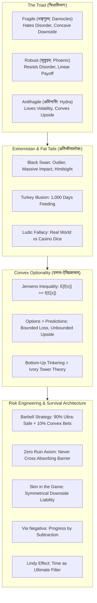

# अविनाशिता-पञ्चाशिका : कृष्णहंसशास्त्रम्
## *Avināśitā-Pañcāśikā: Kṛṣṇahaṃsa-Śāstram*
### A 50-Verse Classical Sanskrit Technical Treatise on Antifragility, Black Swan Theory, Convexity and Risk Engineering
#### Based on the Foundations of Nassim Nicholas Taleb

---

## उपोद्घातः (Architectural Introduction)

The world is not governed by peaceful Gaussian bell curves and predictable linear equations. As demonstrated by Nassim Nicholas Taleb across the *Incerto*, reality is non-linear, fat-tailed and dominated by catastrophic, rare Black Swan events. Modern technocratic civilization suffers from pervasive fragility: eliminating volatility, suppressing natural stressors and over-optimizing systems creates a facade of tranquility while building massive hidden systemic collapse.

To survive and thrive in Extremistan, systems must transcend the mere 'robust' and become **Antifragile** (अविनाशि / क्षोभवर्धिष्णु): possessing non-linear convex payoffs ($f''(x) > 0$) that benefit from volatility, disorder, randomness, stressors and time. By implementing the bimodal **Barbell Strategy** (दण्डगोलकव्यूहः), obeying the **Zero-Ruin Axiom** (विनाशवर्जनम्), enforcing ethical **Skin in the Game** (कर्मबन्धः), trusting the time-tested **Lindy Effect** (लिन्डीनियमः) and executing **Via Negativa** (अपाकरणयोगः), human agents convert volatility into limitless upside.

This treatise, **अविनाशिता-पञ्चाशिका : कृष्णहंसशास्त्रम्** (*Avināśitā-Pañcāśikā: Kṛṣṇahaṃsa-Śāstram*), formalizes the complete architecture of antifragility across 50 metrically pure Anuṣṭubh verses (अनुष्टुप् छन्दः, पथ्यावक्त्र नियम). Each verse is paired with complete Pāṇinian morphological analysis and deep domain-specific risk commentary.



---

## Canto 1: त्रिधास्वभावविवेकः
### *The Triad: Fragile, Robust and Antifragile*

#### Verse 1

```sanskrit
त्रिविधं वर्तते विश्वे सर्वं वस्तु स्वभावतः ।
भङ्गुरं सुदृढं वापि तृतीयमविनाशि यत् ॥
```

**पदच्छेदः:** त्रिविधम् वर्तते विश्वे सर्वम् वस्तु स्वभावतः । भङ्गुरम् सुदृढम् वा अपि तृतीयम् अविनाशि यत् ॥

**पाणिनीय-व्याकरण-सारणी:**

| पदम् | मूलप्रकृतिः / धातुः | पदविभागः | विभक्तिः / प्रत्ययः | व्याख्या / कारकार्थः |
| :--- | :--- | :--- | :--- | :--- |
| **त्रिविधम्** | `त्रिविध` | विशेषण | प्रथमा एकवचन नपुंसकलिंग | वस्तु इत्यस्य विशेषणम् (threefold / the Triad) |
| **वर्तते** | `√वृत् + लट्` | आत्मनेपद लट् | प्रथमपुरुष एकवचन | विद्यते (exists / manifests) |
| **विश्वे** | `विश्व` | नपुंसकलिंग नाम | सप्तमी एकवचन | जगती (in the cosmos) |
| **सर्वम्** | `सर्व` | सर्वनाम नपुंसकलिंग | प्रथमा एकवचन | समस्तम् (every) |
| **वस्तु** | `वस्तु` | नपुंसकलिंग नाम | प्रथमा एकवचन | सत्त्वम् (entity / system) |
| **स्वभावतः** | `स्वभाव + तसिँ` | अव्ययम् | अव्ययम् | नैसर्गिकेण (by inherent nature) |
| **भङ्गुरम्** | `भङ्गुर` | विशेषण नपुंसकलिंग | प्रथमा एकवचन | विनाशशीलम् (Fragile / Damoclean) |
| **सुदृढम्** | `सु + दृढ` | कर्मधारय नपुंसकलिंग | प्रथमा एकवचन | स्थिरम् (Robust / Phoenix) |
| **वा** | `वा` | अव्ययम् | अव्ययम् | विकल्पे (or) |
| **अपि** | `अपि` | अव्ययम् | अव्ययम् | सम्भवे (also) |
| **तृतीयम्** | `तृतीय` | पूरणप्रत्ययान्त नपुंसकलिंग | प्रथमा एकवचन | तृतीयप्रकारम् (the third category) |
| **अविनाशि** | `अ + विनाशिन्` | नञ्-तत्पुरुष नपुंसकलिंग | प्रथमा एकवचन | क्षोभवर्धिष्णु / ॲण्टिफ्रॅजाइल (Antifragile / Hydra) |
| **यत्** | `यद्` | सर्वनाम नपुंसकलिंग | प्रथमा एकवचन | यत्तत्त्वम् (which is) |

**जोखिमशास्त्र-भाष्यम् (Risk Engineering Commentary):** The Triad (त्रिधाविभागः): Nassim Nicholas Taleb classifies all phenomena, systems, policies and organisms into a fundamental Triad based on their response to disorder, volatility, randomness, stressors and time: (1) Fragile (Damocles), which hates volatility and shatters under stress; (2) Robust (Phoenix), which merely resists stress and remains unchanged; and (3) Antifragile (Hydra), which requires stressors, volatility and disorder to flourish, grow and strengthen.

---

#### Verse 2

```sanskrit
आघातेन भवेन्नाशो यस्य तत् खलु भङ्गुरम् ।
क्षोभं न सहते किञ्चित् पतनेन विशीर्यते ॥
```

**पदच्छेदः:** आघातेन भवेत् नाशः यस्य तत् खलु भङ्गुरम् । क्षोभम् न सहते किञ्चित् पतनेन विशीर्यते ॥

**पाणिनीय-व्याकरण-सारणी:**

| पदम् | मूलप्रकृतिः / धातुः | पदविभागः | विभक्तिः / प्रत्ययः | व्याख्या / कारकार्थः |
| :--- | :--- | :--- | :--- | :--- |
| **आघातेन** | `आघात` | पुंलिंग नाम | तृतीया एकवचन | प्रहारेण (by an acute shock or stressor) |
| **भवेत्** | `√भू + विधि-लिङ्` | परस्मैपद लिङ् | प्रथमपुरुष एकवचन | जायते (occurs) |
| **नाशः** | `नाश` | पुंलिंग नाम | प्रथमा एकवचन | विनाशः (catastrophic ruin) |
| **यस्य** | `यद्` | सर्वनाम नपुंसकलिंग | षष्ठी एकवचन | यस्य वस्तुनः (of which entity) |
| **तत्** | `तद्` | सर्वनाम नपुंसकलिंग | प्रथमा एकवचन | तत् सत्त्वम् (that entity) |
| **खलु** | `खलु` | अव्ययम् | अव्ययम् | निश्चये (indeed) |
| **भङ्गुरम्** | `भङ्गुर` | विशेषण नपुंसकलिंग | प्रथमा एकवचन | सुभेद्यम् (Fragile) |
| **क्षोभम्** | `क्षोभ` | पुंलिंग नाम | द्वितीया एकवचन | अस्थिरताम् (volatility and perturbation) |
| **न** | `न` | अव्ययम् | अव्ययम् | प्रतिषेधे (not) |
| **सहते** | `√सह् + लट्` | आत्मनेपद लट् | प्रथमपुरुष एकवचन | क्षाम्यति (tolerates) |
| **किञ्चित्** | `किञ्चित्` | अव्ययम् | अव्ययम् | ईषदपि (even slightly) |
| **पतनेन** | `पतन` | नपुंसकलिंग नाम | तृतीया एकवचन | प्रपातेन (by a fall or turbulence) |
| **विशीर्यते** | `वि + √शॄ + कर्मणि लट्` | कर्मणि लट् | प्रथमपुरुष एकवचन | खण्डशो भवति (shatters to pieces) |

**जोखिमशास्त्र-भाष्यम् (Risk Engineering Commentary):** The Fragile (भङ्गुरम्): Like a delicate porcelain teacup or a highly leveraged bank, the fragile loves tranquility, predictability and calm. Because it possesses non-linear, concave vulnerability to shocks, any sudden tail event, market panic, or mechanical impact causes catastrophic disintegration. The fragile cannot survive historical volatility.

---

#### Verse 3

```sanskrit
क्षोभेऽपि निश्चलं तिष्ठेद् विकारं नैव गच्छति ।
सुदृढं तद् बुधैः प्रोक्तं शिलावदचलं हि यत् ॥
```

**पदच्छेदः:** क्षोभे अपि निश्चलम् तिष्ठेत् विकारम् न एव गच्छति । सुदृढम् तत् बुधैः प्रोक्तम् शिलावत् अचलम् हि यत् ॥

**पाणिनीय-व्याकरण-सारणी:**

| पदम् | मूलप्रकृतिः / धातुः | पदविभागः | विभक्तिः / प्रत्ययः | व्याख्या / कारकार्थः |
| :--- | :--- | :--- | :--- | :--- |
| **क्षोभे** | `क्षोभ` | पुंलिंग नाम | सप्तमी एकवचन | सति-सप्तमी : अस्थिरतायाम् (in volatile disturbance) |
| **अपि** | `अपि` | अव्ययम् | अव्ययम् | सम्भवे (even) |
| **निश्चलम्** | `निस् + चल` | बहुव्रीहि नपुंसकलिंग | प्रथमा एकवचन | स्थिरम् (unmoved / inert) |
| **तिष्ठेत्** | `√स्था + विधि-लिङ्` | परस्मैपद लिङ् | प्रथमपुरुष एकवचन | वर्तेत (remains) |
| **विकारम्** | `विकार` | पुंलिंग नाम | द्वितीया एकवचन | रूपान्तरम् (structural alteration) |
| **न** | `न` | अव्ययम् | अव्ययम् | प्रतिषेधे (not) |
| **एव** | `एव` | अव्ययम् | अव्ययम् | अवधारणे (indeed) |
| **गच्छति** | `√गम् + लट्` | परस्मैपद लट् | प्रथमपुरुष एकवचन | याति (undergoes) |
| **सुदृढम्** | `सु + दृढ` | कर्मधारय नपुंसकलिंग | प्रथमा एकवचन | रोबस्ट (Robust / Resilient) |
| **तत्** | `तद्` | सर्वनाम नपुंसकलिंग | प्रथमा एकवचन | तद्वस्तु (that system) |
| **बुधैः** | `बुध` | पुंलिंग नाम | तृतीया बहुवचन | विद्वद्भिः (by wise philosophers) |
| **प्रोक्तम्** | `प्र + √वच् + क्त` | कृदन्तरूप नपुंसकलिंग | प्रथमा एकवचन | कथितम् (is designated) |
| **शिलावत्** | `शिला + वतिँ` | अव्ययम् | अव्ययम् | पाषाणवत् (like a solid granite boulder) |
| **अचलम्** | `अ + चल` | नञ्-तत्पुरुष नपुंसकलिंग | प्रथमा एकवचन | अविकम्पितम् (unshakable) |
| **हि** | `हि` | अव्ययम् | अव्ययम् | प्रसिद्धौ (verily) |
| **यत्** | `यद्` | सर्वनाम नपुंसकलिंग | प्रथमा एकवचन | यत् सत्त्वम् (whatever) |

**जोखिमशास्त्र-भाष्यम् (Risk Engineering Commentary):** The Robust (सुदृढम्): The robust neither benefits from disorder nor suffers from it. Like a solid granite rock or the mythological Phoenix rising identically from its ashes, it merely absorbs shocks and returns to its prior equilibrium. However, the robust is still limited: it possesses no evolutionary mechanism to convert stress into superior fitness.

---

#### Verse 4

```sanskrit
आघातेन तु यद् वृद्धिं प्राप्नोत्येव विशेषतः ।
अविनाशि च तज् ज्ञेयं क्षोभेणैव विवर्धते ॥
```

**पदच्छेदः:** आघातेन तु यत् वृद्धिम् प्राप्नोति एव विशेषतः । अविनाशि च तत् ज्ञेयम् क्षोभेण एव विवर्धते ॥

**पाणिनीय-व्याकरण-सारणी:**

| पदम् | मूलप्रकृतिः / धातुः | पदविभागः | विभक्तिः / प्रत्ययः | व्याख्या / कारकार्थः |
| :--- | :--- | :--- | :--- | :--- |
| **आघातेन** | `आघात` | पुंलिंग नाम | तृतीया एकवचन | प्रहारेण (through impact and acute trauma) |
| **तु** | `तु` | अव्ययम् | अव्ययम् | विरोधाभासे (in contrast) |
| **यत्** | `यद्` | सर्वनाम नपुंसकलिंग | प्रथमा एकवचन | यत्तत्त्वम् (that which) |
| **वृद्धिम्** | `वृद्धि` | स्त्रीलिंग नाम | द्वितीया एकवचन | विकासम् (enhanced strength and fitness) |
| **प्राप्नोति** | `प्र + √आप् + लट्` | परस्मैपद लट् | प्रथमपुरुष एकवचन | लभते (achieves) |
| **एव** | `एव` | अव्ययम् | अव्ययम् | अवधारणे (indeed) |
| **विशेषतः** | `विशेष + तसिँ` | अव्ययम् | अव्ययम् | अतिशयेन (extraordinarily) |
| **अविनाशि** | `अ + विनाशिन्` | नञ्-तत्पुरुष नपुंसकलिंग | प्रथमा एकवचन | ॲण्टिफ्रॅजाइल (Antifragile) |
| **च** | `च` | अव्ययम् | अव्ययम् | समुच्चये (and) |
| **तत्** | `तद्` | सर्वनाम नपुंसकलिंग | प्रथमा एकवचन | तत् सत्त्वम् (that system) |
| **ज्ञेयम्** | `√ज्ञा + यत्` | कृदन्तरूप नपुंसकलिंग | प्रथमा एकवचन | अवगन्तव्यम् (should be understood) |
| **क्षोभेण** | `क्षोभ` | पुंलिंग नाम | तृतीया एकवचन | अस्थिरताप्रवाहेण (by disorder and volatility) |
| **एव** | `एव` | अव्ययम् | अव्ययम् | निश्चये (alone) |
| **विवर्धते** | `वि + √वृध् + लट्` | आत्मनेपद लट् | प्रथमपुरुष एकवचन | पुष्टिं गच्छति (thrives and expands) |

**जोखिमशास्त्र-भाष्यम् (Risk Engineering Commentary):** The Antifragile (अविनाशि / क्षोभवर्धिष्णु): The antifragile is beyond the robust. It loves randomness, uncertainty, mistakes, stressors and time. Like the mythical Hydra, where cutting off one head causes two to grow back, antifragile systems utilize acute perturbations to reorganize into higher states of resilience. They possess positive asymmetric exposure to volatility.

---

#### Verse 5

```sanskrit
सजीवानां शरीरेषु क्षोभोद्भवं बलं महत् ।
अल्पक्लेशे कृते नित्यं प्राणशक्तिः प्रवर्धते ॥
```

**पदच्छेदः:** सजीवानाम् शरीरेषु क्षोभ-उद्भवम् बलम् महत् । अल्प-क्लेशे कृते नित्यम् प्राण-शक्तिः प्रवर्धते ॥

**पाणिनीय-व्याकरण-सारणी:**

| पदम् | मूलप्रकृतिः / धातुः | पदविभागः | विभक्तिः / प्रत्ययः | व्याख्या / कारकार्थः |
| :--- | :--- | :--- | :--- | :--- |
| **सजीवानाम्** | `सजीव` | पुंलिंग नाम | षष्ठी बहुवचन | प्राणिनाम् (of living organisms) |
| **शरीरेषु** | `शरीर` | नपुंसकलिंग नाम | सप्तमी बहुवचन | गात्रेषु (in biological bodies) |
| **क्षोभोद्भवम्** | `क्षोभ + उद्भव` | उपपद-तत्पुरुष नपुंसकलिंग | प्रथमा एकवचन | सङ्घर्षजनितम् (born of volatility and acute stress) |
| **बलम्** | `बल` | नपुंसकलिंग नाम | प्रथमा एकवचन | सामर्थ्यम् (adaptive vigor) |
| **महत्** | `महत्` | विशेषण नपुंसकलिंग | प्रथमा एकवचन | विपुलम् (profound) |
| **अल्पक्लेशे** | `अल्प + क्लेश` | कर्मधारय पुंलिंग | सप्तमी एकवचन | सति-सप्तमी : मन्दकष्टे (in moderate, acute stressor exposure) |
| **कृते** | `√कृ + क्त` | कृदन्तरूप पुंलिंग | सप्तमी एकवचन | सति-सप्तमी : अनुभूते सति (upon being applied) |
| **नित्यम्** | `नित्यम्` | अव्ययम् | अव्ययम् | सदा (continuously) |
| **प्राणशक्तिः** | `प्राण + शक्ति` | षष्ठी-तत्पुरुष स्त्रीलिंग | प्रथमा एकवचन | जैविकऊर्जा (vital metabolic force) |
| **प्रवर्धते** | `प्र + √वृध् + लट्` | आत्मनेपद लट् | प्रथमपुरुष एकवचन | विकसति (strengthens) |

**जोखिमशास्त्र-भाष्यम् (Risk Engineering Commentary):** Organic Systems Require Stressors: Unlike inert machines that wear out with repetitive mechanical use, biological organisms require acute, intermittent stressors to maintain structural integrity. Bones require heavy gravitational loading to avoid osteopenia; muscles require tear down to hypertrophy; immune systems require pathogen exposure to calibrate. Depriving living systems of stressors makes them profoundly fragile.

---

## Canto 2: कृष्णहंसविवेकः अतिसीमाशास्त्रञ्च
### *Black Swan Theory and Extremistan vs Mediocristan*

#### Verse 6

```sanskrit
दुर्लभा दृश्यते या तु प्रचण्डफलशालिनी ।
पश्चाद्बुद्ध्या समर्थ्या च कृष्णहंसः स उच्यते ॥
```

**पदच्छेदः:** दुर्लभा दृश्यते या तु प्रचण्ड-फल-शालिनी । पश्चात्-बुद्ध्या समर्थ्या च कृष्ण-हंसः सः उच्यते ॥

**पाणिनीय-व्याकरण-सारणी:**

| पदम् | मूलप्रकृतिः / धातुः | पदविभागः | विभक्तिः / प्रत्ययः | व्याख्या / कारकार्थः |
| :--- | :--- | :--- | :--- | :--- |
| **दुर्लभा** | `दुर्लभ` | विशेषण स्त्रीलिंग | प्रथमा एकवचन | अतिविरला (statistically rare / outlier) |
| **दृश्यते** | `√दृश् + कर्मणि लट्` | कर्मणि लट् | प्रथमपुरुष एकवचन | घटते (occurs) |
| **या** | `यद्` | सर्वनाम स्त्रीलिंग | प्रथमा एकवचन | या घटना (which event) |
| **तु** | `तु` | अव्ययम् | अव्ययम् | अवधारणे (indeed) |
| **प्रचण्डफलशालिनी** | `प्रचण्ड + फल + शालिन् + ङीप्` | उपपद-तत्पुरुष स्त्रीलिंग | प्रथमा एकवचन | महाप्रभावयुक्ता (carrying catastrophic or massive impact) |
| **पश्चाद्बुद्ध्या** | `पश्चात् + बुद्धि` | षष्ठी-तत्पुरुष स्त्रीलिंग | तृतीया एकवचन | भूतलक्षी-तर्केण (through retrospective rationalization) |
| **समर्थ्या** | `सम् + √अर्थ् + ण्यत्` | कृदन्तरूप स्त्रीलिंग | प्रथमा एकवचन | पूर्वानुमेयवद् भासिता (made to look explainable and predictable) |
| **च** | `च` | अव्ययम् | अव्ययम् | समुच्चये (and) |
| **कृष्णहंसः** | `कृष्ण + हंस` | कर्मधारय पुंलिंग | प्रथमा एकवचन | ब्लॅक-स्वान् (the Black Swan) |
| **सः** | `तद्` | सर्वनाम पुंलिंग | प्रथमा एकवचन | स दृष्टान्तः (that phenomenon) |
| **उच्यते** | `√वच् + कर्मणि लट्` | कर्मणि लट् | प्रथमपुरुष एकवचन | कथ्यते (is named) |

**जोखिमशास्त्र-भाष्यम् (Risk Engineering Commentary):** The Black Swan Triplet: A Black Swan event is defined by three strict criteria: (1) It is an outlier lying outside the realm of regular expectations because nothing in the past convincingly pointed to its possibility; (2) It carries an extreme, massive historical impact; and (3) Human nature concocts explanations for its occurrence after the fact, making it appear explainable and predictable in hindsight.

---

#### Verse 7

```sanskrit
मध्यमे वर्तते लोके सांख्यिकी नियता स्थितिः ।
घटनैका न शक्नोति हर्तुं योगं समग्रतः ॥
```

**पदच्छेदः:** मध्यमे वर्तते लोके सांख्यिकी नियता स्थितिः । घटना एका न शक्नोति हर्तुम् योगम् समग्रतः ॥

**पाणिनीय-व्याकरण-सारणी:**

| पदम् | मूलप्रकृतिः / धातुः | पदविभागः | विभक्तिः / प्रत्ययः | व्याख्या / कारकार्थः |
| :--- | :--- | :--- | :--- | :--- |
| **मध्यमे** | `मध्यम` | विशेषण पुंलिंग | सप्तमी एकवचन | सामान्ये (in Mediocristan) |
| **वर्तते** | `√वृत् + लट्` | आत्मनेपद लट् | प्रथमपुरुष एकवचन | विद्यते (exists) |
| **लोके** | `लोक` | पुंलिंग नाम | सप्तमी एकवचन | संसारे (in the domain) |
| **सांख्यिकी** | `सांख्यिकी` | स्त्रीलिंग नाम | प्रथमा एकवचन | गौसियन्-वितरणम् (Gaussian bell-curve statistics) |
| **नियता** | `नि + √यम् + क्त` | कृदन्तरूप स्त्रीलिंग | प्रथमा एकवचन | सुबद्ध-मर्यादा (strictly bounded) |
| **स्थितिः** | `स्थिति` | स्त्रीलिंग नाम | प्रथमा एकवचन | दशा (variance state) |
| **घटना** | `घटना` | स्त्रीलिंग नाम | प्रथमा एकवचन | एकल-परीक्षणम् (a single sample observation) |
| **एका** | `एक` | संख्यावाचक स्त्रीलिंग | प्रथमा एकवचन | केवला (single) |
| **न** | `न` | अव्ययम् | अव्ययम् | प्रतिषेधे (not) |
| **शक्नोति** | `√शक् + लट्` | परस्मैपद लट् | प्रथमपुरुष एकवचन | प्रभवति (is able) |
| **हर्तुम्** | `√हृ + तुमुन्` | कृदन्तरूप अव्यय | अव्ययम् | चालयितुम् (to dominate or distort) |
| **योगम्** | `योग` | पुंलिंग नाम | द्वितीया एकवचन | समग्रराशिम् (the aggregate total sum) |
| **समग्रतः** | `समग्र + तसिँ` | अव्ययम् | अव्ययम् | सर्वथैव (completely) |

**जोखिमशास्त्र-भाष्यम् (Risk Engineering Commentary):** Mediocristan (मध्यमलोकः): In Mediocristan, physical phenomena: human height, weight, calorie consumption, driving speed: are governed by thin-tailed Gaussian distributions. When your sample is large, no single individual observation can materially alter the aggregate total. Even if you gathered the heaviest human on Earth into a stadium of 50,000 people, their weight would barely register in the total sum.

---

#### Verse 8

```sanskrit
अतिसीम्नि तु लोकेऽस्मिन् विषमा वर्तते मतिः ।
एकेन च विपाकेन विनश्यति समस्तकम् ॥
```

**पदच्छेदः:** अतिसीम्नि तु लोके अस्मिन् विषमा वर्तते मतिः । एकेन च विपाकेन विनश्यति समस्तकम् ॥

**पाणिनीय-व्याकरण-सारणी:**

| पदम् | मूलप्रकृतिः / धातुः | पदविभागः | विभक्तिः / प्रत्ययः | व्याख्या / कारकार्थः |
| :--- | :--- | :--- | :--- | :--- |
| **अतिसीम्नि** | `अति + सीमन्` | कर्मधारय पुंलिंग | सप्तमी एकवचन | एक्सट्रीमिस्तान्-क्षेत्रे (in Extremistan / Fat-Tailed domains) |
| **तु** | `तु` | अव्ययम् | अव्ययम् | विशेषे (however) |
| **लोके** | `लोक` | पुंलिंग नाम | सप्तमी एकवचन | प्रपञ्चे (in the realm) |
| **अस्मिन्** | `इदम्` | सर्वनाम पुंलिंग | सप्तमी एकवचन | अस्मिन् स्थाने (in this) |
| **विषमा** | `विषम` | विशेषण स्त्रीलिंग | प्रथमा एकवचन | पावर-लॉ स्वरूपा (scale-free and heavily skewed) |
| **वर्तते** | `√वृत् + लट्` | आत्मनेपद लट् | प्रथमपुरुष एकवचन | भवति (is) |
| **मतिः** | `मति` | स्त्रीलिंग नाम | प्रथमा एकवचन | सांख्यिकीयप्रकृतिः (statistical distribution dynamic) |
| **एकेन** | `एक` | संख्यावाचक पुंलिंग | तृतीया एकवचन | एकलेन (by a single) |
| **च** | `च` | अव्ययम् | अव्ययम् | समुच्चये (and) |
| **विपाकेन** | `विपाक` | पुंलिंग नाम | तृतीया एकवचन | चरमपरिणामेन (by a single catastrophic tail shock) |
| **विनश्यति** | `वि + √नश् + लट्` | परस्मैपद लट् | प्रथमपुरुष एकवचन | भ्रंशं गच्छति (is wiped out completely) |
| **समस्तकम्** | `समस्त + कन्` | नपुंसकलिंग नाम | प्रथमा एकवचन | सर्वं सञ्चितम् (the entire cumulative total) |

**जोखिमशास्त्र-भाष्यम् (Risk Engineering Commentary):** Extremistan (अतिसीमालोकः): In Extremistan: financial wealth, book sales, market returns, pandemic casualties, warfare and internet traffic: quantities are governed by scale-free power laws and fat tails. A single observation: such as adding Elon Musk to a stadium crowd, or the 2008 Lehman collapse: completely dominates and overwhelms the historical sum of everything before it.

---

#### Verse 9

```sanskrit
सहस्रदिवसैः पुष्टः कुक्कुटो मन्यते सुखम् ।
एकस्मिन्नेव दिवसे नाशस्तस्योपपद्यते ॥
```

**पदच्छेदः:** सहस्र-दिवसैः पुष्टः कुक्कुटः मन्यते सुखम् । एकस्मिन् एव दिवसे नाशः तस्य उपपद्यते ॥

**पाणिनीय-व्याकरण-सारणी:**

| पदम् | मूलप्रकृतिः / धातुः | पदविभागः | विभक्तिः / प्रत्ययः | व्याख्या / कारकार्थः |
| :--- | :--- | :--- | :--- | :--- |
| **सहस्रदिवसैः** | `सहस्र + दिवस` | द्विगु पुंलिंग | तृतीया बहुवचन | सहस्रदिनेषु (over 1,000 successive days) |
| **पुष्टः** | `√पुष् + क्त` | कृदन्तरूप पुंलिंग | प्रथमा एकवचन | भोजनेन पालितः (fed and fattened by the butcher) |
| **कुक्कुटः** | `कुक्कुट` | पुंलिंग नाम | प्रथमा एकवचन | टर्की-पक्षी (the Thanksgiving turkey) |
| **मन्यते** | `√मन् + लट्` | आत्मनेपद लट् | प्रथमपुरुष एकवचन | कल्पयति (believes) |
| **सुखम्** | `सुख` | नपुंसकलिंग नाम | द्वितीया एकवचन | सुरक्षितताम् (absolute safety and benevolent love) |
| **एकस्मिन्** | `एक` | संख्यावाचक पुंलिंग | सप्तमी एकवचन | तस्मिन् (on a single) |
| **एव** | `एव` | अव्ययम् | अव्ययम् | अवधारणे (precise) |
| **दिवसे** | `दिवस` | पुंलिंग नाम | सप्तमी एकवचन | दिने (day / Thanksgiving) |
| **नाशः** | `नाश` | पुंलिंग नाम | प्रथमा एकवचन | वधः (slaughter) |
| **तस्य** | `तद्` | सर्वनाम पुंलिंग | षष्ठी एकवचन | पक्षिणः (of that bird) |
| **उपपद्यते** | `उप + √पद् + लट्` | आत्मनेपद लट् | प्रथमपुरुष एकवचन | घटते (befalls) |

**जोखिमशास्त्र-भाष्यम् (Risk Engineering Commentary):** The Problem of Induction (The Turkey Problem): For 1,000 consecutive days, the butcher feeds the turkey every morning. With every passing meal, the turkey's statistical regression models confirm with higher confidence that the butcher genuinely loves him. On day 1,001 (Thanksgiving), the butcher slaughters the turkey. What was the quietest, safest period of his life was actually the moment of maximum hidden fragility.

---

#### Verse 10

```sanskrit
अदृष्टस्य हि सद्भावं नैव पश्यन्ति मोहिताः ।
अभावमेव मन्यन्ते प्रमाणं भ्रान्तचेतसः ॥
```

**पदच्छेदः:** अदृष्टस्य हि सद्भावम् न एव पश्यन्ति मोहिताः । अभावम् एव मन्यन्ते प्रमाणम् भ्रान्त-चेतसः ॥

**पाणिनीय-व्याकरण-सारणी:**

| पदम् | मूलप्रकृतिः / धातुः | पदविभागः | विभक्तिः / प्रत्ययः | व्याख्या / कारकार्थः |
| :--- | :--- | :--- | :--- | :--- |
| **अदृष्टस्य** | `अ + दृष्ट` | नञ्-तत्पुरुष नपुंसकलिंग | षष्ठी एकवचन | अज्ञाताप्रकटितस्य (of unobserved latent risk) |
| **हि** | `हि` | अव्ययम् | अव्ययम् | प्रसिद्धौ (indeed) |
| **सद्भावम्** | `सद्भाव` | पुंलिंग नाम | द्वितीया एकवचन | सम्भावनाम् (actual existence / possibility) |
| **न** | `न` | अव्ययम् | अव्ययम् | प्रतिषेधे (not) |
| **एव** | `एव` | अव्ययम् | अव्ययम् | अवधारणे (indeed) |
| **पश्यन्ति** | `√दृश् + लट्` | परस्मैपद लट् | प्रथमपुरुष बहुवचन | अवलोकयन्ति (they do not perceive) |
| **मोहिताः** | `√मुह् + णिच् + क्त` | कृदन्तरूप पुंलिंग | प्रथमा बहुवचन | अविवेकशीलाः (deluded analysts) |
| **अभावम्** | `अभाव` | पुंलिंग नाम | द्वितीया एकवचन | अनुपलब्धिम् (absence of evidence) |
| **एव** | `एव` | अव्ययम् | अव्ययम् | अवधारणे (merely) |
| **मन्यन्ते** | `√मन् + लट्` | आत्मनेपद लट् | प्रथमपुरुष बहुवचन | स्वीकुर्वन्ति (they mistake for) |
| **प्रमाणम्** | `प्रमाण` | नपुंसकलिंग नाम | द्वितीया एकवचन | अभावस्य प्रमाणम् (evidence of absence) |
| **भ्रान्तचेतसः** | `भ्रान्त + चेतस्` | बहुव्रीहि पुंलिंग | प्रथमा बहुवचन | विमूढधियः (those with corrupted reasoning) |

**जोखिमशास्त्र-भाष्यम् (Risk Engineering Commentary):** Absence of Evidence vs Evidence of Absence: Naive empirical risk models commit the fatal epistemic error of treating 'absence of evidence of catastrophe' as 'evidence of absence of catastrophe'. If a bridge has not collapsed in 50 years, or a bank has not blown up in a decade, technocrats assume risk is zero, confusing tranquility with structural safety.

---

## Canto 3: उत्तलताविधिः ऐच्छिकतारहस्यञ्च
### *Jensen's Inequality, Convexity and Asymmetric Optionality*

#### Verse 11

```sanskrit
उत्तलत्वे स्थिते मार्गे लाभाय क्षोभसङ्गतिः ।
अरेखीयप्रभावेन गतिर्भवति चोत्तमा ॥
```

**पदच्छेदः:** उत्तलत्वे स्थिते मार्गे लाभाय क्षोभ-सङ्गतिः । अरेखीय-प्रभावेन गतिः भवति च उत्तमा ॥

**पाणिनीय-व्याकरण-सारणी:**

| पदम् | मूलप्रकृतिः / धातुः | पदविभागः | विभक्तिः / प्रत्ययः | व्याख्या / कारकार्थः |
| :--- | :--- | :--- | :--- | :--- |
| **उत्तलत्वे** | `उत्तलत्व` | नपुंसकलिंग भाववाचक | सप्तमी एकवचन | सति-सप्तमी : कॉन्वेक्सिटी-गुणे (in mathematical convexity) |
| **स्थिते** | `√स्था + क्त` | कृदन्तरूप नपुंसकलिंग | सप्तमी एकवचन | सति-सप्तमी : विद्यमाने सति (when present) |
| **मार्गे** | `मार्ग` | पुंलिंग नाम | सप्तमी एकवचन | कार्यप्रणाल्याम् (in a system trajectory) |
| **लाभाय** | `लाभ` | पुंलिंग नाम | चतुर्थी एकवचन | तादर्थ्ये चतुर्थी : विकासाय (for asymmetric gain) |
| **क्षोभसङ्गतिः** | `क्षोभ + सङ्गति` | षष्ठी-तत्पुरुष स्त्रीलिंग | प्रथमा एकवचन | अस्थिरतासम्पर्कः (exposure to volatility and disorder) |
| **अरेखीयप्रभावेन** | `अरेखीय + प्रभाव` | कर्मधारय पुंलिंग | तृतीया एकवचन | जेन्सेन्-असमानतया (by Jensens inequality non-linearity) |
| **गतिः** | `गति` | स्त्रीलिंग नाम | प्रथमा एकवचन | प्रगतिः (evolutionary acceleration) |
| **भवति** | `√भू + लट्` | परस्मैपद लट् | प्रथमपुरुष एकवचन | जायते (becomes) |
| **च** | `च` | अव्ययम् | अव्ययम् | समुच्चये (and) |
| **उत्तमा** | `उत्तम` | विशेषण स्त्रीलिंग | प्रथमा एकवचन | श्रेष्ठा (superior) |

**जोखिमशास्त्र-भाष्यम् (Risk Engineering Commentary):** Jensens Inequality and Mathematical Convexity: If a function f(x) is convex (f''(x) > 0), the expected value of the function of a random variable is greater than or equal to the function of its expected value: E[f(x)] >= f(E[x]). This mathematical law guarantees that any system with convex payoffs naturally benefits from increasing dispersion, variance and volatility.

---

#### Verse 12

```sanskrit
हानिरल्पा भवेद् यत्र लाभस्तु विपुलस्तथा ।
उत्तलं तद् विजानीयाद् वृद्धिरुन्मीलते भृशम् ॥
```

**पदच्छेदः:** हानिः अल्पा भवेत् यत्र लाभः तु विपुलः तथा । उत्तलम् तत् विजानीयात् वृद्धिः उन्मीलते भृशम् ॥

**पाणिनीय-व्याकरण-सारणी:**

| पदम् | मूलप्रकृतिः / धातुः | पदविभागः | विभक्तिः / प्रत्ययः | व्याख्या / कारकार्थः |
| :--- | :--- | :--- | :--- | :--- |
| **हानिः** | `हानि` | स्त्रीलिंग नाम | प्रथमा एकवचन | अधोमुखी सीमा / डाउनसाइड् (bounded downside risk) |
| **अल्पा** | `अल्प` | विशेषण स्त्रीलिंग | प्रथमा एकवचन | परिमितमात्रा (strictly finite and small) |
| **भवेत्** | `√भू + विधि-लिङ्` | परस्मैपद लिङ् | प्रथमपुरुष एकवचन | स्यात् (might be) |
| **यत्र** | `यत्र` | अव्ययम् | अव्ययम् | यस्मिन् सन्दर्भे (wherever) |
| **लाभः** | `लाभ` | पुंलिंग नाम | प्रथमा एकवचन | ऊर्ध्वमुखी सम्भावना / अपसाइड् (unbounded upside potential) |
| **तु** | `तु` | अव्ययम् | अव्ययम् | विशेषे (however) |
| **विपुलः** | `विपुल` | विशेषण पुंलिंग | प्रथमा एकवचन | अनन्तप्रायः (massive / open-ended) |
| **तथा** | `तथा` | अव्ययम् | अव्ययम् | तथैव (likewise) |
| **उत्तलम्** | `उत्तल` | विशेषण नपुंसकलिंग | द्वितीया एकवचन | कॉन्वेक्स (Convex Asymmetry) |
| **तत्** | `तद्` | सर्वनाम नपुंसकलिंग | द्वितीया एकवचन | तत् स्वरूपम् (that structure) |
| **विजानीयात्** | `वि + √ज्ञा + विधि-लिङ्` | परस्मैपद लिङ् | प्रथमपुरुष एकवचन | बोधेत् (one should recognize) |
| **वृद्धिः** | `वृद्धि` | स्त्रीलिंग नाम | प्रथमा एकवचन | पुष्टिः (compounding growth) |
| **उन्मीलते** | `उद् + √मील् + लट्` | आत्मनेपद लट् | प्रथमपुरुष एकवचन | प्रकटिता भवति (blossoms) |
| **भृशम्** | `भृशम्` | अव्ययम् | अव्ययम् | अत्यर्थम् (abundantly) |

**जोखिमशास्त्र-भाष्यम् (Risk Engineering Commentary):** The Definition of Antifragility as Convexity: Antifragility is fundamentally structural asymmetry: you have more upside than downside. When an entity risks only a fixed, small loss but retains exposure to limitless upside, randomness and errors work in its favor. Trial-and-error discovery, venture investing, scientific research and biological mutations are all convex options.

---

#### Verse 13

```sanskrit
हानिस्तीव्रा भवेद् यत्र लाभोऽल्पः संप्रतीयते ।
अवताले तु सा वृत्तिर्विनाशायोपपद्यते ॥
```

**पदच्छेदः:** हानिः तीव्रा भवेत् यत्र लाभः अल्पः संप्रतीयते । अवताले तु सा वृत्तिः विनाशाय उपपद्यते ॥

**पाणिनीय-व्याकरण-सारणी:**

| पदम् | मूलप्रकृतिः / धातुः | पदविभागः | विभक्तिः / प्रत्ययः | व्याख्या / कारकार्थः |
| :--- | :--- | :--- | :--- | :--- |
| **हानिः** | `हानि` | स्त्रीलिंग नाम | प्रथमा एकवचन | महाविनाशः (unbounded catastrophic downside) |
| **तीव्रा** | `तीव्र` | विशेषण स्त्रीलिंग | प्रथमा एकवचन | सर्वनाशिनी (existential) |
| **भवेत्** | `√भू + विधि-लिङ्` | परस्मैपद लिङ् | प्रथमपुरुष एकवचन | स्यात् (occurs) |
| **यत्र** | `यत्र` | अव्ययम् | अव्ययम् | यस्मिन् मार्गे (wherever) |
| **लाभः** | `लाभ` | पुंलिंग नाम | प्रथमा एकवचन | प्राप्तिः (capped upside profit) |
| **अल्पः** | `अल्प` | विशेषण पुंलिंग | प्रथमा एकवचन | क्षुद्रः (tiny and bounded) |
| **संप्रतीयते** | `सम् + प्र + √इ + कर्मणि लट्` | कर्मणि लट् | प्रथमपुरुष एकवचन | दृश्यते (is seen) |
| **अवताले** | `अवताल` | पुंलिंग नाम | सप्तमी एकवचन | सति-सप्तमी : कॉनकेव्-स्वरूपे (in concave exposure) |
| **तु** | `तु` | अव्ययम् | अव्ययम् | विरोधाभासे (in contrast) |
| **सा** | `तद्` | सर्वनाम स्त्रीलिंग | प्रथमा एकवचन | सा दशा (that condition) |
| **वृत्तिः** | `वृत्ति` | स्त्रीलिंग नाम | प्रथमा एकवचन | स्वभावः (fragile posture) |
| **विनाशाय** | `विनाश` | पुंलिंग नाम | चतुर्थी एकवचन | तादर्थ्ये चतुर्थी : संहाराय (for catastrophic blowup) |
| **उपपद्यते** | `उप + √पद् + लट्` | आत्मनेपद लट् | प्रथमपुरुष एकवचन | कल्पते (leads to) |

**जोखिमशास्त्र-भाष्यम् (Risk Engineering Commentary):** Concavity and Fragility (अवतालता): The exact inverse of convexity is concavity (f''(x) < 0): you have bounded upside but catastrophic, open-ended downside. Selling out-of-the-money insurance or picking up nickels in front of a steamroller generates steady tiny gains during quiet times, but inevitable, total liquidation when a tail shock arrives.

---

#### Verse 14

```sanskrit
ऐच्छिकत्वे स्थिते पुंसां नैव भावि समीक्ष्यते ।
असमत्वेन लाभस्य विजयः संप्रजायते ॥
```

**पदच्छेदः:** ऐच्छिकत्वे स्थिते पुंसाम् न एव भावि समीक्ष्यते । असमत्वेन लाभस्य विजयः संप्रजायते ॥

**पाणिनीय-व्याकरण-सारणी:**

| पदम् | मूलप्रकृतिः / धातुः | पदविभागः | विभक्तिः / प्रत्ययः | व्याख्या / कारकार्थः |
| :--- | :--- | :--- | :--- | :--- |
| **ऐच्छिकत्वे** | `ऐच्छिकत्व` | नपुंसकलिंग भाववाचक | सप्तमी एकवचन | सति-सप्तमी : ऑप्शनालिटी-गुणे (in possession of an option) |
| **स्थिते** | `√स्था + क्त` | कृदन्तरूप नपुंसकलिंग | सप्तमी एकवचन | सति-सप्तमी : विद्यमाने सति (when present) |
| **पुंसाम्** | `पुंस्` | पुंलिंग नाम | षष्ठी बहुवचन | मानवानाम् (of decision-makers) |
| **न** | `न` | अव्ययम् | अव्ययम् | प्रतिषेधे (not) |
| **एव** | `एव` | अव्ययम् | अव्ययम् | अवधारणे (at all) |
| **भावि** | `भाविन्` | विशेषण नपुंसकलिंग | प्रथमा एकवचन | भविष्यत्-फलम् (future forecast) |
| **समीक्ष्यते** | `सम् + ईक्ष् + कर्मणि लट्` | कर्मणि लट् | प्रथमपुरुष एकवचन | अपेक्षितं भवति (needs to be accurately forecasted) |
| **असमत्वेन** | `असमत्व` | नपुंसकलिंग नाम | तृतीया एकवचन | उत्तल-असममित्या (by asymmetric optionality) |
| **लाभस्य** | `लाभ` | पुंलिंग नाम | षष्ठी एकवचन | प्राप्तेः (of payoff) |
| **विजयः** | `विजय` | पुंलिंग नाम | प्रथमा एकवचन | सफलता (triumph) |
| **संप्रजायते** | `सम् + प्र + √जन् + लट्` | आत्मनेपद लट् | प्रथमपुरुष एकवचन | उद्भवति (arises) |

**जोखिमशास्त्र-भाष्यम् (Risk Engineering Commentary):** Optionality versus Intelligence (The Thalesian Principle): If you possess options (the right, but not the obligation, to act), you do not need to be right about the future. An option transforms errors and volatility into free upside: when reality is favorable, you exercise the option; when unfavorable, you walk away with minimal loss. You substitute prediction with convex optionality.

---

#### Verse 15

```sanskrit
सिद्धान्तस्य विना ज्ञानं प्रयोगाद् दृश्यते फलम् ।
त्रुटिभिः संशयं छित्त्वा बुद्धिमान् प्रविराजते ॥
```

**पदच्छेदः:** सिद्धान्तस्य विना ज्ञानम् प्रयोगात् दृश्यते फलम् । त्रुटिभिः संशयम् छित्त्वा बुद्धिमान् प्रविराजते ॥

**पाणिनीय-व्याकरण-सारणी:**

| पदम् | मूलप्रकृतिः / धातुः | पदविभागः | विभक्तिः / प्रत्ययः | व्याख्या / कारकार्थः |
| :--- | :--- | :--- | :--- | :--- |
| **सिद्धान्तस्य** | `सिद्धान्त` | पुंलिंग नाम | षष्ठी एकवचन | शास्त्रीय-थियरी-ज्ञानस्य (of top-down formal theory) |
| **विना** | `विना` | अव्ययम् | अव्ययम् | ऋते (without) |
| **ज्ञानम्** | `ज्ञान` | नपुंसकलिंग नाम | द्वितीया एकवचन | अध्ययनम् (prior theoretical comprehension) |
| **प्रयोगात्** | `प्रयोग` | पुंलिंग नाम | पञ्चमी एकवचन | प्रायोगिक-टिङ्करिङ्-मार्गात् (from bottom-up heuristic tinkering) |
| **दृश्यते** | `√दृश् + कर्मणि लट्` | कर्मणि लट् | प्रथमपुरुष एकवचन | निष्पद्यते (manifests) |
| **फलम्** | `फल` | नपुंसकलिंग नाम | प्रथमा एकवचन | प्रायोगिक-आविष्कारः (technological breakthrough) |
| **त्रुटिभिः** | `त्रुटि` | स्त्रीलिंग नाम | तृतीया बहुवचन | दोषैः (through small trial-and-error mistakes) |
| **संशयम्** | `संशय` | पुंलिंग नाम | द्वितीया एकवचन | अज्ञानम् (uncertainty) |
| **छित्त्वा** | `√छिद् + क्त्वा` | कृदन्तरूप अव्यय | अव्ययम् | विदार्य (having severed) |
| **बुद्धिमान्** | `बुद्धिमत्` | विशेषण पुंलिंग | प्रथमा एकवचन | प्रज्ञावान् साधकः (the practitioner) |
| **प्रविराजते** | `प्र + वि + √राज् + लट्` | आत्मनेपद लट् | प्रथमपुरुष एकवचन | शोभते (excels) |

**जोखिमशास्त्र-भाष्यम् (Risk Engineering Commentary):** Tinkering and Heuristics Outperform Top-Down Theory: The steam engine, jet engines, penicillin and computing architectures were built by practical tinkerers and artisans through trial-and-error, not derived top-down by academic theorists. Theories are usually post-hoc rationalizations written by academics lecturing birds on how to fly. Convex tinkering generates real technological progress.

---

## Canto 4: दण्डगोलकव्यूहः जोखिमसंरक्षणञ्च
### *The Barbell Strategy, Ruin Avoidance and Ergodicity*

#### Verse 16

```sanskrit
दण्डगोलकयोगेन रक्षणं क्रियते महत् ।
अतिरक्षां क्वचित् कृत्वा क्वचिद् धावेत् फलोदये ॥
```

**पदच्छेदः:** दण्ड-गोलक-योगेन रक्षणम् क्रियते महत् । अति-रक्षाम् क्वचित् कृत्वा क्वचित् धावेत् फल-उदये ॥

**पाणिनीय-व्याकरण-सारणी:**

| पदम् | मूलप्रकृतिः / धातुः | पदविभागः | विभक्तिः / प्रत्ययः | व्याख्या / कारकार्थः |
| :--- | :--- | :--- | :--- | :--- |
| **दण्डगोलकयोगेन** | `दण्ड + गोलक + योग` | तृतीया-तत्पुरुष पुंलिंग | तृतीया एकवचन | बार्बेल्-रणनीत्या (by the bimodal Barbell strategy) |
| **रक्षणम्** | `रक्षण` | नपुंसकलिंग नाम | प्रथमा एकवचन | आत्मसंरक्षणम् (robust survival defense) |
| **क्रियते** | `√कृ + कर्मणि लट्` | कर्मणि लट् | प्रथमपुरुष एकवचन | विधीयते (is executed) |
| **महत्** | `महत्` | विशेषण नपुंसकलिंग | प्रथमा एकवचन | विपुलम् (vital) |
| **अतिरक्षाम्** | `अति + रक्षा` | कर्मधारय स्त्रीलिंग | द्वितीया एकवचन | अतिशयकवचम् (hyper-conservative paranoia) |
| **क्वचित्** | `क्वचित्` | अव्ययम् | अव्ययम् | एकस्मिन् पार्श्वे (on one 90 percent extreme) |
| **कृत्वा** | `√कृ + क्त्वा` | कृदन्तरूप अव्यय | अव्ययम् | विधानेन (having established) |
| **क्वचित्** | `क्वचित्` | अव्ययम् | अव्ययम् | अपरस्मिन् पार्श्वे (on the other 10 percent extreme) |
| **धावेत्** | `√धाव् + विधि-लिङ्` | परस्मैपद लिङ् | प्रथमपुरुष एकवचन | प्रवर्तेत (should aggressively pursue) |
| **फलोदये** | `फल + उदय` | षष्ठी-तत्पुरुष पुंलिंग | सप्तमी एकवचन | सति-सप्तमी : उत्तल-लाभे (in pure convex speculative upside) |

**जोखिमशास्त्र-भाष्यम् (Risk Engineering Commentary):** The Barbell Strategy (दण्डगोलकव्यूहः): A bimodal risk strategy that rejects the middle. Instead of holding moderate risks that conceal unmeasured tail hazards, the strategist puts 85-90 percent of assets into hyper-conservative, completely unassailable stores of value (Treasuries, cash, gold) to guarantee survival and the remaining 10-15 percent into hyper-aggressive, diversified, highly convex speculative options. You are immune to ruin while maintaining massive upside.

---

#### Verse 17

```sanskrit
मध्यमं वर्जयेन्मार्गं यत्र गूढो विनाशकः ।
छद्मरक्षाविहीनेन विपत्तिः संप्रपद्यते ॥
```

**पदच्छेदः:** मध्यमम् वर्जयेत् मार्गम् यत्र गूढः विनाशकः । छद्म-रक्षा-विहीनेन विपत्तिः संप्रपद्यते ॥

**पाणिनीय-व्याकरण-सारणी:**

| पदम् | मूलप्रकृतिः / धातुः | पदविभागः | विभक्तिः / प्रत्ययः | व्याख्या / कारकार्थः |
| :--- | :--- | :--- | :--- | :--- |
| **मध्यमम्** | `मध्यम` | विशेषण पुंलिंग | द्वितीया एकवचन | मध्यममार्गम (the golden mean of moderate risk) |
| **वर्जयेत्** | `√वृज् + विधि-लिङ्` | परस्मैपद लिङ् | प्रथमपुरुष एकवचन | त्यजेत् (must strictly avoid) |
| **मार्गम्** | `मार्ग` | पुंलिंग नाम | द्वितीया एकवचन | पन्थानम् (portfolio posture) |
| **यत्र** | `यत्र` | अव्ययम् | अव्ययम् | यस्मिन् (where) |
| **गूढः** | `√गुह् + क्त` | कृदन्तरूप पुंलिंग | प्रथमा एकवचन | प्रच्छन्नः (hidden) |
| **विनाशकः** | `विनाशक` | पुंलिंग नाम | प्रथमा एकवचन | सर्वनाशी टेल-रिस्क (lethal tail risk) |
| **छद्मरक्षाविहीनेन** | `छद्मन् + रक्षा + विहीन` | तृतीया-तत्पुरुष नपुंसकलिंग | तृतीया एकवचन | मिथ्याविश्वासयुक्तभावेन (by the false sense of security) |
| **विपत्तिः** | `विपत्ति` | स्त्रीलिंग नाम | प्रथमा एकवचन | महाप्रपातः (systemic liquidation) |
| **संप्रपद्यते** | `सम् + प्र + √पद् + लट्` | आत्मनेपद लट् | प्रथमपुरुष एकवचन | आपतति (ensues) |

**जोखिमशास्त्र-भाष्यम् (Risk Engineering Commentary):** The Fallacy of the Golden Mean: In risk management, Aristotle's golden mean is lethal. Portfolios filled with 'moderate risk' assets: corporate debt, structured AAA tranches, subprime derivatives: offer small yields during quiet years but blow up completely during systemic liquidity crises. The middle path combines all the downside of risk with none of the true upside.

---

#### Verse 18

```sanskrit
सर्वथा वर्जनीयः स्याद् विनाशो लेशमात्रतः ।
विनाशे सम्भवे जाते न गणितं प्रयुज्यते ॥
```

**पदच्छेदः:** सर्वथा वर्जनीयः स्यात् विनाशः लेश-मात्रतः । विनाशे सम्भवे जाते न गणितम् प्रयुज्यते ॥

**पाणिनीय-व्याकरण-सारणी:**

| पदम् | मूलप्रकृतिः / धातुः | पदविभागः | विभक्तिः / प्रत्ययः | व्याख्या / कारकार्थः |
| :--- | :--- | :--- | :--- | :--- |
| **सर्वथा** | `सर्वथा` | अव्ययम् | अव्ययम् | सर्वात्मना (at all costs) |
| **वर्जनीयः** | `√वृज् + अनीयर्` | कृदन्तरूप पुंलिंग | प्रथमा एकवचन | त्याज्यः (must be eliminated) |
| **स्यात्** | `√अस् + विधि-लिङ्` | परस्मैपद लिङ् | प्रथमपुरुष एकवचन | भवेत् (should be) |
| **विनाशः** | `नाश` | पुंलिंग नाम | प्रथमा एकवचन | सर्वनाशः / रुइन् (existential ruin / game over) |
| **लेशमात्रतः** | `लेश + मात्र + तसिँ` | अव्ययम् | अव्ययम् | सूक्ष्मतयापि (even if microscopically small) |
| **विनाशे** | `विनाश` | पुंलिंग नाम | सप्तमी एकवचन | सति-सप्तमी : संहारे (in total ruin) |
| **सम्भवे** | `सम्भव` | पुंलिंग नाम | सप्तमी एकवचन | सति-सप्तमी : सम्भाविते सति (being non-zero) |
| **जाते** | `√जन् + क्त` | कृदन्तरूप पुंलिंग | सप्तमी एकवचन | सति-सप्तमी : सति (having arisen) |
| **न** | `न` | अव्ययम् | अव्ययम् | प्रतिषेधे (not) |
| **गणितम्** | `गणित` | नपुंसकलिंग नाम | प्रथमा एकवचन | प्रत्याशागणनम् (expected value cost-benefit calculation) |
| **प्रयुज्यते** | `प्र + √युज् + कर्मणि लट्` | कर्मणि लट् | प्रथमपुरुष एकवचन | व्यापृतं भवति (can be legitimately applied) |

**जोखिमशास्त्र-भाष्यम् (Risk Engineering Commentary):** The Zero-Ruin Axiom (विनाशवर्जनम्): Ruin is an absorbing barrier. If an action carries a non-zero probability of total ruin, cost-benefit analysis and expected value calculations become completely invalid. 100 people playing Russian roulette once is not the same as 1 person playing 100 times. You cannot benefit from upside if you are dead.

---

#### Verse 19

```sanskrit
कालप्रवाहमार्गेण परीक्षा क्रियते दृढा ।
एकाप्यत्र विपत्तिश्चेत् सर्वं नश्यत्यसंशयम् ॥
```

**पदच्छेदः:** काल-प्रवाह-मार्गेण परीक्षा क्रियते दृढा । एका अपि अत्र विपत्तिः चेत् सर्वम् नश्यति असंशयम् ॥

**पाणिनीय-व्याकरण-सारणी:**

| पदम् | मूलप्रकृतिः / धातुः | पदविभागः | विभक्तिः / प्रत्ययः | व्याख्या / कारकार्थः |
| :--- | :--- | :--- | :--- | :--- |
| **कालप्रवाहमार्गेण** | `काल + प्रवाह + मार्ग` | तृतीया-तत्पुरुष पुंलिंग | तृतीया एकवचन | एर्गॉडिक-समयमार्गेण (through the temporal path of ergodic time) |
| **परीक्षा** | `परीक्षा` | स्त्रीलिंग नाम | प्रथमा एकवचन | कसौटी (ultimate trial) |
| **क्रियते** | `√कृ + कर्मणि लट्` | कर्मणि लट् | प्रथमपुरुष एकवचन | विधीयते (is conducted) |
| **दृढा** | `दृढ` | विशेषण स्त्रीलिंग | प्रथमा एकवचन | कठोरा (ruthless) |
| **एका** | `एक` | संख्यावाचक स्त्रीलिंग | प्रथमा एकवचन | केवला (single) |
| **अपि** | `अपि` | अव्ययम् | अव्ययम् | सम्भवे (even) |
| **अत्र** | `अत्र` | अव्ययम् | अव्ययम् | अस्मिन् प्रवाहे (here in time) |
| **विपत्तिः** | `विपत्ति` | स्त्रीलिंग नाम | प्रथमा एकवचन | सर्वनाशघटना (ruin shock) |
| **चेत्** | `चेत्` | अव्ययम् | अव्ययम् | यदि (if) |
| **सर्वम्** | `सर्व` | सर्वनाम नपुंसकलिंग | प्रथमा एकवचन | समग्रम् (everything) |
| **नश्यति** | `√नश् + लट्` | परस्मैपद लट् | प्रथमपुरुष एकवचन | विलयं याति (is obliterated) |
| **असंशयम्** | `अ + संशय` | नञ्-तत्पुरुष अव्यय | अव्ययम् | निश्चितम् (without a doubt) |

**जोखिमशास्त्र-भाष्यम् (Risk Engineering Commentary):** Ergodicity and Time Probability: A system is non-ergodic when time probability diverges from ensemble probability. If 1,000 gamblers go to a casino simultaneously, only a tiny fraction hit zero in round one (ensemble). But if a single gambler plays continuously across time, he will hit an absorbing ruin barrier with probability 1.0 (time probability). Survival requires respecting non-ergodic time.

---

#### Verse 20

```sanskrit
भयेन रक्षितं मूलं साहसेनार्जितं फलम् ।
एवं द्वन्द्वं समाश्रित्य विजयी भवति ध्रुवम् ॥
```

**पदच्छेदः:** भयेन रक्षितम् मूलम् साहसेन अर्जितम् फलम् । एवम् द्वन्द्वम् समाश्रित्य विजयी भवति ध्रुवम् ॥

**पाणिनीय-व्याकरण-सारणी:**

| पदम् | मूलप्रकृतिः / धातुः | पदविभागः | विभक्तिः / प्रत्ययः | व्याख्या / कारकार्थः |
| :--- | :--- | :--- | :--- | :--- |
| **भयेन** | `भय` | पुंलिंग नाम | तृतीया एकवचन | सावधानपरमत्रासेन (with hyper-vigilant paranoia against extinction) |
| **रक्षितम्** | `√रक्ष् + क्त` | कृदन्तरूप नपुंसकलिंग | प्रथमा एकवचन | सुरक्षितम् (preserved) |
| **मूलम्** | `मूल` | नपुंसकलिंग नाम | प्रथमा एकवचन | मूलधनं प्राणश्च (principal capital and physical survival) |
| **साहसेन** | `साहस` | नपुंसकलिंग नाम | तृतीया एकवचन | प्रचण्डोद्योगेन (with aggressive boldness in convex options) |
| **अर्जितम्** | `√अर्ज + क्त` | कृदन्तरूप नपुंसकलिंग | प्रथमा एकवचन | सम्प्राप्तम् (captured) |
| **फलम्** | `फल` | नपुंसकलिंग नाम | प्रथमा एकवचन | महालाभः (windfall upside) |
| **एवम्** | `एवम्` | अव्ययम् | अव्ययम् | इत्थम् (in this manner) |
| **द्वन्द्वम्** | `द्वन्द्व` | नपुंसकलिंग नाम | द्वितीया एकवचन | बार्बेल्-युग्मम् (the dual extremes) |
| **समाश्रित्य** | `सम् + आ + √श्रि + ल्यप्` | कृदन्तरूप अव्यय | अव्ययम् | अवलम्ब्य (embracing) |
| **विजयी** | `विजयिन्` | पुंलिंग नाम | प्रथमा एकवचन | सफलः (victorious) |
| **भवति** | `√भू + लट्` | परस्मैपद लट् | प्रथमपुरुष एकवचन | जायते (becomes) |
| **ध्रुवम्** | `ध्रुवम्` | अव्ययम् | अव्ययम् | निश्चितम् (unquestionably) |

**जोखिमशास्त्र-भाष्यम् (Risk Engineering Commentary):** The Paranoia-Aggression Duality: True antifragility synthesizes extreme paranoia with extreme aggression. One is totally paranoid about terminal risks, health hazards and catastrophic ruin, while simultaneously being boldly speculative, adventurous and curious where the downside is strictly capped. Survival first; convex optionality second.

---

## Canto 5: सजीवव्यवस्था हॉर्मेसिसरहस्यञ्च
### *Living Systems, Hormesis and Iatrogenics*

#### Verse 21

```sanskrit
यन्त्रं क्षोभेण शीर्येत जीवस्तु परिपुष्यति ।
क्षोभाभावे तु दौर्बल्यं सजीवेषु प्रवर्तते ॥
```

**पदच्छेदः:** यन्त्रम् क्षोभेण शीर्येत जीवः तु परिपुष्यति । क्षोभ-अभावे तु दौर्बल्यम् सजीवेषु प्रवर्तते ॥

**पाणिनीय-व्याकरण-सारणी:**

| पदम् | मूलप्रकृतिः / धातुः | पदविभागः | विभक्तिः / प्रत्ययः | व्याख्या / कारकार्थः |
| :--- | :--- | :--- | :--- | :--- |
| **यन्त्रम्** | `यन्त्र` | नपुंसकलिंग नाम | प्रथमा एकवचन | मशीन्-व्यवस्था (an artificial mechanical machine) |
| **क्षोभेण** | `क्षोभ` | पुंलिंग नाम | तृतीया एकवचन | घर्षणेन च आघातेन (by friction, wear and stressors) |
| **शीर्येत** | `√शॄ + विधि-लिङ्` | आत्मनेपद लिङ् | प्रथमपुरुष एकवचन | जीर्णं भवति (wears out and deteriorates) |
| **जीवः** | `जीव` | पुंलिंग नाम | प्रथमा एकवचन | प्राणी (a living biological organism) |
| **तु** | `तु` | अव्ययम् | अव्ययम् | विरोधाभासे (in sharp contrast) |
| **परिपुष्यति** | `परि + √पुष् + लट्` | परस्मैपद लट् | प्रथमपुरुष एकवचन | बलं प्राप्नोति (hypertrophies and strengthens) |
| **क्षोभाभावे** | `क्षोभ + अभाव` | षष्ठी-तत्पुरुष पुंलिंग | सप्तमी एकवचन | सति-सप्तमी : पीडाविरहे (in the absence of stressors) |
| **तु** | `तु` | अव्ययम् | अव्ययम् | विशेषे (however) |
| **दौर्बल्यम्** | `दौर्बल्य` | नपुंसकलिंग नाम | प्रथमा एकवचन | अशक्तता (systemic atrophy and fragility) |
| **सजीवेषु** | `सजीव` | पुंलिंग नाम | सप्तमी बहुवचन | प्राणिषु (in organic life) |
| **प्रवर्तते** | `प्र + √वृत् + लट्` | आत्मनेपद लट् | प्रथमपुरुष एकवचन | उद्भवति (manifests) |

**जोखिमशास्त्र-भाष्यम् (Risk Engineering Commentary):** Machines versus Organisms: A machine wears out when subjected to mechanical friction and wear: an automobile engine declines with every mile driven. Living organisms are the opposite: they atrophy without acute stress. Astronauts in zero gravity suffer rapid bone demineralization and muscle wasting because the absence of gravitational stress induces biological decay.

---

#### Verse 22

```sanskrit
अल्पेन विषयोगेन देहशक्तिः प्रवर्धते ।
कष्टस्याल्पप्रवेशेन जीवनं दृढतां गतम् ॥
```

**पदच्छेदः:** अल्पेन विष-योगेन देह-शक्तिः प्रवर्धते । कष्टस्य अल्प-प्रवेशेन जीवनम् दृढताम् गतम् ॥

**पाणिनीय-व्याकरण-सारणी:**

| पदम् | मूलप्रकृतिः / धातुः | पदविभागः | विभक्तिः / प्रत्ययः | व्याख्या / कारकार्थः |
| :--- | :--- | :--- | :--- | :--- |
| **अल्पेन** | `अल्प` | विशेषण पुंलिंग | तृतीया एकवचन | मन्देन (by a small, acute dose) |
| **विषयोगेन** | `विष + योग` | षष्ठी-तत्पुरुष पुंलिंग | तृतीया एकवचन | हॉर्मेसिस-विषेण (of a mild toxin or biological stressor) |
| **देहशक्तिः** | `देह + शक्ति` | षष्ठी-तत्पुरुष स्त्रीलिंग | प्रथमा एकवचन | शारीरिकरोगप्रतिरोधक्षमता (somatic cellular defense) |
| **प्रवर्धते** | `प्र + √वृध् + लट्` | आत्मनेपद लट् | प्रथमपुरुष एकवचन | संवर्धते (expands) |
| **कष्टस्य** | `कष्ट` | नपुंसकलिंग नाम | षष्ठी एकवचन | श्रमस्य (of physical exertion or cold exposure) |
| **अल्पप्रवेशेन** | `अल्प + प्रवेश` | कर्मधारय पुंलिंग | तृतीया एकवचन | मन्दप्रयोगेण (by intermittent micro-exposure) |
| **जीवनम्** | `जीवन` | नपुंसकलिंग नाम | प्रथमा एकवचन | प्राणतन्त्रम् (the living system) |
| **दृढताम्** | `दृढ + तल्` | स्त्रीलिंग भाववाचक | द्वितीया एकवचन | अविनाशिताम् (antifragile robustness) |
| **गतम्** | `√गम् + क्त` | कृदन्तरूप नपुंसकलिंग | प्रथमा एकवचन | प्राप्तम् (achieves) |

**जोखिमशास्त्र-भाष्यम् (Risk Engineering Commentary):** Hormesis (अल्पविषन्यायः): Hormesis is the biological mechanism of antifragility. A low, intermittent dose of a substance that is lethal in high doses (such as cold exposure, intermittent fasting, heavy lifting, or plant phytonutrients) triggers adaptive up-regulation of cellular repair, heat-shock proteins and mitochondrial density, leaving the organism stronger than before.

---

#### Verse 23

```sanskrit
वैद्यकेन विधानेन क्वचिद् हानिः प्रजायते ।
अतिहस्तप्रवेशेन रोगो वर्धेत दारुणः ॥
```

**पदच्छेदः:** वैद्यकेन विधानेन क्वचित् हानिः प्रजायते । अति-हस्त-प्रवेशेन रोगः वर्धेत दारुणः ॥

**पाणिनीय-व्याकरण-सारणी:**

| पदम् | मूलप्रकृतिः / धातुः | पदविभागः | विभक्तिः / प्रत्ययः | व्याख्या / कारकार्थः |
| :--- | :--- | :--- | :--- | :--- |
| **वैद्यकेन** | `वैद्यक` | विशेषण नपुंसकलिंग | तृतीया एकवचन | चिकित्सारूपेण (medical / interventionist) |
| **विधानेन** | `विधान` | नपुंसकलिंग नाम | तृतीया एकवचन | उपचारेण (by clinical intervention) |
| **क्वचित्** | `क्वचित्` | अव्ययम् | अव्ययम् | कदाचित् (frequently) |
| **हानिः** | `हानि` | स्त्रीलिंग नाम | प्रथमा एकवचन | इयाट्रोजेनिक्स / वैद्यकहानिः (iatrogenic harm) |
| **प्रजायते** | `प्र + √जन् + लट्` | आत्मनेपद लट् | प्रथमपुरुष एकवचन | उद्भवति (is generated) |
| **अतिहस्तप्रवेशेन** | `अति + हस्त + प्रवेश` | तृतीया-तत्पुरुष पुंलिंग | तृतीया एकवचन | अनावश्यकेन हस्तक्षेपकेण (by excessive interventionism) |
| **रोगः** | `रोग` | पुंलिंग नाम | प्रथमा एकवचन | व्याधिः (illness or disorder) |
| **वर्धेत** | `√वृध् + विधि-लिङ्` | आत्मनेपद लिङ् | प्रथमपुरुष एकवचन | उग्रो भवेत् (compounds into severe affliction) |
| **दारुणः** | `दारुण` | विशेषण पुंलिंग | प्रथमा एकवचन | भीषणः (deadly) |

**जोखिमशास्त्र-भाष्यम् (Risk Engineering Commentary):** Iatrogenics (वैद्यकहानिः): The harm done by the healer. Whenever top-down interventionists: whether physicians overprescribing antibiotics for viral colds, or central bankers suppressing every natural market fluctuation: intervene without skin in the game, the cure frequently causes more catastrophic harm than the original ailment. Nature has evolved subtle self-healing equilibria that naive intervention violently shatters.

---

#### Verse 24

```sanskrit
अत्यन्तानुकूल्ये कृते भङ्गुरत्वं विजृम्भते ।
अवकाशविहीने तु नाशायैव प्रकल्पते ॥
```

**पदच्छेदः:** अत्यन्त-आनुकूल्ये कृते भङ्गुरत्वम् विजृम्भते । अवकाश-विहीने तु नाशाय एव प्रकल्पते ॥

**पाणिनीय-व्याकरण-सारणी:**

| पदम् | मूलप्रकृतिः / धातुः | पदविभागः | विभक्तिः / प्रत्ययः | व्याख्या / कारकार्थः |
| :--- | :--- | :--- | :--- | :--- |
| **अत्यन्तानुकूल्ये** | `अत्यन्त + आनुकूल्य` | कर्मधारय नपुंसकलिंग | सप्तमी एकवचन | सति-सप्तमी : अति-ऑप्टिमाइझेशन्-कार्ये (in hyper-efficiency and over-optimization) |
| **कृते** | `√कृ + क्त` | कृदन्तरूप नपुंसकलिंग | सप्तमी एकवचन | सति-सप्तमी : विहिते सति (having been performed) |
| **भङ्गुरत्वम्** | `भङ्गुर + त्व` | नपुंसकलिंग भाववाचक | प्रथमा एकवचन | भेद्यता (fragility) |
| **विजृम्भते** | `वि + √जृम्भू + लट्` | आत्मनेपद लट् | प्रथमपुरुष एकवचन | प्रसरति (proliferates) |
| **अवकाशविहीने** | `अवकाश + विहीन` | तृतीया-तत्पुरुष नपुंसकलिंग | सप्तमी एकवचन | सति-सप्तमी : स्ल्याक्-अभावे (in the total elimination of slack and redundancy) |
| **तु** | `तु` | अव्ययम् | अव्ययम् | विशेषे (however) |
| **नाशाय** | `नाश` | पुंलिंग नाम | चतुर्थी एकवचन | तादर्थ्ये चतुर्थी : महापतनाय (for sudden systemic collapse) |
| **एव** | `एव` | अव्ययम् | अव्ययम् | अवधारणे (inevitably) |
| **प्रकल्पते** | `प्र + √क्लृप् + लट्` | आत्मनेपद लट् | प्रथमपुरुष एकवचन | परिणमति (leads to) |

**जोखिमशास्त्र-भाष्यम् (Risk Engineering Commentary):** The Fragility of Over-Optimization: Modern managerial science worships 'efficiency': eliminating all excess capacity, buffer stock and idle slack (just-in-time supply chains). Yet over-optimization creates hyper-fragility. When a system has zero slack, any minor supply shock or unforeseen delay cascades into catastrophic gridlock, as witnessed in the 2021 global shipping crisis.

---

#### Verse 25

```sanskrit
द्विगुणं रचितं यत्र रक्षणाय विधीयते ।
प्रकृतेर्नियमेनैव द्विधा वृक्कं प्रतिष्ठितम् ॥
```

**पदच्छेदः:** द्विगुणम् रचितम् यत्र रक्षणाय विधीयते । प्रकृतेः नियमेन एव द्विधा वृक्कम् प्रतिष्ठितम् ॥

**पाणिनीय-व्याकरण-सारणी:**

| पदम् | मूलप्रकृतिः / धातुः | पदविभागः | विभक्तिः / प्रत्ययः | व्याख्या / कारकार्थः |
| :--- | :--- | :--- | :--- | :--- |
| **द्विगुणम्** | `द्विगुण` | विशेषण नपुंसकलिंग | प्रथमा एकवचन | अतिरिक्तम् / रिडन्डन्सी (redundant spare capacity) |
| **रचितम्** | `√रच् + क्त` | कृदन्तरूप नपुंसकलिंग | प्रथमा एकवचन | निर्मितम् (engineered) |
| **यत्र** | `यत्र` | अव्ययम् | अव्ययम् | यस्मिन् (wherever) |
| **रक्षणाय** | `रक्षण` | नपुंसकलिंग नाम | चतुर्थी एकवचन | तादर्थ्ये चतुर्थी : सुरक्षायै (for existential insurance) |
| **विधीयते** | `वि + √धा + कर्मणि लट्` | कर्मणि लट् | प्रथमपुरुष एकवचन | क्रियते (is established) |
| **प्रकृतेः** | `प्रकृति` | स्त्रीलिंग नाम | षष्ठी एकवचन | नैसर्गिकजगतः (of Mother Nature) |
| **नियमेन** | `नियम` | पुंलिंग नाम | तृतीया एकवचन | शासनेन (by evolutionary wisdom) |
| **एव** | `एव` | अव्ययम् | अव्ययम् | अवधारणे (indeed) |
| **द्विधा** | `द्वि + धा` | अव्ययम् | अव्ययम् | द्विरूपेण (twofold) |
| **वृक्कम्** | `वृक्क` | नपुंसकलिंग नाम | प्रथमा एकवचन | गुर्दा (the kidneys) |
| **प्रतिष्ठितम्** | `प्रति + √स्था + क्त` | कृदन्तरूप नपुंसकलिंग | प्रथमा एकवचन | स्थापितम् (is installed) |

**जोखिमशास्त्र-भाष्यम् (Risk Engineering Commentary):** Redundancy as Evolutionary Insurance: Redundancy appears inefficient to naive cost accountants, but nature understands that redundancy is the prerequisite for survival. Humans are endowed with two kidneys and surplus lung capacity not because two are needed for baseline survival, but because one might be injured. Slack and redundancy are investments in antifragility.

---

## Canto 6: लिन्डीनियमः कालविजयशास्त्रञ्च
### *The Lindy Effect and Time as the Ultimate Filter*

#### Verse 26

```sanskrit
अविनाशिषु वस्तुषु कालस्यायुः प्रवर्धते ।
यत् स्थितं सुचिरं लोके तस्य वृद्धिश्च जायते ॥
```

**पदच्छेदः:** अविनाशिषु वस्तुषु कालस्य आयुः प्रवर्धते । यत् स्थितम् सुचिरम् लोके तस्य वृद्धिः च जायते ॥

**पाणिनीय-व्याकरण-सारणी:**

| पदम् | मूलप्रकृतिः / धातुः | पदविभागः | विभक्तिः / प्रत्ययः | व्याख्या / कारकार्थः |
| :--- | :--- | :--- | :--- | :--- |
| **अविनाशिषु** | `अ + विनाशिन्` | विशेषण नपुंसकलिंग | सप्तमी बहुवचन | अनश्वर-विचारेषु (in non-perishable informational entities) |
| **वस्तुषु** | `वस्तु` | नपुंसकलिंग नाम | सप्तमी बहुवचन | ग्रन्थेषु प्रविधिषु च (in technologies, books and ideas) |
| **कालस्य** | `काल` | पुंलिंग नाम | षष्ठी एकवचन | समयस्य (of time) |
| **आयुः** | `आयुस्` | नपुंसकलिंग नाम | प्रथमा एकवचन | अवशिष्टजीवनकालः (remaining life expectancy) |
| **प्रवर्धते** | `प्र + √वृध् + लट्` | आत्मनेपद लट् | प्रथमपुरुष एकवचन | दीर्घीभवति (expands proportionally) |
| **यत्** | `यद्` | सर्वनाम नपुंसकलिंग | प्रथमा एकवचन | यत् सत्त्वम् (whatever) |
| **स्थितम्** | `√स्था + क्त` | कृदन्तरूप नपुंसकलिंग | प्रथमा एकवचन | जीवितम् (has survived) |
| **सुचिरम्** | `सु + चिरम्` | अव्ययम् | अव्ययम् | दीर्घकालपर्यन्तम् (for a long duration) |
| **लोके** | `लोक` | पुंलिंग नाम | सप्तमी एकवचन | जगती (in the world) |
| **तस्य** | `तद्` | सर्वनाम नपुंसकलिंग | षष्ठी एकवचन | तस्य तत्त्वस्य (of that entity) |
| **वृद्धिः** | `वृद्धि` | स्त्रीलिंग नाम | प्रथमा एकवचन | आयुषो विस्तारः (extension of future persistence) |
| **च** | `च` | अव्ययम् | अव्ययम् | समुच्चये (and) |
| **जायते** | `√जन् + लट्` | आत्मनेपद लट् | प्रथमपुरुष एकवचन | भवति (occurs) |

**जोखिमशास्त्र-भाष्यम् (Risk Engineering Commentary):** The Lindy Effect (लिन्डीनियमः): For perishable items (humans, fruit, automobiles), aging increases mortality: each day lived brings death closer. For non-perishable informational entities (technologies, books, mathematical truths, languages, architectural forms), aging increases future life expectancy: a book that has been in print for 500 years is expected to remain in print for another 500 years; an idea in fashion for 5 days is expected to die in 5 days.

---

#### Verse 27

```sanskrit
काल एव परः साक्षी परीक्षयति यत्नतः ।
भङ्गुरं विलयं याति दृढं तिष्ठति शाश्वतम् ॥
```

**पदच्छेदः:** कालः एव परः साक्षी परीक्षयति यत्नतः । भङ्गुरम् विलयम् याति दृढम् तिष्ठति शाश्वतम् ॥

**पाणिनीय-व्याकरण-सारणी:**

| पदम् | मूलप्रकृतिः / धातुः | पदविभागः | विभक्तिः / प्रत्ययः | व्याख्या / कारकार्थः |
| :--- | :--- | :--- | :--- | :--- |
| **कालः** | `काल` | पुंलिंग नाम | प्रथमा एकवचन | महाकालः (Time / Duration) |
| **एव** | `एव` | अव्ययम् | अव्ययम् | अवधारणे (alone) |
| **परः** | `पर` | विशेषण पुंलिंग | प्रथमा एकवचन | श्रेष्ठः (the supreme) |
| **साक्षी** | `साक्षिन्` | पुंलिंग नाम | प्रथमा एकवचन | निर्णायकः (judge and truth detector) |
| **परीक्षयति** | `परीक्षयति` | परस्मैपद लट् | प्रथमपुरुष एकवचन | शोधयति (rigorously audits and stress-tests) |
| **यत्नतः** | `यत्न + तसिँ` | अव्ययम् | अव्ययम् | कठोरेण (relentlessly) |
| **भङ्गुरम्** | `भङ्गुर` | विशेषण नपुंसकलिंग | प्रथमा एकवचन | दोषयुक्तम् (the fragile and flawed) |
| **विलयम्** | `विलय` | पुंलिंग नाम | द्वितीया एकवचन | विनाशम् (extinction) |
| **याति** | `√या + लट्` | परस्मैपद लट् | प्रथमपुरुष एकवचन | गच्छति (goes to) |
| **दृढम्** | `दृढ` | विशेषण नपुंसकलिंग | प्रथमा एकवचन | अविनाशि (the robust and true) |
| **तिष्ठति** | `√स्था + लट्` | परस्मैपद लट् | प्रथमपुरुष एकवचन | जीवति (endures) |
| **शाश्वतम्** | `शाश्वत` | क्रियाविशेषणम् | अव्ययम् | सदातनम् (perennially) |

**जोखिमशास्त्र-भाष्यम् (Risk Engineering Commentary):** Time as the Ultimate Bullshit Detector: Human reviewers, peer-reviewed journals, committees and prize panels are vulnerable to fashion, rhetoric and social signaling. Time, by contrast, is immune to marketing and academic jargon. Time mercilessly subjects every idea to wars, plagues, crashes and cultural shifts; whatever survives centuries is certified robust.

---

#### Verse 28

```sanskrit
नूतनं रोचते मूढैः पुरातनमविज्ञतः ।
नूतनस्य क्षयो द्रुतो दृश्यते कालचक्रतः ॥
```

**पदच्छेदः:** नूतनम् रोचते मूढैः पुरातनम् अविज्ञतः । नूतनस्य क्षयः द्रुतः दृश्यते काल-चक्रतः ॥

**पाणिनीय-व्याकरण-सारणी:**

| पदम् | मूलप्रकृतिः / धातुः | पदविभागः | विभक्तिः / प्रत्ययः | व्याख्या / कारकार्थः |
| :--- | :--- | :--- | :--- | :--- |
| **नूतनम्** | `नूतन` | विशेषण नपुंसकलिंग | प्रथमा एकवचन | अद्यतनम् (the brand new gadget or trendy theory) |
| **रोचते** | `√रुच् + लट्` | आत्मनेपद लट् | प्रथमपुरुष एकवचन | प्रियं भवति (appeals) |
| **मूढैः** | `मूढ` | पुंलिंग नाम | तृतीया बहुवचन | नियोमेनिया-ग्रसितैः (by victims of neomania) |
| **पुरातनम्** | `पुरातन` | विशेषण नपुंसकलिंग | द्वितीया एकवचन | सनातनम् (time-tested traditions) |
| **अविज्ञतः** | `अ + विज्ञ + तसिँ` | अव्ययम् | अव्ययम् | उपेक्ष्य (ignoring foolishly) |
| **नूतनस्य** | `नूतन` | विशेषण नपुंसकलिंग | षष्ठी एकवचन | सद्यस्कस्य (of transient novelties) |
| **क्षयः** | `क्षय` | पुंलिंग नाम | प्रथमा एकवचन | नाशः (death / obsolescence) |
| **द्रुतः** | `द्रुत` | विशेषण पुंलिंग | प्रथमा एकवचन | शीघ्रः (rapid) |
| **दृश्यते** | `√दृश् + कर्मणि लट्` | कर्मणि लट् | प्रथमपुरुष एकवचन | भवति (is seen) |
| **कालचक्रतः** | `काल + चक्र + तसिँ` | अव्ययम् | अव्ययम् | समयप्रभावेन (by the wheel of time) |

**जोखिमशास्त्र-भाष्यम् (Risk Engineering Commentary):** Neomania (नूतनतृष्णा): Neomania is the irrational infatuation with the latest gadget, fad, diet, or management buzzword simply because it is new. History is a vast graveyard of forgotten novelties. Most technological innovations introduced today will be completely extinct in 10 years, while the bicycle, the book and classical logic will remain intact.

---

#### Verse 29

```sanskrit
सहस्रवर्षपर्यन्तं यद् ग्रन्थेषु प्रतिष्ठितम् ।
तस्य सारः परं शुद्धो विनाशाद् रक्षितो ध्रुवम् ॥
```

**पदच्छेदः:** सहस्र-वर्ष-पर्यन्तम् यत् ग्रन्थेषु प्रतिष्ठितम् । तस्य सारः परम् शुद्धः विनाशात् रक्षितः ध्रुवम् ॥

**पाणिनीय-व्याकरण-सारणी:**

| पदम् | मूलप्रकृतिः / धातुः | पदविभागः | विभक्तिः / प्रत्ययः | व्याख्या / कारकार्थः |
| :--- | :--- | :--- | :--- | :--- |
| **सहस्रवर्षपर्यन्तम्** | `सहस्र + वर्ष + पर्यन्तम्` | अव्ययीभाव | अव्ययम् | सहस्रसंवत्सरान् (for millennia) |
| **यत्** | `यद्` | सर्वनाम नपुंसकलिंग | प्रथमा एकवचन | यत् ज्ञानम् (whatever wisdom) |
| **ग्रन्थेषु** | `ग्रन्थ` | पुंलिंग नाम | सप्तमी बहुवचन | शास्त्रेषु (in classical texts) |
| **प्रतिष्ठितम्** | `प्रति + √स्था + क्त` | कृदन्तरूप नपुंसकलिंग | प्रथमा एकवचन | संसिद्धम् (has survived) |
| **तस्य** | `तद्` | सर्वनाम नपुंसकलिंग | षष्ठी एकवचन | तस्य शास्त्रस्य (of that classic) |
| **सारः** | `सार` | पुंलिंग नाम | प्रथमा एकवचन | तत्त्वम् (substance / signal-to-noise ratio) |
| **परम्** | `परम` | विशेषण पुंलिंग | प्रथमा एकवचन | उत्तमः (supreme) |
| **शुद्धः** | `√शुध् + क्त` | कृदन्तरूप पुंलिंग | प्रथमा एकवचन | निर्मलः (purified) |
| **विनाशात्** | `विनाश` | पुंलिंग नाम | पञ्चमी एकवचन | अपादाने पञ्चमी : नाशात् (from oblivion) |
| **रक्षितः** | `√रक्ष् + क्त` | कृदन्तरूप पुंलिंग | प्रथमा एकवचन | संरक्षितः (preserved) |
| **ध्रुवम्** | `ध्रुवम्` | अव्ययम् | अव्ययम् | निश्चितम् (certainly) |

**जोखिमशास्त्र-भाष्यम् (Risk Engineering Commentary):** Reading the Classics over Contemporary Noise: Reading a 2,000-year-old treatise (Seneca, Pāṇini, Aristotle, Marcus Aurelius) offers an extraordinarily high signal-to-noise ratio. All the noise, vanity and trivialities of their era were filtered out by centuries of human triage; only indestructible philosophical gems remain.

---

#### Verse 30

```sanskrit
आचारेषु स्थिता युक्तिरविज्ञातापि दृश्यते ।
परीक्षिता हि कालेन रूढिः संज्ञानदायिनी ॥
```

**पदच्छेदः:** आचारेषु स्थिता युक्तिः अविज्ञाता अपि दृश्यते । परीक्षिता हि कालेन रूढिः संज्ञान-दायिनी ॥

**पाणिनीय-व्याकरण-सारणी:**

| पदम् | मूलप्रकृतिः / धातुः | पदविभागः | विभक्तिः / प्रत्ययः | व्याख्या / कारकार्थः |
| :--- | :--- | :--- | :--- | :--- |
| **आचारेषु** | `आचार` | पुंलिंग नाम | सप्तमी बहुवचन | पारम्परिकरीतिषु (in ancient cultural practices and rituals) |
| **स्थिता** | `√स्था + क्त` | कृदन्तरूप स्त्रीलिंग | प्रथमा एकवचन | निहिता (embedded) |
| **युक्तिः** | `युक्ति` | स्त्रीलिंग नाम | प्रथमा एकवचन | गूढप्रज्ञा (unarticulated evolutionary heuristic) |
| **अविज्ञाता** | `अ + विज्ञाता` | नञ्-तत्पुरुष स्त्रीलिंग | प्रथमा एकवचन | अस्पष्टा (unrecognized by intellectualists) |
| **अपि** | `अपि` | अव्ययम् | अव्ययम् | यद्यपि (even if) |
| **दृश्यते** | `√दृश् + कर्मणि लट्` | कर्मणि लट् | प्रथमपुरुष एकवचन | विद्यते (exists) |
| **परीक्षिता** | `परि + √ईक्ष् + क्त` | कृदन्तरूप स्त्रीलिंग | प्रथमा एकवचन | सत्यापिता (empirically validated) |
| **हि** | `हि` | अव्ययम् | अव्ययम् | निश्चये (indeed) |
| **कालेन** | `काल` | पुंलिंग नाम | तृतीया एकवचन | सहस्रसंवत्सरैः (by centuries of time) |
| **रूढिः** | `रूढि` | स्त्रीलिंग नाम | प्रथमा एकवचन | परम्परा (tradition) |
| **संज्ञानदायिनी** | `संज्ञान + दायिन् + ङीप्` | उपपद-तत्पुरुष स्त्रीलिंग | प्रथमा एकवचन | गम्भीरहितकारिणी (protective wisdom) |

**जोखिमशास्त्र-भाष्यम् (Risk Engineering Commentary):** The Wisdom of Heuristics in Tradition (Chesterton's Fence): Traditional religious rituals, kosher dietary taboos and ancestral social norms embody survival heuristics accumulated across hundreds of generations of trial and error. Just because an academic intellectual cannot articulate the explicit scientific rationale for a tradition does not mean the tradition is irrational. Survival across centuries is the empirical proof of its antifragility.

---

## Canto 7: कर्मबन्धविवेकः उत्तरदायित्वशास्त्रञ्च
### *Skin in the Game and Agency Asymmetry*

#### Verse 31

```sanskrit
स्वात्मानं संनियोज्यैव यः करोति विनिर्णयम् ।
तस्य वाक्यं प्रमाणं स्याद् नान्यो ज्ञानी कथञ्चन ॥
```

**पदच्छेदः:** स्व-आत्मानम् संनियोज्य एव यः करोति विनिर्णयम् । तस्य वाक्यम् प्रमाणम् स्यात् न अन्यः ज्ञानी कथञ्चन ॥

**पाणिनीय-व्याकरण-सारणी:**

| पदम् | मूलप्रकृतिः / धातुः | पदविभागः | विभक्तिः / प्रत्ययः | व्याख्या / कारकार्थः |
| :--- | :--- | :--- | :--- | :--- |
| **स्वात्मानम्** | `स्व + आत्मन्` | षष्ठी-तत्पुरुष पुंलिंग | द्वितीया एकवचन | स्वशरीरं जोखिमं च (ones own skin / downside risk) |
| **संनियोज्य** | `सम् + नि + √युज् + ल्यप्` | कृदन्तरूप अव्यय | अव्ययम् | समर्प्य (having staked) |
| **एव** | `एव` | अव्ययम् | अव्ययम् | अवधारणे (alone) |
| **यः** | `यद्` | सर्वनाम पुंलिंग | प्रथमा एकवचन | यः पुरुषः (whoever) |
| **करोति** | `√कृ + लट्` | परस्मैपद लट् | प्रथमपुरुष एकवचन | ददाति (renders) |
| **विनिर्णयम्** | `वि + निर्णय` | पुंलिंग नाम | द्वितीया एकवचन | परामर्शं वा निर्णयम् (a decision or advice) |
| **तस्य** | `तद्` | सर्वनाम पुंलिंग | षष्ठी एकवचन | तस्य जनस्य (of that person) |
| **वाक्यम्** | `वाक्य` | नपुंसकलिंग नाम | प्रथमा एकवचन | वचनम् (testimony or counsel) |
| **प्रमाणम्** | `प्रमाण` | नपुंसकलिंग नाम | प्रथमा एकवचन | विश्वसनीयम् (valid epistemic authority) |
| **स्यात्** | `√अस् + विधि-लिङ्` | परस्मैपद लिङ् | प्रथमपुरुष एकवचन | भवेत् (should be) |
| **न** | `न` | अव्ययम् | अव्ययम् | प्रतिषेधे (not) |
| **अन्यः** | `अन्य` | सर्वनाम पुंलिंग | प्रथमा एकवचन | अपरः (anyone else) |
| **ज्ञानी** | `ज्ञानिन्` | पुंलिंग नाम | प्रथमा एकवचन | पण्डितः (authentic expert) |
| **कथञ्चन** | `कथञ्चन` | अव्ययम् | अव्ययम् | कदापि (under any circumstances) |

**जोखिमशास्त्र-भाष्यम् (Risk Engineering Commentary):** Skin in the Game (कर्मबन्धः / स्वजोखिमार्पणम्): An ethical and epistemic imperative: never listen to someone giving advice or making policy decisions who does not bear personal downside consequences if their advice turns out to be wrong. Without skin in the game, opinions are cost-free hallucinations that transfer hidden tail risk to society.

---

#### Verse 32

```sanskrit
गृहस्य पतने जाते यस्य हस्तेन निर्मितम् ।
स एव दण्डमर्हेत राज्ञा हन्तुं विधीयते ॥
```

**पदच्छेदः:** गृहस्य पतने जाते यस्य हस्तेन निर्मितम् । सः एव दण्डम् अर्हेत राज्ञा हन्तुम् विधीयते ॥

**पाणिनीय-व्याकरण-सारणी:**

| पदम् | मूलप्रकृतिः / धातुः | पदविभागः | विभक्तिः / प्रत्ययः | व्याख्या / कारकार्थः |
| :--- | :--- | :--- | :--- | :--- |
| **गृहस्य** | `गृह` | नपुंसकलिंग नाम | षष्ठी एकवचन | भवनस्य (of a house) |
| **पतने** | `पतन` | नपुंसकलिंग नाम | सप्तमी एकवचन | सति-सप्तमी : ध्वंसे (in collapse) |
| **जाते** | `√जन् + क्त` | कृदन्तरूप नपुंसकलिंग | सप्तमी एकवचन | सति-सप्तमी : सति (having occurred) |
| **यस्य** | `यद्` | सर्वनाम पुंलिंग | षष्ठी एकवचन | शिल्पिनः (of whichever builder) |
| **हस्तेन** | `हस्त` | पुंलिंग नाम | तृतीया एकवचन | कर्मणा (by whose hand) |
| **निर्मितम्** | `निर् + √मा + क्त` | कृदन्तरूप नपुंसकलिंग | प्रथमा एकवचन | रचितम् (was constructed) |
| **सः** | `तद्` | सर्वनाम पुंलिंग | प्रथमा एकवचन | स वास्तुकारः (that architect) |
| **एव** | `एव` | अव्ययम् | अव्ययम् | अवधारणे (alone) |
| **दण्डम्** | `दण्ड` | पुंलिंग नाम | द्वितीया एकवचन | समानदण्डम् (commensurate punishment) |
| **अर्हेत** | `√अर्ह् + विधि-लिङ्` | परस्मैपद लिङ् | प्रथमपुरुष एकवचन | प्राप्नुयात् (deserves) |
| **राज्ञा** | `राजन्` | पुंलिंग नाम | तृतीया एकवचन | शासकेन (by the state / Hammurabi) |
| **हन्तुम्** | `√हन् + तुमुन्` | कृदन्तरूप अव्यय | अव्ययम् | वधाय (to execute) |
| **विधीयते** | `वि + √धा + कर्मणि लट्` | कर्मणि लट् | प्रथमपुरुष एकवचन | आदिश्यते (is mandated by law) |

**जोखिमशास्त्र-भाष्यम् (Risk Engineering Commentary):** The Hammurabi Rule (हम्मुराबी-न्यायः): In the Code of Hammurabi (circa 1750 BCE), rule 229 dictated: if a builder builds a house for someone and does not construct it properly and the house collapses and kills the owner, that builder shall be put to death. If it kills the owner's son, the builder's son shall be put to death. This brutal symmetry eliminated agency asymmetry: the builder possessed 100 percent skin in the game.

---

#### Verse 33

```sanskrit
परेषां धनमाश्रित्य लाभं गृह्णाति धूर्तकः ।
हानौ जाता पराधीना स्वयं तिष्ठत्यलेपकः ॥
```

**पदच्छेदः:** परेषाम् धनम् आश्रित्य लाभम् गृह्णाति धूर्तकः । हानौ जाता पराधीना स्वयम् तिष्ठति अलेपकः ॥

**पाणिनीय-व्याकरण-सारणी:**

| पदम् | मूलप्रकृतिः / धातुः | पदविभागः | विभक्तिः / प्रत्ययः | व्याख्या / कारकार्थः |
| :--- | :--- | :--- | :--- | :--- |
| **परेषाम्** | `पर` | सर्वनाम पुंलिंग | षष्ठी बहुवचन | प्रजानाम् (of others / taxpayers and depositors) |
| **धनम्** | `धन` | नपुंसकलिंग नाम | द्वितीया एकवचन | वित्तम् (capital) |
| **आश्रित्य** | `आ + √श्रि + ल्यप्` | कृदन्तरूप अव्यय | अव्ययम् | उपादाय (leveraging) |
| **लाभम्** | `लाभ` | पुंलिंग नाम | द्वितीया एकवचन | बोनस-लाभम् (performance bonuses) |
| **गृह्णाति** | `√ग्रह् + लट्` | परस्मैपद लट् | प्रथमपुरुष एकवचन | स्वीकरोति (pockets) |
| **धूर्तकः** | `धूर्तक` | पुंलिंग नाम | प्रथमा एकवचन | प्रतिनिधिः (the unprincipled agent / banker) |
| **हानौ** | `हानि` | स्त्रीलिंग नाम | सप्तमी एकवचन | सति-सप्तमी : विपत्तौ (when losses arrive) |
| **जाता** | `√जन् + क्त` | कृदन्तरूप स्त्रीलिंग | प्रथमा एकवचन | घटिता (manifested) |
| **पराधीना** | `पर + अधीन` | सप्तमी-तत्पुरुष स्त्रीलिंग | प्रथमा एकवचन | जनसाधारणस्योपरि (dumped onto the public / bailouts) |
| **स्वयम्** | `स्वयम्` | अव्ययम् | अव्ययम् | आत्मना (himself) |
| **तिष्ठति** | `√स्था + लट्` | परस्मैपद लट् | प्रथमपुरुष एकवचन | वर्तेत (remains) |
| **अलेपकः** | `अ + लेपक` | नञ्-तत्पुरुष पुंलिंग | प्रथमा एकवचन | दण्डमुक्तः (completely shielded from consequences) |

**जोखिमशास्त्र-भाष्यम् (Risk Engineering Commentary):** The Agency Problem (The Bob Rubin Trade): An immoral asymmetric transfer of risk where an executive collects tens of millions in performance bonuses during good years, but transfers all tail downside to taxpayers and shareholders via corporate bailouts when the systemic blowup occurs. The agent privatizes the upside while socializing the downside.

---

#### Verse 34

```sanskrit
मा पृच्छ भविता किं वा तस्य कोषे समीक्षताम् ।
स्वकर्मणा स्थितो यत्र स एव ग्राह्य उच्यते ॥
```

**पदच्छेदः:** मा पृच्छ भविता किम् वा तस्य कोषे समीक्षताम् । स्व-कर्मणा स्थितः यत्र सः एव ग्राह्यः उच्यते ॥

**पाणिनीय-व्याकरण-सारणी:**

| पदम् | मूलप्रकृतिः / धातुः | पदविभागः | विभक्तिः / प्रत्ययः | व्याख्या / कारकार्थः |
| :--- | :--- | :--- | :--- | :--- |
| **मा** | `मा` | अव्ययम् | अव्ययम् | निषेधे (do not) |
| **पृच्छ** | `√प्रछ् + लोट्` | परस्मैपद लोट् | मध्यमपुरुष एकवचन | जिज्ञासस्व (ask) |
| **भविता** | `√भू + लुट्` | परस्मैपद लुट् | प्रथमपुरुष एकवचन | किं भविष्यति (what he predicts will happen) |
| **किम्** | `किम्` | सर्वनाम नपुंसकलिंग | द्वितीया एकवचन | किं वस्तु (what) |
| **वा** | `वा` | अव्ययम् | अव्ययम् | विकल्पे (or) |
| **तस्य** | `तद्` | सर्वनाम पुंलिंग | षष्ठी एकवचन | पण्डितस्य (of the financial or geopolitical pundit) |
| **कोषे** | `कोष` | पुंलिंग नाम | सप्तमी एकवचन | पोर्ट्फोलियो-मध्ये (in his personal investment portfolio) |
| **समीक्षताम्** | `सम् + ईक्ष् + कर्मणि लोट्` | कर्मणि लोट् | प्रथमपुरुष एकवचन | दृश्यताम् (look at what is held) |
| **स्वकर्मणा** | `स्व + कर्मन्` | षष्ठी-तत्पुरुष नपुंसकलिंग | तृतीया एकवचन | स्वकीय-धनेन (by his own committed skin) |
| **स्थितः** | `√स्था + क्त` | कृदन्तरूप पुंलिंग | प्रथमा एकवचन | प्रतिष्ठितः (positioned) |
| **यत्र** | `यत्र` | अव्ययम् | अव्ययम् | यस्मिन् स्थाने (wherever) |
| **सः** | `तद्` | सर्वनाम पुंलिंग | प्रथमा एकवचन | स जनः (that person) |
| **एव** | `एव` | अव्ययम् | अव्ययम् | अवधारणे (alone) |
| **ग्राह्यः** | `√ग्रह् + ण्यत्` | कृदन्तरूप पुंलिंग | प्रथमा एकवचन | स्वीकार्यः (credible) |
| **उच्यते** | `√वच् + कर्मणि लट्` | कर्मणि लट् | प्रथमपुरुष एकवचन | कथ्यते (is said to be) |

**जोखिमशास्त्र-भाष्यम् (Risk Engineering Commentary):** Do Not Ask for Predictions, Look at Portfolios: Talk is cheap. Pundits and economists can pontificate indefinitely with zero accountability. Taleb advises: never ask someone for their economic forecast; simply look at what they own in their personal portfolio. What an agent actually does with their own capital reveals true probabilistic belief.

---

#### Verse 35

```sanskrit
आत्मानमर्पयन् धीरः सत्ये युद्धे च कर्मणि ।
कीर्तिं प्राप्नोत्यविच्छिन्नां स जीवति सुपुण्यवान् ॥
```

**पदच्छेदः:** आत्मानम् अर्पयन् धीरः सत्ये युद्धे च कर्मणि । कीर्तिम् प्राप्नोति अविच्छिन्नाम् सः जीवति सुपुण्यवान् ॥

**पाणिनीय-व्याकरण-सारणी:**

| पदम् | मूलप्रकृतिः / धातुः | पदविभागः | विभक्तिः / प्रत्ययः | व्याख्या / कारकार्थः |
| :--- | :--- | :--- | :--- | :--- |
| **आत्मानम्** | `आत्मन्` | पुंलिंग नाम | द्वितीया एकवचन | स्वप्राणान् (his very soul and mortal existence) |
| **अर्पयन्** | `√ऋ + णिच् + शतृ` | कृदन्तरूप पुंलिंग | प्रथमा एकवचन | बलिदानं कुर्वन् (staking / risking) |
| **धीरः** | `धीर` | विशेषण पुंलिंग | प्रथमा एकवचन | साधको वीरश्च (the noble warrior, artisan, or philosopher) |
| **सत्ये** | `सत्य` | नपुंसकलिंग नाम | सप्तमी एकवचन | धर्मे (for truth) |
| **युद्धे** | `युद्ध` | नपुंसकलिंग नाम | सप्तमी एकवचन | सङ्ग्रामे (in battle) |
| **च** | `च` | अव्ययम् | अव्ययम् | समुच्चये (and) |
| **कर्मणि** | `कर्मन्` | नपुंसकलिंग नाम | सप्तमी एकवचन | कर्तव्ये (in sacred duty) |
| **कीर्तिम्** | `कीर्ति` | स्त्रीलिंग नाम | द्वितीया एकवचन | अविनाशि-यशः (undying honor) |
| **प्राप्नोति** | `प्र + √आप् + लट्` | परस्मैपद लट् | प्रथमपुरुष एकवचन | अधिगच्छति (attains) |
| **अविच्छिन्नाम्** | `अ + विच्छिन्न` | नञ्-तत्पुरुष स्त्रीलिंग | द्वितीया एकवचन | शाश्वतीम् (imperishable) |
| **सः** | `तद्` | सर्वनाम पुंलिंग | प्रथमा एकवचन | स महापुरुषः (that hero) |
| **जीवति** | `√जीव् + लट्` | परस्मैपद लट् | प्रथमपुरुष एकवचन | विराजते (lives on) |
| **सुपुण्यवान्** | `सु + पुण्यवत्` | कर्मधारय पुंलिंग | प्रथमा एकवचन | महात्मा (blessed with Soul in the Game) |

**जोखिमशास्त्र-भाष्यम् (Risk Engineering Commentary):** Soul in the Game (आत्मार्पणम्): Beyond skin in the game lies Soul in the Game: the ultimate heroic commitment of warriors, prophets, artisans and true innovators who risk their lives, reputations and comfort for the collective dignity of others. They willingly embrace personal fragility so that the broader civilization gains antifragility.

---

## Canto 8: अपाकरणयोगः वाया-नेगेटिभाशास्त्रञ्च
### *Via Negativa: Subtraction Over Addition*

#### Verse 36

```sanskrit
त्यागेन ज्ञायते तत्त्वं न योजनेन सर्वथा ।
अपाकरणमार्गेण बुद्धिः शुद्धा प्रजायते ॥
```

**पदच्छेदः:** त्यागेन ज्ञायते तत्त्वम् न योजनेन सर्वथा । अपाकरण-मार्गेण बुद्धिः शुद्धा प्रजायते ॥

**पाणिनीय-व्याकरण-सारणी:**

| पदम् | मूलप्रकृतिः / धातुः | पदविभागः | विभक्तिः / प्रत्ययः | व्याख्या / कारकार्थः |
| :--- | :--- | :--- | :--- | :--- |
| **त्यागेन** | `त्याग` | पुंलिंग नाम | तृतीया एकवचन | दोषनिवारणेन (by subtraction / via negativa) |
| **ज्ञायते** | `√ज्ञा + कर्मणि लट्` | कर्मणि लट् | प्रथमपुरुष एकवचन | अवगम्यते (is realized) |
| **तत्त्वम्** | `तत्त्व` | नपुंसकलिंग नाम | प्रथमा एकवचन | सत्यम् (ultimate truth) |
| **न** | `न` | अव्ययम् | अव्ययम् | प्रतिषेधे (not) |
| **योजनेन** | `योजन` | नपुंसकलिंग नाम | तृतीया एकवचन | अतिसंयोजनेन (by adding complications) |
| **सर्वथा** | `सर्वथा` | अव्ययम् | अव्ययम् | निश्चयेन (at all) |
| **अपाकरणमार्गेण** | `अपाकरण + मार्ग` | षष्ठी-तत्पुरुष पुंलिंग | तृतीया एकवचन | नेति-नेति-पद्धत्या (via the path of elimination) |
| **बुद्धिः** | `बुद्धि` | स्त्रीलिंग नाम | प्रथमा एकवचन | प्रज्ञा (intellect) |
| **शुद्धा** | `√शुध् + क्त` | कृदन्तरूप स्त्रीलिंग | प्रथमा एकवचन | निर्मला (purified) |
| **प्रजायते** | `प्र + √जन् + लट्` | आत्मनेपद लट् | प्रथमपुरुष एकवचन | भवति (becomes) |

**जोखिमशास्त्र-भाष्यम् (Risk Engineering Commentary):** Via Negativa (अपाकरणमार्गः): The principle that knowledge and systems progress far more reliably by subtraction than by addition. In philosophy (Neti Neti in the Upanishads), we understand the divine by negating what it is not. In systems engineering, we build robustness by removing fragile components, toxins and points of failure.

---

#### Verse 37

```sanskrit
अतिभोजनसंन्यासाद् व्याधयो यान्ति संक्षयम् ।
विषत्यागेन देहस्य पुष्टिर्भवति निर्मला ॥
```

**पदच्छेदः:** अति-भोजन-संन्यासात् व्याधयः यान्ति संक्षयम् । विष-त्यागेन देहस्य पुष्टिः भवति निर्मला ॥

**पाणिनीय-व्याकरण-सारणी:**

| पदम् | मूलप्रकृतिः / धातुः | पदविभागः | विभक्तिः / प्रत्ययः | व्याख्या / कारकार्थः |
| :--- | :--- | :--- | :--- | :--- |
| **अतिभोजनसंन्यासात्** | `अति + भोजन + संन्यास` | षष्ठी-तत्पुरुष पुंलिंग | पञ्चमी एकवचन | उपवासेन (from fasting / stopping overeating) |
| **व्याधयः** | `व्याधि` | पुंलिंग नाम | प्रथमा बहुवचन | रोगाः (metabolic diseases) |
| **यान्ति** | `√या + लट्` | परस्मैपद लट् | प्रथमपुरुष बहुवचन | गच्छन्ति (attain) |
| **संक्षयम्** | `संक्षय` | पुंलिंग नाम | द्वितीया एकवचन | विनाशम् (extinction) |
| **विषत्यागेन** | `विष + त्याग` | षष्ठी-तत्पुरुष पुंलिंग | तृतीया एकवचन | धूम्रपानशर्करादित्यागेन (by eliminating sugar, seed oils and smoking) |
| **देहस्य** | `देह` | पुंलिंग नाम | षष्ठी एकवचन | शरीरस्य (of the biological organism) |
| **पुष्टिः** | `पुष्टि` | स्त्रीलिंग नाम | प्रथमा एकवचन | आरोग्यम् (health) |
| **भवति** | `√भू + लट्` | परस्मैपद लट् | प्रथमपुरुष एकवचन | जायते (becomes) |
| **निर्मला** | `निस् + मल` | बहुव्रीहि स्त्रीलिंग | प्रथमा एकवचन | शुद्धा (radiant and pristine) |

**जोखिमशास्त्र-भाष्यम् (Risk Engineering Commentary):** Health via Subtraction: The greatest health gains come not from adding exotic supplements, miracle pills, or synthetic therapies, but from subtracting unnatural evolutionary mismatches: cutting out refined sugar, smoking, chronic snacking and processed foods and introducing fasting.

---

#### Verse 38

```sanskrit
ऋणं त्यक्त्वा प्रमादं च वित्तं तिष्ठति शाश्वतम् ।
अविनाशाय यत्नेन पापसङ्गं विवर्जयेत् ॥
```

**पदच्छेदः:** ऋणम् त्यक्त्वा प्रमादम् च वित्तम् तिष्ठति शाश्वतम् । अविनाशाय यत्नेन पाप-सङ्गम् विवर्जयेत् ॥

**पाणिनीय-व्याकरण-सारणी:**

| पदम् | मूलप्रकृतिः / धातुः | पदविभागः | विभक्तिः / प्रत्ययः | व्याख्या / कारकार्थः |
| :--- | :--- | :--- | :--- | :--- |
| **ऋणम्** | `ऋण` | नपुंसकलिंग नाम | द्वितीया एकवचन | कर्जम् / लिव्हरेज (debt and financial leverage) |
| **त्यक्त्वा** | `√त्यज् + क्त्वा` | कृदन्तरूप अव्यय | अव्ययम् | विहाय (having eliminated) |
| **प्रमादम्** | `प्रमाद` | पुंलिंग नाम | द्वितीया एकवचन | लापरवाहीम् (recklessness) |
| **च** | `च` | अव्ययम् | अव्ययम् | समुच्चये (and) |
| **वित्तम्** | `वित्त` | नपुंसकलिंग नाम | प्रथमा एकवचन | धनसम्पत्तिः (capital wealth) |
| **तिष्ठति** | `√स्था + लट्` | परस्मैपद लट् | प्रथमपुरुष एकवचन | वर्धते (persists) |
| **शाश्वतम्** | `शाश्वत` | क्रियाविशेषणम् | अव्ययम् | दीर्घकालम् (enduringly) |
| **अविनाशाय** | `अविनाश` | पुंलिंग नाम | चतुर्थी एकवचन | तादर्थ्ये चतुर्थी : सुरक्षायै (for wealth preservation) |
| **यत्नेन** | `यत्न` | पुंलिंग नाम | तृतीया एकवचन | प्रयत्नेन (diligently) |
| **पापसङ्गम्** | `पाप + सङ्ग` | षष्ठी-तत्पुरुष पुंलिंग | द्वितीया एकवचन | दुष्टव्यवहारिणः (toxic counterparties) |
| **विवर्जयेत्** | `वि + √वृज् + विधि-लिङ्` | परस्मैपद लिङ् | प्रथमपुरुष एकवचन | दूरतः त्यजेत् (should banish) |

**जोखिमशास्त्र-भाष्यम् (Risk Engineering Commentary):** Wealth via Subtraction: Financial wealth is preserved primarily by subtraction: eliminating ruinous debt (leverage), avoiding concentrated blowup gambles and removing toxic, untrustworthy business partners. Avoiding ruin yields long-term compounding by default.

---

#### Verse 39

```sanskrit
असत्यस्य परिज्ञानात् सत्यं साक्षात् प्रकाशते ।
अज्ञानं वारयित्वा तु ज्ञानवान् मोक्षभाजनम् ॥
```

**पदच्छेदः:** असत्यस्य परिज्ञानात् सत्यम् साक्षात् प्रकाशते । अज्ञानम् वारयित्वा तु ज्ञानवान् मोक्ष-भाजनम् ॥

**पाणिनीय-व्याकरण-सारणी:**

| पदम् | मूलप्रकृतिः / धातुः | पदविभागः | विभक्तिः / प्रत्ययः | व्याख्या / कारकार्थः |
| :--- | :--- | :--- | :--- | :--- |
| **असत्यस्य** | `अ + सत्य` | नञ्-तत्पुरुष नपुंसकलिंग | षष्ठी एकवचन | मिथ्यासिद्धान्तस्य (of falsity and fraud) |
| **परिज्ञानात्** | `परि + ज्ञान` | नपुंसकलिंग नाम | पञ्चमी एकवचन | बोधात् (from recognizing and disproving) |
| **सत्यम्** | `सत्य` | नपुंसकलिंग नाम | प्रथमा एकवचन | परमार्थः (the truth) |
| **साक्षात्** | `साक्षात्` | अव्ययम् | अव्ययम् | प्रत्यक्षम् (spontaneously) |
| **प्रकाशते** | `प्र + √काश् + लट्` | आत्मनेपद लट् | प्रथमपुरुष एकवचन | विभाति (shines forth) |
| **अज्ञानम्** | `अ + ज्ञान` | नञ्-तत्पुरुष नपुंसकलिंग | द्वितीया एकवचन | अविद्याम् (illusions and false beliefs) |
| **वारयित्वा** | `√वृ + णिच् + क्त्वा` | कृदन्तरूप अव्यय | अव्ययम् | निराकृत्य (having subtracted) |
| **तु** | `तु` | अव्ययम् | अव्ययम् | अवधारणे (indeed) |
| **ज्ञानवान्** | `ज्ञानवत्` | विशेषण पुंलिंग | प्रथमा एकवचन | विद्वान् (the wise thinker) |
| **मोक्षभाजनम्** | `मोक्ष + भाजन` | षष्ठी-तत्पुरुष नपुंसकलिंग | प्रथमा एकवचन | मुक्त्याधारः (receptive vessel of epistemic liberation) |

**जोखिमशास्त्र-भाष्यम् (Risk Engineering Commentary):** Epistemic Subtraction (Popperian Falsification): We know with 100 percent certainty what is false, but we can never be 100 percent sure of what is true. Observing one black swan definitively disproves the theory that all swans are white, whereas observing a million white swans never proves it. Disconfirming error is rigorous; asserting final truth is hubris.

---

#### Verse 40

```sanskrit
सरलं यद् भवेत् तत्र न नाशः संप्रवर्तते ।
जटिलं विनश्यत्याशु सरलत्वं जयत्यलम् ॥
```

**पदच्छेदः:** सरलम् यत् भवेत् तत्र न नाशः संप्रवर्तते । जटिलम् विनश्यति आशु सरलत्वम् जयति अलम् ॥

**पाणिनीय-व्याकरण-सारणी:**

| पदम् | मूलप्रकृतिः / धातुः | पदविभागः | विभक्तिः / प्रत्ययः | व्याख्या / कारकार्थः |
| :--- | :--- | :--- | :--- | :--- |
| **सरलम्** | `सरल` | विशेषण नपुंसकलिंग | प्रथमा एकवचन | ऋजु (simple and unadorned) |
| **यत्** | `यद्` | सर्वनाम नपुंसकलिंग | प्रथमा एकवचन | यत्तत्त्वम् (whatever) |
| **भवेत्** | `√भू + विधि-लिङ्` | परस्मैपद लिङ् | प्रथमपुरुष एकवचन | स्यात् (may be) |
| **तत्र** | `तत्र` | अव्ययम् | अव्ययम् | तस्मिन् (there) |
| **न** | `न` | अव्ययम् | अव्ययम् | प्रतिषेधे (not) |
| **नाशः** | `नाश` | पुंलिंग नाम | प्रथमा एकवचन | संघातपतनम् (catastrophic failure) |
| **संप्रवर्तते** | `सम् + प्र + √वृत् + लट्` | आत्मनेपद लट् | प्रथमपुरुष एकवचन | प्रसरति (occurs) |
| **जटिलम्** | `जटिल` | विशेषण नपुंसकलिंग | प्रथमा एकवचन | अतिगुम्फितम् (hyper-complex baroque structures) |
| **विनश्यति** | `वि + √नश् + लट्` | परस्मैपद लट् | प्रथमपुरुष एकवचन | भ्रंशं गच्छति (crumbles) |
| **आशु** | `आशु` | अव्ययम् | अव्ययम् | शीघ्रम् (swiftly) |
| **सरलत्वम्** | `सरल + त्व` | नपुंसकलिंग भाववाचक | प्रथमा एकवचन | ऋजुता (simplicity) |
| **जयति** | `√जि + लट्` | परस्मैपद लट् | प्रथमपुरुष एकवचन | विजयते (triumphs) |
| **अलम्** | `अलम्` | अव्ययम् | अव्ययम् | निश्चयेन (supremely) |

**जोखिमशास्त्र-भाष्यम् (Risk Engineering Commentary):** Simplicity is Indestructible: Hyper-complex, over-engineered systems contain dense interdependencies that multiply unpredicted cascading failure modes. Simple, modular, transparent architectures have fewer moving parts to break and can be audited and repaired swiftly. Simplicity is the hallmark of true mastery and survival.

---

## Canto 9: संज्ञानभ्रान्तिनिषेधः सांख्यिकीविवेकश्च
### *The Ludic Fallacy and Pseudo-Scientific Fragility*

#### Verse 41

```sanskrit
द्यूतक्रीडागतं रूपं संसारे नैव वर्तते ।
अज्ञाता वर्तते सीमा गणितेन न बध्यते ॥
```

**पदच्छेदः:** द्यूत-क्रीडा-गतम् रूपम् संसारे न एव वर्तते । अज्ञाता वर्तते सीमा गणितेन न बध्यते ॥

**पाणिनीय-व्याकरण-सारणी:**

| पदम् | मूलप्रकृतिः / धातुः | पदविभागः | विभक्तिः / प्रत्ययः | व्याख्या / कारकार्थः |
| :--- | :--- | :--- | :--- | :--- |
| **द्यूतक्रीडागतम्** | `द्यूत + क्रीडा + गत` | द्वितीया-तत्पुरुष नपुंसकलिंग | प्रथमा एकवचन | क्यासिनो-द्यूतस्वरूपम् (casino-style structured randomness / the Ludic Fallacy) |
| **रूपम्** | `रूप` | नपुंसकलिंग नाम | प्रथमा एकवचन | नियमबद्धप्रकृतिः (bounded probability model) |
| **संसारे** | `संसार` | पुंलिंग नाम | सप्तमी एकवचन | वास्तविकजगती (in the real, wild ecological world) |
| **न** | `न` | अव्ययम् | अव्ययम् | प्रतिषेधे (not) |
| **एव** | `एव` | अव्ययम् | अव्ययम् | अवधारणे (at all) |
| **वर्तते** | `√वृत् + लट्` | आत्मनेपद लट् | प्रथमपुरुष एकवचन | विद्यते (applies) |
| **अज्ञाता** | `अ + ज्ञाता` | नञ्-तत्पुरुष स्त्रीलिंग | प्रथमा एकवचन | अपरिमेया (unknowable / fat-tailed) |
| **वर्तते** | `√वृत् + लट्` | आत्मनेपद लट् | प्रथमपुरुष एकवचन | अस्ति (is) |
| **सीमा** | `सीमन्` | स्त्रीलिंग नाम | प्रथमा एकवचन | मर्यादा (the parameter boundary) |
| **गणितेन** | `गणित` | नपुंसकलिंग नाम | तृतीया एकवचन | गौसियन्-समीकरणैः (by neat textbook formulas) |
| **न** | `न` | अव्ययम् | अव्ययम् | प्रतिषेधे (cannot) |
| **बध्यते** | `√बन्ध् + कर्मणि लट्` | कर्मणि लट् | प्रथमपुरुष एकवचन | नियन्त्र्यते (be captive or tamed) |

**जोखिमशास्त्र-भाष्यम् (Risk Engineering Commentary):** The Ludic Fallacy (द्यूतक्रीडाभ्रमः): The error of mistaking the clean, structured and sanitized randomness of games and casinos (where dice have 6 faces and probabilities are mathematically known in advance) for the wild, unmodeled, fat-tailed uncertainty of real life. In the real world, the dice can melt, the rules can change overnight and unknown unknowns reign.

---

#### Verse 42

```sanskrit
छद्मज्ञानेन सन्तुष्टा गणयन्ति भयं जनाः ।
सूक्ष्मसूत्रेण संरुद्धो महानाशः प्रधावति ॥
```

**पदच्छेदः:** छद्म-ज्ञानेन सन्तुष्टाः गणयन्ति भयम् जनाः । सूक्ष्म-सूत्रेण संरुद्धः महा-नाशः प्रधावति ॥

**पाणिनीय-व्याकरण-सारणी:**

| पदम् | मूलप्रकृतिः / धातुः | पदविभागः | विभक्तिः / प्रत्ययः | व्याख्या / कारकार्थः |
| :--- | :--- | :--- | :--- | :--- |
| **छद्मज्ञानेन** | `छद्मन् + ज्ञान` | कर्मधारय नपुंसकलिंग | तृतीया एकवचन | वार-प्रणाली-छद्मविद्यया (by pseudo-scientific Value-at-Risk / VaR metrics) |
| **सन्तुष्टाः** | `सम् + √तुष् + क्त` | कृदन्तरूप पुंलिंग | प्रथमा बहुवचन | तृप्ताः (complacently satisfied) |
| **गणयन्ति** | `√गण् + लट्` | परस्मैपद लट् | प्रथमपुरुष बहुवचन | मापयन्ति (calculate) |
| **भयम्** | `भय` | नपुंसकलिंग नाम | द्वितीया एकवचन | जोखिमम् (financial risk) |
| **जनाः** | `जन` | पुंलिंग नाम | प्रथमा बहुवचन | वित्तीय-तन्त्रज्ञाः (bank risk managers) |
| **सूक्ष्मसूत्रेण** | `सूक्ष्म + सूत्र` | कर्मधारय नपुंसकलिंग | तृतीया एकवचन | अल्पगौसियन्-नियमेन (by narrow statistical formulas) |
| **संरद्धः** | `सम् + √रुध् + क्त` | कृदन्तरूप पुंलिंग | प्रथमा एकवचन | गोपितः (blinded / supposedly contained) |
| **महानाशः** | `महत् + नाश` | कर्मधारय पुंलिंग | प्रथमा एकवचन | टेल-रिस्क-प्रलयः (catastrophic tail collapse) |
| **प्रधावति** | `प्र + √धाव् + लट्` | परस्मैपद लट् | प्रथमपुरुष एकवचन | प्रसरति (explodes unexpectedly) |

**जोखिमशास्त्र-भाष्यम् (Risk Engineering Commentary):** The Charlatanism of Risk Models (VaR and Gaussian Delusions): Financial risk metrics such as Value-at-Risk (VaR) or the Sharpe Ratio rely on Gaussian bell curves that measure risk during calm 99 percent periods while completely ignoring the 1 percent tail that carries 99 percent of the total damage. They act like an airbag that functions perfectly during parking but fails during a head-on collision.

---

#### Verse 43

```sanskrit
केन्द्रे स्थित्वा तु विद्वांसो लोकतन्त्रं न जानते ।
अहंकारेण बद्धास्ते विश्वं चालयितुं रताः ॥
```

**पदच्छेदः:** केन्द्रे स्थित्वा तु विद्वांसः लोक-तन्त्रम् न जानते । अहंकारेण बद्धाः ते विश्वम् चालयितुम् रताः ॥

**पाणिनीय-व्याकरण-सारणी:**

| पदम् | मूलप्रकृतिः / धातुः | पदविभागः | विभक्तिः / प्रत्ययः | व्याख्या / कारकार्थः |
| :--- | :--- | :--- | :--- | :--- |
| **केन्द्रे** | `केन्द्र` | नपुंसकलिंग नाम | सप्तमी एकवचन | राजधानीषु / ब्युरोक्रेसी-मध्ये (in centralized bureaucratic ivory towers) |
| **स्थित्वा** | `√स्था + क्त्वा` | कृदन्तरूप अव्यय | अव्ययम् | उपविश्य (sitting) |
| **तु** | `तु` | अव्ययम् | अव्ययम् | विशेषे (however) |
| **विद्वांसः** | `विद्वस्` | पुंलिंग नाम | प्रथमा बहुवचन | सोवियत्-हार्वर्ड-योजनाकाराः (central planners and technocrats) |
| **लोकतन्त्रम्** | `लोक + तन्त्र` | षष्ठी-तत्पुरुष नपुंसकलिंग | द्वितीया एकवचन | जटिलसामाजिकव्यवस्थां (the emergent dynamic bottom-up ecosystem) |
| **न** | `न` | अव्ययम् | अव्ययम् | प्रतिषेधे (do not) |
| **जानते** | `√ज्ञा + आत्मनेपद लट्` | आत्मनेपद लट् | प्रथमपुरुष बहुवचन | अवगच्छन्ति (comprehend) |
| **अहंकारेण** | `अहंकार` | पुंलिंग नाम | तृतीया एकवचन | विद्वद्गर्वेण (by scientistic hubris) |
| **बद्धाः** | `√बन्ध् + क्त` | कृदन्तरूप पुंलिंग | प्रथमा बहुवचन | अन्धीकृताः (blinded) |
| **ते** | `तद्` | सर्वनाम पुंलिंग | प्रथमा बहुवचन | ते पण्डिताः (they) |
| **विश्वम्** | `विश्व` | नपुंसकलिंग नाम | द्वितीया एकवचन | मानवसमाजम् (complex society) |
| **चालयितुम्** | `√चल् + णिच् + तुमुन्` | कृदन्तरूप अव्यय | अव्ययम् | नियन्त्रयितुम् (to top-down micro-manage) |
| **रताः** | `√रम् + क्त` | कृदन्तरूप पुंलिंग | प्रथमा बहुवचन | प्रवृत्ताः (are obsessed) |

**जोखिमशास्त्र-भाष्यम् (Risk Engineering Commentary):** The Soviet-Harvard Illusion: The delusion of technocrats who believe that top-down academic formulas can micro-manage and steer complex, self-organizing organic ecosystems (like economies, agricultural ecologies, or geopolitical states). By trying to eliminate natural volatility and small localized failures, central planners build up hidden systemic fragility that inevitably culminates in massive collapses.

---

#### Verse 44

```sanskrit
शब्दानां कौशलेनापि कार्यतत्त्वं न लभ्यते ।
अनुभवं विना शास्त्रं निष्फलं परिकीर्तितम् ॥
```

**पदच्छेदः:** शब्दानाम् कौशलेन अपि कार्य-तत्त्वम् न लभ्यते । अनुभवम् विना शास्त्रम् निष्फलम् परिकीर्तितम् ॥

**पाणिनीय-व्याकरण-सारणी:**

| पदम् | मूलप्रकृतिः / धातुः | पदविभागः | विभक्तिः / प्रत्ययः | व्याख्या / कारकार्थः |
| :--- | :--- | :--- | :--- | :--- |
| **शब्दानाम्** | `शब्द` | पुंलिंग नाम | षष्ठी बहुवचन | पारिभाषिकपदानाम् (of academic theories and terminology) |
| **कौशलेन** | `कौशल` | नपुंसकलिंग नाम | तृतीया एकवचन | पाण्डित्येन (by verbal and rhetorical sophistication) |
| **अपि** | `अपि` | अव्ययम् | अव्ययम् | सम्भवे (even) |
| **कार्यतत्त्वम्** | `कार्य + तत्त्व` | षष्ठी-तत्पुरुष नपुंसकलिंग | प्रथमा एकवचन | वास्तविक-व्यावहारिकसत्यम् (practical operational mastery) |
| **न** | `न` | अव्ययम् | अव्ययम् | प्रतिषेधे (not) |
| **लभ्यते** | `√लभ् + कर्मणि लट्` | कर्मणि लट् | प्रथमपुरुष एकवचन | प्राप्यते (is attained) |
| **अनुभवम्** | `अनुभव` | पुंलिंग नाम | द्वितीया एकवचन | प्रत्यक्षप्रतीतिम् (skin-in-the-game somatic experience) |
| **विना** | `विना` | अव्ययम् | अव्ययम् | ऋते (without) |
| **शास्त्रम्** | `शास्त्र` | नपुंसकलिंग नाम | प्रथमा एकवचन | पुस्तकीयविद्या (ivory tower theory) |
| **निष्फलम्** | `निस् + फल` | बहुव्रीहि नपुंसकलिंग | प्रथमा एकवचन | व्यर्थम् (sterile and bankrupt) |
| **परिकीर्तितम्** | `परि + √कीर्त् + क्त` | कृदन्तरूप नपुंसकलिंग | प्रथमा एकवचन | कथितम् (is proclaimed) |

**जोखिमशास्त्र-भाष्यम् (Risk Engineering Commentary):** The Green Lumber Fallacy: Mistaking intellectual discourse and articulate academic jargon for actual practical competence. One trader who made millions trading green lumber thought the wood was literally painted green (it was freshly cut unseasoned timber), while an articulate theorist who knew the botanical genus of every tree lost his shirt. Practical skin-in-the-game heuristics consistently beat decorative theory.

---

#### Verse 45

```sanskrit
सरलैरुपायैर्नूनं जीवनं परिपाल्यते ।
प्रकृतिर्विपुलां बुद्धिं सूक्ष्मे सूत्रे समर्पयत् ॥
```

**पदच्छेदः:** सरलैः उपायैः नूनम् जीवनम् परिपाल्यते । प्रकृतिः विपुलाम् बुद्धिम् सूक्ष्मे सूत्रे समर्पयत् ॥

**पाणिनीय-व्याकरण-सारणी:**

| पदम् | मूलप्रकृतिः / धातुः | पदविभागः | विभक्तिः / प्रत्ययः | व्याख्या / कारकार्थः |
| :--- | :--- | :--- | :--- | :--- |
| **सरलैः** | `सरल` | विशेषण पुंलिंग | तृतीया बहुवचन | ऋजुभिः (by straightforward) |
| **उपायैः** | `उपाय` | पुंलिंग नाम | तृतीया बहुवचन | ह्युरिस्टिक्-नियमैः (by evolutionary heuristics and rules of thumb) |
| **ूनम्** | `नूनम्` | अव्ययम् | अव्ययम् | निश्चयेन (verily) |
| **जीवनम्** | `जीवन` | नपुंसकलिंग नाम | प्रथमा एकवचन | लोकयात्रा (human survival) |
| **परिपाल्यते** | `परि + √पाल् + कर्मणि लट्` | कर्मणि लट् | प्रथमपुरुष एकवचन | रक्ष्यते (is sustained) |
| **प्रकृतिः** | `प्रकृति` | स्त्रीलिंग नाम | प्रथमा एकवचन | सृष्टिदेवता (evolutionary nature) |
| **विपुलाम्** | `विपुल` | विशेषण स्त्रीलिंग | द्वितीया एकवचन | अगाधाम् (profound) |
| **बुद्धिम्** | `बुद्धि` | स्त्रीलिंग नाम | द्वितीया एकवचन | प्रज्ञाम् (wisdom) |
| **सूक्ष्मे** | `सूक्ष्म` | विशेषण नपुंसकलिंग | सप्तमी एकवचन | संक्षिप्ते (in compact) |
| **सूत्रे** | `सूत्र` | नपुंसकलिंग नाम | सप्तमी एकवचन | आचारे (in simple aphorisms and heuristics) |
| **समर्पयत्** | `सम् + √ऋ + णिच् + लङ्` | परस्मैपद लङ् | प्रथमपुरुष एकवचन | ददौ (has encoded) |

**जोखिमशास्त्र-भाष्यम् (Risk Engineering Commentary):** Heuristic Robustness: The Gigerenzer-Taleb Principle: In complex, uncertain, fat-tailed environments, simple fast-and-frugal heuristics (like an outfielder catching a fly ball by keeping his gaze angle constant) outperform complex non-linear optimization algorithms. Optimization over-fits to historical noise; simple heuristics generalize robustly into the unknown future.

---

## Canto 10: अविनाशिताशिखा अभयमुक्तिश्च
### *The Pinnacle of Antifragility: Fearlessness, Stoic Serenity and Cosmic Play*

#### Verse 46

```sanskrit
आगच्छन्तु तरङ्गाश्च क्षोभं न परिचिन्तयेत् ।
अविनाशिमनस्कस्य क्षोभ एव हि साधनम् ॥
```

**पदच्छेदः:** आगच्छन्तु तरङ्गाः च क्षोभम् न परिचिन्तयेत् । अविनाशि-मनस्कस्य क्षोभः एव हि साधनम् ॥

**पाणिनीय-व्याकरण-सारणी:**

| पदम् | मूलप्रकृतिः / धातुः | पदविभागः | विभक्तिः / प्रत्ययः | व्याख्या / कारकार्थः |
| :--- | :--- | :--- | :--- | :--- |
| **आगच्छन्तु** | `आ + √गम् + लोट्` | परस्मैपद लोट् | प्रथमपुरुष बहुवचन | प्रवहन्तु (let them come!) |
| **तरङ्गाः** | `तरङ्ग` | पुंलिंग नाम | प्रथमा बहुवचन | विपदामूर्मयः (the violent waves of volatility) |
| **च** | `च` | अव्ययम् | अव्ययम् | समुच्चये (and) |
| **क्षोभम्** | `क्षोभ` | पुंलिंग नाम | द्वितीया एकवचन | संसारदोलनम् (disorder and perturbation) |
| **न** | `न` | अव्ययम् | अव्ययम् | प्रतिषेधे (do not) |
| **परिचिन्तयेत्** | `परि + √चिन्त् + विधि-लिङ्` | परस्मैपद लिङ् | प्रथमपुरुष एकवचन | भयभीतो मन्येत (fear or lament) |
| **अविनाशिमनस्कस्य** | `अविनाशिन् + मनस्क` | षष्ठी-तत्पुरुष पुंलिंग | षष्ठी एकवचन | ॲण्टिफ्रॅजाइल-साधकस्य (for the antifragile mind) |
| **क्षोभः** | `क्षोभ` | पुंलिंग नाम | प्रथमा एकवचन | अस्थिरता (volatility) |
| **एव** | `एव` | अव्ययम् | अव्ययम् | अवधारणे (alone) |
| **हि** | `हि` | अव्ययम् | अव्ययम् | प्रसिद्धौ (indeed) |
| **साधनम्** | `साधन` | नपुंसकलिंग नाम | प्रथमा एकवचन | वृद्धिहेतुः (the fuel and vehicle of flourishing) |

**जोखिमशास्त्र-भाष्यम् (Risk Engineering Commentary):** Embracing Disorder as Fuel: The fragile cries when storms arise; the robust grits its teeth and endures; the antifragile laughs and rejoices, knowing that the storm is the very catalyst that fuels its growth. Wind extinguishes a candle but energizes a forest fire. Be the fire and wish for the wind.

---

#### Verse 47

```sanskrit
विनाशं चिन्तयेत् पूर्वं मनसा धृतिमान् नरः ।
सङ्कटे समनुप्राप्ते शान्तचेता विराजते ॥
```

**पदच्छेदः:** विनाशम् चिन्तयेत् पूर्वम् मनसा धृतिमान् नरः । सङ्कटे समनुप्राप्ते शान्त-चेताः विराजते ॥

**पाणिनीय-व्याकरण-सारणी:**

| पदम् | मूलप्रकृतिः / धातुः | पदविभागः | विभक्तिः / प्रत्ययः | व्याख्या / कारकार्थः |
| :--- | :--- | :--- | :--- | :--- |
| **विनाशम्** | `विनाश` | पुंलिंग नाम | द्वितीया एकवचन | सर्वनाशम् (worst-case catastrophe and loss) |
| **चिन्तयेत्** | `√चिन्त् + विधि-लिङ्` | परस्मैपद लिङ् | प्रथमपुरुष एकवचन | सङ्कल्पयेत् (pre-meditates) |
| **पूर्वम्** | `पूर्वम्` | अव्ययम् | अव्ययम् | प्रागेव (beforehand) |
| **मनसा** | `मनस्` | नपुंसकलिंग नाम | तृतीया एकवचन | चित्तेन (in his mind) |
| **धृतिमान्** | `धृतिमत्` | विशेषण पुंलिंग | प्रथमा एकवचन | धैर्यवान् (the steadfast Stoic) |
| **नरः** | `नर` | पुंलिंग नाम | प्रथमा एकवचन | पुरुषः (man) |
| **सङ्कटे** | `सङ्कट` | नपुंसकलिंग नाम | सप्तमी एकवचन | सति-सप्तमी : विपत्तौ (in disaster) |
| **समनुप्राप्ते** | `सम् + अनु + प्र + √आप् + क्त` | कृदन्तरूप नपुंसकलिंग | सप्तमी एकवचन | सति-सप्तमी : आपतिते सति (upon having arrived) |
| **शान्तचेताः** | `शान्त + चेतस्` | बहुव्रीहि पुंलिंग | प्रथमा एकवचन | अक्षोभ्यमनस्कः (tranquil in soul) |
| **विराजते** | `वि + √राज् + लट्` | आत्मनेपद लट् | प्रथमपुरुष एकवचन | शोभते (stands majestic) |

**जोखिमशास्त्र-भाष्यम् (Risk Engineering Commentary):** Stoic Premeditatio Malorum: The ancient Stoics (Seneca, Epictetus, Marcus Aurelius) practiced the premeditation of evils: mentally confronting bankruptcy, exile, illness and death every morning. By pre-absorbing the psychological shock of loss beforehand, Seneca converted fortune into an asymmetric option: having already mentally written off his possessions, adverse events could never wound his soul.

---

#### Verse 48

```sanskrit
आत्मनो भङ्गुरत्वेन कुलमप्यविनाशि यत् ।
वीरस्य पतनेनापि राष्ट्रशक्तिः प्रवर्धते ॥
```

**पदच्छेदः:** आत्मनः भङ्गुरत्वेन कुलम् अपि अविनाशि यत् । वीरस्य पतनेन अपि राष्ट्र-शक्तिः प्रवर्धते ॥

**पाणिनीय-व्याकरण-सारणी:**

| पदम् | मूलप्रकृतिः / धातुः | पदविभागः | विभक्तिः / प्रत्ययः | व्याख्या / कारकार्थः |
| :--- | :--- | :--- | :--- | :--- |
| **आत्मनः** | `आत्मन्` | पुंलिंग नाम | षष्ठी एकवचन | व्यक्तिविशेषस्य (of the individual unit) |
| **भङ्गुरत्वेन** | `भङ्गुर + त्व` | नपुंसकलिंग भाववाचक | तृतीया एकवचन | मरणशीलताहेतुना (by virtue of mortality and fragility) |
| **कुलम्** | `कुल` | नपुंसकलिंग नाम | प्रथमा एकवचन | वंशः जातिश्च (the collective family, species, or ecosystem) |
| **अपि** | `अपि` | अव्ययम् | अव्ययम् | सम्भवे (indeed) |
| **अविनाशि** | `अ + विनाशिन्` | नञ्-तत्पुरुष नपुंसकलिंग | प्रथमा एकवचन | अमरं भवति (becomes antifragile) |
| **यत्** | `यद्` | सर्वनाम नपुंसकलिंग | प्रथमा एकवचन | यत्तत्त्वम् (which) |
| **वीरस्य** | `वीर` | पुंलिंग नाम | षष्ठी एकवचन | उद्यमिनः सैनिकस्य वा (of the heroic entrepreneur or warrior) |
| **पतनेन** | `पतन` | नपुंसकलिंग नाम | तृतीया एकवचन | बलिदानेन (by his individual failure or death) |
| **अपि** | `अपि` | अव्ययम् | अव्ययम् | सम्भवे (even) |
| **राष्ट्रशक्तिः** | `राष्ट्र + शक्ति` | षष्ठी-तत्पुरुष स्त्रीलिंग | प्रथमा एकवचन | सामूहिकसामर्थ्यम् (the collective strength of the civilization) |
| **प्रवर्धते** | `प्र + √वृध् + लट्` | आत्मनेपद लट् | प्रथमपुरुष एकवचन | संवर्धते (expands) |

**जोखिमशास्त्र-भाष्यम् (Risk Engineering Commentary):** Individual Fragility Creates Collective Antifragility: An ecosystem can only be antifragile if its individual members are fragile and mortal. Restaurants are fragile and go bankrupt daily; this makes the culinary sector as a whole exquisitely delicious and antifragile. Startups fail by the thousands; this makes the technological ecosystem antifragile. The heroes are those who fail taking honest risks so society can learn.

---

#### Verse 49

```sanskrit
प्राप्ते लाभे च हानौ च समदृष्टिर्भवेद् बुधः ।
भाग्यस्य खेलनं पश्यन् मोदते वीतकिल्बिषः ॥
```

**पदच्छेदः:** प्राप्ते लाभे च हानौ च सम-दृष्टिः भवेत् बुधः । भाग्यस्य खेलनम् पश्यन् मोदते वीत-किल्बिषः ॥

**पाणिनीय-व्याकरण-सारणी:**

| पदम् | मूलप्रकृतिः / धातुः | पदविभागः | विभक्तिः / प्रत्ययः | व्याख्या / कारकार्थः |
| :--- | :--- | :--- | :--- | :--- |
| **प्राप्ते** | `प्र + √आप् + क्त` | कृदन्तरूप पुंलिंग | सप्तमी एकवचन | सति-सप्तमी : उपस्थिते सति (upon arrival) |
| **लाभे** | `लाभ` | पुंलिंग नाम | सप्तमी एकवचन | सति-सप्तमी : सम्पदौ (in windfall profit) |
| **च** | `च` | अव्ययम् | अव्ययम् | समुच्चये (and) |
| **हानौ** | `हानि` | स्त्रीलिंग नाम | सप्तमी एकवचन | सति-सप्तमी : विपत्तौ (in financial loss) |
| **च** | `च` | अव्ययम् | अव्ययम् | समुच्चये (and) |
| **समदृष्टिः** | `सम + दृष्टि` | बहुव्रीहि पुंलिंग | प्रथमा एकवचन | समत्वयोगी (equanimous / Amor Fati) |
| **भवेत्** | `√भू + विधि-लिङ्` | परस्मैपद लिङ् | प्रथमपुरुष एकवचन | स्यात् (should remain) |
| **बुधः** | `बुध` | पुंलिंग नाम | प्रथमा एकवचन | प्रज्ञावान् (the enlightened sage) |
| **भाग्यस्य** | `भाग्य` | नपुंसकलिंग नाम | षष्ठी एकवचन | स्टोकास्टिक-लीलायाः (of stochastic cosmic randomness) |
| **खेलनम्** | `खेलन` | नपुंसकलिंग नाम | द्वितीया एकवचन | क्रीडाम् (the dance) |
| **पश्यन्** | `√दृश् + शतृ` | कृदन्तरूप पुंलिंग | प्रथमा एकवचन | साक्षीभूत्वा अवलोकयन् (witnessing as a detached observer) |
| **मोदते** | `√मुद् + लट्` | आत्मनेपद लट् | प्रथमपुरुष एकवचन | आनन्दं विन्दति (rejoices) |
| **वीतकिल्बिषः** | `वीत + किल्बिष` | बहुव्रीहि पुंलिंग | प्रथमा एकवचन | दोषमुक्तः (freed from anguish and regret) |

**जोखिमशास्त्र-भाष्यम् (Risk Engineering Commentary):** Amor Fati and Gītā-Samādhi: Standing equanimous in victory and defeat, profit and loss (समदुःखसुखः स्वस्थः समलोष्टाश्मकाञ्चनः). Recognizing that earthly outcomes are governed by the cosmic play of randomness (stochastic līlā), the wise philosopher loves his fate (Amor Fati). Unshaken by transient gains or losses, he dances in harmony with cosmic uncertainty.

---

#### Verse 50

```sanskrit
अविनाशित्वमापन्नः कर्मबन्धसमन्वितः ।
सत्येन सह क्रीडन् स जीवन्मुक्तो विराजते ॥
```

**पदच्छेदः:** अविनाशित्वम् आपन्नः कर्म-बन्ध-समन्वितः । सत्येन सह क्रीडन् सः जीवन्-मुक्तः विराजते ॥

**पाणिनीय-व्याकरण-सारणी:**

| पदम् | मूलप्रकृतिः / धातुः | पदविभागः | विभक्तिः / प्रत्ययः | व्याख्या / कारकार्थः |
| :--- | :--- | :--- | :--- | :--- |
| **अविनाशित्वम्** | `अविनाशिन् + त्व` | नपुंसकलिंग भाववाचक | द्वितीया एकवचन | ॲण्टिफ्रॅजिलिटी-पदवीम् (the supreme state of antifragility) |
| **आपन्नः** | `आ + √पद् + क्त` | कृदन्तरूप पुंलिंग | प्रथमा एकवचन | प्राप्तवान् (having attained) |
| **कर्मबन्धसमन्वितः** | `कर्मन् + बन्ध + समन्वित` | तृतीया-तत्पुरुष पुंलिंग | प्रथमा एकवचन | स्किन-इन्-द-गेम-युक्तः (endowed with ethical skin in the game) |
| **सत्येन** | `सत्य` | नपुंसकलिंग नाम | तृतीया एकवचन | परमार्थेन (with existential truth) |
| **सह** | `सह` | अव्ययम् | अव्ययम् | साकम् (together with) |
| **क्रीडन्** | `√क्रीड् + शतृ` | कृदन्तरूप पुंलिंग | प्रथमा एकवचन | लीलां कुर्वन् (playing effortlessly) |
| **सः** | `तद्` | सर्वनाम पुंलिंग | प्रथमा एकवचन | स महाज्ञानी (that sovereign human) |
| **जीवन्मुक्तः** | `जीवन् + मुक्त` | कर्मधारय पुंलिंग | प्रथमा एकवचन | संसारदोषैः विमुक्तः (liberated while alive) |
| **विराजते** | `वि + √राज् + लट्` | आत्मनेपद लट् | प्रथमपुरुष एकवचन | शोभते (reigns supreme) |

**जोखिमशास्त्र-भाष्यम् (Risk Engineering Commentary):** The Antifragile Jīvanmukta: The culmination of risk philosophy is liberation: a human being who lives fully with skin in the game, disdains fragile posturing, respects time and tradition, extracts strength from every stressor and dances fearlessly with the volatility of the cosmos. Such a thinker is truly invincible: an antifragile Jīvanmukta.

---

## ग्रन्थोपसंहारः (Treatise Synthesis and Conclusion)

The 50 verses of **अविनाशिता-पञ्चाशिका : कृष्णहंसशास्त्रम्** systematically construct the intellectual edifice of Nassim Nicholas Talebs philosophy. By proving that living systems require stressors, that tail risks cannot be tamed by Gaussian equations and that survival precedes all optimization, the treatise equips the reader with an indestructible mental armor.

By marrying Pāṇinian morphological precision with Taleb's radical realism, this treatise honors the eternal spirit of the warrior-philosopher: standing firm with skin in the game, welcoming the winds of chaos and rejoicing in the cosmic dance of life.
