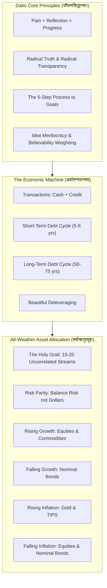

# अर्थचक्रपञ्चाशिका : सिद्धान्तमाला
## *Fifty Classical Sanskrit Verses on Ray Dalio's Principles, The Economic Machine and All-Weather Portfolio Diversification*

> **ग्रन्थकारः (Author):** Vedant Madane & Antigravity  
> **छन्दः (Metre):** अनुष्टुप् (Anuṣṭubh - Pathyāvaktra rule, 8 syllables per pāda, strictly verified)  
> **व्याकरणम् (Grammar):** Complete Pāṇinian morphological analysis (पदच्छेद, प्रकृति, प्रत्यय, विभक्ति, कारकार्थ)  
> **विषयः (Subject):** Ray Dalio's *Principles*, Idea Meritocracy, The 5-Step Process, The Economic Machine (Transactions, Credit, Short-Term and Long-Term Debt Cycles), Beautiful Deleveraging, The Holy Grail of Investing and The All-Weather Portfolio Framework  

---

## प्रस्तावना (Introduction)

Ray Dalio, founder of Bridgewater Associates (the world's largest hedge fund), transformed macro investing and organizational culture through a single core realization: reality operates like a perpetual machine governed by cause-and-effect relationships. By codifying life and work into explicit principles, institutions can transcend the emotional vulnerabilities of ego and blind spots through an Idea Meritocracy: radical truth, radical transparency and believability-weighted decision making.

Economically, Dalio demystified the macro world into a mechanical template driven by transactions, credit creation, short-term debt cycles (5-8 years) and long-term debt cycles (50-75 years), providing the definitive blueprint for navigating deleveragings. In asset allocation, his discovery of the 'Holy Grail of Investing' (15 to 20 uncorrelated return streams) laid the foundation for modern Risk Parity and the All-Weather Portfolio: an asset architecture engineered to thrive across all four economic seasons.

**अर्थचक्रपञ्चाशिका : सिद्धान्तमाला** formalizes these seminal insights across 50 metrically verified classical Sanskrit verses in the Anuṣṭubh metre, complete with comprehensive Pāṇinian grammatical analysis and deep domain commentary.



---

## Canto 1: तथ्यसाक्षात्कारः विकासक्रमश्च
### *First Principles of Reality: Evolution, Radical Truth and the Machine Perspective*

#### Verse 1

```sanskrit
यथावद् वस्तुतत्त्वस्य ज्ञानं कार्यं विजानता ।
यथार्थस्य समाश्रित्य यन्त्रवद् वर्तते जगत् ॥
```

**पदच्छेदः:** यथावत् वस्तु-तत्त्वस्य ज्ञानम् कार्यम् विजानता । यथार्थस्य समाश्रित्य यन्त्र-वत् वर्तते जगत् ॥

**पाणिनीय-व्याकरण-सारणी:**

| पदम् | मूलप्रकृतिः / धातुः | पदविभागः | विभक्तिः / प्रत्ययः | व्याख्या / कारकार्थः |
| :--- | :--- | :--- | :--- | :--- |
| **यथावत्** | `यथावत्` | अव्ययम् | अव्ययम् | यथार्थरूपेण (precisely as it actually is) |
| **वस्तुतत्त्वस्य** | `वस्तु + तत्त्व` | षष्ठी-तत्पुरुष नपुंसकलिंग | षष्ठी एकवचन | प्रकृतेः वास्तविकस्वरूपस्य (of objective reality) |
| **ज्ञानम्** | `ज्ञान` | नपुंसकलिंग नाम | प्रथमा एकवचन | बोधः (lucid understanding) |
| **कार्यम्** | `√कृ + ण्यत्` | कृदन्तरूप नपुंसकलिंग | प्रथमा एकवचन | कर्तव्यम् (must be achieved) |
| **विजानता** | `वि + √ज्ञा + शतृ` | कृदन्तरूप पुंलिंग | तृतीया एकवचन | प्राज्ञेन (by the wise practitioner) |
| **यथार्थस्य** | `यथा + अर्थ` | अव्ययीभाव / षष्ठी एकवचन | षष्ठी एकवचन | सत्यस्वरूपस्य (of empirical truth) |
| **समाश्रित्य** | `सम् + आ + √श्रि + ल्यप्` | कृदन्तरूप अव्यय | अव्ययम् | अवलम्ब्य (having aligned with) |
| **यन्त्रवत्** | `यन्त्र + वतिँ` | क्रियाविशेषणम् | अव्ययम् | मेकानिजम् इव (like an optimizing machine) |
| **वर्तते** | `√वृत् + लट्` | आत्मनेपद लट् | प्रथमपुरुष एकवचन | प्रवर्तते (operates) |
| **जगत्** | `जगत्` | नपुंसकलिंग नाम | प्रथमा एकवचन | विश्वम् (the entire universe) |

**सिद्धान्तमाला-भाष्यम् (Dalio Principles and Economic Commentary):** Reality as an Optimizing Machine: Ray Dalio's overarching foundational premise in Principles is that reality operates like a perpetual machine governed by cause-and-effect relationships. Rather than wishing reality worked differently or lamenting harsh truths, the hyper-realistic thinker embraces what is, understanding that optimal decision-making requires alignment with nature's empirical laws.

---

#### Verse 2

```sanskrit
वेदनायाश्च सङ्गोपाद् विचारेण समन्वयात् ।
प्रगतिर्जायते लोके सत्यमेतन्मुनीरितम् ॥
```

**पदच्छेदः:** वेदनायाः च सङ्गोपात् विचारेण समन्वयात् । प्रगतिः जायते लोके सत्यम् एतत् मुनि-ईरितम् ॥

**पाणिनीय-व्याकरण-सारणी:**

| पदम् | मूलप्रकृतिः / धातुः | पदविभागः | विभक्तिः / प्रत्ययः | व्याख्या / कारकार्थः |
| :--- | :--- | :--- | :--- | :--- |
| **वेदनायाः** | `वेदना` | स्त्रीलिंग नाम | षष्ठी एकवचन | कष्टस्य / दुःखस्य (of psychological pain or failure) |
| **च** | `च` | अव्ययम् | अव्ययम् | समुच्चये (and) |
| **सङ्गोपात्** | `सम् + गोप् + घञ्` | पुंलिंग नाम | पञ्चमी एकवचन | स्वीकारात् (from confronting rather than suppressing) |
| **विचारेण** | `विचार` | पुंलिंग नाम | तृतीया एकवचन | गभीरचिन्तनेन / रिफ्लेक्शन् (via systematic reflection) |
| **समन्वयात्** | `सम् + अनु + अय` | पुंलिंग नाम | पञ्चमी एकवचन | संयोगात् (from conjunction: Pain + Reflection) |
| **प्रगतिः** | `प्रगति` | स्त्रीलिंग नाम | प्रथमा एकवचन | विकासः (evolutionary progress) |
| **जायते** | `√जन् + लट्` | आत्मनेपद लट् | प्रथमपुरुष एकवचन | उत्पद्यते (is born) |
| **लोके** | `लोक` | पुंलिंग नाम | सप्तमी एकवचन | संसारे (in human life) |
| **सत्यम्** | `सत्य` | नपुंसकलिंग नाम | प्रथमा एकवचन | अमोघसत्यम् (universal law) |
| **एतत्** | `एतद्` | सर्वनाम नपुंसकलिंग | प्रथमा एकवचन | इदम् (this) |
| **मुनीरितम्** | `मुनि + ईरित` | तृतीया-तत्पुरुष नपुंसकलिंग | प्रथमा एकवचन | ऋषिप्रोक्तम् (proclaimed by wise sages) |

**सिद्धान्तमाला-भाष्यम् (Dalio Principles and Economic Commentary):** Pain Plus Reflection Equals Progress: Dalio's most celebrated maxim (Pain + Reflection = Progress) teaches that psychological distress, market losses and painful mistakes are nature's direct feedback signaling an encounter with reality. Running away from pain guarantees stagnation; leaning into pain with calm, detached analytical reflection produces profound adaptation and mental breakthroughs.

---

#### Verse 3

```sanskrit
सत्यस्य विमलं रूपं प्रकाशयति सर्वदा ।
पारदर्शित्वभावेन संशयान् प्रविमुञ्चति ॥
```

**पदच्छेदः:** सत्यस्य विमलम् रूपम् प्रकाशयति सर्वदा । पारदर्शित्व-भावेन संशयान् प्रविमुञ्चति ॥

**पाणिनीय-व्याकरण-सारणी:**

| पदम् | मूलप्रकृतिः / धातुः | पदविभागः | विभक्तिः / प्रत्ययः | व्याख्या / कारकार्थः |
| :--- | :--- | :--- | :--- | :--- |
| **सत्यस्य** | `सत्य` | नपुंसकलिंग नाम | षष्ठी एकवचन | वास्तविकतायाः (of empirical truth) |
| **विमलम्** | `विमल` | विशेषण नपुंसकलिंग | द्वितीया एकवचन | शुद्धम् (unvarnished and pristine) |
| **रूपम्** | `रूप` | नपुंसकलिंग नाम | द्वितीया एकवचन | स्वरूपम् (nature) |
| **प्रकाशयति** | `प्र + काश् + णिच् + लट्` | परस्मैपद लट् | प्रथमपुरुष एकवचन | उद्घाटयति (unveils) |
| **सर्वदा** | `सर्वदा` | अव्ययम् | अव्ययम् | सदा (constantly) |
| **पारदर्शित्वभावेन** | `पारदर्शिन् + त्व + भाव` | तृतीया एकवचन पुंलिंग | तृतीया एकवचन | र्याडिकल्-ट्रान्स्पेरेन्सि-भावेन (through radical transparency) |
| **संशयान्** | `संशय` | पुंलिंग नाम | द्वितीया बहुवचन | भ्रमान् (illusions, politics and doubts) |
| **प्रविमुञ्चति** | `प्र + वि + √मुच् + लट्` | परस्मैपद लट् | प्रथमपुरुष एकवचन | त्यजति (banishes) |

**सिद्धान्तमाला-भाष्यम् (Dalio Principles and Economic Commentary):** Radical Truth and Radical Transparency: At Bridgewater Associates, Dalio instituted radical truth and radical transparency: recording virtually all meetings, sharing unfiltered feedback and laying bare internal disagreements. When everyone sees what is true and hidden agendas are eliminated, organizational politics evaporates, leaving raw facts and merit to guide decisions.

---

#### Verse 4

```sanskrit
विकासो जायते नित्यं निसर्गस्य विधावपि ।
विना विकासं सर्वं हि नाशमेवानुगच्छति ॥
```

**पदच्छेदः:** विकासः जायते नित्यम् निसर्गस्य विधौ अपि । विना विकासम् सर्वम् हि नाशम् एव अनुगच्छति ॥

**पाणिनीय-व्याकरण-सारणी:**

| पदम् | मूलप्रकृतिः / धातुः | पदविभागः | विभक्तिः / प्रत्ययः | व्याख्या / कारकार्थः |
| :--- | :--- | :--- | :--- | :--- |
| **विकासः** | `विकास` | पुंलिंग नाम | प्रथमा एकवचन | इवोल्यूशन् / उन्नतिः (evolution and adaptation) |
| **जायते** | `√जन् + लट्` | आत्मनेपद लट् | प्रथमपुरुष एकवचन | प्रवर्तते (occurs) |
| **नित्यम्** | `नित्यम्` | क्रियाविशेषणम् | अव्ययम् | अनवरतम् (perpetually) |
| **निसर्गस्य** | `निसर्ग` | पुंलिंग नाम | षष्ठी एकवचन | प्रकृतेः (of nature) |
| **विधौ** | `विधि` | पुंलिंग नाम | सप्तमी एकवचन | नियमे (in the overarching law) |
| **अपि** | `अपि` | अव्ययम् | अव्ययम् | समुच्चये (even) |
| **विना** | `विना` | अव्ययम् | अव्ययम् | वर्जयित्वा (without) |
| **विकासम्** | `विकास` | पुंलिंग नाम | द्वितीया एकवचन | अनुकूलनम् (adaptation) |
| **सर्वम्** | `सर्व` | विशेषण नपुंसकलिंग | प्रथमा एकवचन | समग्रं वस्तु (everything) |
| **हि** | `हि` | अव्ययम् | अव्ययम् | निश्चये (indeed) |
| **नाशम्** | `नाश` | पुंलिंग नाम | द्वितीया एकवचन | विनाशम् (extinction and ruin) |
| **एव** | `एव` | अव्ययम् | अव्ययम् | अवधारणे (alone) |
| **अनुगच्छति** | `अनु + √गम् + लट्` | परस्मैपद लट् | प्रथमपुरुष एकवचन | प्राप्नोति (succumbs to) |

**सिद्धान्तमाला-भाष्यम् (Dalio Principles and Economic Commentary):** Evolve or Die: Evolution is the greatest force in the universe and the single overarching law of nature. Organisms, organizations and economies that adapt to changing conditions thrive; those that remain rigid, romanticizing past victories, are discarded by natural selection. Adaptability and continuous learning are existential mandates.

---

#### Verse 5

```sanskrit
स्वात्मानं यन्त्ररूपेण पश्यन् कर्मसु योजयेत् ।
यन्त्रस्य चालकश्चैव यन्त्रस्याङ्गस्तथैव च ॥
```

**पदच्छेदः:** स्व-आत्मानम् यन्त्र-रूपेण पश्यन् कर्मसु योजयेत् । यन्त्रस्य चालकः च एव यन्त्रस्य अङ्गः तथा एव च ॥

**पाणिनीय-व्याकरण-सारणी:**

| पदम् | मूलप्रकृतिः / धातुः | पदविभागः | विभक्तिः / प्रत्ययः | व्याख्या / कारकार्थः |
| :--- | :--- | :--- | :--- | :--- |
| **स्वात्मानम्** | `स्व + आत्मन्` | षष्ठी-तत्पुरुष पुंलिंग | द्वितीया एकवचन | स्वशरीरचित्तम् (one's own self) |
| **यन्त्ररूपेण** | `यन्त्र + रूप` | तृतीया-तत्पुरुष नपुंसकलिंग | तृतीया एकवचन | मेकानिजम्-भावेन (as an operating machine) |
| **पश्यन्** | `√दृश् + शतृ` | कृदन्तरूप पुंलिंग | प्रथमा एकवचन | अवलोकयन् (observing with detachment) |
| **कर्मसु** | `कर्मन्` | नपुंसकलिंग नाम | सप्तमी बहुवचन | कार्येषु (in life pursuits and duties) |
| **योजयेत्** | `√युज् + णिच् + विधि-लिङ्` | परस्मैपद लिङ् | प्रथमपुरुष एकवचन | नियुञ्जीत (should direct) |
| **यन्त्रस्य** | `यन्त्र` | नपुंसकलिंग नाम | षष्ठी एकवचन | प्रणाल्याः (of the system machine) |
| **चालकः** | `चालक` | पुंलिंग नाम | प्रथमा एकवचन | इञ्जिनियर् / नियन्ता (the designer / architect) |
| **च** | `च` | अव्ययम् | अव्ययम् | समुच्चये (and) |
| **एव** | `एव` | अव्ययम् | अव्ययम् | अवधारणे (certainly) |
| **अङ्गः** | `अङ्ग` | नपुंसकलिंग नाम | प्रथमा एकवचन | अवयवः / वर्कर् (a component worker in the machine) |
| **तथा** | `तथा` | अव्ययम् | अव्ययम् | तद्वत् (likewise) |
| **एव** | `एव` | अव्ययम् | अव्ययम् | अवधारणे (indeed) |
| **च** | `च` | अव्ययम् | अव्ययम् | समुच्चये (and) |

**सिद्धान्तमाला-भाष्यम् (Dalio Principles and Economic Commentary):** The Higher Level Perspective (Machine Perspective): Dalio urges thinkers to observe themselves from a higher level, viewing life as an operating machine. In this duality, you are simultaneously the Designer (Architect) who specifies the outcomes and processes and the Worker (Component) executing the tasks. If the worker encounters friction, the designer must objectively adjust the machine rather than wallow in self-pity.

---

## Canto 2: पञ्चपर्वपद्धतिः सिद्धिमार्गश्च
### *The Five-Step Process: Getting What You Want Out of Life*

#### Verse 6

```sanskrit
प्रथमं स्पष्टलक्ष्याणां निर्धारः क्रियते बुधैः ।
उद्देश्यं विमलं ज्ञात्वा मार्गे गच्छति बुद्धिमान् ॥
```

**पदच्छेदः:** प्रथमम् स्पष्ट-लक्ष्याणाम् निर्धारः क्रियते बुधैः । उद्देश्यम् विमलम् ज्ञात्वा मार्गे गच्छति बुद्धिमान् ॥

**पाणिनीय-व्याकरण-सारणी:**

| पदम् | मूलप्रकृतिः / धातुः | पदविभागः | विभक्तिः / प्रत्ययः | व्याख्या / कारकार्थः |
| :--- | :--- | :--- | :--- | :--- |
| **प्रथमम्** | `प्रथमम्` | क्रियाविशेषणम् | अव्ययम् | प्रारम्भे (firstly) |
| **स्पष्टलक्ष्याणाम्** | `स्पष्ट + लक्ष्य` | कर्मधारय नपुंसकलिंग | षष्ठी बहुवचन | सुस्पष्ट-उद्देश्यानाम् (of crystal-clear goals) |
| **निर्धारः** | `निस् + √धृ + घञ्` | पुंलिंग नाम | प्रथमा एकवचन | निश्चयः (setting / determination) |
| **क्रियते** | `√कृ + कर्मणि लट्` | कर्मणि लट् | प्रथमपुरुष एकवचन | विधीयते (is executed) |
| **बुधैः** | `बुध` | पुंलिंग नाम | तृतीया बहुवचन | विद्वद्भिः (by the wise) |
| **उद्देश्यम्** | `उद् + √दिश् + ण्यत्` | कृदन्तरूप नपुंसकलिंग | द्वितीया एकवचन | गन्तव्यम् (the true goal) |
| **विमलम्** | `विमल` | विशेषण नपुंसकलिंग | द्वितीया एकवचन | निर्मलम् (unambiguous) |
| **ज्ञात्वा** | `√ज्ञा + क्त्वा` | कृदन्तरूप अव्यय | अव्ययम् | अवबुध्य (having identified) |
| **मार्गे** | `मार्ग` | पुंलिंग नाम | सप्तमी एकवचन | पथि (on the life path) |
| **गच्छति** | `√गम् + लट्` | परस्मैपद लट् | प्रथमपुरुष एकवचन | अग्रसरति (advances) |
| **बुद्धिमान्** | `बुद्धिमत्` | विशेषण पुंलिंग | प्रथमा एकवचन | प्रज्ञावान् (the intelligent strategist) |

**सिद्धान्तमाला-भाष्यम् (Dalio Principles and Economic Commentary):** Step 1: Have Clear Goals: The first step in Dalio's Five-Step Process is defining unambiguous, prioritized goals. You can have almost anything you want, but you cannot have everything you want. Pursuing too many conflicting desires creates paralysis; true strategy begins with ruthless prioritization and clarity of purpose.

---

#### Verse 7

```sanskrit
दोषस्य दर्शनं कृत्वा नैव तं क्षमते सुधीः ।
प्रतिरोधं विजानीयात् समस्यायाश्च भञ्जकः ॥
```

**पदच्छेदः:** दोषस्य दर्शनम् कृत्वा न एव तम् क्षमते सुधीः । प्रतिरोधम् विजानीयात् समस्यायाः च भञ्जकः ॥

**पाणिनीय-व्याकरण-सारणी:**

| पदम् | मूलप्रकृतिः / धातुः | पदविभागः | विभक्तिः / प्रत्ययः | व्याख्या / कारकार्थः |
| :--- | :--- | :--- | :--- | :--- |
| **दोषस्य** | `दोष` | पुंलिंग नाम | षष्ठी एकवचन | समस्यायाः (of a mistake or problem) |
| **दर्शनम्** | `दर्शन` | नपुंसकलिंग नाम | द्वितीया एकवचन | साक्षात्कारम् (identification / detection) |
| **कृत्वा** | `√कृ + क्त्वा` | कृदन्तरूप अव्यय | अव्ययम् | सम्पाद्य (having performed) |
| **न** | `न` | अव्ययम् | अव्ययम् | प्रतिषेधे (not) |
| **एव** | `एव` | अव्ययम् | अव्ययम् | अवधारणे (at all) |
| **तम्** | `तद्` | सर्वनाम पुंलिंग | द्वितीया एकवचन | तं दोषम् (that flaw) |
| **क्षमते** | `√क्षम् + आत्मनेपद लट्` | आत्मनेपद लट् | प्रथमपुरुष एकवचन | सहोते (tolerates) |
| **सुधीः** | `सुधी` | पुंलिंग नाम | प्रथमा एकवचन | उत्कृष्टधीः (the conscientious thinker) |
| **प्रतिरोधम्** | `प्रतिरोध` | पुंलिंग नाम | द्वितीया एकवचन | बाधाम् (the bottleneck / obstacle) |
| **विजानीयात्** | `वि + √ज्ञा + विधि-लिङ्` | परस्मैपद लिङ् | प्रथमपुरुष एकवचन | अवबुध्येत (should recognize) |
| **समस्यायाः** | `समस्या` | स्त्रीलिंग नाम | षष्ठी एकवचन | सङ्कटस्य (of the dilemma) |
| **च** | `च` | अव्ययम् | अव्ययम् | समुच्चये (and) |
| **भञ्जकः** | `√भञ्ज् + ण्वुल्` | पुंलिंग नाम | प्रथमा एकवचन | विनाशकः (the resolver / breaker) |

**सिद्धान्तमाला-भाष्यम् (Dalio Principles and Economic Commentary):** Step 2: Identify and Do Not Tolerate Problems: Encountering problems is an inherent property of pursuing ambitious goals. Successful people do not pretend problems do not exist; they surface them with clinical detachment. Crucially, identifying problems without tolerating them is what separates high-performing organizations from mediocre ones.

---

#### Verse 8

```sanskrit
मूलकारणमन्विष्य सम्यग् रोधं विशोधयेत् ।
बाह्यरूपं परित्यज्य सूक्ष्मं पश्यति चक्षुषा ॥
```

**पदच्छेदः:** मूल-कारणम् अन्विष्य सम्यक् रोधम् विशोधयेत् । बाह्य-रूपम् परित्यज्य सूक्ष्मम् पश्यति चक्षुषा ॥

**पाणिनीय-व्याकरण-सारणी:**

| पदम् | मूलप्रकृतिः / धातुः | पदविभागः | विभक्तिः / प्रत्ययः | व्याख्या / कारकार्थः |
| :--- | :--- | :--- | :--- | :--- |
| **मूलकारणम्** | `मूल + कारण` | कर्मधारय नपुंसकलिंग | द्वितीया एकवचन | रूट्-कॉझ् (the root cause) |
| **अन्विष्य** | `अनु + √इष् + ल्यप्` | कृदन्तरूप अव्यय | अव्ययम् | गवेषयित्वा (having investigated) |
| **सम्यक्** | `सम्यक्` | क्रियाविशेषणम् | अव्ययम् | यथावत् (accurately) |
| **रोधम्** | `रोध` | पुंलिंग नाम | द्वितीया एकवचन | बाधकम् (the underlying impediment) |
| **विशोधयेत्** | `वि + शुध् + णिच् + विधि-लिङ्` | परस्मैपद लिङ् | प्रथमपुरुष एकवचन | निदानं कुर्यात् (should diagnose) |
| **बाह्यरूपम्** | `बाह्य + रूप` | कर्मधारय नपुंसकलिंग | द्वितीया एकवचन | लक्षणमात्रम् (mere superficial symptoms) |
| **परित्यज्य** | `परि + त्यज् + ल्यप्` | कृदन्तरूप अव्यय | अव्ययम् | अतिक्रम्य (having looked past) |
| **सूक्ष्मम्** | `सूक्ष्म` | विशेषण नपुंसकलिंग | द्वितीया एकवचन | आन्तरिकतत्त्वम् (the deeper mechanical reality) |
| **पश्यति** | `√दृश् + लट्` | परस्मैपद लट् | प्रथमपुरुष एकवचन | अवलोकयति (observes) |
| **चक्षुषा** | `चक्षुस्` | नपुंसकलिंग नाम | तृतीया एकवचन | प्रज्ञानेत्रेण (with the eye of diagnostic wisdom) |

**सिद्धान्तमाला-भाष्यम् (Dalio Principles and Economic Commentary):** Step 3: Diagnose Problems to Find Root Causes: Never confuse superficial symptoms with root causes. If a delivery is late, the symptom is the tardy shipment; the root cause might be a flawed workflow design or a manager lacking organizational skills. Root causes are almost always rooted in people qualities or procedural design flaws.

---

#### Verse 9

```sanskrit
उपायस्य विधानेन योजनां कल्पयेद् दृढाम् ।
यन्त्ररूपेण सर्वं हि रचितं कार्यसिद्धये ॥
```

**पदच्छेदः:** उपायस्य विधानेन योजनाम् कल्पयेत् दृढाम् । यन्त्र-रूपेण सर्वम् हि रचितम् कार्य-सिद्धये ॥

**पाणिनीय-व्याकरण-सारणी:**

| पदम् | मूलप्रकृतिः / धातुः | पदविभागः | विभक्तिः / प्रत्ययः | व्याख्या / कारकार्थः |
| :--- | :--- | :--- | :--- | :--- |
| **उपायस्य** | `उपाय` | पुंलिंग नाम | षष्ठी एकवचन | समाधानस्य (of the strategic remedy) |
| **विधानेन** | `विधान` | नपुंसकलिंग नाम | तृतीया एकवचन | रचनया (by the formulation) |
| **योजनाम्** | `योजना` | स्त्रीलिंग नाम | द्वितीया एकवचन | प्लान् / प्रकल्पम् (the strategic plan) |
| **कल्पयेत्** | `√क्लृप् + विधि-लिङ्` | परस्मैपद लिङ् | प्रथमपुरुष एकवचन | रचयेत् (should design) |
| **दृढाम्** | `दृढ` | विशेषण स्त्रीलिंग | द्वितीया एकवचन | सुसंस्थिताम् (robust and foolproof) |
| **यन्त्ररूपेण** | `यन्त्र + रूप` | तृतीया-तत्पुरुष नपुंसकलिंग | तृतीया एकवचन | यन्त्रवत् (like a machine blueprint) |
| **सर्वम्** | `सर्व` | विशेषण नपुंसकलिंग | प्रथमा एकवचन | समग्रं तन्त्रम् (the entire process) |
| **हि** | `हि` | अव्ययम् | अव्ययम् | निश्चये (indeed) |
| **रचितम्** | `√रच् + क्त` | कृदन्तरूप नपुंसकलिंग | प्रथमा एकवचन | निर्मितम् (architected) |
| **कार्यसिद्धये** | `कार्य + सिद्धि` | षष्ठी-तत्पुरुष स्त्रीलिंग | चतुर्थी एकवचन | तादर्थ्ये चतुर्थी : फलप्राप्तये (for successful goal attainment) |

**सिद्धान्तमाला-भाष्यम् (Dalio Principles and Economic Commentary):** Step 4: Design a Plan: Designing a plan is like drafting a script or mechanical blueprint. It outlines specific, temporally sequenced tasks and assigns clear accountabilities to specific people. A good design prevents the recurrence of diagnosed root causes by altering the operational machinery.

---

#### Verse 10

```sanskrit
सङ्कल्पेन दृढेनैव योजनामनुपालयेत् ।
फलं प्राप्नोति यत्नेन पञ्चपर्वप्रसाधितम् ॥
```

**पदच्छेदः:** सङ्कल्पेन दृढेन एव योजनाम् अनुपालयेत् । फलम् प्राप्नोति यत्नेन पञ्च-पर्व-प्रसाधितम् ॥

**पाणिनीय-व्याकरण-सारणी:**

| पदम् | मूलप्रकृतिः / धातुः | पदविभागः | विभक्तिः / प्रत्ययः | व्याख्या / कारकार्थः |
| :--- | :--- | :--- | :--- | :--- |
| **सङ्कल्पेन** | `सङ्कल्प` | पुंलिंग नाम | तृतीया एकवचन | दृढनिश्चयेन (with disciplined willpower) |
| **दृढेन** | `दृढ` | विशेषण पुंलिंग | तृतीया एकवचन | अचलचित्तेन (unwavering) |
| **एव** | `एव` | अव्ययम् | अव्ययम् | अवधारणे (alone) |
| **योजनाम्** | `योजना` | स्त्रीलिंग नाम | द्वितीया एकवचन | प्रकल्पम् (the blueprint / plan) |
| **अनुपालयेत्** | `अनु + √पाल् + विधि-लिङ्` | परस्मैपद लिङ् | प्रथमपुरुष एकवचन | अनुतिष्ठेत् (must execute and push through) |
| **फलम्** | `फल` | नपुंसकलिंग नाम | द्वितीया एकवचन | लक्ष्यसिद्धिम् (the desired outcome) |
| **प्राप्नोति** | `प्र + √आप् + लट्` | परस्मैपद लट् | प्रथमपुरुष एकवचन | अधिगच्छति (attains) |
| **यत्नेन** | `यत्न` | पुंलिंग नाम | तृतीया एकवचन | परिश्रमेण (through rigorous execution) |
| **पञ्चपर्वप्रसाधितम्** | `पञ्च + पर्वन् + प्रसाधित` | कर्मधारय नपुंसकलिंग | द्वितीया एकवचन | पञ्चसोपानसिद्धम् (perfected via the 5-Step Process) |

**सिद्धान्तमाला-भाष्यम् (Dalio Principles and Economic Commentary):** Step 5: Push Through to Completion: Great planning is utterly worthless without ruthless execution. The practitioner must possess the work ethic, self-discipline and daily tracking mechanisms to execute the plan step-by-step until the goal is achieved, completing the iterative 5-step loop.

---

## Canto 3: विमुक्तचित्तता विचारसङ्ग्रहश्च
### *Radical Open-Mindedness, Thoughtful Disagreement and Believability Weighting*

#### Verse 11

```sanskrit
अहङ्कारस्तथाऽज्ञानाद् अन्धबिन्दुर्विजायते ।
द्वयमेतन्निगृह्णीयाद् ज्ञानवृद्ध्यै मुहुर्मुहुः ॥
```

**पदच्छेदः:** अहङ्कारः तथा अज्ञानात् अन्ध-बिन्दुः विजायते । द्वयम् एतत् निगृह्णीयात् ज्ञान-वृद्ध्यै मुहुः मुहुः ॥

**पाणिनीय-व्याकरण-सारणी:**

| पदम् | मूलप्रकृतिः / धातुः | पदविभागः | विभक्तिः / प्रत्ययः | व्याख्या / कारकार्थः |
| :--- | :--- | :--- | :--- | :--- |
| **अहङ्कारः** | `अहम् + कार` | पुंलिंग नाम | प्रथमा एकवचन | ईगो-दोषः (the ego barrier) |
| **तथा** | `तथा` | अव्ययम् | अव्ययम् | समुच्चये (and) |
| **अज्ञानात्** | `अ + ज्ञान` | नञ्-तत्पुरुष नपुंसकलिंग | पञ्चमी एकवचन | अविद्यया (from ignorance) |
| **अन्धबिन्दुः** | `अन्ध + बिन्दु` | कर्मधारय पुंलिंग | प्रथमा एकवचन | ब्लाइण्ड्-स्पाट् (cognitive blind spot) |
| **विजायते** | `वि + √जन् + लट्` | आत्मनेपद लट् | प्रथमपुरुष एकवचन | उत्पद्यते (arises) |
| **द्वयम्** | `द्वय` | नपुंसकलिंग नाम | द्वितीया एकवचन | युगलम् (these two psychological barriers) |
| **एतत्** | `एतद्` | सर्वनाम नपुंसकलिंग | द्वितीया एकवचन | एतद् द्वयम् (these two) |
| **निगृह्णीयात्** | `नि + √ग्रह् + विधि-लिङ्` | परस्मैपद लिङ् | प्रथमपुरुष एकवचन | दण्डयेत् / संदमयेत् (should subdue) |
| **ज्ञानवृद्ध्यै** | `ज्ञान + वृद्धि` | षष्ठी-तत्पुरुष स्त्रीलिंग | चतुर्थी एकवचन | तादर्थ्ये चतुर्थी : प्रज्ञाविकासाय (for intellectual growth) |
| **मुहुः** | `मुहुर्` | अव्ययम् | अव्ययम् | पुनः (again) |
| **मुहुः** | `मुहुर्` | अव्ययम् | अव्ययम् | पुनश्च (and again) |

**सिद्धान्तमाला-भाष्यम् (Dalio Principles and Economic Commentary):** The Two Great Barriers: Ego and Blind Spots: Dalio identifies two fatal psychological impediments that prevent people from seeing reality: the Ego Barrier (the subconscious need to feel smart and avoid looking foolish) and Blind Spots (the physiological reality that different brains perceive the world through limited apertures). Taming ego and actively compensating for blind spots is prerequisite to wisdom.

---

#### Verse 12

```sanskrit
विचारभेदं सङ्गृह्य पृच्छेद् विद्वज्जनान् प्रति ।
न स्वपक्षहठासक्तिः सत्यमेव परीक्षते ॥
```

**पदच्छेदः:** विचार-भेदम् सङ्गृह्य पृच्छेत् विद्वत्-जनान् प्रति । न स्व-पक्ष-हठ-आसक्तिः सत्यम् एव परीक्षते ॥

**पाणिनीय-व्याकरण-सारणी:**

| पदम् | मूलप्रकृतिः / धातुः | पदविभागः | विभक्तिः / प्रत्ययः | व्याख्या / कारकार्थः |
| :--- | :--- | :--- | :--- | :--- |
| **विचारभेदम्** | `विचार + भेद` | षष्ठी-तत्पुरुष पुंलिंग | द्वितीया एकवचन | मतभिन्नताम् (thoughtful disagreement) |
| **सङ्गृह्य** | `सम् + √ग्रह् + ल्यप्` | कृदन्तरूप अव्यय | अव्ययम् | अङ्गीकृत्य (having embraced) |
| **पृच्छेत्** | `√प्रछ् + विधि-लिङ्` | परस्मैपद लिङ् | प्रथमपुरुष एकवचन | जिज्ञासेत् (should inquire / cross-examine) |
| **विद्वज्जनान्** | `विद्वत् + जन` | कर्मधारय पुंलिंग | द्वितीया बहुवचन | प्राज्ञान् (believable, knowledgeable people) |
| **प्रति** | `प्रति` | कर्मप्रवचनीय | अव्ययम् | लक्ष्यीकृत्य (towards) |
| **न** | `न` | अव्ययम् | अव्ययम् | प्रतिषेधे (never) |
| **स्वपक्षहठासक्तिः** | `स्व + पक्ष + हठ + आसक्ति` | बहुव्रीहि / स्त्रीलिंग | प्रथमा एकवचन | स्वाग्रहे हठबुद्धिः (stubborn attachment to one's own opinion) |
| **सत्यम्** | `सत्य` | नपुंसकलिंग नाम | द्वितीया एकवचन | वस्तुतत्त्वम् (objective truth) |
| **एव** | `एव` | अव्ययम् | अव्ययम् | अवधारणे (alone) |
| **परीक्षते** | `परि + √ईक्ष् + लट्` | आत्मनेपद लट् | प्रथमपुरुष एकवचन | अनुसन्दधाति (tests / explores) |

**सिद्धान्तमाला-भाष्यम् (Dalio Principles and Economic Commentary):** The Art of Thoughtful Disagreement: The goal of an intellectual exchange is not to convince the other party that you are right, but to find out what is true. Thoughtful disagreement requires genuine curiosity: calmly asking intelligent, believable people how they arrived at a differing conclusion so both minds can stress-test hypotheses.

---

#### Verse 13

```sanskrit
येषां सिद्धिः पुरा दृष्टा ये च शास्त्रविशारदाः ।
तेषां वाक्यं गुरु ज्ञेयं निर्णयेषु विशेषतः ॥
```

**पदच्छेदः:** येषाम् सिद्धिः पुरा दृष्टा ये च शास्त्र-विशारदाः । तेषाम् वाक्यम् गुरु ज्ञेयम् निर्णयेषु विशेषतः ॥

**पाणिनीय-व्याकरण-सारणी:**

| पदम् | मूलप्रकृतिः / धातुः | पदविभागः | विभक्तिः / प्रत्ययः | व्याख्या / कारकार्थः |
| :--- | :--- | :--- | :--- | :--- |
| **येषाम्** | `यद्` | सर्वनाम पुंलिंग | षष्ठी बहुवचन | येषां विदुषाम् (of those whose) |
| **सिद्धिः** | `सिद्धि` | स्त्रीलिंग नाम | प्रथमा एकवचन | सफलता / ट्रॅक्-रेकार्ड् (proven track record of success) |
| **पुरा** | `पुरा` | अव्ययम् | अव्ययम् | इतिहासकाले (repeatedly in the past) |
| **दृष्टा** | `√दृश् + क्त` | कृदन्तरूप स्त्रीलिंग | प्रथमा एकवचन | प्रमाणसिद्धा (empirically demonstrated) |
| **ये** | `यद्` | सर्वनाम पुंलिंग | प्रथमा बहुवचन | ये जनाः (those who) |
| **च** | `च` | अव्ययम् | अव्ययम् | समुच्चये (and) |
| **शास्त्रविशारदाः** | `शास्त्र + विशारद` | सप्तमी-तत्पुरुष पुंलिंग | प्रथमा बहुवचन | गभीरसिद्धान्तज्ञाः (deep masters of the discipline) |
| **तेषाम्** | `तद्` | सर्वनाम पुंलिंग | षष्ठी बहुवचन | तेषां प्राज्ञानाम् (of those credible minds) |
| **वाक्यम्** | `वाक्य` | नपुंसकलिंग नाम | प्रथमा एकवचन | वचनम् (testimony / judgment) |
| **गुरु** | `गुरु` | विशेषण नपुंसकलिंग | प्रथमा एकवचन | भाराङ्कितम् (heavily weighted) |
| **ज्ञेयम्** | `√ज्ञा + यत्` | कृदन्तरूप नपुंसकलिंग | प्रथमा एकवचन | अवगन्तव्यम् (must be considered) |
| **निर्णयेषु** | `निर्णय` | पुंलिंग नाम | सप्तमी बहुवचन | सिद्धान्तग्रहणे (in critical decisions) |
| **विशेषतः** | `विशेषतः` | अव्ययम् | अव्ययम् | विशेषरूपेण (especially) |

**सिद्धान्तमाला-भाष्यम् (Dalio Principles and Economic Commentary):** Believability-Weighted Decision Making: Democratic one-person-one-vote decision making is flawed because opinions are not equally valid; autocratic top-down dictate is equally flawed because leaders have blind spots. Dalio pioneered believability weighting: weighting opinions by a person's proven track record of repeated success in the domain and their ability to logically explain the causal mechanics.

---

#### Verse 14

```sanskrit
त्रिधा सम्मन्त्र्य विद्वद्भिर्विभक्तैश्च पृथक् पृथक् ।
निश्चयं कुरुते धीरः संशयं छिन्नवान् परम् ॥
```

**पदच्छेदः:** त्रिधा सम्मन्त्र्य विद्वद्भिः विभक्तैः च पृथक् पृथक् । निश्चयम् कुरुते धीरः संशयम् छिन्नवान् परम् ॥

**पाणिनीय-व्याकरण-सारणी:**

| पदम् | मूलप्रकृतिः / धातुः | पदविभागः | विभक्तिः / प्रत्ययः | व्याख्या / कारकार्थः |
| :--- | :--- | :--- | :--- | :--- |
| **त्रिधा** | `त्रिधा` | क्रियाविशेषणम् | अव्ययम् | त्रिकोणीकरणेन / ट्रायङ्गुलेशन् (via triangulation) |
| **सम्मन्त्र्य** | `सम् + मन्त्र् + ल्यप्` | कृदन्तरूप अव्यय | अव्ययम् | परामृश्य (having consulted) |
| **विद्वद्भिः** | `विद्वस्` | पुंलिंग नाम | तृतीया बहुवचन | विश्वसनीयैः जनैः (with independent believable experts) |
| **विभक्तैः** | `वि + √भज् + क्त` | कृदन्तरूप पुंलिंग | तृतीया बहुवचन | परस्परमसम्बद्धैः (independent from each other) |
| **च** | `च` | अव्ययम् | अव्ययम् | समुच्चये (and) |
| **पृथक्** | `पृथक्` | अव्ययम् | अव्ययम् | स्वतन्त्रतया (separately) |
| **पृथक्** | `पृथक्` | अव्ययम् | अव्ययम् | विविक्तभावेन (distinctly) |
| **निश्चयम्** | `निश्चय` | पुंलिंग नाम | द्वितीया एकवचन | अन्तिमनिर्णयम् (the final conviction) |
| **कुरुते** | `√कृ + आत्मनेपद लट्` | आत्मनेपद लट् | प्रथमपुरुष एकवचन | धारयति (forms) |
| **धीरः** | `धीर` | पुंलिंग नाम | प्रथमा एकवचन | प्रज्ञावान् (the sober leader) |
| **संशयम्** | `संशय` | पुंलिंग नाम | द्वितीया एकवचन | सन्देहम् (all doubt) |
| **छिन्नवान्** | `√छिद् + क्तवतु` | कृदन्तरूप पुंलिंग | प्रथमा एकवचन | नाशितवान् (having shattered) |
| **परम्** | `परम्` | क्रियाविशेषणम् | अव्ययम् | नितराम् (completely) |

**सिद्धान्तमाला-भाष्यम् (Dalio Principles and Economic Commentary):** Triangulating with Independent Experts: Before making major high-stakes bets, Dalio triangulates: systematically cross-examining at least three independent, believable world-class experts who hold conflicting perspectives. By dissecting their reasoning and observing where they disagree, the leader gains a crystalline, multi-dimensional view of reality.

---

#### Verse 15

```sanskrit
न स्वस्य विजयं काङ्क्षेत् सत्यस्य विजयं तथा ।
सत्यानुसरणान्मुक्तिः श्रेयो लभेत शाश्वतम् ॥
```

**पदच्छेदः:** न स्वस्य विजयम् काङ्क्षेत् सत्यस्य विजयम् तथा । सत्य-अनुसरणात् मुक्तिः श्रेयः लभेत शाश्वतम् ॥

**पाणिनीय-व्याकरण-सारणी:**

| पदम् | मूलप्रकृतिः / धातुः | पदविभागः | विभक्तिः / प्रत्ययः | व्याख्या / कारकार्थः |
| :--- | :--- | :--- | :--- | :--- |
| **न** | `न` | अव्ययम् | अव्ययम् | प्रतिषेधे (not) |
| **स्वस्य** | `स्व` | सर्वनाम पुंलिंग | षष्ठी एकवचन | आत्मनः अहङ्कारस्य (of one's own ego) |
| **विजयम्** | `विजय` | पुंलिंग नाम | द्वितीया एकवचन | सत्यत्वस्थापनम् (proving oneself right) |
| **काङ्क्षेत्** | `√काङ्क्ष् + विधि-लिङ्` | परस्मैपद लिङ् | प्रथमपुरुष एकवचन | इच्छेत् (should crave) |
| **सत्यस्य** | `सत्य` | नपुंसकलिंग नाम | षष्ठी एकवचन | वास्तविकसिद्धान्तस्य (of objective truth) |
| **विजयम्** | `विजय` | पुंलिंग नाम | द्वितीया एकवचन | प्रकाशम् (triumph / discovery) |
| **तथा** | `तथा` | अव्ययम् | अव्ययम् | तथैव (rather) |
| **सत्यानुसरणात्** | `सत्य + अनुसरण` | षष्ठी-तत्पुरुष नपुंसकलिंग | पञ्चमी एकवचन | यथार्थपालनात् (from following what is true) |
| **मुक्तिः** | `मुक्ति` | स्त्रीलिंग नाम | प्रथमा एकवचन | भ्रमनिवृत्तिः (liberation from illusion) |
| **श्रेयः** | `श्रेयस्` | नपुंसकलिंग नाम | द्वितीया एकवचन | परममङ्गलम् (supreme flourishing) |
| **लभेत** | `√लभ् + विधि-लिङ्` | आत्मनेपद लिङ् | प्रथमपुरुष एकवचन | प्राप्नुयात् (attains) |
| **शाश्वतम्** | `शाश्वत` | विशेषण नपुंसकलिंग | द्वितीया एकवचन | चिरन्तनम् (eternal and unshakeable) |

**सिद्धान्तमाला-भाष्यम् (Dalio Principles and Economic Commentary):** Preferring Truth Over Being Right: The quintessential hallmark of an evolved thinker is surrendering the petty desire to be 'right' in favor of the hunger to find out what is genuinely true. When you care more about uncovering the truth than defending your preconceptions, learning becomes boundless and errors become prized teachers.

---

## Canto 4: संस्था-यन्त्रविधानम् विचारश्रेष्ठत्वम्
### *Organizations as Machines: Culture, People and Idea Meritocracy*

#### Verse 16

```sanskrit
संस्कृतेश्च मनुष्याणां मेलनेन विधीयते ।
संस्था यन्त्रमिवोद्भूता कार्यं साधयितुं महत् ॥
```

**पदच्छेदः:** संस्कृतेः च मनुष्याणाम् मेलनेन विधीयते । संस्था यन्त्रम् इव उद्भूता कार्यम् साधयितुम् महत् ॥

**पाणिनीय-व्याकरण-सारणी:**

| पदम् | मूलप्रकृतिः / धातुः | पदविभागः | विभक्तिः / प्रत्ययः | व्याख्या / कारकार्थः |
| :--- | :--- | :--- | :--- | :--- |
| **संस्कृतेः** | `संस्कृति` | स्त्रीलिंग नाम | षष्ठी एकवचन | संस्थागत-संस्कृतेः (of corporate culture) |
| **च** | `च` | अव्ययम् | अव्ययम् | समुच्चये (and) |
| **मनुष्याणाम्** | `मनुष्य` | पुंलिंग नाम | षष्ठी बहुवचन | कर्मचारिणाम् (of talented people) |
| **मेलनेन** | `मेलन` | नपुंसकलिंग नाम | तृतीया एकवचन | संयोगेन (by the harmonious combination) |
| **विधीयते** | `वि + √धा + कर्मणि लट्` | कर्मणि लट् | प्रथमपुरुष एकवचन | निर्मिता भवति (is architected) |
| **संस्था** | `संस्था` | स्त्रीलिंग नाम | प्रथमा एकवचन | आर्गनायझेशन् (an organization / company) |
| **यन्त्रम्** | `यन्त्र` | नपुंसकलिंग नाम | प्रथमा एकवचन | मेकानिजम् (a machine) |
| **इव** | `इव` | अव्ययम् | अव्ययम् | उपमार्थे (like) |
| **उद्भूता** | `उद् + √भू + क्त` | कृदन्तरूप स्त्रीलिंग | प्रथमा एकवचन | प्रादुर्भूता (emerging) |
| **कार्यम्** | `कार्य` | नपुंसकलिंग नाम | द्वितीया एकवचन | उद्देश्यम् (mission) |
| **साधयितुम्** | `√साध् + तुमुन्` | कृदन्तरूप अव्यय | अव्ययम् | सम्पादयितुम् (to accomplish) |
| **महत्** | `महत्` | विशेषण नपुंसकलिंग | द्वितीया एकवचन | विशालम् (a monumental objective) |

**सिद्धान्तमाला-भाष्यम् (Dalio Principles and Economic Commentary):** An Organization Consists of Culture and People: Dalio conceptualizes every company as an operating machine composed of two fundamental inputs: Culture and People. The culture determines how people interact and uphold values, while the people operate the mechanics. When exceptional culture unites with brilliant people, the machine produces extraordinary results.

---

#### Verse 17

```sanskrit
सत्यस्य प्रकाशनाच्च पारदर्शिगुणेन च ।
श्रेष्ठभावस्य पूजा च विचारस्य विशिष्टता ॥
```

**पदच्छेदः:** सत्यस्य प्रकाशनात् च पारदर्शि-गुणेन च । श्रेष्ठ-भावस्य पूजा च विचारस्य विशिष्टता ॥

**पाणिनीय-व्याकरण-सारणी:**

| पदम् | मूलप्रकृतिः / धातुः | पदविभागः | विभक्तिः / प्रत्ययः | व्याख्या / कारकार्थः |
| :--- | :--- | :--- | :--- | :--- |
| **सत्यस्य** | `सत्य` | नपुंसकलिंग नाम | षष्ठी एकवचन | यथार्थस्य (of empirical truth) |
| **प्रकाशनात्** | `प्रकाशन` | नपुंसकलिंग नाम | पञ्चमी एकवचन | र्याडिकल्-ट्रूथ्-स्वीकारात् (from radical truthfulness) |
| **च** | `च` | अव्ययम् | अव्ययम् | समुच्चये (and) |
| **पारदर्शिगुणेन** | `पारदर्शिन् + गुण` | कर्मधारय पुंलिंग | तृतीया एकवचन | र्याडिकल्-ट्रान्स्पेरेन्सि-माध्यमेन (via radical transparency) |
| **च** | `च` | अव्ययम् | अव्ययम् | समुच्चये (and) |
| **श्रेष्ठभावस्य** | `श्रेष्ठ + भाव` | कर्मधारय पुंलिंग | षष्ठी एकवचन | गुणवत्तायाः (of excellence and believability) |
| **पूजा** | `पूजा` | स्त्रीलिंग नाम | प्रथमा एकवचन | आदरः (honoring / weighting) |
| **च** | `च` | अव्ययम् | अव्ययम् | समुच्चये (and) |
| **विचारस्य** | `विचार` | पुंलिंग नाम | षष्ठी एकवचन | बुद्धेः (of thought) |
| **विशिष्टता** | `विशिष्ट + ता` | स्त्रीलिंग नाम | प्रथमा एकवचन | आइडिया-मेरिटोक्रसि (Idea Meritocracy) |

**सिद्धान्तमाला-भाष्यम् (Dalio Principles and Economic Commentary):** The Formula for Idea Meritocracy: An Idea Meritocracy is a system where the best ideas win regardless of internal hierarchy or politics. Dalio defines its mathematical formula: Idea Meritocracy = Radical Truth + Radical Transparency + Believability-Weighted Decision Making. By eliminating fear of conflict, the organization extracts the collective intelligence of all minds.

---

#### Verse 18

```sanskrit
प्रत्येकस्य गुणानां च गणनं क्रियते क्षणम् ।
विन्दुसङ्ग्रहणेनैव योग्यता प्रविभाष्यते ॥
```

**पदच्छेदः:** प्रत्येकस्य गुणानाम् च गणनम् क्रियते क्षणम् । विन्दु-सङ्ग्रहणेन एव योग्यता प्रविभाष्यते ॥

**पाणिनीय-व्याकरण-सारणी:**

| पदम् | मूलप्रकृतिः / धातुः | पदविभागः | विभक्तिः / प्रत्ययः | व्याख्या / कारकार्थः |
| :--- | :--- | :--- | :--- | :--- |
| **प्रत्येकस्य** | `प्रति + एक` | सर्वनाम पुंलिंग | षष्ठी एकवचन | प्रति-कर्मचारिणः (of each team member) |
| **गुणानाम्** | `गुण` | पुंलिंग नाम | षष्ठी बहुवचन | सामर्थ्यानां दोषाणां च (of cognitive strengths and weaknesses) |
| **च** | `च` | अव्ययम् | अव्ययम् | समुच्चये (and) |
| **गणनम्** | `गणन` | नपुंसकलिंग नाम | प्रथमा एकवचन | सङ्ख्यानम् (quantification) |
| **क्रियते** | `√कृ + कर्मणि लट्` | कर्मणि लट् | प्रथमपुरुष एकवचन | विधीयते (is performed) |
| **क्षणम्** | `क्षणम्` | क्रियाविशेषणम् | अव्ययम् | नित्यं रियल-टाईम्-मध्ये (in real-time during meetings) |
| **विन्दुसङ्ग्रहणेन** | `विन्दु + सङ्ग्रहण` | षष्ठी-तत्पुरुष नपुंसकलिंग | तृतीया एकवचन | डाट्-कलेक्टर्-यन्त्रेण (via the Dot Collector application) |
| **एव** | `एव` | अव्ययम् | अव्ययम् | अवधारणे (alone) |
| **योग्यता** | `योग्य + ता` | स्त्रीलिंग नाम | प्रथमा एकवचन | विश्वसनीयता-परिमाणम् (believability score) |
| **प्रविभाष्यते** | `प्र + वि + √भाष् + कर्मणि लट्` | कर्मणि लट् | प्रथमपुरुष एकवचन | उद्घाट्यते (is illuminated) |

**सिद्धान्तमाला-भाष्यम् (Dalio Principles and Economic Commentary):** The Dot Collector and Real-Time Feedback: To operationalize idea meritocracy, Bridgewater built proprietary tools like the Dot Collector. During meetings, participants assign numerical ratings ('dots') to colleagues on dozens of specific attributes (such as logical reasoning, open-mindedness and conceptual thinking). Over time, millions of data points create objective profiles of each person's specific cognitive believability.

---

#### Verse 19

```sanskrit
योग्यस्थाने नियोक्तव्यो जनो योग्येन कर्मणा ।
यन्त्रस्य रचना यद्वत् सङ्घटनं तथैव च ॥
```

**पदच्छेदः:** योग्य-स्थाने नियोक्तव्यः जनः योग्येन कर्मणा । यन्त्रस्य रचना यद्वत् सङ्घटनम् तथा एव च ॥

**पाणिनीय-व्याकरण-सारणी:**

| पदम् | मूलप्रकृतिः / धातुः | पदविभागः | विभक्तिः / प्रत्ययः | व्याख्या / कारकार्थः |
| :--- | :--- | :--- | :--- | :--- |
| **योग्यस्थाने** | `योग्य + स्थान` | कर्मधारय नपुंसकलिंग | सप्तमी एकवचन | उपयुक्तपदे (in the matching role) |
| **नियोक्तव्यः** | `नि + √युज् + तव्यत्` | कृदन्तरूप पुंलिंग | प्रथमा एकवचन | स्थापनीयः (must be deployed) |
| **जनः** | `जन` | पुंलिंग नाम | प्रथमा एकवचन | कर्मचारी (the individual worker) |
| **योग्येन** | `योग्य` | विशेषण नपुंसकलिंग | तृतीया एकवचन | अनुकूलेन (with congruent) |
| **कर्मणा** | `कर्मन्` | नपुंसकलिंग नाम | तृतीया एकवचन | कार्येण (job responsibility) |
| **यन्त्रस्य** | `यन्त्र` | नपुंसकलिंग नाम | षष्ठी एकवचन | मेकानिजम्-प्रणाल्याः (of a machine) |
| **रचना** | `रचना` | स्त्रीलिंग नाम | प्रथमा एकवचन | वास्तुशिल्पम् (design architecture) |
| **यद्वत्** | `यद्वत्` | अव्ययम् | अव्ययम् | यथा (just as) |
| **सङ्घटनम्** | `सम् + घट् + ल्युट्` | नपुंसकलिंग नाम | प्रथमा एकवचन | मानवसंयोजनम् (organizational staffing) |
| **तथा** | `तथा` | अव्ययम् | अव्ययम् | तद्वत् (so) |
| **एव** | `एव` | अव्ययम् | अव्ययम् | अवधारणे (certainly) |
| **च** | `च` | अव्ययम् | अव्ययम् | समुच्चये (and) |

**सिद्धान्तमाला-भाष्यम् (Dalio Principles and Economic Commentary):** Match the Person to the Role: People are wired very differently: some are visionary big-picture conceptualizers who hate detail, while others are meticulous detail-oriented auditors who lack high-level vision. Managers must recognize psychological hard-wiring (via Myers-Briggs or psychometric testing) and design roles to fit people rather than attempting to fit square pegs into round holes.

---

#### Verse 20

```sanskrit
त्रुटीनां लेखनं कृत्वा दोषपञ्ज्यां समाचरेत् ।
दोषस्य स्मरणादेव ज्ञानं वर्धेत नित्यशः ॥
```

**पदच्छेदः:** त्रुटीनाम् लेखनम् कृत्वा दोष-पञ्ज्याम् समाचरेत् । दोषस्य स्मरणात् एव ज्ञानम् वर्धेत नित्यशः ॥

**पाणिनीय-व्याकरण-सारणी:**

| पदम् | मूलप्रकृतिः / धातुः | पदविभागः | विभक्तिः / प्रत्ययः | व्याख्या / कारकार्थः |
| :--- | :--- | :--- | :--- | :--- |
| **त्रुटीनाम्** | `त्रुटि` | स्त्रीलिंग नाम | षष्ठी बहुवचन | प्रमादानाम् (of mistakes and operational failures) |
| **लेखनम्** | `लेखन` | नपुंसकलिंग नाम | द्वितीया एकवचन | अभिलेखनम् (logging / recording) |
| **कृत्वा** | `√कृ + क्त्वा` | कृदन्तरूप अव्यय | अव्ययम् | विधाया (having performed) |
| **दोषपञ्ज्याम्** | `दोष + पञ्जी` | षष्ठी-तत्पुरुष स्त्रीलिंग | सप्तमी एकवचन | इश्यू-लॉग्-मध्ये (in the Issue Log) |
| **समाचरेत्** | `सम् + आ + √चर् + विधि-लिङ्` | परस्मैपद लिङ् | प्रथमपुरुष एकवचन | पालयेत् (should maintain) |
| **दोषस्य** | `दोष` | पुंलिंग नाम | षष्ठी एकवचन | अपराधस्य / प्रमादस्य (of the mistake) |
| **स्मरणात्** | `स्मरण` | नपुंसकलिंग नाम | पञ्चमी एकवचन | स्मृतेः / विश्लेषणात् (from systematic logging and reflection) |
| **एव** | `एव` | अव्ययम् | अव्ययम् | अवधारणे (alone) |
| **ज्ञानम्** | `ज्ञान` | नपुंसकलिंग नाम | प्रथमा एकवचन | संस्थागतप्रज्ञा (institutional intelligence) |
| **वर्धेत** | `√वृध् + विधि-लिङ्` | आत्मनेपद लिङ् | प्रथमपुरुष एकवचन | प्रवर्धते (multiplies) |
| **नित्यशः** | `नित्य + शस्` | अव्ययम् | अव्ययम् | प्रतिदिनम् (continuously) |

**सिद्धान्तमाला-भाष्यम् (Dalio Principles and Economic Commentary):** The Issue Log: In Dalio's management system, every mistake that occurs within the organization must be logged in a public Issue Log. Hiding mistakes is grounds for immediate termination; making mistakes and learning from them is celebrated. Logging issues enables root-cause diagnoses, updating processes so identical errors never recur.

---

## Canto 5: अर्थतन्त्रयन्त्रम् क्रयविक्रयसम्पत्
### *How the Economic Machine Works: Transactions, Money and Credit Creation*

#### Verse 21

```sanskrit
क्रयविक्रयसङ्घातो वर्ततेऽर्थप्रवाहवत् ।
क्रेतुश्च विक्रेतुश्चैव संयोगेन प्रवर्तते ॥
```

**पदच्छेदः:** क्रय-विक्रय-सङ्घातः वर्तते अर्थ-प्रवाह-वत् । क्रेतुः च विक्रेतुः च एव संयोगेन प्रवर्तते ॥

**पाणिनीय-व्याकरण-सारणी:**

| पदम् | मूलप्रकृतिः / धातुः | पदविभागः | विभक्तिः / प्रत्ययः | व्याख्या / कारकार्थः |
| :--- | :--- | :--- | :--- | :--- |
| **क्रयविक्रयसङ्घातः** | `क्रय + विक्रय + सङ्घात` | इतरेतर-द्वन्द्वगर्भ-तत्पुरुष पुंलिंग | प्रथमा एकवचन | ट्रान्झॅक्शन्-समूहः (the sum total of all buying and selling) |
| **वर्तते** | `√वृत् + लट्` | आत्मनेपद लट् | प्रथमपुरुष एकवचन | अस्ति (exists) |
| **अर्थप्रवाहवत्** | `अर्थ + प्रवाह + वतिँ` | क्रियाविशेषणम् | अव्ययम् | आर्थिकधारा इव (like an economic circulatory stream) |
| **क्रेतुः** | `क्रेतृ` | पुंलिंग नाम | षष्ठी एकवचन | क्रेतुः जनस्य (of the buyer) |
| **च** | `च` | अव्ययम् | अव्ययम् | समुच्चये (and) |
| **विक्रेतुः** | `विक्रेतृ` | पुंलिंग नाम | षष्ठी एकवचन | विक्रेतुः जनस्य (of the seller) |
| **च** | `च` | अव्ययम् | अव्ययम् | समुच्चये (and) |
| **एव** | `एव` | अव्ययम् | अव्ययम् | अवधारणे (certainly) |
| **संयोगेन** | `संयोग` | पुंलिंग नाम | तृतीया एकवचन | सम्पर्केण (through transaction exchange) |
| **प्रवर्तते** | `प्र + √वृत् + लट्` | आत्मनेपद लट् | प्रथमपुरुष एकवचन | प्रवहति (operates) |

**सिद्धान्तमाला-भाष्यम् (Dalio Principles and Economic Commentary):** An Economy is the Sum of All Transactions: Dalio demystifies macroeconomics by reducing the entire global economy to a simple machine driven by transactions. A transaction consists of a buyer exchanging money or credit with a seller for goods, services, or financial assets. Understanding transactions at the micro level explains the aggregate macro dynamics.

---

#### Verse 22

```sanskrit
ऋणेन दीयते शक्तिः क्रयार्थं वर्तमानेऽहनि ।
भविष्ये तु पुनर्देयं तस्मात् सङ्कुच्यते ध्रुवम् ॥
```

**पदच्छेदः:** ऋणेन दीयते शक्तिः क्रय-अर्थम् वर्तमाने अहनि । भविष्ये तु पुनः देयम् तस्मात् सङ्कुच्यते ध्रुवम् ॥

**पाणिनीय-व्याकरण-सारणी:**

| पदम् | मूलप्रकृतिः / धातुः | पदविभागः | विभक्तिः / प्रत्ययः | व्याख्या / कारकार्थः |
| :--- | :--- | :--- | :--- | :--- |
| **ऋणेन** | `ऋण` | नपुंसकलिंग नाम | तृतीया एकवचन | क्रेडिट्-साधनेन (by credit creation) |
| **दीयते** | `√दा + कर्मणि लट्` | कर्मणि लट् | प्रथमपुरुष एकवचन | प्रदीयते (is granted) |
| **शक्तिः** | `शक्ति` | स्त्रीलिंग नाम | प्रथमा एकवचन | क्रयसामर्थ्यम् (purchasing power) |
| **क्रयार्थम्** | `क्रय + अर्थ` | तादर्थ्य-अव्यय | अव्ययम् | खरेदीकरणाया (for purchasing) |
| **वर्तमाने** | `वृत् + शानच्` | कृदन्तरूप पुंलिंग | सप्तमी एकवचन | अद्यतने (in the present) |
| **अहनि** | `अहन्` | नपुंसकलिंग नाम | सप्तमी एकवचन | दिवसे (day / time) |
| **भविष्ये** | `भविष्य` | नपुंसकलिंग नाम | सप्तमी एकवचन | आगामिकाले (in the future) |
| **तु** | `तु` | अव्ययम् | अव्ययम् | विशेषे (however) |
| **पुनः** | `पुनर्` | अव्ययम् | अव्ययम् | भूयः (back) |
| **देयम्** | `√दा + यत्` | कृदन्तरूप नपुंसकलिंग | प्रथमा एकवचन | प्रत्यर्पणीयम् (must be repaid) |
| **तस्मात्** | `तद्` | सर्वनाम नपुंसकलिंग | पञ्चमी एकवचन | हेत्वर्थे (therefore) |
| **सङ्कुच्यते** | `सम् + √कुच् + कर्मणि लट्` | कर्मणि लट् | प्रथमपुरुष एकवचन | व्ययहासो भवति (spending must contract) |
| **ध्रुवम्** | `ध्रुवम्` | क्रियाविशेषणम् | अव्ययम् | निश्चयेन (inevitably) |

**सिद्धान्तमाला-भाष्यम् (Dalio Principles and Economic Commentary):** The Mechanism of Credit: Credit is volatile fuel: it allows a borrower to spend more than they produce today, boosting the economy. But whenever you borrow, you create a cycle: you are effectively borrowing from your future self. In the future, you must spend less than you produce to repay the principal and interest, inevitably creating a contraction.

---

#### Verse 23

```sanskrit
एकस्य व्ययमाणं यद् अन्यस्यायो भवेत् स च ।
व्ययवृद्धौ च सर्वस्य वृद्धिर्भवति सत्वरम् ॥
```

**पदच्छेदः:** एकस्य व्ययमाणम् यत् अन्यस्य आयः भवेत् सः च । व्यय-वृद्धौ च सर्वस्य वृद्धिः भवति सत्वरम् ॥

**पाणिनीय-व्याकरण-सारणी:**

| पदम् | मूलप्रकृतिः / धातुः | पदविभागः | विभक्तिः / प्रत्ययः | व्याख्या / कारकार्थः |
| :--- | :--- | :--- | :--- | :--- |
| **एकस्य** | `एक` | संख्यावाचक पुंलिंग | षष्ठी एकवचन | एकस्य जनस्य (of one person) |
| **व्ययमाणम्** | `व्यय् + शानच्` | कृदन्तरूप नपुंसकलिंग | प्रथमा एकवचन | व्ययितं धनम् (spending dollars) |
| **यत्** | `यद्` | सर्वनाम नपुंसकलिंग | प्रथमा एकवचन | यत् परिमाणम् (whichever amount) |
| **अन्यस्य** | `अन्य` | सर्वनाम पुंलिंग | षष्ठी एकवचन | अपरस्य जनस्य (of another person) |
| **आयः** | `आय` | पुंलिंग नाम | प्रथमा एकवचन | इन्कम् / वेतनम् (income) |
| **भवेत्** | `√भू + विधि-लिङ्` | परस्मैपद लिङ् | प्रथमपुरुष एकवचन | जायते (becomes) |
| **सः** | `तद्` | सर्वनाम पुंलिंग | प्रथमा एकवचन | स आयः (that income) |
| **च** | `च` | अव्ययम् | अव्ययम् | समुच्चये (and) |
| **व्ययवृद्धौ** | `व्यय + वृद्धि` | षष्ठी-तत्पुरुष स्त्रीलिंग | सप्तमी एकवचन | सति-सप्तमी : व्यये प्रवर्धिते (when spending increases) |
| **च** | `च` | अव्ययम् | अव्ययम् | समुच्चये (and) |
| **सर्वस्य** | `सर्व` | सर्वनाम पुंलिंग | षष्ठी एकवचन | समग्रतन्त्रस्य (of the whole economy) |
| **वृद्धिः** | `वृद्धि` | स्त्रीलिंग नाम | प्रथमा एकवचन | प्रसारः (expansion) |
| **भवति** | `√भू + लट्` | परस्मैपद लट् | प्रथमपुरुष एकवचन | सम्पद्यते (occurs) |
| **सत्वरम्** | `स + त्वरा` | क्रियाविशेषणम् | अव्ययम् | शीघ्रम् (rapidly) |

**सिद्धान्तमाला-भाष्यम् (Dalio Principles and Economic Commentary):** One Person's Spending is Another's Income: Every dollar you spend is someone else's income. When people borrow and spend more, incomes rise, making borrowers more creditworthy, allowing banks to lend even more credit. This reflexive self-reinforcing upward spiral drives economic expansions.

---

#### Verse 24

```sanskrit
उत्पादकत्ववृद्धिश्च दीर्घा भवति सर्वदा ।
ऋणस्य तरङ्गाश्चैव चक्रवत् परिवर्तते ॥
```

**पदच्छेदः:** उत्पादकत्व-वृद्धिः च दीर्घा भवति सर्वदा । ऋणस्य तरङ्गाः च एव चक्र-वत् परिवर्तते ॥

**पाणिनीय-व्याकरण-सारणी:**

| पदम् | मूलप्रकृतिः / धातुः | पदविभागः | विभक्तिः / प्रत्ययः | व्याख्या / कारकार्थः |
| :--- | :--- | :--- | :--- | :--- |
| **उत्पादकत्ववृद्धिः** | `उत्पादक + त्व + वृद्धि` | षष्ठी-तत्पुरुष स्त्रीलिंग | प्रथमा एकवचन | प्रोडक्टिविटि-वृद्धिः (productivity growth) |
| **च** | `च` | अव्ययम् | अव्ययम् | समुच्चये (and) |
| **दीर्घा** | `दीर्घ` | विशेषण स्त्रीलिंग | प्रथमा एकवचन | स्थिरा मन्दगा च (long-term, steady trend line) |
| **भवति** | `√भू + लट्` | परस्मैपद लट् | प्रथमपुरुष एकवचन | विद्यते (is) |
| **सर्वदा** | `सर्वदा` | अव्ययम् | अव्ययम् | सदा (always) |
| **ऋणस्य** | `ऋण` | नपुंसकलिंग नाम | षष्ठी एकवचन | क्रेडिट्-सम्पदः (of credit) |
| **तरङ्गाः** | `तरङ्ग` | पुंलिंग नाम | प्रथमा बहुवचन | लहर्यः / दोलनानि (waves / fluctuations) |
| **च** | `च` | अव्ययम् | अव्ययम् | समुच्चये (and) |
| **एव** | `एव` | अव्ययम् | अव्ययम् | अवधारणे (certainly) |
| **चक्रवत्** | `चक्र + वतिँ` | क्रियाविशेषणम् | अव्ययम् | आवर्तनवत् (in cyclical swings) |
| **परिवर्तते** | `परि + √वृत् + लट्` | आत्मनेपद लट् | प्रथमपुरुष एकवचन | भ्रमति (oscillates around the trend) |

**सिद्धान्तमाला-भाष्यम् (Dalio Principles and Economic Commentary):** Productivity Growth vs. Credit Swings: Productivity growth matters most in the long run: human ingenuity, technological innovation and capital efficiency steadily improve living standards at roughly 2-3% per year. However, credit swings around this baseline dominate the short and medium term, creating economic booms and busts.

---

#### Verse 25

```sanskrit
व्याजस्य हरणेनैव मध्यवर्ती प्रचालकः ।
ऋणप्रसारणं कुर्यात् सङ्कोचं च पुनः पुनः ॥
```

**पदच्छेदः:** व्याजस्य हरणेन एव मध्यवर्ती प्रचालकः । ऋण-प्रसारणम् कुर्यात् सङ्कोचम् च पुनः पुनः ॥

**पाणिनीय-व्याकरण-सारणी:**

| पदम् | मूलप्रकृतिः / धातुः | पदविभागः | विभक्तिः / प्रत्ययः | व्याख्या / कारकार्थः |
| :--- | :--- | :--- | :--- | :--- |
| **व्याजस्य** | `व्याज` | पुंलिंग नाम | षष्ठी एकवचन | इन्टरेस्ट्-दरस्य (of interest rate) |
| **हरणेन** | `हरण` | नपुंसकलिंग नाम | तृतीया एकवचन | न्यूनकीकरणेन (by cutting / manipulating) |
| **एव** | `एव` | अव्ययम् | अव्ययम् | अवधारणे (alone) |
| **मध्यवर्ती** | `मध्यवर्तिन्` | पुंलिंग नाम | प्रथमा एकवचन | सेन्ट्रल्-बैङ्क् (the Central Bank) |
| **प्रचालकः** | `प्रचालक` | पुंलिंग नाम | प्रथमा एकवचन | नियन्ता (the controller of money) |
| **ऋणप्रसारणम्** | `ऋण + प्रसारण` | षष्ठी-तत्पुरुष नपुंसकलिंग | द्वितीया एकवचन | क्रेडिट्-विस्तारम् (credit expansion) |
| **कुर्यात्** | `√कृ + विधि-लिङ्` | परस्मैपद लिङ् | प्रथमपुरुष एकवचन | विदध्यात् (prompts) |
| **सङ्कोचम्** | `सङ्कोच` | पुंलिंग नाम | द्वितीया एकवचन | ऋणन्यूनताम् (credit contraction via rate hikes) |
| **च** | `च` | अव्ययम् | अव्ययम् | समुच्चये (and) |
| **पुनः** | `पुनर्` | अव्ययम् | अव्ययम् | भूयः (again) |
| **पुनः** | `पुनर्` | अव्ययम् | अव्ययम् | भूयश्च (and again) |

**सिद्धान्तमाला-भाष्यम् (Dalio Principles and Economic Commentary):** Central Bank Interest Rate Levers: The Central Bank controls the cost of credit by adjusting interest rates. Lowering interest rates reduces borrowing costs, sparking new loans, asset purchases and economic activity. Raising rates suppresses inflation by cooling credit demand, initiating a controlled slowdown.

---

## Canto 6: लघुदीर्घऋणचक्रयोर्विभागः
### *The Short-Term and Long-Term Debt Cycles: The Anatomy of Bubbles*

#### Verse 26

```sanskrit
लघुचक्रेण संसारे पञ्चवर्षाणि धावति ।
ऋणेन वर्धते मूल्यं संकोचेन विमुच्यते ॥
```

**पदच्छेदः:** लघु-चक्रेण संसारे पञ्च-वर्षाणि धावति । ऋणेन वर्धते मूल्यम् संकोचेन विमुच्यते ॥

**पाणिनीय-व्याकरण-सारणी:**

| पदम् | मूलप्रकृतिः / धातुः | पदविभागः | विभक्तिः / प्रत्ययः | व्याख्या / कारकार्थः |
| :--- | :--- | :--- | :--- | :--- |
| **लघुचक्रेण** | `लघु + चक्र` | कर्मधारय नपुंसकलिंग | तृतीया एकवचन | शार्ट्-टर्म-डेट्-साय्कलेन (via the short-term debt cycle) |
| **संसारे** | `संसार` | पुंलिंग नाम | सप्तमी एकवचन | अर्थव्यवहाराय (in the economy) |
| **पञ्चवर्षाणि** | `पञ्चन् + वर्ष` | संख्यापूर्व-द्विगु नपुंसकलिंग | द्वितीया बहुवचन | ५-८ वर्षावधिम् (duration of 5 to 8 years) |
| **धावति** | `√धाव् + लट्` | परस्मैपद लट् | प्रथमपुरुष एकवचन | प्रसरति (runs) |
| **ऋणेन** | `ऋण` | नपुंसकलिंग नाम | तृतीया एकवचन | क्रेडिट्-वृद्ध्या (by credit growth) |
| **वर्धते** | `√वृध् + लट्` | आत्मनेपद लट् | प्रथमपुरुष एकवचन | उल्लसति (inflates) |
| **मूल्यम्** | `मूल्य` | नपुंसकलिंग नाम | प्रथमा एकवचन | सम्पत्तिकीमतः (asset prices and inflation) |
| **संकोचेन** | `संकोच` | पुंलिंग नाम | तृतीया एकवचन | दरवृद्ध्या (through tightening) |
| **विमुच्यते** | `वि + √मुच् + कर्मणि लट्` | कर्मणि लट् | प्रथमपुरुष एकवचन | शान्तिं गच्छति (recedes into recession) |

**सिद्धान्तमाला-भाष्यम् (Dalio Principles and Economic Commentary):** The Short-Term Debt Cycle (5-8 Years): The short-term debt cycle repeats every 5 to 8 years. As credit expands, spending outpaces production, causing inflation. The Central Bank responds by hiking rates, raising debt payments and curtailing borrowing. Spending drops, the economy slips into a recession, prompting the central bank to lower rates and begin the cycle anew.

---

#### Verse 27

```sanskrit
लोभेन मानवाः सर्वे गृह्णन्ति च पुनर्र्णम् ।
पूर्वस्मादधिकं भारं वहन्ति प्रतिवत्सरम् ॥
```

**पदच्छेदः:** लोभेन मानवाः सर्वे गृह्णन्ति च पुनः ऋणम् । पूर्वस्मात् अधिकम् भारम् वहन्ति प्रति-वत्सरम् ॥

**पाणिनीय-व्याकरण-सारणी:**

| पदम् | मूलप्रकृतिः / धातुः | पदविभागः | विभक्तिः / प्रत्ययः | व्याख्या / कारकार्थः |
| :--- | :--- | :--- | :--- | :--- |
| **लोभेन** | `लोभ` | पुंलिंग नाम | तृतीया एकवचन | आकांक्षया (out of greed and psychological optimism) |
| **मानवाः** | `मानव` | पुंलिंग नाम | प्रथमा बहुवचन | ऋणग्रहीतारः (human market participants) |
| **सर्वे** | `सर्व` | विशेषण पुंलिंग | प्रथमा बहुवचन | समग्राः (all) |
| **गृह्णन्ति** | `√ग्रह् + लट्` | परस्मैपद लट् | प्रथमपुरुष बहुवचन | स्वीकुर्वन्ति (borrow) |
| **च** | `च` | अव्ययम् | अव्ययम् | समुच्चये (and) |
| **पुनः** | `पुनर्` | अव्ययम् | अव्ययम् | भूयः (again) |
| **ऋणम्** | `ऋण` | नपुंसकलिंग नाम | द्वितीया एकवचन | उधारधनम् (credit / debt) |
| **पूर्वस्मात्** | `पूर्व` | विशेषण पुंलिंग | पञ्चमी एकवचन | पूर्वचक्रापेक्षया (than in the previous cycle) |
| **अधिकम्** | `अधिक` | विशेषण पुंलिंग | द्वितीया एकवचन | गुरुतरम् (greater) |
| **भारम्** | `भार` | पुंलिंग नाम | द्वितीया एकवचन | ऋणभारम् (debt burden) |
| **वहन्ति** | `√वह् + लट्` | परस्मैपद लट् | प्रथमपुरुष बहुवचन | धारयन्ति (they carry) |
| **प्रतिवत्सरम्** | `प्रति + वत्सर` | अव्ययीभाव समास | अव्ययम् | प्रत्येकवर्षम् (year after year) |

**सिद्धान्तमाला-भाष्यम् (Dalio Principles and Economic Commentary):** Debt Accumulation Across Cycles: Human nature is inherently biased toward optimism and leverage: people naturally prefer borrowing and spending over paying off debt. As a consequence, each subsequent short-term cycle finishes with higher debt levels and higher asset valuations than the previous one, gradually inflating the long-term debt cycle.

---

#### Verse 28

```sanskrit
दीर्घकालेन सञ्चित्य ऋणभारः प्रवर्धते ।
आयस्य वृद्धिमभ्येत्य सीमामत्यन्तमश्नुते ॥
```

**पदच्छेदः:** दीर्घ-कालेन सञ्चित्य ऋण-भारः प्रवर्धते । आयस्य वृद्धिम् अभ्येत्य सीमाम् अत्यन्तम् अश्नुते ॥

**पाणिनीय-व्याकरण-सारणी:**

| पदम् | मूलप्रकृतिः / धातुः | पदविभागः | विभक्तिः / प्रत्ययः | व्याख्या / कारकार्थः |
| :--- | :--- | :--- | :--- | :--- |
| **दीर्घकालेन** | `दीर्घ + काल` | कर्मधारय पुंलिंग | तृतीया एकवचन | ५०-७५ वर्षाणाम् अन्तरे (over a 50 to 75 year horizon) |
| **सञ्चित्य** | `सम् + चि + ल्यप्` | कृदन्तरूप अव्यय | अव्ययम् | एकत्रीभूय (having accumulated) |
| **ऋणभारः** | `ऋण + भार` | षष्ठी-तत्पुरुष पुंलिंग | प्रथमा एकवचन | डेट्-टु-जीडीपी-भारः (aggregate debt burden) |
| **प्रवर्धते** | `प्र + √वृध् + लट्` | आत्मनेपद लट् | प्रथमपुरुष एकवचन | द्रुतं वर्धते (grows inexorably) |
| **आयस्य** | `आय` | पुंलिंग नाम | षष्ठी एकवचन | इन्कम्-वृद्धेः (of income / GDP growth) |
| **वृद्धिम्** | `वृद्धि` | स्त्रीलिंग नाम | द्वितीया एकवचन | विकासवेगम (growth rate) |
| **अभ्येत्य** | `अभि + आ + √इ + ल्यप्` | कृदन्तरूप अव्यय | अव्ययम् | अतिक्रम्य (surpassing) |
| **सीमाम्** | `सीमा` | स्त्रीलिंग नाम | द्वितीया एकवचन | चरममर्यादाम (the physical boundary) |
| **अत्यन्तम्** | `अति + अन्त` | क्रियाविशेषणम् | अव्ययम् | नितराम् (to the absolute limit) |
| **अश्नुते** | `√अश् + लट्` | आत्मनेपद लट् | प्रथमपुरुष एकवचन | प्राप्नोति (reaches) |

**सिद्धान्तमाला-भाष्यम् (Dalio Principles and Economic Commentary):** The Long-Term Debt Cycle Peak (50-75 Years): Over decades, debt burdens (debts as a percentage of income) rise relentlessly until servicing the debt requires a suffocating fraction of total income. Asset prices inflate, creating a classic debt-financed bubble (as in 1929 and 2007) where participants feel wealthy despite precarious underlying balance sheets.

---

#### Verse 29

```sanskrit
शून्यत्वं गमिते व्याजे न शक्तिरुपजायते ।
प्रोत्साहनं न शक्नोति मध्यवर्ती विधातुमु ॥
```

**पदच्छेदः:** शून्यत्वम् गमिते व्याजे न शक्तिः उपजायते । प्रोत्साहनम् न शक्नोति मध्यवर्ती विधातुम् ॥

**पाणिनीय-व्याकरण-सारणी:**

| पदम् | मूलप्रकृतिः / धातुः | पदविभागः | विभक्तिः / प्रत्ययः | व्याख्या / कारकार्थः |
| :--- | :--- | :--- | :--- | :--- |
| **शून्यत्वम्** | `शून्य + त्व` | नपुंसकलिंग नाम | द्वितीया एकवचन | झीरो-लेवल् (the zero bound) |
| **गमिते** | `√गम् + णिच् + क्त` | कृदन्तरूप पुंलिंग | सप्तमी एकवचन | सति-सप्तमी : प्रापिते (having been driven down to 0%) |
| **व्याजे** | `व्याज` | पुंलिंग नाम | सप्तमी एकवचन | इन्टरेस्ट्-दरे (interest rate) |
| **न** | `न` | अव्ययम् | अव्ययम् | प्रतिषेधे (no) |
| **शक्तिः** | `शक्ति` | स्त्रीलिंग नाम | प्रथमा एकवचन | उत्तेजनसामर्थ्यम् (monetary stimulus potency) |
| **उपजायते** | `उप + √जन् + लट्` | आत्मनेपद लट् | प्रथमपुरुष एकवचन | अवशिष्यते (remains) |
| **प्रोत्साहनम्** | `प्र + उद् + सह् + णिच् + ल्युट्` | नपुंसकलिंग नाम | द्वितीया एकवचन | आर्थिक-स्टिम्युलस् (monetary stimulus) |
| **न** | `न` | अव्ययम् | अव्ययम् | प्रतिषेधे (cannot) |
| **शक्नोति** | `√शक् + लट्` | परस्मैपद लट् | प्रथमपुरुष एकवचन | समर्थो भवति (is able) |
| **मध्यवर्ती** | `मध्यवर्तिन्` | पुंलिंग नाम | प्रथमा एकवचन | सेन्ट्रल्-बैङ्क् (the Central Bank) |
| **विधातुम्** | `वि + √धा + तुमुन्` | कृदन्तरूप अव्यय | अव्ययम् | दातुम् (to execute: pushing on a string) |

**सिद्धान्तमाला-भाष्यम् (Dalio Principles and Economic Commentary):** Pushing on a String (Zero Lower Bound): In a normal recession, the central bank lowers interest rates to stimulate borrowing. But at the peak of a long-term debt cycle, interest rates hit 0%. Cutting rates further cannot stimulate the economy because borrowers are already saturated with debt and lenders refuse to lend. The central bank is now 'pushing on a string'.

---

#### Verse 30

```sanskrit
समर्था न पुनर्दातुं यदा भवन्ति मानवाः ।
तदा स्फोटः प्रजायेत महासङ्कटसंप्लुतः ॥
```

**पदच्छेदः:** समर्थाः न पुनः दातुम् यदा भवन्ति मानवाः । तदा स्फोटः प्रजायेत महा-सङ्कट-संप्लुतः ॥

**पाणिनीय-व्याकरण-सारणी:**

| पदम् | मूलप्रकृतिः / धातुः | पदविभागः | विभक्तिः / प्रत्ययः | व्याख्या / कारकार्थः |
| :--- | :--- | :--- | :--- | :--- |
| **समर्थाः** | `समर्थ` | विशेषण पुंलिंग | प्रथमा बहुवचन | सक्षमाः (solvent / capable) |
| **न** | `न` | अव्ययम् | अव्ययम् | प्रतिषेधे (not) |
| **पुनः** | `पुनर्` | अव्ययम् | अव्ययम् | भूयः (back) |
| **दातुम्** | `√दा + तुमुन्` | कृदन्तरूप अव्यय | अव्ययम् | प्रत्यर्पयितुम् (to service and repay debts) |
| **यदा** | `यदा` | अव्ययम् | अव्ययम् | यस्मिन् काले (when) |
| **भवन्ति** | `√भू + लट्` | परस्मैपद लट् | प्रथमपुरुष बहुवचन | जायन्ते (become) |
| **मानवाः** | `मानव` | पुंलिंग नाम | प्रथमा बहुवचन | ऋणग्रहीतारः (borrowers) |
| **तदा** | `तदा` | अव्ययम् | अव्ययम् | तस्मिन् समये (then) |
| **स्फोटः** | `स्फोट` | पुंलिंग नाम | प्रथमा एकवचन | बबल्-स्फोटः (the debt bubble burst) |
| **प्रजायेत** | `प्र + √जन् + विधि-लिङ्` | आत्मनेपद लिङ् | प्रथमपुरुष एकवचन | घटते (erupts) |
| **महासङ्कटसंप्लुतः** | `महत् + सङ्कट + संप्लुत` | तृतीया-तत्पुरुष पुंलिंग | प्रथमा एकवचन | विनाशकारी डिप्रेशन-सङ्कटः (engulfed in a systemic Great Depression) |

**सिद्धान्तमाला-भाष्यम् (Dalio Principles and Economic Commentary):** The Burst of the Debt Bubble: When incomes are insufficient to service accumulated debt, asset fire-sales begin. Borrows default, asset prices collapse, banking liquidity evaporates and the economy plunges into a deleveraging crisis. Unlike a typical recession, a deleveraging cannot be healed by interest rate cuts alone.

---

## Canto 7: ऋणविमोचनम् सन्तुलितशान्तिश्च
### *Deleveraging Dynamics: Austerity, Defaults, Printing and the Beautiful Deleveraging*

#### Verse 31

```sanskrit
व्ययसंकोचने कृते जायते महती व्यथा ।
आयस्यापि क्षयो भूत्वा मन्दत्वमुपजायते ॥
```

**पदच्छेदः:** व्यय-संकोचने कृते जायते महती व्यथा । आयस्य अपि क्षयः भूत्वा मन्दत्वम् उपजायते ॥

**पाणिनीय-व्याकरण-सारणी:**

| पदम् | मूलप्रकृतिः / धातुः | पदविभागः | विभक्तिः / प्रत्ययः | व्याख्या / कारकार्थः |
| :--- | :--- | :--- | :--- | :--- |
| **व्ययसंकोचने** | `व्यय + संकोचन` | षष्ठी-तत्पुरुष नपुंसकलिंग | सप्तमी एकवचन | सति-सप्तमी : आस्टेरिटि-विधाने (under spending austerity) |
| **कृते** | `√कृ + क्त` | कृदन्तरूप नपुंसकलिंग | सप्तमी एकवचन | सति-सप्तमी : अनुष्ठिते (having been imposed) |
| **जायते** | `√जन् + लट्` | आत्मनेपद लट् | प्रथमपुरुष एकवचन | उत्पद्यते (arises) |
| **महती** | `महत्` | विशेषण स्त्रीलिंग | प्रथमा एकवचन | विपुला (intense) |
| **व्यथा** | `व्यथा` | स्त्रीलिंग नाम | प्रथमा एकवचन | वेदना (economic hardship / pain) |
| **आयस्य** | `आय` | पुंलिंग नाम | षष्ठी एकवचन | इन्कम्-धनस्य (of income and tax revenues) |
| **अपि** | `अपि` | अव्ययम् | अव्ययम् | सम्भवे (also) |
| **क्षयः** | `क्षय` | पुंलिंग नाम | प्रथमा एकवचन | ह्रासः (collapse) |
| **भूत्वा** | `√भू + क्त्वा` | कृदन्तरूप अव्यय | अव्ययम् | सञ्जाते (having occurred) |
| **मन्दत्वम्** | `मन्द + त्व` | नपुंसकलिंग नाम | प्रथमा एकवचन | डिप्रेशन / मन्दी (severe deflationary contraction) |
| **उपजायते** | `उप + √जन् + लट्` | आत्मनेपद लट् | प्रथमपुरुष एकवचन | प्रादुर्भवति (develops) |

**सिद्धान्तमाला-भाष्यम् (Dalio Principles and Economic Commentary):** The Austerity Trap: When governments and households respond to debt crises by cutting spending (austerity), they discover that one person's spending is another's income. As spending drops faster than debts are paid down, incomes collapse, tax receipts plummet and debt-to-income ratios actually worsen. Austerity is intensely deflationary and painful.

---

#### Verse 32

```sanskrit
ऋणस्य शोधनं कृत्वा खण्डयन्ति धनेश्वरम् ।
सम्पत्तेर्विप्रलोपेन भीतिः सर्वत्र जायते ॥
```

**पदच्छेदः:** ऋणस्य शोधनम् कृत्वा खण्डयन्ति धनेश्वरम् । सम्पत्तेः विप्रलोपेन भीतिः सर्वत्र जायते ॥

**पाणिनीय-व्याकरण-सारणी:**

| पदम् | मूलप्रकृतिः / धातुः | पदविभागः | विभक्तिः / प्रत्ययः | व्याख्या / कारकार्थः |
| :--- | :--- | :--- | :--- | :--- |
| **ऋणस्य** | `ऋण` | नपुंसकलिंग नाम | षष्ठी एकवचन | उधारस्य (of non-performing debt) |
| **शोधनम्** | `शोधन` | नपुंसकलिंग नाम | द्वितीया एकवचन | रीस्ट्रक्चरिङ्ग् (debt restructuring / write-downs) |
| **कृत्वा** | `√कृ + क्त्वा` | कृदन्तरूप अव्यय | अव्ययम् | विधाया (having executed) |
| **खण्डयन्ति** | `√खण्ड् + लट्` | परस्मैपद लट् | प्रथमपुरुष बहुवचन | हेयर्-कट् कुर्वन्ति (they slash / haircut claims) |
| **धनेश्वरम्** | `धनेश्वर` | पुंलिंग नाम | द्वितीया एकवचन | ऋणदातारम् (the lender / bank) |
| **सम्पत्तेः** | `सम्पत्ति` | स्त्रीलिंग नाम | षष्ठी एकवचन | वैभवस्य (of asset wealth) |
| **विप्रलोपेन** | `वि + प्र + लोप` | पुंलिंग नाम | तृतीया एकवचन | विनाशनेन (by evaporation of paper wealth) |
| **भीतिः** | `भीति` | स्त्रीलिंग नाम | प्रथमा एकवचन | प्यानिक् / भयम् (systemic terror) |
| **सर्वत्र** | `सर्वत्र` | अव्ययम् | अव्ययम् | समग्रे लोके (everywhere) |
| **जायते** | `√जन् + लट्` | आत्मनेपद लट् | प्रथमपुरुष एकवचन | प्रसरति (spreads) |

**सिद्धान्तमाला-भाष्यम् (Dalio Principles and Economic Commentary):** Debt Restructurings and Bank Defaults: When borrowers default, lenders discover their assets do not exist. To prevent complete failure, debts are restructured: lenders receive less money (a haircut), take longer to get repaid, or accept lower interest rates. While reducing debt burdens, restructurings destroy perceived wealth, creating financial panic.

---

#### Verse 33

```sanskrit
धनिनां करसङ्ग्रहाद् दलितेभ्यो निवेद्यते ।
क्रोधेन विहते लोके सङ्घर्षः सम्प्रवर्तते ॥
```

**पदच्छेदः:** धनिनाम् कर-सङ्ग्रहात् दलितेभ्यः निवेद्यते । क्रोधेन विहते लोके सङ्घर्षः सम्प्रवर्तते ॥

**पाणिनीय-व्याकरण-सारणी:**

| पदम् | मूलप्रकृतिः / धातुः | पदविभागः | विभक्तिः / प्रत्ययः | व्याख्या / कारकार्थः |
| :--- | :--- | :--- | :--- | :--- |
| **धनिनाम्** | `धनिन्` | पुंलिंग नाम | षष्ठी बहुवचन | सम्पन्नानाम् (of the wealthy elite) |
| **करसङ्ग्रहात्** | `कर + सङ्ग्रह` | षष्ठी-तत्पुरुष पुंलिंग | पञ्चमी एकवचन | ट्याक्सेशन्-माध्यमात् (from progressive wealth taxation) |
| **दलितेभ्यः** | `दलित` | पुंलिंग नाम | चतुर्थी बहुवचन | सम्प्रदाने चतुर्थी : निर्धनेभ्यः (unto the poor / unemployed) |
| **निवेद्यते** | `नि + √विद् + णिच् + कर्मणि लट्` | कर्मणि लट् | प्रथमपुरुष एकवचन | पुनर्वितरणं क्रियते (is redistributed) |
| **क्रोधेन** | `क्रोध` | पुंलिंग नाम | तृतीया एकवचन | अमर्षेण (with political resentment) |
| **विहते** | `वि + √हन् + क्त` | कृदन्तरूप पुंलिंग | सप्तमी एकवचन | सति-सप्तमी : तप्ते (inflamed) |
| **लोके** | `लोक` | पुंलिंग नाम | सप्तमी एकवचन | समाजे (in society) |
| **सङ्घर्षः** | `सम् + घर्ष` | पुंलिंग नाम | प्रथमा एकवचन | वर्गकलहः / पाप्युलिजम् (populist class conflict) |
| **सम्प्रवर्तते** | `सम् + प्र + √वृत् + लट्` | आत्मनेपद लट् | प्रथमपुरुष एकवचन | उत्पद्यते (erupts) |

**सिद्धान्तमाला-भाष्यम् (Dalio Principles and Economic Commentary):** Wealth Redistribution and Populism: As economic hardship widens the gap between the rich and the poor, social tensions erupt. Governments run massive fiscal deficits and raise taxes on the wealthy to fund stimulus for the jobless. The rich feel resented and flee to safer havens, while populism surges on both political extremes, threatening democracy.

---

#### Verse 34

```sanskrit
मुद्राणां मुद्रणेनैव सर्वकारस्य रक्षणम् ।
द्रव्यस्य मूल्यह्रासेन शास्तिरुत्पद्यते पुनः ॥
```

**पदच्छेदः:** मुद्राणाम् मुद्रणेन एव सर्व-कारस्य रक्षणम् । द्रव्यस्य मूल्य-ह्रासेन शास्तिः उत्पद्यते पुनः ॥

**पाणिनीय-व्याकरण-सारणी:**

| पदम् | मूलप्रकृतिः / धातुः | पदविभागः | विभक्तिः / प्रत्ययः | व्याख्या / कारकार्थः |
| :--- | :--- | :--- | :--- | :--- |
| **मुद्राणाम्** | `मुद्रा` | स्त्रीलिंग नाम | षष्ठी बहुवचन | कागद-मुद्राणाम् (of fiat currency) |
| **मुद्रणेन** | `मुद्रण` | नपुंसकलिंग नाम | तृतीया एकवचन | क्वान्टिटेटिव्-ईझिङ्ग्-मुद्रणेन (by quantitative easing / printing) |
| **एव** | `एव` | अव्ययम् | अव्ययम् | अवधारणे (alone) |
| **सर्वकारस्य** | `सर्वकार` | पुंलिंग नाम | षष्ठी एकवचन | गवर्नमेन्ट्-तन्त्रस्य (of the sovereign state) |
| **रक्षणम्** | `रक्षण` | नपुंसकलिंग नाम | प्रथमा एकवचन | ऋणशोधनम् (monetization of deficits) |
| **द्रव्यस्य** | `द्रव्य` | नपुंसकलिंग नाम | षष्ठी एकवचन | मुद्रायाः (of fiat money) |
| **मूल्यह्रासेन** | `मूल्य + ह्रास` | षष्ठी-तत्पुरुष पुंलिंग | तृतीया एकवचन | डीवैल्यूएशन्-दोषेण (through currency debasement) |
| **शास्तिः** | `शास्ति` | स्त्रीलिंग नाम | प्रथमा एकवचन | दण्डः / मुद्रास्फीतिः (punishment of inflation) |
| **उत्पद्यते** | `उद् + √पद् + लट्` | आत्मनेपद लट् | प्रथमपुरुष एकवचन | जायते (arises) |
| **पुनः** | `पुनर्` | अव्ययम् | अव्ययम् | भूयः (again) |

**सिद्धान्तमाला-भाष्यम् (Dalio Principles and Economic Commentary):** Debt Monetization (Money Printing): Because the central bank can create money out of thin air, it prints money to buy government bonds and financial assets. This injects liquidity, monetizes sovereign debt and inflates asset prices. However, printing too much money debases the currency and ignites hyperinflation.

---

#### Verse 35

```sanskrit
चतुर्णां सन्तुलत्वेन शान्तिरभ्युपपद्यते ।
सुन्दरं मोचनं नाम सर्ववृद्धिकरं परम् ॥
```

**पदच्छेदः:** चतुर्णाम् सन्तुल-त्वेन शान्तिः अभ्युपपद्यते । सुन्दरम् मोचनम् नाम सर्व-वृद्धि-करम् परम् ॥

**पाणिनीय-व्याकरण-सारणी:**

| पदम् | मूलप्रकृतिः / धातुः | पदविभागः | विभक्तिः / प्रत्ययः | व्याख्या / कारकार्थः |
| :--- | :--- | :--- | :--- | :--- |
| **चतुर्णाम्** | `चतुर्` | संख्यावाचक नपुंसकलिंग | षष्ठी बहुवचन | चतुर्णां उपायानाम् (of the four deleveraging levers) |
| **सन्तुलत्वेन** | `सन्तुल + त्व` | नपुंसकलिंग नाम | तृतीया एकवचन | साम्येन (by harmonious balance) |
| **शान्तिः** | `शान्ति` | स्त्रीलिंग नाम | प्रथमा एकवचन | सुस्थिरता (equilibrium) |
| **अभ्युपपद्यते** | `अभि + उप + √पद् + लट्` | आत्मनेपद लट् | प्रथमपुरुष एकवचन | सिद्ध्यति (is achieved) |
| **सुन्दरम्** | `सुन्दर` | विशेषण नपुंसकलिंग | प्रथमा एकवचन | ब्यूटीफुल् (beautiful) |
| **मोचनम्** | `मोचन` | नपुंसकलिंग नाम | प्रथमा एकवचन | ऋणविमोचनम् (deleveraging) |
| **नाम** | `नाम` | अव्ययम् | अव्ययम् | प्रसिद्धौ (verily called) |
| **सर्ववृद्धिकरम्** | `सर्व + वृद्धि + कर` | उपपद-तत्पुरुष नपुंसकलिंग | प्रथमा एकवचन | आर्थिकवृद्धिप्रदम् (restoring positive nominal growth) |
| **परम्** | `परम` | विशेषण नपुंसकलिंग | प्रथमा एकवचन | उत्कृष्टम् (supreme) |

**सिद्धान्तमाला-भाष्यम् (Dalio Principles and Economic Commentary):** A Beautiful Deleveraging: A deleveraging can be ugly or beautiful. Dalio defines a 'Beautiful Deleveraging' as perfectly balancing the deflationary forces (austerity and debt restructurings) with the inflationary forces (money printing and debt monetization). When balanced so that nominal economic growth rate exceeds nominal interest rate without triggering runaway inflation, debt-to-income burdens decline smoothly alongside economic recovery.

---

## Canto 8: पवित्रपात्रयोगः विपद्-समतोलनम्
### *The Holy Grail of Investing and Risk Parity: Diversification and Risk Allocation*

#### Verse 36

```sanskrit
पञ्चदशैश्च धाराभिर्विभिन्नाभिरसंयुतैः ।
लाभस्य साधनं कुर्याद् विपत्तिं नाशयन् बुधः ॥
```

**पदच्छेदः:** पञ्चदशैः च धाराभिः विभिन्नाभिः असंयुतैः । लाभस्य साधनम् कुर्यात् विपत्तिम् नाशयन् बुधः ॥

**पाणिनीय-व्याकरण-सारणी:**

| पदम् | मूलप्रकृतिः / धातुः | पदविभागः | विभक्तिः / प्रत्ययः | व्याख्या / कारकार्थः |
| :--- | :--- | :--- | :--- | :--- |
| **पञ्चदशैः** | `पञ्चदशन्` | संख्यावाचक स्त्रीलिंग | तृतीया बहुवचन | १५-२० धाराभिः (with 15 to 20) |
| **च** | `च` | अव्ययम् | अव्ययम् | समुच्चये (and) |
| **धाराभिः** | `धारा` | स्त्रीलिंग नाम | तृतीया बहुवचन | रिटर्न्-प्रवाहैः (return streams) |
| **विभिन्नाभिः** | `वि + √भिद् + क्त` | कृदन्तरूप स्त्रीलिंग | तृतीया बहुवचन | स्वतन्त्राभिः (independent / distinct) |
| **असंयुतैः** | `नञ् + सम् + युज् + क्त` | कृदन्तरूप स्त्रीलिंग | तृतीया बहुवचन | अनकारिलेटेद् (uncorrelated) |
| **लाभस्य** | `लाभ` | पुंलिंग नाम | षष्ठी एकवचन | प्रत्याशित-रिटर्न्-धनस्य (of expected return) |
| **साधनम्** | `साधन` | नपुंसकलिंग नाम | द्वितीया एकवचन | रक्षणम् (achievement / preservation) |
| **कुर्यात्** | `√कृ + विधि-लिङ्` | परस्मैपद लिङ् | प्रथमपुरुष एकवचन | विदध्यात् (should engineer) |
| **विपत्तिम्** | `विपत्ति` | स्त्रीलिंग नाम | द्वितीया एकवचन | पोर्ट्फोलियो-रिस्क / वोलाटिलिटि (portfolio risk) |
| **नाशयन्** | `√नश् + णिच् + शतृ` | कृदन्तरूप पुंलिंग | प्रथमा एकवचन | न्यूनीकुर्वन् (drastically reducing) |
| **बुधः** | `बुध` | पुंलिंग नाम | प्रथमा एकवचन | प्राज्ञः निवेशकः (the wise investor) |

**सिद्धान्तमाला-भाष्यम् (Dalio Principles and Economic Commentary):** The Holy Grail of Investing: Dalio calls finding 15 to 20 uncorrelated return streams the 'Holy Grail of Investing'. When an investor combines 15 to 20 good, uncorrelated return streams, the overall portfolio risk (variance) drops by approximately 80% without reducing the expected return, dramatically multiplying the Sharpe ratio.

---

#### Verse 37

```sanskrit
विपत्तिर्हीयते तीव्रा लाभो नैव विनश्यति ।
गणितस्य प्रभावेन पवित्रं पात्रमुच्यते ॥
```

**पदच्छेदः:** विपत्तिः हीयते तीव्रा लाभः न एव विनश्यति । गणितस्य प्रभावेन पवित्रम् पात्रम् उच्यते ॥

**पाणिनीय-व्याकरण-सारणी:**

| पदम् | मूलप्रकृतिः / धातुः | पदविभागः | विभक्तिः / प्रत्ययः | व्याख्या / कारकार्थः |
| :--- | :--- | :--- | :--- | :--- |
| **विपत्तिः** | `विपत्ति` | स्त्रीलिंग नाम | प्रथमा एकवचन | जोखिम् / रिस्क (portfolio risk) |
| **हीयते** | `√हा + कर्मणि लट्` | कर्मणि लट् | प्रथमपुरुष एकवचन | क्षीयते (is dramatically reduced) |
| **तीव्रा** | `तीव्र` | विशेषण स्त्रीलिंग | प्रथमा एकवचन | भयङ्करा (severe volatility) |
| **लाभः** | `लाभ` | पुंलिंग नाम | प्रथमा एकवचन | रिटर्न् (expected return) |
| **न** | `न` | अव्ययम् | अव्ययम् | प्रतिषेधे (not) |
| **एव** | `एव` | अव्ययम् | अव्ययम् | अवधारणे (at all) |
| **विनश्यति** | `वि + √नश् + लट्` | परस्मैपद लट् | प्रथमपुरुष एकवचन | ह्रासं गच्छति (diminishes) |
| **गणितस्य** | `गणित` | नपुंसकलिंग नाम | षष्ठी एकवचन | साङ्ख्यिकी-नियमस्य (of portfolio mathematics) |
| **प्रभावेन** | `प्रभाव` | पुंलिंग नाम | तृतीया एकवचन | सामर्थ्येन (by the power) |
| **पवित्रम्** | `पवित्र` | विशेषण नपुंसकलिंग | प्रथमा एकवचन | होली (holy) |
| **पात्रम्** | `पात्र` | नपुंसकलिंग नाम | प्रथमा एकवचन | ग्रेल / कलशम् (grail) |
| **उच्यते** | `√वच् + कर्मणि लट्` | कर्मणि लट् | प्रथमपुरुष एकवचन | कथ्यते (is hailed) |

**सिद्धान्तमाला-भाष्यम् (Dalio Principles and Economic Commentary):** The Mathematical Miracle of Diversification: Most investors believe higher return requires higher risk. Dalio's mathematical breakthrough demonstrated that correlation is the hidden dimension: combining uncorrelated assets slashes volatility while keeping expected return intact. This mathematical asymmetry is the only genuine 'free lunch' in finance.

---

#### Verse 38

```sanskrit
धनेन समभागेऽपि विपदः स्याद् विषमता ।
शेयरस्य हि भारेण कम्पितं जायते धनम् ॥
```

**पदच्छेदः:** धनेन सम-भागे अपि विपदः स्यात् विषमता । शेयरस्य हि भारेण कम्पितम् जायते धनम् ॥

**पाणिनीय-व्याकरण-सारणी:**

| पदम् | मूलप्रकृतिः / धातुः | पदविभागः | विभक्तिः / प्रत्ययः | व्याख्या / कारकार्थः |
| :--- | :--- | :--- | :--- | :--- |
| **धनेन** | `धन` | नपुंसकलिंग नाम | तृतीया एकवचन | पूँजी-आवण्टनेन (by capital allocation dollars) |
| **समभागे** | `सम + भाग` | कर्मधारय पुंलिंग | सप्तमी एकवचन | सति-सप्तमी : ६०/४० भागे (in a 60/40 capital split) |
| **अपि** | `अपि` | अव्ययम् | अव्ययम् | सम्भवे (even) |
| **विपदः** | `विपद्` | स्त्रीलिंग नाम | षष्ठी एकवचन | जोखिमस्य (of risk) |
| **स्यात्** | `√अस् + विधि-लिङ्` | परस्मैपद लिङ् | प्रथमपुरुष एकवचन | भवति (exists) |
| **विषमता** | `विषम + ता` | स्त्रीलिंग नाम | प्रथमा एकवचन | असमत्वम् (extreme imbalance) |
| **शेयरस्य** | `शेयर` | पुंलिंग नाम | षष्ठी एकवचन | इक्विटि-भागस्य (of equities) |
| **हि** | `हि` | अव्ययम् | अव्ययम् | निश्चये (indeed) |
| **भारेण** | `भार` | पुंलिंग नाम | तृतीया एकवचन | ९०% रिस्क-भारेण (with 90% risk contribution) |
| **कम्पितम्** | `√कम्प् + क्त` | कृदन्तरूप नपुंसकलिंग | प्रथमा एकवचन | दोलितम् (wildly shaken) |
| **जायते** | `√जन् + लट्` | आत्मनेपद लट् | प्रथमपुरुष एकवचन | भवति (becomes) |
| **धनम्** | `धन` | नपुंसकलिंग नाम | प्रथमा एकवचन | पोर्ट्फोलियो (the investor portfolio) |

**सिद्धान्तमाला-भाष्यम् (Dalio Principles and Economic Commentary):** The Flaw of Capital Allocation (The 60/40 Trap): Traditional portfolios divide capital 60% equities and 40% bonds. But equities are roughly three times more volatile than bonds. Consequently, in a 60/40 portfolio, equities contribute over 85% to 90% of total portfolio risk. The investor is not truly diversified: they are overwhelmingly levered to equity beta.

---

#### Verse 39

```sanskrit
विपत्तेः समभागेन विभाजनमथाचरेत् ।
सन्तोलनं विधायाशु शान्तिं प्राप्नोति सागरवत् ॥
```

**पदच्छेदः:** विपत्तेः सम-भागेन विभाजनम् अथ आचरेत् । सन्तोलनम् विधाय आशु शान्तिम् प्राप्नोति सागर-वत् ॥

**पाणिनीय-व्याकरण-सारणी:**

| पदम् | मूलप्रकृतिः / धातुः | पदविभागः | विभक्तिः / प्रत्ययः | व्याख्या / कारकार्थः |
| :--- | :--- | :--- | :--- | :--- |
| **विपत्तेः** | `विपत्ति` | स्त्रीलिंग नाम | षष्ठी एकवचन | रिस्क-परिमाणस्य (of risk) |
| **समभागेन** | `सम + भाग` | कर्मधारय पुंलिंग | तृतीया एकवचन | तुल्य-आवण्टनेन (by equal weighting) |
| **विभाजनम्** | `विभाजन` | नपुंसकलिंग नाम | द्वितीया एकवचन | रिस्क-पैरिटि-आवण्टनम् (Risk Parity allocation) |
| **अथ** | `अथ` | अव्ययम् | अव्ययम् | तस्मात् (therefore) |
| **आचरेत्** | `आ + √चर् + विधि-लिङ्` | परस्मैपद लिङ् | प्रथमपुरुष एकवचन | कुर्यात् (should implement) |
| **सन्तोलनम्** | `सम् + तोलन` | नपुंसकलिंग नाम | द्वितीया एकवचन | इक्विलिब्रियम् (equilibrium) |
| **विधाय** | `वि + √धा + ल्यप्` | कृदन्तरूप अव्यय | अव्ययम् | सम्पाद्य (having established) |
| **आशु** | `आशु` | क्रियाविशेषणम् | अव्ययम् | शीघ्रम् (swiftly) |
| **शान्तिम्** | `शान्ति` | स्त्रीलिंग नाम | द्वितीया एकवचन | स्थिरताम् (calm resilience) |
| **प्राप्नोति** | `प्र + √आप् + लट्` | परस्मैपद लट् | प्रथमपुरुष एकवचन | अधिगच्छति (attains) |
| **सागरवत्** | `सागर + वतिँ` | क्रियाविशेषणम् | अव्ययम् | गम्भीरसमुद्र इव (like an imperturbable ocean) |

**सिद्धान्तमाला-भाष्यम् (Dalio Principles and Economic Commentary):** Risk Parity: Equalizing Risk Contributions: Dalio pioneered Risk Parity: allocating assets based on risk contribution rather than dollars. By equalizing the risk dollars contributed by equities, bonds, commodities and inflation-linked assets, the portfolio is never held hostage to the fate of a single asset class.

---

#### Verse 40

```sanskrit
ऋणपत्रस्य वेगेन तुल्यतां कुरुते सुधीः ।
उच्चनीचप्रभावानां समत्वं साधयेद् धिया ॥
```

**पदच्छेदः:** ऋण-पत्रस्य वेगेन तुल्यताम् कुरुते सुधीः । उच्च-नीच-प्रभावानाम् समत्वम् साधयेत् धिया ॥

**पाणिनीय-व्याकरण-सारणी:**

| पदम् | मूलप्रकृतिः / धातुः | पदविभागः | विभक्तिः / प्रत्ययः | व्याख्या / कारकार्थः |
| :--- | :--- | :--- | :--- | :--- |
| **ऋणपत्रस्य** | `ऋण + पत्र` | षष्ठी-तत्पुरुष नपुंसकलिंग | षष्ठी एकवचन | बाण्ड्-सम्पत्तेः (of government bonds) |
| **वेगेन** | `वेग` | पुंलिंग नाम | तृतीया एकवचन | लेवरेज्-प्रभावेन (via prudent structural leverage) |
| **तुल्यताम्** | `तुल्य + ता` | स्त्रीलिंग नाम | द्वितीया एकवचन | समानताम् (volatility parity) |
| **कुरुते** | `√कृ + आत्मनेपद लट्` | आत्मनेपद लट् | प्रथमपुरुष एकवचन | सम्पादयति (engineers) |
| **सुधीः** | `सुधी` | पुंलिंग नाम | प्रथमा एकवचन | प्राज्ञः प्रबन्धकः (the wise fund manager) |
| **उच्चनीचप्रभावानाम्** | `उच्च + नीच + प्रभाव` | कर्मधारय पुंलिंग | षष्ठी बहुवचन | अस्थिरतानाम् (of disparate asset volatilities) |
| **समत्वम्** | `सम + त्व` | नपुंसकलिंग नाम | द्वितीया एकवचन | सन्तुलनम् (risk equilibrium) |
| **साधयेत्** | `√साध् + विधि-लिङ्` | परस्मैपद लिङ् | प्रथमपुरुष एकवचन | निष्पादयेत् (should achieve) |
| **धिया** | `धी` | स्त्रीलिंग नाम | तृतीया एकवचन | प्रज्ञया (with financial engineering intellect) |

**सिद्धान्तमाला-भाष्यम् (Dalio Principles and Economic Commentary):** Prudent Leverage to Scale Low-Risk Assets: To make low-risk assets (such as safe government bonds) contribute equal risk to volatile assets (such as equities), Bridgewater applies modest structural leverage to the bond portion. This boosts the return of the safest asset class, allowing the investor to hold huge diversification without sacrificing overall portfolio yield.

---

## Canto 9: सर्वऋतुव्यूहः चतुर्धाविभाजनम्
### *The All-Weather Portfolio Framework: Economic Seasons and Asset Allocation*

#### Verse 41

```sanskrit
चतस्रः ऋतवो लोके वर्तन्तेऽर्थस्य मण्डले ।
वृद्धिर्मन्दा तथा तीव्रा मुद्रास्फीतिद्वयन्तथा ॥
```

**पदच्छेदः:** चतस्रः ऋतवः लोके वर्तन्ते अर्थस्य मण्डले । वृद्धिः मन्दा तथा तीव्रा मुद्रास्फीति-द्वयम् तथा ॥

**पाणिनीय-व्याकरण-सारणी:**

| पदम् | मूलप्रकृतिः / धातुः | पदविभागः | विभक्तिः / प्रत्ययः | व्याख्या / कारकार्थः |
| :--- | :--- | :--- | :--- | :--- |
| **चतस्रः** | `चतुर्` | संख्यावाचक स्त्रीलिंग | प्रथमा बहुवचन | चत्वारः विभागाः (four distinct) |
| **ऋतवः** | `ऋतु` | पुंलिंग नाम | प्रथमा बहुवचन | आर्थिकऋतवः (macroeconomic seasons) |
| **लोके** | `लोक` | पुंलिंग नाम | सप्तमी एकवचन | संसारे (in the macroeconomic world) |
| **वर्तन्ते** | `√वृत् + लट्` | आत्मनेपद लट् | प्रथमपुरुष बहुवचन | विद्यन्ते (exist) |
| **अर्थस्य** | `अर्थ` | पुंलिंग नाम | षष्ठी एकवचन | अर्थशास्त्रस्य (of economics) |
| **मण्डले** | `मण्डल` | नपुंसकलिंग नाम | सप्तमी एकवचन | परिवेशे (in the sphere) |
| **वृद्धिः** | `वृद्धि` | स्त्रीलिंग नाम | प्रथमा एकवचन | ग्रोथ् / आर्थिकविकासः (growth) |
| **मन्दा** | `मन्द` | विशेषण स्त्रीलिंग | प्रथमा एकवचन | ह्रासोन्मुखी (falling growth) |
| **तथा** | `तथा` | अव्ययम् | अव्ययम् | समुच्चये (and) |
| **तीव्रा** | `तीव्र` | विशेषण स्त्रीलिंग | प्रथमा एकवचन | समुत्थिता (rising growth) |
| **मुद्रास्फीतिद्वयम्** | `मुद्रास्फीति + द्वय` | कर्मधारय नपुंसकलिंग | प्रथमा एकवचन | इन्फ्लेशन्-वृद्धि-ह्रासौ (rising vs falling inflation) |
| **तथा** | `तथा` | अव्ययम् | अव्ययम् | तद्वत् (likewise) |

**सिद्धान्तमाला-भाष्यम् (Dalio Principles and Economic Commentary):** The Four Economic Seasons: Dalio observed that asset prices are driven by two main macroeconomic factors: Growth and Inflation and whether each is rising or falling relative to expectations. This creates a 4-quadrant matrix of economic seasons: 1) Rising Growth, 2) Falling Growth, 3) Rising Inflation and 4) Falling Inflation.

---

#### Verse 42

```sanskrit
उत्थाने जायमाने तु शेयरं लभते जयम् ।
पण्यद्रव्यं च वर्धेत व्यापारस्य समुन्नताव ॥
```

**पदच्छेदः:** उत्थाने जायमाने तु शेयरम् लभते जयम् । पण्य-द्रव्यम् च वर्धेत व्यापारस्य समुन्नतौ ॥

**पाणिनीय-व्याकरण-सारणी:**

| पदम् | मूलप्रकृतिः / धातुः | पदविभागः | विभक्तिः / प्रत्ययः | व्याख्या / कारकार्थः |
| :--- | :--- | :--- | :--- | :--- |
| **उत्थाने** | `उत्थान` | नपुंसकलिंग नाम | सप्तमी एकवचन | सति-सप्तमी : आर्थिकवृद्धिकाले (during rising economic growth) |
| **जायमाने** | `√जन् + शानच्` | कृदन्तरूप नपुंसकलिंग | सप्तमी एकवचन | सति-सप्तमी : प्रवर्धमाने (when occurring) |
| **तु** | `तु` | अव्ययम् | अव्ययम् | विशेषे (indeed) |
| **शेयरम्** | `शेयर` | नपुंसकलिंग नाम | प्रथमा एकवचन | इक्विटि-सम्पत्तिः (equities / stocks) |
| **लभते** | `√लभ् + लट्` | आत्मनेपद लट् | प्रथमपुरुष एकवचन | प्राप्नोति (attains) |
| **जयम्** | `जय` | पुंलिंग नाम | द्वितीया एकवचन | उत्कृष्टं लाभम् (superior gains) |
| **पण्यद्रव्यम्** | `पण्य + द्रव्य` | कर्मधारय नपुंसकलिंग | प्रथमा एकवचन | कमोडिटि-द्रव्यम् (commodities and raw materials) |
| **च** | `च` | अव्ययम् | अव्ययम् | समुच्चये (and) |
| **वर्धेत** | `√वृध् + विधि-लिङ्` | आत्मनेपद लिङ् | प्रथमपुरुष एकवचन | प्रसरति (thrives) |
| **व्यापारस्य** | `व्यापार` | पुंलिंग नाम | षष्ठी एकवचन | वाणिज्यस्य (of corporate business) |
| **समुन्नतौ** | `सम् + उत् + नति` | स्त्रीलिंग नाम | सप्तमी एकवचन | सति-सप्तमी : विकासे (in economic expansion) |

**सिद्धान्तमाला-भाष्यम् (Dalio Principles and Economic Commentary):** Season 1: Rising Growth (Equities and Commodities): When economic growth exceeds expectations, corporate revenues surge and consumer demand accelerates. Equities and industrial commodities thrive during this expansionary season, delivering outstanding capital appreciation.

---

#### Verse 43

```sanskrit
मन्दतायां प्रवृत्तायां ऋणपत्रं विशिष्यते ।
सर्वकारस्य पत्रेण रक्ष्यते विपुलं धनम् ॥
```

**पदच्छेदः:** मन्दतायाम् प्रवृत्तायाम् ऋण-पत्रम् विशिष्यते । सर्वकारस्य पत्रेण रक्ष्यते विपुलम् धनम् ॥

**पाणिनीय-व्याकरण-सारणी:**

| पदम् | मूलप्रकृतिः / धातुः | पदविभागः | विभक्तिः / प्रत्ययः | व्याख्या / कारकार्थः |
| :--- | :--- | :--- | :--- | :--- |
| **मन्दतायाम्** | `मन्द + ता` | स्त्रीलिंग नाम | सप्तमी एकवचन | सति-सप्तमी : मन्दीकाले / रिसेशन्-मध्ये (during falling growth / recession) |
| **प्रवृत्तायाम्** | `प्र + √वृत् + क्त` | कृदन्तरूप स्त्रीलिंग | सप्तमी एकवचन | सति-सप्तमी : उपस्थितायाम् (having set in) |
| **ऋणपत्रम्** | `ऋण + पत्र` | षष्ठी-तत्पुरुष नपुंसकलिंग | प्रथमा एकवचन | ट्रेझरि-बाण्ड् (nominal government bonds) |
| **विशिष्यते** | `वि + √शिष् + कर्मणि लट्` | कर्मणि लट् | प्रथमपुरुष एकवचन | उत्कृष्टं भवति (outperforms) |
| **सर्वकारस्य** | `सर्वकार` | पुंलिंग नाम | षष्ठी एकवचन | सार्वभौमशासनस्य (of the sovereign government) |
| **पत्रेण** | `पत्र` | नपुंसकलिंग नाम | तृतीया एकवचन | ऋणरोखेण (by Treasury bonds) |
| **रक्ष्यते** | `√रक्ष् + कर्मणि लट्` | कर्मणि लट् | प्रथमपुरुष एकवचन | संरक्ष्यते (is preserved) |
| **विपुलम्** | `विपुल` | विशेषण नपुंसकलिंग | प्रथमा एकवचन | विशालम् (massive) |
| **धनम्** | `धन` | नपुंसकलिंग नाम | प्रथमा एकवचन | पूँजी (capital wealth) |

**सिद्धान्तमाला-भाष्यम् (Dalio Principles and Economic Commentary):** Season 2: Falling Growth (Nominal Bonds): When growth drops and recessions bite, interest rates fall and investors flee to safe assets. Nominal sovereign government bonds soar in price, offsetting the sharp drops in equities and shielding the portfolio from depression.

---

#### Verse 44

```sanskrit
मुद्रास्फीतौ प्रवृद्धायां सुवर्णं जायते वरम् ।
संरक्षणं विधायाशु धनं रक्षेन्महाधनी ॥
```

**पदच्छेदः:** मुद्रास्फीतौ प्रवृद्धायाम् सुवर्णम् जायते वरम् । संरक्षणम् विधाय आशु धनम् रक्षेत् महा-धनी ॥

**पाणिनीय-व्याकरण-सारणी:**

| पदम् | मूलप्रकृतिः / धातुः | पदविभागः | विभक्तिः / प्रत्ययः | व्याख्या / कारकार्थः |
| :--- | :--- | :--- | :--- | :--- |
| **मुद्रास्फीतौ** | `मुद्रास्फीति` | स्त्रीलिंग नाम | सप्तमी एकवचन | सति-सप्तमी : इन्फ्लेशन्-काले (in rising inflation) |
| **प्रवृद्धायाम्** | `प्र + √वृध् + क्त` | कृदन्तरूप स्त्रीलिंग | सप्तमी एकवचन | सति-सप्तमी : तीव्रीभूतायाम् (escalating) |
| **सुवर्णम्** | `सुवर्ण` | नपुंसकलिंग नाम | प्रथमा एकवचन | गोल्ड् / कनकम् (gold and inflation-linked TIPS) |
| **जायते** | `√जन् + लट्` | आत्मनेपद लट् | प्रथमपुरुष एकवचन | भवति (becomes) |
| **वरम्** | `वर` | विशेषण नपुंसकलिंग | प्रथमा एकवचन | सर्वश्रेष्ठम् (the premier asset) |
| **संरक्षणम्** | `सम् + रक्षण` | नपुंसकलिंग नाम | द्वितीया एकवचन | सुरक्षां (shielding) |
| **विधाय** | `वि + √धा + ल्यप्` | कृदन्तरूप अव्यय | अव्ययम् | कृत्वा (having provided) |
| **आशु** | `आशु` | क्रियाविशेषणम् | अव्ययम् | झटिति (swiftly) |
| **धनम्** | `धन` | नपुंसकलिंग नाम | द्वितीया एकवचन | क्रयशक्तिकोषम् (purchasing power) |
| **रक्षेत्** | `√रक्ष् + विधि-लिङ्` | परस्मैपद लिङ् | प्रथमपुरुष एकवचन | पालयेत् (should protect) |
| **महाधनी** | `महत् + धनिन्` | कर्मधारय पुंलिंग | प्रथमा एकवचन | दक्षः साधकः (the prudent wealthy investor) |

**सिद्धान्तमाला-भाष्यम् (Dalio Principles and Economic Commentary):** Season 3: Rising Inflation (Gold and TIPS): When consumer prices skyrocket and currencies lose purchasing power, both nominal bonds and stocks suffer. In this regime, Gold, Commodities and Treasury Inflation-Protected Securities (TIPS) soar, insulating wealth from debasement.

---

#### Verse 45

```sanskrit
समर्थः सर्वकालेषु व्यूहोऽयं परिकल्पितः ।
अज्ञातेऽपि भविष्ये तु स्थिरतां लभते नरः ॥
```

**पदच्छेदः:** समर्थः सर्व-कालेषु व्यूहः अयम् परिकल्पितः । अज्ञाते अपि भविष्ये तु स्थिरताम् लभते नरः ॥

**पाणिनीय-व्याकरण-सारणी:**

| पदम् | मूलप्रकृतिः / धातुः | पदविभागः | विभक्तिः / प्रत्ययः | व्याख्या / कारकार्थः |
| :--- | :--- | :--- | :--- | :--- |
| **समर्थः** | `समर्थ` | विशेषण पुंलिंग | प्रथमा एकवचन | सक्षमः (resilient across all regimes) |
| **सर्वकालेषु** | `सर्व + काल` | कर्मधारय पुंलिंग | सप्तमी बहुवचन | सर्वासु ऋतुषु (in all economic seasons) |
| **व्यूहः** | `व्यूह` | पुंलिंग नाम | प्रथमा एकवचन | आल्-वेदर्-पोर्ट्फोलियो (the All-Weather asset architecture) |
| **अयम्** | `इदम्` | सर्वनाम पुंलिंग | प्रथमा एकवचन | अयं व्यूहः (this framework) |
| **परिकल्पितः** | `परि + √क्लृप् + क्त` | कृदन्तरूप पुंलिंग | प्रथमा एकवचन | संरचितः (designed) |
| **अज्ञाते** | `अ + ज्ञात` | नञ्-तत्पुरुष नपुंसकलिंग | सप्तमी एकवचन | सति-सप्तमी : अनिश्चिते (in the unknown) |
| **अपि** | `अपि` | अव्ययम् | अव्ययम् | सम्भवे (even) |
| **भविष्ये** | `भविष्य` | नपुंसकलिंग नाम | सप्तमी एकवचन | आगामिकाले (future) |
| **तु** | `तु` | अव्ययम् | अव्ययम् | विशेषे (however) |
| **स्थिरताम्** | `स्थिर + ता` | स्त्रीलिंग नाम | द्वितीया एकवचन | अविचलशान्तिम् (unshakeable stability) |
| **लभते** | `√लभ् + लट्` | आत्मनेपद लट् | प्रथमपुरुष एकवचन | प्राप्नोति (attains) |
| **नरः** | `नर` | पुंलिंग नाम | प्रथमा एकवचन | साधकः मानवः (the investor) |

**सिद्धान्तमाला-भाष्यम् (Dalio Principles and Economic Commentary):** All-Weather Resilience: The All-Weather Portfolio allocates 25% of its total risk to each of the four economic environments. Because the future is fundamentally unknowable, trying to predict what the economy will do next is a fool's errand. Structurally balancing across all seasons ensures that whenever one asset class crashes, another surges, producing smooth, compounding wealth forever.

---

## Canto 10: सारसङ्ग्रहः विश्वयन्त्रदर्शनम्
### *Cosmic Synthesis: The Perpetual Mechanical Symphony and Stoic Humility*

#### Verse 46

```sanskrit
यन्त्ररूपं जगत् सर्वं भ्रमते कालचक्रवत् ।
नियमैः शाश्वतैर्युक्तं चाल्यते विधिना सदा ॥
```

**पदच्छेदः:** यन्त्र-रूपम् जगत् सर्वम् भ्रमते काल-चक्र-वत् । नियमैः शाश्वतैः युक्तम् चाल्यते विधिना सदा ॥

**पाणिनीय-व्याकरण-सारणी:**

| पदम् | मूलप्रकृतिः / धातुः | पदविभागः | विभक्तिः / प्रत्ययः | व्याख्या / कारकार्थः |
| :--- | :--- | :--- | :--- | :--- |
| **यन्त्ररूपम्** | `यन्त्र + रूप` | कर्मधारय नपुंसकलिंग | प्रथमा एकवचन | मेकानिजम्-सदृशम् (machine-like) |
| **जगत्** | `जगत्` | नपुंसकलिंग नाम | प्रथमा एकवचन | विश्वम् (the entire cosmos) |
| **सर्वम्** | `सर्व` | विशेषण नपुंसकलिंग | प्रथमा एकवचन | समग्रम् (all of reality) |
| **भ्रमते** | `√भ्रम् + आत्मनेपद लट्` | आत्मनेपद लट् | प्रथमपुरुष एकवचन | परिक्रमति (rotates) |
| **कालचक्रवत्** | `काल + चक्र + वतिँ` | क्रियाविशेषणम् | अव्ययम् | कालचक्रम् इव (like the wheel of time) |
| **नियमैः** | `नियम` | पुंलिंग नाम | तृतीया बहुवचन | प्रकृतिकानूनैः (by universal natural laws) |
| **शाश्वतैः** | `शाश्वत` | विशेषण पुंलिंग | तृतीया बहुवचन | चिरन्तनैः (eternal and invariant) |
| **युक्तम्** | `√युज् + क्त` | कृदन्तरूप नपुंसकलिंग | प्रथमा एकवचन | समन्वितम् (governed) |
| **चाल्यते** | `√चल् + णिच् + कर्मणि लट्` | कर्मणि लट् | प्रथमपुरुष एकवचन | प्रवर्त्यते (is driven) |
| **विधिना** | `विधि` | पुंलिंग नाम | तृतीया एकवचन | सृष्टिनियमेन (by cosmic causality) |
| **सदा** | `सदा` | अव्ययम् | अव्ययम् | नित्यम् (always) |

**सिद्धान्तमाला-भाष्यम् (Dalio Principles and Economic Commentary):** The Universe as an Eternal Perpetual Machine: Reality is not a chaotic accident; it is an interlocking mechanical symphony governed by timeless, universal cause-and-effect laws. Everything that happens has happened before and will happen again in evolving forms. Recognizing these perpetual cycles grants equanimity.

---

#### Verse 47

```sanskrit
आत्मनः शोधनेनैव लोकानां शोधनं भवेत् ।
उभयोः सङ्गमादेव परं ज्ञानं प्रवर्तते ॥
```

**पदच्छेदः:** आत्मनः शोधनेन एव लोकानाम् शोधनम् भवेत् । उभयोः सङ्गमात् एव परम् ज्ञानम् प्रवर्तते ॥

**पाणिनीय-व्याकरण-सारणी:**

| पदम् | मूलप्रकृतिः / धातुः | पदविभागः | विभक्तिः / प्रत्ययः | व्याख्या / कारकार्थः |
| :--- | :--- | :--- | :--- | :--- |
| **आत्मनः** | `आत्मन्` | पुंलिंग नाम | षष्ठी एकवचन | स्वचित्तस्य (of one's own psychology) |
| **शोधनेन** | `शोधन` | नपुंसकलिंग नाम | तृतीया एकवचन | आत्मपरीक्षणेन (through radical self-diagnosis) |
| **एव** | `एव` | अव्ययम् | अव्ययम् | अवधारणे (alone) |
| **लोकानाम्** | `लोक` | पुंलिंग नाम | षष्ठी बहुवचन | संसारस्य / विपणीनाम् (of external markets and societies) |
| **शोधनम्** | `शोधन` | नपुंसकलिंग नाम | प्रथमा एकवचन | अवबोधः (clear perception) |
| **भवेत्** | `√भू + विधि-लिङ्` | परस्मैपद लिङ् | प्रथमपुरुष एकवचन | जायते (becomes possible) |
| **उभयोः** | `उभ` | सर्वनाम पुंलिंग | षष्ठी द्विवचन | आन्तरिक-बाह्य-सत्ययोः (of inner psychology and outer economics) |
| **सङ्गमात्** | `सङ्गम` | पुंलिंग नाम | पञ्चमी एकवचन | संयोगात् (from the synthesis) |
| **एव** | `एव` | अव्ययम् | अव्ययम् | अवधारणे (certainly) |
| **परम्** | `परम` | विशेषण नपुंसकलिंग | प्रथमा एकवचन | उत्कृष्टम् (supreme) |
| **ज्ञानम्** | `ज्ञान` | नपुंसकलिंग नाम | प्रथमा एकवचन | प्रज्ञा (mastery / wisdom) |
| **प्रवर्तते** | `प्र + √वृत् + लट्` | आत्मनेपद लट् | प्रथमपुरुष एकवचन | उद्भवति (flows) |

**सिद्धान्तमाला-भाष्यम् (Dalio Principles and Economic Commentary):** Synthesizing Inner Principles with Outer Economics: Mastery of the outer world (markets, debt cycles and asset management) is impossible without mastering the inner world (overcoming ego, eliminating blind spots and practicing open-mindedness). The union of personal psychological principles with macroeconomic mechanics produces sovereign judgment.

---

#### Verse 48

```sanskrit
साम्राज्यानां समुत्थानं पतनं च मुहुर्मुहुः ।
इतिहासस्य विज्ञानाद् भविष्यं ज्ञायते स्फुटम् ॥
```

**पदच्छेदः:** साम्राज्यानाम् समुत्थानम् पतनम् च मुहुः मुहुः । इतिहासस्य विज्ञानात् भविष्यम् ज्ञायते स्फुटम् ॥

**पाणिनीय-व्याकरण-सारणी:**

| पदम् | मूलप्रकृतिः / धातुः | पदविभागः | विभक्तिः / प्रत्ययः | व्याख्या / कारकार्थः |
| :--- | :--- | :--- | :--- | :--- |
| **साम्राज्यानाम्** | `साम्राज्य` | नपुंसकलिंग नाम | षष्ठी बहुवचन | महादेशानाम् (of great empires and reserve currencies) |
| **समुत्थानम्** | `सम् + उत् + थान` | नपुंसकलिंग नाम | प्रथमा एकवचन | विकासः (the rise) |
| **पतनम्** | `पतन` | नपुंसकलिंग नाम | प्रथमा एकवचन | नाशः (the inevitable decline) |
| **च** | `च` | अव्ययम् | अव्ययम् | समुच्चये (and) |
| **मुहुः** | `मुहुर्` | अव्ययम् | अव्ययम् | पुनः (again) |
| **मुहुः** | `मुहुर्` | अव्ययम् | अव्ययम् | पुनश्च (and again across 500 years) |
| **इतिहासस्य** | `इतिहास` | पुंलिंग नाम | षष्ठी एकवचन | प्राचीनवृत्तान्तस्य (of long-term history) |
| **विज्ञानात्** | `वि + ज्ञान` | नपुंसकलिंग नाम | पञ्चमी एकवचन | गभीराध्ययनात् (from systematic study) |
| **भविष्यम्** | `भविष्य` | नपुंसकलिंग नाम | प्रथमा एकवचन | आगामीकालः (the future arc) |
| **ज्ञायते** | `√ज्ञा + कर्मणि लट्` | कर्मणि लट् | प्रथमपुरुष एकवचन | अवबुध्यते (is clearly discerned) |
| **स्फुटम्** | `स्फुटम्` | क्रियाविशेषणम् | अव्ययम् | सुस्पष्टम् (lucidly) |

**सिद्धान्तमाला-भाष्यम् (Dalio Principles and Economic Commentary):** The Changing World Order: In Principles for Dealing with the Changing World Order, Dalio tracks the 500-year rise and decline of Dutch, British and American empires. Each follows an identical arc: strong education and productivity, rising global trade, reserve currency status, excess borrowing, wealth gaps, internal conflict and eventual eclipse by a rising rival power. History illuminates the future.

---

#### Verse 49

```sanskrit
अज्ञानस्य परिज्ञाने श्रेष्ठं ज्ञानं प्रतिष्ठितम् ।
अहङ्कारविहीनेन सत्यं संलभ्यते ध्रुवम् ॥
```

**पदच्छेदः:** अज्ञानस्य परिज्ञाने श्रेष्ठम् ज्ञानम् प्रतिष्ठितम् । अहङ्कार-विहीनेन सत्यम् संलभ्यते ध्रुवम् ॥

**पाणिनीय-व्याकरण-सारणी:**

| पदम् | मूलप्रकृतिः / धातुः | पदविभागः | विभक्तिः / प्रत्ययः | व्याख्या / कारकार्थः |
| :--- | :--- | :--- | :--- | :--- |
| **अज्ञानस्य** | `अ + ज्ञान` | नञ्-तत्पुरुष नपुंसकलिंग | षष्ठी एकवचन | स्वस्याविद्यया (of what you don't know) |
| **परिज्ञाने** | `परि + ज्ञान` | नपुंसकलिंग नाम | सप्तमी एकवचन | स्वीकारे (in recognizing / knowing) |
| **श्रेष्ठम्** | `श्रेष्ठ` | विशेषण नपुंसकलिंग | प्रथमा एकवचन | उत्तमम् (the highest) |
| **ज्ञानम्** | `ज्ञान` | नपुंसकलिंग नाम | प्रथमा एकवचन | प्रज्ञा (wisdom) |
| **प्रतिष्ठितम्** | `प्रति + √स्था + क्त` | कृदन्तरूप नपुंसकलिंग | प्रथमा एकवचन | सुस्थितम् (is established) |
| **अहङ्कारविहीनेन** | `अहङ्कार + विहीन` | तृतीया-तत्पुरुष पुंलिंग | तृतीया एकवचन | अहम्-दोष-रहितेन (by one free from ego) |
| **सत्यम्** | `सत्य` | नपुंसकलिंग नाम | प्रथमा एकवचन | यथार्थवस्तु (empirical truth) |
| **संलभ्यते** | `सम् + √लभ् + कर्मणि लट्` | कर्मणि लट् | प्रथमपुरुष एकवचन | प्राप्यते (is attained) |
| **ध्रुवम्** | `ध्रुवम्` | क्रियाविशेषणम् | अव्ययम् | निश्चयेन (unfailingly) |

**सिद्धान्तमाला-भाष्यम् (Dalio Principles and Economic Commentary):** Radical Intellectual Humility: Knowing what you do not know is vastly more important than whatever it is you know. Arrogance and overconfidence invite devastating blind-side ruin. The leader stripped of ego maintains perpetual curiosity, hedges against unknowns and stays invulnerable.

---

#### Verse 50

```sanskrit
सिद्धान्तस्य प्रभावेन तरत्येव महार्णवम् ।
अर्थचक्रस्य विज्ञानं पूर्णं भवति सर्वथा ॥
```

**पदच्छेदः:** सिद्धान्तस्य प्रभावेन तरति एव महा-अर्णवम् । अर्थ-चक्रस्य विज्ञानम् पूर्णम् भवति सर्वथा ॥

**पाणिनीय-व्याकरण-सारणी:**

| पदम् | मूलप्रकृतिः / धातुः | पदविभागः | विभक्तिः / प्रत्ययः | व्याख्या / कारकार्थः |
| :--- | :--- | :--- | :--- | :--- |
| **सिद्धान्तस्य** | `सिद्धान्त` | पुंलिंग नाम | षष्ठी एकवचन | प्रिंसिपल्स्-शास्त्रस्य (of timeless principles) |
| **प्रभावेन** | `प्रभाव` | पुंलिंग नाम | तृतीया एकवचन | सामर्थ्येन (by the power) |
| **तरति** | `√तॄ + लट्` | परस्मैपद लट् | प्रथमपुरुष एकवचन | पारं गच्छति (crosses / navigates) |
| **एव** | `एव` | अव्ययम् | अव्ययम् | अवधारणे (certainly) |
| **महार्णवम्** | `महत् + अर्णव` | कर्मधारय पुंलिंग | द्वितीया एकवचन | संसारसागरम् / विपणिसागरम् (the turbulent ocean of markets and life) |
| **अर्थचक्रस्य** | `अर्थ + चक्र` | षष्ठी-तत्पुरुष नपुंसकलिंग | षष्ठी एकवचन | इकोनामिक्-मेकानिजम्-शास्त्रस्य (of the economic machine) |
| **विज्ञानम्** | `वि + ज्ञान` | नपुंसकलिंग नाम | प्रथमा एकवचन | शास्त्रम् (the systematic science) |
| **पूर्णम्** | `पूर्ण` | विशेषण नपुंसकलिंग | प्रथमा एकवचन | समाप्तम् (complete / fulfilled) |
| **भवति** | `√भू + लट्` | परस्मैपद लट् | प्रथमपुरुष एकवचन | सम्पद्यते (becomes) |
| **सर्वथा** | `सर्वथा` | अव्ययम् | अव्ययम् | सर्वप्रकारेण (in every respect) |

**सिद्धान्तमाला-भाष्यम् (Dalio Principles and Economic Commentary):** Final Liberation Through Principles: The 50 verses of **अर्थचक्रपञ्चाशिका : सिद्धान्तमाला** reach their grand finale. By uniting the rigorous 5-Step execution loop, Idea Meritocracy, the mechanics of short and long-term debt cycles, Beautiful Deleveraging and the Holy Grail of All-Weather risk parity, the practitioner navigates the stormy ocean of markets with poise, achieving enduring success and intellectual liberation.

---

## ग्रन्थोपसंहारः (Treatise Synthesis and Conclusion)

The 50 verses of **अर्थचक्रपञ्चाशिका : सिद्धान्तमाला** construct an unshakeable bridge between psychological self-mastery and macroeconomic reality. By embracing reality as an optimizing machine, transforming painful mistakes into evolutionary progress through reflection, structuring organizations as idea meritocracies and understanding the rhythmic debt cycles of history, the practitioner transcends cognitive blindness.

In portfolio management, Ray Dalio's Holy Grail of Investing and Risk Parity All-Weather framework proves that true safety does not come from hoarding cash or betting on growth forecasts, but from structural balance across uncorrelated return streams. Anchored in intellectual humility and universal laws, this treatise provides an eternal compass for life, leadership and investing.
